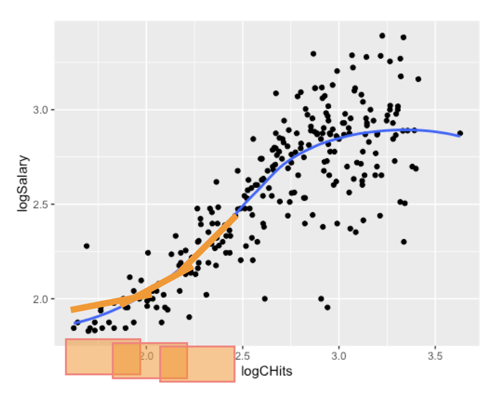
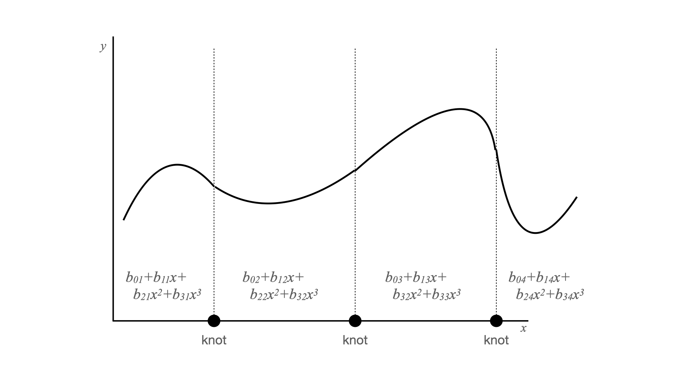
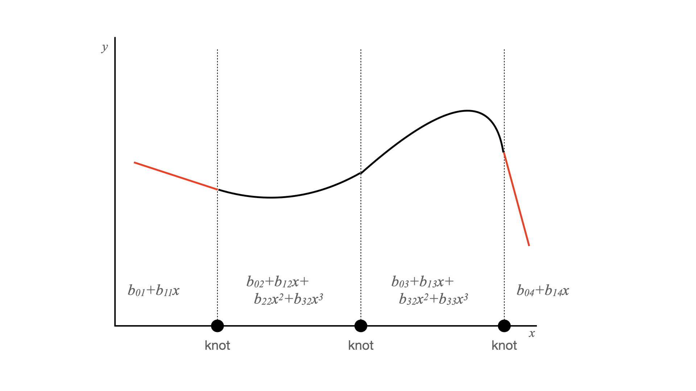

```{r, include = FALSE}
current_file <- knitr::current_input()
basename <- gsub(".Rmd$", "", current_file)

knitr::opts_chunk$set(
  fig.path = sprintf("images/%s/", basename),
  fig.width = 6,
  fig.height = 4,
  out.width = "100%",
  fig.align = "center",
  fig.retina = 3,
  echo = FALSE,
  warning = FALSE,
  message = FALSE,
  cache = FALSE,
  cache.path = "cache/"
)
```

```{r titleslide, child="assets/titleslide.Rmd"}
```

```{r}
library(tidyverse)
library(patchwork)
library(ISLR)
library(splines)
library(rpart)
library(GGally)
library(mgcv) #for fitting GAM
library(gratia) #for ggplot of GAM
```

---


.flex[
.w-45[
# Moving beyond linearity
Sometimes the relationships we discover are not linear... 
<br><br><br><br><br><br><br><br><br><br><br><br><br><br>

.font-smaller2[Image source: [XKCD](https://xkcd.com/2048/)]

]
.w-10[
]


]


---

# Moving beyond linearity

.flex[
- Consider the following Major League Baseball data from the 1986 and 1987 seasons.
- Would a linear model be appropriate for modelling the relationship between Salary and Career hits, captured in the variables `logSalary` and `logCHits`?


```{r, fig.retina = 4}

hits <- Hitters %>% 
        filter(CHits > 9) %>% 
        filter(!is.na(Salary)) %>%
        mutate(logSalary = log10(Salary), logCHits = log10(CHits))

ggplot(hits, aes(x=logCHits, y=logSalary)) + 
  geom_point(alpha = 0.2, size = 2) + 
  geom_smooth(method="lm", se = FALSE, size = 1.5) +
  theme_minimal(base_size = 18) 
```

]


---


.flex[
.w-50[
# Moving beyond linearity

- Perhaps a more flexible regression model is needed!
- Which of these is a better fit for this data, do you think?

```{r fig.retina=4, out.width="100%"}
ggplot(hits, aes(x=logCHits, y=logSalary)) + 
  geom_point(alpha = 0.2, size = 2) + 
  geom_smooth(method="lm", se = FALSE, size = 1.5) +
  theme_minimal(base_size = 18) 
```

]

```{r, fig.height=8, fig.retina=4, out.width="50%"}
p1 <- ggplot(hits, aes(x=logCHits, y=logSalary)) + 
      geom_point(alpha = 0.2, size = 2) + 
      geom_smooth(method = "lm", formula = y ~ splines::bs(x, df = 4), colour="orange", size=1.5, se = FALSE) +
      theme_minimal(base_size = 18) 

rt <- rpart(logSalary~logCHits, data=hits)
hits <- hits %>% mutate(hitsrt = predict(rt, hits))

p2 <- ggplot(hits, aes(x=logCHits, y=logSalary)) + 
      geom_point(alpha = 0.2, size = 2) + 
      geom_line(aes(y=hitsrt), colour="orange", size=1.5) +
      theme_minimal(base_size = 18)

p1/p2
```

]

---
# Flexible regression fits


The truth is rarely linear, but often the linearity assumption is sufficient and simple. When it's not ...

- local regression, sliding window with regression fitted to subsets;
- polynomial regression, obtained by raising each of the original predictors to a power;
- step functions, cut the range of a predictor into distinct regions;
- regression splines, combine polynomials and step functions fit different functions to different subsets of a predictor;
- smoothing splines, regression splines plus a smoothness penalty;
- .monash-orange2[generalized additive models], extend these approaches to multiple predictors.

offer a lot of flexibility, while maintaining the ease and interpretability of linear models.

---

.flex[
```{r fig.width=5, fig.height=3.5, out.width="100%", eval=FALSE}
ggplot(hits, aes(x=logCHits, y=logSalary)) +
         geom_point() +
  geom_smooth(se=FALSE)
```



.w-70[
# Local regression (smoothers)

Overlapping subsets of data, (weighted) regression on each subset. Overlap helps to smooth the fitted model.

A drawback of this approach is that it does not produce a functional form of the fitted model.

]
]
---
# Polynomial regression

Although it is simple to add an extra $x^2$ or $x^3$ to the model, it induces a problem of .monash-orange2[collinearity] among predictors. The solution is to use orthogonal polynomials. 

.flex[
```{r out.width="100%"}
hits_no_outliers <- hits %>%
  filter(CHits < 4000) %>%
  select(CHits) 
  
p_raw <- as_tibble(poly(hits_no_outliers$CHits, 
                        4, raw=TRUE))
ggscatmat(p_raw) + ggtitle("Polynomials")
```

```{r out.width="100%"}
p_orth <- as_tibble(poly(hits_no_outliers$CHits, 4))
ggscatmat(p_orth) + ggtitle("Orthonormal polynomials")
```
]

---
# Spline regression

.flex[

Fit a separate polynomial to different subsets.

<center>

</center>
]

.font_smaller2[[Data Science Deciphered: What is a Spline?](https://towardsdatascience.com/data-science-deciphered-what-is-a-spline-18632bf96646) has a lovely explanation.]
---
# Natural splines

.flex[

Fit a separate polynomial to different subsets, and constrain the fit at the boundary to be linear. <br><br>
Something like this illustration.
<center>

</center>
]

---
## Natural cubic splines with differing number of knots

```{r, warning = FALSE, message = FALSE, fig.height=6, fig.width=10, fig.retina=4, out.width="85%"}


p_0 <- ggplot(hits, aes(x=logCHits, y=logSalary)) + 
  geom_point(alpha = 0.2, size = 2) +
  stat_smooth(method = lm, formula = y ~ns(x, df = 1), 
              se = FALSE, colour = "orangered3") +
  ylim(c(1.5,3.2)) +
  theme_minimal(base_size = 18) +
  ggtitle("0 Knots") +
  theme(plot.title = element_text(hjust = 0.5)) +
  xlab("") +
  ylab("")


p_2 <- ggplot(hits, aes(x=logCHits, y=logSalary)) + 
  geom_point(alpha = 0.2, size = 2) +
  stat_smooth(method = lm, formula = y ~ns(x, df = 3), 
              se = FALSE, colour = "orangered3") +
  ylim(c(1.5,3.2)) +
  theme_minimal(base_size = 18) +
  ggtitle("2 Knots") +
  theme(plot.title = element_text(hjust = 0.5))

p_3 <- ggplot(hits, aes(x=logCHits, y=logSalary)) + 
  geom_point(alpha = 0.2, size = 2) +
  stat_smooth(method = lm, formula = y ~ns(x, df = 4), 
              se = FALSE, colour = "orangered3") +
  ylim(c(1.5,3.2)) +
  theme_minimal(base_size = 18) +
  ggtitle("3 Knots") +
  theme(plot.title = element_text(hjust = 0.5)) +
  xlab("") +
  ylab("")

p_8 <- ggplot(hits, aes(x=logCHits, y=logSalary)) + 
  geom_point(alpha = 0.2, size = 2) +
  stat_smooth(method = lm, formula = y ~ns(x, df = 9), 
              se = FALSE, colour = "orangered3") +
  ylim(c(1.5,3.2)) +
  theme_minimal(base_size = 18) +
  ggtitle("8 Knots") +
  theme(plot.title = element_text(hjust = 0.5)) +
  xlab("") +
  ylab("")


p_15 <- ggplot(hits, aes(x=logCHits, y=logSalary)) + 
  geom_point(alpha = 0.2, size = 2) +
  stat_smooth(method = lm, formula = y ~ns(x, df = 15), 
              se = FALSE, colour = "orangered3") +
  ylim(c(1.5,3.2)) +
  theme_minimal(base_size = 18) +
  ggtitle("14 Knots") +
  theme(plot.title = element_text(hjust = 0.5)) +
  xlab("") +
  ylab("")


p_50 <- ggplot(hits, aes(x=logCHits, y=logSalary)) + 
  geom_point(alpha = 0.2, size = 2) +
  stat_smooth(method = lm, formula = y ~ns(x, df = 49), se = FALSE, colour = "orangered3") +
  ylim(c(1.5,3.2)) +
  theme_minimal(base_size = 18) +
  ggtitle("48 Knots") +
  theme(plot.title = element_text(hjust = 0.5)) +
  xlab("") +
  ylab("")


(p_0 + p_2 + p_3) / (p_8 + p_15 + p_50)

```
---
# Comparison between splines and polynomials

.flex[
.w-90[

We can fit a polynomial with `poly()`, cubic spline using `splines::bs()`, and fit a natural cubic spline using `splines::ns()`. Notice end of the curves, and the beginning.

- Polynomial is fitting $x, x^2, \dots, x^{10}$.
- Spline is fitting degree 3 polynomial with added knots (breaks) for different functions in different subsets.
- Natural spline is fitting degree 3 polynomial, and knots with boundary forced to be linear.

]

```{r fig.height=5, fig.width=6, fig.retina=4, out.width="70%"}
p_ns_bs <- ggplot(hits, aes(x=logCHits, y=logSalary)) + 
  geom_point(alpha = 0.2, size = 2) +
  stat_smooth(method = lm, 
              formula = y ~ splines::ns(x, df = 10), 
              se = FALSE, aes(color = "#486030"),
              show.legend = TRUE) +
  stat_smooth(method = lm, 
              formula = y ~ splines::bs(x, df = 10), 
              se = FALSE, aes(color = "#a8c018"), 
              show.legend = TRUE) +
  stat_smooth(method = lm, formula = y ~ poly(x, 10),
              se = FALSE, aes(color = "#f0a800"), 
              show.legend = TRUE) +
  scale_color_manual(name='', 
          values=c("#486030", "#a8c018", "#f0a800"), 
          labels = c("Cubic spline", 
                      "Natural cubic spline",
                     "Polynomial")) +
  theme_minimal(base_size = 18) +
  theme(legend.position="bottom")
p_ns_bs
```

]

---
# Generalised additive models (GAMs)

It's really hard to fit a model of the form

$$y = f(x_1, x_2, \dots, x_p) + \varepsilon?$$
- Data is very sparse in high-dimensional space.
- Model assumes $p$-way interactions which are hard to estimate.
- Fit the model additively, is simpler, and still flexible, yet interpretable

<center>
.info-box[
$y_i=\beta_0+f_1(x_{i1})+f_2(x_{i2})+...+f_p(x_{ip})+\varepsilon_i$

where each $f$ is a smooth univariate function.
]
</center>


---
# Example: Baseball

.flex[
.w-50[
Scatterplots of `logSalary` vs predictors, with a loess smoother overlaid.

Strong nonlinear relationships with `logCHits` and moderate relationship with `Years`. No relationship with `Assists` and `Errors`.
]

.w-50[
```{r fig.width=6, fig.height=2.5, out.width="100%"}
ggduo(hits, columnsX=c(17,18), columnsY=21)
ggduo(hits, columnsX=c(22,7), columnsY=21)
```
]
]
---
# Example: Baseball

.flex[

.w-50[
Examine the predictors. There should be no strong associations, or outliers or clusters. 

<br><br>
Unfortunately, `logCHits` and `Years` are collinear.  
]

.w-50[
```{r fig.width=6, fig.height=6, out.width="80%"}
ggpairs(hits, columns=c(17,18,22,7))
```
]
]

---
# Example: Baseball

.flex[

.w-50[
$$\begin{align}
\log(\mbox{Salary}) & = \beta_0 + f_1(\mbox{log(CHits)})  \\
& + f_2(\mbox{Years}) + f_3(\mbox{Errors}) \\
& + f_4(\mbox{Assists}) + \varepsilon
\end{align}$$

<br>
<br>
```{r fig.retina=4, message = FALSE, warning = FALSE, echo = TRUE}
hits_gam <- 
  mgcv::gam(logSalary ~ #<<
        s(logCHits) +
        s(Years) +
        s(Errors) + 
        s(Assists), data = hits)
```

Estimated smooths from fitted model. (See [Gavin Simpson's explanations](https://gavinsimpson.github.io/gratia/articles/gratia.html).)
]

.w-50[
```{r echo=TRUE}
gratia::draw(hits_gam, residuals=TRUE)
```

]]

---
# Summarising the model fit

.scroll-800[
```{r}
summary(hits_gam)
```
]

---
# Summarising the model fit

.flex[
.w-50[


```{r hits-appraise, eval=FALSE, echo=TRUE}
gratia::appraise(hits_gam)
```

<br>

- Plot observed vs fitted: should be a strong association. .monash-blue2[(Mostly good, a few outliers.)]
- Histogram of residuals: should be bell-shaped. .monash-blue2[(Slightly left-skewed, with some unusually small values.)]
- Normal probability plot of residuals: if residuals are a sample from normal then these values form a straight line. .monash-blue2[(Good except for some low and high observations.)]
- Residuals vs fitted: roughly even vertical spread for all x values. .monash-blue2[(Not good, spread is heteroskedastic.)]

]

.w-50[
```{r ref.label="hits-appraise", fig.width=8, fig.height=7, out.width="100%"}
```
]
]

---
# Summary


- A GAM is a fit to functions of each predictor, and can be manually fitted using natural splines, or other functions.
- Coefficients are generally not interesting, the fitted functions are. 
-  The model can contain a mix of terms --- some linear, some nonlinear.
- GAMs are additive, although low-order interactions can be included in a natural way using, e.g. bivariate smoothers or interactions of the form `ns(age,df=5):ns(year,df=5)`.


---

```{r endslide, child="assets/endslide.Rmd"}
```

