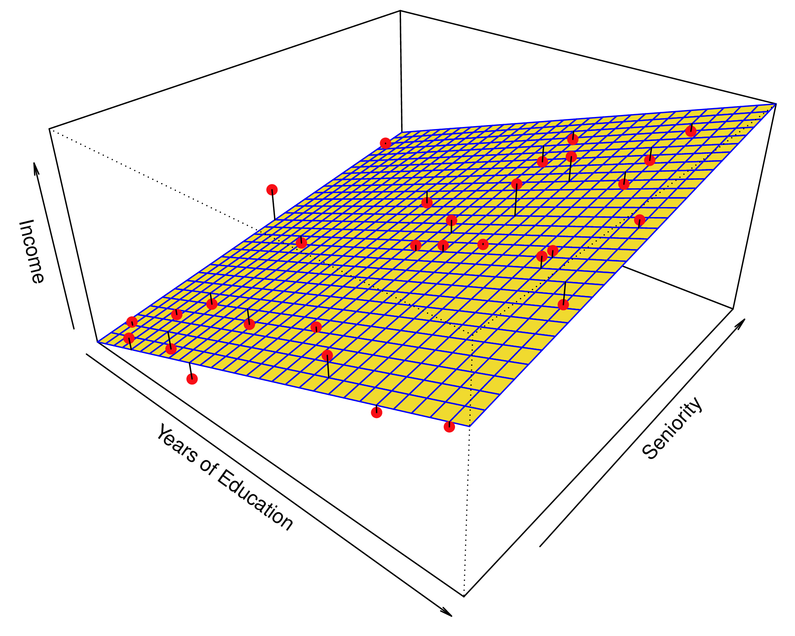
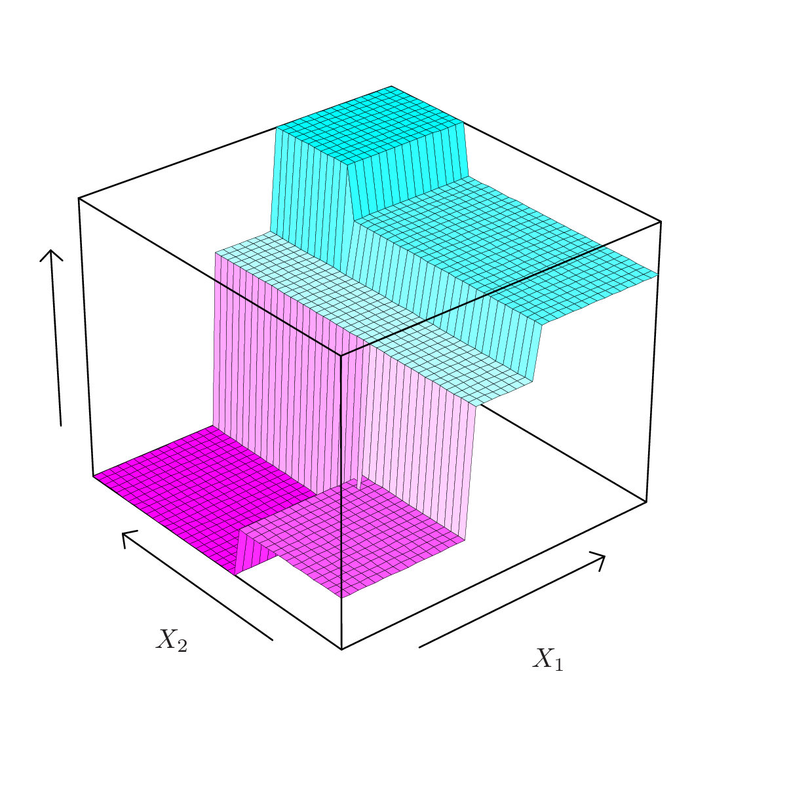

```{r, include = FALSE}
current_file <- knitr::current_input()
basename <- gsub(".Rmd$", "", current_file)

knitr::opts_chunk$set(
  fig.path = sprintf("images/%s/", basename),
  fig.width = 6,
  fig.height = 4,
  out.width = "100%",
  fig.align = "center",
  fig.retina = 3,
  echo = FALSE,
  warning = FALSE,
  message = FALSE,
  cache = FALSE,
  cache.path = "cache/"
)
```

```{r titleslide, child="assets/titleslide.Rmd"}
```

```{r}
library(ISLR)
library(tidyverse)
library(broom)
library(tidymodels) 
library(workflows)
library(purrr)
library(patchwork)
library(MASS)
library(kableExtra)
library(ggpubr)
library(mvtnorm)
library(rpart.plot)
```
---
# Difference with classification tree

The split criterion needs to use a quantitative response instead of categorical.

$$\mbox{MSE} = \frac{1}{n}\sum_{i=1}^{n} (y_i - \hat{y}_i)^2$$

Split the data where combining MSE for left bucket (MSE_L) and right bucket (MSE_R), makes the biggest reduction from the overall MSE. 

<br>
Note that, $\hat{y} = \bar{y}$ in regression trees.


---


## Predicting Salary

A regression tree to predict the `logSalary` of a baseball player, given their `Years` of playing and number of `Hits`.


```{r}
library(tidyverse)
library(tidymodels)
library(ISLR)
library(rpart)
library(rpart.plot)
Hitters <- Hitters %>% filter(!is.na(Salary)) %>%
  mutate(lSalary = log10(Salary))
```

```{r, echo = FALSE, results='markup'}
# Fit a regression tree
rpart_mod <- decision_tree(cost_complexity = 0.05) %>% 
  set_engine("rpart") %>% 
  set_mode("regression") %>% 
  translate()

hitters_fit <- 
  rpart_mod %>% 
  fit(lSalary ~ Hits+Years, 
      data = Hitters)

hitters_fit
```

---

class: split-two

.column[.pad50px[

## Predicting Salary

<br>

Using the function `rpart`, we can build a regression tree to predict the `logSalary` of a baseball player, given their `Years` of playing and number of `Hits`.

]]

.column[.content.vmiddle.center[

```{r}
prp(hitters_fit$fit, type = 3, ni = TRUE, 
    nn = TRUE, box.palette = "RdBu")
```
]]


---
## Regions of the decision tree


```{r out.width="60%", fig.width=7, fig.height=5}
library(viridis)
ggplot(Hitters, aes(x=Years, y=Hits, colour=lSalary)) + geom_point(alpha=0.7, size=3) +
  scale_colour_distiller("", palette="RdBu", direction = 1) +
  geom_vline(xintercept=4.5) + 
  annotate("segment", x=4.5, xend=25, y=117.5, yend=117.5) +
  annotate("text", x=c(2, 22, 22), y=c(240, 10, 200), label=c("2.2", "2.6", "2.9"), size=6)
```

```{r eval=FALSE}
ggplot(Hitters, aes(x=Years, y=lSalary)) +
  geom_point() + geom_vline(xintercept=4.5)
```

---

class: split-60

.column[.pad50px[

## Deeper trees

<br>

By decreasing the value of the complexity parameter `cp`, we can build deeper trees.

```{r, echo = TRUE}
# Fit a regression tree
rpart_mod2 <- 
  decision_tree(cost_complexity = 0.012) %>% 
  set_engine("rpart") %>% 
  set_mode("regression") %>% 
  translate()

hitters_fit2 <- 
  rpart_mod2 %>% 
  fit(lSalary ~ Hits+Years, 
      data = Hitters)

```

]]

.column[.content.vmiddle[


```{r, out.width="90%"}
prp(hitters_fit2$fit, type = 3, ni = TRUE, 
    nn = TRUE, box.palette = "RdBu")
```
]]

---

## Regions

```{r out.width="60%", fig.width=7, fig.height=5}
ggplot(Hitters, aes(x=Years, y=Hits, colour=lSalary)) + geom_point(alpha=0.7, size=3) +
  scale_colour_distiller("", palette="RdBu", direction = 1) +
  geom_vline(xintercept=4.5) + 
  geom_vline(xintercept=3.5) + 
  annotate("segment", x=0, xend=3.5, y=114, yend=114) +
  annotate("segment", x=4.5, xend=25, y=117.5, yend=117.5) +
  annotate("segment", x=6.5, xend=6.5, y=0, yend=118) 
```


---

## Regression trees - construction

- We divide the predictor space - that is, the set of possible values for $X_1,X_2, . . .,X_p$ - into $J$ .monash-orange2[distinct] and .monash-orange2[non-overlapping] regions, $R_1,R_2, . . . , R_M$.
- The regions could have any shape. However, for simplicity and for ease of interpretation, we divide the predictor space into high-dimensional .monash-orange2[rectangles].
- We model the response as a constant $c_j$ in each region
$f(x) = \sum_{j = 1}^J c_j ~ I(x \in R_m)$

e.g.

 $${R_1} = \{X | \mbox{Years} < 4.5 \}$$
 $${R_2} = \{X | \mbox{Years} \geq 4.5, \mbox{Hits} < 117.5 \}$$
 $${R_3} = \{X | \mbox{Years} \geq 4.5, \mbox{Hits} \geq 117.5 \}$$


---

class: split-two

.column[.pad50px[

## Leaves and Branches

<br>

- $R_1$, $R_2$, $R_3$ are .monash-orange2[terminal nodes] or .monash-orange2[leaves].
- The points where we split are .monash-orange2[internal nodes].
- The segments that connect the nodes are .monash-orange2[branches].

]]

.column[.content.vmiddle[


```{r out.width="90%"}
ggplot(Hitters, aes(x=Years, y=Hits, colour=lSalary)) + geom_point(alpha=0.7, size=3) +
  scale_colour_distiller("", palette="RdBu", direction = 1) + 
  geom_vline(xintercept=4.5) + 
  annotate("segment", x=4.5, xend=25, y=117.5, yend=117.5) +
  annotate("text", x=c(2, 22, 22), y=c(240, 10, 200), label=c("R1", "R2", "R3"), size=10)
```
]]


---

class: split-two

.column[.pad50px[

### Linear regression

$$\small{f(X) = \beta_0 + \sum_{j = 1}^p X_j	\beta_j}$$

<br>

<a href="http://www-bcf.usc.edu/~gareth/ISL/Chapter2/2.4.pdf" target="_BLANK"> </a>

.font_tiny[(Chapter 2/2.4)]
]]
.column[.pad50px[

### Regression trees

$$\small{f(X) = \sum_{m = 1}^M c_m ~ I(X \in R_m)}$$

<br>

<a href="http://www-bcf.usc.edu/~gareth/ISL/Chapter8/8.3.pdf" target="_BLANK">  </a>
]]

---
## Strategy for finding good splits

<br>

- .monash-orange2[Top-down]: it begins at the top of the tree (all observations belong to a single region) and then successively splits the predictor space; each split is indicated via two new branches further down on the tree.
- .monash-orange2[Greedy]: at each step of the tree-building process, the best split is made at that particular step, rather than looking ahead and picking a split that will lead to a better tree in some future step.

---
## Algorithm
<br>

1. Start with a single region $R_1$ (entire input space), and iterate:

    a. Select a region $R_m$, a predictor $X_j$ , and a splitting point $s$, such that splitting $R_m$ with the criterion $X_j < s$ produces the largest decrease in RSS
    
    b.  Redefine the regions with this additional split.
    
2. Continues until stopping criterion reached.

---
## Stopping criterion

<br>

- $N_m < a$: Number of observations in $R_m$ is too small to further splitting (`minsplit`). (There is usually another control criteria, even if $N_m$ is large enough, you can't split it small number of observations off, e.g. 1 and $N_m-1$, `minbucket`. )
- RSS $< tol$: If reduction of error is too small to bother splitting further. (`cp` parameter in `rpart` measures this as a proportional drop - see earlier examples displaying the change in this parameter. )


---

## Model fit

<br>

.monash-blue2[Residual Sum of Squared Error]

$$\mbox{RSS}(T) = \sum_{m = 1}^{|T|}  \sum_{x_i \in R_m} (y_i - \hat{y}_m)^2$$
where $|T|$ is the number of terminal nodes in $T$, and remember $\hat{y}=\bar{y}$. And MSE is obtained by dividing by $n$, and RMSE takes the square root.


---
 
## Size of tree

<br>

- It is possible to produce good predictions on the **training set**, but is likely to .monash-orange2[overfit] the data (trees are very flexible).
- A smaller tree with fewer splits (that is, fewer regions) might lead to .monash-orange2[lower variance] and better interpretation at the cost of a .monash-orange2[little bias].
- Tree size is a tuning parameter governing the **model’s complexity**, and the optimal tree size should be adaptively chosen from the data
- Produce splits only if RSS decrease exceeds some **(high) threshold** can mean that a low gain split early on, might stop the fitting, even though there may be a very good split later.

---
## Pruning

Grow a big tree, $T_0$, and then **prune** it back. The *pruning* procedure is:

- Starting with with the initial full tree $T_0$, replace a subtree with a leaf node to obtain a new tree $T_1$. Select subtree to prune by minimizing 
$$\frac{ \text{RSS}(T_1) - \text{RSS}(T_0) }{|T_1| - |T_0| }$$
- Iteratively prune to obtain a sequence $T_0, T_1, T_2, \dots, T_{R}$ where $T_{R}$ is the tree with a single leaf node.
- Select the optimal tree $T_m$ by cross validation


---
## Model selection

Using the `tune` package in tidymodels.

```{r fig.width=7, fig.height=4, out.width="50%"}
set.seed(2019)
hitters_split <- initial_split(Hitters, prop = 2/3)
hitters_tr <- training(hitters_split)
hitters_ts <- testing(hitters_split)

tune_spec <- 
  decision_tree(
    cost_complexity = tune(),
    min_n = tune()
  ) %>% 
  set_engine("rpart") %>% 
  set_mode("regression")

tree_grid <- grid_regular(cost_complexity(),
                          min_n(),
                          levels = 5)

set.seed(234)
hitters_folds <- vfold_cv(hitters_tr, 5)

set.seed(345)
tree_wf <- workflow() %>%
  add_model(tune_spec) %>%
  add_formula(lSalary~Hits+Years)

tree_res <- 
  tree_wf %>% 
  tune_grid(
    resamples = hitters_folds,
    grid = tree_grid
    )

tree_res %>%
  collect_metrics() %>%
  mutate(min_n = factor(min_n)) %>%
  filter(.metric == "rmse") %>%
  ggplot(aes(cost_complexity, mean, color = min_n)) +
  geom_line(size = 1.5, alpha = 0.6) +
  geom_point(size = 2) +
  scale_x_log10(labels = scales::label_number()) +
  scale_color_viridis_d(option = "plasma", begin = .9, end = 0)


```

```{r}
best_tree <- tree_res %>%
  select_best("rmse")

best_tree

```


```{r out.width="80%", fig.width=6, fig.height=4, eval=FALSE}
set.seed(20190407)
library(caret)
hitters <- Hitters %>% filter(!is.na(Salary))
tr_indx <- createDataPartition(hitters$lSalary)$Resample1
hitters_tr <- hitters[tr_indx,]
hitters_ts <- hitters[-tr_indx,]
hitters_bigrp <- rpart(lSalary~Hits+Years, data=hitters_tr, control=rpart.control(minsplit=6, cp=0.005))
#prp(hitters_bigrp)

MSE_tr <- sum((hitters_tr$lSalary-predict(hitters_bigrp))^2)/length(hitters_tr$lSalary)
MSE_ts <- sum((hitters_ts$lSalary-predict(hitters_bigrp, hitters_ts))^2)/length(hitters_ts$lSalary)
nnodes <- max(hitters_bigrp$cptable[,2])+1
cp <- c(0.006, 0.007, 0.008, 0.009, 0.01, 0.02, 0.03, 0.04, 0.05, 0.1, 0.5)
for (i in 1:length(cp)) {
  hitters_rp <- rpart(lSalary~Hits+Years, data=hitters_tr, control=rpart.control(minsplit=6, cp=cp[i]))
  MSE_tr <- c(MSE_tr, sum((hitters_tr$lSalary-predict(hitters_rp))^2)/length(hitters_tr$lSalary))
  MSE_ts <- c(MSE_ts, sum((hitters_ts$lSalary-predict(hitters_rp, hitters_ts))^2)/length(hitters_ts$lSalary))
  nnodes <- c(nnodes, max(hitters_rp$cptable[,2])+1)
}
hitters_fit <- tibble(nnodes, train=MSE_tr, test=MSE_ts, cp=c(0.005, cp)) %>% 
  gather(type, MSE, -nnodes, -cp) 
ggplot(hitters_fit, aes(x=nnodes, y=MSE, colour=type)) + 
  geom_line() + scale_colour_brewer("", palette="Dark2") +
  xlab("Size of tree") +
  geom_vline(xintercept=5)
```

---

Yielding this model: 

```{r out.width="80%"}
final_wf <- 
  tree_wf %>% 
  finalize_workflow(best_tree)

final_tree <- 
  final_wf %>%
  fit(data = hitters_tr) %>%
  pull_workflow_fit()

prp(final_tree$fit, type = 3, ni = TRUE, 
    nn = TRUE, box.palette = "RdBu")
```

---
# Reminder of what the training data looks like

```{r out.width="70%"}
ggplot(hitters_tr, aes(x=Years, y=Hits, colour=lSalary)) + geom_point(alpha=0.7, size=3) +
  scale_colour_distiller("", palette="RdBu", direction = 1)
```

---
class: transition middle center
# Summary

Regression trees can provide a very flexible model.

---

```{r endslide, child="assets/endslide.Rmd"}
```
