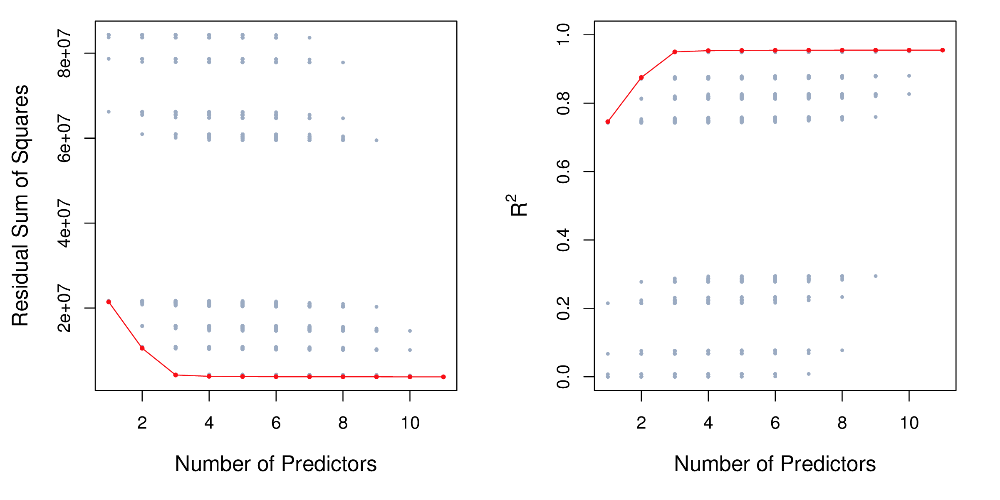
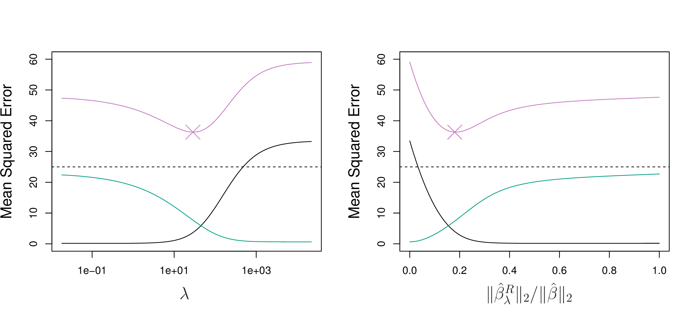
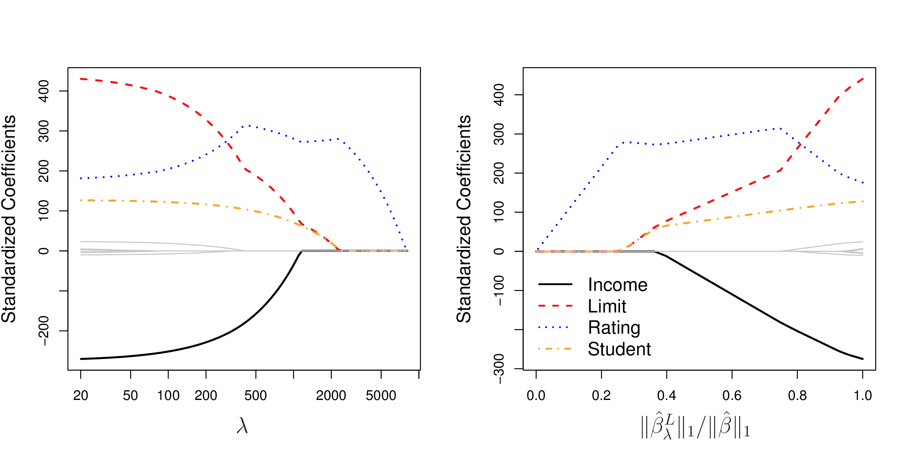

```{r, include = FALSE}
current_file <- knitr::current_input()
basename <- gsub(".Rmd$", "", current_file)

knitr::opts_chunk$set(
  fig.path = sprintf("images/%s/", basename),
  fig.width = 6,
  fig.height = 4,
  out.width = "100%",
  fig.align = "center",
  fig.retina = 3,
  echo = FALSE,
  warning = FALSE,
  message = FALSE,
  cache = FALSE,
  cache.path = "cache/"
)
```

```{r titleslide, child="assets/titleslide.Rmd"}
```

---
# Too many variables

Fitting a linear regression model requires:

\begin{align*}
		%\underset{{\beta} \in \mathbb{R}^{p} }{\operatorname{minimize}}~& \sum_{i = 1}^n (y_i - \beta_0 - \sum_{j = 1}^p \beta_j x_{ij})^2 \\
		\underset{{\beta} \in \mathbb{R}^{p} }{\text{minimize}}& \left\{ \sum_{i = 1}^n \left(y_i - \beta_0 - \sum_{j = 1}^p \beta_j x_{ij} \right)^2 \right\} \\
		\equiv \underset{{\beta} \in \mathbb{R}^{p} }{\operatorname{minimize}}~& ({y} - {X}{\beta})' ({y} - {X}{\beta}) 
\end{align*}

The least square solution for $\beta$ is

$$ {\hat \beta} = \color{orange}{({X}' {X})^{-1}} {X}' {y} $$

To .monash-orange2[invert] a matrix, requires it to be .monash-orange2[full rank].

---

# Example: Using simulation

- 20 observations
- 2 classes: A, B
- One variable with separation, 99 noise variables

```{r out.width="100%", fig.width=8, fig.height=3}
library(tidyverse)
library(gridExtra)
set.seed(20190428)
tr <- matrix(rnorm(20*100),ncol=100)
colnames(tr) <- paste0("x", 1:100)
tr[1:10,1] <- tr[1:10,1]+5
tr <- apply(tr, 2, function(x) (x-mean(x))/sd(x))
tr <- as_tibble(tr) %>% mutate(cl=c(rep("A",10), rep("B",10)))
p1 <- ggplot(data=tr, aes(x=x1, y=x2, colour=cl, shape=cl)) + 
  geom_point(size=3) + 
  scale_color_brewer(palette="Dark2") +
  theme_bw() + 
  theme(legend.position="none", aspect.ratio=1) +
  ggtitle("Gap in x1")
p2 <- ggplot(data=tr, aes(x=x2, y=x3, colour=cl, shape=cl)) + 
  geom_point(size=3) + 
  scale_color_brewer(palette="Dark2") +
  theme_bw() + 
  theme(legend.position="none", aspect.ratio=1) +
  ggtitle("Noise")
grid.arrange(p1, p2, ncol=2)

# Generate test data
ts <- matrix(rnorm(10*100),ncol=100)
colnames(ts) <- paste0("x", 1:100)
ts[1:5,1] <- ts[1:5,1]+5
ts <- apply(ts, 2, function(x) (x-mean(x))/sd(x))
ts <- as_tibble(ts) %>% mutate(cl=c(rep("A",5), rep("B",5)))
```

.monash-orange2[What will be the optimal LDA coefficients?]

---

Fit linear discriminant analysis on .monash-orange2[first two variables].

```{r}
library(MASS)
tr_lda <- lda(cl~., data=tr[,c(1:2,101)], prior=c(0.5,0.5))
tr_lda
```

Coefficient for `x1` MUCH higher than `x2`. .monash-orange2[As expected!]

---
class: split-50

.column[.pad50px[
Predict the training and test sets


```{r}
tr_p <- predict(tr_lda, tr)
table(tr_p$class, tr$cl)

ts_p <- predict(tr_lda, ts)
table(ts_p$class, ts$cl)
```

```{r out.width="80%", fig.width=4, fig.height=2}
ggplot(data=data.frame(LD1=tr_p$x, cl=tr$cl), aes(x=LD1, y=cl)) +
         geom_point(size=5, alpha=0.5) +
         ylab("Class") + xlim(c(-10,10)) +
  geom_point(data=data.frame(LD1=ts_p$x, cl=ts$cl), 
             shape=2, size=5, colour="red")
```


]]
.column[.pad50px[
```{r out.width="150%"}
library(memer)
meme_get("AllTheThings") %>% meme_text_bottom(txt="Beauty!")
```
]]

---
class: transition middle center

### What happens to test set (and predicted training values) as number of noise variables increases

---

```{r, animation.hook='gifski', out.width="100%", fig.width=4, fig.height=2}
for (i in 2:20) {
  tr_lda <- lda(cl~., data=tr[,c(1:i,101)], prior=c(0.5,0.5))
  tr_p <- predict(tr_lda, tr)
  ts_p <- predict(tr_lda, ts)
  t1 <- table(tr$cl, tr_p$class)
  t2 <- table(ts$cl, ts_p$class)
  tr_err <- (t1[1,2]+t1[2,1])/sum(t1)
  ts_err <- (t2[1,2]+t2[2,1])/sum(t2)

  print(
    ggplot(data=data.frame(LD1=tr_p$x, cl=tr$cl), aes(x=LD1, y=cl)) +
         geom_point(size=5, alpha=0.5) +
         ylab("Class") + xlim(c(-10,10)) +
      geom_point(data=data.frame(LD1=ts_p$x, cl=ts$cl), 
             shape=2, size=5, colour="red") +
      ggtitle(paste0("p = ", i, " train = ", tr_err, " test = ", ts_err))
  )
}
```

---

class: transition middle center
### What happens to the estimated coefficients as dimensions of noise increase?

Remember, the noise variables should have coefficient = ZERO.

---
```{r, animation.hook='gifski', out.width="100%", fig.width=6, fig.height=3}
for (i in 2:20) {
  tr_lda <- lda(cl~., data=tr[,c(1:i,101)], prior=c(0.5,0.5))
  coef <- tibble(var=colnames(tr)[1:20], coef=c(1,rep(0,19)))
  coef$var <- factor(coef$var, levels=c(paste0("x",1:20)))
  coef$coef[1:i] <- abs(tr_lda$scaling)/sqrt(sum(tr_lda$scaling^2))
  print(
    ggplot(data=coef, aes(x=var, y=coef)) +
    geom_col() + ylim(c(0,1)) + xlab("Variable") + 
    ylab("Coefficient") +
    ggtitle(paste0("p = ", i))
  )
}
```

---
class: transition middle

# How do we tackle high-dimension, low sample size problems?

---
# Subset selection

Identify a subset $s$ of the $p$ predictors, most related to response.

\begin{align*}
	& \underset{{\beta}}{\text{minimize}} \left\{ \sum_{i = 1}^n \left(y_i - \beta_0 - \sum_{j = 1}^p \beta_j x_{ij} \right)^2 \right\} \\
	& \text{subject to}\sum_{j = 1}^p {I}(\beta_j \neq 0) \leq k, \quad  k \geq 0.
\end{align*}
where $k \geq 0$ is a tuning parameter.

- Need to consider ${p \choose k}$ models containing $s$ predictors computationally infeasible when $p$ and $s$ are large
- Stepwise procedures: forward, backward, etc.

---

# Model fit statistics

These can be used to decide on choice  of $k$.

- $MSE = RSS/n$, but the training $MSE$ is an under-estimate of test $MSE$, and it will decrease with larger $p$.
- Methods for adjusting the training error for model size include Mallows $C_p$, Akaike Information Criterion (AIC), Bayesian Information Criterion (BIC) and adjusted $R^2$.

<center>
<a href="http://www-bcf.usc.edu/~gareth/ISL/Chapter6/6.2.pdf" target="_BLANK">  </a>
</center>

---

# Mallows $C_p$

<br>

For a fitted least squares model containing $d$ predictors, a reasonable estimate of the test MSE is:

$$C_p = \frac{1}{n} (RSS+2d\hat{\sigma}^2)$$
where $\hat{\sigma}^2$ is an estimate of the variance of the error $\varepsilon$, computed from the full model containing all predictors. 

The additional part penalises the training RSS to adjust for the under-estimation of test error.


---
# AIC and BIC

<br>

$$AIC = \frac{1}{n\hat{\sigma}^2} (RSS+2d\hat{\sigma}^2)$$
and hence is $\propto C_p$. 

$$BIC = \frac{1}{n\hat{\sigma}^2} (RSS+\log(n)d\hat{\sigma}^2)$$

all tend to take on low values for models with small test error.


---
# Adjusted $R^2$

<br>
<br>

$$\mbox{Adjusted }R^2 = 1-\frac{RSS/(n-d-1)}{TSS/(n-1)}$$

The intuition is that once all of the correct variables have been included in the model, adding additional *noise* variables will lead to only a very small decrease in RSS.

---

# Best subset selection algorithm

<br>

1. Let ${\mathcal M}_o$ denote the null model, which contains no predictors. This
model simply predicts the sample mean for each observation.
2. For $k=1,2,...,p$:<br>
    a. Fit all ${p \choose k}$ models that contain exactly $k$ predictors.<br>
    b. Pick the best among these ${p \choose k}$ models, and call it ${\mathcal M}_k$. Best means smallest RSS (or largest $R^2$).
3. Select a single best model from among ${\mathcal M}_o$, . . . , ${\mathcal M}_p$ using cross- validated prediction error, $C_p$ (AIC), BIC, or adjusted $R^2$.

---
# Best subset selection algorithm


.monash-orange2[Best subset selection] algorithm applied to the 11 predictors of the Credit data.

<center>
<a href="http://www-bcf.usc.edu/~gareth/ISL/Chapter6/6.1.pdf" target="_BLANK">  </a>
</center>

.font_smaller2[(Chapter 6/6.1)]

---
# Forward stepwise selection 

.monash-orange2[Forward stepwise selection] is a computationally efficient alternative to best subset selection. It considers a much smaller set of models.

When $p = 20$, best subset selection requires fitting 1,048,576 models, whereas forward stepwise selection requires fitting only 211 models.

---

# Forward stepwise selection - algorithm

<br>

1. Let ${\mathcal M}_o$ denote the null model, which contains no predictors. This
model simply predicts the sample mean for each observation.
2. For $k=0,1,2,...,p-1$:<br>
    a. Consider all ${p - k}$ models that augment ${\mathcal M}_k$ with *one additional predictor*.<br>
    b. Pick the best among these ${p - k}$ models, and call it ${\mathcal M}_{k+1}$. Best means smallest RSS (or largest $R^2$).
3. Select a single best model from among ${\mathcal M}_o$, . . . , ${\mathcal M}_p$ using cross- validated prediction error, $C_p$ (AIC), BIC, or adjusted $R^2$.

---

# Shrinkage methods

<br>


.monash-orange2[Shrinkage methods] fit a model containing all $p$ predictors using a technique that constrains or regularizes the coefficient estimates, or equivalently, that .monash-orange2[shrinks some of the coefficient estimates towards zero].

<br>
.tip[There are two main methods: .monash-orange2[Ridge] regression and .monash-orange2[Lasso].]


---

# Ridge regression

\begin{align*}
	& \mbox{RSS} =  \sum_{i = 1}^n \left(y_i - \beta_0 - \sum_{j = 1}^p \beta_j x_{ij} \right)^2 
\end{align*}

Least squares: 

\begin{align*}
	& \underset{{\beta}}{\text{minimize}} \mbox{ RSS}
\end{align*}

.monash-orange2[Ridge] regression: 

\begin{align*}
	& \underset{{\beta}}{\text{minimize}} \mbox{ RSS} \color{orange}{+ \lambda \sum_{j=1}^p \beta_j^2}
\end{align*}
where $\lambda \geq 0$ is a tuning parameter.

---
# Ridge regression

$$\lambda \sum_{j=1}^p \beta_j^2$$ 
is called a .monash-orange2[shrinkage penalty]. It is small when $\beta_1, ..., \beta_p$ are close to 0.

$\lambda$ serves as a .monash-orange2[tuning parameter], controlling the relative impact of these two terms on the regression coefficient estimates. When it is 0, the penalty term has no effect on the fit. 

Ridge regression will produce a .monash-orange2[different set of coefficients] for each $\lambda$, call them $\hat{\beta}_{\lambda}^R$. Tuning $\lambda$, typically by cross-validation, is critical component of fitting the model. 


---
class: split-60
layout: false

.column[.pad10px[
.monash-orange2[Standardized ridge regression coefficients for the Credit data set. ]


<a href="http://www-bcf.usc.edu/~gareth/ISL/Chapter6/6.4.pdf" target="_BLANK">  </a>

.font_smaller2[(Chapter6/6.4.pdf)]

```{r}
library(ISLR)
data(Credit)
```
]]
.column[.top50px[

- $p=10$
- Left side of plot corresponds to least squares.
- When $\lambda$ is extremely large, then all of the ridge coefficient estimates are basically zero, which is the null model.
- 4 of 10 variables have larger coefficients, and one, Rating, initially increases with $\lambda$. 
- Right-side plot, $x$-axis indicates amount the coefficients shrink to 0, value of 1 indicates LS.
]]


---
class: split-50
layout: false

.column[.pad10px[

The scale of variables can affect ridge regression performance.

.monash-orange2[It is important to standardise the scale of predictors prior to ridge regression.]


$$\tilde{x}_{ij} = \frac{x_{ij}}{\sigma_{x_{j}}}$$
]]
.column[.pad10px[

Simulation scenario! Ridge regression improves on least squares, for large number of variables, in the bias-variance tradeoff. It .monash-orange2[sacrifices some bias] for the benefit of .monash-orange2[decreased variance].  

<a href="http://www-bcf.usc.edu/~gareth/ISL/Chapter6/6.5.pdf" target="_BLANK">  </a>

.black[bias]
.green[variance]
.purple[test error]


.font_smaller2[(Chapter6/6.5.pdf)]

]]
---
# The Lasso

Ridge regression: 

\begin{align*}
	& \underset{{\beta}}{\text{minimize}} \mbox{ RSS} + \lambda \sum_{j=1}^p \beta_j^2
\end{align*}

.monash-orange2[Lasso:]

\begin{align*}
	& \underset{{\beta}}{\text{minimize}} \mbox{ RSS} + \lambda \sum_{j=1}^p \color{orange}{|\beta_j|}
\end{align*}

and same $\lambda \geq 0$ is a tuning parameter.


---
class: split-60
layout: false

.column[.pad10px[
Standardized lasso coefficients for the Credit data set. 

<a href="http://www-bcf.usc.edu/~gareth/ISL/Chapter6/6.6.pdf" target="_BLANK">  </a>

.font_smaller2[(Chapter6/6.6.pdf)]

```{r}
library(ISLR)
data(Credit)
```
]]
.column[.top50px[

- $p=10$
- Has the effect of forcing some variables exactly to 0.
- Cleaner solution than ridge regression.
]]

---

# Simulation scenario! 

Bias-variance tradeoff with lasso, and comparison against ridge regression.


<center>
<a href="http://www-bcf.usc.edu/~gareth/ISL/Chapter6/6.8.pdf" target="_BLANK">  </a>
</center>

.center[
.black[Bias]
.green[Variance]
.purple[Test error]]


.font_smaller2[(Chapter6/6.5.pdf)]


---
class: transition middle

# Examples of regularised techniques

---
# Penalised LDA

Recall: LDA involves the eigen-decomposition of $\color{orange}{\Sigma^{-1}\Sigma_B}$, where

$$\small{\Sigma_B = \frac{1}{K}\sum_{i=1}^{K} (\mu_i-\mu)(\mu_i-\mu)'}$$

$$\small{\Sigma = \frac{1}{n} \sum_{i=1}^{n} (x_i-\mu_i)(x_i-\mu_i)'}$$

The eigen-decomposition is an analytical solution to a sequential optimisation problem: 


\begin{align*}
& \small{\underset{{\beta_k}}{\text{maximize}}~~ \beta_k^T\hat{\Sigma}_B \beta_k} \\
& \small{\mbox{ subject to  }  \beta_k^T\hat{\Sigma} \beta_k \leq 1, ~~\beta_k^T\hat{\Sigma}\beta_j = 0 \mbox{  } \forall i<k}
\end{align*}


---
# Penalised LDA

The problem is inverting $\color{orange}{\Sigma^{-1}}$, fix it by

\begin{align*}
& \underset{{\beta_k}}{\text{maximize}} \left(\beta_k^T\hat{\Sigma}_B \beta_k + \lambda_k \sum_{j=1}^p |\hat{\sigma}_j\beta_{kj}|\right)\\
& \mbox{ subject to  }  \beta_k^T\tilde{\Sigma} \beta_k \leq 1
\end{align*}

where $\hat{\sigma}_j$ is the within-class standard deviation for variable $j$. This is 
.orange[penalised LDA], and see [reference](https://faculty.washington.edu/dwitten/Papers/JRSSBPenLDA.pdf), and the [R package](https://cran.r-project.org/web/packages/penalizedLDA/index.html). 

```{r}
library(penalizedLDA)
```


---
# PDA Index

<br>

Penalised LDA projection pursuit index. Available in the `tourr` package. 

\begin{align*}
I_{PDA}(A,\lambda) =
1-\frac{\Big|A'\big\{(1-\lambda)\hat{\Sigma}+n\lambda I_p\big\}A\Big|} {\Big|A'\big\{(1-\lambda)(\hat{\Sigma}_B +\hat{\Sigma})+n\lambda I_p\big\} A\Big|}
\end{align*}

Optimising this function over $p\times d$ projection matrix $A$. 

```{r}
library(tourr)
```

---
# Lasso regression

Read the example of lasso regression or watch the screencast by Julia Silge [here](https://juliasilge.com/blog/lasso-the-office/)

<center>
<iframe width="720" height="405" src="https://www.youtube.com/embed/R32AsuKICAY" title="YouTube video player" frameborder="0" allow="accelerometer; autoplay; clipboard-write; encrypted-media; gyroscope; picture-in-picture" allowfullscreen></iframe>
</center>
---

```{r endslide, child="assets/endslide.Rmd"}
```
