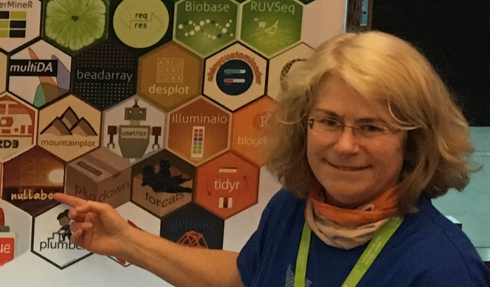

```{r, include = FALSE}
current_file <- knitr::current_input()
basename <- gsub(".Rmd$", "", current_file)

knitr::opts_chunk$set(
  fig.path = sprintf("images/%s/", basename),
  fig.width = 6,
  fig.height = 4,
  out.width = "100%",
  fig.align = "center",
  fig.retina = 3,
  echo = FALSE,
  warning = FALSE,
  message = FALSE,
  cache = FALSE,
  cache.path = "cache/"
)
```

```{r titleslide, child="assets/titleslide.Rmd"}
```

---

class: transition 

# About this class

---
# Meet the team

.border-box.monash-border-blue.w-30[
Me - Hi! Responsible for everything.


]

.border-box.monash-border-blue.w-20[
Kenji - Tutoring four sessions.


]

.border-box.monash-border-blue.w-25[
Patrick - Tutoring three sessions.


]

.border-box.monash-border-blue.w-20[
Shin (data analyst at EY) - Tutoring two sessions.


]

---
class: monash-slide
background-image: url("images/bg-06.png")
# Where to find things

- Moodle: zoom links, quizzes, assignments, marks, discussion forum, and announcements
- Website (https://iml.numbat.space) schedule, lecture slides, tutorial instructions 
- Textbook (https://www.statlearning.com) free pdf online, data and code (we will use more modern coding style though)
- Got questions? Post in the discussion forum. Of a .monash-blue2[private] nature (e.g. about marks) you can send email to .monash-orange2[etc3250-clayton-x@monash.edu].

---
class: monash-slide
background-image: url("images/bg-06.png")
# Computing

- Using [R](https://cran.r-project.org) (2021-02-15, Lost Library Book) and the [RStudio](https://rstudio.com) (1.4.1103) interface
- Slides are made in [Rmarkdown](https://rmarkdown.rstudio.com), [xaringan](https://github.com/yihui/xaringan) style, using a [monash](https://github.com/numbats/monash) theme made by [Emi Tanaka](https://emitanaka.org), best viewed as html.
- The code for creating examples in the lecture slides can be found in the `Rmd` file. Look for the code blocks in the Rmd like


```
  library(tidyverse)
  library(gapminder)
  library(gridExtra)
```

---
# Learning objectives

- .monash-blue2[Select and develop] appropriate models for regression, classification or clustering
--

- .monash-blue2[Estimate and simulate] from a variety of statistical models, and measure the uncertainty of a prediction using resampling methods
--

-  Manage large data sets in a modern software environment, and .monash-blue2[explain and interpret] the analyses undertaken clearly and effectively
--

- .monash-blue2[Apply] business analytic tools to produce innovative solutions in finance, marketing, economics and related areas

---
# How to do well in this class

.aim-box[Come to class]
--

.code-box[Work through tutorial exercises]
--

.question-box[Bring questions to consultation]
--

.think-box[Read ahead in the textbook, and attempt some of the questions]
--

.aim-box[Start assignments early!]

--
.question-box[Ask and answer questions in the discussion forum]

--
.work-box[Do the weekly quizzes]

--

.idea-box[Don't procrastinate - if you don't understand something or can't work how to do a problem, ask, get help, no question is too simple or stupid!]

---
class: hide-slide-number
# Where this material fits in your career skills development

.grid[
.column[
.blockquote[
See the **Math and Statistics** box: machine learning, statistical modeling, supervised and unsupervised learning. 
]
.blockquote[And also the **Communication and Visualisation** box: Translate data-driven insights into decisions and actions, plotting using ggplot2.
]
]


]

---
# If you like this course, what others could you do

.info-box[**ETC3555/5555 - Statistical Machine Learning**: This unit covers the methods and practice of statistical machine learning for modern data analysis problems. Topics covered will include recommender systems, social networks, text mining, matrix decomposition and completion, and sparse multivariate methods. All computing will be conducted using the R programming language.]

.info-box[**ETC3580/5580 - Advanced Statistical Modelling**: This unit introduces extensions of linear regression models for handling a wide variety of data analysis problems. Three extensions will be considered: generalised linear models for handling counts and binary data; mixed-effect models for handling data with a grouped or hierarchical structure; and non-parametric regression for handling non-linear relationships. All computing will be conducted using R. ]

---

class: transition 

# Introduction to machine learning

---
# Notation 1/6

$n$ number of observations or sample points

$p$ number of variables or the dimension of the data

A data matrix is denoted as:
\begin{align*}
{\mathbf X}_{n\times p}= ({\mathbf x}_1 ~ {\mathbf x}_2 ~ \dots  ~ {\mathbf x}_p) = \left(\begin{array}{cccc} 
x_{11} & x_{12} & \dots & x_{1p} \\
x_{21} & x_{22} & \dots & x_{2p} \\
\vdots & \vdots & \ddots & \vdots \\
x_{n1} & x_{n2} & \dots & x_{np} \end{array} \right)
\end{align*}

---
# Notation 2/6

The $i^{th}$ observation is denoted as

\begin{align*}
x_i = \left(\begin{array}{c}
x_{i1} \\ x_{i2} \\ \vdots \\ x_{ip} \\
\end{array} \right)
\end{align*}

The $j^{th}$ variable is denoted as

\begin{align*}
x_j = \left(\begin{array}{c}
x_{1j} \\ x_{2j} \\ \vdots \\ x_{nj} \\
\end{array} \right)
\end{align*}

And we will also use $X_j$ to *abstractly* represent independent (predictor or input) variable $j$.


---
# Notation 3/6

The response vector, when it exists, is denoted as

\begin{align*}
{\mathbf y} = \left(\begin{array}{c}
y_{1} \\ y_{2} \\ \vdots \\ y_{n} \\
\end{array} \right)
\end{align*}

And we will also use $Y$ to *abstractly* represent the response, or output variable. <br> <br>

An observation can then be written as 

$$\mathcal{D} = \{(y_i, x_i)\}_{i = 1}^n = \{(y_1, x_1), (y_2, x_2), \dots, (y_n, x_n)\}$$ 

where $x_i$ is a vector with $p$ elements.

---
# Notation 4/6

A transposed data matrix is denoted as
\begin{align*}
{\mathbf X}^T_{p\times n} = \left(\begin{array}{cccc} 
x_{11} & x_{21} & \dots & x_{n1} \\
x_{12} & x_{22} & \dots & x_{n2} \\
\vdots & \vdots & \ddots & \vdots \\
x_{1p} & x_{2p} & \dots & x_{np} \end{array} \right)
\end{align*}

and 

\begin{align*}
x^T_i = \left(\begin{array}{cccc}
x_{i1} & x_{i2} & \dots & x_{ip} \\
\end{array} \right)
\end{align*}

---
# Notation 5/6

If ${\mathbf y}$ is categorical, with $K$ levels, it can be useful to write it as a binary matrix

\begin{align*}
{\mathbf Y}_{n\times K} = \left(\begin{array}{cccc} 
1 & 0 & \dots & 0 \\
\vdots & \vdots &  & \vdots \\
1 & 0 &  & 0 \\
0 & 1 & \dots & 0 \\
\vdots & \vdots &  & \vdots \\
0 & 1 & \dots & 0 \\
0 & 0 & \dots & 1 \\
\vdots & \vdots &  & \vdots \\
0 & 0 & \dots & 1 \\
\end{array} \right)
\end{align*}

---
# Matrix multiplication

.grid[
.column[
Suppose that 

\begin{align*}
{\mathbf A}_{2\times 3} = \left(\begin{array}{ccc} 
1 & 2 & 3 \\
4 & 5 & 6 \\ \end{array} \right)
\end{align*}

\begin{align*}
{\mathbf B}_{3\times 4} = \left(\begin{array}{cccc} 
-1 & -2 & -3 & -4\\
-5 & -6 & -7 & -8\\
-9 & -10 & -11 & -12\\ \end{array} \right)
\end{align*}

then 

\begin{align*}
{\mathbf A}{\mathbf B}_{2\times 4} = \left(\begin{array}{cccc} 
-38 & -44 & -50 & -56\\
-83 & -98 & -113 & -128\\ \end{array} \right)
\end{align*}

*Pour the rows into the columns.* 

Note: You can't do ${\mathbf B}{\mathbf A}$!
]
.column[

Using R as a matrix calculator

```{r echo=T, eval=FALSE}
a <- matrix(c(1,2,3,4,5,6), 
            ncol=3, byrow=T)
b <- -1*matrix(c(1,2,3,4,5,6, 
                 7,8,9,10,11,12),
               ncol=4,byrow=T)
a%*%b
```
]
]
---
# Inverting a matrix 

Suppose that ${\mathbf A}$ is square 

\begin{align*}
{\mathbf A}_{2\times 2} = \left(\begin{array}{cc} 
a & b  \\
c & d \\ \end{array} \right)
\end{align*}

then the inverse is (if $ad-bc \neq 0$)

\begin{align*}
{\mathbf A}^{-1}_{2\times 2} = \frac{1}{ad-bc} \left(\begin{array}{cc} 
d & -b \\
-c & a \\ \end{array} \right)
\end{align*}

and ${\mathbf A}{\mathbf A}^{-1} = I$ where

\begin{align*}
{\mathbf I}_{2\times 2} = \left(\begin{array}{cc} 
1 & 0 \\
0 & 1 \\ \end{array} \right)
\end{align*}

---
# Notation 6/6

$d (\leq p)$ is used to denote the number of variables in a lower dimensional space, usually by taking a projection.

$A$ is a $p\times d$ orthonormal basis, $A^TA=I_d$ ( $A'A=I_d$ ).

The projection of ${\mathbf x_i}$ onto $A$ is $A^T{\mathbf x}_i$.


---
# Different types of learning 

.grid[
1. Supervised learning: $y_i$ is .monash-orange2[available] for all $x_i$
    - Regression: quantitative $y_i$
    - Classification: categorical $y_i$ <br><br>
2. Unsupervised learning: $y_i$ .monash-orange2[unavailable] for all $x_i$ <br><br>
3. Semi-supervised learning: $y_i$ available for some $x_i$ (not covered in this unit) <br><br><br><br>
.info-box[Being able to recognise the type of problem is an important skill.]

```{r fig.width=6, fig.height=6, fig.align='center'}
library(tidyverse)
library(gapminder)
library(gridExtra)
p1 <- gapminder %>% 
  filter(country == "Australia") %>%
  ggplot(aes(x=year, y=lifeExp)) + 
  geom_point() + geom_smooth() + 
  xlab("predictor") + 
  ylab("response") +
  ggtitle("Regression") +
  theme(aspect.ratio=1)
flea <- read_csv("http://www.ggobi.org/book/data/flea.csv")
p2 <- ggplot(flea, aes(x=tars1, y=aede1, colour = species)) + 
  geom_point() + 
  scale_colour_brewer(palette = "Dark2") +
  xlab("Var 1") + ylab("Var 2") +
  ggtitle("Classification") +
  theme(aspect.ratio=1, legend.position="None")
p3 <- ggplot(flea, aes(x=tars1, y=aede1)) + 
  geom_point() + xlab("Var 1") + ylab("Var 2") +  
  ggtitle("Clustering") +
  theme(aspect.ratio=1)
grid.arrange(p1, p2, p3, ncol=2)
```
]


---
# What type of problem is this? (1/3)

Food servers' tips in restaurants
may be influenced by many factors, including the nature of the
restaurant, size of the party, and table locations in the restaurant.
Restaurant managers need to know which factors matter when they assign
tables to food servers.  For the sake of staff morale, they usually
want to avoid either the substance or the appearance of unfair treatment
of the servers, for whom tips (at least in restaurants in the United
States) are a major component of pay.

In one restaurant, a food server recorded the following data on all
customers they served during an interval of two and a half months in
early 1990. The restaurant, located in a suburban shopping mall, was
part of a national chain and served a varied menu. In observance of
local law the restaurant offered seating in a non-smoking section to
patrons who requested it. Each record includes a day and time, and
taken together, they show the server's work schedule.

---
# What type of problem is this? (2/3)

Measurements on rock crabs of the genus
*Leptograpsus*. One species *L. variegatus* had been split into
two new species, previously grouped by color, orange and
blue. Preserved specimens lose their color, so it was hoped that
morphological differences would enable museum specimens to be
classified. There are 50 specimens of each sex of each species,
collected on site at Fremantle, Western Australia. For each specimen,
five measurements were made, using vernier calipers.

---
# What type of problem is this? (3/3)

 This data contains 
observations taken from a high-energy particle physics scattering
experiment that yielded four particles.  The reaction
$\pi_b^+p_t\rightarrow p\pi_1^+\pi_2^+\pi^-$ can be described
completely by seven independent measurements. Below, $\mu^2(A,B,\pm C)=(E_A+E_B\pm E_C)^2-(P_A+P_B\pm P_C)^2$ and $\mu^2(A,\pm B)=(E_A\pm E_B)^2-(P_A\pm P_B)^2$, where $E$ and $P$ represent the particle's
energy and momentum, respectively, as measured in billions of electron
volts. The notation $(p)^2$ represents the inner product $P/P$. The
ordinal assignment of the two $\pi^+$'s was done randomly. What are the clusters in the data?

---


```{r endslide, child="assets/endslide.Rmd"}
```
