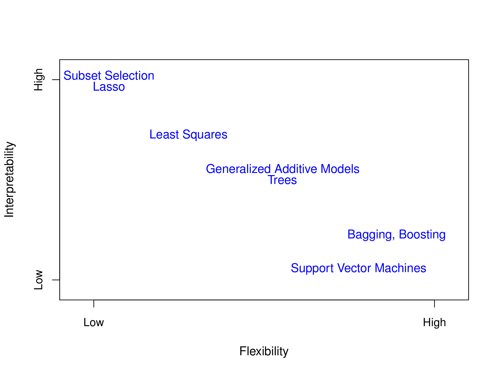
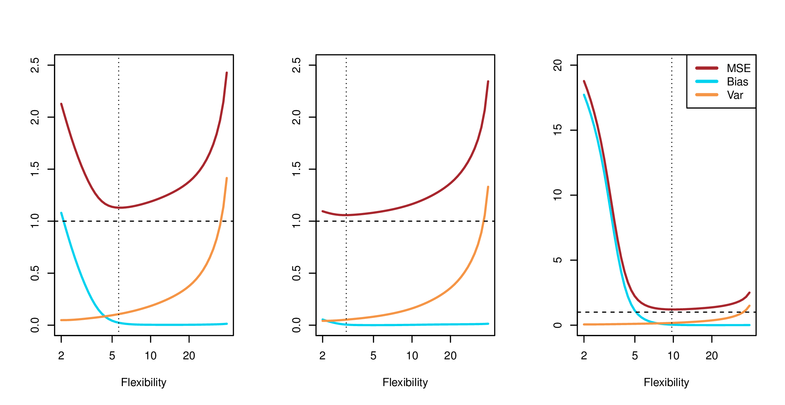
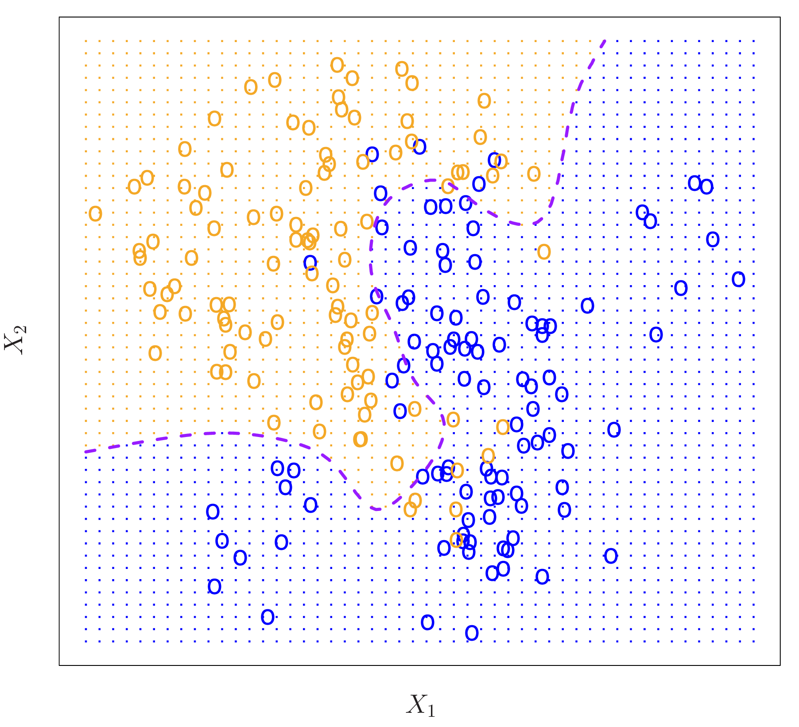
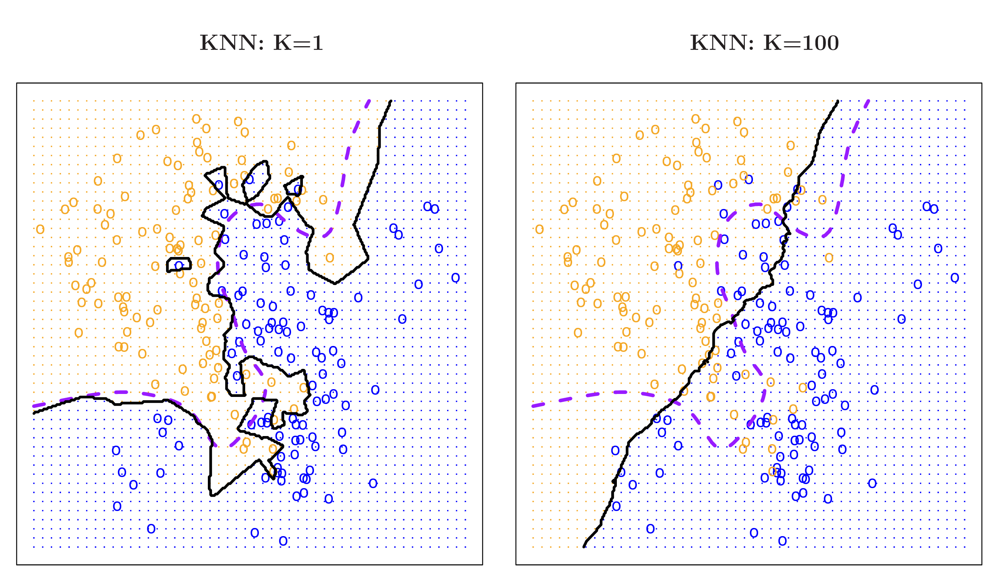
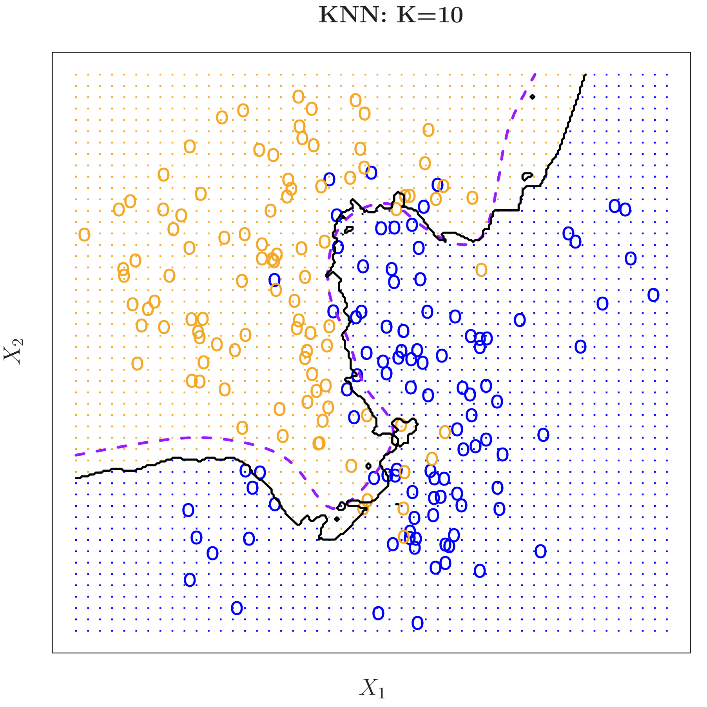
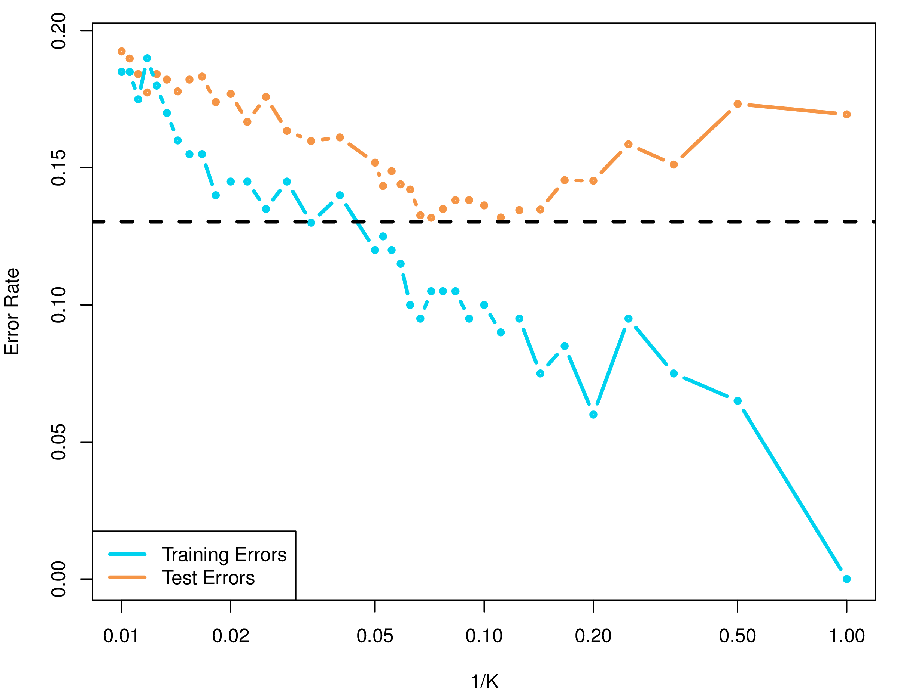

```{r, include = FALSE}
current_file <- knitr::current_input()
basename <- gsub(".Rmd$", "", current_file)

knitr::opts_chunk$set(
  fig.path = sprintf("images/%s/", basename),
  fig.width = 6,
  fig.height = 4,
  out.width = "100%",
  fig.align = "center",
  fig.retina = 3,
  echo = FALSE,
  warning = FALSE,
  message = FALSE,
  cache = TRUE,
  cache.path = "cache/"
)
```

```{r titleslide, child="assets/titleslide.Rmd"}
```

```{r}
library(tidyverse)
library(tidymodels)
library(patchwork)
```

---
class: transition

# Two purposes 

## Prediction and inference (or understanding)


---
# Supervised learning

.grid[
We assume that there is a relationship between $Y$ and ${\mathbf X}$ that can be written as
$$Y = f({\mathbf X}) + \varepsilon$$
where function $f(X)$ is .monash-blue2[fixed but unknown], and $\varepsilon$ is independent of ${\mathbf X}$ and has mean 0.

```{r}
d <- tibble(x=runif(100, -3, 7),
            y=-3+2*x-4*x^2+x^3+15*rnorm(100))
ggplot(d, aes(x=x, y=y)) + geom_point() +
  xlab("X") + ylab("Y")
```
<br><br>*Note: Here, I've simulated data so I know what $f$ is.*
]


---
# Why estimate $f$?

.grid[
In many situations, ${\mathbf X}$ may be readily available, but $Y$ might be hard to collect. SO, we would like to be able to use ${\mathbf X}$ to .monash-orange2[predict] new values of $Y$. 
<br>
We might not so much be concerned about whether $f$ is easy to understand, just that we are confident that its going to do a good job of predicting new values.
$$\hat{Y} = \hat{f}({\mathbf X})$$
where $\hat{ }$ reflects what we estimate, the unknown function to be, and the estimated response value.


...
]

---
# Why estimate $f$?

.grid[
In many situations, ${\mathbf X}$ may be readily available, but $Y$ might be hard to collect. SO, we would like to be able to use ${\mathbf X}$ to .monash-orange2[predict] new values of $Y$. 
<br>
We might not so much be concerned about whether $f$ is easy to understand, just that we are confident that its going to do a good job of predicting new values.
$$\hat{Y} = \hat{f}({\mathbf X})$$
where $\hat{ }$ reflects what we estimate, the unknown function to be, and the estimated response value.

<br><br>The accuracy of $\hat{Y}$ as a prediction for $Y$ depends on what we will call .monash-orange2[reducible] AND .monash-orange2[irreducible] error. We can write this as
\begin{align*}
E(Y-\hat{Y})^2 &=& E(f({\mathbf X})+\varepsilon-\hat{f}({\mathbf X}))^2\\
&=& \underbrace{E(f({\mathbf X}) - \hat{f}({\mathbf X}))^2} + \underbrace{\mbox{Var}(\varepsilon)} \\
& & reducible + irreducible
\end{align*}
where $E(Y-\hat{Y})^2$ represents the average or .monash-blue2[expected value] of the squared difference between the observed and predicted response, and $\mbox{Var}(\varepsilon)$ represents the .monash-blue2[variance] of the error.
]

---

.grid[
```{r}
d <- d %>% 
  mutate(f = 3+2*x-4*x^2+x^3)
ggplot(d, aes(x=x, y=y)) + geom_point() +
  xlab("X") + ylab("Y") +
  geom_line(aes(x=x, y=f))
```
<br>
Line indicates **true** $f$. This is the best possible because all that is left is irreducible error. 

```{r}
d <- d %>% 
  mutate(fhat = 3.2+1.9*x-3.9*x^2+0.9*x^3)
ggplot(d, aes(x=x, y=y)) + geom_point() +
  xlab("X") + ylab("Y") +
  geom_line(aes(x=x, y=f)) +
  geom_line(aes(x=x, y=fhat), colour = "#D93F00")
```
<br>
.monash-orange2[Orange] line indicates an .monash-orange2[estimated model] ( $\hat{f}$ ). This could be improved. 
]


---

.grid[
```{r}
d <- d %>% 
  mutate(fhat = 3.2+1.9*x-3.9*x^2+0.9*x^3)
ggplot(d, aes(x=x, y=y)) + geom_point() +
  xlab("X") + ylab("Y") +
  geom_line(aes(x=x, y=f)) +
  geom_line(aes(x=x, y=fhat), colour = "#D93F00")
```
<br>
.monash-orange2[Orange] line indicates an .monash-orange2[estimated model] ( $\hat{f}$ ). This could be improved. 

**Suppose we used a much simpler model, a linear model.**
<br><br>
```{r}
lm_mod <- 
  linear_reg() %>% 
  set_engine("lm")
lm_fit <- 
  lm_mod %>% 
  fit(y ~ x, data = d)
d <- augment(lm_fit, d)

ggplot(d, aes(x=x, y=y)) + geom_point() +
  xlab("X") + ylab("Y") +
  geom_line(aes(x=x, y=f)) +
  geom_line(aes(x=x, y=fhat), colour = "#D93F00") +
  geom_line(aes(x=x, y=.pred), colour = "#027EB6")
```
<br>
.monash-blue2[Blue] line indicates a simpler .monash-blue2[estimated model] ( $\hat{f}$ ). There is a lot of room to improve this.

]
---
class: informative middle

# Remember

.info-box[.monash-orange2[reducible] is what we can .monash-orange2[improve] on by producing the .monash-orange2[best model].]

<br><br>

.info-box[.monash-orange2[irreducible] there is some random fluctuation from one sample to the next which is not systematic.]

---
class: middle center

.idea-box[The goal is that the predictions from the model are accurate for future samples.]

---
class: transition

# Inference (understanding)
---
# Inference

We would like to understand the way that $Y$ is related to ${\mathbf X}$. 

- Which predictors are associated with the response? 
- What is the relationship between the response and each predictor?
- Can the relationship between $Y$ and each predictor be adequately summarized using a linear equation, or is the relationship more complicated? 
<br><br><br>

**It is important here not to treat $f$ as a black box.**

<br><br>
.idea-box[Ideally, good prediction also allows for good inference and understanding.]

---
# How do we estimate $f$?

.flex[
- Parametric methods: 
    - Assume that the model takes a specific form
    - Fitting then is a matter of estimating the parameters of the model
    - Generally considered to be less flexible
    - If assumptions are wrong, performance likely to be poor
- Non-parametric methods: 
    - No specific assumptions
    - Allow the data to specify the model form, without being too rough or wiggly
    - More flexible
    - Generally needs more observations
]
    
---
# Parametric models

.grid[
 
 
A linear regression model: $f({\mathbf X}) = \beta_0 + \beta_1 X_1 + ... + \beta_p X_p$
```{r}
ggplot(d, aes(x=x, y=y)) + geom_point() +
  xlab("X") + ylab("Y") +
  geom_line(aes(x=x, y=.pred), colour = "#027EB6")
```

And nonlinear regression model: $f({\mathbf X}) = \beta_0 + \beta_1 X_1 + \beta_2 X_1^2 + ...$
```{r}
ggplot(d, aes(x=x, y=y)) + geom_point() +
  xlab("X") + ylab("Y") +
  geom_line(aes(x=x, y=fhat), colour = "#D93F00") 
```
]

---
# Non-parametric models

.grid[

Example: Local polynomial regression, called loess. Fit a linear model to many small subsets of the data.
```{r fig.width=10, fig.height=4, out.width="90%"}
d <- d %>% 
  mutate(fhat3 = predict(loess(y~x, span=0.1)),
         fhat4 = predict(loess(y~x, span=0.2)),
         fhat5 = predict(loess(y~x))) 
p1 <- ggplot(d, aes(x=x, y=y)) + geom_point() +
  xlab("X") + ylab("Y") +
  geom_line(aes(x=x, y=fhat3), colour = "#EE0220") +
  ggtitle("Too rough")
p2 <- ggplot(d, aes(x=x, y=y)) + geom_point() +
  xlab("X") + ylab("Y") +
  geom_line(aes(x=x, y=fhat4), colour = "#746FB2") +
  ggtitle("Still too rough")
p3 <- ggplot(d, aes(x=x, y=y)) + geom_point() +
  xlab("X") + ylab("Y") +
  geom_line(aes(x=x, y=fhat5), colour = "#008A25") +
  ggtitle("About right")
p1 + p2 + p3 
```
A more general approach is called $k$-nearest neighbours,  $\hat Y(x) = \frac1k \sum_{x_i \in n_k(x)} y_i$. 
]

---
# Trade-off between predictive accuracy and model interpretability

.grid[
A summary of common models and how they tend to lie in terms of predictive accuracy vs interpretability.
<br><br><br><br><br><br><br><br>
.font_smaller2[Chapter2/2.7.pdf]

<a href="http://www-bcf.usc.edu/~gareth/ISL/Chapter2/2.7.pdf" target="_BLANK">  </a>
]

---
class: transition
# Assessing model accuracy

---
# Assessing model accuracy

<center>
.info-box[.monash-blue2[Training data]: the set of observations used to train or teach the method to estimate $f$.]
</center>

<br><br>
Suppose we have a regression model $y=f(x)+\varepsilon$. .monash-orange2[Estimate]
$\hat{f}$ from some .monash-orange2[training data], $Tr= \{(y_i, x_i)\}_{i = 1}^n$.

The most common measure of accuracy is the .monash-orange2[training Mean Squared Error (MSE)]

$$MSE_{Tr} = \mathop{\mbox{Ave}}\limits_{i\in Tr}[y_i-\hat{f}(x_i)]^2 = \frac{1}{n}\sum_{i=1}^n [(y_i-\hat{f}(x_i)]^2$$

---
# Assessing model accuracy

<center>
.info-box[.monash-blue2[Test data]: the set of observations reserved to compute accuracy of the model for .monash-blue2[new] data.]
</center>

<br><br>

A better measure of .monash-orange2[accuracy] is obtained by using the .monash-orange2[test data], denoted as $Te=\{(y_i, x_i)\}_{i = 1}^m$, .monash-orange2[Test Mean Squared Error]

$$MSE_{Te} = \mathop{\mbox{Ave}}\limits_{j\in Te}[y_j-\hat{f}(x_j)]^2 = \frac{1}{m}\sum_{j=1}^m [(y_j-\hat{f}(x_j)]^2$$

---
class: informative 

.grid[
## Regression vs classification

<a href="https://towardsdatascience.com/regression-or-classification-linear-or-logistic-f093e8757b9c" target="_BLANK">  </a>
<br><br><br><br><br>
.font_smaller2[Source: [Taylor Fogarty](https://towardsdatascience.com/regression-or-classification-linear-or-logistic-f093e8757b9c) ]]

]

---
# Assessing model accuracy for classification

<center>
.info-box[To indicate the categorical response, we will use $\hat{C}$ instead of $\hat{f}$.]
</center>

Compute $\hat{C}$ from some .monash-orange2[training data], $Tr= \{(y_i, x_i)\}_{i = 1}^n$. In place of MSE, we now use the error rate (.monash-orange2[fraction of misclassifications]) to get the .monash-green2[Training Error Rate]

$$\text{Error rate}_{Tr} = \frac{1}{n}\sum_{i=1}^n I(y_i \ne \hat{C}(x_i))$$

And again a better estimate of future .monash-orange2[accuracy] is obtained using .monash-orange2[test data] $Te=\{(y_i, x_i)\}_{i = 1}^m$ to get the .monash-green2[Test Error Rate]

$$\text{Error rate}_{Te} = \frac{1}{m}\sum_{j=1}^m I(y_j \ne \hat{C}(x_j))$$

---
class: informative middle 

<center>
.info-box[Generally, training error will be smaller than test error.]
</center>

<br><br>
Because the training data is used to fit the model, by design the error will be small relative to the error when the model is used on new data.

---
# Bias-variance trade-off

.idea-box[There are two competing forces that govern the
choice of learning method: .monash-orange2[bias] and .monash-orange2[variance].] 


<br><br><br>
.monash-orange2[Bias] is the error that is introduced by modeling a 
complicated problem by a simpler problem.


- For example, linear regression assumes a linear relationship and perhaps the relationship is not exactly linear.
- In general, but not always, the .monash-orange2[more flexible] a method is, the .monash-orange2[less bias] it will have. 


[This site](https://degreesofbelief.roryquinn.com/bias-variance-tradeoff) has a lovely explanation.

---
# Bias-variance trade-off

.idea-box[There are two competing forces that govern the
choice of learning method: .monash-orange2[bias] and .monash-orange2[variance].] 

<br><br><br>

.monash-orange2[Variance]
refers to how much your estimate would change if you had different training data. Its measuring how much your model depends on the data you have, to the neglect of future data.


- In general, the .monash-orange2[more flexible] a method is, the .monash-orange2[more variance] it has. 
- The .monash-orange2[size] of the training data has an impact on the variance.

---
# Flexibility, bias and variance

[This blog post by Harriet Mason, former ETC3250 student](https://numbat.space/post/bias_variance_flexibility/training_and_test_mse/) has a lovely explanation of the trade-off in flexibility and effect on bias and variance.

<center>

</center>

---
## MSE decomposition into bias and variance

The expected **test** MSE for a new $y_0$ at a new observation, called ${\mathbf x}_0$, will be equal to

$$E[(y_0-\hat{f}(x_0))^2] = [\mbox{Bias}(\hat{f}(x_0))]^2 + \mbox{Var}(\hat{f}(x_0)) + \mbox{Var}(\varepsilon)$$

Test MSE = Bias $^2$ + Variance + Irreducible variance

- The expectation averages over the variability of $Y$ as well as the variability in the training data.
- As the flexibility of $\hat{f}$ increases, its variance increases and its bias decreases.
- The decide on the best model, from a range with different flexibility, you choose based on average test MSE at the .monash-orange2[bias-variance trade-off], where both are minimised.

---
# Bias-variance tradeoff

<center>
<a href="http://www-bcf.usc.edu/~gareth/ISL/Chapter2/2.12.pdf" target="_BLANK">  </a>

<br>

.blue[Squared bias], .orange[variance], .black[Var(ε) (dashed line)], and .red[test MSE] for the three data sets shown earlier. The vertical dotted line indicates the flexibility level corresponding to the smallest test MSE.
</center>

.font_smaller2[(Chapter2/2.12.pdf)]

---
class: transition

# A case study using nearest neighbours classification

---

<center>

<a href="http://www-bcf.usc.edu/~gareth/ISL/Chapter2/2.13.pdf" target="_BLANK">  </a>
<br>

Colour indicates true class of each observation. <br>.purple[Dashed line indicates true boundary]. 
</center>

<br><br>
.font_smaller2[(Chapter2/2.13.pdf)]

---
# K Nearest Neighbours (KNN)


One of the simplest classifiers. Given a test observation ${\mathbf x}_0$,

- Find the $K$ nearest points to $x_0$ in the training data, call this ${\cal N}_0$.
- Estimate conditional probabilities
$$P(Y = C_j \mid X=x_0) = \frac{1}{K}\sum_{i\in {\cal N}_0} I(y_i = C_j).$$
- Classify $x_0$ to class with largest probability.


---
# KNN: too flexible and not enough

<center>

<a href="http://www-bcf.usc.edu/~gareth/ISL/Chapter2/2.16.pdf" target="_BLANK">  </a>

</center>

.font_smaller2[(Chapter2/2.16.pdf)]

---
# KNN: about as good as possible

<center>
<a href="http://www-bcf.usc.edu/~gareth/ISL/Chapter2/2.15.pdf" target="_BLANK">  </a>

</center>

.font_smaller2[(Chapter2/2.15.pdf)]

---
# KNN: bias variance trade-off, using training and test error

<center>
<a href="http://www-bcf.usc.edu/~gareth/ISL/Chapter2/2.17.pdf" target="_BLANK">  </a>
</center>

.font_smaller2[(Chapter2/2.17.pdf)]

---

```{r endslide, child="assets/endslide.Rmd"}
```
