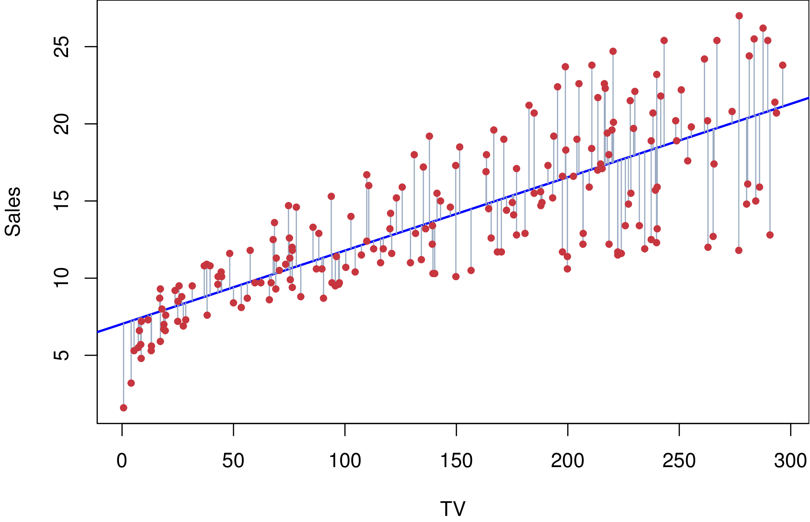
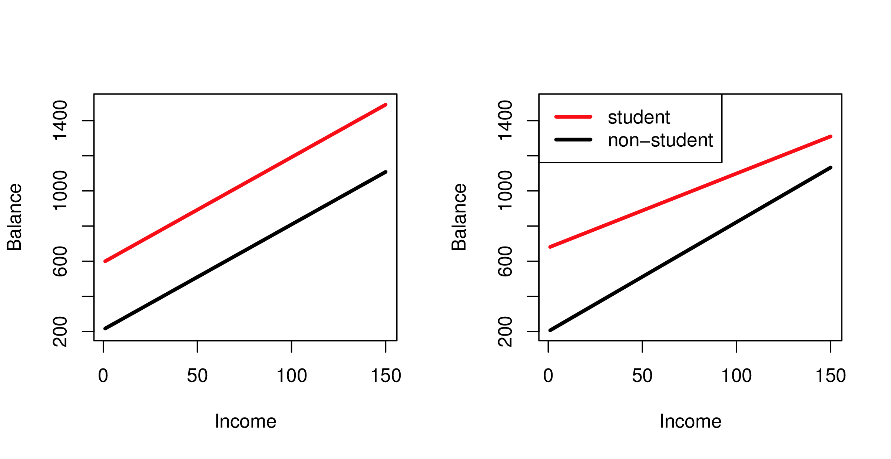
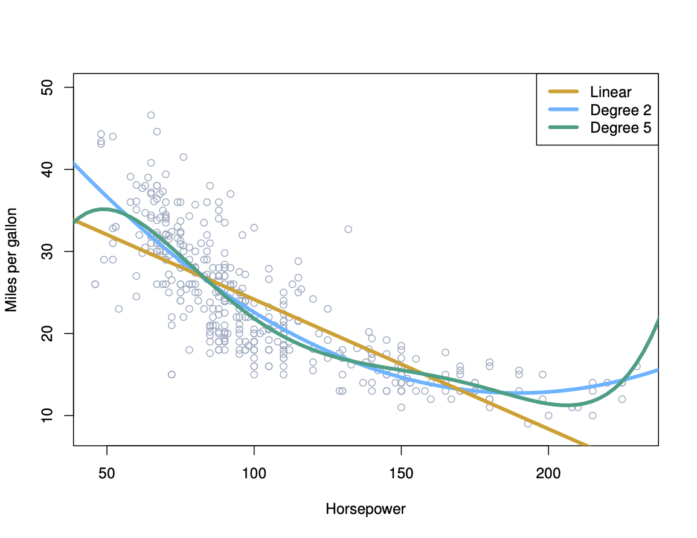

```{r, include = FALSE}
current_file <- knitr::current_input()
basename <- gsub(".Rmd$", "", current_file)

knitr::opts_chunk$set(
  fig.path = sprintf("images/%s/", basename),
  fig.width = 6,
  fig.height = 4,
  out.width = "100%",
  fig.align = "center",
  fig.retina = 3,
  echo = FALSE,
  warning = FALSE,
  message = FALSE,
  cache = TRUE,
  cache.path = "cache/"
)
```

```{r titleslide, child="assets/titleslide.Rmd"}
```

```{r}
library(tidyverse)
library(tidymodels)
library(patchwork)
```

---
# Multiple Regression

<br>

<center>
.info-box[
$$Y_i = \beta_0 + \beta_1 X_{i1} + \beta_2 X_{i2} + \cdots + \beta_pX_{ip} + \varepsilon_i, ~~~ i=1, \dots, n$$
]
</center>

- Each $X_j$ is called a .monash-orange2[predictor], or independent variable or input variable.
- The coefficients $\beta_1,\dots,\beta_p$ measure the .monash-orange2[effect] of each
predictor after taking account of the effect of all other predictors in the model.
- Predictors may be .monash-orange2[transforms] of other predictors. e.g., $x_2=x_1^2$. Then the model form would be nonlinear. Categorical predictors need to be converted into dummy variables (see a few slides along).
- Once we .monash-orange2[estimate] the model, we will have estimated coefficients $\hat{\beta}_1,\dots,\hat{\beta}_p$, predicted values, $\hat{Y}$, and residuals, $e_i, i=1, \dots, n$.


---

# Multiple Regression

.flex[
.w-45[
The model describes a .monash-orange2[**line**, plane or hyperplane] in the predictor space.<br>

<center><a href="http://www-bcf.usc.edu/~gareth/ISL/Chapter3/3.1.pdf" target="_BLANK">  </a>
</center> 
<br><br><br>

.font_smaller2[(Chapter3/3.1.pdf)]
]

.w-45[
The model describes a .monash-orange2[line, **plane** or hyperplane] in the predictor space. <br>

<center>
<a href="http://www-bcf.usc.edu/~gareth/ISL/Chapter3/3.5.pdf" target="_BLANK">  </a>
</center>
<br><br><br>

.font_smaller2[(Chapter3/3.5.pdf)]
]
]
---
# Categorical Variables

Qualitative variables need to be converted to numeric, by making a set of dummy variables.

$$x_i = \left\{\begin{array}
{ll}
1 & \mbox{if} ~~~ i^{\text{th}} \mbox{ obs is a koala}  \\
0 & \mbox{otherwise}  
\end{array}\right\}$$

which would result in the model

$$\hat{y}_i = \left\{\begin{array}
{ll}
\beta_0+\beta_1 & \mbox{if} ~~~ i^{\text{th}} \mbox{ obs is a koala}   \\
\beta_0 & \mbox{otherwise}  
\end{array}\right\}$$


---
# Categorical Variables

More than two categories

$$x_{i1} = \left\{\begin{array}
{ll}
1 & \mbox{if} ~~~ i^{\text{th}} \mbox{ obs is a koala}  \\
0 & \mbox{otherwise}  
\end{array}\right\}$$

$$x_{i2} = \left\{\begin{array}
{ll}
1 & \mbox{if} ~~~ i^{\text{th}} \mbox{ obs is a bilby}  \\
0 & \mbox{otherwise}  
\end{array}\right\}$$

which would result in the model using .monash-orange2[dummy variables].

$$\hat{y}_i = \left\{\begin{array}
{ll}
\beta_0+\beta_1 & \mbox{if} ~~~ i^{\text{th}} \mbox{ obs is a koala}   \\
\beta_0+\beta_2 & \mbox{if} ~~~  i^{\text{th}}  \mbox{ obs is a bilby}  \\
\beta_0 & \mbox{otherwise}  
\end{array}\right\}$$

---
# Interactions are induced by categorical predictors

.info-box[When you have a categorical variable, it can be convenient to allow .monash-orange2[BOTH slope and intercept to vary] across category levels. This is called an .monash-orange2[interaction].]

<center>
<a href="http://www-bcf.usc.edu/~gareth/ISL/Chapter3/3.7.pdf" target="_BLANK">  </a>
</center>


.font_smaller2[(Chapter3/3.7.pdf)]
---
# Inference 

<br>

- Is at least one of the predictors useful in predicting the response?
- Do all the predictors help to explain $Y$, or is only a subset of the predictors useful?
- How well does the model fit the data?
- Given a set of predictor values, what response value should we predict and how accurate is our prediction?

---
.flex[
.border-box[
# Model fitting

.monash-orange2[Least squares] is a common way to fit the model, where $\hat{\beta}_j$ are chosen to minimise $$RSS=\sum_{i=1}^n (y_i-\hat{y}_i)^2$$ The .monash-orange2[smaller the sum] of differences, the .monash-orange2[better] the model fits the data.
]


.border-box[
# Goodness-of-fit

$R^2$ is the .monash-orange2[proportion of variation] explained by the model, and measures the goodness of the fit, close to 1 the model explains most of the variability in $Y$, close to 0 it explains very little. 

$$R^2 = 1 - \frac{RSS}{TSS}$$

where $TSS=\sum_{i=1}^n (y_i - \bar{y})^2$. RSS is residual sum of squares, and TSS is total sum of squares.

]

.border-box[
# Model Diagnostics

.monash-orange2[Residual Standard Error (RSE)] is an estimate of the standard deviation of $\varepsilon$. This is meaningful with the assumption that $\varepsilon \sim N(0, \sigma^2)$. 

$$RSE = \sqrt{\frac{1}{n-p-1}RSS}$$

This is another way to examine the variation around the model. Unlike $R^2$ it is not on a standard scale.
]

]

---

# Maximum Likelihood Estimation and Least Squares


If the errors are iid and normally distributed, then

$${Y} \sim N({X}{\beta},\sigma^2{I})$$

So the likelihood is

$$L = \frac{1}{\sigma^n(2\pi)^{n/2}}\exp\left(-\frac1{2\sigma^2}\sum_{i=1}^n (Y_i-\hat{Y}_i)^2\right)$$


which is maximized when $\sum_{i=1}^n ({Y}-\hat{Y})^2$ is minimized.

<br><br>
<center>
.info-box[MLE $\equiv$ OLS.]
</center>

---

# Significance tests

An $F$-test can be computed to assess if **any** predictor explains response, by testing this hypothesis

$$H_0: \beta_1=\beta_2=...=\beta_p=0 \mbox{   vs   } H_a: \mbox{at least one is not 0}$$
where the test statistic is $F=\frac{(TSS-RSS)/p}{RSS/(n-p-1)}$.

<br>

## Individual variables

The strength of relationship between the response and an individual variable can be tested using a $t$-test for the hypothesis:

$$H_0: \beta_j=0 \mbox{   vs   } H_a: \beta_j\neq 0$$ 

where the test statistic is $t=\frac{\hat{\beta}_j}{SE({\hat{\beta}_j})}$


---
class: middle center

# Interpreting the effect of any predictor

> We interpret $\beta_j$ as the average effect on $Y$ of a one unit increase in $X_j$, holding all other predictors fixed.

<br><br>
.info-box[`r emo::ji("warning")` This is association and .monash-orange2[not causation]. ]

---
# Assessing model fit using residuals


.flex[
.border-box[
- If a plot of the residuals vs any predictor in the model shows a pattern, then the .monash-orange2[relationship is nonlinear.]
- If a plot of the residuals vs any predictor **not** in the model shows a pattern, then .monash-orange2[the predictor should be added to the model.]
- If a plot of the residuals vs fitted values shows a pattern, then there is .monash-orange2[heteroscedasticity in the errors]. (Try a transformation, but may not fix.)
]

.border-box[

<center>
<a href="http://www-bcf.usc.edu/~gareth/ISL/Chapter3/3.9.pdf" target="_BLANK">  </a>
</center>

.font_smaller2[(Chapter3/3.9.pdf)]
]
]

---

# Comparing models

An $F$-test can be computed to assess if **any additional**  predictors significantly help to explain response, by testing this hypothesis

$$H_0: \beta_{p-q+1}=\beta_{p-q+2}=...=\beta_p=0 \mbox{   vs   } H_a: \mbox{at least one is not 0}$$
where the test statistic is $F=\frac{(RSS_0-RSS)/q}{RSS/(n-p-1)}$.

(We are considering a model with just $q$ variables as opposed to all $p$.)

---
# Common pitfalls

1. Non-linearity of the response-predictor relationships.
--

2. Correlation of error terms.
--

3. Non-constant variance of error terms.
--

4. Outliers.
--

5. High-leverage points.
--

6. Collinearity.
--

<!-- Prediction is still ok, but interpretation not -->

---
# Example - Wages

Wage and other data for a group of 3000 male workers in the Mid-Atlantic region. 
.monash-orange2[Goal:] .monash-green2[Predict wage based on worker characteristics.]

.overflow-scroll[
```{r}
library(tidyverse)
library(ISLR)
glimpse(Wage)
```
]

---

# Take a look

What do the following pairwise comparisons of the variables `year`, `age` and, `education` against `wage` show us?


```{r fig.height=5, fig.width=12, out.width="80%"}
library(GGally)
ggduo(Wage, columnsX=c(1,2,5), columnsY=11)
```


---

# Take a look

If we examine `logwage` instead of `wage` as response variable - what changes?


```{r fig.height=5, fig.width=12, out.width="80%"}
ggduo(Wage, columnsX=c(1,2,5), columnsY=10)
```

---

# Take a look

.flex[
- Examine the predictors. *Ideally values are spread out without any associations.*
- There is no evidence of any association between the predictors here. 
- One category of "education" has much fewer observations than the others - this is not ideal. 

```{r fig.height=8, fig.width=8, out.width="70%"}
ggpairs(Wage, columns=c(1,2,5))
```
]

---
# Model for wage data

<br>
<center>
.color-box.monash-blue2[
$Y = \beta_0 + \beta_1X_1 + \beta_2X_2 + \beta_3X_3 + \varepsilon$
]
</center>

where $Y=$ `logwage`, $X_1=$ `year`, $X_2=$ `age`, and $X_3=$ `education`.


---
# Fitting the model in R

```{r wage-model, echo=TRUE, results='hide'}
library(broom)
library(parsnip)
library(kableExtra)
lm_mod <- 
  linear_reg() %>% 
  set_engine("lm")

fit <- lm_mod %>% #<<
  fit(logwage~year+age+education, data=Wage) #<<
```


---
# Parameter estimates

```{r echo=TRUE}
tidy(fit) %>% #<<
  kable(digits = 3) %>% 
  kable_styling(bootstrap_options = "striped", full_width = FALSE)
```

---
# Model fit

```{r echo=TRUE}
glance(fit)  %>% #<<
  kable(digits = 2) %>% 
  kable_styling(bootstrap_options = "striped", full_width = FALSE)
```


---
# Polynomial regression

A simple non-linear model can be achieved by adding polynomial terms, like

$$\mbox{mpg} = \beta_0 + \beta_1 \mbox{horsepower} + \beta_2 \mbox{horsepower}^2 + \varepsilon$$
.flex[
<a href="http://www-bcf.usc.edu/~gareth/ISL/Chapter3/3.8.pdf" target="_BLANK">  </a>
</center>
<br><br>


<center>
<a href="http://www-bcf.usc.edu/~gareth/ISL/Chapter3/3.9.pdf" target="_BLANK">  </a>
</center>


]
.font_smaller2[(Chapter3/3.8.pdf,3.9.pdf)]
---

```{r endslide, child="assets/endslide.Rmd"}
```
