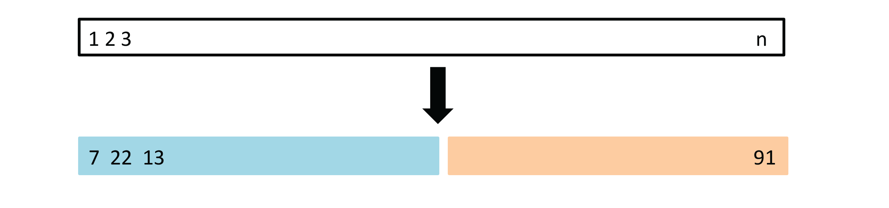
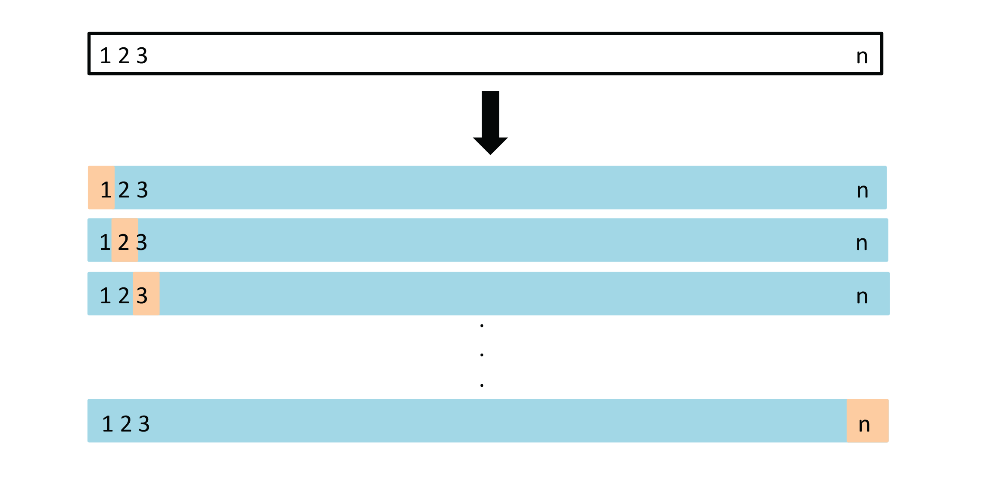
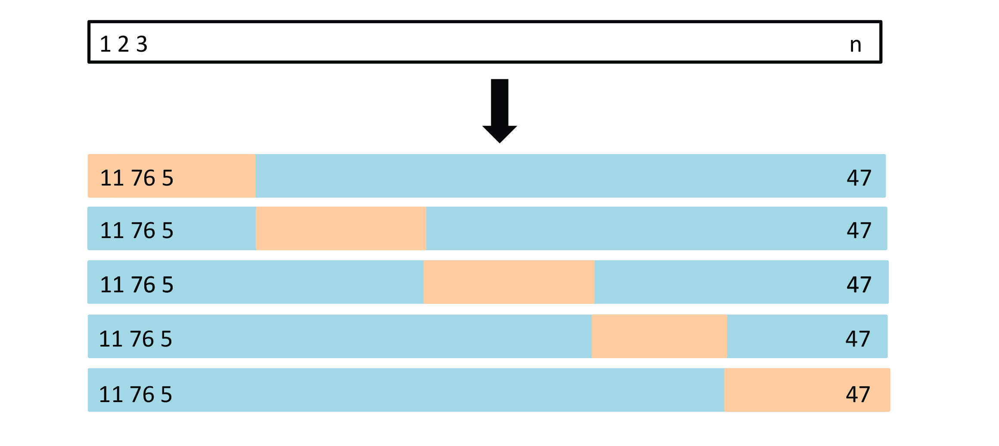
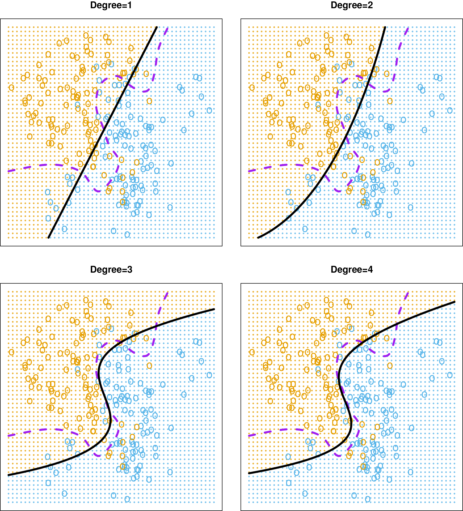
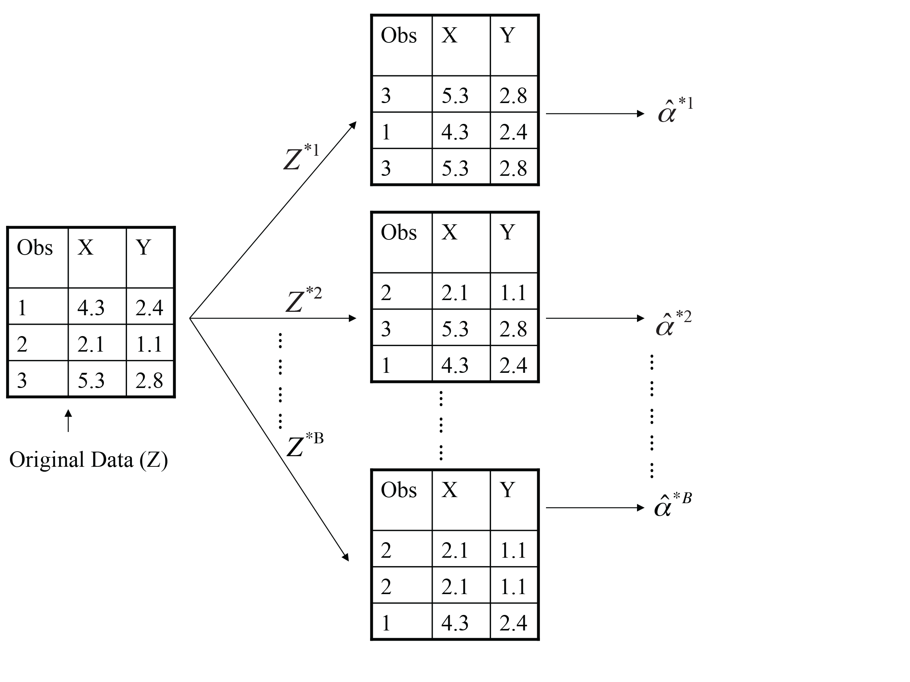

```{r, include = FALSE}
current_file <- knitr::current_input()
basename <- gsub(".Rmd$", "", current_file)

knitr::opts_chunk$set(
  fig.path = sprintf("images/%s/", basename),
  fig.width = 6,
  fig.height = 4,
  out.width = "100%",
  fig.align = "center",
  fig.retina = 3,
  echo = FALSE,
  warning = FALSE,
  message = FALSE,
  cache = FALSE,
  cache.path = "cache/"
)
```

```{r titleslide, child="assets/titleslide.Rmd"}
```

```{r}
library(ISLR)
library(tidyverse)
library(broom)
library(recipes)
library(parsnip)
library(rsample)
library(yardstick)
library(purrr)
library(patchwork)
library(modelr)
```

---
# Model development and choice 

<br>

<center>
 </a>
</center>

---
class: transition middle center

# How do you get new data?

---
# Resampling

- Training/test split: make one split of your data, keeping one purely for assessing future performance.
- Leave-one-out: make $n$ splits, fitting multiple models and using left-out observation for assessing variability.
- $k$-fold: break data into $k$ subsets, fitting multiple models with one group left out each time.
- Bootstrap: make many samples, with replacement, using out-of-bag observations for testing.

---


# Training and test sets


<a href="http://www-bcf.usc.edu/~gareth/ISL/Chapter5/5.1.pdf" target="_BLANK">  </a>

A set of $n$ observations are randomly split into a training set (blue, containing observations 7, 22, 13, ...) and a test set (yellow, all other observations not in training set).

.monash-orange2[Drawback]: Only one split of data made, may have a lucky or unlucky split, accurately estimating test error relies on the one sample. 

<br><br>
.font_smaller2[(Chapter5/5.1.pdf)]

```{r}
# Function that will compute the test MSE
compute_mse <- function(d) {
  spl <- initial_split(d, 2/3)
  train <- training(spl)
  test <- testing(spl)

  auto_prep <-    
    recipe(mpg ~ horsepower, 
         data = train) %>% 
    step_poly(horsepower, degree = 4) %>%
    prep()
  auto_train_baked <- bake(auto_prep, new_data = NULL)
  auto_test_baked <- bake(auto_prep, new_data = test)
  sample_split <- tibble(id = 1:nrow(d)) %>%
    mutate(id_in = ifelse(1:nrow(d) %in% spl$in_id, 
                              "y", "n"))
  
  lm_mod <- 
  linear_reg() %>% 
  set_engine("lm")

  fit1 <- 
    lm_mod %>% 
    fit(mpg ~ horsepower_poly_1, data = auto_train_baked)
  fit2 <- 
    lm_mod %>% 
    fit(mpg ~ horsepower_poly_1 + horsepower_poly_2, 
      data = auto_train_baked)
  fit3 <- 
    lm_mod %>% 
    fit(mpg ~ horsepower_poly_1 + horsepower_poly_2 +
        horsepower_poly_3, 
      data = auto_train_baked)
  fit4 <- 
    lm_mod %>% 
    fit(mpg ~ ., data = auto_train_baked)

  auto_test_pred1 <- augment(fit1,
                             auto_test_baked)
  auto_test_pred2 <- augment(fit2,
                             auto_test_baked)
  auto_test_pred3 <- augment(fit3,
                             auto_test_baked)
  auto_test_pred4 <- augment(fit4,
                             auto_test_baked)
  auto_mse <- tibble(poly = c(1,2,3,4)) %>%
    mutate(mse = c(metrics(auto_test_pred1, truth = mpg, 
        estimate = .pred)$.estimate[1]^2, 
        metrics(auto_test_pred2, truth = mpg, 
        estimate = .pred)$.estimate[1]^2,
        metrics(auto_test_pred3, truth = mpg, 
        estimate = .pred)$.estimate[1]^2,
        metrics(auto_test_pred4, truth = mpg, 
        estimate = .pred)$.estimate[1]^2))

  return(list(auto_mse, sample_split))
}
```

```{r}
# Compute test MSE for four training/test splits
set.seed(1111)
run1 <- compute_mse(Auto)
run2 <- compute_mse(Auto)
run3 <- compute_mse(Auto)
run4 <- compute_mse(Auto)
auto_runs <- run1[[1]] %>%
  rename(mse1 = mse) %>%
  select(mse1) %>%
  bind_cols(run2[[1]]) %>%
  rename(mse2 = mse) %>%
  select(mse1, mse2) %>%
  bind_cols(run3[[1]]) %>%
  rename(mse3 = mse) %>%
  select(mse1, mse2, mse3) %>%
  bind_cols(run4[[1]]) %>%
  rename(mse4 = mse) %>%
  select(poly, mse1, mse2, mse3, mse4) 

auto_samples <- run1[[2]] %>%
  rename(id_in1 = id_in) %>%
  select(id_in1) %>%
  bind_cols(run2[[2]]) %>%
  rename(id_in2 = id_in) %>%
  select(id_in1, id_in2) %>%
  bind_cols(run3[[2]]) %>%
  rename(id_in3 = id_in) %>%
  select(id_in1, id_in2, id_in3) %>%
  bind_cols(run4[[2]]) %>%
  rename(id_in4 = id_in) %>%
  select(id, id_in1, id_in2, id_in3, id_in4) 
# Make into a heatmap
auto_samples <- auto_samples %>%
  mutate(col = (id-1)%/%20 + 1, 
         row = (id-1)%%20 + 1)
```

---
# Training/test set split and choosing polynomial degree (1/4)


.flex[
.w-45[


<br>

$$\mbox{mpg}=\beta_0+\beta_1f(\mbox{horsepower})+\varepsilon$$
Split into 2/3 training and 1/3 test sets. 


```{r fig.width=5, fig.height=5, out.width="50%"}
ggplot(auto_samples) +
  geom_tile(aes(x=col, y=row, fill = id_in1)) +
  scale_fill_manual("", 
                    values = c("y" = "#1f78b4", 
                               "n" = "#fdcdac")) + 
  theme_void() + 
  theme(legend.position = "none") 
```

]

.w-45[

```{r}
ggplot(auto_runs) +
  geom_line(aes(x=poly, y=mse1), size = 1.2) +
  ylim(c(15, 30)) +
  xlab("degree") + ylab("mse") +
  theme_minimal() +
  theme(text = element_text(size=20)) 
 


```


]]


---

# Training/test set split and choosing polynomial degree (2/4)


.flex[
.w-45[


<br>

$$\mbox{mpg}=\beta_0+\beta_1f(\mbox{horsepower})+\varepsilon$$
Split into 2/3 training and 1/3 test sets. 


```{r fig.width=5, fig.height=5, out.width="50%"}
ggplot(auto_samples) +
  geom_tile(aes(x=col, y=row, fill = id_in2)) +
  scale_fill_manual("", 
                    values = c("y" = "#1f78b4", 
                               "n" = "#fdcdac")) + 
  theme_void() + 
  theme(legend.position = "none")  
```

]

.w-45[

```{r}
ggplot(auto_runs) +
  geom_line(aes(x=poly, y=mse1), size = 1.2, colour = "grey90") +
  geom_line(aes(x=poly, y=mse2), size = 1.2) +
  ylim(c(15, 30)) +
  xlab("degree") + ylab("mse") +
  theme_minimal() +
  theme(text = element_text(size=20)) 
```

]]

---
# Training/test set split and choosing polynomial degree (3/4)


.flex[
.w-45[


<br>

$$\mbox{mpg}=\beta_0+\beta_1f(\mbox{horsepower})+\varepsilon$$
Split into 2/3 training and 1/3 test sets. 


```{r fig.width=5, fig.height=5, out.width="50%"}
ggplot(auto_samples) +
  geom_tile(aes(x=col, y=row, fill = id_in3)) +
  scale_fill_manual("", 
                    values = c("y" = "#1f78b4", 
                               "n" = "#fdcdac")) + 
  theme_void() + 
  theme(legend.position = "none") 
```

]

.w-45[

```{r}
ggplot(auto_runs) +
  geom_line(aes(x=poly, y=mse1), size = 1.2, colour = "grey90") +
  geom_line(aes(x=poly, y=mse2), size = 1.2, colour = "grey90") +
  geom_line(aes(x=poly, y=mse3), size = 1.2) +
  ylim(c(15, 30)) +
  xlab("degree") + ylab("mse") +
  theme_minimal() +
  theme(text = element_text(size=20)) 

```

]]

---
# Training/test set split and choosing polynomial degree (4/4)


.flex[
.w-45[


<br>

$$\mbox{mpg}=\beta_0+\beta_1f(\mbox{horsepower})+\varepsilon$$
Split into 2/3 training and 1/3 test sets. 


```{r fig.width=5, fig.height=5, out.width="50%"}
ggplot(auto_samples) +
  geom_tile(aes(x=col, y=row, fill = id_in4)) +
  scale_fill_manual("", 
                    values = c("y" = "#1f78b4", 
                               "n" = "#fdcdac")) + 
  theme_void() + 
  theme(legend.position = "none") 
```

]

.w-45[

```{r}
ggplot(auto_runs) +
  geom_line(aes(x=poly, y=mse1), size = 1.2, colour = "grey90") +
  geom_line(aes(x=poly, y=mse2), size = 1.2, colour = "grey90") +
  geom_line(aes(x=poly, y=mse3), size = 1.2, colour = "grey90") +
  geom_line(aes(x=poly, y=mse4), size = 1.2) +
  ylim(c(15, 30)) +
  xlab("degree") + ylab("mse") +
  theme_minimal() +
  theme(text = element_text(size=20)) 
```


]]

---
class: middle

# One split may not be enough <i class="fas fa-dice" style="color: #D93F00"></i>

Test MSE changes if a different split is made. For this example, though the choice would be degree = 2, regardless of the split.

.info-box[The .monash-orange2[variability] between different draws of test sets can be .monash-orange2[large]. This can provide poor choice of model, or a misleading estimate of error.]

---
# LOOCV

Leave-one-out (LOOCV) cross-validation: $n$ test sets, each with .monash-orange2[ONE] observation left out.


<a href="http://www-bcf.usc.edu/~gareth/ISL/Chapter5/5.3.pdf" target="_BLANK">  </a>


---
# LOOCV

.flex[
.w-45[
Leave-one-out (LOOCV) cross-validation: $n$ test sets, each with .monash-orange2[ONE] observation left out. For each set, $i=1, ..., n$, compute the $MSE_{i}$.

The LOOCV estimate for the test MSE is the average of these $n$ test error estimates:

$$CV_{(n)} = \frac{1}{n}\sum_{i=1}^n MSE_{i}$$
]
.w-45[
]
]

---
count: false
# LOOCV

.flex[
.w-45[
Leave-one-out (LOOCV) cross-validation: $n$ test sets, each with .monash-orange2[ONE] observation left out. For each set, $i=1, ..., n$, compute the $MSE_{i}$.

The LOOCV estimate for the test MSE is the average of these $n$ test error estimates:

$$CV_{(n)} = \frac{1}{n}\sum_{i=1}^n MSE_{i}$$
]
.w-45[

There is a computational shortcut, for linear or polynomial models, where not all $n$ models need to be fitted. 

$$CV_{(n)} = \frac{1}{n}\sum_{i=1}^n \frac{(y_i-\hat{y})^2}{1-h_i}$$

where $h_i=\frac{1}{n}+\frac{(x_i-\bar{x})^2}{\sum_{i'}^n(x_{i'}-\bar{x})^2}$ (known as *leverage* from regression diagnostics).
]
]

---
class: transition

## LOOCV is a special case of k-fold cross-validation

<!--
Code to check that this is indeed the case

```{r echo=TRUE}
# This has the cv.glm function
library(boot) 
glm.fit <- glm(mpg ~ horsepower, 
               data=Auto)
# MSE on all observations
mse(glm.fit, Auto) 
# LOOCV by default
cv.glm(Auto, glm.fit)$delta[1] 
```

Compare with manual calculation

```{r echo=TRUE}
# Drop one observation our for fitting
m <- NULL
for (i in 1:nrow(Auto)) {
  fit <- glm(mpg ~ horsepower, 
             data=Auto[-i,])
  m <- c(m, 
         (Auto[i,]$mpg - 
            predict(fit, Auto[i,]))^2) 
}
head(m, 3)
mean(m)
```

-->


---
# k-fold cross validation


1. Divide the data set into $k$ different parts.
2. Remove one part, fit the model on the remaining $k − 1$ parts, and compute the MSE on the omitted part.
3. Repeat $k$ times taking out a different part each time


<a href="http://www-bcf.usc.edu/~gareth/ISL/Chapter5/5.5.pdf" target="_BLANK">  </a>

.font_smaller2[(Chapter 5/ 5.5)]


---
# k-fold cross validation

1. Divide the data set into k different parts.
2. Remove one part, fit the model on the remaining $k − 1$ parts, and compute the MSE on the omitted part.
3. Repeat $k$ times taking out a different part each time

Cross-validation MSE is:

$$CV_{(k)} = \frac{1}{k}\sum_{i=1}^n MSE_k$$

No shortcut for calculation.

<center>
.info-box[Choice of k=5-10 is typically reasonable]
</center>

---
# Try it

.flex[
.w-50[
```{r echo=TRUE}
set.seed(2021)
auto_folds <- vfold_cv(data = Auto) #<<
auto_folds
```
]
.w-5.white[
This is white space
]
.w-40[

Data is split into 10 subsets

Next, write a function for the four polynomial models:
1. Fit the model to `training(split) -> analysis(split)`
2. Assess the model fit with `testing(split) -> assessment(split)`
3. Report the MSE

<br><br>
Recommended reading: Alison Hill's [Take a Sad Script & Make it Better: Tidymodels Edition](https://alison.rbind.io/post/2020-02-27-better-tidymodels/)
]
]

---

.scroll-800[
```{r echo=TRUE}
# Model specification
lm_mod <- 
  linear_reg() %>% 
  set_engine("lm")

# We want to fit the four polynomial models
compute_fold_mse <- function(split){
  # Set up polynomials
  auto_prep <-    
    recipe(mpg ~ horsepower, 
         data = analysis(split)) %>% 
    step_poly(horsepower, degree = 4) %>%
    prep()
  train_baked <- bake(auto_prep, new_data = NULL)
  test_baked <- bake(auto_prep, new_data = assessment(split))

  # Fit four models  
  fit1 <- 
    lm_mod %>% 
    fit(mpg ~ horsepower_poly_1, data = train_baked)
  fit2 <- 
    lm_mod %>% 
    fit(mpg ~ horsepower_poly_1 + horsepower_poly_2, 
      data = train_baked)
  fit3 <- 
    lm_mod %>% 
    fit(mpg ~ horsepower_poly_1 + horsepower_poly_2 +
        horsepower_poly_3, 
      data = train_baked)
  fit4 <- 
    lm_mod %>% 
    fit(mpg ~ ., data = train_baked)

  # Predict test 
  auto_test_pred1 <- augment(fit1,
                             test_baked)
  auto_test_pred2 <- augment(fit2,
                             test_baked)
  auto_test_pred3 <- augment(fit3,
                             test_baked)
  auto_test_pred4 <- augment(fit4,
                             test_baked)

  # Collect the mse for four models  
  auto_mse <- tibble(poly = c(1,2,3,4)) %>%
    mutate(mse = c(metrics(auto_test_pred1, truth = mpg, 
        estimate = .pred)$.estimate[1]^2, 
        metrics(auto_test_pred2, truth = mpg, 
        estimate = .pred)$.estimate[1]^2,
        metrics(auto_test_pred3, truth = mpg, 
        estimate = .pred)$.estimate[1]^2,
        metrics(auto_test_pred4, truth = mpg, 
        estimate = .pred)$.estimate[1]^2)) %>%
    rsample::add_resample_id(split = split)
  
  return(auto_mse)
}
```
]

---
# Check the calculation for one fold

```{r echo=TRUE}
compute_fold_mse(auto_folds$splits[[1]])
```

<br><br>
# `r emo::ji("cartwheel")` `r emo::ji("cartwheel")` `r emo::ji("cartwheel")`

---
# Compute across all folds

.flex[
.w-45[
```{r echo=TRUE}
kfold_results <- 
  map_df(
    auto_folds$splits, 
    ~compute_fold_mse(.x))
kfold_results
```
]
.w-45[
```{r fig.width=6, fig.height=6, out.width = "90%"}
p <- ggplot(kfold_results) +
  geom_line(aes(x=poly, y=mse, colour=id)) +
  scale_colour_brewer("fold", palette="Dark2") +
  theme(legend.position = "bottom") 

kfold_results_av <- kfold_results %>%
  group_by(poly) %>%
  summarise(mse = mean(mse))

p + geom_line(data = kfold_results_av, aes(x=poly, y=mse), 
              colour = "black", size=2)
```

<center>
Black is the average MSE across folds.
</center>
]
]

---
# Classification

.flex[
.w-45[

**Polynomial**

<center>

<a href="http://www-bcf.usc.edu/~gareth/ISL/Chapter5/5.7.pdf" target="_BLANK">  </a>

</center>


.font_smaller2[(Chapter 5/ 5.7)]
]
.w-45[

**kNN**

<center>

<a href="http://www-bcf.usc.edu/~gareth/ISL/Chapter2/2.16.pdf" target="_BLANK">  </a>

</center>

.font_smaller2[(Chapter2/2.16.pdf)]

]
]
---
# Classification


<a href="http://www-bcf.usc.edu/~gareth/ISL/Chapter5/5.8.pdf" target="_BLANK">  </a>

Black line is .black[10-fold CV]; .blue[training] and  .orange[test] error (based on knowing the true boundary) for different choices of polynomial (left) and KNN classifier (right). 


.font_smaller2[(Chapter 5/ 5.8)]
---

# Bootstrap procedure

- Draw $B$ independent bootstrap samples $X^{*(1)}, \dots, X^{*(B)}$ from $\hat P$:
$$X_1^{*(b)}, \dots, X_n^{*(b)} \sim \hat P \quad b = 1, \dots, B.$$ 	
- Evaluate the bootstrap replications:
$$\hat \theta^{*(b)} = s(X^{*(b)}) \quad b = 1, \dots, B.$$	
- Estimate the quantity of interest from the distribution of the $\hat \theta^{*(b)}$

---

<a href="http://www-bcf.usc.edu/~gareth/ISL/Chapter5/5.11.pdf" target="_BLANK">  </a>

.font_smaller2[(Chapter 5/ 5.11)]

---
# Bootstrap samples

```{r fig.height=4, fig.width=12, out.width="90%"}
p1 <- ggplot(Auto, aes(x=horsepower, y=mpg)) + geom_point(alpha=0.3) + ggtitle("Full data") + ylim(c(5,50))
p2 <- Auto %>%
  sample_n(size = n(), replace = TRUE) %>% ggplot(aes(x=horsepower, y=mpg)) + geom_point(alpha=0.3) + ggtitle("Bootstrap sample 1") + ylim(c(5,50))
p3 <- Auto %>%
  sample_n(size = n(), replace = TRUE) %>% ggplot(aes(x=horsepower, y=mpg)) + geom_point(alpha=0.3) + ggtitle("Bootstrap sample 2") + ylim(c(5,50))
p1 + p2 + p3
```

<center>
.question-box[Can you see the differences between the data in each plot?]
</center>

---

# Example - bootstrap model


- Fit the model on a set of bootstrap samples, and keep track of how well it predicts the original dataset
$$\text{Err}_{\text{boot}} = \frac1B \frac1n \sum_{b = 1}^B \sum_{i = 1}^n L(y_i, \hat f^{*b}(x_i))$$ 
- Each of these bootstrap data sets is created by sampling with replacement, and is the same size as our original dataset. As a result .monash-orange2[some observations may appear more than once in a given bootstrap data set and some not at all.]

---


.flex[
.w-45[

```{r echo=TRUE}
auto_boots <- bootstraps(Auto) #<<
boot_results <- 
  map_df(
    auto_boots$splits, 
    ~compute_fold_mse(.x)) #<<
boot_results
```

]

.w-45[

```{r fig.width=6, fig.height=6, out.width = "90%"}
p <- ggplot(boot_results) +
  geom_line(aes(x=poly, y=mse, group=id), alpha=0.5) 

boot_results_av <- boot_results %>%
  group_by(poly) %>%
  summarise(mse = mean(mse))

p + geom_line(data = boot_results_av, aes(x=poly, y=mse), 
              colour = "black", size=3)
```

]]

---
class: transition middle center

# Best model is quadratic polynomial

All the resampling suggest the same decision

---
class: informative middle center

# Summary

Re-sampling provides robust estimate of future error, and the variation you are likely to see, in the statistic being calculated, in future samples. 

---

```{r endslide, child="assets/endslide.Rmd"}
```
