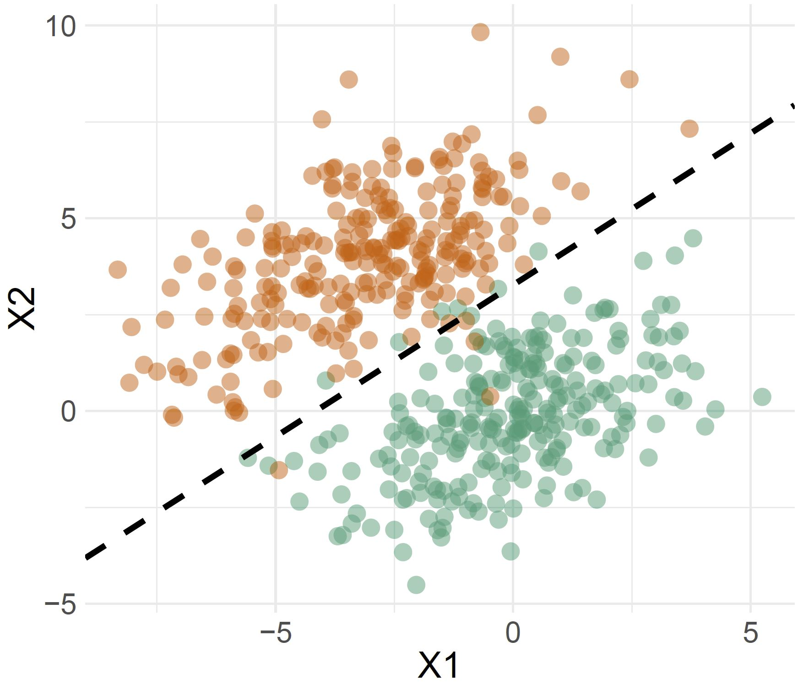
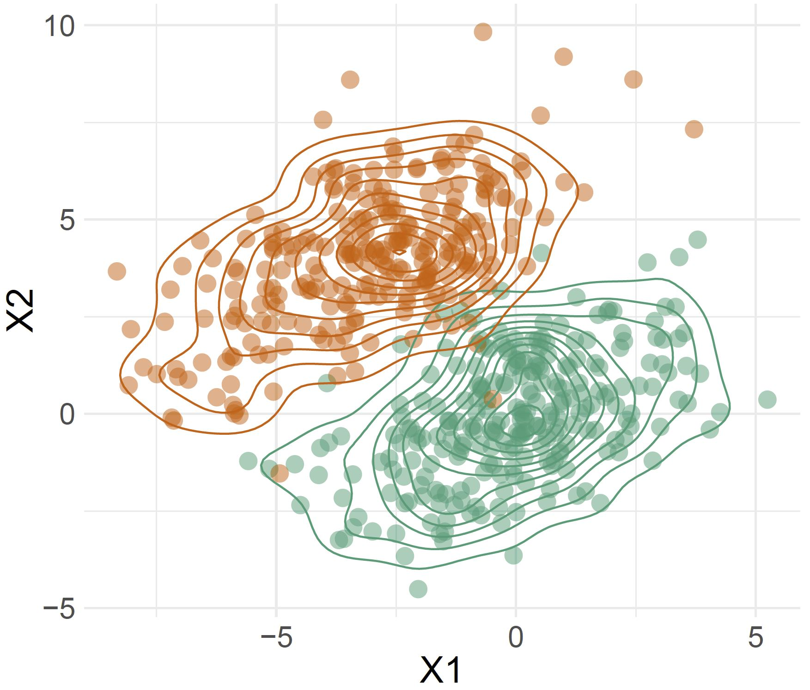
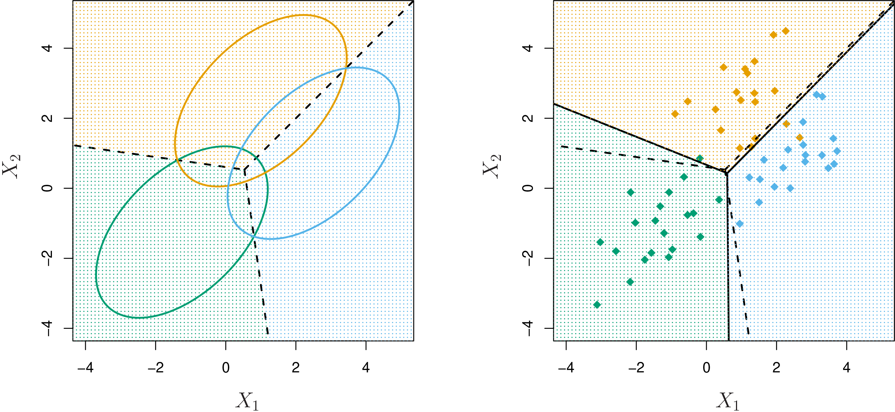

```{r, include = FALSE}
current_file <- knitr::current_input()
basename <- gsub(".Rmd$", "", current_file)

knitr::opts_chunk$set(
  fig.path = sprintf("images/%s/", basename),
  fig.width = 6,
  fig.height = 4,
  out.width = "100%",
  fig.align = "center",
  fig.retina = 3,
  echo = FALSE,
  warning = FALSE,
  message = FALSE,
  cache = FALSE,
  cache.path = "cache/"
)
```

```{r titleslide, child="assets/titleslide.Rmd"}
```

```{r}
library(ISLR)
library(tidyverse)
library(broom)
library(recipes)
library(parsnip)
library(rsample)
library(yardstick)
library(purrr)
library(patchwork)
library(MASS)
library(kableExtra)
library(ggpubr)
library(mvtnorm)
```

---
# Linear Discriminant Analysis

Logistic regression involves directly modeling $P(Y = k|X = x)$ using the logistic function. Rounding the probabilities produces class predictions, in two class problems; selecting the class with the highest probability produces class predictions in multi-class problems.

Another approach for building a classification model is .monash-orange2[linear discriminant analysis]. This involves assuming the .monash-orange2[distribution of the predictors] is a multivariate normal, with the same variance-covariance matrix, separately for each class.

---

class: center

# Compare the pair

<div style="line-height:80%;">
    <br>
</div>

| <span style="color:#3F9F7A"> Logistic Regression </span>    | <span style="color:#3F9F7A"> Linear Discriminant Analysis  </span>   |
| :-------------------: |:-------------------:|
| **Goal** - directly estimate $P(Y \lvert X)$ (*the dashed line*)     | **Goal** - estimate $P(X \lvert Y)$ (*the contours*) to then deduce $P(Y \lvert X)$  |
| **Assumptions** - no assumptions on predictor space      | **Assumptions** - predictors are normally distributed      |
|  |       |


---

.flex[
.w-45[


.font_smaller2[Source: https://xkcd.com]

]

.w-45[
# Assumptions are critical in LDA

- All samples come from normal populations
- All the groups have the same variance-covariance matrix

]
]


---

# Bayes Theorem

Let $f_k(x)$ be the density function for predictor $x$ for class $k$. If $f$ is small, the probability that $x$ belongs to class $k$ is small, and conversely if $f$ is large.

Bayes theorem (for $K$ classes) states:

.info-box[

$$P(Y = k|X = x) = p_k(x) = \frac{\pi_kf_k(x)}{\sum_{i=1}^K \pi_kf_k(x)}$$
]

where $\pi_k = P(Y = k)$ is the prior probability that the observation comes from class $k$.


---
# LDA with $p=1$ predictors

We assume $f_k(x)$ is univariate .monash-orange2[Normal] (Gaussian):

$$f_k(x) = \frac{1}{\sqrt{2 \pi} \sigma_k} \text{exp}~ \left( - \frac{1}{2 \sigma^2_k} (x - \mu_k)^2 \right)$$

where $\mu_k$ and $\sigma^2_k$ are the mean and variance parameters for the $k$th class. Further assume that $\sigma_1^2 = \sigma_2^2 = \dots = \sigma_K^2$; then the conditional probabilities are

$$p_k(x) = \frac{\pi_k \frac{1}{\sqrt{2 \pi} \sigma} \text{exp}~ \left( - \frac{1}{2 \sigma^2} (x - \mu_k)^2 \right) }{ \sum_{l = 1}^K \pi_l \frac{1}{\sqrt{2 \pi} \sigma} \text{exp}~ \left( - \frac{1}{2 \sigma^2} (x - \mu_l)^2 \right) }$$


---
# LDA with $p=1$ predictors

The Bayes classifier is assign new observation $X=x_0$ to the class with the highest $p_k(x_0)$. A simplification of $p_k(x_0)$ yields the .monash-orange2[discriminant functions]:

$$\delta_k(x_0) = x_0 \frac{\mu_k}{\sigma^2} - \frac{\mu_k^2}{2 \sigma^2} + log(\pi_k)$$
and the rule Bayes classifier will assign $x_0$ to the class with the largest value.


---
# LDA with $p=1$ predictors

If $K = 2$ and $\pi_1 = \pi_2$, we assign $x_0$ to class 1 if

$$\delta_1(x_0) > \delta_2(x_0)$$

$$x_0 \frac{\mu_1}{\sigma^2} - \frac{\mu_1^2}{2 \sigma^2} + \log(\pi) > x_0 \frac{\mu_2}{\sigma^2} - \frac{\mu_2^2}{2 \sigma^2} + \log(\pi) $$

which simplifies to  $x_0 > \frac{\mu_1+\mu_2}{2}$.

.info-box[
This is estimated on the data with
$x_0 > \frac{\bar{x}_1 + \bar{x}_2}{2}$.
]

---
# LDA with $p=1$ predictors

```{r out.width=900, fig.height=3}
set.seed("15032019")
n <- 244; n1 <- 55
x <- c(rnorm(n1, -1), rnorm(n-n1, 1))
y <- c(rep(0, n1), rep(1, n-n1))
df <- tibble(x, y)

x <- seq(-4, 4, 0.1)
dx <- c(dnorm(x, -1), dnorm(x, 1))
y <- factor(c(rep(0, length(x)), rep(1, length(x))))
df_pop <- tibble(x=c(x,x), dx, y)
df_means <- df %>% group_by(y) %>%
  summarise(x=mean(x)) %>%
  bind_rows(c(y=1, x=mean(x)))
p1 <- ggplot() +
  geom_rug(data=df, aes(x=x, y=0, colour=factor(y)), alpha=0.7) +
  geom_line(data=df_pop, aes(x=x, y=dx, colour=y)) +
  scale_color_brewer("", palette="Dark2") +
  geom_vline(xintercept=0, colour="grey40", linetype=2) +
  ylab("density") + ggtitle("Population")
p2 <- ggplot(df, aes(x=x, fill=factor(y))) +
        geom_histogram(binwidth=0.67, alpha=0.8) +
  scale_fill_brewer("", palette="Dark2") +
  scale_colour_brewer("", palette="Dark2") +
  facet_wrap(~y, ncol=1, scales="free_y") +
  geom_vline(data=df_means, aes(xintercept=x,
                                colour=factor(y)), linetype=2) +
  geom_vline(xintercept=df_means$x[3], colour="grey40", linetype=2) +
  ggtitle("Data")
ggarrange(p1, p2, ncol=2, common.legend = TRUE)
```


---
# Multivariate LDA

To indicate that a p-dimensional random variable X has a multivariate Gaussian distribution with $E[X] = \mu$ and $\text{Cov}(X) = \Sigma$, we write $X \sim N(\mu, \Sigma)$.

The multivariate normal density function is:

$$f(x) = \frac{1}{(2\pi)^{p/2}|\Sigma|^{1/2}} \exp\{-\frac{1}{2}(x-\mu)^T\Sigma^{-1}(x-\mu)\}$$

with $x, \mu$ are $p$-dimensional vectors, $\Sigma$ is a $p\times p$ variance-covariance matrix.

---
# Multivariate LDA

The discriminant functions are:

$$\delta_k(x) = x^T\Sigma^{-1}\mu_k - \frac{1}{2}\mu_k^T\Sigma^{-1}\mu_k + \log(\pi_k)$$

and Bayes classifier is .monash-orange2[assign a new observation] $x_0$ .monash-orange2[to the class with the highest] $\delta_k(x_0)$.

When $K=2$ and $\pi_1=\pi_2$ this reduces to

Assign observation $x_0$ to class 1 if

$$x_0^T\underbrace{\Sigma^{-1}(\mu_1-\mu_2)}_{dimension~reduction} > \frac{1}{2}(\mu_1+\mu_2)^T\underbrace{\Sigma^{-1}(\mu_1-\mu_2)}_{dimension~reduction}$$

.think-box[Class 1 and 2 need to be mapped to the classes in the your data. The class "to the right" on the reduced dimension will correspond to class 1 in this equation.]

---
class: transition

# Dimension reduction

---
# Dimension reduction via LDA

.monash-orange2[Discriminant space]: a benefit of LDA is that it provides a low-dimensional projection of the $p$-dimensional space, where the groups are the most separated. For $K=2$, this is

$$\Sigma^{-1}(\mu_1-\mu_2)$$
.info-box[This corresponds to the biggest separation between means relative to the variance-covariance.] 

<br><br>
For $K>2$, the discriminant space is found be taking an eigen-decomposition of $\Sigma^{-1}\Sigma_B$, where

$\Sigma_B = \frac{1}{K}\sum_{i=1}^{K} (\mu_i-\mu)(\mu_i-\mu)^T$


---
## Discriminant space


The dashed lines are the Bayes decision boundaries. Ellipses
that contain 95% of the probability for each of the three classes are shown. Solid line corresponds to the class boundaries from the LDA model fit to the sample.

<center>
<a href="http://www-bcf.usc.edu/~gareth/ISL/Chapter4/4.6.pdf" target="_BLANK">  </a>
</center>

.font_smaller2[(Chapter4/4.6.pdf)]

```{r eval=FALSE}
choc <- read_csv("data/chocolates.csv") %>% 
  dplyr::select(Type:Protein_g)
set.seed(2020)
choc_split <- initial_split(choc, 2/3, strata = Type)
choc_tr <- analysis(choc_split)
choc_ts <- assessment(choc_split)
choc_lda <- lda(Type~., data=choc_tr, prior=c(0.5, 0.5))
choc_tr_pred <- predict(choc_lda, choc_tr)
choc_ts_pred <- predict(choc_lda, choc_ts)
choc_tr <- choc_tr %>% 
  mutate(ld1=choc_tr_pred$x, 
            pType=choc_tr_pred$class, 
            set="train")
choc_ts <- choc_ts %>% 
  mutate(ld1=choc_ts_pred$x, 
            pType=choc_ts_pred$class, 
            set="test")
choc_fit <- bind_rows(choc_tr, choc_ts)
ggplot(choc_fit, aes(x=ld1, fill=Type)) +
  geom_histogram(binwidth=0.5) +
  facet_grid(set~Type)
# Compute means
choc_mean_pred <- predict(choc_lda, 
                          data.frame(choc_lda$means))$x
ggplot(choc_fit, aes(x=ld1, fill=Type)) +
  geom_histogram(binwidth=0.5) +
  facet_grid(set~Type) +
  geom_vline(xintercept=sum(choc_mean_pred)/2, linetype=2)
# Training error
table(choc_tr$Type, choc_tr$pType)
# Test error
table(choc_ts$Type, choc_ts$pType)
```

---
# Discriminant space: using sample statistics

.info-box[.monash-orange2[Discriminant space]: is the low-dimensional space where the class means are the furthest apart relative to the common variance-covariance.]

The discriminant space is provided by the eigenvectors after making an eigen-decomposition of $\hat{\Sigma}^{-1}\hat{\Sigma}_B$, where

$$\small{\hat{\Sigma}_B = \frac{1}{K}\sum_{i=1}^{K} (\bar{x}_i-\bar{x})(\bar{x}_i-\bar{x})^T}
~~~\text{and}~~~
\small{\hat{\Sigma} = \frac{1}{K}\sum_{k=1}^K\frac{1}{n_k}\sum_{i=1}^{n_k} (x_i-\bar{x}_k)(x_i-\bar{x}_k)^T}$$


---

class: split-two
layout: false

.column[.pad50px[

## Mahalanobis distance

For two $p$-dimensional vectors, Euclidean distance is

$$d(x,y) = \sqrt{(x-y)^T(x-y)}$$
and Mahalanobs distance is

$$d(x,y) = \sqrt{(x-y)^T\Sigma^{-1}(x-y)}$$

Which points are closest according to .monash-orange2[Euclidean] distance?
Which points are closest relative to the .monash-orange2[variance-covariance]?


]]
.column[.content.vmiddle.center[

```{r}
# Utility functions
f.norm.vec<-function(x) {
  x<-x/f.norm(x)
  x
}
f.norm<-function(x) { sqrt(sum(x^2)) }
f.gen.sphere<-function(n=100,p=5) {
  x<-matrix(rnorm(n*p),ncol=p)
  xnew<-t(apply(x,1,f.norm.vec))
  xnew
}
f.vc.ellipse <- function(vc, xm, n=500) {
  p<-ncol(vc)
  x<-f.gen.sphere(n,p)

  evc<-eigen(vc)
  vc2<-(evc$vectors)%*%diag(sqrt(evc$values))%*%t(evc$vectors)
  x<-x%*%vc2

  x + matrix(rep(xm, each=n),ncol=p)
}
df <- f.vc.ellipse(vc=matrix(c(1,1.2,1.2,2), ncol=2), xm=c(0,0), n=1000)
df <- as_tibble(df)
```

```{r}
pts <- tibble(V1=c(0, -0.5, -0.8), V2=c(0, 0.5, -1.1), label=c("A", "B", "C"))
ggplot(df, aes(x=V1, y=V2)) + geom_point() + 
  geom_point(data=pts, aes(x=V1, y=V2, colour=label)) +
  geom_text(data=pts, aes(x=V1, y=V2, label=label), nudge_x = 0.1, nudge_y = 0.1) +
  scale_colour_brewer("", palette="Dark2") +
  xlim(c(-1.5, 1.5)) + ylim(c(-1.5, 1.5)) +
  theme(legend.position = "none", aspect.ratio=1)
```


]]

---
## Discriminant space

Both means the same. Two different variance-covariance matrices. .purple[Discriminant space] depends on the variance-covariance matrix.

```{r out.width="70%", fig.width=8}
df1 <- f.vc.ellipse(vc=matrix(c(1,1.2,1.2,2), ncol=2), xm=c(0,0), n=1000)
df1 <- as_tibble(df1)
df2 <- f.vc.ellipse(vc=matrix(c(1,-0.3,-0.3,0.5), ncol=2), xm=c(0,0), n=1000)
df2 <- as_tibble(df2)
means <- tibble(V1=c(0.5, -0.5), V2=c(-0.5, 0.5), label=c("mu1", "mu2"))

df3 <- df1 %>% mutate(V1=V1+means$V1[1], 
                      V2=V2+means$V2[1])
df4 <- df1 %>% mutate(V1=V1+means$V1[2], 
                      V2=V2+means$V2[2])
df <- bind_rows(df3, df4)
p1 <- ggplot(df, aes(x=V1, y=V2)) + geom_point() + 
  geom_point(data=means, aes(x=V1, y=V2, colour=label)) +
  geom_text(data=means, aes(x=V1, y=V2, label=label), nudge_x = 0.2, nudge_y = 0.2) +
  geom_abline(intercept=0, slope=-0.67, colour="purple") +
  scale_colour_brewer("", palette="Dark2") +
  xlim(c(-2, 2)) + ylim(c(-2, 2)) +
  theme(legend.position = "none", aspect.ratio=1) +
  ggtitle("Scenario 1")
df3 <- df2 %>% mutate(V1=V1+means$V1[1], 
                      V2=V2+means$V2[1])
df4 <- df2 %>% mutate(V1=V1+means$V1[2], 
                      V2=V2+means$V2[2])
df <- bind_rows(df3, df4)
p2 <- ggplot(df, aes(x=V1, y=V2)) + geom_point() + 
  geom_point(data=means, aes(x=V1, y=V2, colour=label)) +
  geom_text(data=means, aes(x=V1, y=V2, label=label), nudge_x = 0.2, nudge_y = 0.2) +
  geom_abline(intercept=0, slope=3.03, colour="purple") +
  scale_colour_brewer("", palette="Dark2") +
  xlim(c(-1.7, 1.7)) + ylim(c(-1.7, 1.7)) +
  theme(legend.position = "none", aspect.ratio=1) +
  ggtitle("Scenario 2")
p1 + p2
```

```{r eval=FALSE}
# This code helps estimate the slope in the above diagram
mydat1 <- data.frame(rbind(rmvnorm(250, mean=c(0.5, -0.5), sigma=matrix(c(1,1.2,1.2,2), ncol=2)),
                rmvnorm(250, mean=c(-0.5, 0.5), sigma=matrix(c(1,1.2,1.2,2), ncol=2))))
mydat1$class <- c(rep(1, 250), rep(2, 250))
lda(class~X1+X2, data=mydat1)

mydat2 <- data.frame(rbind(
  rmvnorm(250, mean=c(0.5, -0.5), sigma=matrix(c(1,-0.3,-0.3,0.5), ncol=2)),
  rmvnorm(250, mean=c(-0.5, 0.5), sigma=matrix(c(1,-0.3,-0.3,0.5), ncol=2))))
mydat2$class <- c(rep(1, 250), rep(2, 250))
lda(class~X1+X2, data=mydat2)
```

---
class: transition

# Quadratic Discriminant Analysis

If the groups have different variance-covariance matrices, but still come from a normal distribution

---
# Quadratic DA (QDA)

If the variance-covariance matrices for the groups are .monash-orange2[NOT EQUAL], then the discriminant functions are:

$$\delta_k(x) = x^T\Sigma^{-1}x + x^T\Sigma^{-1}\mu_k - \frac12\mu_k^T\Sigma^{-1}\mu_k - \frac12 \log{|\Sigma_k|} + \log(\pi_k)$$

---
## Quadratic DA (QDA)
A quadratic boundary is obtained by relaxing the assumption of equal variance-covariance, and assume that $\Sigma_k \neq \Sigma_l, ~~k\neq l, k,l=1,...,K$

<center>
<a href="http://www-bcf.usc.edu/~gareth/ISL/Chapter4/4.9.pdf" target="_BLANK">  </a>
</center>

.purple[true], LDA, .green[QDA]. 

.font_smaller2[(Chapter4/4.9.pdf)]

---
# QDA: Olive oils example

.flex[
```{r results='hide'}
olive <- read_csv("http://ggobi.org/book/data/olive.csv") %>%
  dplyr::filter(region != 1) %>%
  dplyr::select(region, arachidic, linoleic) %>%
  dplyr::mutate(region = factor(region))

set.seed(775)
olive_split <- initial_split(olive, 2/3, strata = region)
olive_train <- analysis(olive_split)
olive_test <- assessment(olive_split)

olive_qda_fit <- qda(region ~ ., 
      data = olive_train)
# olive_qda_fit

olive_train <- olive_train %>%
  mutate(pred = predict(olive_qda_fit, olive_train)$class)
olive_test <- olive_test %>%
  mutate(pred = predict(olive_qda_fit, olive_test)$class)
metrics(olive_train, truth = region, 
        estimate = pred) %>%
  kable(caption = "Training") %>%
  kable_styling(full_width = FALSE)
metrics(olive_test, truth = region, 
        estimate = pred) %>%
  kable(caption = "Test") %>%
  kable_styling(full_width = FALSE)
```

.w-45[
Even if the population is NOT normally distributed, QDA might do reasonably. On this data, region 3 has a "banana-shaped" variance-covariance, and region 2 has two separate clusters. The quadratic boundary though does well to carve the space into neat sections dividing the two regions.
]
.w-45[
```{r out.width="100%", fig.width=4, fig.height=4}
olive_grid <- expand_grid(arachidic = seq(0, 105, 2.5),
                    linoleic = seq(500, 1500, 20))
olive_grid <- olive_grid %>%
  mutate(pred = predict(olive_qda_fit, olive_grid)$class)

ggplot() +
  geom_point(data=olive_grid, 
             aes(x=arachidic, y=linoleic, colour=pred), 
             size=2) + 
  geom_point(data=olive, 
             aes(x=arachidic, y=linoleic, shape=region),
             size = 2, alpha=0.7) +
  scale_colour_brewer(palette="Dark2") +
  theme_bw() + theme(legend.position = "bottom")

```
]
]

---

```{r endslide, child="assets/endslide.Rmd"}
```
