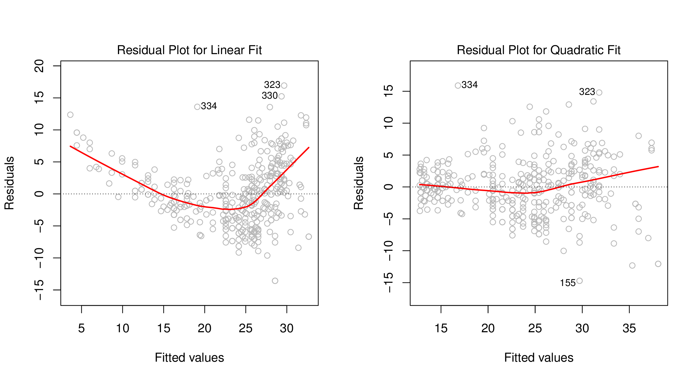
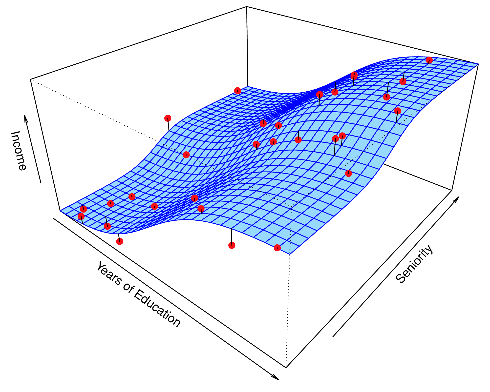

```{r, include = FALSE}
current_file <- knitr::current_input()
basename <- gsub(".Rmd$", "", current_file)

knitr::opts_chunk$set(
  fig.path = sprintf("images/%s/", basename),
  fig.width = 6,
  fig.height = 4,
  out.width = "100%",
  fig.align = "center",
  fig.retina = 3,
  echo = FALSE,
  warning = FALSE,
  message = FALSE,
  cache = FALSE,
  cache.path = "cache/"
)
```

```{r titleslide, child="assets/titleslide.Rmd"}
```

---
```{r}
library(ISLR)
library(tidyverse)
library(broom)
library(recipes)
library(parsnip)
library(rsample)
library(yardstick)
library(purrr)
library(patchwork)
library(MASS)
library(kableExtra)
library(ggpubr)
library(mvtnorm)
library(tourr)
library(GGally)
```


# Parallel coordinate plots

- Scatterplots use orthogonal axes, and are thus limited to two variables on the page.
- Turning the axes parallel allows for many more variables to be displayed together.
- Lines connecting the points show associations between variables.

```{r out.width="90%", fig.width=10, fig.height=3, fig.show='hold'}
library(gridExtra)
p1 <- ggplot(flea, aes(x=tars1, y=tars2, colour=species)) + geom_rug() +
  geom_point() + scale_colour_brewer(palette="Dark2") + 
  theme(aspect.ratio=1, legend.position="none")
p2 <- ggparcoord(flea, columns=2:3, groupColumn = 1, 
           showPoints=TRUE, alphaLines = 0) +
  scale_colour_brewer(palette="Dark2") + ylab("") +
  theme(aspect.ratio=1, legend.position="none")
p3 <- ggparcoord(flea, columns=2:3, groupColumn = 1, showPoints=TRUE) +
  scale_colour_brewer(palette="Dark2") + ylab("") +
  theme(aspect.ratio=1, legend.position="none")
grid.arrange(p1, p2, p3, ncol=3)
```


---
# Comparison with tours

Compare the tour of the flea data, with three clusters:

<iframe src="images/lecture-05a/flea6d.html" width="800" height="500" scrolling="yes" seamless="seamless" frameBorder="0"> </iframe>


---
# Comparison with tours

With the parallel coordinate plot:

```{r out.width="90%", fig.height=4, fig.width=10}
ggparcoord(flea, columns=2:7, groupColumn = 1) +
  scale_colour_brewer(palette="Dark2") + ylab("") +
  theme(legend.position="none")
```

Note: the trend in lines, that there seem to be three patterns of lines.


---
# How to read parallel coordinate plots

- A set of points in $p$-dimensional space map to a set of lines in $p$ parallel axes
- The pattern among and between the lines indicate structure in high-dimensions
    - Groups of lines trending together indicate clustering
    - Single lines trending differently to other indicate outliers
    - Between pairs of axes intersecting lines indicate strong negative association, and parallel lines indicate strong positive association
    
.monash-green2[.center[Points in Euclidean space $\equiv$ lines in parallel coordinates
]]


---
# Parallel coordinate plots - controls

Details that need to be controlled:

- .monash-orange2[Order of axes] can affect perception of structure. Placing axes next to each other emphasizes that association
- Variables need to be on a similar scale, and may need to be .monash-orange2[standardised]


---

.flex[
.w-45[
# Parallel coordinate plots - controls

Unordered, default standardised scale.
]


```{r out.width="90%", fig.width=10, fig.height=4}
ggparcoord(flea, columns=2:7, groupColumn = 1) +
  scale_colour_brewer(palette="Dark2") + 
  ylab("") +
  theme(legend.position="none")
```

]


---

.flex[
.w-45[
# Parallel coordinate plots - controls

.monash-orange2[Ordered], default standardised scale.


]

```{r out.width="90%", fig.width=10, fig.height=4}
ggparcoord(flea, columns=2:7, groupColumn = 1,
  order="anyClass") +
  scale_colour_brewer(palette="Dark2") + 
  ylab("") +
  theme(legend.position="none")
```


]

---

.flex[
.w-45[

# Parallel coordinate plots - controls


Ordered, .monash-orange2[centered] standardised scale.


]

```{r out.width="90%", fig.width=10, fig.height=4}
ggparcoord(flea, columns=2:7, groupColumn = 1, order="anyClass", scale="center") +
  scale_colour_brewer(palette="Dark2") + ylab("") +
  theme(legend.position="none")
```

]

---
.flex[
.w-45[

# Parallel coordinate plots - controls

Ordered, .monash-orange2[scaled univariately to 0-1].


]


```{r out.width="90%", fig.width=10, fig.height=4}
ggparcoord(flea, columns=2:7, groupColumn = 1, order="anyClass", scale="uniminmax") +
  scale_colour_brewer(palette="Dark2") + ylab("") +
  theme(legend.position="none")
```

]

---
.flex[
.w-45[

# Parallel coordinate plots - controls


Ordered, scaled .monash-orange2[globally] to 0-1.


]

```{r out.width="90%", fig.width=10, fig.height=4}
ggparcoord(flea, columns=2:7, groupColumn = 1, order="anyClass", scale="globalminmax") +
  scale_colour_brewer(palette="Dark2") + ylab("") +
  theme(legend.position="none")
```
]


---
# Andrews curves

For the $p$ variables $(x_1, ..., x_p)$ make a fourier transform $f_x(t) = x_1/\sqrt{2} +$ $x_2\sin(t) +$ $x_3\cos(t) +$ $x_4\sin(2t) +$ $x_5\cos(2t)+...$

```{r out.width="70%", fig.height = 3}
library(tourr)
library(tidyverse)
# Code by yannabraham from https://gist.github.com/yannabraham/5b71b9599b460968f72e9b7ae63868e7
do.andrews <- function(x, breaks=30) {
  require(reshape2)
  
  t <- seq(-pi, pi, pi/breaks)
  m<-nrow(x)
  n<-ncol(x)
  
  f <- matrix(t,nrow=length(t),ncol=n)
  j <- seq(2,n)
  
  f[,j[j%%2==0]] <- sweep(f[,j[j%%2==0],drop=FALSE],
                          2,
                          j[j%%2==0]/2,
                          `*`)
  
  f[,j[j%%2!=0]] <- sweep(f[,j[j%%2!=0],drop=FALSE],
                          2,
                          j[j%%2!=0]%/%2,
                          `*`)
  f[,j[j%%2==0]] <- sin(f[,j[j%%2==0]])
  f[,j[j%%2!=0]] <- cos(f[,j[j%%2!=0]])
  
  f <- x[,j]%*%t(f[,j])
  f <- f+matrix(x[,1]/2^0.5,nrow=m,ncol=length(t),byrow=F)
  
  res <- melt(f,varnames=c('RowId','AndrewsId'),value.name = 'AndrewsValue')
  res[,'AndrewsId'] <- t[res[,'AndrewsId']]
  
  return(res)
}
scale2 <- function(x, na.rm = TRUE) (x - mean(x, na.rm = na.rm)) / sd(x, na.rm)
flea_std <- flea %>%
  mutate_if(is.numeric, scale2)
flea_std %>% 
  group_by(species) %>%
  do({do.andrews(as.matrix(dplyr::select(.,-species)))}) %>%
  ggplot(aes(x=AndrewsId, 
             y=AndrewsValue, 
             color=species,
             group=interaction(species, RowId))) +
          geom_line() +
          scale_colour_brewer(palette="Dark2") +
          ylab("")
```

Preceded the tour, but like a tour $(d=1)$ laid out on a page, but algorithm is not space-filling. 

---

# Categorical variables

.monash-orange2[Hammock plots] are a variation of parallel coordinate plots for categorical variables. They show the flow of groups between stacked barcharts, providing information about the association between multiple categorical variables.

```{r out.width="60%", fig.height = 4}
library(ggparallel)
titanic <- as.data.frame(Titanic)
ggparallel(names(titanic)[c(1,4,2,3)], titanic, weight="Freq", asp=0.5,
           method="hammock", ratio=0.2, order=c(0,0)) +
theme( legend.position="none") +
scale_fill_brewer(palette="Paired") +
scale_colour_brewer(palette="Paired")

```

---
# Categorical variables

.monash-orange2[Mosaic plots] partition the axes sequentially on the categorical variables. 

```{r out.width="50%", fig.width=6, fig.height=3}
library(ggmosaic)
data(Titanic)
titanic <- as.data.frame(Titanic)
titanic$Survived <- factor(titanic$Survived, levels=c("Yes", "No"))

ggplot(data=titanic) +
  geom_mosaic(aes(weight=Freq, x=product(Class), fill=Survived)) +
  scale_fill_brewer(palette="Dark2")
```

For this data, `titanic`, there is a response variable, "Survived" and good practice would have this variable mapped to fill colour, because we are interested in the proportion change in response across the predictor categories.

---
# Categorical variables

.monash-orange2[Mosaic plots] can handle multiple categorical variables. 

```{r out.width="80%", fig.width=6, fig.height=3}
library(ggmosaic)
data(Titanic)
titanic <- as.data.frame(Titanic)
titanic$Survived <- factor(titanic$Survived, levels=c("Yes", "No"))

ggplot(data=titanic) +
  geom_mosaic(aes(weight=Freq, x=product(Class, Sex),
                  fill=Survived), divider=ddecker()) +
  scale_fill_brewer(palette="Dark2") + 
  theme(axis.text.x=element_text(angle=45), legend.position="none")
```


---
class: split-50
layout: false

.column[.pad10px[

Data in the model space

[Wickham, Cook, Hofmann (2015) Visualizing statistical models: Removing the blindfold, Statistical Analysis and Data Mining, 8(4):203-225.](https://vita.had.co.nz/papers/model-vis.html)


<a href="http://www-bcf.usc.edu/~gareth/ISL/Chapter3/3.9.pdf" target="_BLANK">  </a>

.font_tiny[(Chapter3/3.9.pdf)]
]]
.column[.pad10px[
Model in the data space


<a href="http://www-bcf.usc.edu/~gareth/ISL/Chapter2/2.3.pdf" target="_BLANK">  </a>


]]
---
# Inference

Its hard to read residual plots. How do you know if the residual plot "really" has no structure?

```{r out.width="60%", fig.height=4, fig.width=8}
nrc <- read_csv(here::here("data/nrc.csv"))
nrc <- nrc %>% rename(R.rank = R.Rankings.5th.Percentile,
                      Research = Research.Activity.5th.Percentile,
                      Student = Student.Support.Outcomes.5th.Percentile,
                      Diversity = Diversity.5th.Percentile)
fit1 <- lm(R.rank~Research+Student+Diversity, data=nrc)
nrc_fit <- augment(fit1, nrc[,c("R.rank", "Research",
                                "Student", "Diversity")])
ggduo(nrc_fit, columnsX = c(2, 3, 4), columnsY = 6)
```


---

# Residual plots with no structure

If there is still structure in the residual plot, the "true" residual plot should be identifiable from the plots of "null" residual plots. 

.flex[
.w-45[
```{r out.width="80%", fig.height=4, fig.width=8}
library(nullabor)
set.seed(20190401)
nrc_lineup <- lineup(null_lm(R.rank~Research+Student+Diversity, method = 'sigma'), nrc_fit, n=4, pos=3)
ggduo(filter(nrc_lineup, .sample==1), columnsX = c(2, 3, 4), columnsY = 6) + ggtitle("Sample 1")
ggduo(filter(nrc_lineup, .sample==2), columnsX = c(2, 3, 4), columnsY = 6) + ggtitle("Sample 2")
```
]
.w-45[
```{r out.width="80%", fig.height=4, fig.width=8}
ggduo(filter(nrc_lineup, .sample==3), columnsX = c(2, 3, 4), columnsY = 6) + ggtitle("Data")
ggduo(filter(nrc_lineup, .sample==4), columnsX = c(2, 3, 4), columnsY = 6) + ggtitle("Sample 4")
```
]]


---

```{r endslide, child="assets/endslide.Rmd"}
```
