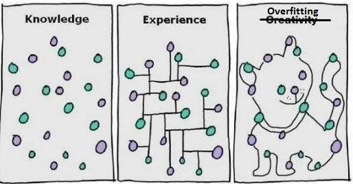
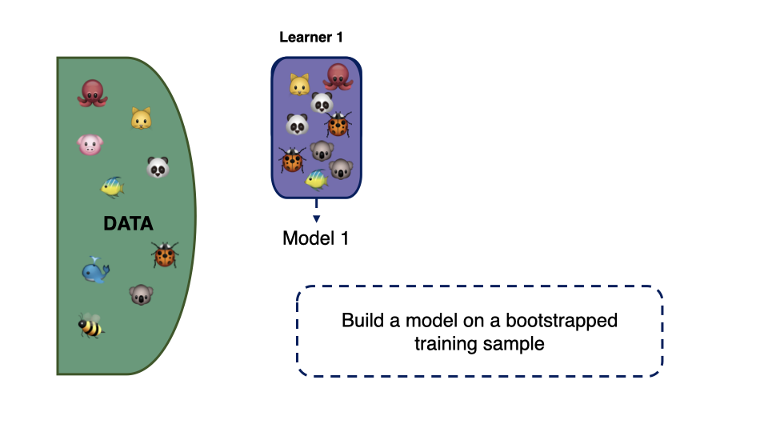
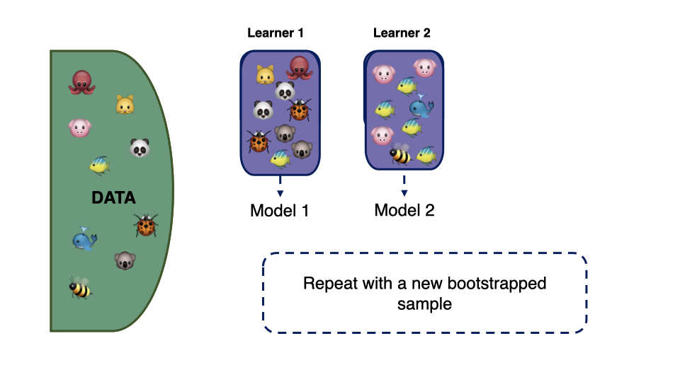
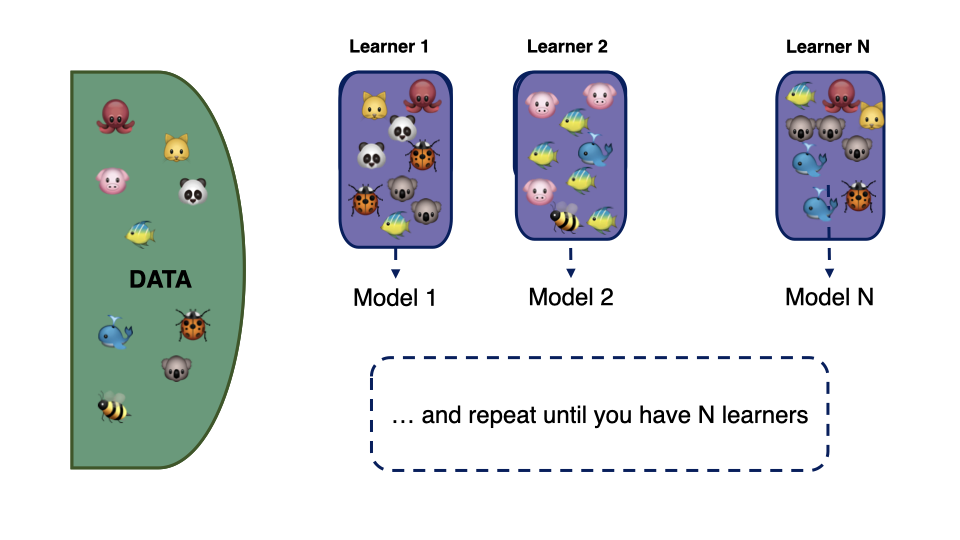
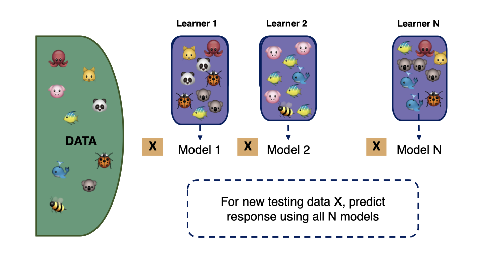
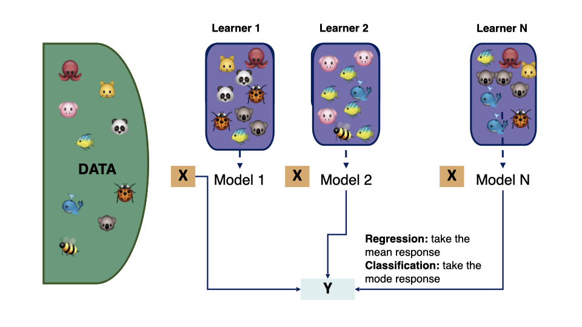
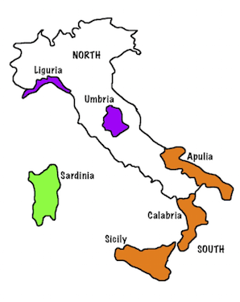

```{r, include = FALSE}
current_file <- knitr::current_input()
basename <- gsub(".Rmd$", "", current_file)

knitr::opts_chunk$set(
  fig.path = sprintf("images/%s/", basename),
  fig.width = 6,
  fig.height = 4,
  out.width = "100%",
  fig.align = "center",
  fig.retina = 4,
  echo = FALSE,
  warning = FALSE,
  message = FALSE,
  cache = FALSE,
  cache.path = "cache/"
)
```

```{r titleslide, child="assets/titleslide.Rmd"}
```

```{r}
library(ISLR)
library(tidyverse)
library(broom)
library(tidymodels) 
library(workflows)
library(purrr)
library(patchwork)
library(MASS)
library(kableExtra)
library(ggpubr)
library(mvtnorm)
library(rpart.plot)
library(randomForest)
library(GGally)
```
---
# What's wrong with a single tree?
<br>
<center>

</center>

.font_tiny[Source: Hugh MacLeod / Statistical Statistics Memes]
---
# Solution? Ensemble methods

Ensemble methods use multiple learning algorithms to obtain better predictive performance than any of the single constituents.

<center>

</center>


---

# Roadmap

We will learn about different ensembles, increasing in complexity (but also potentially in predictive performance) as we go. These methods are

- .monash-blue2[Bagging]: combine the predictions of multiple trees, fitted on bootstrap samples.
- .monash-blue2[Random forests]: combine predictions from bagged trees, plus random samples of predictors.
- .monash-blue2[Boosted trees]: combine predictions from trees sequentially fit to residuals from previous fit.


---
# Bootstrap aggregation

- Take $B$ different *bootstrapped* training sets:
$$D_1, D_2, \dots, D_B$$
- Build a separate prediction model using each $D_{(\cdot)}$:
$$\hat{f}_1(x), \hat{f}_2(x), \dots, \hat{f}_B(x)$$
- Combine resulting predictions, e.g. average
$$\hat{f}_{\text{avg}}(x) = \frac1B \sum_{b = 1}^{B} \hat{f}_b(x)$$


---
# Bagging trees

.monash-orange2[Bagged trees]

- Construct $B$ regression trees using $B$ bootstrapped training sets, and average the resulting predictions. 
- Each individual tree has .monash-orange2[high variance, but low bias]. 
- Averaging these $B$ trees .monash-orange2[reduces the variance]. 
- For classification trees, there are several possible aggregation methods, but the simplest is the **majority vote**. 
	
---

# Bagged trees - construction

<center>

</center>


---
# Bagged trees - construction

<center>

</center>

---
# Bagged trees - construction

<center>

</center>

---
# Bagged trees - construction

<center>

</center>

---
# Bagged trees - construction

<center>

</center>
---
# Out of bag error

- .monash-orange2[No need to use (cross-)validation] to **estimate the test error** of a bagged model (**debatable by some**).
- On average, each bagged tree makes use of around .monash-orange2[two-thirds of the observations]. (Check the textbook exercise.)
- The remaining observations not used to fit a given bagged tree are referred to as the .monash-orange2[out-of-bag (OOB)] observations.
- We can predict the response for the $i^{th}$ observation using each of the trees in which that observation was OOB. This will yield around .monash-orange2[B/3 predictions] for the $i^{th}$ observation.
- To obtain a single prediction for the $i^{th}$ observation, average these predicted responses (regression) or can take a majority vote (classification).
	

---

# From bagging to random forests

However, when bagging trees, a problem still exists. Although the model building steps are independent, the trees in bagging are not completely independent of each other since all the original features are considered at every split of every tree. Rather, trees from different bootstrap samples typically have similar structure to each other (especially at the top of the tree) due to any underlying strong relationships.

To deal with this, we can use .monash-orange2[random forests] to help over come this, by sampling the predictors as well as the samples!

---
# Random forests  - the algorithm 


1. Input: $L = {(x_i, y_i), i=1, ..., n}, y_i \in \{1, ..., k\}, m < p$, number of variables chosen for each tree, $B$ is the number of bootstrap samples.
2. For $b =1, 2, ..., B$:

  i. Draw a bootstrap sample, $L^{*b}$ of size $n^{*b}$ from $L$.
    
  ii. Grow tree classifier, $T^{*b}$. .monash-blue2[At each node use a random selection of `\\(m\\)` variables, and grow to maximum depth without pruning.]
    
  iii. Predict the class of each case not drawn in $L^{*b}$.
    
3. Combine the predictions for each case, by majority vote, to give predicted class.
	


---
# Random forest - diagnostics

- Error is computed automatically on the out-of-bag cases.
- .monash-orange2[Variable importance]: more complicated than one might think
- .monash-orange2[Vote matrix], $n\times K$: Proportion of times a case is predicted to the class $k$.
- .monash-orange2[Proximities], $n\times n$: Closeness of cases measured by how often they are in the same terminal node.


---
layout: true

# Variable importance

.row[.content[
1.For every tree predict the oob cases and count the number of votes .monash-orange2[cast for the correct class]. 
]]
.row[.content[
2..monash-orange2[Randomly permute] the values on a variable in the oob cases and predict the class for these cases. 
]]
.row[.content[
3.Difference the votes for the correct class in the variable-permuted oob cases and the real oob cases. Average this number over all trees in the forest. If the .monash-orange2[value is large, then the variable is very important]. 
]]
.row[.content[
Alternatively, .monash-orange2[Gini importance] adds up the difference in impurity value of the descendant nodes with the parent node. Quick to compute.
]]

<br><br><br>
Read a fun explanation here by [Harriet Mason](https://numbat.space/post/permutation_variable_importance/permutationvariableimportance/)
---
class: fade-row2 fade-row3 fade-row4
count: false
---
class: fade-row3 fade-row4
count: false
---
class: fade-row4
count: false
---
count: false

---
layout: false

# Vote Matrix

- .monash-orange2[Proportion of trees] the case is predicted to be each class, ranges between 0-1
- Can be used to .monash-orange2[identify troublesome] cases.
- Used with plots of the actual data can help determine if it is the record itself that is the problem, or if method is biased.
- Understand the difference in accuracy of prediction for different classes.

---
layout: false

# Proximities

- Measure how each pair of observations land in the forest
- Run both in- and out-of-bag cases down the tree, and increase proximity value of cases $i, j$ by 1 each time they are in the same terminal node. 
- Normalize by dividing by $B$.


---
class: split-two

.column[.pad50px[

# Example - Olive oil data

Distinguish the region where oils were produced by their fatty acid signature. 
Important in quality control and in determining fraudulent marketing. 

**Areas in the south:**

1. North-Apulia <br>
2. Calabria <br>
3. South-Apulia <br>
4. Sicily

]]

.column[.content.vmiddle.center[





]]


---

# Example - Olive oil data

Classifying the olive oils in the south of Italy - difficult classification task.

```{r}
olive <- read_csv("http://ggobi.org/book/data/olive.csv") %>%
  rename(name=X1)
olive <- olive %>%
  filter(region == 1)
```

```{r eval=FALSE}
library(tourr)
library(RColorBrewer)
# drop eicosenoic, all low for south
animate_xy(olive[,4:10], axes="off", col=olive$area) 
# Drop Sicily
animate_xy(olive[olive$area!=4,4:10], axes="off", col=col[olive$area!=4]) 
animate_xy(olive[,c(5, 7, 8)], axes="off", col=olive$area) 
animate_xy(olive[olive$area!=4,c(5, 7, 8)], axes="off", col=olive$area[olive$area!=4]) 
```

```{r eval=FALSE}
# create animation
library(plotly)
library(htmltools)
set.seed(20190411)
bases <- save_history(olive[,4:10], grand_tour(2), 
    start=matrix(c(1,0,0,1,0,0,0,0,0,0,0,0,0,0), ncol=2, byrow=TRUE), 
    max = 15)
# Re-set start bc seems to go awry
bases[,,1] <- matrix(c(1,0,0,1,0,0,0,0,0,0,0,0,0,0), ncol=2, byrow=TRUE)
tour_path <- interpolate(bases, 0.1)
d <- dim(tour_path)
olive_std <- tourr::rescale(olive[,4:10])
mydat <- NULL; 
for (i in 1:d[3]) {
  fp <- as.matrix(olive_std) %*% matrix(tour_path[,,i], ncol=2)
  fp <- tourr::center(fp)
  colnames(fp) <- c("d1", "d2")
  mydat <- rbind(mydat, cbind(fp, rep(i+10, nrow(fp))))
}
colnames(mydat)[3] <- "indx"
df <- as_tibble(mydat) 
df <- df %>%
  mutate(area=factor(rep(olive$area, d[3])))
p <- ggplot() +
       geom_point(data = df, aes(x = d1, y = d2,
                                 colour=area,
                                 frame = indx), size=1) +
       scale_colour_brewer("", palette="Dark2") +
       theme_void() +
       coord_fixed() +
  theme(legend.position="none")
pg <- ggplotly(p, width=400, height=400) %>%
  animation_opts(200, redraw = FALSE, 
                 easing = "linear", transition=0)
save_html(pg, file="olive1.html")
```

<center>
<iframe src="olive1.html" width="800" height="500" scrolling="yes" seamless="seamless" frameBorder="0"> </iframe>
</center>


---
# Example - random forest fit

```{r echo=TRUE}
set.seed(2021)
olive <- olive %>%
  mutate(area = factor(area)) %>% 
  dplyr::select(area:arachidic) 
olive_split <- initial_split(olive, 2/3, 
                             strata = area)
olive_tr <- training(olive_split) 
olive_ts <- testing(olive_split) 

olive_rf <- rand_forest() %>% #<<
  set_engine("randomForest", #<<
             importance=TRUE, proximity=TRUE) %>% #<<
  set_mode("classification") %>% #<<
  fit(area~., data=olive_tr) #<<
```

---

```{r}
olive_rf
```

---

# Test set confusion and accuracy

```{r echo=TRUE}
olive_ts_pred <- olive_ts %>%
  mutate(.pred = predict(olive_rf, olive_ts)$.pred_class)
conf_mat(olive_ts_pred, area, .pred)$table %>% addmargins()
bal_accuracy(olive_ts_pred, area, .pred)$.estimate
```

---

# Diagnostics - variable importance

```{r}
options(digits=2)
olive_rf$fit$importance[,1:4]
olive_rf$fit$importance[,5:6]
```


---
# Important variables

<center>
```{r out.width = "70%"}
ggplot(olive, 
       aes(x=linoleic, y=palmitoleic, colour=area)) +   geom_point() +
  scale_color_brewer("", palette = "Dark2") +
  ggtitle("Overall") +
  theme(aspect.ratio = 1)
```
</center>

---
class: split-40


.column[.pad50px[
# Diagnostics - vote matrix 


<br>

Examining the vote matrix allows us to see which samples the algorithm had trouble classifying.

.monash-orange2[Look rows 3 and 5. How confident would you be in the classifications of these two observations?]
]]
.column[.content.vmiddle[


```{r}
options(digits=4)
olive_rf$fit$votes %>% as_tibble() %>% slice(1:10)
```

]]

---
class: split-50
layout: false

.column[.pad10px[

```{r out.width="100%", fig.width=6, fig.height=6}
vt <- data.frame(olive_rf$fit$votes)
vt$area <- olive_tr$area

ggscatmat(vt, columns=1:4, col="area") + 
  scale_colour_brewer("", palette="Dark2")
```


]]
.column[.top50px[

```{r out.width="100%", fig.width=6, fig.height=6}
f.helmert <- function(d)
{
  helmert <- rep(1/sqrt(d), d)
  for(i in 1:(d-1))
  {
    x <- rep(1/sqrt(i*(i+1)), i)
    x <- c(x, -i/sqrt(i*(i+1)))
    x <- c(x, rep(0, d - i - 1))
    helmert <- rbind(helmert, x)
  }
  rownames(helmert) <- paste("V", 1:d, sep="")
  return(helmert)
}
proj <- t(f.helmert(4)[-1,])
vtp <- as.matrix(vt[,-5])%*%proj
vtp <- data.frame(vtp, area=vt$area)
ggscatmat(vtp, columns=1:3, col="area") + 
  scale_colour_brewer("", palette="Dark2")
```

```{r eval=FALSE}
library(tourr)
library(RColorBrewer)
quartz()
pal <- brewer.pal(4, "Dark2")
col <- pal[as.numeric(vtp[, 4])]
animate_xy(vtp[,1:3], col=col, axes = "bottomleft")
```


]]

---

# From Random Forests to Boosting

Whereas random forests build an ensemble of .monash-blue2[deep independent trees], .monash-orange2[boosted trees] build an ensemble of .monash-orange2[shallow trees in sequence] with each tree learning and improving on the previous one.

<center>

</center>

.font_tiny[Source: [Boehmke (2020) Hands on Machine Learning with R](https://bradleyboehmke.github.io/HOML/)]

---
# Boosted trees - the algorithm

Boosting iteratively fits multiple trees, sequentially putting .monash-orange2[more weight] on observations that have predicted inaccurately. 

1. Set $\hat{f}(x)=0$ and $r_i=y_i \forall i$ in training set
2. For b=1, 2, ..., B, repeat:<br>
    a. Fit a tree $\hat{f}^b$ with $d$ splits ( $d+1$ terminal nodes)<br>
    b. Update $\hat{f}$ by adding a weighted new tree $\hat{f}(x) = \hat{f}(x)+\lambda\hat{f}^b(x)$. <br>
    c. Update the residuals $r_i = r_i - \lambda\hat{f}^b(x_i)$ <br>
3. Output boosted model, $\hat{f}(x) = \sum_{b=1}^B\lambda\hat{f}^b(x)$

<br><br>
Read a fun explanation of boosting here by [Harriet Mason](https://numbat.space/post/boosting/).
---

# Boosting a regression tree - watch this!

StatQuest by Josh Starmer

<br>
<p align="center">
<iframe width="750" height="421" src="https://www.youtube.com/embed/3CC4N4z3GJc" frameborder="0" allow="accelerometer; autoplay; encrypted-media; gyroscope; picture-in-picture" allowfullscreen></iframe>

</p>

---
# Boosting a classification tree - watch this!

StatQuest by Josh Starmer

<p align="center">
<iframe width="708" height="398" src="https://www.youtube.com/embed/jxuNLH5dXCs" title="YouTube video player" frameborder="0" allow="accelerometer; autoplay; clipboard-write; encrypted-media; gyroscope; picture-in-picture" allowfullscreen></iframe>

</p>

---
# More resources

Cook & Swayne (2007) "Interactive and Dynamic Graphics for Data Analysis: With Examples Using R and GGobi" have several videos illustrating techniques for exploring high-dimensional data in association with trees and forest classifiers:

- [Trees video](http://www.ggobi.org/book/chap-class/Trees.mov)
- [Forests video](http://www.ggobi.org/book/chap-class/Forests.mov)

---

```{r endslide, child="assets/endslide.Rmd"}
```
