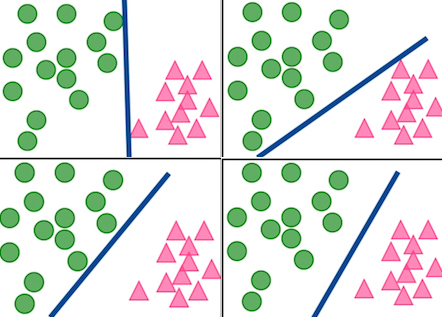
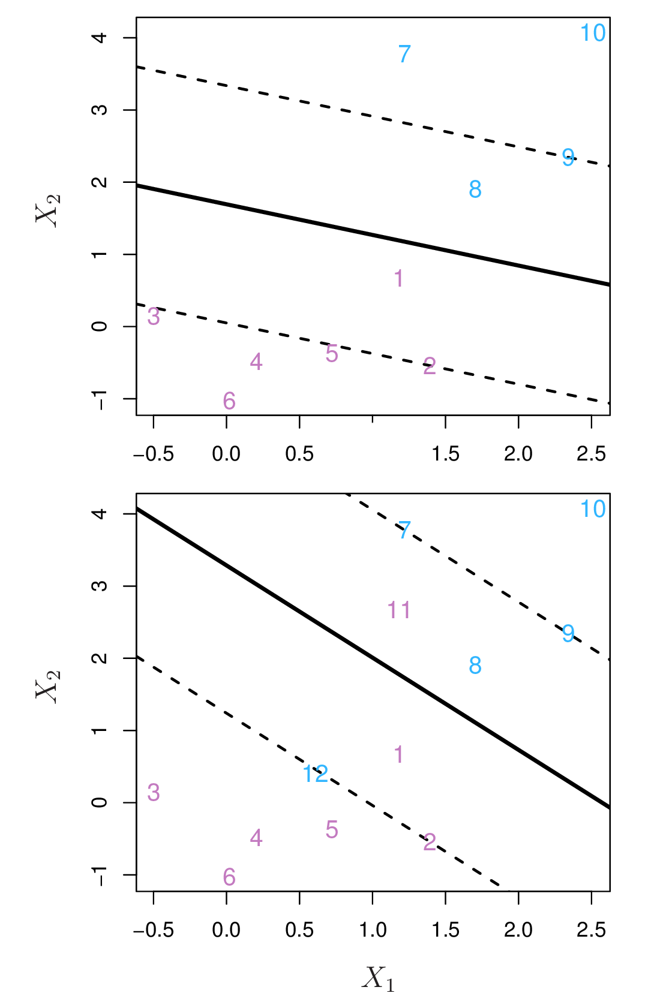
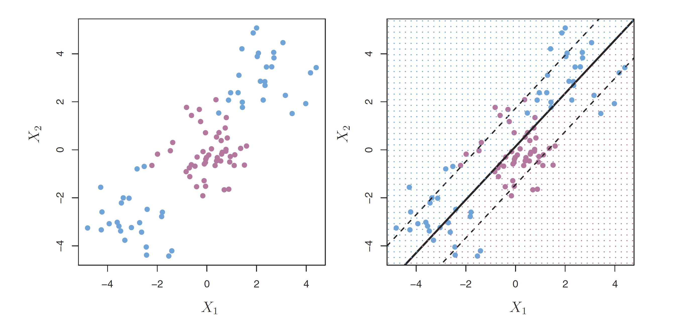

```{r, include = FALSE}
current_file <- knitr::current_input()
basename <- gsub(".Rmd$", "", current_file)

knitr::opts_chunk$set(
  fig.path = sprintf("images/%s/", basename),
  fig.width = 6,
  fig.height = 4,
  out.width = "100%",
  fig.align = "center",
  fig.retina = 4,
  echo = FALSE,
  warning = FALSE,
  message = FALSE,
  error = FALSE,
  cache = FALSE,
  cache.path = "cache/"
)
```

```{r titleslide, child="assets/titleslide.Rmd"}
```

```{r}
library(ISLR)
library(tidyverse)
library(broom)
library(tidymodels) 
library(workflows)
library(purrr)
library(patchwork)
library(MASS)
library(kableExtra)
library(ggpubr)
library(mvtnorm)
library(rpart.plot)
library(randomForest)
library(GGally)
library(discrim)
library(mlbench)
```

---
# Separating hyperplanes


In a $p$-dimensional space, a .monash-orange2[hyperplane] is a linear subspace of dimension $p - 1$.

<center>

</center>


.font_smaller2[(ISLR: Fig 9.1)]
---
# Separating hyperplanes 

The equation of $p$-dimensional hyperplane is given by

$$\beta_0 + \beta_1 X_1 + \dots + \beta_p X_p = 0$$


For the $i^{th}$ observation, 

\begin{align*}
x_i = \left(\begin{array}{cccc}
x_{i1} & x_{i2} & \cdots & x_{ip} 
\end{array} \right)
\end{align*}

and $y_i$ coded as  $\{-1, 1\}$, $i = 1, \dots, n$, then

$$\beta_0 + \beta_1 x_{i1} + \dots + \beta_p x_{ip} > 0 \mbox{ if }  y_i = 1,$$ 
	
$$\beta_0 + \beta_1 x_{i1} + \dots + \beta_p x_{ip} < 0 \mbox{ if } y_i = -1$$


Equivalently,

$$y_i (\beta_0 + \beta_1 x_{i1} + \dots + \beta_p x_{ip}) > 0$$


---
# Separating hyperplanes


- A new observation is assigned a class depending on .monash-orange2[which side] of the hyperplane it is located
- Classify the test observation $x_0$ based on the .monash-orange2[sign] of 
$$s(x_0) = \beta_0 + \beta_1 x_{01} + \dots + \beta_p x_{0p}$$
- If $s(x_0) > 0$, class $1$, and if $s(x_0) < 0$, class $-1$, i.e. $h(x_0) = \mbox{sign}(s(x_0)).$
- $s(x_0) \mbox{ far from zero } \rightarrow$ $x_0$ lies far from the hyperplane + **more confident** about our classification
- $s(x_0) \mbox{ close to zero } \rightarrow$ $x_0$ near the hyperplane + **less confident** about our classification

---

# Separating hyperplane classifiers

.monash-blue2[*Three*] different types of hyperplane classifiers.

- .monash-orange2[Maximal marginal classifier] for when the data is perfectly separated by a hyperplane
- .monash-orange2[Support vector classifier/soft margin classifier] for when data is NOT perfectly separated by a hyperplane but still has a linear decision boundary, and
- .monash-orange2[Support vector machines] used for when the data has nonlinear decision boundaries.

<br><br> All are support vector machines.

---
# Maximal margin classifier


All are separating hyperplanes. .monash-orange2[Which is best?]

<center>

</center>


---
# Maximal margin classifier


<center>

</center>

---

# From LDA to SVM

- Linear discriminant analysis uses the difference between means to set the separating hyperplane.
- Support vector machines uses .monash-orange2[gaps] between points on the outer edge of clusters to set the separating hyperplane.

.flex[
```{r out.width="100%", fig.width=6, fig.height=3, results='hide'}
olive <- read_csv("http://ggobi.org/book/data/olive.csv") %>%
  rename(name=`...1`) %>%
  mutate(region = factor(region, levels=1:3,
          labels=c("south", "sardinia", "north")))
olive_p <- as_tibble(expand.grid(eicosenoic = seq(0, 60, 1), linoleic = seq(440, 1500, 10))) 

lda_mod <- discrim_linear() %>% 
  set_engine("MASS", prior=c(1/3, 1/3, 1/3)) %>% 
  translate()

olive_lda <- 
  lda_mod %>% 
  fit(region ~ eicosenoic+linoleic, 
      data = olive)
olive_p <- olive_p %>%
  mutate(region_lda = 
           predict(olive_lda, olive_p)$.pred_class)

p1 <- ggplot() +
  geom_point(data=olive_p, 
             aes(x=eicosenoic, y=linoleic,
                 color=region_lda), alpha=0.1) +
  geom_point(data=olive, 
             aes(x=eicosenoic, y=linoleic,
                 color=region, shape=region)) +
  scale_color_brewer("", palette="Dark2") +
  theme_bw() + theme(aspect.ratio=1, legend.position="none") +
  ggtitle("LDA")

svm_mod <-
  svm_rbf(cost = 10) %>%
  set_mode("classification") %>%
  set_engine("kernlab", kernel="vanilladot")

olive_svm <- svm_mod %>%
  fit(region~eicosenoic+linoleic, data=olive)

olive_p <- olive_p %>%
  mutate(region_svm = predict(olive_svm,
                          olive_p)$.pred_class)
p2 <- ggplot() + 
  geom_point(data=olive_p, 
             aes(x=eicosenoic, y=linoleic,
                 color=region_svm), alpha=0.1) +
  geom_point(data=olive, 
             aes(x=eicosenoic, y=linoleic,
                 color=region, shape=region)) + 
  scale_color_brewer("", palette="Dark2") +
  theme_bw() + 
  theme(aspect.ratio=1, legend.position="none") +
  ggtitle("SVM")
p1 + p2
```

.w-35[
```
svm_mod <-
  svm_rbf(cost = 10) %>%
  set_mode("classification") %>%
  set_engine("kernlab", 
  kernel="vanilladot")

olive_svm <- svm_mod %>%
  fit(region~eicosenoic+linoleic, 
  data=olive)
```
]
]


---
# SVM 

- If our data can be perfectly separated using a hyperplane, then there will in fact exist an **infinite number of such hyperplanes**.
- We compute the (perpendicular) distance from each training observation to a given separating hyperplane. The .monash-orange2[smallest] such distance is known as the .monash-orange2[margin].
- The .monash-orange2[optimal separating hyperplane] (or maximal margin hyperplane)  is the separating hyperplane for which the margin is .monash-orange2[largest]. 
- We can then classify a test observation based on which side of the maximal margin hyperplane it lies. This is known as the .monash-orange2[maximal margin classifier].


---
# Support vectors


See more detailed explanations [here](https://math.stackexchange.com/questions/1305925/why-is-the-svm-margin-equal-to-frac2-mathbfw).
---
# Support vectors

- The .monash-orange2[support vectors] are equidistant from the maximal margin hyperplane and lie along the dashed lines indicating the width of the margin. 
- They .monash-orange2[support] the maximal margin hyperplane in the sense that if these points were moved slightly then the maximal margin hyperplane would move as well


.center[ **The maximal margin hyperplane depends directly on the support vectors, but .monash-orange2[not on the other observations]**]

---
# Support vectors define the maximal margin classifier


The separating hyperplane is defined as

$$\{x:\beta_0+x^T\beta=0\}$$

where $\beta=\sum_{k=1}^s (\alpha_ky_k)x_k$ and $s$ is the number of support vectors. Then the .monash-orange2[maximal margin hyperplane] is fitted by .monash-blue2[finding] $\beta$ (ie $\alpha$) to 

<br><br>
.monash-blue2[*maximise the margin*] $M = \frac{2}{||\beta||}$, subject to $\sum_{j=1}^p\beta_j^2=1$, and $y_i(x_i^T\beta+\beta_0)\geq M, i=1, ..., n$.


---
# Example: Support vectors

.flex[
.w-39[

```{r echo=TRUE}
indx <- olive_svm$fit@SVindex 
svs <- olive[indx,]
```
]
.w-58[
```{r out.width="120%", fig.height=3, fig.width=6, align="center"}
p1 <- ggplot() +
  geom_point(data=olive_p, 
             aes(x=eicosenoic, y=linoleic,
                 color=region_svm), alpha=0.1) +
  geom_point(data=olive, 
             aes(x=eicosenoic, y=linoleic,
                 color=region, shape=region)) + 
  geom_point(data=svs, 
             aes(x=eicosenoic, y=linoleic),
             color="black", shape=1, size=3) +
  scale_color_brewer("", palette="Dark2") +
  theme_bw() + 
  theme(aspect.ratio=1, legend.position="none") 
p1
```
]
]


---
class: split-60
layout: false

.column[.pad50px[

# Non-separable case

The maximal margin classifier only works when we have perfect separability in our data.

.monash-blue2[What do we do if data is not perfectly separable by a hyperplane?]

 .monash-orange2[**The support vector classifier**] allows points to either lie on the wrong side of the margin, or on the wrong side of the hyperplane altogether. 
 
 <br><br>
 <br><br>
 .font_smaller2[Right: ISLR Fig 9.6]
]]

.column[.content.vmiddle.center[




]]

---
# Support vector classifier - optimisation 

<br>

*Maximise* $M$, subject to $\sum_{j=1}^p\beta_j^2=1$, and $y_i(x_i^T\beta+\beta_0)\geq M(1-\varepsilon_i), i=1, ..., n$, AND $\varepsilon_i\geq 0, \sum_{i=1}^n\varepsilon_i\leq C$.

$\varepsilon_i$ indicates where the $i$th observation is located and $C$ is a nonnegative .monash-orange2[tuning parameter].

- $\varepsilon_i = 0$: correct side of the margin,
- $\varepsilon_i > 0$: wrong side of the margin (violation of the margin),
- $\varepsilon_i > 1$: wrong side of the hyperplane.


---
# Non-separable case

.monash-orange2[Tuning parameter]: decreasing the value of *C*


<center>
<a href="http://www-bcf.usc.edu/~gareth/ISL/Chapter9/9.7.pdf" target="_BLANK">  </a>
</center>

---

# Nonlinear boundaries

The support vector classifier doesn't work well for nonlinear boundaries. .monash-blue2[What solution do we have?]

<center>



</center>
---

# Enlarging the feature space

Consider the following 2D non-linear classification problem. We can transform this to a linear problem separated by a maximal margin hyperplane by introducing an additional third dimension.

<center>

</center>

.font_smaller2[Source: Grace Zhang @zxr.nju]
---

# The inner product

Consider two $p$-vectors 
$$
\begin{align*}
\mathbf{x} & = (x_1, x_2, \dots, x_p) \in \mathbb{R}^p \\
\mbox{and} \quad \mathbf{y} & = (y_1, y_2, \dots, y_p) \in \mathbb{R}^p.
\end{align*}
$$
The inner product is defined as 

$$\langle \mathbf{x}, \mathbf{y}\rangle = x_1y_1 + x_2y_2 + \dots + x_py_p = \sum_{j=1}^{p} x_jy_j$$

.monash-orange2[A linear measure of similarity, and allows geometric constrctions such as the maximal marginal hyperplane.]

---

# Kernel functions

A kernel function is an inner product of vectors mapped to a (higher dimensional) feature space $\mathcal{H} = \mathbb{R}^d, d > p$.

$$
\mathcal{K}(\mathbf{x}, \mathbf{y})  = \langle \psi(\mathbf{x}), \psi(\mathbf{y}) \rangle
$$
$$
\psi: \mathbb{R}^p \rightarrow \mathcal{H}
$$

.monash-orange2[Non-linear measure of similarity, and allows geometric constructions in high dimensional space.]

---

# Examples of kernels

Standard kernels include:
$$
\begin{align*}
\mbox{Linear} \quad  \mathcal{K}(\mathbf{x}, \mathbf{y}) & = \langle\mathbf{x}, \mathbf{y} \rangle \\
\mbox{Polynomial} \quad \mathcal{K}(\mathbf{x}, \mathbf{y}) & = (\langle\mathbf{x}, \mathbf{y} \rangle + 1)^d \\
\mbox{Radial} \quad \mathcal{K}(\mathbf{x}, \mathbf{y}) & = \exp(-\gamma\lvert\lvert\mathbf{x}-\mathbf{y}\lvert\lvert^2)
\end{align*}
$$

---
class: split-60
layout: false

.column[.pad50px[
# Support Vector Machines


.monash-orange2[The kernel trick]

The linear support vector classifier can be represented as follows:

$$f(x) = \beta_0 +  \sum_{i \in \mathcal{S}} \alpha_i \langle x, x_i \rangle.$$

We can generalise this by replacing the inner product with the kernel function as follows:

$$f(x) = \beta_0 +  \sum_{i \in \mathcal{S}} \alpha_i \mathcal{K}( x, x_i ).$$

]]

.column[.content.vmiddle.center[


]]

---
# Your turn

Let $\mathbf{x}$ and $\mathbf{y}$ be vectors in $\mathbb{R}^2$. By expanding $\mathcal{K}(\mathbf{x}, \mathbf{y}) = (1 + \langle \mathbf{x}, \mathbf{y}\rangle) ^2$ show that this is equivalent to an inner product in $\mathcal{H} = \mathbb{R}^6$.

<br>

.monash-blue2[Remember:] $\langle \mathbf{x}, \mathbf{y}\rangle =\sum_{j=1}^{p} x_jy_j$.


---
# Solution

$$
\begin{align*}
\mathcal{K}(\mathbf{x}, \mathbf{y}) & = (1 + \langle \mathbf{x}, \mathbf{y}\rangle) ^2 \\
                                    & = \left(1 + \sum_{j = 1}^2 x_jy_j \right) ^2 \\
                                    & = (1 + x_1y_1 + x_2y_2)^2 \\
                                    & = (1 + x_1^2y_1^2 + x_2^2y_2^2 + 2x_1y_1 + 2x_2y_2 + 2x_1x_2y_1y_2) \\
                                    & = \langle \psi(\mathbf{x}), \psi(\mathbf{y}) \rangle
\end{align*}
$$
<br>
where $\psi(\mathbf{x}) = (1, x_1^2, x_2^2, \sqrt2x_1, \sqrt2x_2, \sqrt2x_1x_2)$.

---
# The kernel trick - why is it a trick?

We do not need to know what the high dimensional enlarged feature space $\mathcal{H}$ really looks like.

We just need to know the which kernel function is most appropriate as a measure of similarity.

<br>

.tip[The Support Vector Machine (SVM) is a maximal margin hyperplane in `\\(\mathcal{H}\\)` built by using a kernel function in the low dimensional feature space `\\(\mathbb{R}^p\\)`.]


---
# Non-linear boundaries
.monash-orange2[Polynomial] and .monash-orange2[radial] kernel SVMs

<a href="http://www-bcf.usc.edu/~gareth/ISL/Chapter9/9.9.pdf" target="_BLANK">  </a>
---
# Non-linear boundaries

Italian olive oils: Regions 2, 3 (North and Sardinia)

```{r out.width="70%", results='hide'}
olive <- read_csv("http://ggobi.org/book/data/olive.csv") %>%
  rename(name=`...1`) %>%
  mutate(region = factor(region, levels=1:3, labels=c("south", "sardinia", "north")))

olive_sub <- olive %>% 
  filter(region != "south") %>%
  mutate(region = factor(region)) %>%
  dplyr::select(region, linoleic, arachidic)

olive_p <- data.frame(expand.grid(linoleic = seq(440, 1500, 10), arachidic = seq(0, 105, 2)))

svm_poly <-
  svm_rbf(cost = 10) %>%
  set_mode("classification") %>%
  set_engine("kernlab", kernel="polydot")

olive_poly <- svm_poly %>%
  fit(region~arachidic+linoleic, data=olive_sub)

olive_p <- olive_p %>%
  mutate(region = 
           predict(olive_poly, olive_p)$.pred_class)

p1 <- ggplot() + 
  geom_point(data=olive_p, 
             aes(x=linoleic, y=arachidic,
                 color=region), alpha=0.1) +
  geom_point(data=olive_sub, 
             aes(x=linoleic, y=arachidic,
                 color=region, shape=region),
             alpha=0.5) +
  scale_color_brewer("", palette="Dark2") + 
  theme_bw() + 
  theme(aspect.ratio=1, legend.position="none") + 
  ggtitle("Polynomial kernel")

svm_rad <-
  svm_rbf(cost = 10) %>%
  set_mode("classification") %>%
  set_engine("kernlab", kernel="rbfdot")

olive_rad <- svm_rad %>%
  fit(region~arachidic+linoleic, data=olive_sub)

olive_p <- olive_p %>%
  mutate(region = 
           predict(olive_rad, olive_p)$.pred_class)

p2 <- ggplot() + 
  geom_point(data=olive_p, 
             aes(x=linoleic, y=arachidic,
                 color=region), alpha=0.1) +
  geom_point(data=olive_sub, 
             aes(x=linoleic, y=arachidic,
                 color=region, shape=region),
             alpha=0.5) +
  scale_color_brewer("", palette="Dark2") + 
  theme_bw() + 
  theme(aspect.ratio=1, legend.position="none") + 
  ggtitle("Radial kernel")
p1 + p2

```

---
class: center 

# Comparing decision boundaries

```{r out.width="100%", fig.width=6, fig.height=3}
# Generate the data
set.seed(1)
spirals <- mlbench.spirals(300,1.5,0.05)
data <- tibble(x1 = spirals$x[,1],
               x2 = spirals$x[,2],
               class = factor(spirals$classes))
  
data_p <- as_tibble(
  expand.grid(
    x1 = seq(-1.5,1.5,0.05), 
    x2 = seq(-1.5,1.5,0.05)))

# Generate RF plot
data_rf <- rand_forest() %>% #<<
  set_engine("randomForest", #<<
             importance=TRUE, proximity=TRUE) %>% #<<
  set_mode("classification") %>% #<<
  fit(class~., data=data)
data_p <- data_p %>%
  mutate(class_rf = predict(data_rf,
                             data_p)$.pred_class)

p1 <- ggplot() +
  geom_point(data = data_p, 
             aes(x = x1, y = x2, 
                 color = class_rf), alpha = 0.1) +
  geom_point(data = data, 
             aes(x = x1, y = x2, 
                 color = class, shape = class), 
             size = 1) +
  geom_contour(data = data_p, 
               aes(x = x1, y = x2, 
                   z = as.numeric(class_rf)),
               breaks=c(1.5), 
               color="black", size=0.8) +
  scale_color_brewer("", palette="Dark2") +
  theme_minimal() + 
  theme(aspect.ratio=1, legend.position="none") +
  ggtitle("Random Forest")

# Generate SVM plot 
svm_rad <-
  svm_rbf(cost = 10) %>%
  set_mode("classification") %>%
  set_engine("kernlab", kernel="rbfdot")

data_svm <- svm_rad %>%
  fit(class ~ x1 + x2, data = data)

data_p <- data_p %>%
  mutate(class_svm = 
           predict(data_svm, data_p)$.pred_class)

p2 <- ggplot() +
  geom_point(data = data_p, 
             aes(x = x1, y = x2, 
                 color = class_svm), alpha = 0.1) +
  geom_point(data = data, 
             aes(x = x1, y = x2, 
                 color = class, shape = class), 
             size = 1) +
  geom_contour(data = data_p,  
               aes(x = x1, y = x2, 
                   z= as.numeric(class_svm)),
               breaks=c(1.5), 
               color="black", size=0.8) +
  scale_color_brewer("", palette="Dark2") +
  theme_minimal() + 
  theme(aspect.ratio=1, legend.position="none") +
  ggtitle("SVM")

lda_mod <- discrim_linear() %>% 
  set_engine("MASS") %>% 
  translate()

data_lda <- 
  lda_mod %>% 
  fit(class ~ x1 + x2, 
      data = data)
data_p <- data_p %>%
  mutate(class_lda = 
           predict(data_lda, data_p)$.pred_class)

p3 <- ggplot() +
  geom_point(data = data_p, 
             aes(x = x1, y = x2, 
                 color = class_lda), alpha = 0.1) +
  geom_point(data = data, 
             aes(x = x1, y = x2, 
                 color = class, shape = class), 
             size = 1) +
  geom_contour(data = data_p,  
               aes(x = x1, y = x2, 
                   z= as.numeric(class_lda)),
               breaks=c(1.5), color="black", 
               size=0.8) +
  scale_color_brewer("", palette="Dark2") +
  theme_minimal() + 
  theme(aspect.ratio=1, legend.position="none") +
  ggtitle("LDA")

p1 + p2 + p3
```

---
# Increasing the value of `cost` in `svm`

```{r out.width="100%", fig.width = 10, fig.height=3}
# Generate Models
svm_rad <-
  svm_rbf(cost = 0.1) %>%
  set_mode("classification") %>%
  set_engine("kernlab", kernel="rbfdot")

data_svm <- svm_rad %>%
  fit(class ~ x1 + x2, data = data)

data_p <- data_p %>%
  mutate(class_svm_1 = 
           predict(data_svm, data_p)$.pred_class)
svm_rad <-
  svm_rbf(cost = 0.5) %>%
  set_mode("classification") %>%
  set_engine("kernlab", kernel="rbfdot")

data_svm <- svm_rad %>%
  fit(class ~ x1 + x2, data = data)

data_p <- data_p %>%
  mutate(class_svm_2 = 
           predict(data_svm, data_p)$.pred_class)

svm_rad <-
  svm_rbf(cost = 0.9) %>%
  set_mode("classification") %>%
  set_engine("kernlab", kernel="rbfdot")

data_svm <- svm_rad %>%
  fit(class ~ x1 + x2, data = data)

data_p <- data_p %>%
  mutate(class_svm_5 = 
           predict(data_svm, data_p)$.pred_class)

svm_rad <-
  svm_rbf(cost = 10) %>%
  set_mode("classification") %>%
  set_engine("kernlab", kernel="rbfdot")

data_svm <- svm_rad %>%
  fit(class ~ x1 + x2, data = data)

data_p <- data_p %>%
  mutate(class_svm_10 = 
           predict(data_svm, data_p)$.pred_class)

# Cost 1
g1 <- ggplot() +
  geom_point(data = data_p, 
             aes(x = x1, y = x2, 
                 color = class_svm_1), alpha = 0.1) +
  geom_point(data = data, 
             aes(x = x1, y = x2, 
                 color = class, shape = class), 
             size = 1) +
  geom_contour(data = data_p,  
               aes(x = x1, y = x2, 
                   z= as.numeric(class_svm_1)),
               breaks=c(1.5), 
               color="black", size=0.8) +
  scale_color_brewer("", palette="Dark2") +
  theme_minimal() + 
  theme(aspect.ratio=1, legend.position="none") +
  ggtitle("Cost = 0.1")

# Cost = 2

g2 <- ggplot() +
  geom_point(data = data_p, 
             aes(x = x1, y = x2, 
                 color = class_svm_2), alpha = 0.1) +
  geom_point(data = data, 
             aes(x = x1, y = x2, 
                 color = class, shape = class), 
             size = 1) +
  geom_contour(data = data_p,  
               aes(x = x1, y = x2, 
                   z= as.numeric(class_svm_2)),
               breaks=c(1.5), 
               color="black", size=0.8) +
  scale_color_brewer("", palette="Dark2") +
  theme_minimal() + 
  theme(aspect.ratio=1, legend.position="none") +
  ggtitle("Cost = 0.9")

# Cost = 5

g3 <- ggplot() +
  geom_point(data = data_p, 
             aes(x = x1, y = x2, 
                 color = class_svm_5), alpha = 0.1) +
  geom_point(data = data, 
             aes(x = x1, y = x2, 
                 color = class, shape = class), 
             size = 1) +
  geom_contour(data = data_p,  
               aes(x = x1, y = x2, 
                   z= as.numeric(class_svm_5)),
               breaks=c(1.5), 
               color="black", size=0.8) +
  scale_color_brewer("", palette="Dark2") +
  theme_minimal() + 
  theme(aspect.ratio=1, legend.position="none") +
  ggtitle("Cost = 0.5")

# Cost = 10

g4 <- ggplot() +
  geom_point(data = data_p, 
             aes(x = x1, y = x2, 
                 color = class_svm_10), alpha = 0.1) +
  geom_point(data = data, 
             aes(x = x1, y = x2, 
                 color = class, shape = class), 
             size = 1) +
  geom_contour(data = data_p,  
               aes(x = x1, y = x2, 
                   z= as.numeric(class_svm_10)),
               breaks=c(1.5), 
               color="black", size=0.8) +
  scale_color_brewer("", palette="Dark2") +
  theme_minimal() + 
  theme(aspect.ratio=1, legend.position="none") +
  ggtitle("Cost = 10 ")

g1 + g2 + g3 + g4 + plot_layout(ncol=4)
```

---
# SVM in high dimensions

Examining misclassifications and which points are selected to be support vectors

<center>

<video width="600" controls> <source src="http://www.ggobi.org/book/chap-class/SVM.mov"> </video>

</center>
```{r eval=FALSE}
# Independent code block, so all is here
library(tidyverse)
library(e1071)
library(tourr)
library(RColorBrewer)
olive <- read_csv("data/olive.csv") %>%
  rename(name=X1) %>%
  mutate(region = factor(region, levels=1:3, labels=c("south", "sardinia", "north")))
olive_sub <- olive %>% filter(region == "sardinia") %>%
  mutate(area=factor(area))

olive_svm <- svm(area~., data=olive_sub[,-c(1,2)], kernel="linear")
pch <- rep(1, nrow(olive_sub))
pch[olive_svm$index] <- 16
pal <- brewer.pal(3, "Dark2")
col <- pal[as.numeric(olive_sub$area)]
quartz()
animate_xy(olive_sub[,4:10], axes="bottomleft", col=col, pch=pch) 
```


---
# SVM in high dimensions

[Examining boundaries](http://www.ggobi.org/book/chap-class/classifly.mov)

<center>
<video width="600" controls> <source src="http://www.ggobi.org/book/chap-class/classifly.mov"> </video>
</center>

---
# SVM in high dimensions

[Boundaries of a radial kernel in 3D](https://vimeo.com/125405961)

<center>
<video width="700" controls> <source src="https://vimeo.com/125405961"> </video>
</center>

---
# SVM in high dimensions

[Boundaries of a polynomial kernel in 5D](https://vimeo.com/125405962)

<center>
<video width="700" controls> <source src="https://vimeo.com/125405962"> </video>
</center>


---

```{r endslide, child="assets/endslide.Rmd"}
```
