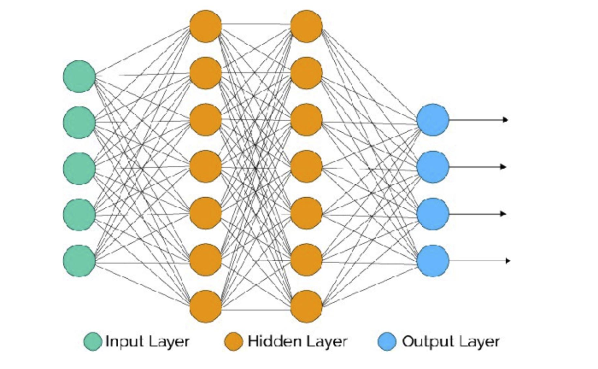
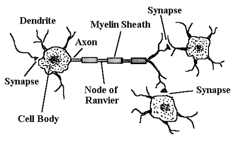
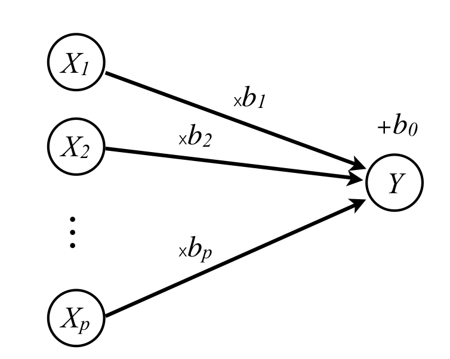
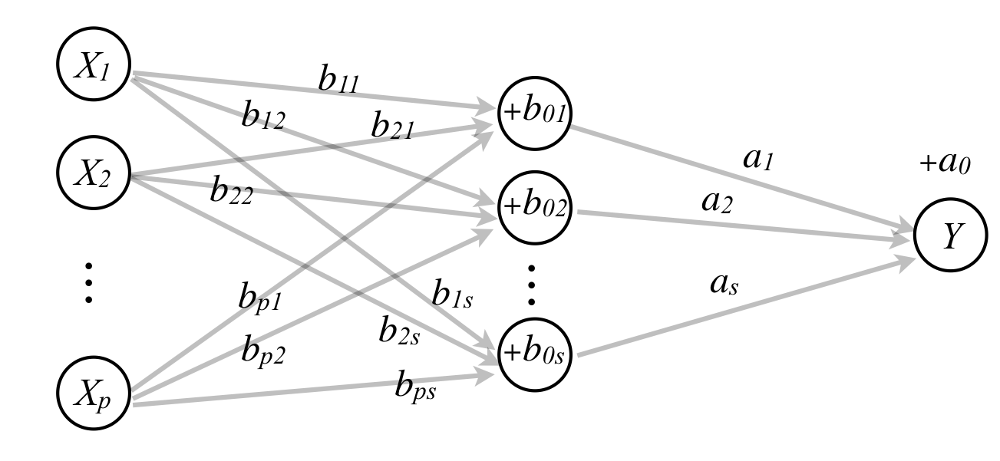
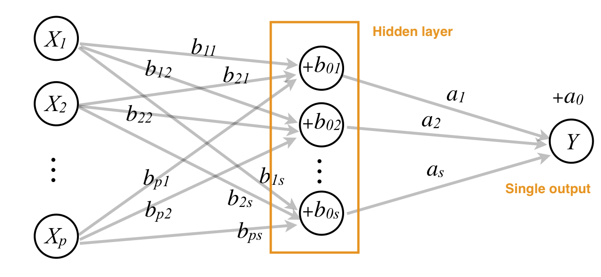
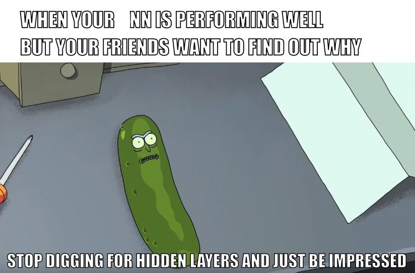
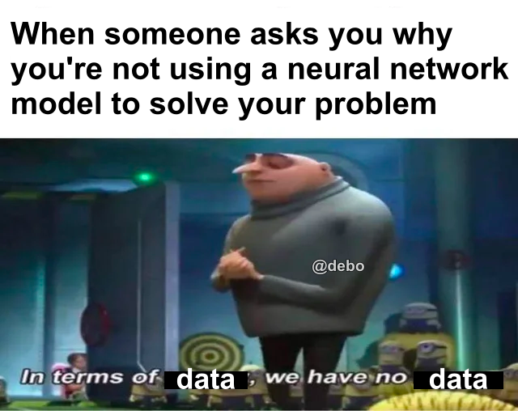

```{r, include = FALSE}
current_file <- knitr::current_input()
basename <- gsub(".Rmd$", "", current_file)

knitr::opts_chunk$set(
  fig.path = sprintf("images/%s/", basename),
  fig.width = 6,
  fig.height = 4,
  out.width = "100%",
  fig.align = "center",
  fig.retina = 4,
  echo = FALSE,
  warning = FALSE,
  message = FALSE,
  error = FALSE,
  cache = FALSE,
  cache.path = "cache/"
)
```

```{r titleslide, child="assets/titleslide.Rmd"}
```

```{r}
library(ISLR)
library(tidyverse)
library(broom)
library(tidymodels) 
library(workflows)
library(purrr)
library(patchwork)
```

---
class: split-two

.column[.pad50px[

# What number is this?

<br>

This is a three, right?

]]

.column[.content.vmiddle.center[


]]


---
class: split-two

.column[.pad50px[

# What number is this?

<br>

Is this also a three?

]]

.column[.content.vmiddle.center[


]]

---

class: split-two

.column[.pad50px[

# What number is this?

<br>

But what about this number? Not a three?

]]

.column[.content.vmiddle.center[


]]
---
# The human brain

The human brain can efficiently recognise that although the images of the two threes are different, they are the same number, and are both distinct from the five.

<center>

</center>
---

class: split-two

.column[.pad50px[

# MNIST data
<br>
The .monash-blue2[MNIST data] was presented to AT&T Bell Lab's to build automatic mail sorting machines.

.monash-orange2[Goal:] Analyse handwritten digits and predict numbers written, given a $28 \times 28$ grid of pixels for each of the  60000 training images. Digits range from 0-9. 

]]


.column[.content.vmiddle.center[


.font_smaller2[Sample images from MNIST test dataset .]
]]

---
class: split-two

.column[.pad50px[

# MNIST data

.monash-blue2[How do we do this?]

Humans are good at detecting different features about the images, such as thickness of line, angles, edges, completeness of circles, etc.

It is evident a complex relationship is presented in the images. .monash-orange2[Neural networks] can help us automatically capture these complexities.

]]

.column[.content.vmiddle.center[


.font_smaller2[Image from [Neural Networks: A Review from a Statistical Perspective](https://projecteuclid.org/euclid.ss/1177010638)]
]]
---

class: split-two

.column[.pad50px[

# So, what are neural networks?

**Idea:** .monash-blue2[Capture a complex relationship between outputs and inputs by creating layers of derived variables.]

$y$ = output variable

$x$ = original input variable

$f(x)$ = derived variable input

]]

.column[.content.vmiddle.center[

$$ y = f_1(f_2(\dots (f_d(x))))$$

<br>


.font_smaller2[Source: [Hands on Machine Learning with R - Deep Learning](https://bradleyboehmke.github.io/HOML/deep-learning.html)]
]]


---

# How do we build a neural network?

<br>

To build a feedforward neural network, we need .monash-orange2[four key components:]

1. Input data (*in this case, the MNIST data*)
2. A pre-defined network architecture;
3. A feedback mechanism (optimisation) to enable the network to learn; and 
4. A model training approach.

<br><br>
Following instructions at [Hands on Machine Learning in R](https://bradleyboehmke.github.io/HOML/deep-learning.html) Chapter 13. 
---

class: transition middle center

# 1. Preparing the data


---

# Data preparation

<br>

There are some data cleaning steps we need to keep in mind before we use neural networks.

- Data needs input to be *numeric*. This means if our data has categorical variables, we will need to represent these as *dummy variables* (revise, Week 2!). This is also called .monash-orange2[one-hot encoding] in ML literature.
- Neural nets are sensitive to scale of the feature values - hence they should be *standardised* first (have mean zero and unit variance).
- If response is categorical (such as "0" through "9" response in MNIST data) - needs to be recoded as binary matrix. 
---

# Data preparation

This arose when AT&T Bell Lab’s was asked to help build automatic mail-sorting machines for the USPS aroound 1990. 
Data available at http://yann.lecun.com/exdb/mnist/ but owner has blocked automatic download with `dslabs::read_mnist()`. 

To get mnist data follow the instructions at https://tensorflow.rstudio.com/guide/tfestimators/examples/mnist/

```{r eval = FALSE}
# The data host is blocking mnist <- dslabs::read_mnist()
# To get mnist data follow the instructions at https://tensorflow.rstudio.com/guide/tfestimators/examples/mnist/
save(mnist, file=here::here("data/MNIST_data/mnist.rda"))
```


---
```{r eval = FALSE, echo = TRUE}
library(tidyverse) 
library(keras)

load(here::here("data/MNIST_data/mnist.rda"))
mnist$train$x <- mnist$train$x / 255
mnist$test$x <- mnist$test$x / 255
mnist_x <- mnist$train$x
mnist_y <- mnist$train$y

# Rename columns and standardize feature values
colnames(mnist_x) <- paste0("V", 1:ncol(mnist_x))
p <- ncol(mnist_x)

# One-hot encode response
# mnist_y <- to_categorical(mnist_y, 10) FAILURE
mnist_y_mat <- matrix(0, length(mnist_y), 10)
for (i in 1:nrow(mnist_y_mat))
  mnist_y_mat[i,mnist_y[i]] <- 1
mnist_y <- mnist_y_mat
```

---

class: transition middle center

# 2. Network Architecture

---
# Network architecture

<br>

When building architecture for the neural network, we are concerned about two key features: 

- The number of layers and nodes, and
- How signal is activated throughout the network.

---

class: split-two

.column[.pad50px[

# Layers and nodes

Our complex relationships are captured using layers and nodes. There are two different types of layers, namely,

- Input and output layers, and
- Hidden layers.
    - No well-defined approach for selecting the number of hidden layers - this is just one of many hyperparameters we will need to tune! 2-5 layers works well most of the time for regular tabular data.
    - The more hidden layers - the longer the model will take to train (as we are adding more parameters!)


.font_smaller2[Source: [Gabriela de Quiroz](https://github.com/gdequeiroz/2018-04-25_intro-to-deep-learning-with-R/blob/master/presentation/basic-concepts.pdf)]

]]

.column[.content.vmiddle.center[





]]


---

# Output layers


Choice of nodes for the output layer is determined by the ML task.

- If you are doing regression - a single node.
- Classification - a node for each class if multiclass.
- If binary, single node for probability of predicting success.

<br>

.tip[**Think!** How many output nodes will MNIST data neural network contain?  `r set.seed(2019); emo::ji("thinking")`]
---

# Building network structure in R

We use the `keras` package to build neural networks in R. This is *very different* to other forms of ML algorithms in R. In `keras`, we first define the network structure as a standalone from our data.

```{r, eval = FALSE, echo = TRUE}
library(keras)
model <- keras_model_sequential() %>%
  layer_dense(units = 16,
              input_shape = p) %>%
  layer_dense(units = 16) %>%
  layer_dense(units = 10) #<<
```


---

# Activation - how do the layers speak?

<br>


Now that we have our structure in place, we need to determine how to pass signal throughout the network. 

<br>
<br>

It uses methods we already know: .monash-orange2[logistic] and .monash-orange2[linear regression.]

---
# But first, some history


"A logical calculus of the ideas immanent in nervous activity" (1943)
Warren S. McCulloch & Walter Pitts

Mathematical model for a neuron.

<center>

</center>

---
# Logistic regression

Remember the logistic function:

\begin{align}
y &=& \frac{e^{\beta_0+\sum_{j=1}^p\beta_jx_j}}{1+e^{\beta_0+\sum_{j=1}^p\beta_jx_j}}\\
  &=& \frac{1}{1+e^{-(\beta_0+\sum_{j=1}^p\beta_jx_j)}}
\end{align}

Alternatively,

$$\log_e\frac{y}{1 - y} = \beta_0+\sum_{j=1}^p\beta_jx_j$$


---
class: split-50
layout: false

.column[.pad50px[

# Logistic regression

<br>

What the .monash-orange2[logistic function] looks like:

\begin{align}
y =\frac{1}{1+e^{-(\beta_0+\sum_{j=1}^p\beta_jx_j)}}
\end{align}

]]

.column[.content.vmiddle.center[


```{r out.width="80%", fig.width=4, fig.height=4}
library(tidyverse)
x <- seq(-2, 2, 0.1)
y <- exp(1+3*x)/(1+exp(1+3*x))
df2 <- tibble(x, y)
ggplot(df2, aes(x=x, y=y)) + 
  geom_line() +
  geom_hline(yintercept=0.5, colour="orange") +
  annotate("text", x=0.84, y=0.55, label="Activation threshold ??", colour="orange") +
  geom_hline(yintercept=c(0,1), linetype=2)
```


]]
---
class: middle

```{r out.width="80%"}
library(memer)
meme_get("ThinkAboutIt")
```

<center>
.font_large[Hang on to this idea....]
</center>
---

class: split-50

.column[.pad50px[

# Linear regression as a network


$$\hat{y} =\beta_0+\sum_{j=1}^p\beta_jx_j$$

Drawing as a network model: 

$p$ .monash-orange2[inputs] (predictors), multiplied by .monash-orange2[weights] (coefficients), summed, add a .monash-orange2[constant], predicts .monash-orange2[output] (response)

]]
.column[.content.vmiddle[




]]


---
# Network explanation - hidden layers

$$\hat{y} =\alpha_{0}+\sum_{k=1}^s(\alpha_{k}(\beta_{j0}+\sum_{j=1}^p\beta_{jk}x_j))$$

A linear regression model nested within a linear regression model allows for intrinsic dimension reduction, or expansion.

<center>

</center>

---
# Two layer perceptron

This is a single output, 2 layer, perceptron (neural network), with a linear threshold.

\begin{align}
\hat{y} =\alpha_{0}+\sum_{k=1}^s(\alpha_{k}(\beta_{j0}+\sum_{j=1}^p\beta_{jk}x_j))
\end{align}


<center>

</center>


---

Back to logistic regression: When the proportion gets to threshold, it .monash-orange2[activates] an event to happen $(Y=1)$.

```{r out.width="50%", fig.width=4, fig.height=4}
library(tidyverse)
x <- seq(-2, 2, 0.1)
y <- exp(1+3*x)/(1+exp(1+3*x))
df2 <- tibble(x, y)
ggplot(df2, aes(x=x, y=y)) + 
  geom_line() +
  geom_hline(yintercept=0.5, colour="orange") +
  annotate("text", x=0.84, y=0.55, label="Activation threshold ??", colour="orange") +
  geom_hline(yintercept=c(0,1), linetype=2)
```

---
# Activation functions

\begin{align}
\hat{y} =\color{orange}g\color{orange}(\alpha_{0}+\sum_{k=1}^s(\alpha_{k}\color{orange}f\color{orange}(\beta_{0k}+\sum_{j=1}^p\beta_{jk}x_j)\color{orange})\color{orange})
\end{align}

Let $u=\beta_0+\sum_{j=1}^p\beta_jx_j$
- $\texttt{Logistic:} \quad \color{orange}{\frac{1}{1+e^{-u}}}$
- $\texttt{Gaussian radial:} \quad \color{orange}{\frac{1}{\sqrt{2\pi}}e^{-u^2/2}}$
- $\texttt{Hyperbolic tangent:} \quad \color{orange}{\frac{e^u-e^{-u}}{e^u+e^{-u}}}$

---
# Example

Consider the wiggly data

```{r out.width="50%", fig.width=4, fig.height=4}
library(tidyverse)
library(nnet)

w <- read_csv(here::here("data/wiggly.csv"))
ggplot(w, aes(x=x, y=y, colour=class, shape=class)) + 
  geom_point() +
  scale_color_brewer("", palette="Dark2") +
  scale_shape("") +
  theme(aspect.ratio=1) 
```

---

# Overall fit 

This is the best fit from many, many random starts, with different parameters. It's a beautiful fit. 

```{r out.width="50%", fig.width=4, fig.height=4}
load(here::here("data/nnet_many.rda"))
load(here::here("data/nnet_best.rda"))

ggplot(subset(best$output,  node == 1), aes(x, y)) +
  geom_raster(aes(fill = pred)) +
  geom_point(aes(shape = class), data = w) +
  scale_fill_gradient2(low="#1B9E77", high="#D95F02", mid = "white", midpoint = 0.5) +
  theme_bw() +
  theme(aspect.ratio=1) 
```

---
# Individual layers

The best fit used four nodes in the hidden layer, each fitting a logistic regression. Node 2 does the most work, catching the main linear divide, and node 1 catches the first wiggle, node 4 the second wiggle and node 3 the third wiggle. 

```{r out.width="90%", fig.width=8, fig.height=4}
ggplot(best$hidden, aes(x, y)) +
  geom_raster(aes(fill = pred)) +
  geom_point(aes(shape = class), data = w) +
  scale_fill_gradient2(low="#1B9E77", high="#D95F02", mid = "white", midpoint = 0.5) +
  facet_grid(. ~ node) +
  theme(aspect.ratio=1) 
```


---

# Adding in activation

Activations determine whether the node has enough information to send a signal to the next layer. For example, the `relu` activation function is takes summed weighted inputs and transforming them to 0 (not fire) or >
0 (fire). 

To add in activation information to our model in `keras`, we simply adjust our model structure previously by adding in the activation functions we would like to use for each layer.

```{r, echo = TRUE, eval = FALSE}
model <- keras_model_sequential() %>%
  layer_dense(units = 16, 
              activation = "relu", #<<
              input_shape = p) %>%
  layer_dense(units = 16, activation = "relu") %>%
  layer_dense(units = 10, activation = "softmax")
```

---
class: transition middle center

# 3. Feedback Mechanism


```{r eval = FALSE}
library(keras)
# Import MNIST training data
mnist <- dslabs::read_mnist()
mnist_x <- mnist$train$images
mnist_y <- mnist$train$labels

# Rename columns and standardize feature values
colnames(mnist_x) <- paste0("V", 1:ncol(mnist_x))
mnist_x <- mnist_x / 255
p <- ncol(mnist_x)

# One-hot encode response
mnist_y <- to_categorical(mnist_y, 10)

model <- keras_model_sequential() %>%
  layer_dense(units = 16, 
              activation = "relu", 
              input_shape = p) %>%
  layer_dense(units = 16, activation = "relu") %>%
  layer_dense(units = 10, activation = "softmax")
```

---

# Compiling the model

Now that we have a model architecture in place - how will the model *learn* from the data? To do this, we need to specify a .monash-orange2[**loss function**] and .monash-orange2[**optimiser**] to use during training.

- The *loss function* (also called objective function) helps measure performance. For example, in regression use the MSE, and for classification you may use cross entropy.
- The *optimiser* controls which optimisation algorithm is implemented in our NN. 


```{r, echo = TRUE, eval = FALSE}
model %>%   compile(
    loss = 'categorical_crossentropy', #<<
    optimizer = "rmsprop",
    metrics = c('accuracy')
  )
```

---

class: transition middle center

# 4. Model Training

---

# Model training

Now that we have created the model specification, we are ready to give it some data! We can use the `fit` function in `keras` to achieve this.

```{r, eval = FALSE, echo = TRUE}
fit <- model %>% fit(
  x = mnist_x,
  y = mnist_y,
  batch_size = 512,
  epochs = 10,
  validation_split = 0.2
)
```

- `batch_size` refers to the number of samples used to estimate the error gradient for the optimisation at any time, manages computational load, and model stability. 
- `epoch` refers to how many iterations through the entire training data, it is typically large.
- `validation_split` sets a hold-out proportion to avoid over-fitting.

---

class: split-50

.column[.pad50px[

# Model training

We can plot the accuracy and loss of the neural network using the `plot` function.

```{r, eval = FALSE, echo = TRUE}
plot(fit)
```


]]
.column[.content.vmiddle[


]]


---

class: transition middle center

# So why don't we use neural networks for all machine learning problems?


---

class: split-two

.column[.pad50px[

# Minimal interpretability

<br>

- Core concept of .monash-orange2[prediction] vs .monash-orange2[inference].
- Neural networks are seen as a black box type of model, with limited information provided to as how the neural net is making decisions. (*Contrast this to trees, or logistic regression, say*)

]]

.column[.content.vmiddle.center[




.font_smaller2[Source: Machine Learning Memes for Convolutional Teens]


]]


---
class: split-two

.column[.pad50px[

# Data intensive

<br>

- Deep learning algorithms don't work well when the number of features is larger than the number of observations (highly over-parameterised).
- If we only have a limited number of training data points, the model can potentially .monash-orange2[overfit] and fit very closely to the training data whilst lacking predictive performance for new data.

]]

.column[.content.vmiddle.center[




.font_smaller2[Source: Machine Learning Memes for Convolutional Teens]
]]
---
class: split-two

.column[.pad50px[

# Computationally intensive

<br>

- Many calculations are required to estimate all of the parameters in many neural networks (the one we have shown today is quite basic ).
- Deep learning involves huge amounts of matrix multiplications and other operations.
- Often used in conjuction with GPUs to paralellise computations.

]]

.column[.content.vmiddle.center[


.font_smaller2[Source: Machine Learning Memes for Convolutional Teens]

]]
---

```{r endslide, child="assets/endslide.Rmd"}
```
