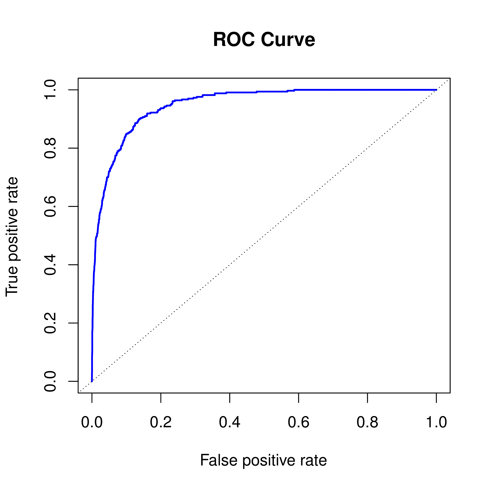
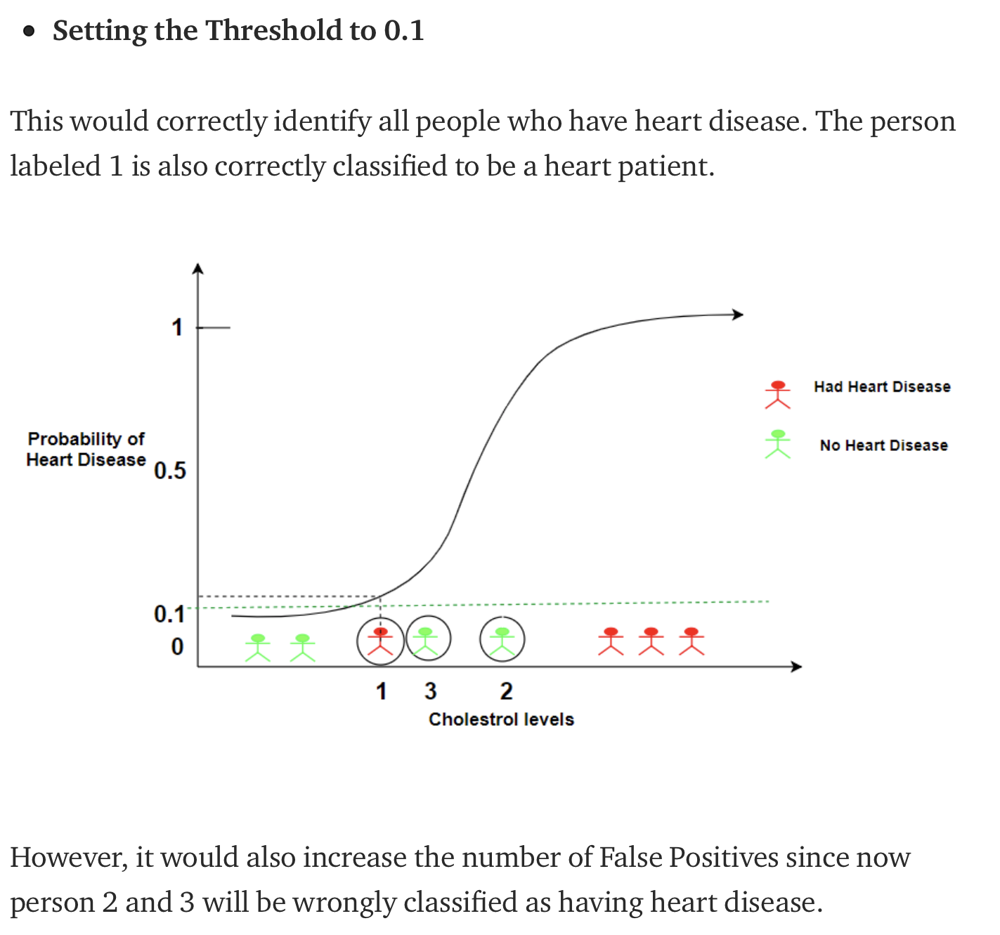
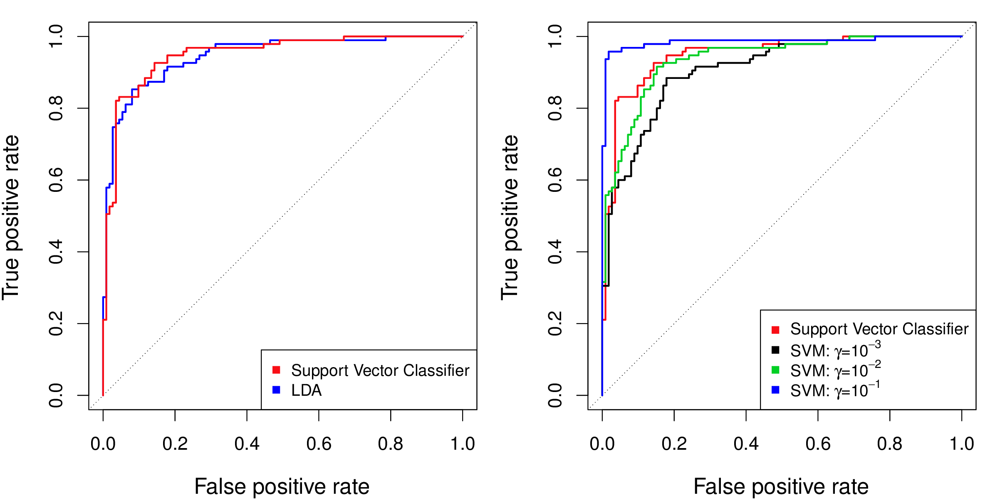
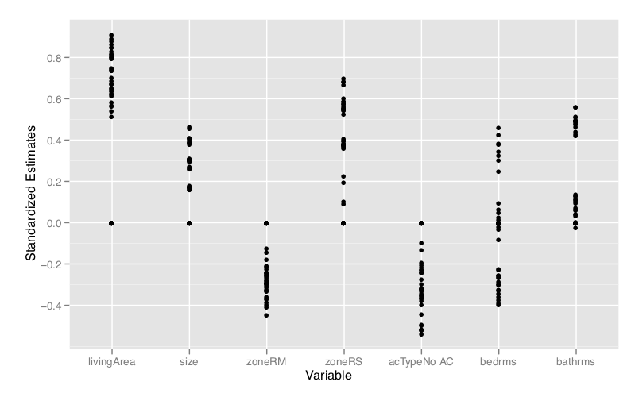
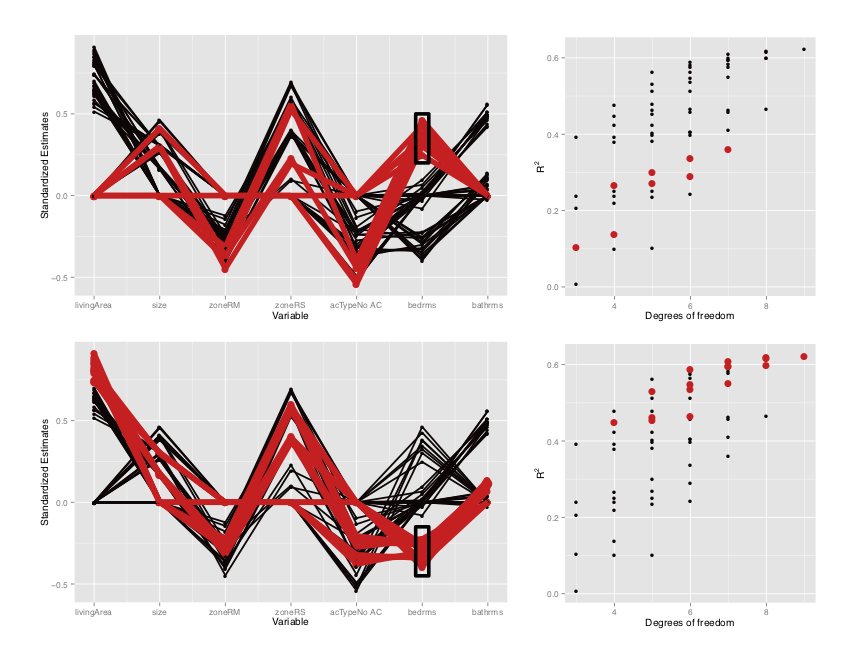

```{r, include = FALSE}
current_file <- knitr::current_input()
basename <- gsub(".Rmd$", "", current_file)

knitr::opts_chunk$set(
  fig.path = sprintf("images/%s/", basename),
  fig.width = 6,
  fig.height = 4,
  out.width = "100%",
  fig.align = "center",
  fig.retina = 3,
  echo = FALSE,
  warning = FALSE,
  message = FALSE,
  cache = FALSE,
  cache.path = "cache/"
)
```

```{r titleslide, child="assets/titleslide.Rmd"}
```

---
class: middle center

```{r echo=TRUE}
library(statquotes)
search_quotes(search="Holdane", fuzzy=TRUE)
```

---

class: middle center

```{r echo=TRUE}
statquote(source="Box")
```


---
layout: true
class: shuriken-full white 

.blade1.bg-green[.content[
.white.font_large[Know your data] `r set.seed(1);emo::ji("airplane")`<br>Quantitative or qualitative response?  Predictors all quantitative? Do you have independent observations? 
]]
.blade2.bg-purple[.content[
.white.font_large[Plot your data] `r set.seed(1);emo::ji("painting")`<br>Is there a relationship between response and predictors?  Is the relationship linear? Are boundaries linear? Is variability heterogeneous? Are groups distinct? Are there unusual observations? 
]]
.blade3.bg-deep-orange[.content[
.white.font_large[Check for missing values] `r set.seed(1);emo::ji("tool")`<br>Do some variables have too many missings to use them? Do some observations have too many missings to use them? What would be a useful imputation method to fix the sporadic missing value? 
]]
.blade4.bg-pink[.content[
.white.font_large[Fit a versatile model] `r set.seed(1);emo::ji("computer")` <br>Compute and plot model diagnostics. Where doesn't the model do well? How can it be refined? 
]]

---

class: hide-blade2 hide-blade3 hide-blade4 hide-hole

---

class: hide-blade3 hide-blade4 hide-hole
count: false

---

class: hide-blade4 hide-hole
count: false

---

class: hide-hole
count: false

---

count: false 

---
layout: false
class: transition middle

# Data quality

---

class: split-30

# Multivariate outliers

.monash-orange2[Mahalanobis distance] measures the distance from the mean, relative to the variance-covariance matrix, and is useful for .monash-orange2[outlier detection]: $D^2 = (X-\mu)'\Sigma^{-1}(X-\mu)$

```{r fig.height=3, out.width="70%", results='hide'}
library(tidyverse)
library(ISLR)
library(broom)
library(mvtnorm)
library(gridExtra)
set.seed(20190505)
x <- rmvnorm(500, mean=rep(0,2), sigma = matrix(c(1,-0.8, -0.8, 1), ncol=2, byrow=TRUE))
df <- as_tibble(x) %>% bind_rows(tibble(V1=2, V2=2))
p1 <- ggplot(df, aes(x=V1, y=V2)) + geom_point() +
  annotate("text", 2.3, 2.2, label="outlier", colour="orange") +
  annotate("point", 2, 2, colour="orange") +
  coord_equal()
df <- df %>% mutate(mah=mahalanobis(df[,1:2], center=c(0,0),
                                    cov=cov(df[,1:2])))
p2 <- ggplot(df, aes(x=mah)) + geom_histogram() + 
  xlab("Mahalanobis distance") +
  annotate("text", 33, 10, label="outlier", colour="orange") 
grid.arrange(p1, p2, ncol=2)
```

Related to "leverage" in regression diagnostics.


---

# Influential observations


.monash-orange2[Cook's distance] measures the change in the model estimates due to the observation: $D_i = \frac{e_i^2}{MSE\times p}\frac{h_i}{(1-h_i)^2}$ where $h_i$ is the leverage of observation $i$. 

```{r fig.height=3, out.width="80%", results='hide'}
set.seed(20190505)
x <- rmvnorm(500, mean=rep(0,2), sigma = matrix(c(1,-0.8, -0.8, 1), ncol=2, byrow=TRUE))
df <- as_tibble(x) %>% bind_rows(tibble(V1=5, V2=2))
p1 <- ggplot(df, aes(x=V1, y=V2)) + geom_point() +
  annotate("text", 4.5, 2.2, label="influential", colour="orange") +
  annotate("point", 5, 2, colour="orange") 
fit <- lm(V2~V1, data=df)
df <- augment(fit, df)
p2 <- ggplot(df, aes(x=.cooksd)) + geom_histogram() + 
  xlab("Cooks distance") +
  annotate("text", 1.7, 15, label="influential", colour="orange") 
grid.arrange(p1, p2, ncol=2)
```

.font_smaller2[Developed by Dennis Cook, University of Minnesota. ]

---


layout: false
class: transition middle

# Model choice and comparison


---

# Comparing statistical models using ANOVA

- Models are nested when one model is a particular case of the other model
   - Model 1: $\hat{y} = \beta_0 + \beta_1X_1$
   - Model 2: $\hat{y} = \beta_0 + \beta_1X_1 + \beta_2X_2$
   - Model 3: $\hat{y} = \beta_0 + \beta_1X_1 + \beta_2X_2 + \beta_3X_1X_2$
- Nested models can be compared using ANOVA F test

$$F = \frac{(SSE_{reduced}-SSE_{full})/(p-k)}{SSE_{full}/(n-p-1)} \tilde \cal{F}_{p-k,n-p-1}$$
<br><br>
.font_smaller2[Material adapted from [YaRrr! The Pirate’s Guide to R by Nathaniel D. Phillips](https://bookdown.org/ndphillips/YaRrr/comparing-regression-models-with-anova.html) and [Professor Cécile Ané Stat 572 slides](http://pages.stat.wisc.edu/~ane/st572/notes/lec05.pdf).]

---
# Example

```{r}
library(tidymodels)
load(here::here("data/student_tr.rda"))
student_tr <- student_tr %>%
  mutate(year0 = as.numeric(year)) %>%
  mutate(television = as.numeric(television))

lm_mod <- 
  linear_reg() %>% 
  set_engine("lm")

lm_fit1 <- 
  lm_mod %>% 
  fit(read ~ 1, 
      data = student_tr)

lm_fit2 <- 
  lm_mod %>% 
  fit(read ~ country + year0 + television + math, 
      data = student_tr)

lm_fit3 <- 
  lm_mod %>% 
  fit(read ~ country*year0 + country*television + country*math, 
      data = student_tr)

lm_fit4 <- 
  lm_mod %>% 
  fit(read ~ country*year0*television + country*math, 
      data = student_tr)

lm_fit5 <- 
  lm_mod %>% 
  fit(read ~ country*year0*television*math, 
      data = student_tr)

anova(lm_fit1$fit, lm_fit2$fit, lm_fit3$fit, lm_fit4$fit, lm_fit5$fit)
```
---
# Remember the confusion table

<center>
<table>
<tr>  <td> </td><td> </td> <td colspan="2" align="center" > true </td> </tr>
<tr>  <td> </td><td> </td> <td align="center" bgcolor="#daf2e9" width="80px"> C1 (positive) </td> <td align="center" bgcolor="#daf2e9" width="80px"> C2 (negative) </td> </tr>
<tr height="50px">  <td> pred- </td><td bgcolor="#daf2e9"> C1 </td> <td align="center" bgcolor="#D3D3D3"> <em>a</em> </td> <td align="center" bgcolor="#D3D3D3"> <em>b</em> </td> </tr>
<tr height="50px">  <td>icted </td><td bgcolor="#daf2e9"> C2</td> <td align="center" bgcolor="#D3D3D3"> <em>c</em> </td> <td align="center" bgcolor="#D3D3D3"> <em>d</em> </td> </tr>
</table>
</center>

- Sensitivity: *a/(a+c)*  (true positive, recall)
- Specificity: *d/(b+d)* (true negative)
- False positive: *c/(a+c)* 
- False negative: *b/(b+d)* (1-specificity)

<center>
.info-box[From a quantitative prediction, a cutoff needs to be used to create a categorical prediction.]
</center>

---
class: split-50

.column[
```{r echo=TRUE}
library(tidyverse)
library(yardstick)
options(digits=2)
glimpse(two_class_example) #<<
```

Set threshold to 0.5

```{r}
two_class_example %>%
  mutate(my_predicted = ifelse(Class1 > 0.5, "Class1", "Class2")) %>%
  mutate(my_predicted = factor(my_predicted)) %>%
  conf_mat(my_predicted, truth)  
```

sensitivity = 0.82, 1-specificity = 0.14
]

.column[
```{r}
roc_curve(two_class_example, truth, Class1) %>%
  ggplot(aes(x = 1 - specificity, y = sensitivity)) +
  geom_path() +
  geom_abline(lty = 3) +
  coord_equal() +
  scale_x_continuous("1 - specificity", breaks = seq(0,1,0.2)) +
  scale_y_continuous("sensitivity", breaks = seq(0,1,0.2)) +
  theme_bw()
```

Your turn: Set the threshold to be 0.75, re-compute the confusion matrix, and sensitivity, specificity.
]

---

class: split-50
layout: false

.column[.pad10px[
# ROC

<a href="http://www-bcf.usc.edu/~gareth/ISL/Chapter4/4.8.pdf" target="_BLANK">  </a>

.font-smaller2[Credit example in textbook figure 4.8]
]]
.column[.top50px[

<br><br><br>
The .monash-orange2[true positive rate] is the .monash-orange2[sensitivity]: the fraction of defaulters that are correctly identified, using a given threshold value. 

The .monash-blue2[false positive rate] is .monash-blue2[1-specificity]: the fraction of non-defaulters that we classify incorrectly as defaulters, using that same threshold value.

**The dotted line is "no information" classifier; class and predictor are not associated.**

The .monash-orange2[ideal ROC curve hugs the top left corner], indicating a high true positive rate and a low false positive rate.

]]


---
class: split-50
layout: false

.column[.pad10px[

<a href="http://www-bcf.usc.edu/~gareth/ISL/Chapter4/4.8.pdf" target="_BLANK">  </a>

]]
.column[.pad10px[

<br>

<br>

If the classifier returns a prediction between 0 and 1, interpret as the probability of a positive, then threshold (split the data) at different values, e.g. 0.1, 0.2, 0.3, 0.4, 0.5, ... 

Compute the confusion table for each split, record the sensitivity and specificity and plot the resulting numbers. 

]]

---

Really nice explanation by Parul Pandey [here](https://towardsdatascience.com/understanding-the-roc-and-auc-curves-a05b68550b69) and video by Josh Starmer [here](https://www.youtube.com/watch?v=xugjARegisk). 

<center>

</center>

---

# ROC for classification

<center>
<a href="http://www-bcf.usc.edu/~gareth/ISL/Chapter9/9.10.pdf" target="_BLANK">  </a>
</center>

- LDA and SVM similar (example on left).       
- SVM radial basis with $\gamma=10^{-1}$ is the best (example on the right).

.font_smaller2[Fig 9.10]


---
class: transition middle

# Quantifying uncertainty

---

# Utilising bagging

Remember the vote matrix available from random forests:

$$V = (V_1  V_2 ... V_K) \\
  = \left[ \begin{eqnarray*}
                          p_{11} & p_{12} & ... & p_{1K}\\
                          p_{21} & p_{22} & ... & p_{2K}\\
                          ...   &  ...    &     & ...\\
                          p_{n1} & p_{n2} & ... & p_{nK}
                          \end{eqnarray*} \right]$$

With bagging, multiple out of bag predictions produces uncertainty measure for each observation. It's possible that observations with .monash-orange2[higher uncertainty are outliers].

---

# Variable importance

<br>

- Working with .monash-orange2[standardised variables] helps, because magnitude of coefficients is then directly interpreted as importance
- .monash-orange2[Permutation] approach in random forests is useful more broadly. Compare magnitude of coefficients between models built on original and permuted variable.
- .monash-orange2[Effect of one predictor with the response] can depend on their relationship with one another. Called multicollinearity in regression. 

---
class: transition middle

# Beyond the optimal

---
layout: false
# Bigger picture

.monash-orange2[All possible model fits] to housing data with 7 variables, from [Wickham et al (2015) Removing the Blindfold](http://onlinelibrary.wiley.com/doi/10.1002/sam.11271/abstract)


---
class: split-70
layout: false

.column[.pad10px[

]]
.column[.pad10px[
.font_small[Three typical estimates for bedrooms: big positive, close to 0, big negative.] 

.font_small[Models with big .monash-orange2[positive coefficients] for bedrooms tend to have .monash-orange2[weaker fits]. They tend to occur with models that have no livingArea contribution, and more negative coefficients for zoneRM, and no air con.]

.font_small[Models with big .monash-orange2[negative coefficients] on bedrooms tend to have .monash-orange2[stronger fits]. All contrast with livingArea (high positive coefficients).]

.font_small[If bedrooms contribute to the model, bathrooms do not.]

]]

---

# Model choice - robustness of conclusions

Whatever way you model the data, the .monash-orange2[interpretations should be consistent]. 

- Bias can explain difference in predictions between models, flexible vs inflexible can provide a spectrum on what the data predicts.
- Broad changes in a model when some cases or some variables are not used, should evoke suspicions (your "spidey sense"). 
- Model fit statistics are a measure of predictive power. A weak model can still be useful if there is a large cost involved.  


---

```{r endslide, child="assets/endslide.Rmd"}
```
