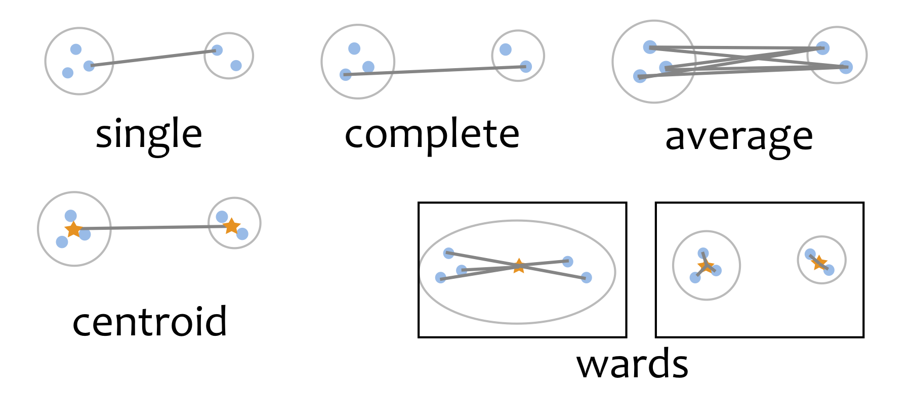

```{r, include = FALSE}
current_file <- knitr::current_input()
basename <- gsub(".Rmd$", "", current_file)

knitr::opts_chunk$set(
  fig.path = sprintf("images/%s/", basename),
  fig.width = 6,
  fig.height = 4,
  out.width = "100%",
  fig.align = "center",
  fig.retina = 3,
  echo = FALSE,
  warning = FALSE,
  message = FALSE,
  cache = FALSE,
  cache.path = "cache/"
)
```

```{r titleslide, child="assets/titleslide.Rmd"}
```

---
## Hierarchical clustering

<br>

- .monash-orange2[Agglomeration]: Begin with all observations in singleton clusters. Sequentially .monash-orange2[join] points into clusters, until all are in one cluster. 
- .monash-orange2[Divisive]: Begin with all observtions in one cluster, adn sequentially .monash-orange2[divide] until all observations are in singleton clusters. 
- Produces a tree diagram illustrating the process, called a .monash-orange2[dendrogram].


---
class: split-50
layout: false


.column[.pad10px[.content[

Some new data `r emo::ji("cartwheel")`

```{r}
library(tidyverse)
library(tourr)
library(gridExtra)
library(emo)
library(knitr)
library(kableExtra)

set.seed(9) #6
df <- tibble(lbl=letters[1:12], 
             x1=sample(1:10, 12, replace=TRUE),
             x2=sample(1:10, 12, replace=TRUE))
df[1:4,2] <- df[1:4,2] + 12
df[5:8,3] <- df[5:8,3] + 12
kable(df) %>%
  kable_styling("striped", position = "center", 
                row_label_position = "c", 
                font_size=24) %>%
  row_spec(0, color = "white", background = "#3F9F7A") %>%
  column_spec(1:3, border_right=TRUE, width="2cm") 
```
]]]
.column[.pad50px[.content[

```{r out.width="100%", fig.width=4, fig.height=4}
ggplot(data=df, aes(x1, x2)) + geom_text(aes(label=lbl)) + 
  xlab("") + ylab("") + theme_bw() + 
  theme(aspect.ratio=1) 
```
]]]

---
class: split-50
layout: false


.column[.pad10px[.content[

$n\times n$ distance matrix `r set.seed(1) ;emo::ji("ruler")`

```{r}
d <- as.matrix(round(dist(df[,2:3], diag=TRUE, upper=TRUE),1))
colnames(d) <- df$lbl
rownames(d) <- df$lbl
kable(d) %>%
  kable_styling("striped", position = "center", 
                row_label_position = "c", 
                font_size=24) %>%
  row_spec(0, color = "white", background = "#3F9F7A") %>%
  column_spec(1, color = "white", background = "#3F9F7A") %>%
  column_spec(1:12, border_right=TRUE, width="1cm") 
```
]]]
.column[.pad50px[.content[

```{r out.width="60%", fig.width=4, fig.height=4}
ggplot(data=df, aes(x1, x2)) + geom_text(aes(label=lbl)) + 
  xlab("") + ylab("") + theme_bw() + 
  theme(aspect.ratio=1) 
```
]]]
---
class: split-50
layout: false

.column[.pad50px[.content[

```{r out.width="100%", fig.width=4, fig.height=4}
ggplot(data=df, aes(x1, x2)) + geom_text(aes(label=lbl)) + 
  xlab("") + ylab("") + theme_bw() + 
  theme(aspect.ratio=1) 
```
]]]
.column[.pad50px[.content[
```{r out.width="100%", fig.width=4, fig.height=4}
library(ggdendro)
df_hc <- hclust(as.dist(d), method="average")
ggdendrogram(df_hc, rotate = TRUE, size = 4)
```

]]]
---
class: split-50
layout: false


.column[.pad50px[.content[

```{r out.width="100%", fig.width=4, fig.height=4}
df$cl11 <- factor(c(1,1,1,1,1,2,1,2,1,1,1,1))
ggplot(data=df, aes(x=x1, y=x2, colour=cl11)) +
  geom_text(aes(label=lbl)) + 
  scale_color_brewer("", palette="Dark2") +
  xlab("") + ylab("") + theme_bw() + 
  theme(aspect.ratio=1, legend.position="none") 
```
]]]
.column[.pad50px[.content[
```{r out.width="100%", fig.width=4, fig.height=4}
ggdendrogram(df_hc, rotate = TRUE, size = 4)
```
]]]

---
class: middle center

# `r set.seed(2019); emo::ji("thinking")`

What is the .monash-orange2[distance] between the new .monash-orange2[cluster (f,h)] and all of the other observations?

---

## Linkage

Between points .monash-orange2[in] the cluster to points .monash-orange2[not in] the cluster. 

- .monash-orange2[Single]: minimum distance between points in the different clusters
- .monash-orange2[Complete]: maximum distance between points in the different clusters
- .monash-orange2[Average]: average of distances between points in the different clusters
- .monash-orange2[Centroid]: distances between the average of the different clusters
- .monash-orange2[Wards]: minimizes the total within-cluster variance

---

class: middle center



---
class: split-70
layout: false


.column[.pad50px[.content[

```{r}
kable(d) %>%
  kable_styling("striped", position = "center", 
                row_label_position = "c", 
                font_size=24) %>%
  row_spec(0, color = "white", background = "#3F9F7A") %>%
  column_spec(1, color = "white", background = "#3F9F7A") %>%
  column_spec(1:12, border_right=TRUE, width="1cm") %>%
  column_spec(c(7,9), color="#7570B3") %>%
  row_spec(c(6,8), color="#7570B3")

```
]]]
.column[.pad50px[.content[

.monash-orange2[Distance (linkage) between (f,h) and a]

Single: 13.0 or 13.4 $\rightarrow$ .monash-orange2[13.0] <br>
Complete: 13.0 or 13.4 $\rightarrow$ .monash-orange2[13.4] <br>
Average: (13.0 + 13.4)/2 = .monash-orange2[13.2] <br>
Centroid: .monash-orange2[13.2] <br>
mean of (f,h) is (5, 14.5) <br>
          mean of a (17,9) <br>
          $\sqrt{(5-17)^2 + (14.5-9)^2}$ <br>
Wards: Your turn to calculate it `r set.seed(1) ;emo::ji("shrug")`

```{r eval=FALSE}
# For computing centroid
# df %>% filter(lbl %in% c("d", "e", "f", "g", "h", "i", "j", "k", "l")) %>% 
df %>% filter(lbl %in% c("f", "h")) %>% 
  select(x1, x2) %>% 
  summarise_all(mean)
```
]]]

---
class: split-60
layout: false


.column[.pad50px[.content[

```{r}
kable(df) %>%
  kable_styling("striped", position = "center", 
                row_label_position = "c", 
                font_size=24) %>%
  row_spec(0, color = "white", background = "#3F9F7A") %>%
  column_spec(1:3, border_right=TRUE, width="2cm") 
```
]]]
.column[.pad50px[.content[

.monash-orange2[Distance (linkage) between (f,h) and a]

Single: 13.0 or 13.4 $\rightarrow$ .monash-orange2[13.0] <br>
Complete: 13.0 or 13.4 $\rightarrow$ .monash-orange2[13.4] <br>
Average: (13.0 + 13.4)/2 = .monash-orange2[13.2] <br>
Centroid: .monash-orange2[13.2] <br>
mean of (f,h) is (5, 14.5) <br>
          mean of a (17,9) <br>
          $\sqrt{(5-17)^2 + (14.5-9)^2}$ <br>
Wards: Your turn to calculate it `r set.seed(1) ;emo::ji("shrug")`

]]]


---
class: split-60
layout: false


.column[.pad10px[.content[

.monash-orange2[Single] (minimum distance) linkage reduced distance matrix

```{r}
d2 <- d[-8,-8]
for (i in c(1:5,7:11)) {
  j <- i
  if (i > 7) j <- i+1
  d2[i,6] <- d2[6,i] <- min(d[j,6], d[j,8])
}
colnames(d2)[6] <- "(f,h)"
rownames(d2)[6] <- "(f,h)"
kable(d2) %>%
  kable_styling("striped", position = "center", 
                row_label_position = "c", 
                font_size=24) %>%
  row_spec(0, color = "white", background = "#3F9F7A") %>%
  column_spec(1, color = "white", background = "#3F9F7A") %>%
  column_spec(1:10, border_right=TRUE, width="1cm") %>%
  column_spec(7, color="#7570B3") %>%
  row_spec(6, color="#7570B3")
```
]]]
.column[.pad50px[.content[

```{r out.width="80%", fig.width=4, fig.height=4}
df$cl11 <- factor(c(1,1,1,1,1,2,1,2,1,1,1,1))
ggplot(data=df, aes(x=x1, y=x2, colour=cl11)) +
  geom_text(aes(label=lbl)) + 
  scale_color_brewer("", palette="Dark2") +
  xlab("") + ylab("") + theme_bw() + 
  theme(aspect.ratio=1, legend.position="none") 
```
<br>

`r set.seed(1) ;emo::ji("thinking")` Now which .monash-orange2[distance is the smallest]?

<br>

.monash-orange2[(f,h) and e] would be joined at the next step

]]]

---
class: split-60
layout: false


.column[.pad10px[.content[

.monash-orange2[Complete] (maximum distance) linkage reduced distance matrix

```{r}
d2b <- d[-8,-8]
for (i in c(1:5,7:11)) {
  j <- i
  if (i > 7) j <- i+1
  d2b[i,6] <- d2b[6,i] <- max(d[j,6], d[j,8])
}
colnames(d2b)[6] <- "(f,h)"
rownames(d2b)[6] <- "(f,h)"
kable(d2b) %>%
  kable_styling("striped", position = "center", 
                row_label_position = "c", 
                font_size=24) %>%
  row_spec(0, color = "white", background = "#3F9F7A") %>%
  column_spec(1, color = "white", background = "#3F9F7A") %>%
  column_spec(1:10, border_right=TRUE, width="1cm") %>%
  column_spec(7, color="#7570B3") %>%
  row_spec(6, color="#7570B3")
```
]]]
.column[.pad50px[.content[

```{r out.width="80%", fig.width=4, fig.height=4}
ggplot(data=df, aes(x=x1, y=x2, colour=cl11)) +
  geom_text(aes(label=lbl)) + 
  scale_color_brewer("", palette="Dark2") +
  xlab("") + ylab("") + theme_bw() + 
  theme(aspect.ratio=1, legend.position="none") 
```
<br>

`r set.seed(1) ;emo::ji("thinking")` Now which .monash-orange2[distance is the smallest]?

<br>

.monash-orange2[(f,h) and e] and also .monash-orange2[i and k] would be joined at the next step

]]]

---
class: split-60
layout: false


.column[.pad10px[.content[

.monash-orange2[Average] linkage reduced distance matrix

```{r}
d2c <- d[-8,-8]
for (i in c(1:5,7:11)) {
  j <- i
  if (i > 7) j <- i+1
  d2c[i,6] <- d2c[6,i] <- mean(d[j,6], d[j,8])
}
colnames(d2c)[6] <- "(f,h)"
rownames(d2c)[6] <- "(f,h)"
kable(d2c) %>%
  kable_styling("striped", position = "center", 
                row_label_position = "c", 
                font_size=24) %>%
  row_spec(0, color = "white", background = "#3F9F7A") %>%
  column_spec(1, color = "white", background = "#3F9F7A") %>%
  column_spec(1:10, border_right=TRUE, width="1cm") %>%
  column_spec(7, color="#7570B3") %>%
  row_spec(6, color="#7570B3")
```
]]]
.column[.pad50px[.content[

```{r out.width="80%", fig.width=4, fig.height=4}
ggplot(data=df, aes(x=x1, y=x2, colour=cl11)) +
  geom_text(aes(label=lbl)) + 
  scale_color_brewer("", palette="Dark2") +
  xlab("") + ylab("") + theme_bw() + 
  theme(aspect.ratio=1, legend.position="none") 
```
<br>

`r set.seed(1) ;emo::ji("thinking")` Now which .monash-orange2[distance is the smallest]?

<br>

.monash-orange2[(f,h) and e] would be joined at the next step

]]]


---

```{r out.width="80%", fig.width=10, fig.height=6}
df_hc1 <- hclust(as.dist(d), method="single")
p1 <- ggdendrogram(df_hc1, rotate = TRUE, size = 4) + ggtitle("single")
df_hc2 <- hclust(as.dist(d), method="complete")
p2 <- ggdendrogram(df_hc2, rotate = TRUE, size = 4) + ggtitle("complete")
df_hc3 <- hclust(as.dist(d), method="average")
p3 <- ggdendrogram(df_hc3, rotate = TRUE, size = 4) + ggtitle("average")
df_hc4 <- hclust(as.dist(d), method="centroid")
p4 <- ggdendrogram(df_hc4, rotate = TRUE, size = 4) + ggtitle("centroid")
df_hc5 <- hclust(as.dist(d), method="ward.D2")
p5 <- ggdendrogram(df_hc5, rotate = TRUE, size = 4) + ggtitle("wards")
p6 <- ggplot(data=df, aes(x=x1, y=x2, colour=cl11)) +
  geom_text(aes(label=lbl)) + 
  scale_color_brewer("", palette="Dark2") +
  xlab("") + ylab("") + theme_bw() + 
  theme(aspect.ratio=1, legend.position="none") 
grid.arrange(p1, p2, p3, p4, p5, p6, ncol=3)
```

---

## Dendrogram

<br>

- Each .monash-orange2[leaf] of the dendrogram represents one observation
- Leaves .monash-orange2[fuse] into branches and branches fuse, either with leaves or other branches.	
- Fusions .monash-orange2[lower in the tree] mean the groups of observations are more similar to each other. 
<br>
<br>

.monash-orange2[Cut the tree] to partition the data into $k$ clusters.

---

```{r out.width="90%", fig.width=10, fig.height=6}
df$cl1 <- factor(cutree(df_hc1, 3))
df$cl2 <- factor(cutree(df_hc2, 3))
df$cl3 <- factor(cutree(df_hc3, 3))
df$cl4 <- factor(cutree(df_hc4, 3))
df$cl5 <- factor(cutree(df_hc5, 3))
p1 <- ggplot(data=df, aes(x=x1, y=x2, colour=cl1)) +
  geom_text(aes(label=lbl)) + 
  scale_color_brewer("", palette="Dark2") +
  xlab("") + ylab("") + theme_bw() + 
  theme(aspect.ratio=1, legend.position="none") + ggtitle("single")
p2 <- ggplot(data=df, aes(x=x1, y=x2, colour=cl2)) +
  geom_text(aes(label=lbl)) + 
  scale_color_brewer("", palette="Dark2") +
  xlab("") + ylab("") + theme_bw() + 
  theme(aspect.ratio=1, legend.position="none") + 
  ggtitle("complete")
p3 <- ggplot(data=df, aes(x=x1, y=x2, colour=cl3)) +
  geom_text(aes(label=lbl)) + 
  scale_color_brewer("", palette="Dark2") +
  xlab("") + ylab("") + theme_bw() + 
  theme(aspect.ratio=1, legend.position="none") + 
  ggtitle("average")
p4 <- ggplot(data=df, aes(x=x1, y=x2, colour=cl4)) +
  geom_text(aes(label=lbl)) + 
  scale_color_brewer("", palette="Dark2") +
  xlab("") + ylab("") + theme_bw() + 
  theme(aspect.ratio=1, legend.position="none") + 
  ggtitle("centroid")
p5 <- ggplot(data=df, aes(x=x1, y=x2, colour=cl5)) +
  geom_text(aes(label=lbl)) + 
  scale_color_brewer("", palette="Dark2") +
  xlab("") + ylab("") + theme_bw() + 
  theme(aspect.ratio=1, legend.position="none") + 
  ggtitle("wards")
grid.arrange(p1, p2, p3, p4, p5, ncol=3)
```

---


## Pros and cons

<br>
- Single linkage tends to "chain" the data into long stringy clusters, can avoid confusion from nuisance variables but gets confused by "inliers" (outliers between clusters)
- Complete linkage tends to be confused by nuisance variables, but not by inliers
- Wards tends to create spherical homogeneously shaped clusters, a little similar to $k$-means

No one perfect method for all problems, but Wards tends to be a good starting point. 


---

```{r endslide, child="assets/endslide.Rmd"}
```
