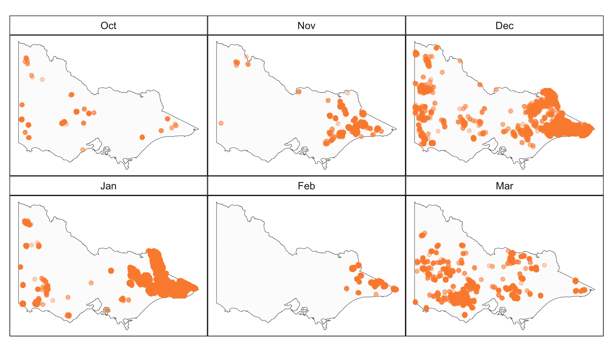
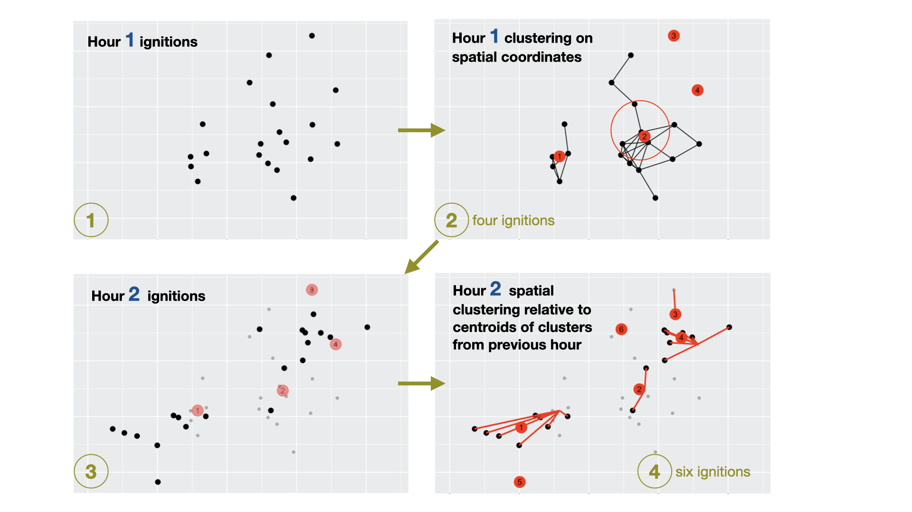
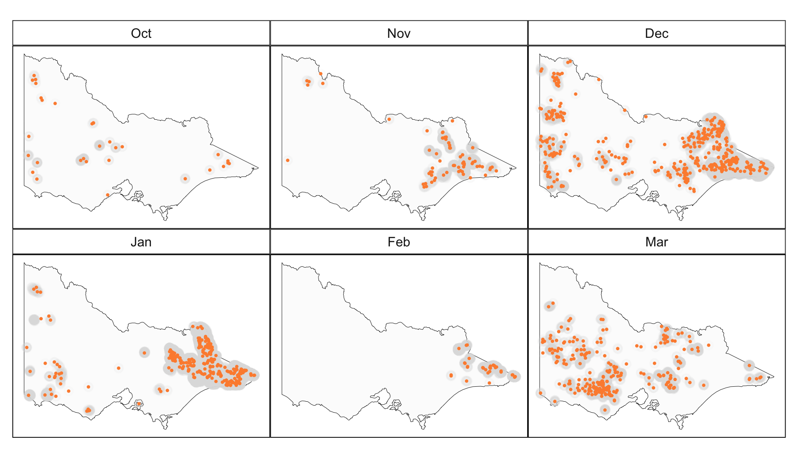
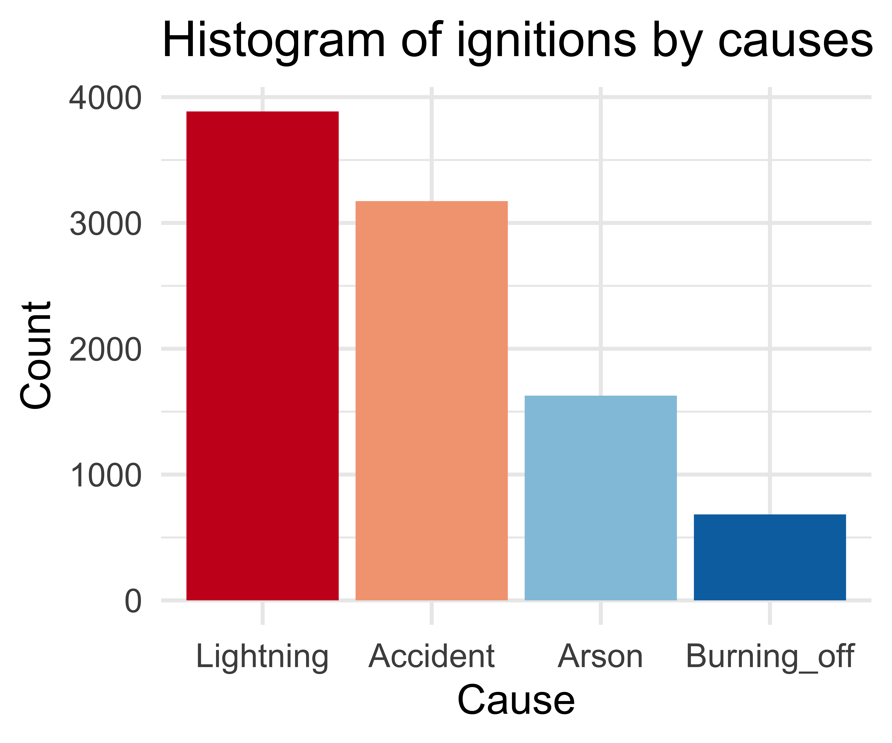
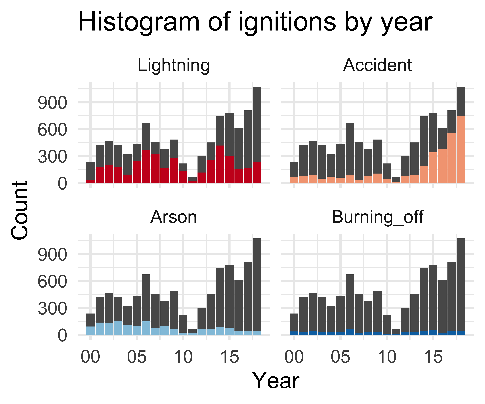
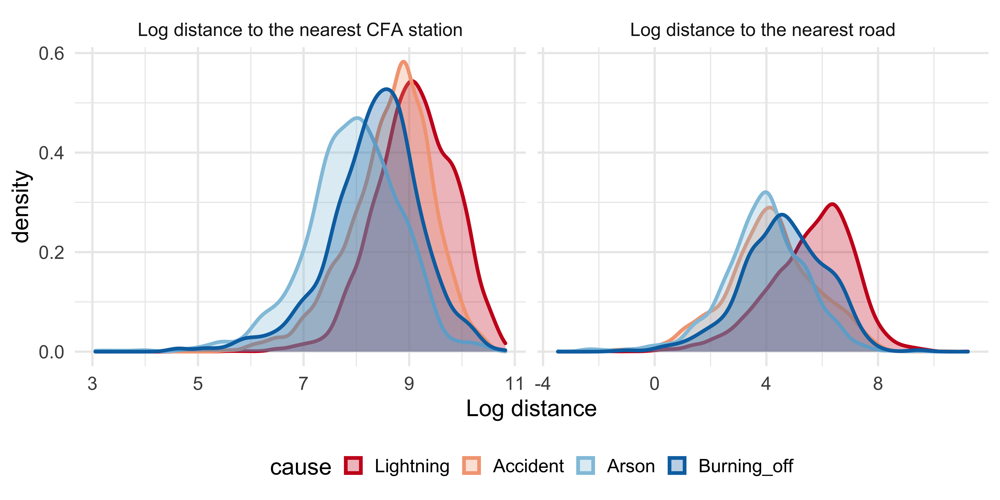
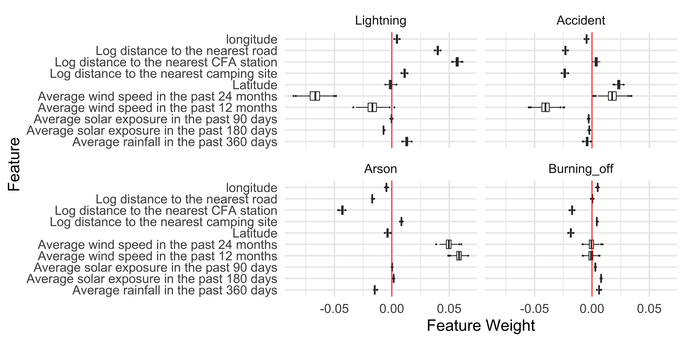

```{r, include = FALSE}
current_file <- knitr::current_input()
basename <- gsub(".Rmd$", "", current_file)

knitr::opts_chunk$set(
  fig.path = sprintf("images/%s/", basename),
  fig.width = 6,
  fig.height = 4,
  out.width = "100%",
  fig.align = "center",
  fig.retina = 5,
  echo = FALSE,
  warning = FALSE,
  message = FALSE,
  cache = FALSE,
  cache.path = "cache/"
)
```

```{r}
library(tidyverse)
library(kableExtra)
library(ggthemes)
library(rnaturalearth)
library(lubridate)
library(plotly)
```

```{r titleslide, child="assets/titleslide.Rmd"}
```

---
# Patrick's honours thesis

<table>
<tr>
<td>  </td> 
<td width="100px"> </td>
<td>  </td>
</tr>
<tr>
<td> Weihao Li  </td> 
<td> </td>
<td>
Emily Dodwell  </td>
</tr>
<tr>
<td> Monash EBS Honours  </td> 
<td> </td>
<td>
AT&T research  </td>
</tr>
</table>

<br>

*Motivation*: Spatio-temporal visualisation and analysis of emergency call data. This is private so the bushfire data was collected because it has some similar form and structure.

---
# ⚡  Lightning or 🔥Arson?</h2>


---
# Remote sensing data

Japan Aerospace Exploration Agency  provides a hotspot product (reflected energy from the earth) taken from the **Himawari-8** satellite.

.footnote[[Example code to access data provided in a G. Williamson gist post](https://gist.github.com/ozjimbob/80254988922140fec4c06e3a43d069a6)]




# Data Sources

.monash-red2[**🔥 Historical fire origins**]: 2000-2019 .font_my_2[[Department of Environment, Land, Water and Planning](https://discover.data.vic.gov.au/dataset/fire-origins-current-and-historical)]

.monash-red2[**📡 Remote sensing data**]: .font_my_2[[Japan Aerospace Exploration Agency](https://www.eorc.jaxa.jp/ptree/userguide.html)]

.font_my[
**Wind speed data**: 1-day, 7-day, ..., 2-year averages from .font_my_2[[Commonwealth Scientific and Industrial Research Organisation and Automated Surface Observing System](https://doi.org/10.25919/5c5106acbcb02)]

**Temperature, Rainfall and Solar exposure**: 1-day, 7-day , 14-day, 28-day, ..., 720-day averages computed from .font_my_2[[Bureau of Meteorology](https://CRAN.R-project.org/package=bomrang)]

**Fuel layer**: Forest type, forest height class, forest crown cover from .font_my_2[[Australian Bureau of Agricultural and Resource Economics](https://www.agriculture.gov.au/abares/forestsaustralia/forest-data-maps-and-tools/spatial-data/forest-cover)]

**Road map**: Proximity to the nearest road using .font_my_2[[OpenStreetMap](%20https://www.openstreetmap.org%20)]

**Fire stations**: Proximity to the nearest CFA station  .font_my_2[[Department of Environment, Land, Water and Planning](https://discover.data.vic.gov.au/dataset/cfa-fire-station-vmfeat-geomark_point)]

**Recreation sites**: Proximity to the nearest camping site .font_my_2[[Department of Environment, Land, Water and Planning](https://discover.data.vic.gov.au/dataset/recreation-sites)]
]

---

# Data fusion


---
# Detect ignitions by clustering hotspot data



---
# Estimated ignitions

76,000 hotspots reduced to 1,000 ignition sites.



---
# Exploratory analysis of historical fire origins

.font_my_2[
Text processing of 26 causes, reduced to four major causes. Lightning and accident were the two main sources of historical bushfire ignitions, which took up 41% and 34% respectively. There were 17% bushfires caused by arson.
]




---
# Spatial distribution of historical fire origins

.font_my_2[
Roughly different spatial locations of ignition causes.  Lightning bushfires were concentrated in the east of Victoria. Bushfires caused by arson were near Bendigo!
]


---
# Proximity of historical fire origins

.font_my_2[
Lightning-caused bushfires were further away from the CFA stations and roads. In contrast, bushfires caused by arson were closer to CFA stations and roads.
]



---
# Modelling

.monash-blue[A **random forest** model outperformed other model choices to classify different causes of bushfire ignition. ]


.monash-blue[.font_my_2[80% of the data used as training set, 7497 observations, and the remaining 1872 observations was used as test set.]]

<br>
.font_my_2[
Model performance was compared using multi-class AUC (Hand and Till, 2001).]

```{r}
data.frame(model = c("Multinomial logistic regression", "GAM multinomial logistic regression", "Random forest", "XGBoost"), 
           Accuracy = c(0.53, 0.68, 0.75, 0.74),
           AUC = c(0.74, 0.82, 0.88, 0.88)) %>%
  `colnames<-`(c("Model", "Accuracy", "Muti-class AUC")) %>%
  knitr::kable("html")  %>%
  kable_classic(full_width = F, html_font = "Cambria") %>%
  kable_styling(font_size = 20)
```

---
# Model performance

.font_my[
.monash-blue[The overall accuracy of our model was 74.95%.] 

- High accuracy with lightning and accident ignitions.  
- Less accurate predictions for arson and burning off. 
]

<br>

```{r}
data.frame(Lightning = c(703, 51, 18, 5, 777), 
           Accident = c(77, 494, 55, 8, 634),
           Arson = c(50, 89, 175, 11, 325),
           Burning_off = c(44, 38, 22, 32, 136),
           Total = c(874, 672, 270, 56, 1872)) %>%
  mutate(Lightning = c(paste0(Lightning[1:4], " (", round(Lightning[1:4]/Lightning[5], 2), ")" ), paste0(Lightning[5]))) %>%
  mutate(Accident = c(paste0(Accident[1:4], " (", round(Accident[1:4]/Accident[5], 2), ")" ), paste0(Accident[5]))) %>%
  mutate(Arson = c(paste0(Arson[1:4], " (", round(Arson[1:4]/Arson[5], 2), ")" ), paste0(Arson[5]))) %>%
  mutate(Burning_off = c(paste0(Burning_off[1:4], " (", round(Burning_off[1:4]/Burning_off[5], 2), ")" ), paste0(Burning_off[5]))) %>%
  `row.names<-`(c("Prediction:Lightning", "Prediction:Accident", "Prediction:Arson", "Prediction:Burning_off", "Total")) %>%
  knitr::kable("html")  %>%
  kable_classic(full_width = F, html_font = "Cambria") %>%
  kable_styling(font_size = 20)
  
```

---
# Model interpretation

.font_my_2[
Variable importance assessed using [Local Interpretable Model-agnostic Explanations (lime)](https://lime.data-imaginist.com). Proximity to the nearest road, proximity to the nearest road and average wind speed had largest influence on the prediction.
]




---

# **Prediction for 2019-2020 Australia bushfires**

```{r out.width="80%"}
au_map <- ne_states(country = 'Australia', returnclass = 'sf')
vic_map <- au_map[7,]

read_csv(here::here("data/prediction_2019-2020.csv")) %>%
  mutate(cause = factor(tools::toTitleCase(cause), levels = c("Lightning", "Accident", "Arson", "Burning_off"))) %>%
  ggplot() +
  geom_sf(data = vic_map, fill = "grey99") +
  geom_point(aes(lon, lat, col = cause, text = paste0("Mon: ", month.abb[month(time)])), size = 1.5, alpha = 1) +
  theme_map(base_size = 20) +
  theme(legend.position = "right") +
  # facet_wrap(~factor(month.abb[month(time)], levels = c("Oct", "Nov", "Dec", "Jan", "Feb", "Mar"))) +
  scale_color_brewer(palette = "RdBu")-> p

p
#ggplotly(p, tooltip = c("colour", "text"))

```

---
# Summary of findings

.font_my_2[
.monash-blue[- Majority of the bushfires in 2019-2020 season were caused by **lightning**.]
- 138 bushfires caused by accidents which took up 14% of the total fires. Most of them were ignited in March. 
- 37 bushfires were caused by arsonists, and over half of them were in March.
- Very few planned burns were predicted after October 2019 which suggests the correctness of our model.
]

<br>

```{r}
read_csv(here::here("data/prediction_2019-2020.csv")) %>%
  mutate(cause = factor(tools::toTitleCase(cause), levels = c("Lightning", "Accident", "Arson", "Burning_off"))) %>%
  mutate(month = factor(month.abb[month(time)], levels = c("Oct", "Nov", "Dec", "Jan", "Feb", "Mar"))) %>%
  group_by(cause, month) %>%
  count() %>%
  ungroup() %>%
  rename(Cause = cause) %>%
  spread(month, n) -> temp

temp[is.na(temp)] <- 0

temp$Total <- temp$Oct + temp$Nov + temp$Dec + temp$Jan + temp$Feb + temp$Mar
temp$Total <- paste0(temp$Total, " (", round(temp$Total/sum(temp$Total), 2), ")")

temp  %>%
  knitr::kable("html")  %>%
  kable_classic(full_width = F, html_font = "Cambria") %>%
  kable_styling(font_size = 20)
  
```

---
# Shiny app: https://ebsmonash.shinyapps.io/VICfire/

```{r out.width="110%"}
knitr::include_app("https://ebsmonash.shinyapps.io/VICfire/", height = "550px") 
```

---
class: transition middle

# Your kaggle experience

In theory it should have been possible to perfectly predict the causes in the prediction set.

---
# Baseline

```
set.seed(2021)
fires_rf <- rand_forest() %>%
  set_engine("randomForest",
             importance=TRUE) %>%
  set_mode("classification") %>%
  fit(cause~lon+lat+arf720+
        ase720+amaxt720+amint720+dist_cfa+
        dist_camp+dist_road+month+day, data=fires_tr_full)

fires_ts_true <- fires_ts_true %>%
  mutate(cause_p = predict(fires_rf,
                           fires_ts_true)$.pred_class)

bal_accuracy(fires_ts_true, cause, cause_p)
# bal_accuracy macro          0.702
```
---
# Patrick's variables from actual predictions

```
set.seed(2021)
fires_rf <- rand_forest() %>%
  set_engine("randomForest",
             importance=TRUE,
             na.action=na.omit) %>%
  set_mode("classification") %>%
  fit(cause~log_dist_camp+log_dist_road+log_dist_cfa+lon+
        ase180+lat+aws_m24+aws_m12+arf360+ase90,
      data=fires_tr_full)

fires_ts_true <- fires_ts_true %>%
  mutate(cause_p = predict(fires_rf,
                           fires_ts_true)$.pred_class)

bal_accuracy(fires_ts_true, cause, cause_p)
# bal_accuracy macro          0.798
```

---
# Modify forest parameters

```
set.seed(2021)
fires_rf <- rand_forest(mtry=1, trees=1000) %>%
  set_engine("randomForest",
             importance=TRUE,
             na.action=na.omit) %>%
  set_mode("classification") %>%
  fit(cause~log_dist_camp+log_dist_road+log_dist_cfa+lon+
        ase180+lat+aws_m24+aws_m12+arf360+ase90,
      data=fires_tr_full)

fires_ts_true <- fires_ts_true %>%
  mutate(cause_p = predict(fires_rf,
                           fires_ts_true)$.pred_class)

bal_accuracy(fires_ts_true, cause, cause_p)
# bal_accuracy macro          0.859
```

---
# Filter only summer months

```
set.seed(2021)
fires_rf <- rand_forest(mtry=1, trees=1000) %>%
  step_filter(month %in% c(1,2,3,10,11,12)) %>%
  set_engine("randomForest",
             importance=TRUE,
             na.action=na.omit) %>%
  set_mode("classification") %>%
  fit(cause~log_dist_camp+log_dist_road+log_dist_cfa+lon+
        ase180+lat+aws_m24+aws_m12+arf360+ase90,
      data=fires_tr_full)

fires_ts_true <- fires_ts_true %>%
  mutate(cause_p = predict(fires_rf,
                           fires_ts_true)$.pred_class)

bal_accuracy(fires_ts_true, cause, cause_p)
# bal_accuracy macro          0.872
```

---
# Use weights during model building

```
# Need to revert to old style code
set.seed(2021)
fires_tr_full_summer <- fires_tr_full %>%
  filter(month %in% c(1,2,3,10,11,12)) %>%
  drop_na()
fires_tr_full_summer %>% group_by(cause) %>% summarise(n=n()) %>% mutate(n/sum(n))
fires_rf <- randomForest(cause~log_dist_camp+log_dist_road+
                 log_dist_cfa+lon+ase180+lat+aws_m24+
                 aws_m12+arf360+ase90,
        data=fires_tr_full_summer,
        mtry=1, trees=1000,
        importance=TRUE,
        classwt = c(0.414, 0.339, 0.174, 0.0730))

fires_ts_true <- fires_ts_true %>%
  mutate(cause_p = predict(fires_rf,
                           fires_ts_true, type="class"))
```

---

```
bal_accuracy(fires_ts_true, cause, cause_p)
# bal_accuracy macro          0.910

> conf_mat(fires_ts_true, cause, cause_p)
             Truth
Prediction    lightning accident arson burning_off
  lightning         820       21     1           1
  accident           17      112     3           1
  arson               1        4    32           0
  burning_off         0        1     1           7
```

---
# Upsample

```
set.seed(2021)
fires_rf <- rand_forest(mtry=1, trees=1000) %>%
  step_filter(month %in% c(1,2,3,10,11,12)) %>%
  themis::step_upsample(cause) %>%
  set_engine("randomForest",
             importance=TRUE,
             na.action=na.omit) %>%
  set_mode("classification") %>%
  fit(cause~log_dist_camp+log_dist_road+log_dist_cfa+lon+
        ase180+lat+aws_m24+aws_m12+arf360+ase90,
      data=fires_tr_full)

fires_ts_true <- fires_ts_true %>%
  mutate(cause_p = predict(fires_rf,
                           fires_ts_true)$.pred_class)

bal_accuracy(fires_ts_true, cause, cause_p)
# bal_accuracy macro          0.884
```

---
# Weighted accuracy

- lightning 0.02 (0.82)
- accident 0.05 (0.14)
- arson 0.18 (0.04)
- burning_off 0.75 (0.01)

```
  cause           n       p    invp invp_sum1
  <fct>       <int>   <dbl>   <dbl>     <dbl>
1 lightning     838 0.820   0.00119   0.00814
2 accident      138 0.135   0.00725   0.0494 
3 arson          37 0.0362  0.0270    0.184  
4 burning_off     9 0.00881 0.111     0.758  
```

---
background-image: \url(images/lecture-12a/final_leaderboard.png)
background-size: cover

<br><br><br>
<br><br><br>
<br><br><br>
https://www.kaggle.com/c/spotoroo/host/all-submissions

---
```{r endslide, child="assets/endslide.Rmd"}
```

