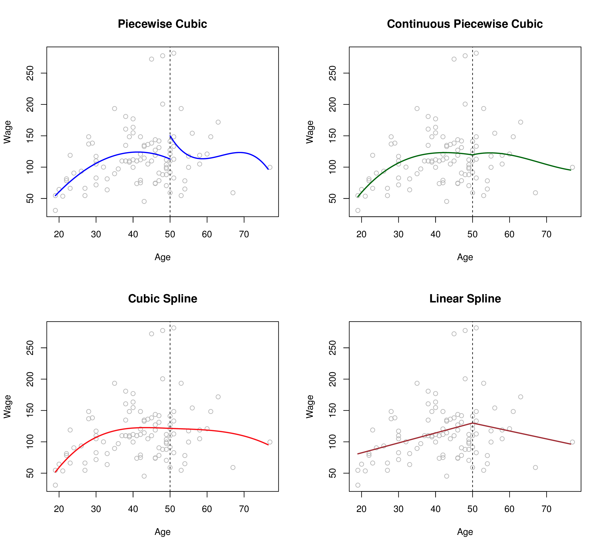

```{r setup, include=FALSE}
library(knitr)
knitr::opts_chunk$set(tidy = FALSE, 
                      message = FALSE,
                      warning = FALSE,
                      echo = FALSE, 
                      fig.retina = 4)
options(htmltools.dir.version = FALSE)
```

class: split-two

.column[.pad50px[

# Moving beyond linearity

Sometimes the relationships we discover are not linear... 
<br>

<br>

<br>

<br>


###### Image source: [XKCD](https://xkcd.com/2048/)]]

.column[.content.vmiddle.center[


]]


---

class: split-two

.column[.pad50px[

# Moving beyond linearity

- Consider the following Major League Baseball data from the 1986 and 1987 seasons.
- Would a linear model be appropriate for modelling the relationship between Salary and Career hits, captured in the variables `logSalary` and `logCHits`?

]]

.column[.content.vmiddle.center[

```{r, fig.retina = 4}
library(tidyverse)
library(ISLR)
library(splines)
library(gridExtra)
library(grid)

hits <- Hitters %>% 
        filter(CHits > 9) %>% 
        filter(!is.na(Salary)) %>%
        mutate(logSalary = log10(Salary), logCHits = log10(CHits))

        ggplot(hits, aes(x=logCHits, y=logSalary)) + 
          geom_point(alpha = 0.2, size = 2) + 
          geom_smooth(method="lm", se = FALSE, size = 1.5) +
          theme_minimal(base_size = 18) 
```

]]


---

class: split-two

.column[.pad50px[

# Moving beyond linearity


- Perhaps a more flexible regression model is needed!

]]

.column[.content.vmiddle.center[

```{r, fig.height=8, fig.retina=4}

library(rpart)

p1 <- ggplot(hits, aes(x=logCHits, y=logSalary)) + 
      geom_point(alpha = 0.2, size = 2) + 
      geom_smooth(method = "lm", formula = y ~ splines::bs(x, df = 4), colour="orange", size=1.5, se = FALSE) +
      theme_minimal(base_size = 18) 

rt <- rpart(logSalary~logCHits, data=hits)
hits <- hits %>% mutate(hitsrt = predict(rt, hits))

p2 <- ggplot(hits, aes(x=logCHits, y=logSalary)) + 
      geom_point(alpha = 0.2, size = 2) + 
      geom_line(aes(y=hitsrt), colour="orange", size=1.5) +
      theme_minimal(base_size = 18)

grid.arrange(p1, p2, nrow=2)
```

]]
---
# Flexible regression fits


The truth is rarely linear, 
but often the linearity assumption is good enough. 

When it's not ...

- .orange[polynomials],
- step functions,
- .orange[splines],
- local regression, and
- .orange[generalized additive models]

offer a lot of flexibility, without losing the ease and interpretability of linear models.


---
# Polynomial basis functions


Instead of fitting a linear model (in $X$), we fit the model

$$y_i = \beta_0 + \beta_1 b_1(x_i) + \beta_2 b_2(x_i) + \dots + \beta_K b_K(x_i) + e_i,$$

where $b_1(X), b_2(X), \dots, b_K(X)$ are a family of functions or transformations that can be applied to a variable $X$, and $i = 1, \dots, n$.

- Polynomial regression: $b_k(x_i) = x_i^k$
- Piecewise constant functions: $b_k(x_i) = I(c_k \leq x_i \leq c_{k+1})$


---
# Polynomial basis functions 

```{r basis-functions, out.width=800, out.height=400, fig.width=8, fig.height=4}
x <- seq(-1,1,l=100)
df <- tibble(x, x1=x, x2=x^2, x3=x^3, x4=x^4, x5=x^5)
df_m <- df %>% gather(poly, value, x1:x5)
ggplot(df_m, aes(x=x, y=value, colour=poly)) + 
  geom_line(aes(linetype=poly)) + 
  scale_colour_brewer(palette="Dark2") +
  ylab("b(x)") + theme_bw()
```

x1 $=x$, x2= $x^2$, x3= $x^3$, x4= $x^4$, x5= $x^5$


---
# Splines

Knots: $\kappa_1,\dots,\kappa_K$.

A spline is a continuous function $f(x)$ consisting of polynomials between each consecutive pair of "knots" $x=\kappa_j$ and $x=\kappa_{j+1}$.

- Parameters constrained so that $f(x)$ is continuous.
- Further constraints imposed to give continuous derivatives.


---
# Piecewise Cubic Poly Spline


Piecewise cubic polynomial with a single knot at a point $c$:

$$\hat{y}_i = \left\{ \begin{array}{l} 
\beta_{01}+\beta_{11}x_i+\beta_{21}x_i^2+\beta_{31}x_i^3~~~if~x_i< c\\
\beta_{02}+\beta_{12}x_i+ \beta_{22}x_i^2+\beta_{32}x_i^3~~~if~x_i \geq c\end{array}\right\}$$


---
# Piecewise Poly

<center>
<a href="http://www-bcf.usc.edu/~gareth/ISL/Chapter7/7.3.pdf" target="_BLANK">  </a>
</center>

.font_tiny[(Chapter 7/ 7.3)]
```{r, eval = FALSE, echo = FALSE}

# Linear Spline using `lspline` package

p_ls <- ggplot(hits, aes(x=logCHits, y=logSalary)) + 
      geom_point(alpha = 0.2, size = 2) + 
      geom_smooth(method="lm",  formula = y ~ lspline::lspline(x, c(2.5)), se = FALSE, size = 1.5) +
      theme_minimal(base_size = 18) +
      geom_vline(xintercept = 2.5, col = "black", size = 1.1, linetype = "dashed") 

  
```


---
# Basis Functions

- Truncated power basis
- Predictors: $x$, ..., $x^p$, $(x-\kappa_{1})_+^p$, ..., $(x-\kappa_{K})_+^p$

Then the regression is piecewise order- $p$ polynomials.
- $p-1$ continuous derivatives.
- Usually choose $p=1$ or $p=3$.
- $p+K+1$ degrees of freedom


---
# Basis functions


```{r truncated, out.width=800, out.height=400, fig.width=8, fig.height=4}
x <- seq(-1,1,l=100)
df <- tibble(x, x1=x, x2=x^2, x3=x^3, x4=pmax((x+0.5)^3,0), x5=pmax((x-0.5)^3,0))
df_m <- df %>% gather(poly, value, x1:x5)
ggplot(df_m, aes(x=x, y=value, colour=poly)) + 
  geom_line(aes(linetype=poly)) + 
  scale_colour_brewer(palette="Dark2") +
  ylab("b(x)") + theme_bw()
```

x1 $=x$, x2= $x^2$, x3= $x^3$, x4= $(x+0.5)^3_+$, x5= $(x-0.5)^3_+$


---
# Natural splines

- Splines based on truncated power bases have high variance at the outer range of the predictors.
- Natural splines are similar, but have additional .orange[boundary constraints]: the function is linear at the boundaries. This reduces the variance.

Degrees of freedom $\verb|df|=K$.

Create predictors using $\verb|ns|$ function in R (automatically chooses knots given $\verb|df|$).


---


class: split-two

.column[.pad50px[

# Comparison with Cubic splines


We can fit a cubic spline in `R` using `splines::bs()`, and fit a natural cubic spline using `splines::ns()`.

- Notice the difference between the fits towards the end of the curves.

]]

.column[.content.vmiddle.center[

```{r, fig.height=8, fig.retina=4}

ggplot(hits, aes(x=logCHits, y=logSalary)) + 
  geom_point(alpha = 0.2, size = 2) +
  stat_smooth(method = lm, formula = y ~ns(x, df = 10), se = FALSE, aes(color = "orangered3"), show.legend = TRUE) +
  stat_smooth(method = lm, formula = y ~ bs(x, df =10), se = FALSE, aes(color = "blue"), show.legend = TRUE) +
  scale_color_manual(name='', values=c("orangered3", "blue"), labels = c("Cubic Spline", "Natural Spline")) +
  theme_minimal(base_size = 18) +
  theme(legend.position="bottom")


```

]]

---
class: split-two

.column[.pad50px[

# Comparison with Polynomial Regression


- Notice the difference between the fits towards the end of the curves.

]]

.column[.content.vmiddle.center[

```{r, fig.height=8, fig.retina=4}

ggplot(hits, aes(x=logCHits, y=logSalary)) + 
  geom_point(alpha = 0.2, size = 2) +
  stat_smooth(method = lm, formula = y ~ns(x, df = 10), se = FALSE, aes(color = "orangered3"), show.legend = TRUE) +
  stat_smooth(method = lm, formula = y ~ poly(x, df =10), se = FALSE, aes(color = "blue"), show.legend = TRUE) +
  scale_color_manual(name='', values=c("orangered3", "blue"), labels = c("Polynomial", "Natural Spline")) +
  theme_minimal(base_size = 18)+
  theme(legend.position="bottom")


```

]]
---

# Natural cubic splines

```{r natural, out.width=800, out.height=500, fig.width=8, fig.height=5, fig.retina = 4}
x <- seq(-1,1,l=100)
xb <- ns(x, df=5)
df <- tibble(x, x1=xb[,1], x2=xb[,2], x3=xb[,3], x4=xb[,4], x5=xb[,5])
df_m <- df %>% gather(poly, value, x1:x5)
ggplot(df_m, aes(x=x, y=value, colour=poly)) + 
  geom_line(aes(linetype=poly)) + 
  scale_colour_brewer(palette="Dark2") +
  ylab("b(x)") + theme_bw()
```


---

# Knot placement

<br>

.green[`r icon::fa("chart-bar", size=1)`] **Strategy 1:** specify `df` (which creates `df-1` internal knots and 2 boundary knots, so that `df` = $K+1$) and let `ns()` place them at appropriate quantiles of the observed $X$. 

<br>

.green[`r icon::fa("chart-bar", size=1)`] **Strategy 2:** choose $K$ and their locations.


---
## Natural cubic splines with differing knots

```{r, warning = FALSE, message = FALSE, fig.width=13, fig.retina=4}


p_0 <- ggplot(hits, aes(x=logCHits, y=logSalary)) + 
  geom_point(alpha = 0.2, size = 2) +
  stat_smooth(method = lm, formula = y ~ns(x, df = 1), se = FALSE, colour = "orangered3") +
  ylim(c(1.5,3.2)) +
  theme_minimal(base_size = 18) +
  ggtitle("Natural Spline w/ 2 Knots") +
  theme(plot.title = element_text(hjust = 0.5)) +
  xlab("") +
  ylab("")


p_2 <- ggplot(hits, aes(x=logCHits, y=logSalary)) + 
  geom_point(alpha = 0.2, size = 2) +
  stat_smooth(method = lm, formula = y ~ns(x, df = 3), se = FALSE, colour = "orangered3") +
  ylim(c(1.5,3.2)) +
  theme_minimal(base_size = 18) +
  ggtitle("Natural Spline w/ 4 Knots") +
  theme(plot.title = element_text(hjust = 0.5))

p_3 <- ggplot(hits, aes(x=logCHits, y=logSalary)) + 
  geom_point(alpha = 0.2, size = 2) +
  stat_smooth(method = lm, formula = y ~ns(x, df = 4), se = FALSE, colour = "orangered3") +
  ylim(c(1.5,3.2)) +
  theme_minimal(base_size = 18) +
  ggtitle("Natural Spline w/ 5 Knots") +
  theme(plot.title = element_text(hjust = 0.5)) +
  xlab("") +
  ylab("")

p_8 <- ggplot(hits, aes(x=logCHits, y=logSalary)) + 
  geom_point(alpha = 0.2, size = 2) +
  stat_smooth(method = lm, formula = y ~ns(x, df = 9), se = FALSE, colour = "orangered3") +
  ylim(c(1.5,3.2)) +
  theme_minimal(base_size = 18) +
  ggtitle("Natural Spline w/ 10 Knots") +
  theme(plot.title = element_text(hjust = 0.5)) +
  xlab("") +
  ylab("")


p_15 <- ggplot(hits, aes(x=logCHits, y=logSalary)) + 
  geom_point(alpha = 0.2, size = 2) +
  stat_smooth(method = lm, formula = y ~ns(x, df = 15), se = FALSE, colour = "orangered3") +
  ylim(c(1.5,3.2)) +
  theme_minimal(base_size = 18) +
  ggtitle("Natural Spline w/ 16 Knots") +
  theme(plot.title = element_text(hjust = 0.5)) +
  xlab("") +
  ylab("")


p_50 <- ggplot(hits, aes(x=logCHits, y=logSalary)) + 
  geom_point(alpha = 0.2, size = 2) +
  stat_smooth(method = lm, formula = y ~ns(x, df = 49), se = FALSE, colour = "orangered3") +
  ylim(c(1.5,3.2)) +
  theme_minimal(base_size = 18) +
  ggtitle("Natural Spline w/ 50 Knots") +
  theme(plot.title = element_text(hjust = 0.5)) +
  xlab("") +
  ylab("")


grid.arrange(p_0, p_2, p_3, p_8, p_15, p_50, nrow = 2, 
             bottom= textGrob("logCHits", gp=gpar(fontsize=18,font=1)),
             left= textGrob("logSalary", rot = 90, gp=gpar(fontsize=18,font=1)))

```
---
# Generalised additive models (GAMs)

Why is it hard to fit models of the form

$$y = f(x_1,x_2,\dots,x_p) + e?$$
- Data is very sparse in high-dimensional space.
- Model assumes $p$-way interactions which are hard to estimate.


---
# Additive functions

<br>

.tip[
$y_i=\beta_0+f_1(x_{i,1})+f_2(x_{i,2})+...+f_p(x_{p,1})+e_i$
]

where each $f$ is a smooth univariate function.

Allows for flexible nonlinearities in several variables, but retains
the additive structure of linear models.


---
class: split-two

.column[.pad50px[

# Additive functions

$$\begin{align}
\log(\mbox{Salary}) & = \beta_0 + f_1(\mbox{log(CHits)})  \\
& + f_2(\mbox{Years}) + f_3(\mbox{Errors}) \\
& + f_4(\mbox{Assists}) + \varepsilon
\end{align}$$

<br>

```{r, eval = FALSE, echo = TRUE}
my_gam <- gam(logSalary~s(logCHits) +
                s(Years)+ s(Errors) + 
                s(Assists),data = hits)
```


]]

.column[.content.vmiddle.center[

```{r, fig.retina=4, message=FALSE, warning =FALSE}
library(mgcv) #for fitting GAM
library(gratia) #for ggplot of GAM

my_gam <- gam(logSalary~s(logCHits)+s(Years)+ s(Errors) + s(Assists),data = hits)
draw(my_gam)
```

]]

---
# Generalisations


- Can fit a GAM simply using, e.g. natural splines:
- Coefficients not that interesting; fitted functions are. 
- Use `draw` from `gratia` package to plot GAMs fitted in `mgcv` package.
-  Can mix terms --- some linear, some nonlinear --- and use
`anova()` to compare models.
- GAMs are additive, although low-order interactions can be
included in a natural way using, e.g. bivariate smoothers or
interactions of the form `ns(age,df=5):ns(year,df=5)`.


---
# Can we include interaction effects?


- Additive models assume no interactions. 
- Add bivariate smooths for two-way interactions.
- Graphically check for interactions using faceting.


---
layout: false
# `r set.seed(2020); emo::ji("technologist")` Made by a human with a computer

### Slides at [https://iml.numbat.space](https://iml.numbat.space).
### Code and data at [https://github.com/numbats/iml](https://github.com/numbats/iml).
<br>

### Created using [R Markdown](https://rmarkdown.rstudio.com) with flair by [**xaringan**](https://github.com/yihui/xaringan), and [**kunoichi** (female ninja) style](https://github.com/emitanaka/ninja-theme).

<br> 
<a rel="license" href="http://creativecommons.org/licenses/by-sa/4.0/"></a><br />This work is licensed under a <a rel="license" href="http://creativecommons.org/licenses/by-sa/4.0/">Creative Commons Attribution-ShareAlike 4.0 International License</a>.
