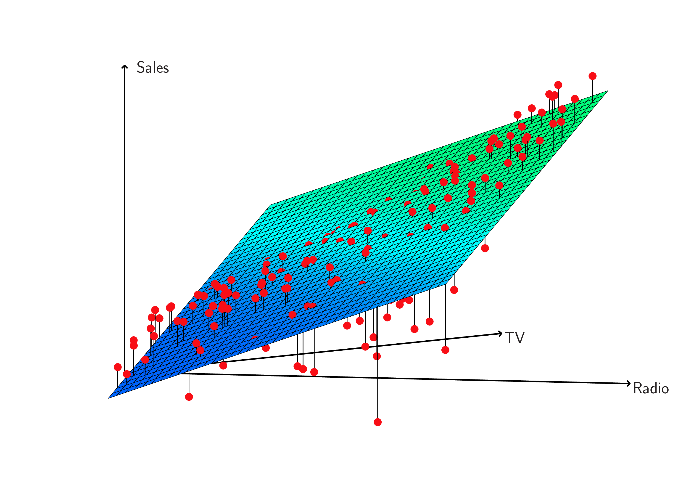
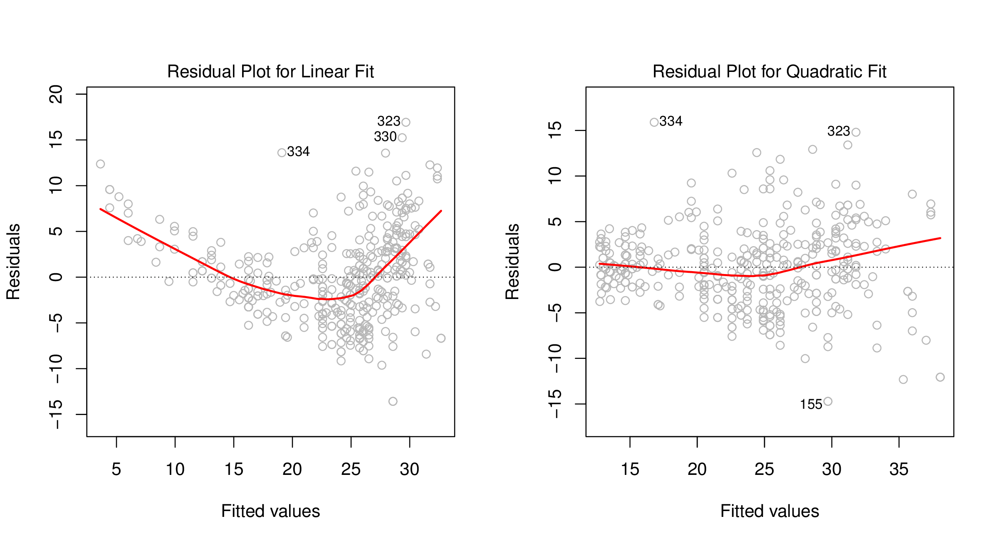

```{r setup, include=FALSE}
library(knitr)
knitr::opts_chunk$set(tidy = FALSE, 
                      message = FALSE,
                      warning = FALSE,
                      echo = FALSE, 
                      fig.retina = 4)
options(htmltools.dir.version = FALSE)
```


## Multiple Regression

<br>

.tip[
$$Y_i = \beta_0 + \beta_1 X_{1,i} + \beta_2 X_{2,i} + \cdots + \beta_pX_{p,i} + e_i$$]

- Each $X_{j,i}$ is .orange[numerical] and is called a .orange[predictor].
- The coefficients $\beta_1,\dots,\beta_p$ measure the .orange[effect] of each
predictor after taking account of the effect of all other predictors
in the model.
- Predictors may be .orange[transforms] of other predictors. e.g., $X_2=X_1^2$.


---

## Multiple Regression


- The model describes a .orange[**line**, plane or hyperplane] in the predictor space.


<center><a href="http://www-bcf.usc.edu/~gareth/ISL/Chapter3/3.1.pdf" target="_BLANK">  </a>
</center>

.font_tiny[(Chapter3/3.1.pdf)]

---
## Multiple Regression


- The model describes a .orange[line, **plane** or hyperplane] in the predictor space.


<center>
<a href="http://www-bcf.usc.edu/~gareth/ISL/Chapter3/3.5.pdf" target="_BLANK">  </a>
</center>

.font_tiny[(Chapter3/3.5.pdf)]
---
## Categorical Variables

Qualitative variables need to be converted to numeric.

$$x_i = \left\{\begin{array}
{ll}
1 & \mbox{if} ~~~ i^{\text{th}} \mbox{ obs is a koala}  \\
0 & \mbox{otherwise}  
\end{array}\right\}$$

which would result in the model

$$\hat{y}_i = \left\{\begin{array}
{ll}
\beta_0+\beta_1 & \mbox{if} ~~~ i^{\text{th}} \mbox{ obs is a koala}   \\
\beta_0 & \mbox{otherwise}  
\end{array}\right\}$$


---
## Categorical Variables

More than two categories

$$x_{i1} = \left\{\begin{array}
{ll}
1 & \mbox{if} ~~~ i^{\text{th}} \mbox{ obs is a koala}  \\
0 & \mbox{otherwise}  
\end{array}\right\}$$

$$x_{i2} = \left\{\begin{array}
{ll}
1 & \mbox{if} ~~~ i^{\text{th}} \mbox{ obs is a bilby}  \\
0 & \mbox{otherwise}  
\end{array}\right\}$$

which would result in the model using .orange[dummy variables].

$$\hat{y}_i = \left\{\begin{array}
{ll}
\beta_0+\beta_1 & \mbox{if} ~~~ i^{\text{th}} \mbox{ obs is a koala}   \\
\beta_0+\beta_2 & \mbox{if} ~~~  i^{\text{th}}  \mbox{ obs is a bilby}  \\
\beta_0 & \mbox{otherwise}  
\end{array}\right\}$$

---
## Ordinary Least Squares (OLS)

<br>

.orange[Ordinary least squares] is the simplest way to fit the model. Geometrically, this is  the sum of the squared distances, parallel to the axis of the dependent variable, between each observed data point and the corresponding point on the regression surface – the .orange[smaller the sum] of differences, the .orange[better] the model fits the data.


---
## Model Diagnostics

<br>

$R^2$ is the proportion of variation explained by the model, and measures the goodness of the fit, close to 1 the model explains most of the variability in $Y$, close to 0 it explains very little. 

$$R^2 = 1 - \frac{RSS}{TSS}$$

where $RSS = \sum_{i=1}^n (y_i-\hat{y})^2$ (read: Residual Sum of Squares), and $TSS=\sum_{i=1}^n (y_i-\bar{y})^2$ (read: Total Sum of Squares).

 

---

## Model Diagnostics

<br>

.orange[Residual Standard Error (RSE)] is an estimate of the standard deviation of $\varepsilon$. This is meaningful with the assumption that $\varepsilon \sim N(0, \sigma^2)$. 

$$RSE = \sqrt{\frac{1}{n-p-1}RSS}$$


---
## Model Diagnostics

<br>

F statistic tests whether any predictor explains response, by testing

$H_0: \beta_1=\beta_2=...=\beta_p=0$ vs $H_A:$ at least one is not 0


---
## Think about ...

<br>

- Is at least one of the predictors useful in predicting the response?
- Do all the predictors help to explain $Y$, or is only a subset of the predictors useful?
- How well does the model fit the data?
- Given a set of predictor values, what response value should we predict and how accurate is our prediction?


---
## Example - Wages

Wage and other data for a group of 3000 male workers in the Mid-Atlantic region. 
.orange[Goal:] .green[Predict wage based on worker characteristics.]

```{r}
library(tidyverse)
library(ISLR)
glimpse(Wage)
```


---

## Take a look

What do the following pairwise comparisons of the variables `year`, `age` and, `education` against `wage` show us?


```{r fig.height=5, fig.width=12, out.width="100%"}
library(GGally)
ggduo(Wage, columnsX=c(1,2,5), columnsY=11)
```


---

## Take a look

If we examine `logwage` instead of `wage` as response variable - what changes?


```{r fig.height=5, fig.width=12, out.width="100%"}
ggduo(Wage, columnsX=c(1,2,5), columnsY=10)
```

---
class: split-two

.column[.pad50px[

## Take a look

<br>
- Examine the predictors. Ideally values are spread out without any associations.

]]

.column[.content.vmiddle.center[
```{r fig.height=8, fig.width=8, out.width="90%"}
ggpairs(Wage, columns=c(1,2,5))
```
]]
---
## Model for wage data

<br>

.tip[
$Y = \beta_0 + \beta_1X_1 + \beta_2X_2 + \beta_3X_3 + e$
]

where $Y=$ `logwage`, $X_1=$ `year`, $X_2=$ `age`, and $X_3=$ `education`.


---
## Fitting the model in R

```{r results='hide'}
fit <- lm(logwage~year+age+education, data=Wage)
summary(fit)
```
```
lm(formula = logwage ~ year + age + education, data = Wage)

Coefficients:
                              Estimate Std. Error t value Pr(>|t|)    
(Intercept)                 -1.745e+01  5.469e+00  -3.191  0.00143  
year                         1.078e-02  2.727e-03   3.952 7.93e-05 
age                          5.509e-03  4.813e-04  11.447  < 2e-16 
education2. HS Grad          1.202e-01  2.086e-02   5.762 9.18e-09 
education3. Some College     2.440e-01  2.195e-02  11.115  < 2e-16 
education4. College Grad     3.680e-01  2.178e-02  16.894  < 2e-16 
education5. Advanced Degree  5.411e-01  2.362e-02  22.909  < 2e-16 

Residual standard error: 0.3023 on 2993 degrees of freedom
Multiple R-squared:  0.2631,	Adjusted R-squared:  0.2616 
F-statistic: 178.1 on 6 and 2993 DF,  p-value: < 2.2e-16
```


---
## Interpretation

- The ideal scenario is when the predictors are uncorrelated.
    - Each coefficient can be interpreted and tested separately.
- Correlations amongst predictors cause problems.
    - The variance of all coefficients tends to increase, sometimes dramatically.
    - Interpretations become hazardous -- when $X_j$ changes, everything else changes.
    - Predictions still work provided new $X$ values are within the range of training $X$ values.
- Claims of causality should be avoided for observational data.

---
## Interactions

- An interaction occurs when the one variable changes the effect of a second variable. (e.g., spending on radio advertising increases the effectiveness of TV advertising).
- To model an interaction, include the product $X_1X_2$ in the model in addition to $X_1$ and $X_2$.


- **Hierarchy principle**: If we include an interaction in a model, we should also include the main effects, even if the p-values associated
with their coefficients are not significant. (This is because the interactions are almost impossible to interpret without the main effects.)


---
## Interactions


<a href="http://www-bcf.usc.edu/~gareth/ISL/Chapter3/3.7.pdf" target="_BLANK">  </a>

.font_tiny[(Chapter3/3.7.pdf)]
---
## Residuals

<br>

- If a plot of the residuals vs any predictor in the model shows a pattern, then the .orange[relationship is nonlinear.]
- If a plot of the residuals vs any predictor **not** in the model shows a pattern, then .orange[the predictor should be added to the model.]
- If a plot of the residuals vs fitted values shows a pattern, then there is .orange[heteroscedasticity in the errors]. (Could try a transformation.)


---
## Residuals

<center>
<a href="http://www-bcf.usc.edu/~gareth/ISL/Chapter3/3.9.pdf" target="_BLANK">  </a>
</center>

.font_tiny[(Chapter3/3.9.pdf)]


---
## Model

.green[
$$Y_i = \beta_0 + \beta_1 X_{1,i} + \beta_2 X_{2,i} + \cdots + \beta_pX_{p,i} + e_i.$$
]

Let $Y = (Y_1,\dots,Y_n)'$, $e = (e_1,\dots,e_n)'$, $\beta = (\beta_0,\dots,\beta_p)'$ and

$$X = \begin{bmatrix}
  1 & X_{1,1} & X_{2,1} & \dots & X_{p,1}\\
  1 & X_{1,2} & X_{2,2} & \dots & X_{p,2}\\
\vdots & \vdots & \vdots & & \vdots\\
  1 & X_{1,n} & X_{2,n} & \dots & X_{p,n}
  \end{bmatrix}.$$
Then

.green[
$${Y} = {X}{\beta} + {e}$$]


---
## Least squares estimation

Minimize: $(Y - X\beta)'(Y - X\beta)$

Differentiate wrt $\beta$ and equal to zero gives

$\hat{\beta}=(X'X)^{-1}X'Y$

(The "normal equation".)


$$\hat{\sigma}^2 = \frac{1}{n-p-1}({Y} - {X}\hat{{\beta}})' ({Y} - {X}\hat{{\beta}})$$

**Note:** If you fall for the dummy variable trap, $({X}'{X})$ is a singular matrix.


---

## Likelihood


If the errors are iid and normally distributed, then

$${Y} \sim \mathcal{N}_n({X}{\beta},\sigma^2{I})$$

So the likelihood is

$$L = \frac{1}{\sigma^n(2\pi)^{n/2}}\exp\left(-\frac1{2\sigma^2}({Y}-{X}{\beta})'({Y}-{X}{\beta})\right)$$


which is maximized when $({Y}-{X}{\beta})'({Y}-{X}{\beta})$ is minimized.

.orange[So MLE `\\(\equiv \\)` OLS.]


---
## Predictions

.green[Optimal predictions]


$$\hat{Y}^* = \text{E}(Y^* | {X}^*, {Y},{X}) =
{X}^*\hat{{\beta}} = {X}^*({X}'{X})^{-1}{X}'{Y}$$

where ${X}^*$ is a row vector containing the values of the regressors for the predictions (in the same format as ${X}$).

.green[Prediction variance]

$$\text{Var}(Y^* | {X}^*, {Y},{X}) = \sigma^2 \left[1 + {X}^* ({X}'{X})^{-1} ({X}^*)'\right]$$

- This ignores any errors in ${X}^*$.
- 95% prediction intervals assuming normal errors:
$\hat{Y}^* \pm 1.96 \sqrt{\text{Var}(Y^*| {Y},{X},{X}^*)}$.


---
layout: false
# `r set.seed(2020); emo::ji("technologist")` Made by a human with a computer

### Slides at [https://iml.numbat.space](https://iml.numbat.space).
### Code and data at [https://github.com/numbats/iml](https://github.com/numbats/iml).
<br>

### Created using [R Markdown](https://rmarkdown.rstudio.com) with flair by [**xaringan**](https://github.com/yihui/xaringan), and [**kunoichi** (female ninja) style](https://github.com/emitanaka/ninja-theme).

<br> 
<a rel="license" href="http://creativecommons.org/licenses/by-sa/4.0/"></a><br />This work is licensed under a <a rel="license" href="http://creativecommons.org/licenses/by-sa/4.0/">Creative Commons Attribution-ShareAlike 4.0 International License</a>.
