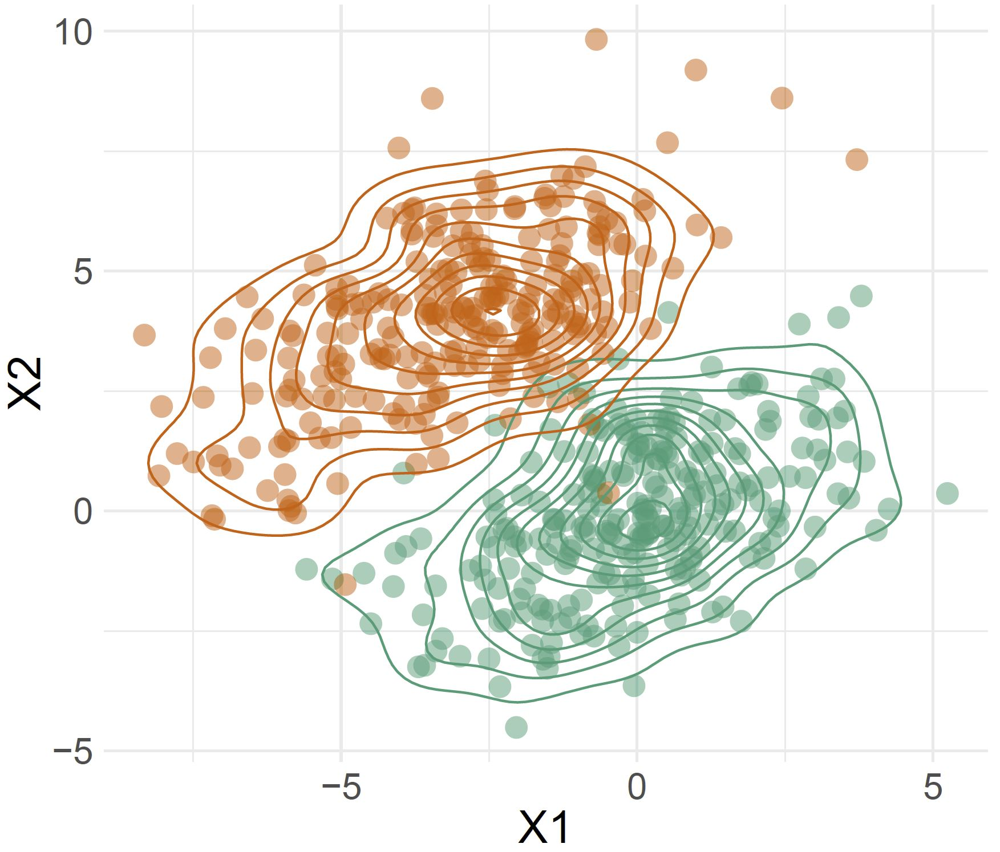
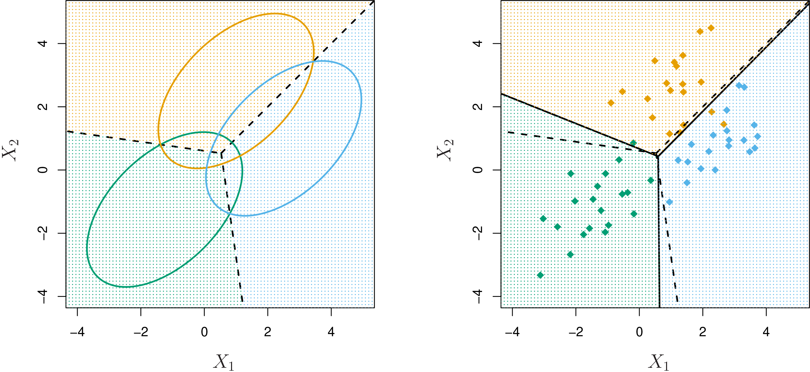
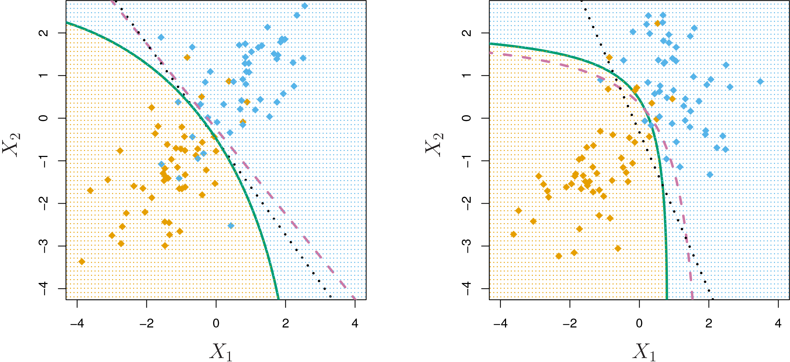

```{r setup, include=FALSE}
library(knitr)
knitr::opts_chunk$set(tidy = FALSE, 
                      message = FALSE,
                      warning = FALSE,
                      echo = FALSE, 
                      fig.align = "center",
                      fig.retina = 4)
options(htmltools.dir.version = FALSE)
library(magick)
```

# Categorical responses

In **classification**, the output $Y$ is a .orange[categorical variable]. For example,

- Loan approval: $Y \in \{\mbox{successful}, \mbox{unsuccessful}\}$ 
- Type of business culture: $Y \in \{\mbox{clan}, \mbox{adhocracy}, \mbox{market}, \mbox{hierarchical}\}$
- Historical document author: $Y \in \{\mbox{Austen}, \mbox{Dickens}, \mbox{Imitator}\}$
- Email: $Y \in \{\mbox{spam}, \mbox{ham}\}$

Map the categories to a numeric variable, or possibly a binary matrix.


---
layout: true
class: shuriken-full white 

.blade1.bg-green[.content.center.vmiddle[
A person arrives at the emergency room with a set of symptoms that could possibly be attributed to one of three medical conditions. Which of the three conditions does the individual have?
]]
.blade2.bg-purple[.content.center.vmiddle[
An online banking service must be able to determine whether or not a transaction being performed on the site is fraudulent, on the basis of the user’s IP address, past transaction history, and so forth.
]]
.blade3.bg-deep-orange[.content.center.vmiddle[
On the basis of DNA sequence data for a number of patients with and without a given disease, a biologist would like to figure out which DNA mutations are deleterious (disease-causing) and which are not.
]]
.blade4.bg-pink[.content.center.vmiddle[
An email comes into the server. Should it be moved into the inbox or the junk mail box, based on header text, sender, origin, time of day, ...?
]]

---

class: hide-blade2 hide-blade3 hide-blade4 hide-hole

---

class: hide-blade3 hide-blade4 hide-hole
count: false

---

class: hide-blade4 hide-hole
count: false

---
class: hide-hole
count: false
---
layout: false

class: split-two
layout: false

.column[.pad50px[

# When linear regression is not appropriate

<br>

Consider the following data `simcredit` which looks at the default status based on credit balance.

 **Question**: Why is a linear model not appropriate for this data?

```{r}
countdown::countdown(minutes=0, seconds=30, left = 0, right = 0, 
                     padding = "1px", margin = "1%",
                     font_size = "1em", 
                     style = "position: relative; width: min-content;")
```

]]
.column[.content.vmiddle.center[


```{r}
library(ISLR)
library(tidyverse)
data(Default)
simcredit <- Default %>% 
  mutate(default_bin = ifelse(default=="Yes", 1, 0))
ggplot(simcredit, aes(x=balance, y=default_bin)) + 
  geom_point() +
  geom_smooth(method="lm", colour = "orange", se = FALSE) + 
  ylab("default") +
  theme_minimal(base_size=18)
```

]]

---
class: split-two

.column[.pad50px[

# Modelling binary responses

<br>

- To model **binary data**, we need to .orange[link] our **predictors** to our response using a *link function*.
- There are many different types of link functions we could use, but we will focus today on the .orange[logistic] link function.

]]
.column[.content.vmiddle.center[
```{r}
ggplot(simcredit, aes(x=balance, y=default_bin)) + 
  geom_point() + 
  geom_smooth(method="lm", se=FALSE) +
  geom_smooth(method="glm", method.args = list(family = "binomial"), colour = "orange", se = FALSE) +
  theme_minimal(base_size=18) +
  ylab("default")
```
]]

---
class: split-two

.column[.pad50px[
# The logistic function

Instead of predicting the outcome directly, we instead predict the probability of being class 1, given the linear combination of predictors, using the .orange[logistic] link function.

$$ p(y=1|\beta_0 + \beta_1 x)  = f(\beta_0 + \beta_1 x) $$
where

$$f(\beta_0 + \beta_1 x) = \frac{e^{\beta_0+\beta_1x}}{1+e^{\beta_0+\beta_1x}}$$

]]
.column[.content.vmiddle.center[
```{r, echo=FALSE, fig.retina=4, warning=F, message=F}
x.vals <- rep(seq(-10,10, by=0.1),2)
fit <- 1/(1+exp(-x.vals))
Link <- c(rep("logistic", length(x.vals)))

library(latex2exp)

data <- data.frame(x=x.vals, y=fit, Link=Link)
ggplot(data, aes(x=x, y=y, color=Link))+geom_line(size=1.4) + xlab(TeX('$\\beta_0 + \\beta_1 x$')) +  ylab(TeX('$p(y=1|\\beta_0 + \\beta_1 x) = f(\\beta_0 + \\beta_1 x)$')) + 
  theme_minimal() +
  theme(text = element_text(size=18))
```

]]


---
class: split-two

.column[.pad50px[

## Logistic function

Transform the function: 

$$~~~~f(x) = \frac{e^{\beta_0+\beta_1x}}{1+e^{\beta_0+\beta_1x}}$$

$\rightarrow  f(x) = \frac{1}{1/e^{\beta_0+\beta_1x}+1}$

$\rightarrow  1/f(x) = 1/e^{\beta_0+\beta_1x}+1$

$\rightarrow 1/f(x) - 1 = 1/e^{\beta_0+\beta_1x}$

$\rightarrow  \frac{1}{1/f(x) - 1} = e^{\beta_0+\beta_1x}$

$\rightarrow ~~ ...$
]]
.column[.pad50px[

$\rightarrow ~~ ...$

$\rightarrow \frac{f(x)}{1 - f(x)} = e^{\beta_0+\beta_1x}$

$\rightarrow \log_e\frac{f(x)}{1 - f(x)} = \beta_0+\beta_1x$

<br>
<br>


The left-hand side $\log_e\frac{f(x)}{1 - f(x)}$ is called the .orange[log-odds ratio] or logit.

```{r}
library(anicon)
faa("dice", animate="bounce", color="orange", size="lg", speed="slow")
```

]]
---
## The logistic regression model 

The fitted model, where $P(Y=0|X) = 1 - P(Y=1|X)$, is then written as:

.tip[
$\log_e\frac{P(Y=1|X)}{1 - P(Y=1|X)} = \beta_0+\beta_1X$
]

<details>
*Multiple categories*: 
  This formula can be extended to more than binary response variables. Writing the equation is not simple, but follows from   the above, extending it to provide probabilities for each level/category. The sum of all  probabilities is 1.
</details>
---
## Interpretation

- .green[**Linear regression**]	
    - $\beta_1$ gives the average change in $Y$ associated with a one-unit increase in $X$
- .green[**Logistic regression**]
    - Increasing $X$ by one unit changes the log odds by $\beta_1$, or equivalently it multiplies the odds by $e^{\beta_1}$
    - However, because the model is not linear in $X$, $\beta_1$ does not correspond to the change in response associated with a one-unit increase in $X$
    
---
## Maximum Likelihood Estimation

Given the logistic $p(x_i) = \frac{1}{e^{-(\beta_0+\beta_1x_i)}+1}$

We choose parameters $\beta_0, \beta_1$ to maximize the likelihood of the data given the model. The likelihood function is

$$\mathcal{l}_n(\beta_0, \beta_1) = \prod_{y_i=1,i}^n p(x_i)\prod_{y_i=0,i}^n (1-p(x_i)).$$

It is more convenient to maximize the *log-likelihood*:

$$\text{max}_{\beta_0, \beta_1} ~ \log  l_n(\beta_0, \beta_1) = \text{max}_{\beta_0, \beta_1}  - \sum_{i = 1}^n \log\big(1 + e^{-(\beta_0+\beta_1x_i)} \big)$$

---
## Making predictions 

With estimates from the model fit, $\hat{\beta_0}, \hat{\beta_1}$, we can predict the **probability of belonging to class 1** using:


$$p(y=1|\hat{\beta_0} + \hat{\beta_1} x) = \frac{e^{\hat{\beta_0}+ \hat{\beta_1}x}}{1+e^{\hat{\beta_0}+ \hat{\beta_1}x}}$$

This probability can be rounded to 0 or 1 for class prediction.

In `R`, we simply use the `predict()` function.


---
class: center

### Of course, probabilities close to 0.5 are hard to classify!

<br>


.font_tiny[Source: Statistical Statistics Memes]

---
class: split-40

.column[.pad50px[

## Fitting credit data in R `r icon::fa("credit-card", size=1)`

<br>

 We use the `glm` function in R to fit a logistic regression model. The `glm` function can support many response types, so we specify `family="binomial"` to let R know that our response is *binary*.
]]
.column[.content.vmiddle[

```{r echo=TRUE}
library(broom)
fit <- glm(default~balance,  #<<
           data=simcredit, family="binomial") #<<
tidy(fit)
```

]]


---

class: split-40

.column[.pad50px[

# Fitting credit data in R `r icon::fa("credit-card", size=1)`

<br>

We can use the `predict()` function to predict the probability of default, given credit balance. We then round these probabilities to predict default status.

]]
.column[.content.vmiddle[

```{r echo=TRUE}
probs <- predict(fit, simcredit ,type="response") #<<
head(probs, 4) 
head(round(probs), 4) 
```

]]

---

class: middle center purple

`r anicon::faa('exclamation-triangle', animate='flash', size=7)`

# .purple[A warning for using GLMs!]

---
class: split-40

.column[.pad50px[

# When logistic regression fails

<br>

Consider the case when the data is *perfectly* separated. 

Here, we can see that all balances above $1500 default.
]]
.column[.content.vmiddle[

```{r echo=FALSE, warning = FALSE}
simcredit <- simcredit %>% 
  mutate(default_new = case_when(balance <= 1500 ~ 0,
                                 balance > 1500 ~ 1))

ggplot(simcredit, aes(x=balance, y=default_new)) + 
  geom_point() +
  geom_vline(xintercept = 1500, col = "orange", size = 1.1, linetype = "dashed") +
  theme_minimal(base_size=18)
```

]]

---

class: split-40

.column[.pad50px[

## When logistic regression fails

<br>

If we fit a `glm` model to this data, the MLE fit will try and fit a step-wise function to this graph, pushing coefficients sizes towards infinity and produce large standard errors. R will warn us that the algorithm does not converge.
]]
.column[.content.vmiddle[

```{r echo=TRUE, warning = TRUE, eval = FALSE}
fit <- glm(default_new~balance, 
           data=simcredit, family="binomial")
tidy(fit)
```

```{r, eval = FALSE, echo = TRUE}
# A tibble: 2 x 5
  term        estimate std.error statistic p.value
  <chr>          <dbl>     <dbl>     <dbl>   <dbl>
1 (Intercept)   -41692.    57581.   -0.724   0.469 #<<
2 balance         27.8      38.4     0.724   0.469 #<<
```
]]

---

class: center 

## Take home message - take note of R warnings


.font_tiny[Source: R Memes for Statistical Fiends]

---
## Linear Discriminant Analysis

Logistic regression involves directly modeling $P(Y = k|X = x)$ using the logistic function. Rounding the probabilities produces class predictions, in two class problems; selecting the class with the highest probability produces class predictions in multi-class problems.

Another approach for building a classification model is .orange[linear discriminant analysis]. This involves directly estimating the .orange[distribution of the predictors], separately for each class.

---

class: center

## Compare the pair

<div style="line-height:80%;">
    <br>
</div>

| .green[Logistic Regression]     | <span style="color:#3F9F7A"> Linear Discriminant Analysis  </span>   | 
| :-------------------: |:-------------------:| 
| **Goal** - directly estimate $P(Y \lvert X)$ (*the dashed line*)     | **Goal** - estimate $P(X \lvert Y)$ (*the contours*) to then deduce $P(Y \lvert X)$  | 
| **Assumptions** - no assumptions on predictor space      | **Assumptions** - predictors are normally distributed      |   
|  |       |   


---

class: center

## Assumptions are critical in LDA


.font_tiny[Source: Statistical Statistics Memes]

---

## Bayes Theorem

Let $f_k(x)$ be the density function for predictor $x$ for class $k$. If $f$ is small, the probability that $x$ belongs to class $k$ is small, and conversely if $f$ is large.

Bayes theorem (for $K$ classes) states:

.tip[

$$P(Y = k|X = x) = p_k(x) = \frac{\pi_kf_k(x)}{\sum_{i=1}^K \pi_kf_k(x)}$$
]

where $\pi_k = P(Y = k)$ is the prior probability that the observation comes from class $k$. 


---
## LDA with $p=1$ predictors

```{r out.width=800, fig.height=4}
library(ggpubr)

set.seed("15032019")
n <- 244; n1 <- 55
x <- c(rnorm(n1, -1), rnorm(n-n1, 1))
y <- c(rep(0, n1), rep(1, n-n1))
df <- tibble(x, y)

x <- seq(-4, 4, 0.1)
dx <- c(dnorm(x, -1), dnorm(x, 1))
y <- factor(c(rep(0, length(x)), rep(1, length(x))))
df_pop <- tibble(x=c(x,x), dx, y)
df_means <- df %>% group_by(y) %>% 
  summarise(x=mean(x)) %>%
  bind_rows(c(y=1, x=mean(x)))
p1 <- ggplot() + 
  geom_rug(data=df, aes(x=x, y=0, colour=factor(y)), alpha=0.7) +
  geom_line(data=df_pop, aes(x=x, y=dx, colour=y)) + 
  scale_color_brewer("", palette="Dark2") +
  geom_vline(xintercept=0, colour="grey40", linetype=2) +
  xlab("density") + ggtitle("Population")
p2 <- ggplot(df, aes(x=x, fill=factor(y))) + 
        geom_histogram(binwidth=0.67, alpha=0.8) + 
  scale_fill_brewer("", palette="Dark2") +
  scale_colour_brewer("", palette="Dark2") +
  facet_wrap(~y, ncol=1, scales="free_y") + 
  geom_vline(data=df_means, aes(xintercept=x, 
                                colour=factor(y)), linetype=2) +
  geom_vline(xintercept=df_means$x[3], colour="grey40", linetype=2) +
  ggtitle("Data")
ggarrange(p1, p2, ncol=2, common.legend = TRUE)
```


---
## LDA with $p=1$ predictors

We assume $f_k(x)$ is univariate .orange[Normal] (Gaussian):

$$f_k(x) = \frac{1}{\sqrt{2 \pi} \sigma_k} \text{exp}~ \left( - \frac{1}{2 \sigma^2_k} (x - \mu_k)^2 \right)$$

where $\mu_k$ and $\sigma^2_k$ are the mean and variance parameters for the $k$th class. Further assume that $\sigma_1^2 = \sigma_2^2 = \dots = \sigma_K^2$; then the conditional probabilities are 

$$p_k(x) = \frac{\pi_k \frac{1}{\sqrt{2 \pi} \sigma} \text{exp}~ \left( - \frac{1}{2 \sigma^2} (x - \mu_k)^2 \right) }{ \sum_{l = 1}^K \pi_l \frac{1}{\sqrt{2 \pi} \sigma} \text{exp}~ \left( - \frac{1}{2 \sigma^2} (x - \mu_l)^2 \right) }$$


---
## LDA with $p=1$ predictors

The Bayes classifier is assign new observation $X=x_0$ to the class with the highest $p_k(x_0)$. A simplification of $p_k(x_0)$ yields the .orange[discriminant functions]: 

$$\delta_k(x_0) = x_0 \frac{\mu_k}{\sigma^2} - \frac{\mu_k^2}{2 \sigma^2} + log(\pi_k)$$
and the rule Bayes classifier will assign $x_0$ to the class with the largest value. 


---
## LDA with $p=1$ predictors

If $K = 2$ and $\pi_1 = \pi_2$, we assign $x_0$ to class if

$$\delta_1(x_0) > \delta_2(x_0)$$

$$x_0 \frac{\mu_1}{\sigma^2} - \frac{\mu_1^2}{2 \sigma^2} + \log(\pi) > x_0 \frac{\mu_2}{\sigma^2} - \frac{\mu_2^2}{2 \sigma^2} + \log(\pi) $$

which simplifies to  $x_0 > \frac{\mu_1+\mu_2}{2}$.

.tip[
This is estimated on the data with 
$x_0 > \frac{\bar{x}_1 + \bar{x}_2}{2}$.
]


---
## Multivariate LDA

To indicate that a p-dimensional random variable X has a multivariate Gaussian distribution with $E[X] = \mu$ and $\text{Cov}(X) = \Sigma$, we write $X \sim N(\mu, \Sigma)$.

The multivariate normal density function is:

$$f(x) = \frac{1}{(2\pi)^{p/2}|\Sigma|^{1/2}} \exp\{-\frac{1}{2}(x-\mu)'\Sigma^{-1}(x-\mu)\}$$

with $x, \mu$ are $p$-dimensional vectors, $\Sigma$ is a $p\times p$ variance-covariance matrix. 

---
## Multivariate LDA

The discriminant functions are:

$$\delta_k(x) = x'\Sigma^{-1}\mu_k - \frac{1}{2}\mu_k'\Sigma^{-1}\mu_k + \pi_k$$

and Bayes classifier is .orange[assign a new observation] $x_0$ .orange[to the class with the highest] $\delta_k(x_0)$.

When $K=2$ and $\pi_1=\pi_2$ this reduces to 

Assign observation $x_0$ to class 1 if 

$$x_0'\Sigma^{-1}(\mu_1-\mu_2) > \frac{1}{2}(\mu_1+\mu_2)'\Sigma^{-1}(\mu_1-\mu_2)$$


---
## Multivariate LDA

.orange[Discriminant space]: a benefit of LDA is that it provides a low-dimensional projection of the $p$-dimensional space, where the groups are the most separated. For $K=2$, this is

$$\Sigma^{-1}(\mu_1-\mu_2)$$

For $K>2$, the discriminant space is found be taking an eigen-decomposition of $\Sigma^{-1}\Sigma_B$, where

$$\Sigma_B = \frac{1}{K}\sum_{i=1}^{K} (\mu_i-\mu)(\mu_i-\mu)'$$


---
## Multivariate LDA


The dashed lines are the Bayes decision boundaries. Ellipses
that contain 95% of the probability for each of the three classes are shown. Solid line corresponds to the class boundaries from the LDA model fit to the sample.

<a href="http://www-bcf.usc.edu/~gareth/ISL/Chapter4/4.6.pdf" target="_BLANK">  </a>

.font_tiny[(Chapter4/4.6.pdf)]

```{r eval=FALSE}
library(MASS)
library(caret)
choc <- read_csv("data/chocolates.csv")
tr_indx <- createDataPartition(choc$Type, p=0.67)$Resample1
choc_tr <- choc[tr_indx, -c(1:3)]
choc_ts <- choc[-tr_indx, -c(1:3)]
choc_lda <- lda(Type~., data=choc_tr, prior=c(0.5, 0.5))
choc_tr_pred <- predict(choc_lda, choc_tr)
choc_ts_pred <- predict(choc_lda, choc_ts)
choc_tr <- choc_tr %>% bind_cols(ld1=choc_tr_pred$x, pType=choc_tr_pred$class, set=rep("train", length(tr_indx)))
choc_ts <- choc_ts %>% bind_cols(ld1=choc_ts_pred$x, pType=choc_ts_pred$class, set=rep("test", nrow(choc)-length(tr_indx)))
choc_fit <- bind_rows(choc_tr, choc_ts)                              
ggplot(choc_fit, aes(x=ld1, fill=Type)) + geom_histogram(binwidth=0.5) + 
  facet_grid(set~Type)
# Compute means
choc_mean_pred <- predict(choc_lda, data.frame(choc_lda$means))$x
ggplot(choc_fit, aes(x=ld1, fill=Type)) + geom_histogram(binwidth=0.5) + 
  facet_grid(set~Type) + 
  geom_vline(xintercept=sum(choc_mean_pred)/2, linetype=2)
# Training error
table(choc_tr$Type, choc_tr$pType)
# Test error
table(choc_ts$Type, choc_ts$pType)
```


---
## Quadratic DA (QDA)
A quadratic boundary is obtained by relaxing the assumption of equal variance-covariance, and assume that $\Sigma_k \neq \Sigma_l, ~~k\neq l, k,l=1,...,K$


<a href="http://www-bcf.usc.edu/~gareth/ISL/Chapter4/4.9.pdf" target="_BLANK">  </a>

.font_tiny[(Chapter4/4.9.pdf)]


---
layout: false
# `r set.seed(2023); emo::ji("technologist")` Made by a human with a computer

### Slides at [https://iml.numbat.space](https://iml.numbat.space).
### Code and data at [https://github.com/dicook/Business_Analytics](https://github.com/dicook/Business_Analytics).
<br>

### Created using [R Markdown](https://rmarkdown.rstudio.com) with flair by [**xaringan**](https://github.com/yihui/xaringan), and [**kunoichi** (female ninja) style](https://github.com/emitanaka/ninja-theme).

<br> 
<a rel="license" href="http://creativecommons.org/licenses/by-sa/4.0/"></a><br />This work is licensed under a <a rel="license" href="http://creativecommons.org/licenses/by-sa/4.0/">Creative Commons Attribution-ShareAlike 4.0 International License</a>.
