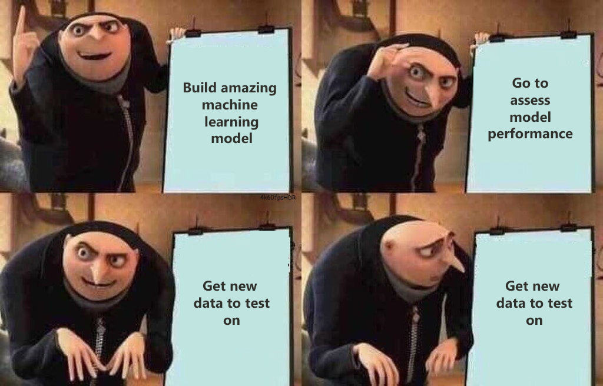
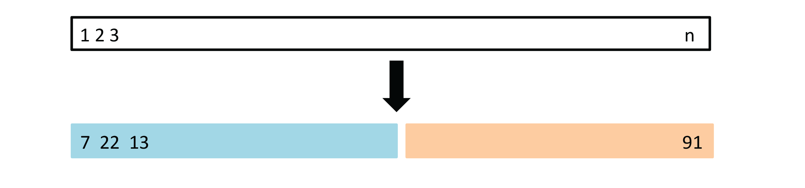
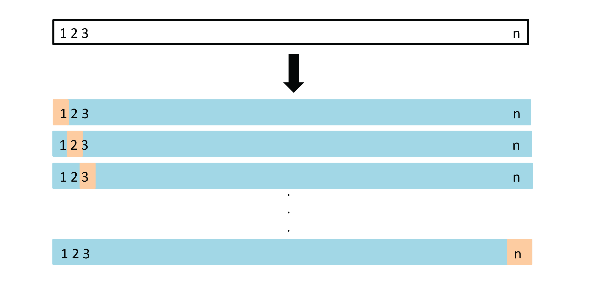
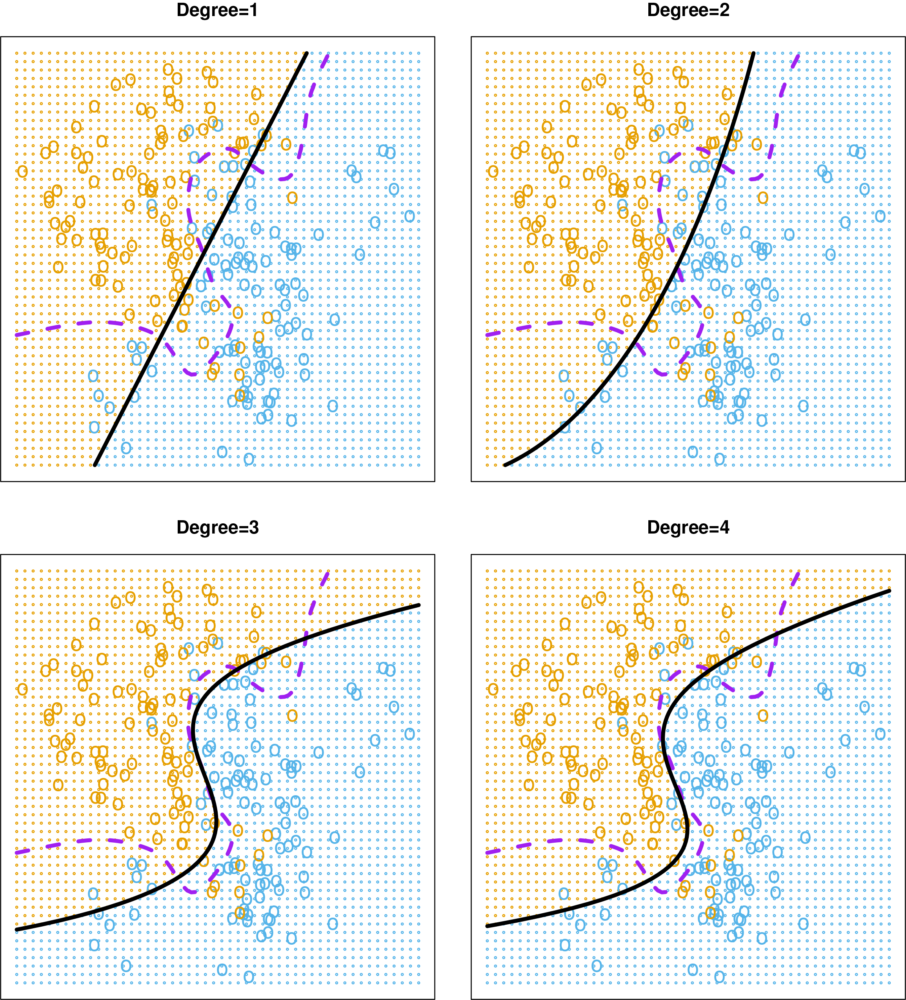
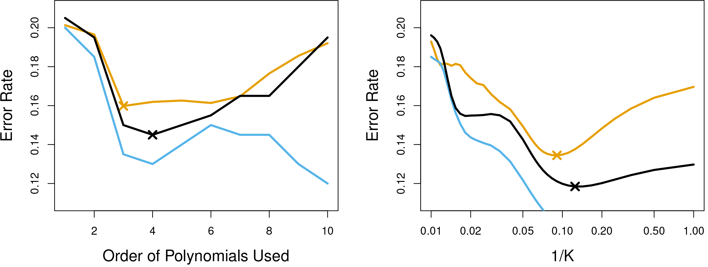
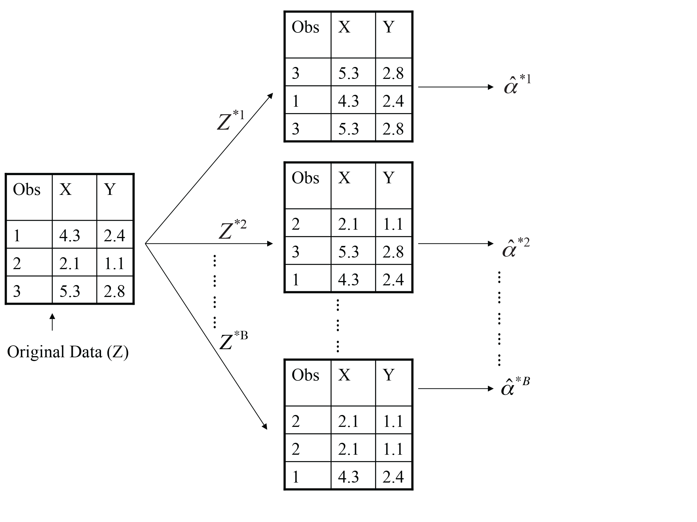

```{r setup, include=FALSE}
library(knitr)
knitr::opts_chunk$set(tidy = FALSE, 
                      message = FALSE,
                      warning = FALSE,
                      echo = FALSE, 
                      fig.width=8,
                      fig.height=6,
                      fig.align = "center",
                      fig.retina = 2)
options(htmltools.dir.version = FALSE)
```

## Model assessment 

<br>

<center>
 </a>
</center>

---


## Validating models


<a href="http://www-bcf.usc.edu/~gareth/ISL/Chapter5/5.1.pdf" target="_BLANK">  </a>

A set of $n$ observations are randomly split into a training set (blue, containing observations 7, 22, 13, ...) and a validation set (yellow, all other observations not in training set).

Drawback: Only one split of data made, may not adequately estimate test error. 

.font_tiny[(Chapter5/5.1.pdf)]


---
class: split-two

.column[.pad50px[


## Validating models

<br>

Want to choose best degree of polynomial, for $\mbox{mpg}=\beta_0+\beta_1f(\mbox{horsepower})+\varepsilon$

```{r}
# The Validation Set Approach
library(ISLR)
library(broom)
library(modelr)
library(tidyverse)
set.seed(1111)
train <- sample(392,196)
head(sort(train), 15)
fit1 <- glm(mpg~horsepower, data=Auto, subset=train)
fit2 <- glm(mpg~poly(horsepower, 2), data=Auto, subset=train)
fit3 <- glm(mpg~poly(horsepower, 3), data=Auto, subset=train)
fit4 <- glm(mpg~poly(horsepower, 4), data=Auto, subset=train)
testerr <- tibble(x=1:4, 
                  mse=c(mse(fit1, Auto[-train,]),
                        mse(fit2, Auto[-train,]),
                        mse(fit3, Auto[-train,]),
                        mse(fit4, Auto[-train,])))
```

Remember: $$MSE=\frac1n \sum_{i=1}^n (y_i-\hat{y}_i)^2$$
]]

.column[.content.vmiddle.center[

```{r}
ggplot(testerr, aes(x=x, y=mse)) +
  geom_line(size = 1.2) +
  ylim(c(15, 30)) +
  xlab("degree") + ggtitle("Test error: Draw 1") +
  theme_minimal() +
  theme(text = element_text(size=20)) 
  
```


]]

---

class: split-two

.column[.pad50px[


## Validating models

<br>

Want to choose best degree of polynomial, for $\mbox{mpg}=\beta_0+\beta_1f(\mbox{horsepower})+\varepsilon$

```{r}
# Different split - run 1
train <- sample(392,196)
head(sort(train), 15)
fit1 <- glm(mpg~horsepower, data=Auto, subset=train)
fit2 <- glm(mpg~poly(horsepower, 2), data=Auto, subset=train)
fit3 <- glm(mpg~poly(horsepower, 3), data=Auto, subset=train)
fit4 <- glm(mpg~poly(horsepower, 4), data=Auto, subset=train)
testerr <- tibble(x=1:4, 
                  mse=c(mse(fit1, Auto[-train,]),
                        mse(fit2, Auto[-train,]),
                        mse(fit3, Auto[-train,]),
                        mse(fit4, Auto[-train,])))
```

]]

.column[.content.vmiddle.center[

```{r}
ggplot(testerr, aes(x=x, y=mse)) +
  geom_line(size = 1.2) +
  ylim(c(15, 30)) +
  xlab("degree") + ggtitle("Test error: Draw 2")+
  theme_minimal() +
  theme(text = element_text(size=20)) 
```

]]

---
class: split-two

.column[.pad50px[


## Validating models

<br>


Want to choose best degree of polynomial, for $\mbox{mpg}=\beta_0+\beta_1f(\mbox{horsepower})+\varepsilon$

```{r}
# Different split - run 2
train <- sample(392,196)
head(sort(train), 15)
fit1 <- glm(mpg~horsepower, data=Auto, subset=train)
fit2 <- glm(mpg~poly(horsepower, 2), data=Auto, subset=train)
fit3 <- glm(mpg~poly(horsepower, 3), data=Auto, subset=train)
fit4 <- glm(mpg~poly(horsepower, 4), data=Auto, subset=train)
testerr <- tibble(x=1:4, 
                  mse=c(mse(fit1, Auto[-train,]),
                        mse(fit2, Auto[-train,]),
                        mse(fit3, Auto[-train,]),
                        mse(fit4, Auto[-train,])))
```

]]

.column[.content.vmiddle.center[

```{r}
ggplot(testerr, aes(x=x, y=mse)) +
  geom_line(size = 1.2) +
  ylim(c(15, 30)) +
  xlab("degree") + ggtitle("Test error: Draw 3")+
  theme_minimal() +
  theme(text = element_text(size=20)) 
```

]]

---

class: split-two

.column[.pad50px[

## Validating models

<br>


Want to choose best degree of polynomial, for $\mbox{mpg}=\beta_0+\beta_1f(\mbox{horsepower})+\varepsilon$

```{r}
# Different split - run 3
train <- sample(392,196)
head(sort(train), 15)
fit1 <- glm(mpg~horsepower, data=Auto, subset=train)
fit2 <- glm(mpg~poly(horsepower, 2), data=Auto, subset=train)
fit3 <- glm(mpg~poly(horsepower, 3), data=Auto, subset=train)
fit4 <- glm(mpg~poly(horsepower, 4), data=Auto, subset=train)
testerr <- tibble(x=1:4, 
                  mse=c(mse(fit1, Auto[-train,]),
                        mse(fit2, Auto[-train,]),
                        mse(fit3, Auto[-train,]),
                        mse(fit4, Auto[-train,])))
```

]]

.column[.content.vmiddle.center[

```{r}
ggplot(testerr, aes(x=x, y=mse)) +
  geom_line(size = 1.2) +
  ylim(c(15, 30)) +
  xlab("degree") + ggtitle("Test error: Draw 4") +
  theme_minimal() +
  theme(text = element_text(size=20)) 
```

]]

---
class: middle

```{r}
library(anicon)
faa("dice", animate="bounce", color="orange", size="lg", speed="slow")
```

The .orange[variability] between different draws of test sets can be .orange[large]. This can provide poor choice of model, or misleading estimate of error.

---
## LOOCV

Leave-one-out (LOOCV) cross-validation: $n$ validation sets, each with .orange[ONE] observation left out.


<a href="http://www-bcf.usc.edu/~gareth/ISL/Chapter5/5.3.pdf" target="_BLANK">  </a>


---
## LOOCV


Leave-one-out (LOOCV) cross-validation: $n$ validation sets, each with .orange[ONE] observation left out. For each set, $i=1, ..., n$, compute the $MSE_{i}$.

The LOOCV estimate for the test MSE is the average of these $n$ test error estimates:

$$CV_{(n)} = \frac{1}{n}\sum_{i=1}^n MSE_{i}$$


---
## LOOCV

There is a computational shortcut, for linear or polynomial models, where not all $n$ models need to be fitted. 

$$CV_{(n)} = \frac{1}{n}\sum_{i=1}^n \frac{(y_i-\hat{y})^2}{1-h_i}$$

where $h_i=\frac{1}{n}+\frac{(x_i-\bar{x})^2}{\sum_{i'}^n(x_{i'}-\bar{x})^2}$ (known as *leverage* from regression diagnostics).

---
class: split-two

.column[.pad50px[

Let's take a look at how this works

```{r echo=TRUE}
# This has the cv.glm function
library(boot) 
glm.fit <- glm(mpg ~ horsepower, 
               data=Auto)
# MSE on all observations
mse(glm.fit, Auto) 
# LOOCV by default
cv.glm(Auto, glm.fit)$delta[1] 
```

Compare with manual calculation
]]

.column[.pad50px[

```{r echo=TRUE}
# Drop one observation our for fitting
m <- NULL
for (i in 1:nrow(Auto)) {
  fit <- glm(mpg ~ horsepower, 
             data=Auto[-i,])
  m <- c(m, 
         (Auto[i,]$mpg - 
            predict(fit, Auto[i,]))^2) 
}
head(m, 3)
mean(m)
```

`r set.seed(2021); emo::ji("thumb")`
]]

---
## k-fold cross validation


1. Divide the data set into k different parts.
2. Remove one part, fit the model on the remaining $k − 1$ parts, and compute the MSE on the omitted part.
3. Repeat $k$ times taking out a different part each time


<a href="http://www-bcf.usc.edu/~gareth/ISL/Chapter5/5.5.pdf" target="_BLANK">  </a>

.font_tiny[(Chapter 5/ 5.5)]


---
## k-fold cross validation

1. Divide the data set into k different parts.
2. Remove one part, fit the model on the remaining $k − 1$ parts, and compute the MSE on the omitted part.
3. Repeat $k$ times taking out a different part each time

$$CV_{(k)} = \frac{1}{k}\sum_{i=1}^n MSE_k$$
- LOOCV is a special case of $k$-fold cross-validation.
- Bias-variance trade-off: 
    - one validation set overestimates test error, LOOCV approximately unbiased estimates, $k$-fold CV intermediate
    - LOOCV has higher variance than does $k$-fold CV
    - choice of $k=5$ or $10$ is a compromise

---

```{r echo=TRUE}
glm.fit <- glm(mpg ~ horsepower, 
               data=Auto)
# MSE on all observations
mse(glm.fit, Auto) 
# LOOCV by default
cv.glm(Auto, glm.fit)$delta[1] 
# 5-fold CV
cv.glm(Auto, glm.fit, K=5)$delta[1] 
```

---
## Classification

<center>

<a href="http://www-bcf.usc.edu/~gareth/ISL/Chapter5/5.7.pdf" target="_BLANK">  </a>

</center>


.font_tiny[(Chapter 5/ 5.7)]

---
## Classification


<a href="http://www-bcf.usc.edu/~gareth/ISL/Chapter5/5.8.pdf" target="_BLANK">  </a>

Black line is .black[10-fold CV]; .blue[training] and TRUE .orange[test] error for different choices of polynomial (left) and KNN classifier (right). 


.font_tiny[(Chapter 5/ 5.8)]
---

layout: false

## Bootstrap procedure

- Draw $B$ independent bootstrap samples $X^{*(1)}, \dots, X^{*(B)}$ from $\hat P$:
$$X_1^{*(b)}, \dots, X_n^{*(b)} \sim \hat P \quad b = 1, \dots, B.$$ 	
- Evaluate the bootstrap replications:
$$\hat \theta^{*(b)} = s(X^{*(b)}) \quad b = 1, \dots, B.$$	
- Estimate the quantity of interest from the distribution of the $\hat \theta^{*(b)}$

---

<a href="http://www-bcf.usc.edu/~gareth/ISL/Chapter5/5.11.pdf" target="_BLANK">  </a>

.font_tiny[(Chapter 5/ 5.11)]

---
## Bootstrap samples

```{r fig.height=3, out.width="100%"}
library(gridExtra)
p1 <- ggplot(Auto, aes(x=horsepower, y=mpg)) + geom_point(alpha=0.3) + ggtitle("Full data") + ylim(c(5,50))
p2 <- Auto %>%
  sample_n(size = n(), replace = TRUE) %>% ggplot(aes(x=horsepower, y=mpg)) + geom_point(alpha=0.3) + ggtitle("Bootstrap sample 1") + ylim(c(5,50))
p3 <- Auto %>%
  sample_n(size = n(), replace = TRUE) %>% ggplot(aes(x=horsepower, y=mpg)) + geom_point(alpha=0.3) + ggtitle("Bootstrap sample 2") + ylim(c(5,50))
grid.arrange(p1, p2, p3, ncol=3)
```

---

## Example - bootstrap model


- Fit the model on a set of bootstrap samples, and keep track of how well it predicts the original dataset
$$\text{Err}_{\text{boot}} = \frac1B \frac1n \sum_{b = 1}^B \sum_{i = 1}^n L(y_i, \hat f^{*b}(x_i))$$ 
- Each of these bootstrap data sets is created by sampling with replacement, and is the same size as our original dataset. As a result .orange[some observations may appear more than once in a given bootstrap data set and some not at all.]

---
class: split-two

.column[.pad50px[

```{r echo=TRUE}
glm.fit <- glm(mpg ~ horsepower, 
               data=Auto)
# MSE on all observations
mse(glm.fit, Auto) 
# LOOCV by default
cv.glm(Auto, glm.fit)$delta[1] 
# 5-fold CV
cv.glm(Auto, glm.fit, K=5)$delta[1] 
```
]]

.column[.pad50px[

```{r echo=TRUE}
mse.fn <- function(d, index) {
  glm.fit <- glm(mpg ~ horsepower, 
               data=d[index,])
  # MSE on all observations
  return(m = mse(glm.fit, 
                 d[-unique(index),]) )
}
m <- NULL
for (i in 1:1000) {
  idx <- sample(nrow(Auto), 
                replace = TRUE)
  m <- c(m, mse.fn(Auto, idx))
}
mean(m)
```
]]

---
class: split-two

.column[.pad50px[

## Bootstrap for error on a statistic

Overall median is `r median(Auto$mpg)`

```{r echo=TRUE}
# Bootstrap median, and standard error
med.fn <- function(d, index) {
  med <- median(d$mpg[index])
  med
}
bmed <- boot(Auto, med.fn, R=1000)
```

]]

.column[.pad50px[

```{r echo=TRUE}
bmed
```

```{r}
# For constructing a confidence interval
# boot.ci(bmed, conf=0.95)
```

]]
---
## Uses and variants of the bootstrap

- Common uses:
    - Computing standard errors for complex statistics
    - Prediction error estimation
    - Bagging (Bootstrap aggregating) ML models
- Types of bootstrap based on different assumptions:
    - block bootstrap
    - sieve bootstrap
    - smooth bootstrap
    - residual bootstrap
    - wild bootstrap


---
layout: false
# `r set.seed(2022); emo::ji("technologist")` Made by a human with a computer

### Slides at [https://iml.numbat.space](https://iml.numbat.space).
### Code and data at [https://github.com/numbats/iml](https://github.com/numbats/iml).
<br>

### Created using [R Markdown](https://rmarkdown.rstudio.com) with flair by [**xaringan**](https://github.com/yihui/xaringan), and [**kunoichi** (female ninja) style](https://github.com/emitanaka/ninja-theme).

<br> 
<a rel="license" href="http://creativecommons.org/licenses/by-sa/4.0/"></a><br />This work is licensed under a <a rel="license" href="http://creativecommons.org/licenses/by-sa/4.0/">Creative Commons Attribution-ShareAlike 4.0 International License</a>.
