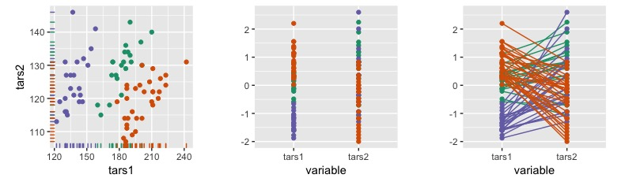
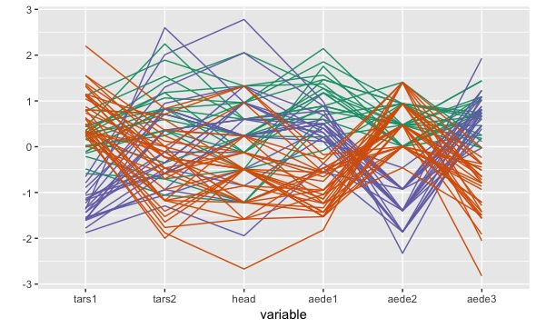
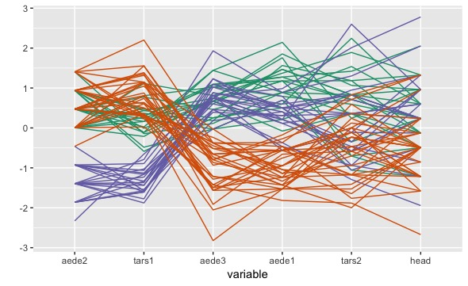
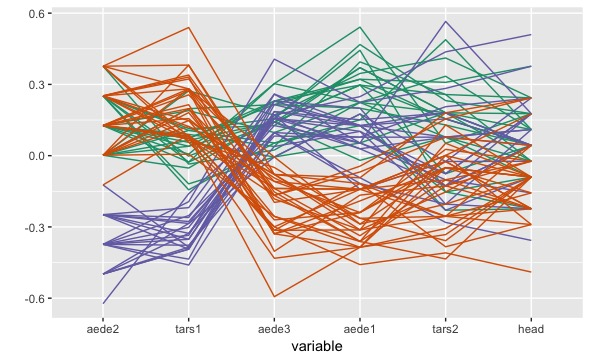
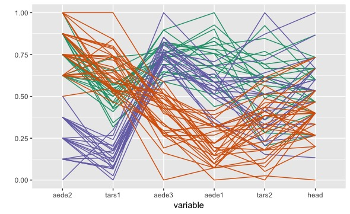
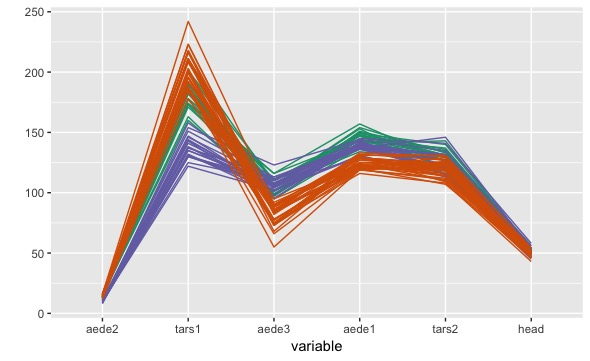
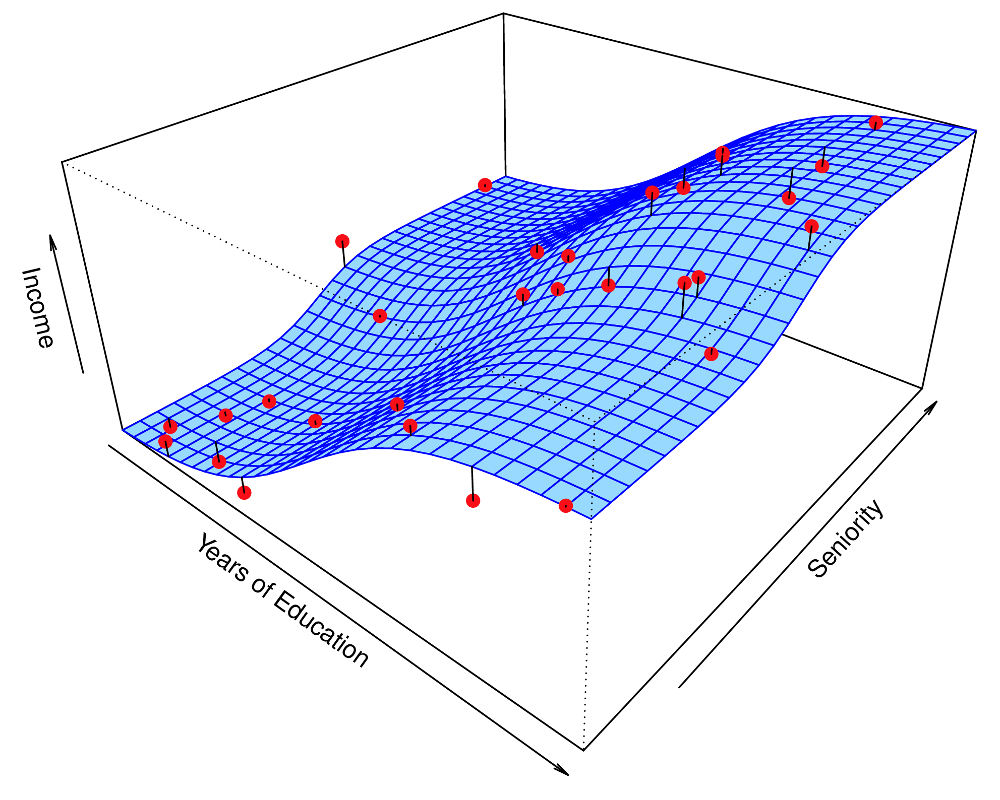

```{r setup, include=FALSE}
library(knitr)
knitr::opts_chunk$set(tidy = FALSE, 
                      message = FALSE,
                      warning = FALSE,
                      echo = FALSE, 
                      fig.width=8,
                      fig.height=6,
                      fig.align = "center",
                      fig.retina = 4)
options(htmltools.dir.version = FALSE)
library(magick)
```

## Parallel coordinate plots

.green[Parallel coordinate plots show the data using parallel axes]

- Scatterplots use orthogonal axes, and are thus limited to two variables on the page.
- Turning the axes parallel allows for many more variables to be displayed together.
- Lines connecting the points show associations between variables.

```{r eval=FALSE, out.width="100%", fig.width=10, fig.height=4, fig.align="center"}
library(tidyverse)
library(GGally)
library(tourr)
library(gridExtra)
p1 <- ggplot(flea, aes(x=tars1, y=tars2, colour=species)) + geom_rug() +
  geom_point() + scale_colour_brewer(palette="Dark2") + 
  theme(aspect.ratio=1, legend.position="none")
p2 <- ggparcoord(flea, columns=1:2, groupColumn = 7, 
           showPoints=TRUE, alphaLines = 0) +
  scale_colour_brewer(palette="Dark2") + ylab("") +
  theme(aspect.ratio=1, legend.position="none")
p3 <- ggparcoord(flea, columns=1:2, groupColumn = 7, showPoints=TRUE) +
  scale_colour_brewer(palette="Dark2") + ylab("") +
  theme(aspect.ratio=1, legend.position="none")
grid.arrange(p1, p2, p3, ncol=3)
```




---
## Comparison with tours

Compare the tour of the flea data, with three clusters:

<iframe src="flea6d.html" width="800" height="500" scrolling="yes" seamless="seamless" frameBorder="0"> </iframe>


---
## Comparison with tours

With the parallel coordinate plot:

```{r eval=FALSE, out.width="100%"}
ggparcoord(flea, columns=1:6, groupColumn = 7) +
  scale_colour_brewer(palette="Dark2") + ylab("") +
  theme(legend.position="none")
```



Note: the trend in lines, that there seem to be three patterns of lines.


---
## How to read parallel coordinate plots

- A set of points in $p$-dimensional space map to a set of lines in $p$ parallel axes
- The pattern among and between the lines indicate structure in high-dimensions
    - Groups of lines trending together indicate clustering
    - Single lines trending differently to other indicate outliers
    - Between pairs of axes intersecting lines indicate strong negative association, and parallel lines indicate strong positive association
    
.green[.center[Points in Euclidean space $\equiv$ lines in parallel coordinates
]]


---
## Parallel coordinate plots - controls

Details that need to be controlled:

- .orange[Order of axes] can affect perception of structure. Placing axes next to each other emphasizes that association
- Variables need to be on a similar scale, and may need to be .orange[standardised]


---

class: split-two

.column[.pad50px[


## Parallel coordinate plots - controls

<br>

Unordered, default standardised scale.


]]

.column[.content.vmiddle.center[


```{r eval=FALSE, out.width="100%", fig.width=10, fig.height=4, fig.align="center"}
ggparcoord(flea, columns=1:6, groupColumn = 7) +
  scale_colour_brewer(palette="Dark2") + ylab("") +
  theme(legend.position="none")
ggparcoord(flea, columns=1:6, groupColumn = 7, order="anyClass") +
  scale_colour_brewer(palette="Dark2") + ylab("") +
  theme(legend.position="none")
ggparcoord(flea, columns=1:6, groupColumn = 7, order="anyClass", scale="center") +
  scale_colour_brewer(palette="Dark2") + ylab("") +
  theme(legend.position="none")
ggparcoord(flea, columns=1:6, groupColumn = 7, order="anyClass", scale="uniminmax") +
  scale_colour_brewer(palette="Dark2") + ylab("") +
  theme(legend.position="none")
ggparcoord(flea, columns=1:6, groupColumn = 7, order="anyClass", scale="globalminmax") +
  scale_colour_brewer(palette="Dark2") + ylab("") +
  theme(legend.position="none")
```


]]


---

class: split-two

.column[.pad50px[


## Parallel coordinate plots - controls

<br>

.orange[Ordered], default standardised scale.


]]

.column[.content.vmiddle.center[



]]

---

class: split-two

.column[.pad50px[


## Parallel coordinate plots - controls

<br>

Ordered, .orange[centered] standardised scale.


]]

.column[.content.vmiddle.center[


]]

---
class: split-two

.column[.pad50px[


## Parallel coordinate plots - controls

<br>

Ordered, .orange[scaled univariately to 0-1].


]]

.column[.content.vmiddle.center[


]]

---
class: split-two

.column[.pad50px[


## Parallel coordinate plots - controls

<br>

Ordered, scaled .orange[globally] to 0-1.


]]

.column[.content.vmiddle.center[


]]


---
## Andrews curves

For the $p$ variables $(x_1, ..., x_p)$ make a fourier transform $f_x(t) = x_1/\sqrt{2} +$ $x_2\sin(t) +$ $x_3\cos(t) +$ $x_4\sin(2t) +$ $x_5\cos(2t)+...$

```{r out.width="70%", fig.height = 3}
library(tourr)
library(tidyverse)
# Code by yannabraham from https://gist.github.com/yannabraham/5b71b9599b460968f72e9b7ae63868e7
do.andrews <- function(x, breaks=30) {
  require(reshape2)
  
  t <- seq(-pi, pi, pi/breaks)
  m<-nrow(x)
  n<-ncol(x)
  
  f <- matrix(t,nrow=length(t),ncol=n)
  j <- seq(2,n)
  
  f[,j[j%%2==0]] <- sweep(f[,j[j%%2==0],drop=FALSE],
                          2,
                          j[j%%2==0]/2,
                          `*`)
  
  f[,j[j%%2!=0]] <- sweep(f[,j[j%%2!=0],drop=FALSE],
                          2,
                          j[j%%2!=0]%/%2,
                          `*`)
  f[,j[j%%2==0]] <- sin(f[,j[j%%2==0]])
  f[,j[j%%2!=0]] <- cos(f[,j[j%%2!=0]])
  
  f <- x[,j]%*%t(f[,j])
  f <- f+matrix(x[,1]/2^0.5,nrow=m,ncol=length(t),byrow=F)
  
  res <- melt(f,varnames=c('RowId','AndrewsId'),value.name = 'AndrewsValue')
  res[,'AndrewsId'] <- t[res[,'AndrewsId']]
  
  return(res)
}
flea_std <- reshape::rescaler(flea)
flea_std %>% 
  group_by(species) %>%
  do({do.andrews(as.matrix(select(.,-species)))}) %>%
  ggplot(aes(x=AndrewsId, y=AndrewsValue, color=species,
             group=interaction(species, RowId)))+
  geom_line() + scale_colour_brewer(palette="Dark2") + ylab("")
```

Preceded the tour, but like a tour $(d=1)$ laid out on a page, but algorithm is not space-filling. 

---

## Categorical variables

.orange[Hammock plots] are a variation of parallel coordinate plots for categorical variables. They show the flow of groups between stacked barcharts, providing information about the association between multiple categorical variables.

```{r out.width="80%", fig.height = 4}
library(ggparallel)
titanic <- as.data.frame(Titanic)
ggparallel(names(titanic)[c(1,4,2,3)], titanic, weight="Freq", asp=0.5,
           method="hammock", ratio=0.2, order=c(0,0)) +
theme( legend.position="none") +
scale_fill_brewer(palette="Paired") +
scale_colour_brewer(palette="Paired")

```

---
## Categorical variables

.orange[Mosaic plots] partition the axes sequentially on the categorical variables. 

```{r out.width="50%", fig.width=6, fig.height=3}
library(ggmosaic)
data(Titanic)
titanic <- as.data.frame(Titanic)
titanic$Survived <- factor(titanic$Survived, levels=c("Yes", "No"))

ggplot(data=titanic) +
  geom_mosaic(aes(weight=Freq, x=product(Class), fill=Survived)) +
  scale_fill_brewer(palette="Dark2")
```

For this data, `titanic`, there is a response variable, "Survived" and good practice would have this variable mapped to fill colour, because we are interested in the proportion change in response across the predictor categories.

---
## Categorical variables

.orange[Mosaic plots] can handle multiple categorical variables. 

```{r out.width="80%", fig.width=6, fig.height=3}
library(ggmosaic)
data(Titanic)
titanic <- as.data.frame(Titanic)
titanic$Survived <- factor(titanic$Survived, levels=c("Yes", "No"))

ggplot(data=titanic) +
  geom_mosaic(aes(weight=Freq, x=product(Class, Sex),
                  fill=Survived), divider=ddecker()) +
  scale_fill_brewer(palette="Dark2") + 
  theme(axis.text.x=element_text(angle=45), legend.position="none")
```


---
class: split-50
layout: false

.column[.pad10px[

Data in the model space


<a href="http://www-bcf.usc.edu/~gareth/ISL/Chapter3/3.9.pdf" target="_BLANK">  </a>

.font_tiny[(Chapter3/3.9.pdf)]
]]
.column[.pad10px[
Model in the data space


<a href="http://www-bcf.usc.edu/~gareth/ISL/Chapter2/2.3.pdf" target="_BLANK">  </a>


]]
---
## Inference

Its hard to read residual plots. How do you know if the residual plot "really" has no structure?

```{r out.width="80%", fig.height=4}
nrc <- read_csv("data/nrc.csv")
library(GGally)
library(broom)
nrc <- nrc %>% rename(R.rank = R.Rankings.5th.Percentile,
                      Research = Research.Activity.5th.Percentile,
                      Student = Student.Support.Outcomes.5th.Percentile,
                      Diversity = Diversity.5th.Percentile)
fit1 <- lm(R.rank~Research+Student+Diversity, data=nrc)
nrc_fit <- augment(fit1, nrc[,c("R.rank", "Research",
                                "Student", "Diversity")])
ggduo(nrc_fit, columnsX = c(2, 3, 4), columnsY = 7)
```


---
class: split-three

.row[.content.vmiddle[

## Boostrapping

Bootstrapped residuals. If there is still structure in the residual plot, the "true" residual plot should be identifiable from the plots of bootstrapped residuals. 
]]
.row[
.split-50[
.column[
```{r out.width="80%", fig.height=3}
library(nullabor)
set.seed(20190401)
nrc_lineup <- lineup(null_lm(R.rank~Research+Student+Diversity, method = 'boot'), nrc_fit, n=4, pos=3)
ggduo(filter(nrc_lineup, .sample==1), columnsX = c(2, 3, 4), columnsY = 7)
ggduo(filter(nrc_lineup, .sample==2), columnsX = c(2, 3, 4), columnsY = 7)
```
]
.column[
```{r out.width="80%", fig.height=3}
ggduo(filter(nrc_lineup, .sample==3), columnsX = c(2, 3, 4), columnsY = 7)
ggduo(filter(nrc_lineup, .sample==4), columnsX = c(2, 3, 4), columnsY = 7)
```
]]]


---
layout: false
# `r set.seed(2022); emo::ji("technologist")` Made by a human with a computer

### Slides at [https://iml.numbat.space](https://iml.numbat.space).
 Code and data at [https://github.com/numbats/iml](https://github.com/numbats/iml).
<br>

Reading: [Wickham, Cook, Hofmann (2015) Visualizing statistical models: Removing the blindfold, Statistical Analysis and Data Mining, 8(4):203-225.](https://vita.had.co.nz/papers/model-vis.html)

### Created using [R Markdown](https://rmarkdown.rstudio.com) with flair by [**xaringan**](https://github.com/yihui/xaringan), and [**kunoichi** (female ninja) style](https://github.com/emitanaka/ninja-theme).

<a rel="license" href="http://creativecommons.org/licenses/by-sa/4.0/"></a><br />This work is licensed under a <a rel="license" href="http://creativecommons.org/licenses/by-sa/4.0/">Creative Commons Attribution-ShareAlike 4.0 International License</a>.
