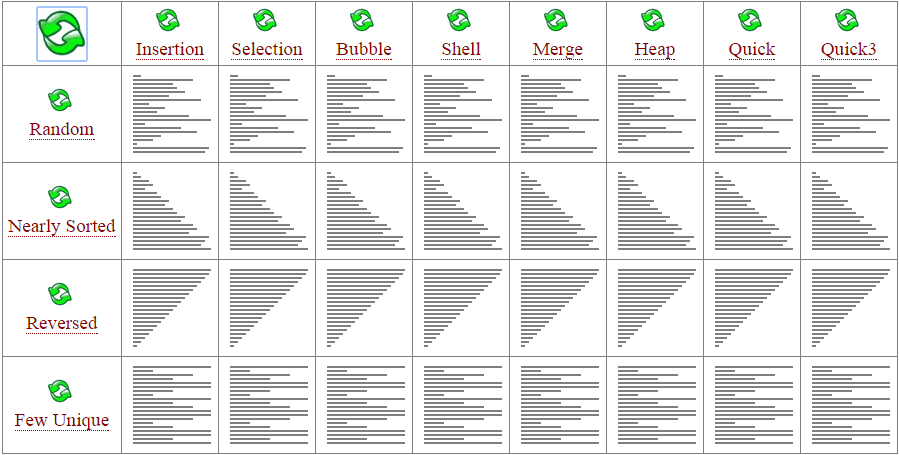
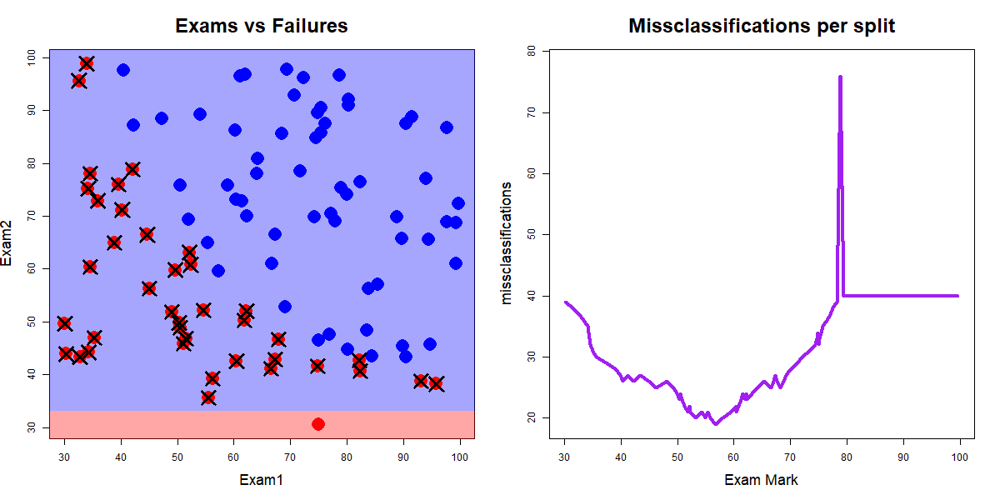

```{r setup, include=FALSE}
library(knitr)
knitr::opts_chunk$set(tidy = FALSE, 
                      message = FALSE,
                      warning = FALSE,
                      echo = FALSE, 
                      fig.width=8,
                      fig.height=6,
                      fig.align = "center",
                      fig.retina = 4)
options(htmltools.dir.version = FALSE)
library(magick)
```
class: split-two

.column[.pad50px[

## What is a decision tree?

<br>

Tree based models consist of one or more of nested `if-then` statements for the predictors that partition the data. Within these partitions, a model is used to predict the outcome.

]]

.column[.content.vmiddle.center[


 .font_tiny[Source: [Egor Dezhic](becominghuman.ai)]


]]


---
## Classification trees

- A classification tree is used to predict a .orange[categorical response] and regression tree is used to predict a quantitative response
- Use a recursive binary splitting to grow a classification tree. That is, sequentially break the data into two subsets, typically using a single variable each time.
- The predicted value for a new observation, $x_0$, will be the .orange[most commonly occurring class] of training observations in the sub-region in which $x_0$ falls


---
class: middle center
# In class exercise!

Everyone in the class line up from tallest to shortest.

---

## Sorting algorithms

There are numerous sorting algorithms

<center>

</center>

The "speed" of classification trees depends on how quickly one can sort. .green[[Source](www.sorting-algorithms.com)]


---

class: split-two

.column[.pad50px[

# What about two dimensions ?

Consider the dataset `Exam` where two exam scores are given for each student, 
and a class `Label` represents whether they passed or failed the course.


```{r, echo = FALSE}
data <- read.csv("data/Exam.csv", header=T)
```

```{r, fig.retina=4}
head(data,4)
```


]]

.column[.content.vmiddle.center[


```{r, fig.retina=4, echo=FALSE}
library(tidyverse)
ggplot(data, aes(x=Exam1, y=Exam2, color=factor(Label))) +
  geom_point(size=4) + 
  scale_color_brewer("", palette="Dark2") +
  theme_minimal() +
  theme(text = element_text(size=20)) 
```
]]


---
### Calculate the number of misclassifications along all splits for `Exam1` classifying according to the majority class for the left and right splits
 
<center>

</center>

Red dots are .orange["fails"], blue dots are .green["passes"], and crosses indicate misclassifications.

.font_tiny[Source: John Ormerod, U.Syd]
---

### Calculate the number of misclassifications along all splits for `Exam2` classifying according to the majority class for the top and bottom splits

<center>

</center>

Red dots are .orange["fails"], blue dots are .green["passes"], and crosses indicate misclassifications.

.font_tiny[Source: John Ormerod, U.Syd]

---

## Combining the results from `Exam1` and `Exam2` splits

<br>

+ The minimum number of misclassifications from using all possible splits of `Exam1` was 19 when the value of `Exam1` was **56.7**
+ The minimum number of misclassifications from using all possible splits of `Exam2` was 23 when the value of `Exam2` was **52.5**

<br>

So we split on the best of these, i.e., split the data on `Exam1` at 56.7.
---
## Split criteria - purity/impurity metrics


- The .orange[Gini index] measures total variance across the $K$ classes:
	$$G = \sum_{k =1}^K \hat{p}_{mk}(1 - \hat{p}_{mk})$$
- .orange[Entropy] is defined as
	$$D = - \sum_{k =1}^K \hat{p}_{mk} log(\hat{p}_{mk})$$ 
- If all $\hat{p}_{mk}$’s close to zero or one, $G$ and $D$ are small.


---
class: split-two

.column[.pad50px[

## Example - predicting heart disease

<br>

$Y$: presence of heart disease (Yes/No)

$X$: heart and lung function measurements

<br>
<br>
```{r results='markup'}
library(tidyverse)
library(ISLR)
library(rpart)
library(rpart.plot)
library(caret)
heart <- read_csv("http://faculty.marshall.usc.edu/gareth-james/ISL/Heart.csv") %>%
  select(-X1) %>% mutate(AHD=factor(AHD))
heart <- heart %>% filter(!is.na(Ca)) %>% filter(!is.na(Thal))
colnames(heart)
```

]]

.column[.content.center[

```{r}
set.seed(2019)
tr_indx <- createDataPartition(heart$AHD)$Resample1
heart_tr <- heart[tr_indx,]
heart_ts <- heart[-tr_indx,]
heart_finalrp <- rpart(AHD~., data=heart_tr)
prp(heart_finalrp)
```


]]


---

class: split-two

.column[.pad50px[

## Deeper trees

<br>

Trees can be built deeper by:

- decreasing the value of the complexity parameter `cp`, which sets the difference between impurity values required to continue splitting.
- reducing  the `minsplit` and `minbucket` parameters,  which control the number of  observations  below splits are forbidden.

]]
.column[.content.vmiddle[

```{r out.width="100%"}
heart_finalrp <- rpart(AHD~., data=heart_tr, control=rpart.control(minsplit=6, cp=0.02))
prp(heart_finalrp)
```
]]
---

Tabulate true vs predicted to make a .orange[confusion table]. 

<center>
<table>
<tr>  <td> </td><td> </td> <td colspan="2" align="center" > true </td> </tr>
<tr>  <td> </td><td> </td> <td align="center" bgcolor="#daf2e9" width="80px"> C1 (positive) </td> <td align="center" bgcolor="#daf2e9" width="80px"> C2 (negative) </td> </tr>
<tr height="50px">  <td> pred- </td><td bgcolor="#daf2e9"> C1 </td> <td align="center" bgcolor="#D3D3D3"> <em>a</em> </td> <td align="center" bgcolor="#D3D3D3"> <em>b</em> </td> </tr>
<tr height="50px">  <td>icted </td><td bgcolor="#daf2e9"> C2</td> <td align="center" bgcolor="#D3D3D3"> <em>c</em> </td> <td align="center" bgcolor="#D3D3D3"> <em>d</em> </td> </tr>
</table>
</center>

- .orange[Accuracy: *(a+d)/(a+b+c+d)*]
- .orange[Error: *(b+c)/(a+b+c+d)*]
- Sensitivity: *a/(a+c)*  (true positive, recall)
- Specificity: *d/(b+d)* (true negative)
- .orange[Balanced accuracy: *(sensitivity+specificity)/2*]

---

class: split-two

.column[.pad50px[

<center>
    Training confusion and error
</center>

```{r}
confusionMatrix(heart_tr$AHD, predict(heart_finalrp, newdata=heart_tr, type="class"))$table
confusionMatrix(heart_tr$AHD, predict(heart_finalrp, newdata=heart_tr, type="class"))$overall[1]
```
]]

.column[.pad50px[
<center>
    Test confusion and error
</center>
```{r}
confusionMatrix(heart_ts$AHD, predict(heart_finalrp, newdata=heart_ts, type="class"))$table
confusionMatrix(heart_ts$AHD, predict(heart_finalrp, newdata=heart_ts, type="class"))$overall[1]

```
]]

---
## Training vs testing performance

```{r out.width="80%", fig.width=6, fig.height=4}
# Decide on best model
heart_bigrp <- rpart(AHD~., data=heart_tr, control=rpart.control(minsplit=6, cp=0.005))
tr_err <- 1-confusionMatrix(factor(heart_tr$AHD), predict(heart_bigrp, newdata=heart_tr, type="class"))$overall[1]
ts_err <- 1-confusionMatrix(factor(heart_ts$AHD), predict(heart_bigrp, newdata=heart_ts, type="class"))$overall[1]
nnodes <- max(heart_bigrp$cptable[,2])+1
cp <- c(0.006, 0.007, 0.008, 0.009, 0.01, 0.02, 0.03, 0.04, 0.05, 0.1, 0.5)
for (i in 1:length(cp)) {
  heart_rp <- rpart(AHD~., data=heart_tr, control=rpart.control(minsplit=6, cp=cp[i]))
  tr_err <- c(tr_err, 1-confusionMatrix(heart_tr$AHD, predict(heart_rp, newdata=heart_tr, type="class"))$overall[1])
  ts_err <- c(ts_err, 1-confusionMatrix(heart_ts$AHD, predict(heart_rp, newdata=heart_ts, type="class"))$overall[1])
  nnodes <- c(nnodes, max(heart_rp$cptable[,2])+1)
}
heart_fit <- tibble(cp=c(0.005, cp), nnodes, train=tr_err, test=ts_err) %>% 
  gather(type, error, train, test) 
ggplot(heart_fit, aes(x=nnodes, y=error, colour=type)) + 
  geom_line() + scale_colour_brewer("", palette="Dark2") +
  xlab("Size of tree") + ylim(c(0,0.4))
```

```{r eval=FALSE}
# Cross-validation, but it transforms catagorical variables to numeric
library(e1071)
caret.control <- trainControl(method = "repeatedcv",
                              number = 10,
                              repeats = 1)
heart_rp <- train(AHD~., 
                  data=heart,
                  method = "rpart",
                  trControl = caret.control,
                  tuneLength = 100)
prp(heart_rp$finalModel, digits=2, roundint=FALSE)
```


---
class: split-two

.column[.pad50px[

## Comparison with LDA

<br>

Look at the following classification problems and resultant decision boundaries for LDA (left) and CART (right). 

<br>

.green[What characteristics determine which method is more appropriate?]


]]

.column[.content.vmiddle.center[

<a href="http://www-bcf.usc.edu/~gareth/ISL/Chapter8/8.7.pdf" target="_BLANK">   </a>


]]


---

class: split-two

.column[.pad50px[

## Example - Crabs

<br>

Physical measurements on WA crabs, males and females.

<br>

.font_small[*Data source*: Campbell, N. A. & Mahon, R. J. (1974)]

]]

.column[.content.vmiddle.center[


```{r out.width="100%", fig.width=5, fig.height=5}
crab <- read.csv("http://www.ggobi.org/book/data/australian-crabs.csv")
crab <- subset(crab, species=="Blue", select=c("sex", "FL", "RW"))
crab_rp <- rpart(sex~FL+RW, data=crab, parms = list(split = "information"), 
                 control = rpart.control(minsplit=3))
prp(crab_rp)
```

]]


---
## Example - Crabs

```{r out.width="80%", fig.width=6, fig.height=4}
ggplot(data=crab, aes(x=FL, y=RW, color=sex, shape=sex)) + 
  geom_point(alpha=0.7, size=3) + 
  scale_colour_brewer(palette="Dark2") +
  theme(aspect.ratio=1) + 
  geom_vline(xintercept=16, linetype=2) + 
  geom_segment(aes(x=7, xend=16, y=12, yend=12), color="black", linetype=2) +
  geom_segment(aes(x=12, xend=12, y=12, yend=17), color="black", linetype=2) + 
  geom_segment(aes(x=7, xend=16, y=8.1, yend=8.1), color="black", linetype=2) +
  geom_segment(aes(x=11, xend=11, y=8.1, yend=12), color="black", linetype=2) +
  geom_segment(aes(x=11, xend=16, y=11, yend=11), color="black", linetype=2) +
  geom_segment(aes(x=11, xend=11, y=8.1, yend=11), color="black", linetype=2) +
  geom_segment(aes(x=12, xend=16, y=11, yend=11), color="black", linetype=2) +
  geom_segment(aes(x=14, xend=14, y=11, yend=12), color="black", linetype=2) +
  geom_segment(aes(x=16, xend=21.3, y=16, yend=16), color="black", linetype=2)
```

---
class: split-50
layout: false

.column[.content.vmiddle.center[

Classification tree

```{r out.width="80%", fig.height=4, fig.width=4}
crab_grid <- expand.grid(FL=seq(7,22,0.25), RW=seq(6,17,0.25))
crab_grid$sex <- predict(crab_rp, newdata=crab_grid, type="class")
ggplot(data=crab_grid, aes(x=FL, y=RW, color=sex)) + 
  geom_point(alpha=0.3, size=3) + 
  geom_point(data=crab, aes(x=FL, y=RW, color=sex), shape=2, size=3) + 
  scale_colour_brewer(palette="Dark2") +
  theme_bw() + 
  theme(aspect.ratio=1, legend.position="none") 

```
]]
.column[.content.vmiddle.center[

Linear discriminant classifier

```{r out.width="80%", fig.height=4, fig.width=4}
library(MASS)
crab_lda <- lda(sex~FL+RW, data=crab, prior=c(0.5,0.5))
crab_grid$sex <- predict(crab_lda, newdata=crab_grid)$class
ggplot(data=crab_grid, aes(x=FL, y=RW, color=sex)) + 
  geom_point(alpha=0.3, size=3) + 
  geom_point(data=crab, aes(x=FL, y=RW, color=sex), shape=2, size=3) + 
  scale_colour_brewer(palette="Dark2") +
  theme_bw() + 
  theme(aspect.ratio=1, legend.position="none") 
```

]]

---
## Pros and cons


- The decision rules provided by trees are very easy to explain, and follow. A simple classification model.
- Trees can handle a mix of predictor types, categorical and quantitative.
- Trees efficiently operate when there are missing values in the predictors.
- Algorithm is greedy, a better final solution might be obtained by taking a second best split earlier.
- When separation is in linear combinations of variables trees struggle to provide a good classification

---
layout: false
# `r set.seed(2020); emo::ji("technologist")` Made by a human with a computer

### Slides at [https://iml.numbat.space](https://iml.numbat.space).
### Code and data at [https://github.com/numbats/iml](https://github.com/numbats/iml).
<br>

### Created using [R Markdown](https://rmarkdown.rstudio.com) with flair by [**xaringan**](https://github.com/yihui/xaringan), and [**kunoichi** (female ninja) style](https://github.com/emitanaka/ninja-theme).

<br> 
<a rel="license" href="http://creativecommons.org/licenses/by-sa/4.0/"></a><br />This work is licensed under a <a rel="license" href="http://creativecommons.org/licenses/by-sa/4.0/">Creative Commons Attribution-ShareAlike 4.0 International License</a>.
