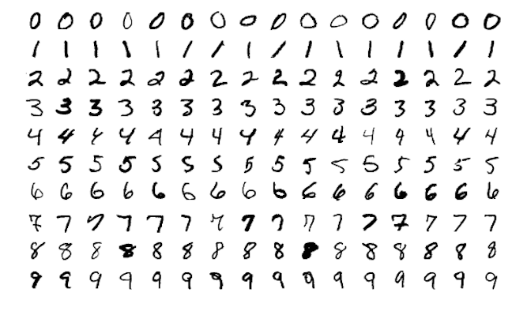
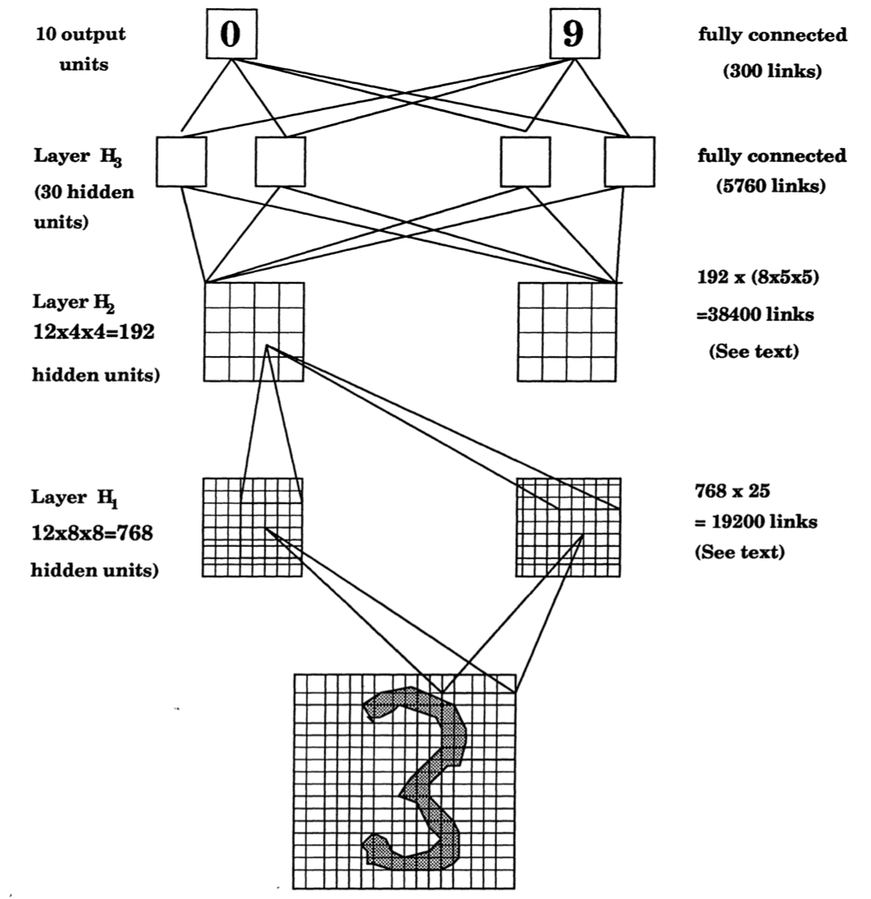
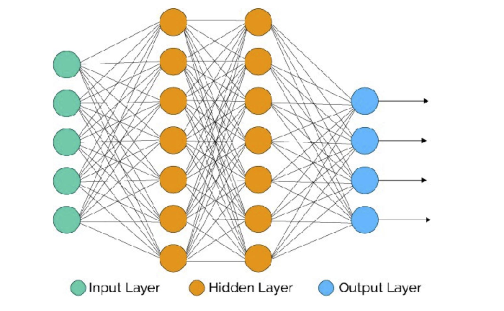
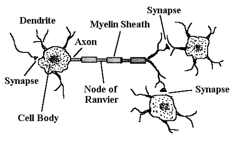

```{r setup, include=FALSE}
library(knitr)
knitr::opts_chunk$set(tidy = FALSE, 
                      message = FALSE,
                      warning = FALSE,
                      echo = FALSE, 
                      fig.width=8,
                      fig.height=6,
                      fig.align = "center",
                      fig.retina = 4)
options(htmltools.dir.version = FALSE)
library(magick)
```

class: split-two

.column[.pad50px[

## What number is this?

<br>

This is a three, right?

]]

.column[.content.vmiddle.center[


]]


---
class: split-two

.column[.pad50px[

## What number is this?

<br>

Is this also a three?

]]

.column[.content.vmiddle.center[


]]

---

class: split-two

.column[.pad50px[

## What number is this?

<br>

But what about this number? Not a three?

]]

.column[.content.vmiddle.center[


]]
---
## The human brain

The human brain can efficiently recognise that although the images of the two threes are different, they are the same number, and are both distinct from the five.

<center>

</center>
---

class: split-two

.column[.pad50px[

## MNIST data
<br>
The .green[MNIST data] was presented to AT&T Bell Lab's to build automatic mail sorting machines.

.orange[Goal:] Analyse handwritten digits and predict numbers written, given a $28 \times 28$ grid of pixels for each of the  60000 training images. Digits range from 0-9. 

]]


.column[.content.vmiddle.center[




.font_tiny[Sample images from MNIST test dataset .]
]]

---
class: split-two

.column[.pad50px[

## MNIST data

.green[How do we do this?]

Humans are good at detecting different features about the images, such as thickness of line, angles, edges, completeness of circles, etc.

It is evident a complex relationship is presented in the images. .orange[Neural networks] can help us automatically capture these complexities.

]]

.column[.content.vmiddle.center[





]]
---

class: split-two

.column[.pad50px[

## So, what are neural networks?

**Idea:** .green[Capture a complex relationship between outputs and inputs by creating layers of derived variables.]

$y$ = output variable

$x$ = original input variable

$f(x)$ = derived variable input

]]

.column[.content.vmiddle.center[

$$ y = f_1(f_2(\dots (f_d(x))))$$

<br>


.font_tiny[Source: Hands on Machine Learning with R]
]]


---

## How do we build a neural network?

<br>

To build a feedforward neural network, we need .orange[four key components:]

1. Input data (*in this case, the MNIST data*)
2. A pre-defined network architecture;
3. A feedback mechanism to enable the network to learn; and 
4. A model training approach.


---

class:  middle center

# **1. Preparing the data**


---

## Data preparation

<br>

There are some data cleaning steps we need to keep in mind before we use neural networks.

- Data needs input to be *numeric*. This means if our data has categorical variables, we will need to represent these as *dummy variables* (revise, Week 2!). This is also called .orange[one-hot encoding] in ML literature.
- Neural nets are sensitive to scale of the feature values - hence they should be *standardised* first (have mean zero and unit variance).
- If response is categorical (such as "0" through "9" response in MNIST data) - needs to be recoded as binary matrix. Can use `keras` function `to_categorical()`.
---

## Data preparation

We can obtain the MNIST data from the `dslabs` package. Data prep follow  [Hands on Machine Learning in R](https://bradleyboehmke.github.io/HOML/deep-learning.html). This arose when AT&T Bell Lab’s was asked to help build automatic mail-sorting machines for the USPS aroound 1990. 

```{r, echo = TRUE}
library(dplyr) 
library(keras)

# Import MNIST training data
mnist <- dslabs::read_mnist()
mnist_x <- mnist$train$images
mnist_y <- mnist$train$labels

# Rename columns and standardize feature values
colnames(mnist_x) <- paste0("V", 1:ncol(mnist_x))
mnist_x <- mnist_x / 255
p <- ncol(mnist_x)

# One-hot encode response
mnist_y <- to_categorical(mnist_y, 10)
```
---

class:  middle center

# **2. Network Architecture**

---
## Network architecture

<br>

When building architecture for the neural network, we are concerned about two key features: 

- The number of layers and nodes, and
- How signal is activated throughout the network.

---

class: split-two

.column[.pad50px[

## Layers and nodes

<br>

Our complex relationships are captured using layers and nodes. There are two different types of layers, namely,

- Input and output layers, and
- Hidden layers.


.font_tiny[Source: [Gabriela de Quiroz](https://github.com/gdequeiroz/2018-04-25_intro-to-deep-learning-with-R/blob/master/presentation/basic-concepts.pdf)]

]]

.column[.content.vmiddle.center[





]]

---

## Hidden layers

<br>

- No well-defined approach for selecting the number of hidden layers - this is just one of many hyperparameters we will need to tune! .orange[2-5 layers works well most of the time for regular tabular data].
- The more hidden layers - the longer the model will take to train (as we are adding more parameters!)


---

## Output layers


Choice of nodes for the output layer is determined by the ML task.

- If you are doing regression - a single node.
- Classification - a node for each class if multiclass.
- If binary, single node for probability of predicting success.

<br>

.tip[**Think!** How many output nodes will MNIST data neural network contain?  `r set.seed(2019); emo::ji("thinking")`]
---

## Building network structure in R

We use the `keras` package to build neural networks in R. This is *very different* to other forms of ML algorithms in R. In `keras`, we first define the network structure as a standalone from our data.

```{r, eval = FALSE, echo = TRUE}
library(keras)
model <- keras_model_sequential() %>%
  layer_dense(units = 16,
              input_shape = p) %>%
  layer_dense(units = 16) %>%
  layer_dense(units = 10)
```


---

## Activation - how do the layers speak?

<br>


Now that we have our structure in place, we need to determine how to pass signal throughout the network. 


<br>
<br>
<br>

`r anicon::nia("Stay tuned!", grow=2, animate="tada")` It uses methods we already know: .orange[logistic] and .orange[linear regression.]

---
## But first, some history


"A logical calculus of the ideas immanent in nervous activity" (1943)
Warren S. McCulloch & Walter Pitts

Mathematical model for a neuron.




---
## Logistic regression

Remember the logistic function:

\begin{align}
y &=& \frac{e^{\beta_0+\sum_{j=1}^p\beta_jx_j}}{1+e^{\beta_0+\sum_{j=1}^p\beta_jx_j}}\\
  &=& \frac{1}{1+e^{-(\beta_0+\sum_{j=1}^p\beta_jx_j)}}
\end{align}

Alternatively,

$$\log_e\frac{y}{1 - y} = \beta_0+\sum_{j=1}^p\beta_jx_j$$


---
class: split-50
layout: false

.column[.pad50px[

## Logistic regression

<br>

What the .orange[logistic function] looks like:

\begin{align}
y =\frac{1}{1+e^{-(\beta_0+\sum_{j=1}^p\beta_jx_j)}}
\end{align}

]]

.column[.content.vmiddle.center[


```{r out.width="80%", fig.width=4, fig.height=4}
library(tidyverse)
x <- seq(-2, 2, 0.1)
y <- exp(1+3*x)/(1+exp(1+3*x))
df2 <- tibble(x, y)
ggplot(df2, aes(x=x, y=y)) + 
  geom_line() +
  geom_hline(yintercept=0.5, colour="orange") +
  annotate("text", x=0.75, y=0.6, label="Activation threshold", colour="orange") +
  geom_hline(yintercept=c(0,1), linetype=2)
```


]]
---
class: middle

```{r out.width="100%"}
library(memer)
meme_get("ThinkAboutIt")
```

<center>
.font_large[Hang on to this idea....]
</center>
---

class: split-50

.column[.pad50px[

## Linear regression as a network


$$\hat{y} =\beta_0+\sum_{j=1}^p\beta_jx_j$$

Drawing as a network model: 

$p$ .orange[inputs] (predictors), multiplied by .orange[weights] (coefficients), summed, add a .orange[constant], predicts .orange[output] (response)

]]
.column[.content.vmiddle[


]]


---
## Network explanation - hidden layers

$$\hat{y} =\alpha_{0}+\sum_{k=1}^s(\alpha_{k}(\beta_{j0}+\sum_{j=1}^p\beta_{jk}x_j))$$

A linear regression model nested within a linear regression model allows for intrinsic dimension reduction, or expansion.

<center>

</center>

---
## Two layer perceptron

This is a single output, 2 layer, perceptron (neural network), with a linear threshold.

\begin{align}
\hat{y} =\alpha_{0}+\sum_{k=1}^s(\alpha_{k}(\beta_{j0}+\sum_{j=1}^p\beta_{jk}x_j))
\end{align}


<center>

</center>


---

Back to logistic regression: When the proportion gets to 0.5, it .orange[activates] an event to happen $(Y=1)$.

```{r out.width="50%", fig.width=4, fig.height=4}
library(tidyverse)
x <- seq(-2, 2, 0.1)
y <- exp(1+3*x)/(1+exp(1+3*x))
df2 <- tibble(x, y)
ggplot(df2, aes(x=x, y=y)) + 
  geom_line() +
  geom_hline(yintercept=0.5, colour="orange") +
  annotate("text", x=0.75, y=0.6, label="Activation threshold", colour="orange") +
  geom_hline(yintercept=c(0,1), linetype=2)
```

---
## Activation functions

\begin{align}
\hat{y} =\color{orange}g\color{orange}(\alpha_{0}+\sum_{k=1}^s(\alpha_{k}\color{orange}f\color{orange}(\beta_{0k}+\sum_{j=1}^p\beta_{jk}x_j)\color{orange})\color{orange})
\end{align}

Let $u=\beta_0+\sum_{j=1}^p\beta_jx_j$
- $\texttt{Logistic:} \quad \color{orange}{\frac{1}{1+e^{-u}}}$
- $\texttt{Gaussian radial:} \quad \color{orange}{\frac{1}{\sqrt{2\pi}}e^{-u^2/2}}$
- $\texttt{Hyperbolic tangent:} \quad \color{orange}{\frac{e^u-e^{-u}}{e^u+e^{-u}}}$

---
## Example

Consider the wiggly data

```{r out.width="50%", fig.width=4, fig.height=4}
library(tidyverse)
library(nnet)

w <- read_csv("data/wiggly.csv")
ggplot(w, aes(x=x, y=y, colour=class, shape=class)) + 
  geom_point() +
  scale_color_brewer("", palette="Dark2") +
  scale_shape("") +
  theme(aspect.ratio=1) 
```

---

## Overall fit is good

```{r out.width="65%", fig.width=4, fig.height=4}
load("data/nnet_many.rda")
load("data/nnet_best.rda")

ggplot(subset(best$output,  node == 1), aes(x, y)) +
  geom_raster(aes(fill = pred)) +
  geom_point(aes(shape = class), data = w) +
  scale_fill_gradient2(low="#1B9E77", high="#D95F02", mid = "white", midpoint = 0.5) +
  theme(aspect.ratio=1) 
```

---
## Individual layers

```{r out.width="100%", fig.width=8, fig.height=4}
ggplot(best$hidden, aes(x, y)) +
  geom_raster(aes(fill = pred)) +
  geom_point(aes(shape = class), data = w) +
  scale_fill_gradient2(low="#1B9E77", high="#D95F02", mid = "white", midpoint = 0.5) +
  facet_grid(. ~ node) +
  theme(aspect.ratio=1) 
```


---

## Adding in activation information in R

To add in activation information to our model in `keras`, we simply adjust our model stucture previously by adding in the activation functions we would like to use for each layer.

.green[Note - using different activations doesn't affect what the network can learn, just the speed at which it learns.]

```{r, echo = TRUE}
model <- keras_model_sequential() %>%
  layer_dense(units = 16, 
              activation = "relu", 
              input_shape = p) %>%
  layer_dense(units = 16, activation = "relu") %>%
  layer_dense(units = 10, activation = "softmax")
```


---
layout: false
# `r set.seed(2020); emo::ji("technologist")` Made by a human with a computer, with help from [Sarah Romanes](https://sarahromanes.github.io)

### Slides at [https://iml.numbat.space](https://iml.numbat.space).
### Code and data at [https://github.com/numbats/iml](https://github.com/numbats/iml).
<br>

### Created using [R Markdown](https://rmarkdown.rstudio.com) with flair by [**xaringan**](https://github.com/yihui/xaringan), and [**kunoichi** (female ninja) style](https://github.com/emitanaka/ninja-theme).

<br> 
<a rel="license" href="http://creativecommons.org/licenses/by-sa/4.0/"></a><br />This work is licensed under a <a rel="license" href="http://creativecommons.org/licenses/by-sa/4.0/">Creative Commons Attribution-ShareAlike 4.0 International License</a>.
