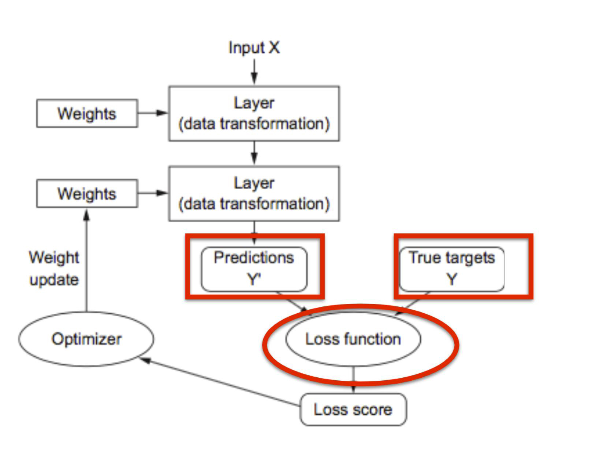
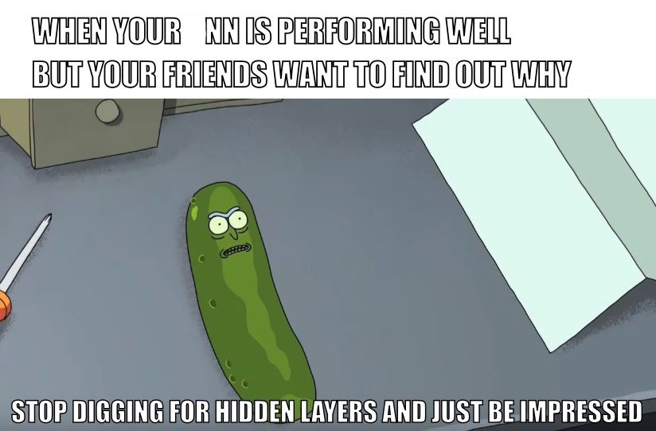
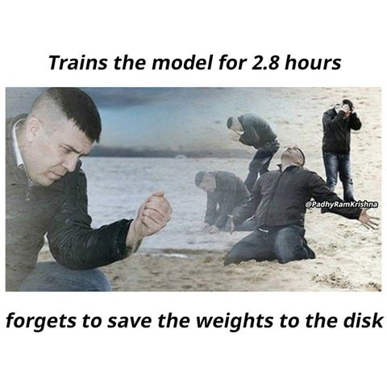

```{r setup, include=FALSE}
library(knitr)
knitr::opts_chunk$set(tidy = FALSE, 
                      message = FALSE,
                      warning = FALSE,
                      echo = FALSE, 
                      fig.width=8,
                      fig.height=6,
                      fig.align = "center",
                      fig.retina = 4)
options(htmltools.dir.version = FALSE)
library(magick)
```

class:  middle center

# **3. Feedback Mechanism**


```{r}
library(keras)
# Import MNIST training data
mnist <- dslabs::read_mnist()
mnist_x <- mnist$train$images
mnist_y <- mnist$train$labels

# Rename columns and standardize feature values
colnames(mnist_x) <- paste0("V", 1:ncol(mnist_x))
mnist_x <- mnist_x / 255
p <- ncol(mnist_x)

# One-hot encode response
mnist_y <- to_categorical(mnist_y, 10)

model <- keras_model_sequential() %>%
  layer_dense(units = 16, 
              activation = "relu", 
              input_shape = p) %>%
  layer_dense(units = 16, activation = "relu") %>%
  layer_dense(units = 10, activation = "softmax")
```

---

## Compiling the model

Now that we have a model architecture in place - how will the model *learn* from the data? To do this, we need to specify a .orange[**loss function**] and .orange[**optimiser**] to use during training.

- The *loss function* (also called objective function) helps measure performance. For regression you may use the MSE, for classification you may use cross entropy.
- The *optimiser* controls which optimisation algorithm is implemented in our NN. 


---

class: middle center

<center>

</center>


.font_tiny[Source: [Gabriela de Quiroz (2018) Intro  to Deep Learning with R](https://github.com/gdequeiroz/2018-04-25_intro-to-deep-learning-with-R/blob/master/presentation/basic-concepts.pdf)]

---

## Compiling the model in R

<br>

In R, we pipe our model to the `compile` function. This is all done in place and is not assigned to an object! 

```{r, echo = TRUE}
model %>%   compile(
    loss = 'categorical_crossentropy',
    optimizer = "rmsprop",
    metrics = c('accuracy')
  )
```


---

class:  middle center

# **4. Model Training**

---

## Model training

Now that we have created the model specification, we are ready to give it some data! We can use the `fit` function in `keras` to achieve this.

```{r, eval = FALSE, echo = TRUE}
fit <- model %>% fit(
  x = mnist_x,
  y = mnist_y,
  batch_size = 512,
  epochs = 10
)
```

Note - `batch_size` refers to the number of samples fed into the model at a time, and `epoch` refers to how many times we will transverse the input data.

---
## Model training

Now that we have created the model specification, we are ready to give it some data! We can use the `fit` function in `keras` to achieve this.

.green[Additionally, we can hold out data in `validation_split` to validate that we are not *overfitting* to out data.]

```{r, echo = TRUE, message = FALSE, warning = FALSE}
fit <- model %>% fit(
  x = mnist_x,
  y = mnist_y,
  batch_size = 512,
  epochs = 10,
  validation_split = 0.2,
  verbose = FALSE
)
```

---

class: split-50

.column[.pad50px[

## Model training

We can plot the accuracy and loss of the neural network using the `plot` function.

```{r, eval = FALSE, echo = TRUE}
plot(fit)
```


]]
.column[.content.vmiddle[

```{r}
plot(fit)
```


]]

---

# Predict test set

```{r}
mnist_ts_x <- mnist$test$images
colnames(mnist_ts_x) <- paste0("V", 1:ncol(mnist_ts_x))
mnist_ts_x <- mnist_ts_x / 255
mnist_ts_y <- mnist$test$labels
```

```{r  echo=TRUE}
mnist_ts_yp <- predict_classes(model, mnist_ts_x)
table(mnist_ts_yp, mnist_ts_y)
```

---
## Additional thoughts - regularisation

Place constraints on model complexity. Can use a $L_1$ or $L_2$ penalty to add a cost to the size of the node weights.

$$RSS + \lambda \sum_{k} w_k^2$$

where $w$ indicates the set of weights in the model, labelled $\alpha, \beta$ earlier. Forces some of the weights to zero (or close to), to alleviate over-parametrization, and over-fitting.

`r anicon::nia("More on regularisation next week", grow=2, animate="shake")`

---

class: middle center

# So why don't we use neural networks for all machine learning problems?


---

class: split-two

.column[.pad50px[

## Minimal interpretability

<br>

- Core concept of .orange[prediction] vs .orange[inference].
- Neural networks are seen as a black box type of model, with limited information provided to as how the neural net is making decisions. (*Contrast this to trees, or logistic regression, say*)

]]

.column[.content.vmiddle.center[




.font_tiny[Source: Machine Learning Memes for Convolutional Teens]


]]


---
class: split-two

.column[.pad50px[

## Data intensive

<br>

- Deep learning algorithms don't work well when the number of features is larger than the number of observations (highly overparameterised).
- If we only have a limited number of training data points, the model can potentially .orange[overfit] and fit very closely to the training data whilst lacking predictive performance for new data.

]]

.column[.content.vmiddle.center[


.font_tiny[Source: Machine Learning Memes for Convolutional Teens]
]]
---
class: split-two

.column[.pad50px[

## Computationally intensive

<br>

- Many calculations are required to estimate all of the parameters in many neural networks (the one we have shown today is quite basic ).
- Deep learning involves huge amounts of matrix multiplications and other operations.
- Often used in conjuction with GPUs to paralellise computations.

]]

.column[.content.vmiddle.center[




.font_tiny[Source: Machine Learning Memes for Convolutional Teens]

]]
---

## Resources

- [Neural Networks: A Review from a Statistical Perspective](https://projecteuclid.org/euclid.ss/1177010638)
- [A gentle journey from linear regression to neural networks](https://towardsdatascience.com/a-gentle-journey-from-linear-regression-to-neural-networks-68881590760e)
- [McCulloch-Pitts Neuron -- Mankind’s First Mathematical Model Of A Biological Neuron](https://towardsdatascience.com/mcculloch-pitts-model-5fdf65ac5dd1)
- [Hands on Machine Learning with R - Deep Learning](https://bradleyboehmke.github.io/HOML/deep-learning.html)

---
layout: false
# `r set.seed(2020); emo::ji("technologist")` Made by a human with a computer, with help from [Sarah Romanes](https://sarahromanes.github.io)

### Slides at [https://iml.numbat.space](https://iml.numbat.space).
### Code and data at [https://github.com/numbats/iml](https://github.com/numbats/iml).
<br>

### Created using [R Markdown](https://rmarkdown.rstudio.com) with flair by [**xaringan**](https://github.com/yihui/xaringan), and [**kunoichi** (female ninja) style](https://github.com/emitanaka/ninja-theme).

<br> 
<a rel="license" href="http://creativecommons.org/licenses/by-sa/4.0/"></a><br />This work is licensed under a <a rel="license" href="http://creativecommons.org/licenses/by-sa/4.0/">Creative Commons Attribution-ShareAlike 4.0 International License</a>.
