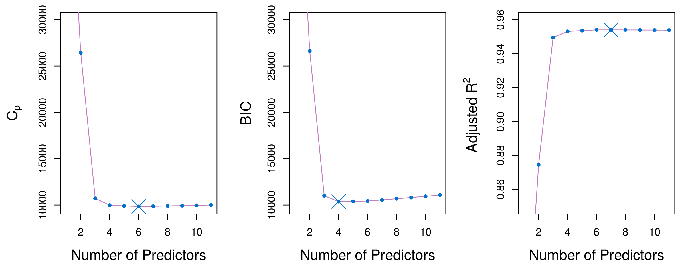
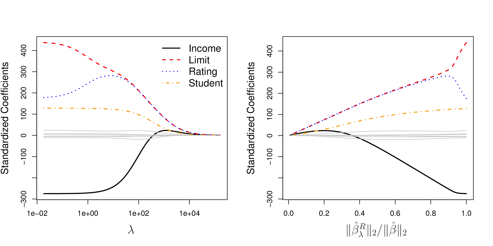
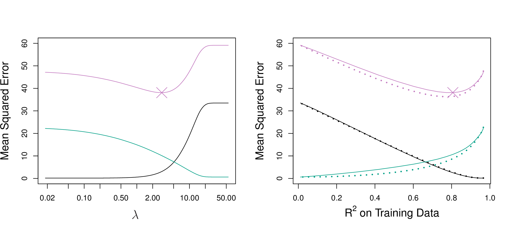
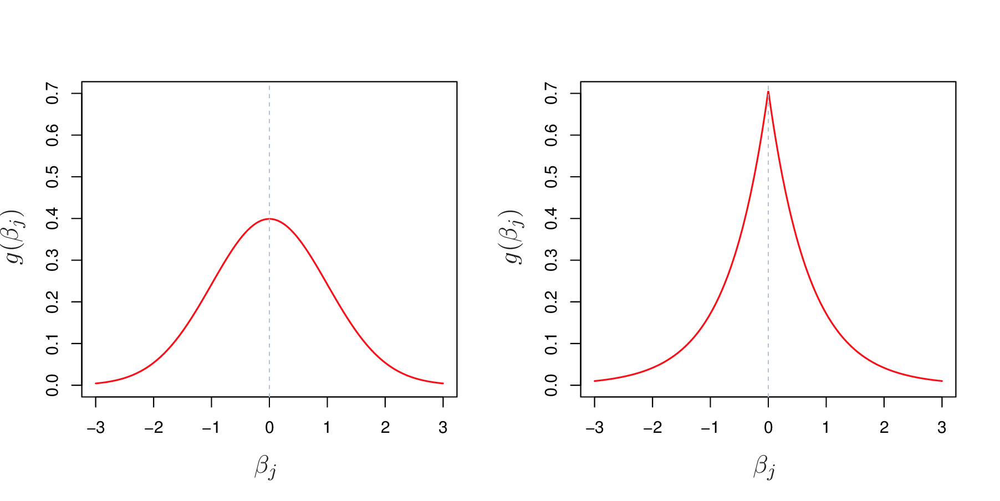
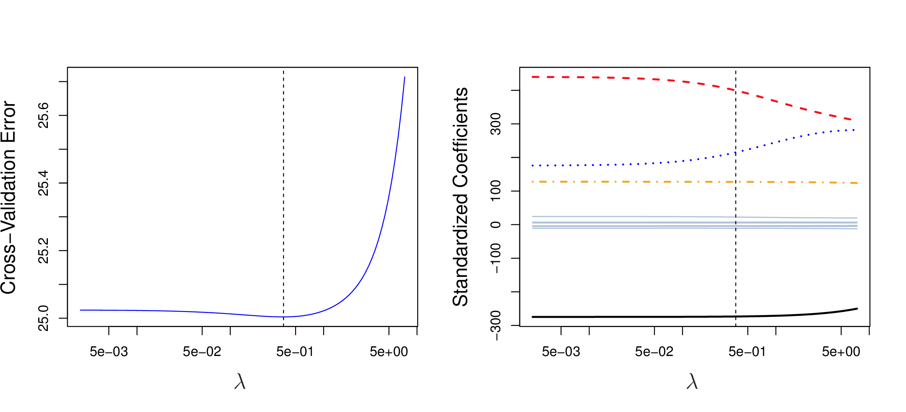
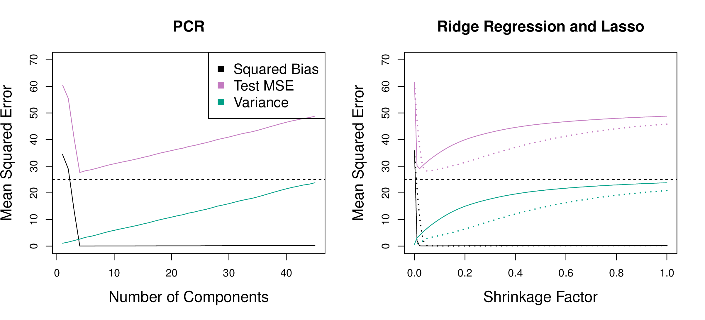
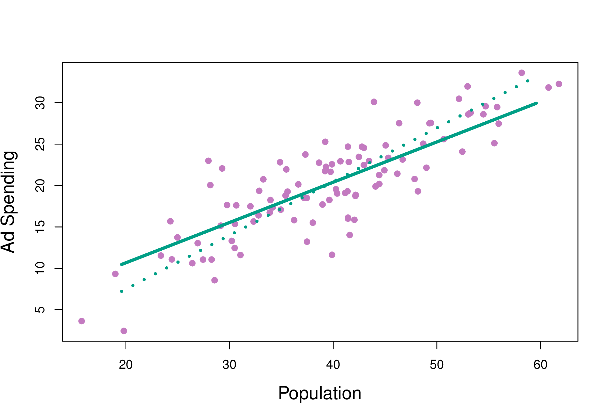

```{r setup, include=FALSE}
library(knitr)
knitr::opts_chunk$set(tidy = FALSE, 
                      message = FALSE,
                      warning = FALSE,
                      echo = FALSE, 
                      fig.width=8,
                      fig.height=6,
                      fig.align = "center",
                      fig.retina = 2)
options(htmltools.dir.version = FALSE)
library(magick)
```

## Too many variables

Fitting a linear regression model requires:

\begin{align*}
		%\underset{{\beta} \in \mathbb{R}^{p} }{\operatorname{minimize}}~& \sum_{i = 1}^n (y_i - \beta_0 - \sum_{j = 1}^p \beta_j x_{ij})^2 \\
		\underset{{\beta} \in \mathbb{R}^{p} }{\text{minimize}}& \left\{ \sum_{i = 1}^n \left(y_i - \beta_0 - \sum_{j = 1}^p \beta_j x_{ij} \right)^2 \right\} \\
		\equiv \underset{{\beta} \in \mathbb{R}^{p} }{\operatorname{minimize}}~& ({y} - {X}{\beta})' ({y} - {X}{\beta}) 
\end{align*}

The least square solution for $\beta$ is

$$ {\hat \beta} = \color{orange}{({X}' {X})^{-1}} {X}' {y} $$

To .orange[invert] a matrix, requires it to be .orange[full rank].


---

## Example: Using simulation

- 20 observations
- 2 classes: A, B
- One variable with separation, 99 noise variables

```{r out.width="100%", fig.width=8, fig.height=3}
library(tidyverse)
library(gridExtra)
set.seed(20190428)
tr <- matrix(rnorm(20*100),ncol=100)
colnames(tr) <- paste0("x", 1:100)
tr[1:10,1] <- tr[1:10,1]+5
tr <- scale(tr)
tr <- as_tibble(tr) %>% mutate(cl=c(rep("A",10), rep("B",10)))
p1 <- ggplot(data=tr, aes(x=x1, y=x2, colour=cl, shape=cl)) + 
  geom_point(size=3) + 
  scale_color_brewer(palette="Dark2") +
  theme_bw() + 
  theme(legend.position="none", aspect.ratio=1) +
  ggtitle("Gap in x1")
p2 <- ggplot(data=tr, aes(x=x2, y=x3, colour=cl, shape=cl)) + 
  geom_point(size=3) + 
  scale_color_brewer(palette="Dark2") +
  theme_bw() + 
  theme(legend.position="none", aspect.ratio=1) +
  ggtitle("Noise")
grid.arrange(p1, p2, ncol=2)

# Generate test data
ts <- matrix(rnorm(10*100),ncol=100)
colnames(ts) <- paste0("x", 1:100)
ts[1:5,1] <- ts[1:5,1]+5
ts <- scale(ts)
ts <- as_tibble(ts) %>% mutate(cl=c(rep("A",5), rep("B",5)))
```

.orange[What will be the optimal LDA coefficients?]

`r countdown::countdown(minutes = 0, seconds = 23, bottom = "0", left = "0", font_size = "1em", play_sound = TRUE)`

---

Fit linear discriminant analysis on .orange[first two variables].

```{r}
library(MASS)
tr_lda <- lda(cl~., data=tr[,c(1:2,101)], prior=c(0.5,0.5))
tr_lda
```

Coefficient for `x1` MUCH higher than `x2`. .orange[As expected!]

---
class: split-50

.column[.pad50px[
Predict the training and test sets


```{r}
tr_p <- predict(tr_lda, tr)
table(tr$cl, tr_p$class)

ts_p <- predict(tr_lda, ts)
table(ts$cl, ts_p$class)
```

```{r out.width="80%", fig.width=4, fig.height=2}
ggplot(data=data.frame(LD1=tr_p$x, cl=tr$cl), aes(x=LD1, y=cl)) +
         geom_point(size=5, alpha=0.5) +
         ylab("Class") + xlim(c(-10,10)) +
  geom_point(data=data.frame(LD1=ts_p$x, cl=ts$cl), 
             shape=2, size=5, colour="red")
```


]]
.column[.pad50px[
```{r out.width="150%"}
library(memer)
meme_get("AllTheThings") %>% meme_text_bottom(txt="Beauty!")
```
]]

---

What happens to test set (and predicted training values) as number of noise variables increases:

```{r, animation.hook='gifski', out.width="100%", fig.width=4, fig.height=2}
for (i in 2:20) {
  tr_lda <- lda(cl~., data=tr[,c(1:i,101)], prior=c(0.5,0.5))
  tr_p <- predict(tr_lda, tr)
  ts_p <- predict(tr_lda, ts)
  t1 <- table(tr$cl, tr_p$class)
  t2 <- table(ts$cl, ts_p$class)
  tr_err <- (t1[1,2]+t1[2,1])/sum(t1)
  ts_err <- (t2[1,2]+t2[2,1])/sum(t2)

  print(
    ggplot(data=data.frame(LD1=tr_p$x, cl=tr$cl), aes(x=LD1, y=cl)) +
         geom_point(size=5, alpha=0.5) +
         ylab("Class") + xlim(c(-10,10)) +
      geom_point(data=data.frame(LD1=ts_p$x, cl=ts$cl), 
             shape=2, size=5, colour="red") +
      ggtitle(paste0("p = ", i, " train = ", tr_err, " test = ", ts_err))
  )
}
```

---

Estimated coefficients as dimensions of noise increase:

```{r, animation.hook='gifski', out.width="100%", fig.width=6, fig.height=3}
for (i in 2:20) {
  tr_lda <- lda(cl~., data=tr[,c(1:i,101)], prior=c(0.5,0.5))
  coef <- tibble(var=colnames(tr)[1:20], coef=c(1,rep(0,19)))
  coef$var <- factor(coef$var, levels=c(paste0("x",1:20)))
  coef$coef[1:i] <- abs(tr_lda$scaling)/sqrt(sum(tr_lda$scaling^2))
  print(
    ggplot(data=coef, aes(x=var, y=coef)) +
    geom_col() + ylim(c(0,1)) + xlab("Variable") + 
    ylab("Coefficient") +
    ggtitle(paste0("p = ", i))
  )
}
```

---
class: middle

# How do we tackle high-dimension, low sample size problems?

---
## Subset selection

Identify a subset $s$ of the $p$ predictors, most related to response.

\begin{align*}
	& \underset{{\beta}}{\text{minimize}} \left\{ \sum_{i = 1}^n \left(y_i - \beta_0 - \sum_{j = 1}^p \beta_j x_{ij} \right)^2 \right\} \\
	& \text{subject to}\sum_{j = 1}^p {I}(\beta_j \neq 0) \leq k, \quad  k \geq 0.
\end{align*}
where $k \geq 0$ is a tuning parameter.

- Need to consider ${p \choose k}$ models containing $s$ predictors computationally infeasible when $p$ and $s$ are large
- Stepwise procedures: forward, backward, etc.

---

## Model fit statistics

These can be used to decide on choice  of $k$.

- $MSE = RSS/n$, but the training $MSE$ is an under-estimate of test $MSE$, and it will decrease with larger $p$.
- Methods for adjusting the training error for model size include Mallows $C_p$, Akaike Information Criterion (AIC), Bayesian Information Criterion (BIC) and adjusted $R^2$.

<center>
<a href="http://www-bcf.usc.edu/~gareth/ISL/Chapter6/6.2.pdf" target="_BLANK">  </a>
</center>

---

## Mallows $C_p$

<br>

For a fitted least squares model containing $d$ predictors, a reasonable estimate of the test MSE is:

$$C_p = \frac{1}{n} (RSS+2d\hat{\sigma}^2)$$
where $\hat{\sigma}^2$ is an estimate of the variance of the error $\varepsilon$, computed from the full model containing all predictors. 

The additional part penalises the training RSS to adjust for the under-estimation of test error.


---
## AIC and BIC

<br>

$$AIC = \frac{1}{n\hat{\sigma}^2} (RSS+2d\hat{\sigma}^2)$$
and hence is $\propto C_p$. 

$$BIC = \frac{1}{n\hat{\sigma}^2} (RSS+\log(n)d\hat{\sigma}^2)$$

all tend to take on low values for models with small test error.


---
## Adjusted $R^2$

<br>
<br>

$$\mbox{Adjusted }R^2 = 1-\frac{RSS/(n-d-1)}{TSS/(n-1)}$$

The intuition is that once all of the correct variables have been included in the model, adding additional *noise* variables will lead to only a very small decrease in RSS.

---

## Best subset selection algorithm

<br>

1. Let ${\mathcal M}_o$ denote the null model, which contains no predictors. This
model simply predicts the sample mean for each observation.
2. For $k=1,2,...,p$:<br>
    a. Fit all ${p \choose k}$ models that contain exactly $k$ predictors.<br>
    b. Pick the best among these ${p \choose k}$ models, and call it ${\mathcal M}_k$. Best means smallest RSS (or largest $R^2$).
3. Select a single best model from among ${\mathcal M}_o$, . . . , ${\mathcal M}_p$ using cross- validated prediction error, $C_p$ (AIC), BIC, or adjusted $R^2$.

---
## Best subset selection algorithm


.orange[Best subset selection] algorithm applied to the 11 predictors of the Credit data.

<center>
<a href="http://www-bcf.usc.edu/~gareth/ISL/Chapter6/6.1.pdf" target="_BLANK">  </a>
</center>

.font_tiny[(Chapter 6/6.1)]

---
## Foward stepwise selection 

.orange[Forward stepwise selection] is a computationally efficient alternative to best subset selection. It considers a much smaller set of models.

When $p = 20$, best subset selection requires fitting 1,048,576 models, whereas forward stepwise selection requires fitting only 211 models.

---

## Foward stepwise selection - algorithm

<br>

1. Let ${\mathcal M}_o$ denote the null model, which contains no predictors. This
model simply predicts the sample mean for each observation.
2. For $k=0,1,2,...,p-1$:<br>
    a. Consider all ${p - k}$ models that augment ${\mathcal M}_k$ with *one additional predictor*.<br>
    b. Pick the best among these ${p - k}$ models, and call it ${\mathcal M}_{k+1}$. Best means smallest RSS (or largest $R^2$).
3. Select a single best model from among ${\mathcal M}_o$, . . . , ${\mathcal M}_p$ using cross- validated prediction error, $C_p$ (AIC), BIC, or adjusted $R^2$.

---
## Backwise stepwise selection

<br>

- Backward stepwise starts with all variables in the model, and removes the variable with smallest RSS. 
- Forward and backwards stepwise procedures are not guaranteed to provide the best model. 
- Backwards stepwise requires that $n>p$, but forward stepwise does not, and can stop adding variables once $n (<p)$ is reached.

---

## Shrinkage methods

<br>


.orange[Shrinkage methods] fit a model containing all $p$ predictors using a technique that constrains or regularizes the coefficient estimates, or equivalently, that .orange[shrinks some of the coefficient estimates towards zero].

<br>
.tip[There are two main methods: .orange[Ridge] regression and .orange[Lasso].]


---

## Ridge regression

\begin{align*}
	& \mbox{RSS} =  \sum_{i = 1}^n \left(y_i - \beta_0 - \sum_{j = 1}^p \beta_j x_{ij} \right)^2 
\end{align*}

Least squares: 

\begin{align*}
	& \underset{{\beta}}{\text{minimize}} \mbox{ RSS}
\end{align*}

.orange[Ridge] regression: 

\begin{align*}
	& \underset{{\beta}}{\text{minimize}} \mbox{ RSS} \color{orange}{+ \lambda \sum_{j=1}^p \beta_j^2}
\end{align*}
where $\lambda \geq 0$ is a tuning parameter.

---
## Ridge regression

$$\lambda \sum_{j=1}^p \beta_j^2$$ 
is called a .orange[shrinkage penalty]. It is small when $\beta_1, ..., \beta_p$ are close to 0.

$\lambda$ serves as a .orange[tuning parameter], controlling the relative impact of these two terms on the regression coefficient estimates. When it is 0, the penalty term has no effect on the fit. 

Ridge regression will produce a .orange[different set of coefficients] for each $\lambda$, call them $\hat{\beta}_{\lambda}^R$. Tuning $\lambda$, typically by cross-validation, is critical component of fitting the model. 


---
class: split-60
layout: false

.column[.pad10px[
.orange[Standardized ridge regression coefficients for the Credit data set. ]


<a href="http://www-bcf.usc.edu/~gareth/ISL/Chapter6/6.4.pdf" target="_BLANK">  </a>

.font_tiny[(Chapter6/6.4.pdf)]

```{r}
library(ISLR)
data(Credit)
```
]]
.column[.top50px[

- $p=10$
- Left side of plot corresponds to least squares.
- When $\lambda$ is extremely large, then all of the ridge coefficient estimates are basically zero, which is the null model.
- 4 of 10 variables have larger coefficients, and one, Rating, initially increases with $\lambda$. 
- Right-side plot, $x$-axis indicates amount the coefficients shrink to 0, value of 1 indicates LS.
]]


---
class: split-50
layout: false

.column[.pad10px[

The scale of variables can affect ridge regression performance.

```{r}
library(anicon)

nia(text=".orange[It is important to standardise the scale of predictors prior to ridge regression.]", , animate="shake", speed="slow", flip="horizontal")
```


$$\tilde{x}_{ij} = \frac{x_{ij}}{\sigma_{x_{j}}}$$
]]
.column[.pad10px[

Simulation scenario! Ridge regression improves on least squares, for large number of variables, in the bias-variance tradeoff. It .orange[sacrifices some bias] for the benefit of .orange[decreased variance].  

```{r}
if (!file.exists("images/6.5.png"))
  image_write(image_read("http://www-bcf.usc.edu/~gareth/ISL/Chapter6/6.5.pdf", density = 300), "images/6.5.png", 
      format = "png", density = 300)
```

<a href="http://www-bcf.usc.edu/~gareth/ISL/Chapter6/6.5.pdf" target="_BLANK">  </a>

.black[bias]
.green[variance]
.purple[test error]


.font_tiny[(Chapter6/6.5.pdf)]

]]
---
## The Lasso

Ridge regression: 

\begin{align*}
	& \underset{{\beta}}{\text{minimize}} \mbox{ RSS} + \lambda \sum_{j=1}^p \beta_j^2
\end{align*}

.orange[Lasso:]

\begin{align*}
	& \underset{{\beta}}{\text{minimize}} \mbox{ RSS} + \lambda \sum_{j=1}^p \color{orange}{|\beta_j|}
\end{align*}

and same $\lambda \geq 0$ is a tuning parameter.


---
class: split-60
layout: false

.column[.pad10px[
Standardized lasso coefficients for the Credit data set. 

```{r}
library(magick)
if (!file.exists("images/6.6.png"))
  image_write(image_read("http://www-bcf.usc.edu/~gareth/ISL/Chapter6/6.6.pdf", density = 300), "images/6.6.png", 
      format = "png", density = 300)
```

<a href="http://www-bcf.usc.edu/~gareth/ISL/Chapter6/6.6.pdf" target="_BLANK">  </a>

.font_tiny[(Chapter6/6.6.pdf)]

```{r}
library(ISLR)
data(Credit)
```
]]
.column[.top50px[

- $p=10$
- Has the effect of forcing some variables exactly to 0.
- Cleaner solution than ridge regression.
]]

---

## Simulation scenario! 

Bias-variance tradeoff with lasso, and comparison against ridge regression.


<center>
<a href="http://www-bcf.usc.edu/~gareth/ISL/Chapter6/6.8.pdf" target="_BLANK">  </a>
</center>

.center[
.black[Bias]
.green[Variance]
.purple[Test error]]


.font_tiny[(Chapter6/6.5.pdf)]


---
class: split-50
layout: false

.column[.pad10px[
.orange[Bayesian] interpretation:  Ridge regression is the posterior mode for $\beta$ under a Gaussian prior (left);  The lasso is the posterior mode for $\beta$ under a double-exponential prior (right).

<a href="http://www-bcf.usc.edu/~gareth/ISL/Chapter6/6.11.pdf" target="_BLANK">  </a>

.font_tiny[(Chapter6/6.11.pdf)]

]]
.column[.pad10px[

.orange[Cross-validation] on the Credit example, yields a suggestion to use $\lambda=0.5$ for ridge regression model.

```{r}
if (!file.exists("images/6.12.png"))
  image_write(image_read("http://www-bcf.usc.edu/~gareth/ISL/Chapter6/6.12.pdf", density = 300), "images/6.12.png", 
      format = "png", density = 300)
```

<a href="http://www-bcf.usc.edu/~gareth/ISL/Chapter6/6.12.pdf" target="_BLANK">  </a>

.font_tiny[(Chapter6/6.12.pdf)]

]]

---
## Penalised LDA

Recall: LDA involves the eigen decomposition of $\color{orange}{\Sigma^{-1}\Sigma_B}$, where

$$\small{\Sigma_B = \frac{1}{K}\sum_{i=1}^{K} (\mu_i-\mu)(\mu_i-\mu)'}$$

$$\small{\Sigma = \frac{1}{n} \sum_{i=1}^{n} (x_i-\mu_i)(x_i-\mu_i)'}$$

The eigen-decomposition is an analytical solution to a sequential optimisation problem: 


\begin{align*}
& \small{\underset{{\beta_k}}{\text{maximize}} \beta_k^T\hat{\Sigma}_B \beta_k} \\
& \small{\mbox{ subject to  }  \beta_k^T\hat{\Sigma} \beta_k \leq 1, \beta_k^T\hat{\Sigma}\beta_j = 0 \mbox{  } \forall i<k}
\end{align*}


---
## Penalised LDA

The problem is inverting $\color{orange}{\Sigma^{-1}}$, fix it by

\begin{align*}
& \underset{{\beta_k}}{\text{maximize}} \left(\beta_k^T\hat{\Sigma}_B \beta_k + \lambda_k \sum_{j=1}^p |\hat{\sigma}_j\beta_{kj}|\right)\\
& \mbox{ subject to  }  \beta_k^T\tilde{\Sigma} \beta_k \leq 1
\end{align*}

where $\hat{\sigma}_j$ is the within-class standard deviation for variable $j$. This is 
.orange[penalised LDA], and see [reference](https://faculty.washington.edu/dwitten/Papers/JRSSBPenLDA.pdf), and the [R package](https://cran.r-project.org/web/packages/penalizedLDA/index.html). 

```{r}
library(penalizedLDA)
```


---
## PDA Index

<br>

Penalised LDA projection pursuit index. Available in the `tourr` package. 

\begin{align*}
I_{PDA}(A,\lambda) =
1-\frac{\Big|A'\big\{(1-\lambda)\hat{\Sigma}+n\lambda I_p\big\}A\Big|} {\Big|A'\big\{(1-\lambda)(\hat{\Sigma}_B +\hat{\Sigma})+n\lambda I_p\big\} A\Big|}
\end{align*}

Optimising this function over $p\times d$ projection matrix $A$. 

```{r}
library(tourr)
```


---
## Principal component regression

<br>

The .orange[principal components regression (PCR)] approach involves constructing the first $M$ principal components, $Z_1, ..., Z_M$, and then using these components as the predictors in a linear regression model, that is fit using least squares.


---

PCR, ridge regression, and the lasso compared on simulated data. PCR does well when the response is related to few PCs. 

<center>
<a href="http://www-bcf.usc.edu/~gareth/ISL/Chapter6/6.19.pdf" target="_BLANK">  </a>
</center>

.center[
.black[Bias]
.green[Variance]
.purple[Test error]]

.font_tiny[(Chapter6/6.19.pdf)]

---
## Partial least squares

.orange[Partial least squares (PLS)], a supervised alternative to PCR. 

<center>
<a href="http://www-bcf.usc.edu/~gareth/ISL/Chapter6/6.21.pdf" target="_BLANK">  </a>
</center>

Two predictors are shown: .green[Solid line is PLS], dashed line is PCR. 

.font_tiny[(Chapter 6/6.21)]
---
## Partial least squares

1. .orange[Standardise] all variables
2. Find $Z_1=\phi_{1j}X_j$ by setting $\phi_{1j}$ to be the coefficient from a .orange[simple linear regression] model $Y$ ~ $X_j$.
3. To find $Z_2$, first regress each variable on $Z_1$ and use the .orange[residuals], call these $X^r_j$. Then find $Z_2 = \phi_{2j}X^r_j$ by setting $\phi_{2j}$ to be the coefficient from a simple linear regression model $Y$ ~ $X^r_j$.
4. Repeat steps 2-3 until we have $Z_1, ..., Z_M$. 

Final model fitted for $Y$ using $Z_1, ..., Z_M$.

Performance is no better than ridge regression or PCR. Can reduce bias, has potential to increase variance. .orange[PLS is similar to partial regression], where new variables are first regressed on predictors that are already in the model, and it is the residuals that are used.


---

class: split-two

.column[.pad50px[

## Diagonal Discriminant Analysis

<br>
- The simplest form of regularisation assumes that the features are independent within each class. 
- Consider a *diagonal-covariance* LDA rule for classifying classes
- A special case of the naive-Bayes classifier

]]
.column[.content.vmiddle.center[

```{r, warning = FALSE, message = FALSE}
library(tidyverse)
library(mvtnorm)

s <- matrix(c(4,2,2,3), ncol = 2)
s1 <- matrix(c(4, -0.6,-0.6, 3), ncol=2)
s2 <- matrix(c(4,-0.08,-0.08,3), ncol = 2)

m1 <- c(0, 0)
m2 <- c(-3, 4)
m3 <- c(2,3)
n <- 1000

set.seed(42)
x1 <- rmvnorm(n = n, mean = m1, sigma = s2)
x2 <- rmvnorm(n = n, mean = m2, sigma = s1)
x3 <- rmvnorm(n = n, mean = m3, sigma = s)


d <- data.frame(rbind(x1,x2,x3))
d$class <- as.factor(rep(c("1", "2", "3"), each = 1000))

p2 <- ggplot(d, aes(x = X1, y = X2, group = class, color =class)) +
  geom_point(alpha = .5) +
  geom_density_2d() + 
  scale_colour_brewer(palette = "Dark2") +
  theme_minimal() +
  theme(text = element_text(size=20),
        legend.position = "bottom")


  
library(ggExtra)
ggMarginal(p2, groupFill = TRUE, groupColour = TRUE)
```

]]


---
## Discriminant Function

It can be shown that the discriminant score for a new observation $\mathbf{x}^*$ when the features are considered independent reduces to the following:

$$\delta_k(\mathbf{x}^*) = - \sum_{j=1}^{p}\frac{(x_j^* - \bar{x}_{kj})^2}{s^2_j} + 2\log \pi_k.$$

The classification rule is then

$$C(\mathbf{x}^*) = \ell \quad \mbox{if} \quad \delta_{\ell}(\mathbf{x}^*) = \max_k \delta_k(\mathbf{x}^*).$$


---

## Filter features for prediction

To motivate the upcoming method, consider a binary classfication DLDA problem. 

One way we could establish which of the features are driving prediction would be to perform a two-sample $t$-test 

$$t_{j} = \frac{\bar{x}_{1j} - \bar{x}_{0j}}{s_j}$$
with the $t$ statistic providing a measure of how significant the difference in class means for predictor $j$. 


---

## Filter features for prediction

.green[Think about it:] Using the $t$ statistic -  $t_{j} = \frac{\bar{x}_{1j} - \bar{x}_{0j}}{s_j}$ for all features, what is one way we can determine important features for prediction?


```{r}
library(countdown)
countdown(minutes = 0, seconds = 32, left = "0")
```
---

## Filter features for prediction

.orange[Answer:] Can consider filtering for features with $\lvert t_j \lvert > 2$, as this is deemed significant at the 5% level.

```{r, fig.height = 5}

funcShaded <- function(x) {
    y <- dt(x, df = 30)
    y[ abs(x) < 2] <- NA
    return(y)
}

p_t <- ggplot(data.frame(t = c(-4, 4)), aes(x = t)) +
       stat_function(fun = dt, args = list(df = 30), size = 1.2) +
       stat_function(fun=funcShaded, geom="area", fill="#1b9e77", alpha=0.5) +
       scale_x_continuous(name = "t",
                     breaks = seq(-4, 4, 2),
                     limits=c(-4, 4)) +
       scale_y_continuous(name = "Density") +
       scale_colour_brewer(palette="Dark2") +
       theme_minimal() +
       theme(text = element_text(size=20))
p_t
```

.font_tiny[Note - further consideration can be given to the issue of [*Multiple Testing*](https://en.wikipedia.org/wiki/Multiple_comparisons_problem)]

---

## Nearest Shrunken Centroids (NSC)

Now consider the following statistic,

<br>

$$d_{kj} = \frac{\bar{x}_{kj} - \bar{x}_j}{m_k(s_j + s_0)} \quad \mbox{with} \quad m_k^2 = \frac{1}{N_k} - \frac{1}{N}$$
and $s_0$ a small value to protect $d_{kj}$ from small expression values.

<br>
This statistic is a  measure for how significant the difference between the class $k$ mean for predictor $j$, and the overall mean for predictor $j$.

---

##  Soft Thresholding

Each $d_{kj}$ is reduced by an amount $\Delta$ in absolute value, and is set to zero if its absolute value is less than zero.

$$d'_{kj} = \mbox{sign}(d_{kj})( \lvert d_{kj} \lvert - \Delta)_{+},$$
<center>
 
</center>
---
## Nearest Shrunken Centroids Classifier

The NSC uses either version of the statistic $d'_{kj}$ to regularise by shinking the class means towards the overall mean for each predictor seperately as follows:

$$\bar{x}'_{kj} = \bar{x}_j + m_k(s_j + s_0)d'_{kj}$$

<br>

.green.center[Unless a predictor has a significant difference to the overall mean for at least one class, it is useless for classification.]

We then use the shrunken centroids $\bar{x}'_{kj}$ in place of $\bar{x}_{kj}$ in the DLDA discriminant function.

---

## Alternative - penalised multiple hypothesis testing (multiDA)

<br>

Another approach to high dimensional DA involves formulating the problem as a multiple hypothesis testing problem, and asking the question - .orange["What defines a discriminative feature?"], and then choosing discriminative features through a penalised likelihood ratio test.


---
## LRT – compare to the null

.green[For `\\(K=3\\)` classes, there are `\\(m=5\\)` potential partitions of the data.]

For all 5 hypotheses, compare the likelihood to the null. Pick the "partition" that is the most likely.

<center>


</center>


---

## A penalised likelihood ratio test statistic

Two forms of penalisation can be considered:

- .green[The BIC] - useful when Positive Selection Rate is preferred to controlling False Discovery Rate (FDR). 
$$\nu_m \log(n)$$
- .green[The Extended BIC] - useful for high dimensional data, penalising additionally on the number of features $p$.
$$\nu_m[\log(n) + 2\log(p)]$$

.font_small[(Note - `\\(\nu_m = g_m - 1\\)` where `\\(g_m\\)` is the number of groupings considered in model `\\(m\\)`). ]

---

class: split-two

.column[.pad50px[
## Recall -  SRBCT cancer prediction 

- The SRBCT dataset (Khan et al., 2001) looks at classifying 4 classes of different childhood tumours sharing similar visual features during routine histology.
- Data contains 83 microarray samples with 1586 features.
- .orange[We will revisit this data later on in the course to explore high dimensional DA.] `r anicon::nia("Now is that time")`


]]

.column[.content.vmiddle.center[

 

.purple[Source:] [Nature](https://www.nature.com/articles/modpathol2016119)

]]

---
class: split-60

.column[.pad50px[

## multiDA in R
 
<br>

```{r, eval = TRUE, echo = TRUE}
#remotes::install_github("sarahromanes/multiDA")
library(multiDA)
res <- multiDA(y = SRBCT$y, 
               X = SRBCT$X,
               penalty = "EBIC",
               equal.var = TRUE,
               set.options = "exhaustive")
```  

We can then examine the class groupings using the `plot()` method for `multiDA`:

```{r, eval = FALSE, echo = TRUE}
plot(res, ranks= 1)
```


 ]]

.column[.content.vmiddle.center[

```{r}
plot(res, ranks= 1)
```


]]


---

## Compare performance - 100 trial, 5 fold CV

```{r, fig.width=12}
load("data/SRBCT.RData")
data$as.factor.ours.=as.factor(data$as.factor.ours.)
library(ggthemes)
library(ochRe)
p_cv <- ggplot(data, aes(x = labels, y = 1-vals, fill=as.factor.ours.)) +
              geom_boxplot() +
              scale_fill_manual(values = c("thistle4","thistle3"))+
              theme_hc() +
              theme(legend.position="none",
                    text = element_text(size=18)) +ylab("Accuracy (%)") + xlab(" ") 
    
p_cv
```

---

layout: false
# `r set.seed(2020); emo::ji("technologist")` Made by a human with a computer

### Slides at [https://iml.numbat.space](https://iml.numbat.space).
### Code and data at [https://github.com/numbats/iml](https://github.com/numbats/iml).
<br>

### Created using [R Markdown](https://rmarkdown.rstudio.com) with flair by [**xaringan**](https://github.com/yihui/xaringan), and [**kunoichi** (female ninja) style](https://github.com/emitanaka/ninja-theme).

<br> 
<a rel="license" href="http://creativecommons.org/licenses/by-sa/4.0/"></a><br />This work is licensed under a <a rel="license" href="http://creativecommons.org/licenses/by-sa/4.0/">Creative Commons Attribution-ShareAlike 4.0 International License</a>.
