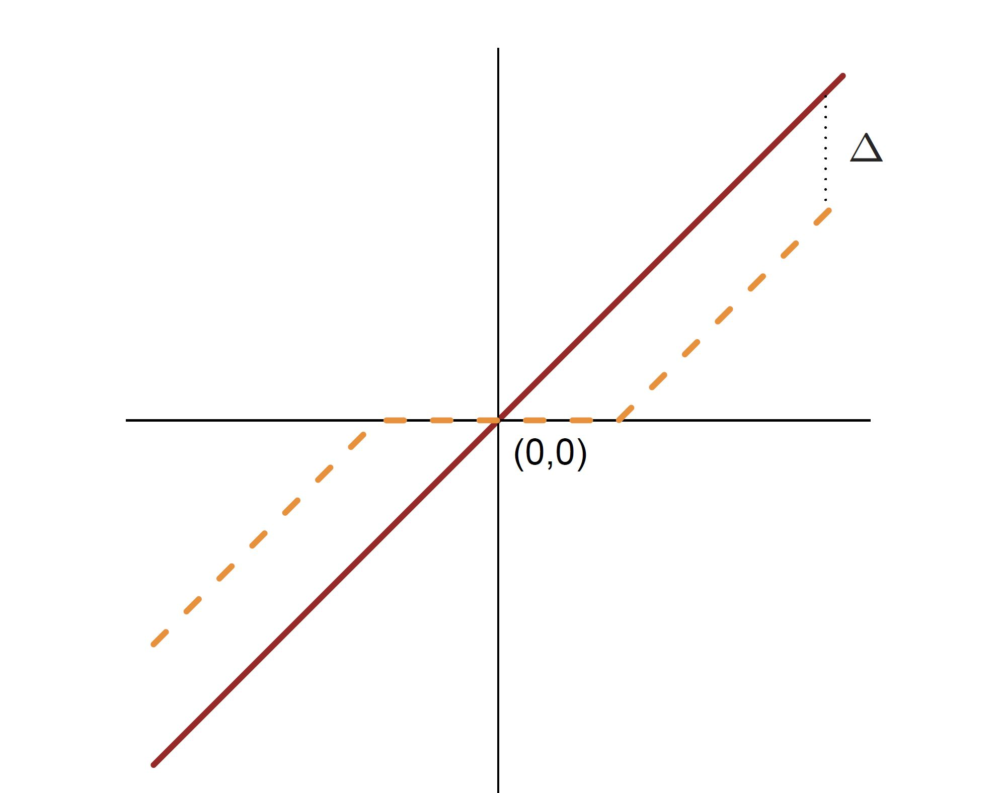
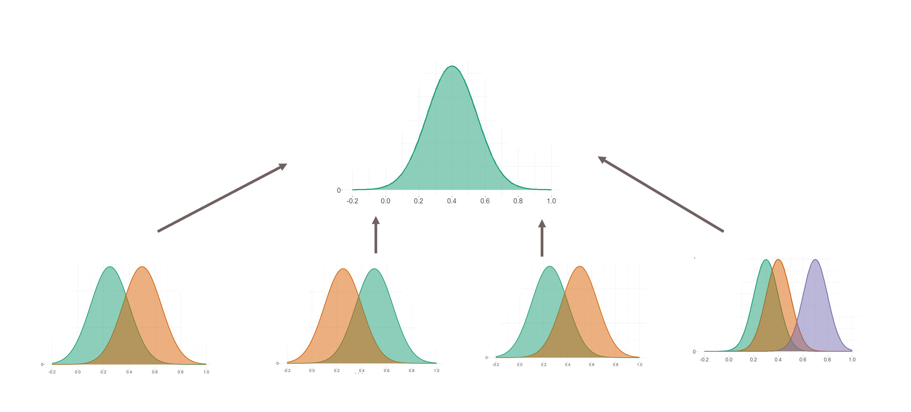

```{r setup, include=FALSE}
library(knitr)
knitr::opts_chunk$set(tidy = FALSE, 
                      message = FALSE,
                      warning = FALSE,
                      echo = FALSE, 
                      fig.width=8,
                      fig.height=6,
                      fig.align = "center",
                      fig.retina = 2)
options(htmltools.dir.version = FALSE)
library(magick)
```


## Penalised LDA

Recall: LDA involves the eigen-decomposition of $\color{orange}{\Sigma^{-1}\Sigma_B}$, where

$$\small{\Sigma_B = \frac{1}{K}\sum_{i=1}^{K} (\mu_i-\mu)(\mu_i-\mu)'}$$

$$\small{\Sigma = \frac{1}{n} \sum_{i=1}^{n} (x_i-\mu_i)(x_i-\mu_i)'}$$

The eigen-decomposition is an analytical solution to a sequential optimisation problem: 


\begin{align*}
& \small{\underset{{\beta_k}}{\text{maximize}} \beta_k^T\hat{\Sigma}_B \beta_k} \\
& \small{\mbox{ subject to  }  \beta_k^T\hat{\Sigma} \beta_k \leq 1, \beta_k^T\hat{\Sigma}\beta_j = 0 \mbox{  } \forall i<k}
\end{align*}


---
## Penalised LDA

The problem is inverting $\color{orange}{\Sigma^{-1}}$, fix it by

\begin{align*}
& \underset{{\beta_k}}{\text{maximize}} \left(\beta_k^T\hat{\Sigma}_B \beta_k + \lambda_k \sum_{j=1}^p |\hat{\sigma}_j\beta_{kj}|\right)\\
& \mbox{ subject to  }  \beta_k^T\tilde{\Sigma} \beta_k \leq 1
\end{align*}

where $\hat{\sigma}_j$ is the within-class standard deviation for variable $j$. This is 
.orange[penalised LDA], and see [reference](https://faculty.washington.edu/dwitten/Papers/JRSSBPenLDA.pdf), and the [R package](https://cran.r-project.org/web/packages/penalizedLDA/index.html). 

```{r}
library(penalizedLDA)
```


---
## PDA Index

<br>

Penalised LDA projection pursuit index. Available in the `tourr` package. 

\begin{align*}
I_{PDA}(A,\lambda) =
1-\frac{\Big|A'\big\{(1-\lambda)\hat{\Sigma}+n\lambda I_p\big\}A\Big|} {\Big|A'\big\{(1-\lambda)(\hat{\Sigma}_B +\hat{\Sigma})+n\lambda I_p\big\} A\Big|}
\end{align*}

Optimising this function over $p\times d$ projection matrix $A$. 

```{r}
library(tourr)
```


---

class: split-two

.column[.pad50px[

## Diagonal Discriminant Analysis

<br>
- The simplest form of regularisation assumes that the features are independent within each class. 
- Consider a *diagonal-covariance* LDA rule for classifying classes
- A special case of the naive-Bayes classifier

]]
.column[.content.vmiddle.center[

```{r, warning = FALSE, message = FALSE}
library(tidyverse)
library(mvtnorm)

s <- matrix(c(4,2,2,3), ncol = 2)
s1 <- matrix(c(4, -0.6,-0.6, 3), ncol=2)
s2 <- matrix(c(4,-0.08,-0.08,3), ncol = 2)

m1 <- c(0, 0)
m2 <- c(-3, 4)
m3 <- c(2,3)
n <- 1000

set.seed(42)
x1 <- rmvnorm(n = n, mean = m1, sigma = s2)
x2 <- rmvnorm(n = n, mean = m2, sigma = s1)
x3 <- rmvnorm(n = n, mean = m3, sigma = s)


d <- data.frame(rbind(x1,x2,x3))
d$class <- as.factor(rep(c("1", "2", "3"), each = 1000))

p2 <- ggplot(d, aes(x = X1, y = X2, group = class, color =class)) +
  geom_point(alpha = .5) +
  geom_density_2d() + 
  scale_colour_brewer(palette = "Dark2") +
  theme_minimal() +
  theme(text = element_text(size=20),
        legend.position = "bottom")


  
library(ggExtra)
ggMarginal(p2, groupFill = TRUE, groupColour = TRUE)
```

]]


---
## Discriminant Function

It can be shown that the discriminant score for a new observation $\mathbf{x}^*$ when the features are considered independent reduces to the following:

$$\delta_k(\mathbf{x}^*) = - \sum_{j=1}^{p}\frac{(x_j^* - \bar{x}_{kj})^2}{s^2_j} + 2\log \pi_k.$$

The classification rule is then

$$C(\mathbf{x}^*) = \ell \quad \mbox{if} \quad \delta_{\ell}(\mathbf{x}^*) = \max_k \delta_k(\mathbf{x}^*).$$


---

## Filter features for prediction

To motivate the upcoming method, consider a binary classification DLDA problem. 

One way we could establish which of the features are driving prediction would be to perform a two-sample $t$-test 

$$t_{j} = \frac{\bar{x}_{1j} - \bar{x}_{0j}}{s_j}$$
with the $t$ statistic providing a measure of how significant the difference in class means for predictor $j$. 


---

## Filter features for prediction

.green[Think about it:] Using the $t$ statistic -  $t_{j} = \frac{\bar{x}_{1j} - \bar{x}_{0j}}{s_j}$ for all features, what is one way we can determine important features for prediction?


```{r}
library(countdown)
countdown(minutes = 0, seconds = 32, left = "0")
```
---

## Filter features for prediction

.orange[Answer:] Can consider filtering for features with $\lvert t_j \lvert > 2$, as this is deemed significant at the 5% level.

```{r, fig.height = 5}

funcShaded <- function(x) {
    y <- dt(x, df = 30)
    y[ abs(x) < 2] <- NA
    return(y)
}

p_t <- ggplot(data.frame(t = c(-4, 4)), aes(x = t)) +
       stat_function(fun = dt, args = list(df = 30), size = 1.2) +
       stat_function(fun=funcShaded, geom="area", fill="#1b9e77", alpha=0.5) +
       scale_x_continuous(name = "t",
                     breaks = seq(-4, 4, 2),
                     limits=c(-4, 4)) +
       scale_y_continuous(name = "Density") +
       scale_colour_brewer(palette="Dark2") +
       theme_minimal() +
       theme(text = element_text(size=20))
p_t
```

.font_tiny[Note - further consideration can be given to the issue of [*Multiple Testing*](https://en.wikipedia.org/wiki/Multiple_comparisons_problem)]

---

## Nearest Shrunken Centroids (NSC)

Now consider the following statistic,

<br>

$$d_{kj} = \frac{\bar{x}_{kj} - \bar{x}_j}{m_k(s_j + s_0)} \quad \mbox{with} \quad m_k^2 = \frac{1}{N_k} - \frac{1}{N}$$
and $s_0$ a small value to protect $d_{kj}$ from small expression values.

<br>
This statistic is a  measure for how significant the difference between the class $k$ mean for predictor $j$, and the overall mean for predictor $j$.

---

##  Soft Thresholding

Each $d_{kj}$ is reduced by an amount $\Delta$ in absolute value, and is set to zero if its absolute value is less than zero.

$$d'_{kj} = \mbox{sign}(d_{kj})( \lvert d_{kj} \lvert - \Delta)_{+},$$
<center>
 
</center>
---
## Nearest Shrunken Centroids Classifier

The NSC uses either version of the statistic $d'_{kj}$ to regularise by shrinking the class means towards the overall mean for each predictor separately as follows:

$$\bar{x}'_{kj} = \bar{x}_j + m_k(s_j + s_0)d'_{kj}$$

<br>

.green.center[Unless a predictor has a significant difference to the overall mean for at least one class, it is useless for classification.]

We then use the shrunken centroids $\bar{x}'_{kj}$ in place of $\bar{x}_{kj}$ in the DLDA discriminant function.

---

## Alternative - penalised multiple hypothesis testing (multiDA)

<br>

Another approach to high dimensional DA involves formulating the problem as a multiple hypothesis testing problem, and asking the question - .orange["What defines a discriminative feature?"], and then choosing discriminative features through a penalised likelihood ratio test.


---
class: split-50

.column[.pad10px[
## LRT – compare to the null

.green[For `\\(K=3\\)` classes, there are `\\(m=5\\)` potential partitions of the data.]


]]
.column[.pad10px[
For all 5 hypotheses, compare the likelihood to the null. Pick the "partition" that is the most likely.

<center>



</center>
]]

---

## A penalised likelihood ratio test statistic

Two forms of penalisation can be considered:

- .green[The BIC] - useful when Positive Selection Rate is preferred to controlling False Discovery Rate (FDR). 
$$\nu_m \log(n)$$
- .green[The Extended BIC] - useful for high dimensional data, penalising additionally on the number of features $p$.
$$\nu_m[\log(n) + 2\log(p)]$$

.font_small[(Note - `\\(\nu_m = g_m - 1\\)` where `\\(g_m\\)` is the number of groupings considered in model `\\(m\\)`). ]

---

class: split-two

.column[.pad50px[
## Recall -  SRBCT cancer prediction 

- The SRBCT dataset (Khan et al., 2001) looks at classifying 4 classes of different childhood tumours sharing similar visual features during routine histology.
- Data contains 83 microarray samples with 1586 features.
- .orange[We will revisit this data later on in the course to explore high dimensional DA.] `r anicon::nia("Now is that time")`


]]

.column[.content.vmiddle.center[

 

.purple[Source:] [Nature](https://www.nature.com/articles/modpathol2016119)

]]

---
class: split-60

.column[.pad50px[

## multiDA in R
 
<br>

```{r, eval = TRUE, echo = TRUE}
#remotes::install_github("sarahromanes/multiDA")
library(multiDA)
res <- multiDA(y = SRBCT$y, 
               X = SRBCT$X,
               penalty = "EBIC",
               equal.var = TRUE,
               set.options = "exhaustive")
```  

We can then examine the class groupings using the `plot()` method for `multiDA`:

```{r, eval = FALSE, echo = TRUE}
plot(res, ranks=1)
```


 ]]

.column[.content.vmiddle.center[

```{r}
plot(res, ranks= 1)
```


]]


---

## Compare performance - 100 trial, 5 fold CV

```{r, fig.width=12}
load("data/SRBCT.RData")
data$as.factor.ours.=as.factor(data$as.factor.ours.)
library(ggthemes)
library(ochRe)
p_cv <- ggplot(data, aes(x = labels, y = 1-vals, fill=as.factor.ours.)) +
              geom_boxplot() +
              scale_fill_manual(values = c("thistle4","thistle3"))+
              theme_hc() +
              theme(legend.position="none",
                    text = element_text(size=18)) +ylab("Accuracy (%)") + xlab(" ") 
    
p_cv
```

---

layout: false
# `r set.seed(2020); emo::ji("technologist")` Made by a human with a computer

### Slides at [https://iml.numbat.space](https://iml.numbat.space).
### Code and data at [https://github.com/numbats/iml](https://github.com/numbats/iml).
<br>

### Created using [R Markdown](https://rmarkdown.rstudio.com) with flair by [**xaringan**](https://github.com/yihui/xaringan), and [**kunoichi** (female ninja) style](https://github.com/emitanaka/ninja-theme).

<br> 
<a rel="license" href="http://creativecommons.org/licenses/by-sa/4.0/"></a><br />This work is licensed under a <a rel="license" href="http://creativecommons.org/licenses/by-sa/4.0/">Creative Commons Attribution-ShareAlike 4.0 International License</a>.
