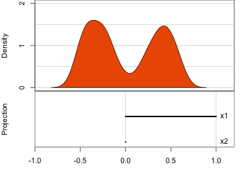
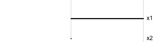
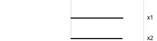
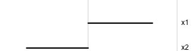
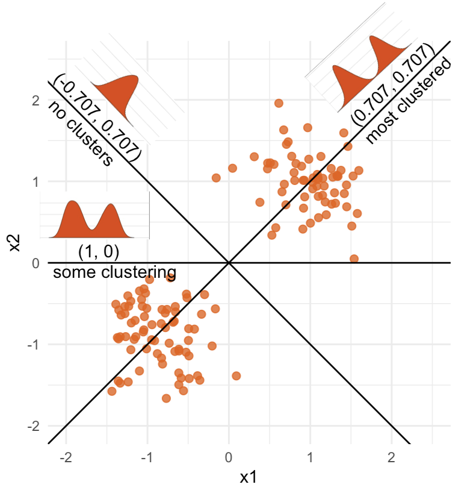
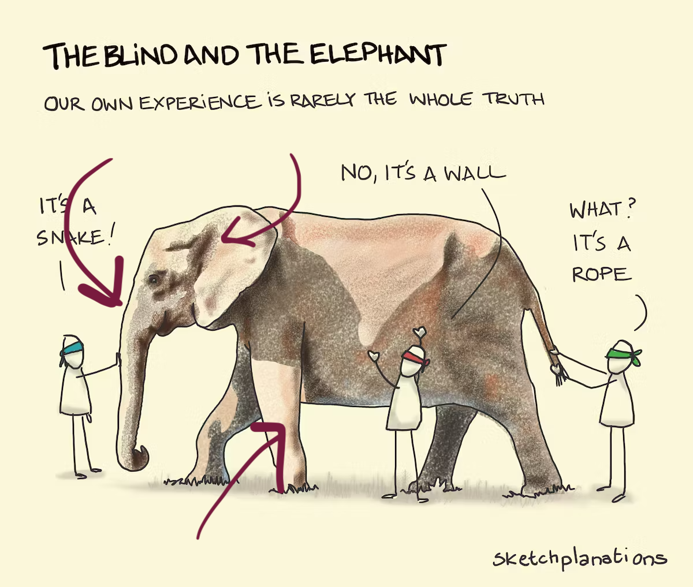
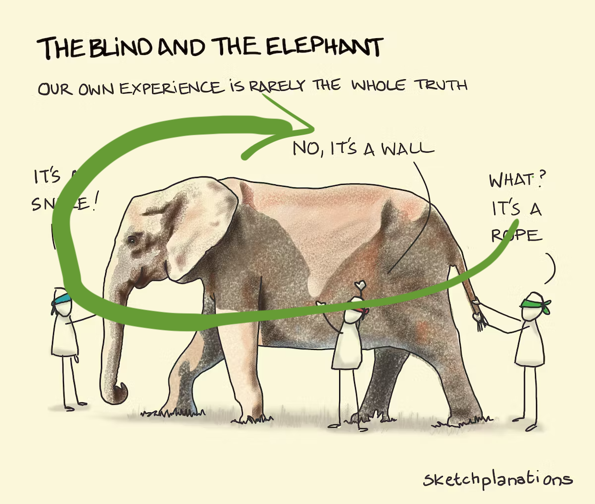
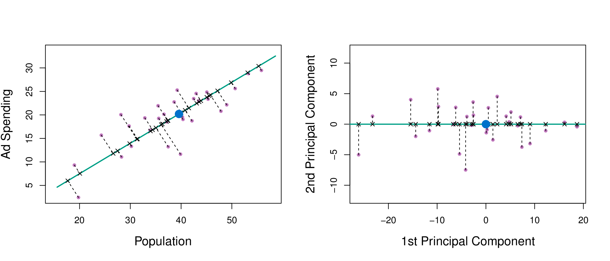
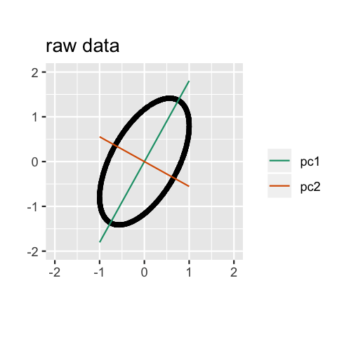
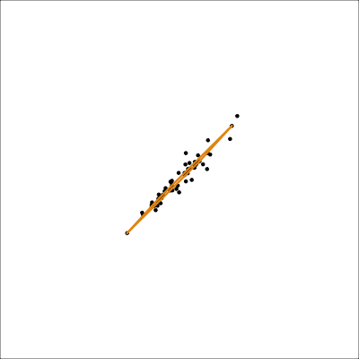

```{r, include = FALSE}
source("../setup.R")

#my.dir <- "C:/Users/jjew0003/Documents/Monash Teaching/ETC3250-5250/S12026"

knitr::knit_hooks$set(crop = knitr::hook_pdfcrop)
#https://www.pmassicotte.com/posts/2022-08-15-removing-whitespace-around-figures-quarto/
```

## Overview

In this week we will cover:

::: {.incremental}

- Conceptual framing for visualisation
- Common methods: scatterplot matrix, parallel coordinates, tours
- Details on using tours for examining clustering and class structure
- Dimension reduction
    - Linear: principal component analysis
    - Non-linear: multidimensional scaling, t-stochastic neighbour embedding (t-SNE), uniform manifold approximation and projection (UMAP)
- Using tours to assess dimension reduction

:::

<!--
Visulaisation and dimension reduction related

Special focus on tour, as this is my favourite 

Finally a comparison between the two 
-->


## Concepts {.transition-slide .center}

## Model-in-the-data-space

:::: {.columns}
::: {.column width=50% .fragment}

{width=450 style="font-size: 50%;"}

:::
::: {.column width=50%}

::: {.incremental}

- We plot the [model on the data]{.monash-orange2} to assess whether it [fits]{.monash-orange2} or is a [misfit]{.monash-orange2}!
- **Model-in-the-data-space**: data space means we plot the data
- Gold standard to see in which parts of the space the model fits or misfits
- Easy if you have a univariate feature and univariate response
- Doing this in high-dimensions is difficult! 
- So it is common to flip this and only plot the [*data-in-the-model-space*]{.monash-blue2}.

:::

:::

::::

<!--
Plot the model on the data to see if it fits the data well or not

Red line is model fitted to the data - points in the backgound

If you have univariate data this is easy, univariate reponse and univariate predictors. Can see which fits well where 

Gold standard to plot model on data
-->

## Data-in-the-model-space

<!--
Example of common practice
-->

Consider a machine learn model $\hat{p}(x_i)$ predicting the probability of being class A or class B. What do we learn for these plots?

:::: {.columns}
::: {.column .fragment}
```{r echo=FALSE}
#| label: data-in-model-space1
#| fig-width: 4
#| fig-height: 4
#| out-width: 40%
#| crop: true

#w <- read_csv("C:/Users/jjew0003/Documents/Monash Teaching/ETC3250-5250/S12026/week2/../data/sine-curve.csv") |>
#  mutate(cl = factor(cl))

w <- read_csv(here::here("../data/sine-curve.csv")) |>
  mutate(cl = factor(cl))
w_lda <- lda(cl~x1+x2, data=w)
w_lda_pred <- predict(w_lda, w, method="predictive")$posterior |>
  as_tibble(.name_repair="unique")
w_lda_pred |> 
  bind_cols(w) |>
  select(`A`, cl) |>
  ggplot(aes(x=`A`, colour=cl, fill=cl)) + 
    geom_density(alpha=0.7) +
    xlab("Prob class A") +
    #ggtitle("Linear DA") + 
    ggtitle("Simple Parametric") + 
    theme(legend.position="none")
  
```

::: {.incremental}

- Density plot (continuous histogram) of $\hat{p}(x_i)$
- Colours are the true class
- We are plotting the model not the data

:::

:::
::: {.column .fragment}
```{r echo=FALSE}
#| label: data-in-model-space2
#| fig-width: 4
#| fig-height: 4
#| out-width: 40%
#| crop: true
#w_rf <- randomForest(cl~x1+x2, data=w, ntree=200)
#w_rf_pred <- predict(w_rf, w, type="prob") |>
#  as_tibble(.name_repair="unique")
#w_rf_pred |> 
#  bind_cols(w) |>
#  select(`A`, cl) |>
#  ggplot(aes(x=`A`, colour=cl, fill=cl)) + 
#    geom_density(alpha=0.7) +
#    xlab("Prob class A") +
#    ggtitle("Flexible Non-parametric") + 
#    #ggtitle("Random forest") + 
#    theme(legend.position="none")
library(kknn)

w_knn <- kknn(cl~x1+x2, train=w, test = w, k=7, kernel = "rectangular")
w_knn_pred <- predict(w_knn, w, type="prob") |>
  as_tibble(.name_repair="unique")
w_knn_pred |> 
  bind_cols(w) |>
  select(`A`, cl) |>
  ggplot(aes(x=`A`, colour=cl, fill=cl)) + 
    geom_density(alpha=0.7) +
    xlab("Prob class A") +
    ggtitle("Flexible Non-parametric") + 
    #ggtitle("Random forest") + 
    theme(legend.position="none")
```  

::: {.incremental}

- The right-hand model is correctly more confident in its predictions, closer to 0 and closer to 1
- Expect to have higher ROC-AUC


:::

:::

::::

::: {.fragment}
[But it doesn't tell you why there is a difference.]{.monash-orange2}
:::

<!--
What we mean by, in the model space, is that we are plotting the model output, not the data
-->

## Model-in-the-data-space

<!--
This is why we want model-in the data space
-->

Plot the data, and depict the model in this space. What do we learn here?

```{r}
#| label: model-in-the-data-space1
#| echo: false
#| fig-width: 4
#| fig-height: 4
#| out-width: 60%
library(geozoo)
w_grid <- cube.solid.random(p=2)$points
colnames(w_grid) <- c("x1", "x2")
w_grid <- w_grid |> as_tibble() |>
  mutate(x1 = x1*(max(w$x1)-min(w$x1)+min(w$x1)),
         x2 = x2*(max(w$x2)-min(w$x2)+min(w$x2)))
w_lda <- lda(cl~x1+x2, data=w)
w_lda_pred <- predict(w_lda, w_grid)$class
#w_rf <- randomForest(cl~x1+x2, data=w, ntree=200)
w_knn <- kknn(cl~x1+x2, train=w, test = w_grid, k=7, kernel = "rectangular")
w_knn_pred <- predict(w_knn, w_grid, type = "raw")
w_grid <- w_grid |>
  mutate(plda = w_lda_pred,
         prf = w_knn_pred)
ggplot(w_grid, aes(x=x1, y=x2, colour = plda)) +
  geom_point(alpha=0.5, size=2) +
  geom_text(data=w, aes(x=x1, y=x2, label=cl), colour="black") +
  scale_color_discrete_qualitative() +
  scale_color_viridis_d() +
  ggtitle("Simple Parametric") + 
  #ggtitle("Linear DA") +
  theme(legend.position = "none",
        axis.text = element_blank())
```

<!--
Coloured point simulated, simulate data in the  range that covers all data points and evaluate modle, allows you to see non-linnear structure. Use predicted a smost models don't allow for closed mathematical formula 

Model is displayed in the data space
-->


## Model-in-the-data-space

<!--
This is why we want model-in the data space
-->

```{r}
#| label: model-in-the-data-space2
#| echo: false
#| fig-width: 4
#| fig-height: 4
#| out-width: 60%
ggplot(w_grid, aes(x=x1, y=x2, colour = prf)) +
  geom_point(alpha=0.5, size=2) +
  geom_text(data=w, aes(x=x1, y=x2, label=cl), colour="black") +
  scale_color_discrete_qualitative() +
  scale_color_viridis_d() +
  ggtitle("Flexible Non-parametric") + 
  #ggtitle("Random forest") +
  theme(legend.position = "none",
        axis.text = element_blank())
```


::: {.fragment}
[One model has a linear boundary, and the other has the highly non-linear boundary, which matches the class cluster better.]{.monash-orange2}
:::

<!--
We learn why RF is better, RF is more confident as it correctly identifies the difference between the two groups

Learn why one is better than another

This is gold standard, sadly we can only view this for 2-d predictors. Could plot for more but it get tricky
-->

## How do you visualise beyond 2D? {.transition-slide .center}

## Scatterplot matrix

:::: {.columns}
::: {.column }
```{r}
#| label: load-penguins
#| fig-width: 4
#| fig-height: 4
#| echo: false
library(palmerpenguins)
p_tidy <- penguins |>
  select(species, bill_length_mm:body_mass_g) |>
  rename(bl=bill_length_mm,
         bd=bill_depth_mm,
         fl=flipper_length_mm,
         bm=body_mass_g)  |>
  drop_na()
ggpairs(p_tidy, columns=2:5) +
  theme(axis.text = element_blank())
```
:::
::: {.column}

::: {.incremental}

- [Start simply!]{.monash-orange2} *Make static plots that organise the variables on a page.*
- Plot all the pairs of variables 
- When laid out in a matrix format this is called a scatterplot matrix.
- Upper diagonal same as lower diagonal so replaced by some summary
- Here, we see 
  - [linear association]{.monash-blue2},
  - [clustering]{.monash-blue2} (*seperated data points*)
  - [clumping]{.monash-blue2} (*un-seperated points with high concnetration*)
  - potentially some [outliers]{.monash-blue2}.
  
:::

:::

::::

<!--
Shows importance of clustering, whole data loosk to have negate correlation, but each cluster positive

-->

<!--
Clumping, less well defined clusters, clusters are seperated, not seperated, but higher concentration is a clump
-->

## Scatterplot matrix

:::: {.columns}
::: {.column width=60%}
```{r}
#| label: load-penguins-response
#| fig-width: 5
#| fig-height: 5
#| out-width: 80%
#| echo: false
library(palmerpenguins)
p_tidy <- penguins |>
  select(species, bill_length_mm:body_mass_g) |>
  rename(bl=bill_length_mm,
         bd=bill_depth_mm,
         fl=flipper_length_mm,
         bm=body_mass_g) 
#ggpairs(p_tidy, columns=2:5) +
ggpairs(p_tidy, columns=2:5, mapping = ggplot2::aes(color = species)) +
  theme(axis.text = element_blank())
```
:::
::: {.column width=40%}

::: {.incremental}

- If there is a response variable include it
- A continuous response could just be plotted like another variable. 
- Here I use colours to differentiate the penguin species.
- If there was also a fitted model the colour could be the predicted class

  
:::

:::

::::

## Scatterplot matrix: drawbacks

<br>

It's difficult to plot large numbers of variables

::: {.fragment}

```{r}
#| code-fold: true
#| echo: false
#| label: hiding1
set.seed(946)
d <- tibble(x1=rnorm(200, 0, 1), 
            x2=runif(200, -1, 1), 
            x3=runif(200, -1, 1),
            x4=rnorm(200, 0, 1), 
            x5=runif(200, -1, 1), 
            x6=runif(200, -1, 1),
            x7=rnorm(200, 0, 1), 
            x8=runif(200, -1, 1), 
            x9=runif(200, -1, 1))


```


```{r}
#| label: visible1
#| fig-width: 4
#| fig-height: 4
#| echo: false
ggpairs(d) +
  theme(axis.text = element_blank())
```

:::

## Scatterplot matrix: drawbacks

```{r}
#| code-fold: true
#| echo: false
#| label: hiding2
set.seed(946)
d <- tibble(x1=runif(200, -1, 1), 
            x2=runif(200, -1, 1), 
            x3=runif(200, -1, 1))
d <- d %>%
  mutate(x4 = x3 + runif(200, -0.1, 0.1))
d <- bind_rows(d, c(x1=0, x2=0, x3=-0.5, x4=0.5))

d_r <- d %>%
  mutate(x1 = cos(pi/6)*x1 + sin(pi/6)*x3,
         x3 = -sin(pi/6)*x1 + cos(pi/6)*x3,
         x2 = cos(pi/6)*x2 + sin(pi/6)*x4,
         x4 = -sin(pi/6)*x2 + cos(pi/6)*x4)

```


:::: {.columns }

::: {.column width=50% .fragment}

```{r}
#| label: visible2
#| fig-width: 4
#| fig-height: 4
#| echo: false
#| out-width: 60%
#| crop: true
ggpairs(d) +
  theme(axis.text = element_blank())
```


::: {.incremental}

- Can see $x_3$ and $x_4$ are highly dependent besides one outlier
- Not obvious when looking at each margin

:::

:::

::: {.column width=50% .fragment}

```{r}
#| label: invisible
#| fig-width: 4
#| fig-height: 4
#| echo: false
#| out-width: 60%
#| crop: true
ggpairs(d_r) +
  theme(axis.text = element_blank())
```

::: {.incremental}

- There is also an outlier here
- You just can't see it ... yet
- We will return to this with a tour

:::

:::
::::


```{r}
#| eval: false
#| echo: false
# Code to make the plots
ggscatmat(d)
animate_xy(d)
render_gif(d,
           grand_tour(),
           display_xy(
             axes="bottomleft", cex=2.5),
           gif_file = "gifs/anomaly1.gif",
           start = basis_random(4, 2),
           apf = 1/60,
           frames = 1500,
           width = 500, 
           height = 400)
ggscatmat(d_r)
animate_xy(d_r)
render_gif(d_r,
           grand_tour(),
           display_xy(
             axes="bottomleft", cex=2.5),
           gif_file = "gifs/anomaly2.gif",
           start = basis_random(4, 2),
           apf = 1/60,
           frames = 1500,
           width = 500, 
           height = 400)

dsq <- tibble(x1=runif(200, -1, 1), 
            x2=runif(200, -1, 1), 
            x3=runif(200, -1, 1))
dsq <- dsq %>%
  mutate(x4 = x3^2 + runif(200, -0.1, 0.1))
dsq <- bind_rows(dsq, c(x1=0, x2=0, x3=0, x4=1.1))
dsq <- bind_rows(dsq, c(x1=0, x2=0, x3=0.1, x4=1.05))
dsq <- bind_rows(dsq, c(x1=0, x2=0, x3=-0.1, x4=1.0))
ggscatmat(dsq)
animate_xy(dsq, axes="bottomleft")
dsq_r <- dsq %>%
  mutate(x1 = cos(pi/6)*x1 + sin(pi/6)*x3,
         x3 = -sin(pi/6)*x1 + cos(pi/6)*x3,
         x2 = cos(pi/6)*x2 + sin(pi/6)*x4,
         x4 = -sin(pi/6)*x2 + cos(pi/6)*x4)
ggscatmat(dsq_r)
animate_xy(dsq_r, axes="bottomleft")
```

## Perception

::: {.info .fragment}
Aspect ratio for scatterplots needs to be equal, or square!
:::

::: {.incremental}

- Most software renders scatter plots as rectangles, with unequal aspect ratio
- You need to over-ride this and force the square aspect ratio. 
- Why? 

:::

<!--
setup.R imposes equal aspect ratio
-->

:::: {.columns}
::: {.column width=50%}

::: {.fragment}

Because it adversely [affects the perception of correlation and association]{.monash-orange2} between variables. 

:::

:::

::: {.column width=50%}

::: {.fragment}

```{r}
#| label: aspectratio
#| fig-width: 8
#| fig-height: 4
#| out.width: 80%
#| echo: false
p <- ggplot(p_tidy, aes(x=fl, y=bm)) + geom_point() + 
  ggtitle("Yes") +
  theme(axis.title = element_blank(),
        axis.text = element_blank(), 
        plot.title = element_text(hjust = 0.5)) 
pp <- p + ggtitle("Nope")+ 
  theme(aspect.ratio=0.6, 
        axis.title = element_blank(),
        axis.text = element_blank(), 
        plot.title = element_text(hjust = 0.5)) 
# Note aspect.ratio=1 is default plot setting for slides
grid.arrange(pp, p, ncol=2)
```

:::

:::
::::

## Parallel coordinate plot

:::: {.columns}
::: {.column width=45% .fragment}
```{r}
#| fig-width: 4
#| fig-height: 4
#| out-width: 100%
#| crop: true
ggparcoord(p_tidy, columns = 2:5, alphaLines = 0.5) + 
  xlab("") + ylab("") + 
  theme(aspect.ratio=0.8)
```
:::
::: {.column width=55% .fragment}

::: {.incremental}

- $x$-axis is the variables, $y$-axis their value
- Values from each observation (row) connected with a line. 
- Examine the direction and orientation of lines to perceive multivariate relationships.
  - [Crossing lines]{.monash-orange2} indicate negative association. 
  - Lines with [same slope]{.monash-orange2} indicate positive association. 
  - Outliers have a [different up/down pattern]{.monash-orange2} to other points.   
  - [Groups]{.monash-orange2} of lines with [same pattern]{.monash-orange2} indicate clustering.
- Can plot many more variables here than a scatter plot matrix 

:::
:::

::::

## Parallel coordinate plot

:::: {.columns}
::: {.column .fragment}
```{r}
#| fig-width: 4
#| fig-height: 4
#| out-width: 100%
ggparcoord(p_tidy, columns = 2:5, alphaLines = 0.5, mapping = ggplot2::aes(color = species)) + 
  xlab("") + ylab("") + 
  theme(aspect.ratio=0.8)
```
:::
::: {.column .fragment}

::: {.incremental}

- Again, if you have a response variable plot this also 
- or predictions from your model

:::
:::

::::

## Parallel coordinate plot: drawbacks


::: {.incremental}

- Hard to follow lines - needs to be interactive
- Order of variables matters - you see something different with different ordering
- Scaling of variables matters

:::

<br>

::: {.fragment}

But the advantage is that you can pack a lot of variables into the single page.
:::


## Parallel coordinate plot: effect of scaling

:::: {.columns}
::: {.column .fragment}
```{r}
#| fig-width: 4
#| fig-height: 4
#| out-width: 100%
ggparcoord(p_tidy, columns = 2:5, alphaLines = 0.5,
           scale="globalminmax") + 
  xlab("") + ylab("") + 
  theme(aspect.ratio=0.8)
```
:::
::: {.column  .fragment}
```{r}
#| fig-width: 4
#| fig-height: 4
#| out-width: 100%
ggparcoord(p_tidy, columns = 2:5, alphaLines = 0.5,
           scale="uniminmax") + 
  xlab("") + ylab("") + 
  theme(aspect.ratio=0.8)
```
:::

::::

## Scaling

::: {.incremental}

- Often data are scaled in some way in order to make them comparable
- We want out method to be able to compare body mass in grams (in the 1000s) and length in meters (in the 0.1s)
- We don't want our analysis to change of we move from grams to kilograms of meters to centimeters
  - Standardisation $x_{ij} \mapsto  \frac{x_{ij} - m_j}{s_j}$
  - $m_j = \frac{1}{n}\sum_{i=1}^nx_{ij}$ and $s_j = \sqrt{\frac{1}{n}\sum_{i=1}^n(x_{ij} - m_j)^2}$
  - Standardised observations have mean 0 and variance one
  - MinMax $x_{ij} \mapsto  \frac{x_{ij} - l_j}{u_j - l_j}$
  - $l_j = \min_{1, \ldots, n} x_{ij}$ and $u_j = \min_{1, \ldots, n} x_{ij}$
  - Scaled data will be between 0 and 1


:::

<!--
MinMax allows you to exactly identify where the max values are
-->


## Parallel coordinate plot: effect of ordering


<!--
Colours are the 3 species of penguins 
-->


:::: {.columns}
::: {.column .fragment}
```{r}
#| fig-width: 4
#| fig-height: 4
#| out-width: 100%
#| crop: true
ggparcoord(p_tidy, columns = 2:5, alphaLines = 0.5,
           groupColumn = 1) + 
  scale_color_discrete_divergingx(palette = "Zissou 1") +
  xlab("") + ylab("") +
  theme(legend.position="none", aspect.ratio=0.8)
```
:::
::: {.column .fragment}

Ordered to have 'minimal' crossing

::: {.fragment}

```{r}
#| fig-width: 4
#| fig-height: 4
#| out-width: 80%
#| crop: true
ggparcoord(p_tidy, columns = 2:5, alphaLines = 0.5,
           groupColumn = 1, order=c(4, 2, 5, 3)) + 
  scale_color_discrete_divergingx(palette = "Zissou 1") +
  xlab("") + ylab("") +
  theme(legend.position="none", aspect.ratio=0.8)
```

:::
:::


::::


<!--
Can order based on minising the number of crosses

Bad that we can get different insights form the same data viewed two ways, says the insigh comes form the view not the data
-->

## A problem

<br>

::: {.incremental}
- This is a problem
- We get different insights from the same data viewed different ways
- This means in insights are coming from the view, not the data

:::

## Adding interactivity to static plots: scatterplot matrix

:::: {.columns}
::: {.column .fragment}

```{r}
#| label: interactive-scatmat1
#| include: FALSE
#| eval: FALSE
library(plotly)
g <- ggpairs(p_tidy, columns=2:5) +
  theme(axis.text = element_blank()) 

#ggplotly(g$plots[[1]], width=600, height=600)
```

```{r}

library(plotly)
library(dplyr)

pairwise_plotly <- function(data, vars) {
  
  df <- data |> select(all_of(vars))
  n <- length(vars)
  
  plot_list <- vector("list", n * n)
  
  k <- 1
  for (i in seq_len(n)) {
    for (j in seq_len(n)) {
      
      xvar <- vars[j]
      yvar <- vars[i]
      
      # Diagonal: histogram
      if (i == j) {
        p <- plot_ly(df, x = df[[xvar]], type = "histogram",
                     marker = list(color = "steelblue")) |>
          plotly::layout(xaxis = list(title = xvar),
                 yaxis = list(title = "Count"))
        
      } else {
        # Off-diagonal: scatter
        p <- plot_ly(df,
                     x = df[[xvar]],
                     y = df[[yvar]],
                     type = "scatter",
                     mode = "markers",
                     marker = list(size = 5,
                                   opacity = 0.7,
                                   color = "darkred")) |>
          plotly::layout(xaxis = list(title = xvar),
                 yaxis = list(title = yvar))
      }
      
      plot_list[[k]] <- p
      k <- k + 1
    }
  }
  
  subplot(plot_list,
          nrows = n,
          shareX = TRUE,
          shareY = TRUE,
          titleX = TRUE,
          titleY = TRUE)
}

```

::: {.fragment}

Selecting points, using `plotly`, allows you to see where this observation lies in the other plots (pairs of variables). 

:::

:::
::: {.column .fragment}

```{r}
#| label: interactive-scatmat2


pairwise_plotly(p_tidy, vars = c("bl", "bd", "fl", "bm"))
```

:::
::::


## Adding interactivity to static plots: parallel coordinates

<!--
No longer ggplot, bit more coding required
-->

:::: {.columns}
::: {.column .fragment}
```{r}
#| label: interactive-pcp1
p_pcp <- p_tidy |>
  na.omit() |>
  plot_ly(type = 'parcoords',
          line = list(),
          dimensions = list(
            list(range = c(172, 231),
                 label = 'fl', values = ~fl),
            list(range = c(32, 60),
                 label = 'bl', values = ~bl),
           list(range = c(2700, 6300),
                 label = 'bm', values = ~bm),
            list(range = c(13, 22),
                 label = 'bd', values = ~bd)
             )
          )

```
:::
::: {.column .fragment}
```{r}
#| label: interactive-pcp2
#| out-width: 100%
p_pcp
```

- Need to drag to select observations 
- Can only drag at each variable axis

:::
::::

<!--
Can focus on the two outliers , on ein particualr interesting


We have now covered some simple methods that work well in moderate dimensions, but we really want to move onto to using tours
-->

## What is high-dimensions? {.transition-slide .center}

## High-dimensions in statistics


Increasing dimension adds an additional orthogonal axis. 

. . . 

<center>

</center>

::: {.incremental}

- The physical world is 3D
- Time is the 4th dimension, have 3D things at two different time points
- 5D dimension would be observing something 4D at different points in another dimension
- In machine learning the space that our variable live can be much more than 4D

:::


<!--
Time is 4th dimension, so we can imagine observing 3D thing at two different places, 4D is 4D thing at two differty places

You only really enconter more than 4D things when you strat to do machine learning - if you have 10 - variable each observation si sin a 10D space 
-->


## High-dimensions in statistics


If you want more high-dimensional shapes there is an R package, [geozoo](http://schloerke.com/geozoo/all/), which will generate cubes, spheres, simplices, mobius strips, torii, boy surface, klein bottles, cones, various polytopes, ... 

<br>

And read or watch [Flatland: A Romance of Many Dimensions (1884) Edwin Abbott](https://en.wikipedia.org/wiki/Flatland). 

## Remember

Data

\begin{eqnarray*}
X_{~n\times p} =
[X_{~1}~X_{~2}~\dots~X_{~p}]_{~n\times p} = \left[ \begin{array}{cccc}
x_{~11} & x_{~12} & \dots & x_{~1p} \\
x_{~21} & x_{~22} & \dots & x_{~2p}\\
\vdots & \vdots &  & \vdots \\
x_{~n1} & x_{~n2} & \dots & x_{~np} \end{array} \right]_{~n\times p}
\end{eqnarray*}

## Projections

::: {.columns}

::: {.column .fragment}

A projection takes our data from the original $p$ dimensional space to the lower $d$ $(\leq p)$ dimensional space


<br>

::: {.fragment}

The projection of ${\mathbf x_i}\in\mathbb{R}^p$ onto $A$ is $A^\top{\mathbf x}_i\in\mathbb{R}^d$.

:::

<br>

::: {.fragment}

Where $A$ is a $p\times d$ orthonormal basis with $A^\top A=I_d$.

:::

::: {.fragment}

i.e. $\sum_{i=1}^pA_{ij}^2 = 1$ for $j = 1\ldots, d$ and $\sum_{i=1}^pA_{ij}A_{ik} = 0$ for $k \neq j$

:::


:::
::: {.column .fragment}

```{r}
proj <- matrix(c(1/sqrt(2), 1/sqrt(2), 0, 
                 0, 0, 1), ncol=2, byrow=FALSE)
proj
sum(proj[,1]^2)
sum(proj[,2]^2)
sum(proj[,1]*proj[,2])
t(proj)%*%proj
```

`proj` is an orthonormal projection matrix.

:::

:::


## Projections {visibility="uncounted"}

Projection

\begin{eqnarray*}
A_{~p\times d} = \left[ \begin{array}{cccc}
a_{~11} & a_{~12} & \dots & a_{~1d} \\
a_{~21} & a_{~22} & \dots & a_{~2d}\\
\vdots & \vdots &  & \vdots \\
a_{~p1} & a_{~p2} & \dots & a_{~pd} \end{array} \right]_{~p\times d}
\end{eqnarray*}

::: {.fragment}

$A$ is a $p\times d$ orthonormal basis if $A^\top A=I_d$.

:::

::: {.fragment}

i.e. $\sum_{i=1}^pa_{ij}^2 = 1$ for $j = 1\ldots, d$ and $\sum_{i=1}^pa_{ij}a_{ik} = 0$ for $k \neq j$

:::

## Projected data {visibility="uncounted"}

Projected data

\begin{eqnarray*}
Y_{~n\times d} = XA = \left[ \begin{array}{cccc}
y_{~11} & y_{~12} & \dots & y_{~1d} \\
y_{~21} & y_{~22} & \dots & y_{~2d}\\
\vdots & \vdots &  & \vdots \\
y_{~n1} & y_{~n2} & \dots & y_{~nd} \end{array} \right]_{~n\times d}
\end{eqnarray*}

::: {.fragment}

We will view high-dimensional data in the projected space

:::

<br>

::: {.fragment}

A Tour is how we will do this

:::

## Tours of linear projections

:::: {.columns}

::: {.column width="60%" style="font-size: 75%;" .center}

::: {.fragment}

Consider a 2-dimensional (2D) dataset: $~~p=2$

:::

::: {.fragment}


Consider 1-dimensional (1D) projections of this: $~~d=1$

:::

::: {.fragment}

This leaves us with projection matrix 

\begin{eqnarray*}
A_{~2\times 1} = \left[ \begin{array}{c}
a_{~11} \\
a_{~21}\\
\end{array} \right]_{~2\times 1}
\end{eqnarray*}

with $a_{~11}^2 + a_{~21}^2 = 1$

:::

::: {.fragment}

Consider density plots of the 1D projection for different projections

:::

::: {.fragment}


{width=500 fig-alt="1D tour of 2D data. Data has two clusters, we see bimodal density in some 1D projections."}
:::

<!---
Density of one dimensional projection

Refresh to start annimation again

--->


:::

::: {.column width="30%" style="font-size: 70%;"}


::: {.fragment} 

Notice that the values of $A$ change between (-1, 1). All possible values being shown during the tour.

<br>

:::

::: {.fragment} 

Examples include

{width="30%"}
{width="30%"}
{width="30%"}

<span style="font-size: 50%;">
\begin{eqnarray*}
A = \left[ \begin{array}{c}
1 \\
0\\
\end{array} \right]
~~~~~~~~~~~~~~~~
A = \left[ \begin{array}{c}
0.7 \\
0.7\\
\end{array} \right]
~~~~~~~~~~~~~~~~
A = \left[ \begin{array}{c}
0.7 \\
-0.7\\
\end{array} \right]

\end{eqnarray*}

:::

::: {.fragment} 
<br>
watching the 1D shadows we can see:

::: {.incremental}

- unimodality 
- bimodality, there are two clusters.

:::

<!---
Bi-modal if only one variable
becomes unimodal, must cancle each other out 

--->


:::

::: {.fragment} 
<span style="color:#EC5C00"> What does the 2D data look like? Can you sketch it? </span>
:::

:::

::::

## What do projections do

<!---
The proejction defines where the axese are

https://programmathically.com/principal-components-analysis-explained-for-dummies/

--->

<!---
Projection to 1D - draw axis line could be horizontal, could be 45 degrees, projected points move perpendicular distance to that line 

--->

::: {.incremental}

- Projecting from 2D to 1D
- The projection i.e. $a_{11}$ and $a_{21}$, defines the axis
- The projected observations are moved by the perpendicular distance, to the axes

:::

::: {.fragment}

{width=600}
:::


## Tours of linear projections 


```{r}
#| echo: false
#| fig-width: 4
#| fig-height: 4
#| out-width: 70%
#| fig-alt: "Scatterplot showing the 2D data having two clusters."
data("simple_clusters")

ggplot(simple_clusters, aes(x=x1, y=x2)) +
  geom_point(size=2, alpha=0.8, colour="#EC5C00") 
```


## Tours of linear projections 

<center>
{width=600}
</center>


::: {.fragment}

We look at all of the one-dimensional shadows of the two-dimensional data

:::


## Tours of linear projections

::: {.fragment}

Consider a 3-dimensional (3D) dataset: $~~p=3$

:::

::: {.fragment}


Consider 2-dimensional (2D) projections of this: $~~d=2$

:::

::: {.fragment}

This leaves us with projection matrix 
$$
\begin{eqnarray*}
A_{~3\times 2} = \left[ \begin{array}{cc}
a_{~11} & a_{~12} \\
a_{~21} & a_{~22}\\
a_{~31} & a_{~32}\\
\end{array} \right]_{~3\times 2}
\end{eqnarray*}
$$
:::

::: {.fragment .center}

```{r}
#| echo: false
#| eval: false
library(tourr)
library(geozoo)
set.seed(1351)
d <- torus(3, n=4304)$points
d <- apply(d, 2, function(x) (x-mean(x))/sd(x))
colnames(d) <- paste0("x", 1:3)
d <- data.frame(d)
animate_xy(d, axes="bottomleft")
animate_slice(d, axes="bottomleft")
set.seed(606)
path_t2 <- save_history(d, little_tour(), 4)
render_gif(d, 
           planned_tour(path_t2),
           display_xy(col="#EC5C00",
             half_range=3,
             axes="bottomleft"),
           gif_file = "gifs/torus.gif",
           apf = 1/75,
           frames = 1000,
           width = 400, 
           height = 300)
render_gif(d, 
           planned_tour(path_t2),
           display_slice(col="#EC5C00",
             half_range=3,
             axes="bottomleft"),
           gif_file = "gifs/torus_slice.gif",
           apf = 1/75,
           frames = 1000,
           width = 400, 
           height = 300)
```
<!---
{width=700 fig-alt="Grand tour showing points on the surface of a 3D torus."}
--->

:::

<!---
Axes in original variable space 

3d axes shown in bottom left corner

High value of ptroejction emans contributing, low value not contributing

--->

<!---
Can view the axes as either rotating the data, so them moving is a rotation in high-dim space, or view the axes moving as their weight in the projection, i.e. them going between -1, 0, and 1

--->


## Tours of linear projections

<center>
{width=500 fig-alt="Grand tour showing points on the surface of a 3D torus."}
</center>

::: {.incremental}

- circular shape, some transparency, reveals middle
- hole in in some projections, no clustering

:::

::: {.fragment}

The graphic in the bottom left represents the projection, boundaries of the circle are $a_{ij} = 1$. We have two columns of our projection so two can be 1 at the same time.

:::


## Tours of linear projections

```{r}
#| echo: false
penguins <- penguins %>%
  na.omit() # 11 observations out of 344 removed
# use only vars of interest, and standardise
# them for easier interpretation
penguins_sub <- penguins %>% 
  select(bill_length_mm,
         bill_depth_mm,
         flipper_length_mm,
         body_mass_g,
         species, 
         sex) %>% 
  mutate(across(where(is.numeric),  ~ scale(.)[,1])) %>%
  rename(bl = bill_length_mm,
         bd = bill_depth_mm,
         fl = flipper_length_mm,
         bm = body_mass_g)
```

```{r}
#| eval: false
#| echo: false
set.seed(645)
render_gif(penguins_sub[,1:4],
           grand_tour(),
           display_xy(col="#EC5C00",
             half_range=3.8, 
             axes="bottomleft", cex=2.5),
           gif_file = "gifs/penguins1.gif",
           apf = 1/60,
           frames = 1500,
           width = 500, 
           height = 400)
```


:::: {.columns}

::: {.column width="60%" style="font-size: 75%;" .center}


{width=500 fig-alt="Grand tour showing the 4D penguins data. Two clusters are easily seen, and a third is plausible."}

Data is 4D: $p=4$

Projection is 2D: $d=2$

$$
\begin{eqnarray*}
A_{~4\times 2} = \left[ \begin{array}{cc}
a_{~11} & a_{~12} \\
a_{~21} & a_{~22}\\
a_{~31} & a_{~32}\\
a_{~41} & a_{~42}\\
\end{array} \right]_{~4\times 2}
\end{eqnarray*}
$$

:::
::: {.column width="30%" style="font-size: 70%;"}

<br>

We will always project to 2-dimensions as this is what we can represent on a computer screen


<br>
How many clusters do you see?

::: {.incremental} 

- three, right?
- one separated, and two very close,
- and they each have an elliptical shape.
- If clustering obvious for any projection, then variables projected to a large amount are important for that cluster

:::

<br>

::: {.incremental}

- do you also see an outlier or two?
- Are there points that move differently to everything else?

:::

:::

::::

## Intuitively, tours are like ...

<!---
Tours are like shadows

--->

<center>

</center>

## And help to see the data/model as a whole

:::: {.columns}
::: {.column .fragment}
Avoid misinterpretation ...

{width=500 fig-align="center"}
:::

::: {.column .fragment}
... see the bigger picture!

{width=500 fig-align="center"}
:::
::::

::: {.smallest}
Image: [Sketchplanations](https://sketchplanations.com/the-overview-effect).
:::

## Anomaly is no longer hidden

:::: {.columns}
::: {.column}

```{r}
#| label: invisible
#| fig-width: 4
#| fig-height: 4
#| out-width: 70%
#| echo: false
```

:::

::: {.column}

<center>
{width=500}

Wait for it!
</center>

::: {.fragment}

We see this because we are looking at combinations of variables rather than just pairs of variables

:::

::: {.fragment}

Data is rotated so we see it from all sides

:::


:::

::::

<!---
One combination of the variables where everything lines up except one observation 

--->

## How to use a tour in R

:::: {.columns}
::: {.column}

This is a [basic tour]{.monash-orange2}, which will run in your RStudio plot window. 

<!---

capabilities()

shows x11 is FALSE

--->

```{r eval=FALSE}
library(tourr)
x11()
animate_xy(flea[, 1:6], rescale=TRUE)#2d projection of any number of variables
```

::: {.fragment}
<br>
This data has a class variable, `species`. 

::: {.smaller}
```{r}
flea |> slice_head(n=3)
```
:::

Use this to [colour points]{.monash-orange2} with: 

```{r eval=FALSE}
x11()
animate_xy(flea[, 1:6], 
           col = flea$species, 
           axes = "bottomleft",
           rescale=TRUE)
```
:::

:::

::: {.column}

::: {.fragment}
You can specifically guide the tour [choice of projections]{.monash-orange2} using

```{r eval=FALSE}
#x11()
animate_xy(flea[, 1:6], 
           tour_path = guided_tour(holes()), 
           col = flea$species, 
           rescale = TRUE, 
           sphere = TRUE)# another standardisation - TO COME
```

<!---
Runs an optimisation (randomised)

--->

:::
::: {.fragment}
<br>
and you can [manually]{.monash-orange2} choose a variable to control with:

```{r eval=FALSE}
set.seed(915)
#x11()
set.seed(3)
animate_xy(flea[, 1:6], 
           radial_tour(basis_random(6, 2),
                       #mvar = 1),
                       mvar = 6), 
           rescale = TRUE,
           col = flea$species)
```

<!---
Axis only moves in variable that you specify, goes between 0 and 1 

--->

:::

::: {.fragment}

Takes this variable in an out to see how this variable is important

:::

:::

::::

<!---
Run this in R in the workshop - give intro to quarto, 

flea data default in tour package, these are flea beatles

Worth saying that even if you see seprability in lower dimensions, you still run the model for the full data - linear things etc.

--->

## How to save a tour

:::: {.columns}
::: {.column .fragment}

<center>
{width=500 fig-alt="Grand tour showing the 4D penguins data. Two clusters are easily seen, and a third is plausible."}
</center>

:::

::: {.column .fragment}
To save as an animated gif:

```{r}
#| eval: false
set.seed(645)
render_gif(penguins_sub[,1:4],
           grand_tour(),
           display_xy(col="#EC5C00",
             half_range=3.8, 
             axes="bottomleft", cex=2.5),
           gif_file = "../gifs/penguins1.gif",
           apf = 1/60,
           frames = 1500,
           width = 500, 
           height = 400)
```
:::
::::

## How to save a tour

<!---

--->

While saving a gif is useful, if you have to submit a report you may want to 'screenshot' different projections from the tour

::: {.fragment}

This can be done using the following code

:::

::: {.fragment}

```{r}
#| eval: false
set.seed(645)
f1 <- save_history(penguins_sub[,1:4], grand_tour(d = 2)) 
render(penguins_sub[,1:4], 
       planned_tour(f1), 
       display_xy(col="#EC5C00",
                  half_range=3.8, 
                  axes="bottomleft", cex=2.5), 
       apf = 1/60,
       frames = 1500,
       width = 20, 
       height = 20, 
       "pdf", "penguins_sub_tour.pdf")
```

:::

::: {.fragment}
This creates the file `penguins_sub_tour.pdf` which is a pdf where each page is a different view of the tour that the gif plays through

:::

::: {.fragment}
This is then easy to divide (or screenshot) to add to a report

:::


## Dimension reduction {.transition-slide .center}


## What have we been doing so far?

::: {.incremental}

- We have been viewing high-dimensional data $p > 2$
- In $d = 2$ dimensions (because we can plot these)
- Using projections

:::

<br>

::: {.incremental}

- We have been doing dimension reduction
- However, so far we have been looking at lots of different reductions
- Now we aim to pick one that is *optimal* in some sense 

:::


## PCA

:::: {.columns}
::: {.column }

<!---
Only allowed to use one variable, but can create that variable however you like, how would you create that variable to explain as much fo the data as possible 

data is most spread out in one direction, i.e. most varied in values

--->

::: {.fragment}

```{r}
#| echo: false
library(mvtnorm)
vc <- matrix(c(1, -0.9,  
               -0.9, 1), 
             ncol=2, byrow=TRUE)
set.seed(937)
eg1 <- rmvnorm(107, 
             mean = c(0, 0), 
             sigma = vc)
eg1 <- eg1 |>
  as_tibble()
ggplot(eg1, aes(x=V1, y=V2)) + geom_point()
```

:::

:::

::: {.column}

::: {.incremental}

- $p = 2$ dimensionmal data
- I want you to select a $d=1$ dimensional variable that explains this data in the best posisble way
- You can create this data using any *linear* combination of $x_1$ and $x_2$ i.e. $x_1 + x_2$ 
:::

::: {.fragment}

For this 2D data, sketch a line or a direction that if you squashed the data into it would provide most of the information.

:::

::: {.fragment}

Data is most spread out in one direction, i.e. varies the most in that direction

:::


:::

::::

<!---

## PCA

**MOVE LATER**

:::: {.columns}
::: {.column }

::: {.fragment}

What about this data?

:::

::: {.fragment}

```{r}
#| echo: false
vc <- matrix(c(1, 0,  
               0, 1), 
             ncol=2, byrow=TRUE)
set.seed(942)
x1 <- rmvnorm(86, 
             mean = c(0, 0), 
             sigma = vc) |>
  as_tibble()
x2 <- rmvnorm(98, 
             mean = c(7, 0), 
             sigma = vc) |>
  as_tibble()
stdd <- function(x) (x-mean(x))/sd(x)
eg2 <- bind_rows(x1, x2) |>
  mutate_at(c("V1", "V2"), stdd)
ggplot(eg2 , aes(x=V1, y=V2)) + geom_point()
```

:::

:::

::: {.column}

::: {.incremental}

- Obvious structure to this data
- But no *linear* transformation can do the trick


:::
:::

::::

--->

## PCA

::: {.info .fragment}

Principal component analysis (PCA) produces a low-dimensional representation of a
dataset. It finds a sequence of linear combinations of the
variables that have [maximal variance]{.monash-orange2}, and are [mutually uncorrelated]{.monash-orange2}. It is an unsupervised learning method. 
:::

::: {.fragment}

It finds the projection where the projected data has maximal variance

:::

::: {.fragment}

Use it, when:

::: {.incremental}

- You have too many correlated predictors for a regression. Instead, we can use the first few principal components. 
- Need to understand relationships between variables.
- To make plots summarising the variation in a large number of variables.

:::

:::

## First principal component

The [first principal component is a new variable]{.monash-orange2} created from a linear combination

$$z_1 = \phi_{11}x_1 + \phi_{21} x_2 + \dots + \phi_{p1} x_p$$


of the original $x_1, x_2, \dots, x_p$ that has the largest variance. 

. . . 

The elements $\phi_{11},\dots,\phi_{p1}$ are the [loadings]{.monash-orange2} of the first principal component and are constrained by:


$$
\displaystyle\sum_{j=1}^p \phi^2_{j1} = 1
$$

. . . 

*(same constraint we had for a projection)*


## Calculation

::: {.incremental}

- The loading vector $\phi_1 = [\phi_{11},\dots,\phi_{p1}]^\top$
defines [direction]{.monash-orange2} in feature space along which data vary most.
- If we project the $n$ data points ${x}_1,\dots,{x}_n$ onto this
direction, the projected values are the [principal component
scores]{.monash-orange2} $z_{11},\dots,z_{n1}$ with
$$
z_{i1} = \phi_{11}x_{i1} + \cdots + \phi_{p1}x_{ip}
$$

:::


::: {.fragment}


- The [second principal component]{.monash-blue2} is the linear combination $z_{i2} = \phi_{12}x_{i1} + \phi_{22}x_{i2} + \dots + \phi_{p2}x_{ip}$ that has maximal variance among all linear
combinations that are [uncorrelated]{.monash-orange2} with $z_1$.
- Equivalent to constraining $\phi_2$ to be [orthogonal (perpendicular)]{.monash-orange2} to $\phi_1$. And so on.
- There are at most $\min(n - 1, p)$ PCs.

:::

## Example

If you think of the first few PCs like a linear model fit, and the others as the error, it is like regression, except that [errors are orthogonal]{.monash-orange2} to model. 

<!---
<center>

<a href="http://www-bcf.usc.edu/~gareth/ISL/Chapter6/6.15.pdf" target="_BLANK">  </a>

</center>
t
--->

:::: {.columns}
::: {.column .fragment}

<a href="http://www-bcf.usc.edu/~gareth/ISL/Chapter6/6.15.pdf" target="_BLANK">  </a>

<!---
::: {.fragment}

[(Chapter6/6.15.pdf)]{.smallest}

:::
--->

:::

::: {.column .fragment}

<a href="http://www-bcf.usc.edu/~gareth/ISL/Chapter6/6.15.pdf" target="_BLANK">  </a>

:::

::: {.incremental}

- 1st and 2nd PC are independent
- More variance in the 1st component


:::

::::


<!---
Nornally in regression you would be miniisng the vertical distance rather than the orthogonal distance

here we only have two principla compoennts as we only have two variables, 

rotating the variables

1st and 2ns principa component independent, more variance in 1st component 
--->

## Geometry

::: {.fragment}

PCA can be thought of as fitting an $n$-dimensional ellipsoid to the data, where each axis of the ellipsoid represents a principal component. 

:::

::: {.fragment} 

The new variables produced by principal components correspond to [rotating]{.monash-orange2} and [scaling]{.monash-orange2} the ellipse [into a circle]{.monash-orange2}. It [spheres]{.monash-blue2} the data.

:::

::: {.fragment}

```{r eval=FALSE}
#| echo: false
library(tidyverse)
f.norm.vec<-function(x) {
  x<-x/f.norm(x)
  x
}
f.norm<-function(x) { sqrt(sum(x^2)) }
f.gen.sphere<-function(n=100,p=5) {
  x<-matrix(rnorm(n*p),ncol=p)
  xnew<-t(apply(x,1,f.norm.vec))
  xnew
}
f.vc.ellipse <- function(vc, xm, n=500) {
  p<-ncol(vc)
  x<-f.gen.sphere(n,p)

  evc<-eigen(vc)
  vc2<-(evc$vectors)%*%diag(sqrt(evc$values))%*%t(evc$vectors)
  x<-x%*%vc2

  x + matrix(rep(xm, each=n),ncol=p)
}
df <- f.vc.ellipse(vc=matrix(c(1,0.8,0.8,2), ncol=2), xm=c(0,0), n=1000)
df <- as_tibble(df)
ev <- tibble(e1=c(0.4847685, -0.8746425), e2=c(0.8746425, 0.4847685),
                group=c("pc1","pc2"))
```

```{r eval=FALSE}
#| echo: false
library(gganimate)
ggplot(df, aes(x=V1, y=V2)) + geom_point() + 
  xlim(c(-1.5, 1.5)) + ylim(c(-1.5, 1.5)) + 
  geom_abline(data=ev, aes(intercept=0, slope=e2/e1, colour=group), size=2) +
  scale_colour_brewer("", palette="Dark2") +
  theme(legend.position="none") +
  transition_states(group, 1, 1) + enter_grow() + exit_shrink() +
  labs(title = "{closest_state}")
```

```{r eval=FALSE}
#| echo: false
df_pca <- prcomp(df, retx=T, center=T, scale=TRUE)
df_lines <- tibble(V1=c(seq(-1,1, 0.5), seq(-1,1, 0.5), c(-1.5, 1.5), c(0, 0)), 
                   V2=c(seq(-1,1, 0.5)*ev$e2[1]/ev$e1[1], 
                        seq(-1,1, 0.5)*ev$e2[2]/ev$e1[2], c(0, 0), c(-1.5, 1.5)),
                   pc=c(rep("pc1", 5), rep("pc2", 5), "pc1", "pc1", "pc2", "pc2"),
                   group=c(rep("raw data", 10), rep("principal components", 4)))
df_pc <- as_tibble(df_pca$x) %>%
  rename(V1=PC1, V2=PC2) %>%
  mutate(V1 = V1/df_pca$sdev[1], V2 = V2/df_pca$sdev[2])
ggplot(df_pc, aes(x=V1, y=V2)) + geom_point() + theme(aspect.ratio=1)
all <- bind_rows(df, df_pc) %>% 
  mutate(group=c(rep("raw data", 1000), rep("principal components", 1000))) %>%
  mutate(group = factor(group, levels=c("raw data", "principal components")))
p <- ggplot(all, aes(x=V1, y=V2)) + geom_point(size=1) + 
  geom_line(data=df_lines, aes(x=V1, y=V2, group=interaction(group, pc), colour=pc)) +
  scale_colour_brewer("", palette="Dark2") +
  xlim(c(-2, 2)) + ylim(c(-2, 2)) + 
  xlab("") + ylab("") +
  theme(aspect.ratio=1) +
  transition_states(group, 1, 1) + enter_grow() + exit_shrink() +
  labs(title = "{closest_state}")
anim_save(filename = "images/pc-demo.gif", animation = p, 
          start_pause = 15, width = 480, height = 480, res = 150)
```



:::

::: {fragment}
Another name for PCA is *sphering*

:::

## Computation {.smaller}

::: {.fragment}

Suppose we have a $n\times p$ data set $X = [x_{ij}]$ (generally standardised). 

:::

::: {.incremental}

1. Centre each of the variables to have mean zero (i.e., the
column means of ${X}$ are zero).
2. Let $z_{i1} = \phi_{11}x_{i1} + \phi_{21} x_{i2} + \dots + \phi_{p1} x_{ip}$
3. Compute sample variance of $z_{i1}$ is $\displaystyle\frac1n\sum_{i=1}^n z_{i1}^2$.
4. Estimate $\phi_{j1}$

::: {.fragment}

$$
\mathop{\text{maximize}}_{\phi_{11},\dots,\phi_{p1}} \frac{1}{n}\sum_{i=1}^n 
\left(\sum_{j=1}^p \phi_{j1}x_{ij}\right)^{\!\!\!2} \text{ subject to }
\sum_{j=1}^p \phi^2_{j1} = 1
$$

:::

:::

::: {.fragment}

Repeat optimisation to estimate $\phi_{jk}$, with additional constraint that $\sum_{j=1, k<k'}^p \phi_{jk}\phi_{jk'} = 0$ (next vector is orthogonal to previous eigenvector).

:::

<br>

::: {.fragment}

**Solving this is actually straightforward**

:::

## Alternative forumulations {.smaller}

:::: {.columns}
::: {.column width=45% .fragment}
### Eigen-decomposition 

::: {.incremental}

1. Compute the covariance matrix (after centering the columns of ${X}$)
$$S = {X}^T{X}$$
2. Find eigenvalues (diagonal elements of $D$) and eigenvectors ( $V$ ):
$${S}={V}{D}{V}^T$$
where columns of ${V}$ are orthonormal (i.e., ${V}^T{V}={I}$)
3. Columns of $V$ give you the optimal weight $\phi$
4. $d_{jj}$ provides the variance explained by the $i$th PC

:::

:::

::: {.column width=45% .fragment}
### Singular Value Decomposition 

$$X = U\Lambda V^T$$

::: {.incremental}


- $X$ is an $n\times p$ matrix
- $U$ is $n \times r$ matrix with orthonormal columns ( $U^TU=I$ )
- $\Lambda$ is $r \times r$ diagonal matrix with non-negative elements. (Square root of the eigenvalues.)
- $V$ is $p \times r$ matrix with orthonormal columns (These are the eigenvectors, and $V^TV=I$ ).
- $U\Lambda$ are the principal components i.e. the rotated data $z$

:::

::: {.fragment}

It is always possible to uniquely decompose a matrix in this way.

:::
:::
::::

<!---
https://stats.stackexchange.com/questions/134282/relationship-between-svd-and-pca-how-to-use-svd-to-perform-pca
--->


::: {.fragment}

*You won't have to do this by hand, but it's good to know hows its done for intiution*

:::

## Total variance

::: {.fragment}

[In what sense is PCA giving you the optimal rotation?]{.smaller} [Remember, PCA is trying to summarise the variance in the data.]{.smaller} 

:::

::: {.fragment}

[Total variance (TV)]{.monash-orange2} in data (assuming variables centered at 0):

$$
\text{TV} = \sum_{j=1}^p \text{Var}(x_j) = \sum_{j=1}^p \frac{1}{n}\sum_{i=1}^n x_{ij}^2
$$

:::

::: {.fragment}

[If variables are standardised, TV=number of variables.]{.monash-blue2}

:::

::: {.fragment}
Variance explained by *m*'th PC: $V_m = \text{Var}(z_m) = \frac{1}{n}\sum_{i=1}^n z_{im}^2$ then the total variance in the data, is the total variance of **all** of the principal components.

$$
\text{TV} = \sum_{m=1}^M V_m \text{  where }M=\min(n-1,p).
$$
:::


## How to choose $k$?

<br>

::: {.fragment}

If you go from having $p$ dimensions to $k$ dimensions, then taking the first $k$ principal components does so while keeping the largest proprotion of the variation in the original data.

:::

::: {.fragment}

PCA is a useful dimension reduction technique for large datasets, but deciding on how many dimensions to keep isn't often clear. 

:::

::: {.fragment}
For any given $k$, PCA is optimal, but this doesn't tell us how to choose $k$
:::

::: {.fragment}
How do we know how many principal components to choose?
:::

## How to choose $k$?

:::: {.columns}
::: {.column .fragment}

[Proportion]{.monash-orange2} of variance explained:

$$\text{PVE}_m = \frac{V_m}{TV}$$

::: {.fragment}

Choosing the number of PCs that adequately summarises the variation in $X$, is achieved by examining the cumulative proportion of variance explained. 

:::

:::

::: {.column .fragment}
::: {.info}
[Cumulative proportion]{.monash-orange2} of variance explained:

$$\text{CPVE}_k = \sum_{m=1}^k\frac{V_m}{TV}$$

:::
:::
::::

## How to choose $k$?

:::: {.columns}
::: {.column .fragment}

::: {.info}
Scree plot: Plot of variance explained by each component vs number of component.

:::

<br>

::: {.fragment}

Look for an ELBOW in the Scree plot.

:::

::: {.fragment}

This is the point after which adding additional principal components provides limited additional variance explained

:::

:::

::: {.column .fragment}

```{r}
#| echo: false
df <- tibble(npcs=1:10, evl=c(3.5,2.7,2.2,0.5,0.3,0.3,0.2,0.1,0.1,0.1))
p <- ggplot(df, aes(x=npcs, y=evl)) + geom_line() + 
  xlab("Number of PCs") + ylab("Eigenvalue/Variance") +
  scale_x_continuous(breaks=seq(0,10,1)) 
p
```
:::
::::

## How to choose $k$?

:::: {.columns}
::: {.column}

::: {.info}
[Scree plot: ]{.monash-orange2} Plot of variance explained by each component vs number of component.
:::

<br>


Look for an ELBOW in the Scree plot.


This is the point after which adding additional principal components provides limited additional variance explained

:::


::: {.column}

```{r}
#| echo: false
p + geom_vline(xintercept=4, colour="orange", size=3, alpha=0.7) +
  annotate("text", x=4.5, y=3, label="Choose k=4", colour="orange", hjust = 0, size=8)
```
:::
::::

## Example - track records

The data on national track records for women (as at 1984). 

::: {.fragment}

<!---

setwd("C:/Users/jjew0003/Documents/Monash_Yr1/ETC3250/S12026/week2")

setwd("C:/Users/jjew0003/Documents/Monash Teaching/ETC3250-5250/S12026/week2")

track <- read_csv("../data/womens_track.csv")
--->

```{r}
  
  
track <- read_csv(here::here("../data/womens_track.csv"))
glimpse(track)
```

[*Source*: Johnson and Wichern, Applied multivariate analysis]{.smallest}

:::

<br>

::: {.fragment}
Notice we have variables measured on different scales (and with different units)
:::

<br>

::: {.fragment}
Although we have 8 columns, the 8th variable *country* is discrete and not considered in PCA
:::


## Explore the data: scatterplot matrix

:::: {.columns}
::: {.column .fragment}

```{r}
#| echo: false
#| out.width: "100%"
#| fig.width: 8
#| fig.height: 8
ggscatmat(track[,1:7])
```
:::
::: {.column .fragment}

What do you learn?

::: {.incremental}

- Linear relationships between most variables
- Outliers in long distance events, and in 400m vs 100m, 200m
- Non-linear relationship between marathon and 400m, 800m (*difficult for PCA to capture*)

:::

:::
::::

## Explore the data: tour

:::: {.columns}
::: {.column .fragment}

```{r eval=FALSE}
#| echo: false
render_gif(track[,1:7], 
           grand_tour(),
           display_xy(col="#EC5C00",
             cex=2),
           rescale=TRUE,
           gif_file = "gifs/track.gif",
           apf = 1/30,
           frames = 1500,
           width = 400, 
           height = 400)
```

<center>
{width=600}
</center>

:::
::: {.column .fragment}
What do you learn?

::: {.incremental}

- Mostly like a very slightly curved pencil (almost only one dimensional)
- Several outliers, in different directions

:::

:::
::::

## Compute PCA

```{r}
options(digits=2)
```

```{r echo=TRUE}
track_pca <- prcomp(track[,1:7], center=TRUE, scale=TRUE)
track_pca
```

::: {.fragment}

First column of the 'Rotation' is the projection $\phi_1$

:::

::: {.fragment}

Values very similar, PC1 is basically an average of all of the variables, and this explains most of the variation. We could call this each country's athleticism

:::

::: {.fragment}

Loading for PC2 are positive for short distances and negative for long distances, contrasting the two

:::


## Summarise

Summary of the principal components: 

::: {.fragment}

```{r}
#| echo: false
library(kableExtra)
library(knitr)
track_pca_smry <- tibble(evl=track_pca$sdev^2) %>%
  mutate(p = evl/sum(evl), cum_p = cumsum(evl/sum(evl))) %>% t() 
colnames(track_pca_smry) <- colnames(track_pca$rotation)
rownames(track_pca_smry) <- c("Variance", "Proportion", "Cum. prop")
kable(track_pca_smry, digits=2, align="r") %>% 
  kable_styling(full_width = T) %>%
  row_spec(0, color="white", background = "#7570b3") %>%
  column_spec(1, width = "2.5em", color="white", background = "#7570b3") %>%
  column_spec(1:8, width = "2.5em") %>%
  row_spec(3, color="white", background = "#CA6627")
```

:::

::: {.fragment}

Increase in variance explained large until $k=3$ PCs, and then tapers off. A choice of [3 PCs]{.monash-orange2} would explain 97% of the total variance. 

:::


## Decide

:::: {.columns}
::: {.column .fragment}
<br>

Scree plot: Where is the elbow?

:::{.fragment}
<br>
At $k=2$, thus the scree plot suggests [2 PCs]{.monash-orange2} would be sufficient to explain the variability.
:::

:::
::: {.column .fragment}

```{r}
#| echo: false
track_pca_var <- tibble(n=1:length(track_pca$sdev), evl=track_pca$sdev^2)
ggplot(track_pca_var, aes(x=n, y=evl)) + geom_line() +
  xlab("Number of PCs") + ylab("Eigenvalue") +
  theme_minimal(base_size = 18)
```
:::
::::


## Assess: Data-in-the-model-space 

:::: {.columns}
::: {.column .fragment}
<br>

biplot: Plots PC1 vs PC2,

::: {.fragment}
Overlay the contribution of the original variables to the principal component.

:::

<br><br>

::: {.fragment}

A biplot is like a single projection from a tour.

:::

::: {.fragment}

Now we can visualise our 7D data in 2D and easily detect outliers

:::

::: {.fragment}

Ask what are our new variable telling us about our original data

:::


:::
::: {.column}
```{r}
#| echo: false
#| out-width: 100%
#| fig-width: 5
#| fig-height: 5
track_pca_pcs <- as_tibble(track_pca$x[,1:2]) %>%
  mutate(cnt=track$country)
track_pca_evc <- as_tibble(track_pca$rotation[,1:2]) %>% 
  mutate(origin=rep(0, 7), variable=colnames(track)[1:7],
         varname=rownames(track_pca$rotation)) %>%
  mutate(PC1s = PC1*(track_pca_var$evl[1]*2.5), 
         PC2s = PC2*(track_pca_var$evl[2]*2.5))
pca_p <- ggplot() + 
  geom_segment(data=track_pca_evc, 
               aes(x=origin, xend=PC1s, 
                   y=origin, yend=PC2s), colour="orange") +
  geom_text(data=track_pca_evc, aes(x=PC1s, y=PC2s,
                                    label=variable),
            colour="orange", nudge_x=0.7) +
  geom_point(data=track_pca_pcs, aes(x=PC1, y=PC2)) +
  geom_text(data=filter(track_pca_pcs, abs(PC2)>1.3),
            aes(x=PC1, y=PC2, label=cnt), 
            nudge_y=0.15, nudge_x=-0.5) +
  xlab("PC1") + ylab("PC2") 
pca_p
```
:::
::::

## Interpret

::: {.incremental}

- PC1 measures [overall magnitude]{.monash-orange2}, the strength of the athletics program. High positive values indicate [poor]{.monash-orange2} programs with generally slow times across events. 
- PC2 measures the [contrast]{.monash-orange2} in the program between [short and long distance]{.monash-orange2} events. Some countries have relatively stronger long distance atheletes, while others have relatively stronger short distance athletes.
- There are several [outliers]{.monash-orange2} visible in this plot, `wsamoa`, `cookis`, `dpkorea`. PCA, because it is computed using the variance in the data, can be affected by outliers. It may be better to remove these countries, and re-run the PCA. 
- PC3, may or may not be useful to keep. The interpretation would be that this variable summarises countries with different middle distance performance.

:::

## Assess: Model-in-the-data-space 

:::: {.columns}
::: {.column .smaller .fragment}
```{r eval=FALSE}
track_std <- track |>   
  mutate_if(is.numeric, function(x) (x-
      mean(x, na.rm=TRUE))/
      sd(x, na.rm=TRUE))
track_std_pca <- prcomp(track_std[,1:7], 
               scale = FALSE, 
               retx=TRUE)
track_model <- mulgar::pca_model(track_std_pca, d=2, s=2)
track_all <- rbind(track_model$points, track_std[,1:7])
animate_xy(track_all, edges=track_model$edges,
           edges.col="#E7950F", 
           edges.width=3, 
           axes="off")
render_gif(track_all, 
           grand_tour(), 
           display_xy(
                      edges=track_model$edges, 
                      edges.col="#E7950F", 
                      edges.width=3, 
                      axes="off"),
           gif_file="gifs/track_model.gif",
           frames=500,
           width=400,
           height=400,
           loop=FALSE)
```

Using 2PCs squashes the data onto a 2D plane

::: {.fragment}

Consider PCA as the model here, we want to plot the model in the data space

:::

:::

::: {.column .fragment}
<center>
{width=600}
</center>

Mostly captures the variance in the data. Seems to slightly miss the non-linear relationship.
:::
::::

## Delectable details

:::: {.columns}

::: {.column}
::: {.incremental}

- PCA summarises [linear]{.monash-orange2} relationships, and might not see other interesting dependencies. [Projection pursuit is a generalisation that can find other interesting patterns.]{.monash-green2}
- [Outliers can affect results]{.monash-orange2}, because direction of outliers will appear to have larger variance
- [Scaling of variables matters]{.monash-orange2}, and typically you would first standardise each variable to have mean 0 and variance 1. Otherwise, PCA might simply report the variables with the largest variance, which we already know.

:::
:::

::: {.column .fragment}

🤭

> [*Sometimes the lowest PCs show the interesting patterns, like non-linear relationships, or clusters.*]{.monash-orange2}

:::


::::

## Non-linear dimension reduction {.transition-slide .center}

## Common approaches {.smaller}

:::: {.columns}
::: {.column .fragment}

Find some low-dimensional layout of points which approximates the distance between points in high-dimensions, with the purpose being to have a [useful representation that reveals high-dimensional patterns]{.monash-orange2}, like clusters.

::: {.fragment}

[Multidimensional scaling (MDS)]{.monash-blue2} is the original approach:

$$
\mbox{Stress}_D(x_1, ..., x_n) = \left(\sum_{i, j=1; i\neq j}^n (d_{ij} - d_k(i,j))^2\right)^{1/2}
$$
where $D$ is an $n\times n$ matrix of distances $(d_{ij})$ between all pairs of points, and $d_k(i,j)$ is the distance between the points in the low-dimensional space.

<!---
Minimise the difference between the distances of between points in the original and lower-dimensional space (local structure)

--->

:::

::: {.fragment}

PCA is a special case of MDS. The result from PCA is a linear projection, but generally MDS can provide some non-linear transformation. 

:::

:::
::: {.column .fragment}

::: {.fragment}
Many variations being developed:

::: {.incremental}

- [t-stochastic neighbourhood embedding (t-SNE)]{.monash-blue2}: compares interpoint distances with a standard probability distribution (eg $t$-distribution) to exaggerate local neighbourhood differences.
- [uniform manifold approximation and projection (UMAP)]{.monash-blue2}: compares the interpoint distances with what might be expected if the data was uniformly distributed in the high-dimensions. 

:::

::: {.info .fragment}
NLDR can be useful but it can also make some misleading representations.
:::

:::
:::
::::

## UMAP (1/2)

:::: {.columns}
::: {.column .fragment}

<center>
UMAP 2D representation
</center>

```{r}
#| label: penguins-umap
#| message: false
#| echo: false
library(uwot)
p_tidy_std <- p_tidy |> 
  na.omit() |>
  mutate_if(is.numeric, function(x) (x-mean(x))/sd(x))

set.seed(253)
p_tidy_umap <- umap(p_tidy_std[,2:5], init = "spca")
p_tidy_umap_df <- p_tidy_umap |>
  as_tibble() |>
  rename(UMAP1 = V1, UMAP2 = V2) 
ggplot(p_tidy_umap_df, aes(x = UMAP1, 
                           y = UMAP2)) +
  geom_point(colour = "#EC5C00") 
```

```{r eval=FALSE}
library(uwot)
set.seed(253)
p_tidy_umap <- umap(p_tidy_std[,2:5], init = "spca")
```

:::

::: {.column .fragment}

<center>
Tour animation

{width=500 fig-alt="Grand tour showing the 4D penguins data. Two clusters are easily seen, and a third is plausible."}
</center>

:::

::::

## UMAP (2/2)

:::: {.columns}

::: {.column}

<center>
UMAP 2D representation

```{r}
#| label: track-umap
#| message: false
#| echo: false
track_std <- track |>
  mutate_if(is.numeric, function(x) (x-mean(x))/sd(x))
  
set.seed(305)
track_umap <- umap(track_std[,1:7], init = "spca")
#track_umap_df <- track_umap |>
#  as_tibble() |>
#  rename(UMAP1 = V1, UMAP2 = V2) |>
#  mutate(country = track$country)
track_umap_df <- as_tibble(track_umap, .name_repair = "unique") |>
  rename(UMAP1 = 1, UMAP2 = 2) |>
  mutate(country = track$country) 
  
p_track <- ggplot(track_umap_df, 
                  aes(x = UMAP1, 
                      y = UMAP2, 
                      label = country)) +
  geom_point(colour = "#EC5C00") 
#ggplotly(p_track, width=500, height=500)
p_track
```
</center>

:::

::: {.column}

<center>
Tour animation

{width=500}

</center>

:::


::::


## Next: Re-sampling and regularisation {.transition-slide .center}


