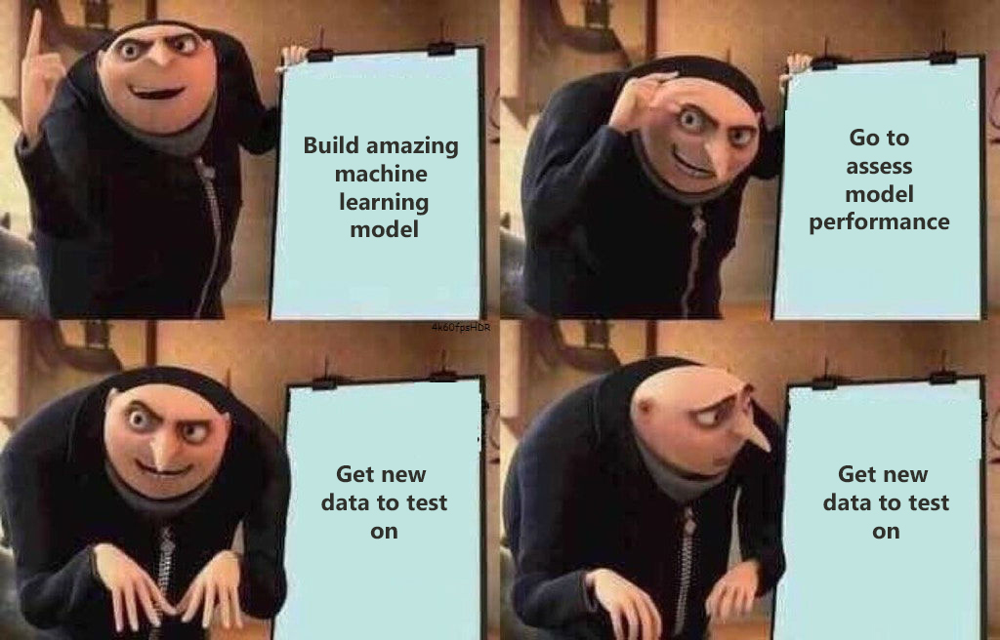
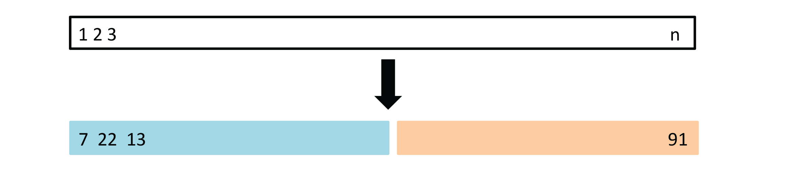
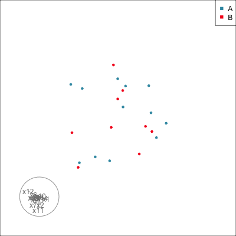

```{r, include = FALSE}
source("../setup.R")

#my.dir <- "C:/Users/jjew0003/Documents/Monash Teaching/ETC3250-5250/2025"

knitr::knit_hooks$set(crop = knitr::hook_pdfcrop)
#https://www.pmassicotte.com/posts/2022-08-15-removing-whitespace-around-figures-quarto/
```

## Overview

We will cover:

::: {.incremental}

* Common re-sampling methods: **bootstrap**, **cross-validation**, **permutation**, **simulation**. 
* **Cross-validation** for checking generalisability of model fit, parameter tuning, variable selection. 
* **Bootstrapping** for understanding variance of parameter estimates.
* **Permutation** to understand significance of associations between variables, and variable importance.
* **Simulation** can be used to assess what might happen with samples from known distributions.
* What can go wrong in high-d, and how to adjust using **regularisation** methods.

:::

## Model development and choice 

<br>

<center>
 </a>
</center>

## How do you get new data? {.transition-slide .center}

## Re-sampling methods

:::: {.columns}
::: {.column}
::: {.info .fragment}
- [**Cross-validation**]{.monash-blue2}: Splitting the data into multiple samples.
- [**Bootstrap**]{.monash-blue2}: Sampling with replacement
- [**Permutation**]{.monash-blue2}: Re-order the values of one or more variables
:::

::: {.incremental}
- [Cross-validation]{.monash-orange2}: This is used to gain some understanding of the [variance]{.monash-orange2} (as in *bias-variance trade-off* ) of models, and how parameter or algorithm choices affect the performance of the model on future samples.
:::

:::
::: {.column}
::: {.incremental}

- [Bootstrap]{.monash-pink2}: Compute [confidence intervals]{.monash-pink2} for model parameters, or the model fit statistics. can be used similarly to cross-validation samples but avoids the complication of smaller sample size that may affect interpretation of cross-validation samples.
- [Permutation]{.monash-green2}: Used to assess [significance of relationships]{.monash-green2}, especially to assess the importance of individual variables or combinations of variables for a fitted model.


:::
:::
::::

## Cross-validation

::: {.fragment}

- [Training/test split]{.monash-blue2}: make one split of your data, keeping one purely for assessing future performance. **ALWAYS DO THIS**

:::

::: {.fragment}

After making that split, we would use [these methods on the training sample]{.monash-orange2}:

:::

::: {.incremental}

- [Leave-one-out]{.monash-orange2}: make $n$ splits, fitting multiple models and using left-out observation for assessing variability. 
- [$k$-fold]{.monash-orange2}: break data into $k$ subsets, fitting multiple models with one group left out each time.

:::

## Training/test split [(1/3)]{.smaller}

::: {.fragment}

<a href="http://www-bcf.usc.edu/~gareth/ISL/Chapter5/5.1.pdf" target="_BLANK">  </a>

[A set of $n$ observations are randomly split into a training set (blue, containing observations 7, 22, 13, ...) and a test set (yellow, all other observations not in training set).]{.smaller}

[(Chapter5/5.1.pdf)]{.smallest}

:::

::: {.incremental}

- Need to [stratify the sampling]{.monash-orange2} to ensure training and test groups are appropriately [balanced]{.monash-orange2}.
- Only one split of data made, may have a lucky or unlucky split, but accurately estimating test error relies on the one sample. 

:::


## Training/test split [(2/3)]{.smaller}

:::: {.columns}
::: {.column .fragment}

[With tidymodels, the function `initial_split()` creates the indexes of observations to be allocated into training or test samples. To generate these samples use `training()` and `test()` functions.]{.smaller}

```{r}
#| label: balanced-data1
d_bal <- tibble(y=c(rep("A", 6), rep("B", 6)),
                x=c(runif(12)))
d_bal$y
set.seed(130)
d_bal_split <- initial_split(d_bal, prop = 0.70)
training(d_bal_split)$y
testing(d_bal_split)$y
```

::: {.fragment}
How can you ensure that the class proportions are maintained in [both the training and testing sets]{.monash-orange2}?
:::

:::
::: {.column}

::: {.fragment}

[Stratify the sampling]{.monash-orange2}

```{r}
#| label: balanced-data2
d_bal$y
set.seed(1225)
d_bal_split <- initial_split(d_bal, 
                             prop = 0.70, 
                             strata=y)
training(d_bal_split)$y
testing(d_bal_split)$y
```

Now the test set has 2 A's and 2 B'2. [This is best practice!]{.monash-orange2}

:::

:::
::::

## Training/test split [(3/3)]{.smaller}

:::: {.columns}
::: {.column .fragment}

Not stratifying can cause major problems with unbalanced samples.

```{r}
#| label: unbalanced-data
d_unb <- tibble(y=c(rep("A", 2), rep("B", 10)),
                x=c(runif(12)))
d_unb$y
set.seed(132)
d_unb_split <- initial_split(d_unb, prop = 0.70)
training(d_unb_split)$y
testing(d_unb_split)$y
```

::: {.fragment}

[The test set is missing one entire class!]{.monash-red2}

:::
:::

::: {.column}

::: {.fragment}

::: {.info}
Always [stratify splitting]{.monash-orange2} by sub-groups, especially response variable classes, and possibly other variables too.
:::

```{r}
#| label: unbalanced-split
d_unb_strata <- initial_split(d_unb, 
                              prop = 0.70, 
                              strata=y)
training(d_unb_strata)$y
testing(d_unb_strata)$y
```

[Now there is an A in the test set!]{.monash-green2}
:::

:::
::::

## Unbalanced classification 

::: {.incremental}

- In binary classification, the classes are referred to as unbalanced if there are many more Class $A$'s than Class $B$'s
- This happens in most interesting applications where you want to detect something [rare]{.monash-orange2}
- Consider for example 90% of the observations are Class A and 10% are Class B.
- It becomes hard to diagnose the model's performance 
- For example, predicting everything is class A with probability 1 will achieve accuracy 0.9, and a pretty high AUC

:::


## Unbalanced classification 

<br>

::: {.columns}
::: {.column .fragment}

Have to look at the whole Confusion matrix

<center>
<table>
<tr>  <td> </td><td> </td> <td colspan="2" align="center" > predicted </td> </tr>
<tr>  <td> </td><td> </td> <td align="center" bgcolor="#daf2e9" width="80px"> `1` </td> <td align="center" bgcolor="#daf2e9" width="80px"> `0` </td> </tr>
<tr height="50px">  <td> true </td><td bgcolor="#daf2e9"> `1` </td> <td align="center" bgcolor="#D3D3D3"> <em>`a`</em> </td> <td align="center" bgcolor="#D3D3D3"> <em>`b`</em> </td> </tr>
<tr height="50px">  <td> </td><td bgcolor="#daf2e9"> `0`</td> <td align="center" bgcolor="#D3D3D3"> <em>`c`</em> </td> <td align="center" bgcolor="#D3D3D3"> <em>`d`</em> </td> </tr>
</table>
</center>

:::
::: {.column}

::: {.incremental}

- Accuracy = (`a`+`d`)/(`a`+`b`+`c`+`d`)
- Balanced accuracy = `a`/(2(`a`+`b`)) + `d`/(2(`c`+`d`))
- in the 90:10 case predicting everything as Class A
  - $a = 90$, $c = 10$, $b = 0$ and $d = 0$
  - Accuracy is 0.9
  - Balanced accuracy is 1/2 + 0/2 = 0.5

:::

:::
:::


## Checking the training/test split: response

:::: {.columns}
::: {.column width=30% .fragment}

<br>
Check the class proportions of the response by [computing counts and proportions]{.monash-orange2} in each class, and tabulating or plotting the result.
<br><br>

::: {.fragment}

It's [good]{.monash-green2} if there are similar numbers of each class in both sets.

:::

:::

::: {.column width=30% .fragment}

<center>
[GOOD]{.monash-green2}
</center>

```{r}
#| echo: false
#| label: penguins-good-split1
#| fig-width: 3
#| fig-height: 6
#| out-width: 70%
library(palmerpenguins)
p_tidy <- penguins |>
  select(species, bill_length_mm:body_mass_g) |>
  rename(bl=bill_length_mm,
         bd=bill_depth_mm,
         fl=flipper_length_mm,
         bm=body_mass_g) |>
  filter(!is.na(bl)) |>
  arrange(species)
set.seed(224)
p_split <- initial_split(p_tidy, 
                         prop = 0.7,
                         strata = species)
p_tr <- training(p_split) |> 
  mutate(set = "train")
p_ts <- testing(p_split) |> 
  mutate(set = "test")
p_both <- bind_rows(p_tr, p_ts) |>
  mutate(set = factor(set, levels=c("train", "test")))
ggplot(p_both, aes(x=species, fill=species)) +
  geom_bar() +
  facet_wrap(~set, ncol=1, scales="free_x") +
  scale_fill_discrete_divergingx(palette="Zissou 1") +
  xlab("") +
  theme(legend.position="none") + coord_flip()
```
:::
::: {.column width=30% .fragment}

<center>
[BAD]{.monash-red2}
</center>

```{r}
#| echo: false
#| label: penguins-bad-split1
#| fig-width: 3
#| fig-height: 6
#| out-width: 70%
p_bad <- p_tidy |>
  mutate(set = factor(ifelse(species == "Adelie", "train", "test"),
                      levels=c("train", "test")))
ggplot(p_bad, aes(x=species, fill=species)) +
  geom_bar() +
  facet_wrap(~set, ncol=1) +
  scale_fill_discrete_divergingx(palette="Zissou 1") +
  xlab("") +
  theme(legend.position="none") + coord_flip()
```
:::
::::

## Checking the training/test split: predictors

:::: {.columns}
::: {.column width="33%" .fragment}


[[Make a training/test variable and plot the predictors.]{.monash-orange2} Need to have similar distributions.]{.smaller}

::: {.fragment}

<center>
[GOOD]{.monash-green2}
</center>

```{r}
#| echo: false
#| label: penguins-good-split2
#| eval: false
render_gif(p_both[,2:5], 
           grand_tour(),
           display_xy(col=p_both$species,
             pch=p_both$set, shapeset=c(4, 16), rescale=TRUE),
           rescale=TRUE,
           gif_file = "../gifs/p_split_good.gif",
           apf = 1/30,
           frames = 500,
           width = 400, 
           height = 400)
```

{width=500}

:::

:::
::: {.column width="33%" .fragment}

<center>
[Looks good]{.monash-purple2 .smaller}
</center>

```{r}
#| echo: false
#| label: penguins-bad-split2
#| fig-width: 6
#| fig-height: 3
#| out-width: 80%
p_bad2 <- p_tidy |>
  mutate(set = factor(ifelse((species == "Adelie" & bd > 17.5 & fl > 183) | (species == "Chinstrap" & bd > 17.8 & fl > 187) |
        (species == "Gentoo" & bd > 14.2 & fl > 211), "train", "test"),
                      levels=c("train", "test")))
ggplot(p_bad2, aes(x=species, fill=species)) +
  geom_bar() +
  facet_wrap(~set, ncol=2, scales="free") +
  scale_fill_discrete_divergingx(palette="Zissou 1") +
  xlab("") +
  theme(legend.position="none") + coord_flip()
```

[On the response training and test sets have similar proportions of each class so looks good BUT it's not]{.smaller}
:::
::: {.column width="33%" .fragment}

<center>
[But BAD]{.monash-red2 .smaller}
</center>

```{r}
#| echo: false
#| eval: false
render_gif(p_bad2[,2:5], 
           grand_tour(),
           display_xy(col=p_bad2$species,
             pch=p_bad2$set, shapeset=c(4, 16), rescale=TRUE),
           rescale=TRUE,
           gif_file = "../gifs/p_split_bad.gif",
           apf = 1/30,
           frames = 500,
           width = 400, 
           height = 400)
```

{width=500}

::: {.fragment}

[Test set has smaller penguins on at least two of the variables.]{.smaller}

:::
:::
::::

## Cross-validation {.transition-slide .center}

## k-fold cross validation [(1/4)]{.smallest .monash-umber2}

:::: {.columns}
::: {.column width=50%}

::: {.incremental}

1. Divide the data set into $k$ different parts.
2. Remove one part, fit the model on the remaining $k − 1$ parts, and compute the **statistic of interest** on the omitted part.
3. Repeat $k$ times taking out a different part each time

:::
:::
::: {.column width=50%}


:::
::::

## k-fold cross validation [(2/4)]{.smallest .monash-umber2}

:::: {.columns}
::: {.column}

1. [Divide the data set into $k$ different parts.]{.monash-blue2}
2. Remove one part, fit the model on the remaining $k − 1$ parts, and compute the **statistic of interest** on the omitted part.
3. Repeat $k$ times taking out a different part each time
:::
::: {.column .fragment}

```{r}
#| label: penguins-subset
#| echo: false
set.seed(1140)
p_sub_split <- initial_split(p_tidy, 
                             prop=0.25, 
                             strata=species)
p_sub <- training(p_sub_split)
```

Here are the row numbers for $k=5$ folds:

```{r}
#| label: penguins-CV
p_folds <- vfold_cv(p_sub, 5, strata=species)
c(1:nrow(p_sub))[-p_folds$splits[[1]]$in_id]
c(1:nrow(p_sub))[-p_folds$splits[[2]]$in_id]
c(1:nrow(p_sub))[-p_folds$splits[[3]]$in_id]
c(1:nrow(p_sub))[-p_folds$splits[[4]]$in_id]
c(1:nrow(p_sub))[-p_folds$splits[[5]]$in_id]
```
:::
::::

## k-fold cross validation [(3/4)]{.smallest .monash-umber2}

:::: {.columns}
::: {.column .fragment}

1. Divide the data set into $k$ different parts.
2. [Remove one part, fit the model on the remaining $k − 1$ parts, and compute the **statistic of interest** on the omitted part.]{.monash-blue2}
3. Repeat $k$ times taking out a different part each time
:::
::: {.column}

::: {.fragment}

Fit the model to the $k-1$ set, and compute the statistic on the $k$-fold, that was not used in the model fit. 

:::

::: {.fragment}

Here we use the **accuracy** as the statistic of interest.

:::

::: {.fragment}

Value for fold 1 is:

```{r}
#| label: penguins-CV-fit
#| echo: false
p_rp1 <- rpart(species~., data=p_folds$splits[[1]])
p_cv1 <- p_sub[c(1:nrow(p_sub))[-p_folds$splits[[1]]$in_id],]
p_cv1 <- p_cv1 |> 
  mutate(pspecies = predict(p_rp1, p_cv1, type="class"))
accuracy(p_cv1, species, pspecies)
```

:::

:::
::::

## k-fold cross validation [(4/4)]{.smallest .monash-umber2}

:::: {.columns}
::: {.column}

1. Divide the data set into $k$ different parts.
2. Remove one part, fit the model on the remaining $k − 1$ parts, and compute the **statistic of interest** on the omitted part.
3. [Repeat $k$ times taking out a different part each time]{.monash-blue2}
:::
::: {.column .fragment}


Here is the **accuracy** computed for each of the $k=5$ folds. [Remember, this means that the model was fitted to the rest of the data, and accuracy was calculate on the observations in this fold.]{.smaller}

::: {.fragment}

```{r}
#| label: penguins-CV-fitk
#| echo: false
acc <- NULL
for (i in 1:5) {
  p_rp1 <- rpart(species~., data=p_folds$splits[[i]])
  p_cv1 <- p_sub[c(1:nrow(p_sub))[-p_folds$splits[[i]]$in_id],]
  p_cv1 <- p_cv1 |> 
    mutate(pspecies = predict(p_rp1, p_cv1, type="class"))
  acc <- c(acc, accuracy(p_cv1, species, pspecies)$.estimate)
}
acc
```

:::

:::
::::

::: {.fragment}

[Recommended reading: Alison Hill's [Take a Sad Script & Make it Better: Tidymodels Edition](https://alison.rbind.io/blog/2020-02-take-a-sad-script-make-it-better-tidymodels-edition/)]{.smaller}

<!---
Cover in workshop
--->

:::

## k-fold cross validation [uses]{.smallest .monash-umber2}


::: {.incremental}

- Cross-validation gives you an idea of how a particular model performs out-of-sample
- Use this to select model hyperparameters e.g. LASSO regularisation parameter, depth of decision tree or Neural Network architecture 
- Evaluate cross-validated accuracy for different hyperparameters and proceed with the hyperparameter with the 'best' out of sample performance

:::

<br>

::: {.incremental}

- Cross-validation allows us to average over different test/train splits so provides a more reliable measure of model performance
- However, we have still 'trained' on the cross-validated test sets (as we used those to learn hyperparameters) hence we should still evaluate our model using the test split
- **Note** your final fitted model should be re-fit on [ALL]{.monash-orange2} of the training data

:::


## LOOCV 

::: {.info}
Leave-one-out (LOOCV) is a special case of $k$-fold cross-validation, where $k=n$. There are $n$ CV sets, each with [ONE]{.monash-orange2} observation left out. 
:::

::: {.fragment}

Benefits:


::: {.incremental}

- Useful when sample size is very small. 
- Some statistics can be calculated algebraically, without having to do computation for each fold.
- Gives you the best measure of performance 

:::

:::

::: {.fragment}

But:


::: {.incremental}

- Model needs to be fit $k = n$ times and $n$ will be very large

:::

:::

## Where is cross-validation used?

<br><br>

::: {.incremental}

- Model evaluation and selection, by estimating the [generalisability]{.monash-blue2} on future data.
- [Parameter tuning]{.monash-blue2}: finding optimal choice of parameters or control variables, like number of trees or branches, or polynomial terms to generate the best model fit.
- [Variable selection]{.monash-blue2}: which variables are more or less important for the best model fit. Possibly some variables can be dropped from the model without impacting the corss-validated error.

:::

## k-nearest neighbours cross-validation

<!---

Reminder of kNN

Need to set $K$, can;t set in-sample 

Can also set weights

Where do we mention standardisation?!

--->

## Bootstrap {.transition-slide .center}

## Bootstrap [(1/6)]{.smallest .monash-umber2}

::: {.incremental}

- A bootstrap sample is a sample that is the [same size as the original data set]{.monash-orange2} 
- Made by sampling $n$ times from the observations [with replacement]{.monash-orange2}. 
- Imagine a bag with balls with numbers $1, \ldots, n$ written on them 
  - I pick a ball
  - Write down its number
  - and [ replace]{.monash-orange2} the ball, before picking again
- This results in samples that have multiple replicates of some of the original rows of the data. 
- The [assessment set]{.monash-blue2} is defined as the rows of the original data that were [not included]{.monash-blue2} in the bootstrap sample, referred to as the [**out-of-bag** (OOB) sample]{.monash-blue2}. 

:::


## Bootstrap [(2/6)]{.smallest .monash-umber2}

<br>

Which observations are out-of-bag in bootstrap sample 1?

```{r}
set.seed(115)
df <- tibble(id = 1:26, 
             cl = c(rep("A", 12), rep("B", 14)))
df_b <- bootstraps(df, times = 100, strata = cl)
t(df_b$splits[[1]]$data[df_b$splits[[1]]$in_id,])
```


## Bootstrap [(3/6)]{.smallest .monash-umber2}

<br><br>

::: {.incremental}

- [Bootstrap is preferable]{.monash-orange2} to cross-validation when the [sample size is small]{.monash-orange2}, or if the structure in the data being modelled is [complex]{.monash-orange2}. 

- It is commonly used for estimating the [variance of parameter estimates]{.monash-orange2}, especially when the data is non-normal.

:::

## Bootstrap [(4/6)]{.smallest .monash-umber2}

::: {.incremental}

- In dimension reduction it can be used to assess if the coefficients of a PC (the eigenvectors) are significantly different from ZERO. 
- The [95% bootstrap confidence intervals]{.monash-orange2} can be computed by:

:::

::: {.incremental}

1. Generating B bootstrap samples of the data
2. Compute PCA, record the loadings
3. Re-orient the loadings, by choosing one variable with large coefficient to be the direction base (the axes are the same whether they are pointing forwards or backwards)
4. If B=1000, 25th and 975th sorted values yields the lower and upper bounds for confidence interval for each PC. 

:::


## Bootstrap [(5/6)]{.smallest .monash-umber2}

Assessing the loadings for PC 2 of PCA on the womens track data. Remember the summary:
<br>

```{r echo=FALSE}
track <- read_csv(here::here("../data/womens_track.csv"))
track_pca <- prcomp(track[,1:7], center=TRUE, scale=TRUE)
track_pca
```

<br>

::: {.fragment}


Should we consider `m800`, `m400` contributing to PC2 or not?

:::

<br>

::: {.fragment}

i.e. are $\phi_{32}$ and $\phi_{42}$ are *significantly* different from 0?


:::

## Bootstrap [(6/6)]{.smallest .monash-umber2}

:::: {.columns}
::: {.column }


We said that *PC2 is a contrast between short distance events and long distance events, particularly 100m, 200m vs 1500m, 3000m, marathon*. [How reliably can we state this?]{.monash-orange2}

```{r}
#| label: bootstrap-PC
#| code-fold: true
library(boot)
compute_PC2 <- function(data, index) {
  pc2 <- prcomp(data[index,], center=TRUE, scale=TRUE)$rotation[,2]
  # Coordinate signs: make m100 always positive
  if (sign(pc2[1]) < 0) 
    pc2 <- -pc2 
  return(pc2)
}
# Make sure sign of first PC element is positive
set.seed(201)
PC2_boot <- boot(data=track[,1:7], compute_PC2, R=1000)
colnames(PC2_boot$t) <- colnames(track[,1:7])
PC2_boot_ci <- as_tibble(PC2_boot$t) %>%
  gather(var, coef) %>% 
  mutate(var = factor(var, levels=c("m100", "m200", "m400", "m800", "m1500", "m3000", "marathon"))) %>%
  group_by(var) %>%
  summarise(q2.5 = quantile(coef, 0.025), 
            q5 = median(coef),
            q97.5 = quantile(coef, 0.975)) %>%
  mutate(t0 = PC2_boot$t0) 
pb <- ggplot(PC2_boot_ci, aes(x=var, y=t0)) + 
  geom_hline(yintercept=0, linetype=2, colour="red") +
  geom_point() +
  geom_errorbar(aes(ymin=q2.5, ymax=q97.5), width=0.1) +
  xlab("") + ylab("coefficient") 
``` 


::: {.fragment}

[Confidence intervals for `m400` and  `m800` cross ZERO, hence zero is a plausible value for the population coefficient corresponding to this estimate.]{.smaller}

:::

:::
::: {.column .fragment}
```{r echo=FALSE}
#| out-width: 90%
#| fig-width: 6
#| fig-height: 6
pb
```

:::
::::


## Permutation {.transition-slide .center}

## Permutation [(1/4)]{.smallest .monash-umber2}


::: {.incremental}

- A permutation is a random reordering 
- One permutation of $(1, 2, 3, 4, 5)$ is $(2, 5, 4, 3, 1)$
- While bootstrap sampled with replacement, a permutation samples without replacement
- Here we permute on of the columns of our data
- [breaks relationships]{.monash-orange2} between variables
- often used for conducting [statistical hypothesis tests]{.monash-orange2}, without requiring too many [assumptions]{.monash-orange2}

:::


## Permutation [(2/4)]{.smallest .monash-umber2}

:::: {.columns}

::: {.column}
::: {.column width=40% .fragment}

DATA

```{r echo=FALSE}
set.seed(238)
dp <- tibble(x=c(rexp(5), rexp(5,0.3)+0.5), cl=c(rep("A", 5), rep("B", 5)))
dp
```
:::

::: {.column width=40% .fragment}

PERMUTE `cl`

```{r echo=FALSE}
set.seed(246)
dpp <- dp |> mutate(cl = sample(cl))
dpp
```

:::

::: {.fragment}

[If there is a relationship between two variables, then this relationship should be destroyed by permutation]{.smaller .monash-blue2}

:::

:::

::: {.column .fragment}

[Is there a difference in the medians of the groups?]{.smaller .monash-blue2}


::: {.fragment}

```{r echo=FALSE}
#| crop: true
set.seed(238)
n <- 50
dp <- tibble(x=c(rexp(n), rexp(n,0.3)+0.5), 
             cl=c(rep("A", n), rep("B", n))) |>
    mutate(cl <- factor(cl)) 
dpp <- dp |> mutate(cl = sample(cl))
dp_plot <- ggplot(dp, aes(x=cl, y=x)) +
  geom_point(alpha=0.6, size=3) +
  ggtitle("DATA")
dpp_plot <- ggplot(dpp, aes(x=cl, y=x)) +
  geom_point(alpha=0.6, size=3) +
  ggtitle("PERMUTED")
grid.arrange(dp_plot, dpp_plot, ncol=2)
  
```

<!---
Permuted data definitely has no dependence, so what does the statistic look like

--->

:::

::: {.fragment}

If a relationship is similar after permutation, then it must have been purely due to chance

:::

:::

::::


## Permutation [(3/4)]{.smallest .monash-umber2}

:::: {.columns}

::: {.column}
Is there a difference in the medians of the groups?

```{r echo=FALSE}
#| crop: true
#| out-width: 50%

dp_meds <- dp |>
  group_by(cl) |>
  summarise(med = median(x))
dp_plot +
  geom_point(data=dp_meds, aes(x=cl, y=med), colour="red", size=5)
```

::: {.fragment}

Similarly with bootstrap, we can now assess the distribution of this dependence with multiple permutations

:::
:::

::: {.column .fragment}

Generate $k$ permutation samples, compute the medians for each, and  compare the difference with [original]{.monash-red2}.

::: {.fragment}

```{r }
#| label: permutation-PC
#| code-fold: true
## using the infer package from tidymodels
dp_perm <- dp |>
  specify(x ~ cl) |>
  hypothesize(null = "independence") |>
  generate(reps = 1000, type = "permute") |>
  calculate("diff in medians", order = c("A", "B")) |>
  mutate(stat = abs(stat)) # Not interested in direction
dp_true <- abs(dp_meds$med[1]-dp_meds$med[2])
ggplot(dp_perm, aes(x=stat)) +
  geom_histogram(binwidth = 0.1, colour="white") +
  geom_vline(xintercept=dp_true, colour="red")
```

:::

<!---

::: {.fragment}

Could use this to create a confidence interval for what the difference in medians if there were no relationship

:::

--->

:::

::::

## Permutation [(4/4)]{.smallest .monash-umber2}

::: {.incremental}

- [Caution]{.monash-orange2}: permuting small numbers, especially classes may return very [similar samples to the original data]{.monash-orange2}.
- [Stay tuned for random forest models]{.monash-green2}, where permutation is used to help assess the [importance of all the variables]{.monash-green2}.

:::

<br>

::: {.incremental}

- Can think about fitting the model, and comparing the model fit to a fit on permuted data
- More often used to screen whether variables might be important or not to model a response

:::


## Comparison 

::: {.incremental}

- [Cross-validation]{.monash-orange2}: creates *smaller* training and testing sets to evaluate model's out-of-sample performance
- [Bootstrap]{.monash-blue2}: creates training data of the same size to understand the distribution of training parameter estimates
  - Samples whole observation rows
  - Samples with replacement
- [Permutation]{.monash-green2}: creates training data of the same size to understand relationships between variables (without a model)
  - Samples subsets of rows
  - Samples without replacement


:::


## Simulation {.transition-slide .center}

## Simulation [(1/6)]{.smallest .monash-umber2}


Simulating from known statistical distributions allows us to [check data and calculations against what is known]{.monash-blue2} in controlled conditions. 

<br>

::: {.fragment}

We know the truth, and so we know how we want our method or model to behave?

:::

<br>

::: {.fragment}

For example, how likely is it to see the extreme a value if my data is a sample from a normal distribution?

:::

<br>

::: {.fragment}

As we're simulating data we can simulate as much as we like

:::


## Simulation [(2/6)]{.smallest .monash-umber2}

::: {.fragment}

Consider doing PCA with $p = 2$ dimensional data with $x_1\sim \mathcal{N}(0, 1^2)$ and $x_2 = x_1 + \mathcal{N}(0, 0.1^2)$

:::

:::: {.columns}
::: {.column}

::: {.fragment}

```{r echo=FALSE}
#| out-width: 100%
set.seed(8)
n <- 100
x1 <- rnorm(n, 0, 1)
x2 <- x1 + rnorm(100, 0, 0.1)
data <- tibble(x1 = x1, x2 = x2)

ggplot(data, aes(x = x1, y = x2)) +
  geom_point()

```

:::
:::
::: {.column}

::: {.incremental}

- What should the PCA look like?
- What will the proportion of variances be?
- How should the PC loadings look

:::
:::

::::

## Simulation [(3/6)]{.smallest .monash-umber2}


Consider doing PCA with $p = 2$ dimensional data with $x_1\sim \mathcal{N}(0, 1^2)$ and $x_2 = x_1 + \mathcal{N}(0, 0.1^2)$


::: {.fragment}

```{r echo=TRUE}

data_pca <- prcomp(data, retx=T, center=T, scale=TRUE)

data_pca$sdev

```
:::

<br>

::: {.fragment}

```{r echo=TRUE}

data_pca$rotation

```
:::

## Simulation [(4/6)]{.smallest .monash-umber2}


What about UMAP


::: {.fragment}

```{r echo=TRUE}

library(uwot)
set.seed(253)
data_umap <- umap(data, init = "spca")

data_umap_df <- tibble(x1 = data_umap[,1],
                       x2 = data_umap[,2])
```
:::

::: {.fragment}

```{r echo=FALSE}
#| out-width: 70%
#| crop: true
p_x1 <- ggplot(data_umap_df) +
  geom_density(aes(x = x1))

p_x2 <- ggplot(data_umap_df) +
  geom_density(aes(x = x2))

ggpubr::ggarrange(p_x1, p_x2, nrow = 1, ncol = 2)

```
:::

## Simulation [(5/6)]{.smallest .monash-umber2}


What about UMAP

::: {.fragment}

```{r echo=FALSE}
#| out-width: 50%
#| crop: true
#| 
ggplot(data_umap_df) +
  geom_point(aes(x = x1, y = x2))

```

:::


## Simulation [(6/6)]{.smallest .monash-umber2}

:::: {.columns}
::: {.column}

```{r echo=TRUE}
#| label: track-scree
#| fig-width: 6
#| fig-height: 6
#| out-width: 70%
mulgar::ggscree(track_pca, q=7) +
  ggtitle("Scree plot of womens track data")
```

::: 
::: {.column}

::: { .incremental}

- [Grey line]{.monash-gray50} is a guide line, computed by doing PCA on 100 samples from a standard $p$-dimensional normal distribution (with no dependence). 

- That is a [comparison]{.monash-orange2} of the correlation matrix of the track data with a correlation matrix that is the identity matrix, where there is [no association between variables]{.monash-orange2}. 

- The largest variance we expect is under 2. The observed variance for PC 1 is much higher. Much larger than expected, very important for capturing the variability in the data! 

- [Why is there a difference in variance, when there is no difference in variance?]{.smallest .monash-blue2}

:::
:::
::::


## What can go wrong in high-dimensions {.transition-slide .center}

## Space is huge!

:::: {.columns}
::: {.column}

```{r}
set.seed(357)
my_sparse_data <- tibble(cl = c(rep("A", 12), 
                                rep("B", 9)),
                         x1 = rnorm(21),
                         x2 = rnorm(21), 
                         x3 = rnorm(21),
                         x4 = rnorm(21),
                         x5 = rnorm(21), 
                         x6 = rnorm(21), 
                         x7 = rnorm(21), 
                         x8 = rnorm(21), 
                         x9 = rnorm(21), 
                         x10 = rnorm(21), 
                         x11 = rnorm(21), 
                         x12 = rnorm(21), 
                         x13 = rnorm(21), 
                         x14 = rnorm(21), 
                         x15 = rnorm(21)) |>
  mutate(cl = factor(cl)) |>
  mutate_if(is.numeric, function(x) (x-mean(x))/sd(x))
```

<br>

::: {.fragment}

$n = 21$ and $p = 15$

:::

::: {.fragment}

Do we agree that there is no REAL difference between A and B?

:::

:::

::: {.column .fragment}

Run a guided tour that tries to seperate the two classes 

```{r eval=FALSE}
#| code-fold: true

render_gif(my_sparse_data[,-1], 
           guided_tour(lda_pp(my_sparse_data$cl), sphere=TRUE),
           display_xy(col=my_sparse_data$cl, axes="bottomleft"),
           rescale=TRUE,
           gif_file = "../gifs/my_sparse_data.gif",
           apf = 1/30,
           loop = FALSE,
           frames = 1000,
           width = 400, 
           height = 400)
```


::: {.fragment}

<center>
{width=500}
</center>
:::

::: {.fragment}
Difference is due to having [insufficient data with too many variables]{.monash-orange2}. 
:::

:::
::::

## Regularisation

<br><br>

::: {.incremental}

- We will use regularisation as part of our mdoel fitting process
- Adds a penalty term to the fitting criteria that encourages some of the [parameter estimates to be forced to ZERO]{.monash-orange2}. 
- This effectively reduces the dimensionality by removing noise, - and variability in the sample that is consistent with what would be expected if it was purely noise. 

:::

<br><br>

::: {.fragment}

[Stay tuned for examples in various methods!]{.monash-blue2}

:::

## Next: Logistic regression and discriminant analysis {.transition-slide .center}


