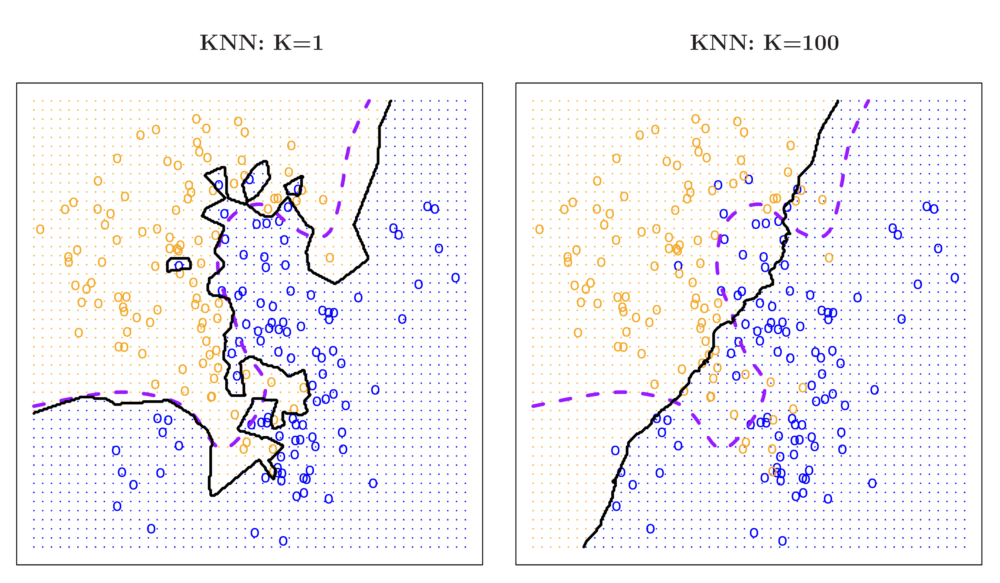
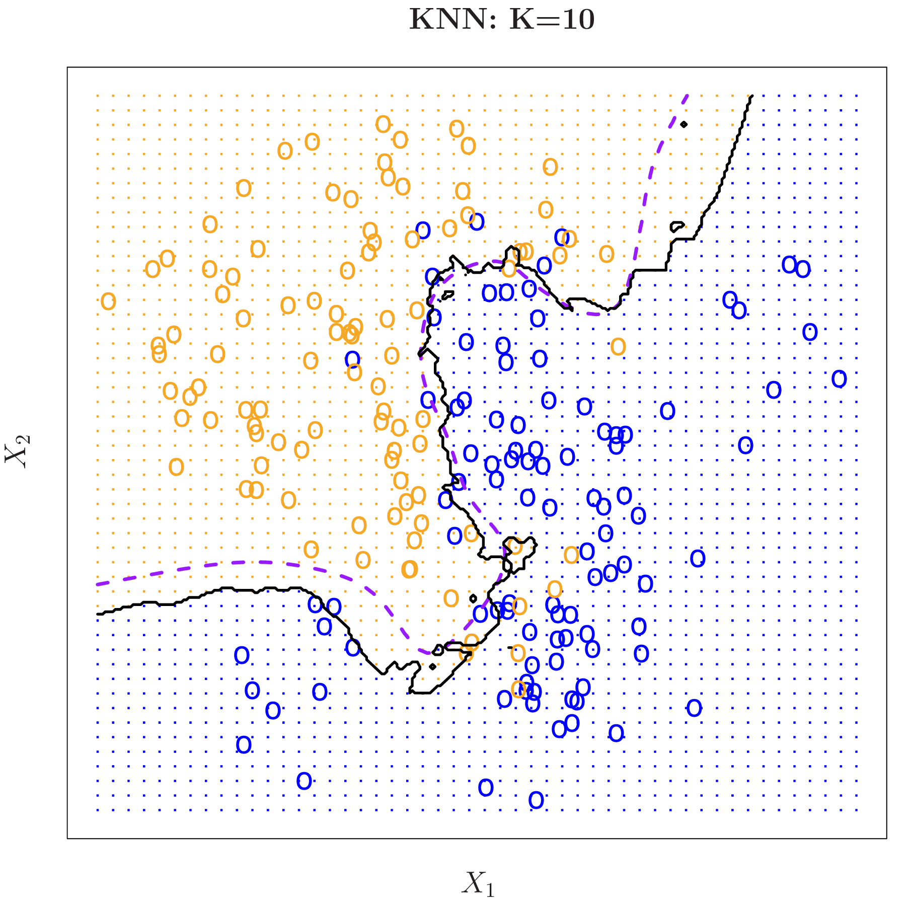

<!---
https://github.com/quarto-dev/quarto-cli/discussions/3224
--->

```{r, include = FALSE}
source("../setup.R")
library(ggpubr)
library(kableExtra)

#my.dir <- "C:/Users/jjew0003/Documents/Monash Teaching/ETC3250-5250/2025"

knitr::knit_hooks$set(crop = knitr::hook_pdfcrop)
#https://www.pmassicotte.com/posts/2022-08-15-removing-whitespace-around-figures-quarto/

```

## Overview

We will cover:

::: {.incremental}

- Fitting a categorical response using logistic curves
- Multivariate summary statistics
- Linear discriminant analysis, assuming samples are elliptically shaped and equal in size
- Quadratic discriminant analysis, assuming samples are elliptically shaped and different in size
- Making a low-dimensional visual summary

:::

## Logistic regression {.transition-slide .center}

## When linear regression is not appropriate

:::: {.columns}
::: {.column .fragment}

<br>

Consider the following data `Default` in the ISLR R package (textbook) which looks at the default status based on credit balance.

::: {.fragment}

```{r}
library(ISLR)
data(Default)
simcredit <- Default |>
  mutate(default_bin = ifelse(default=="Yes", 1, 0))
simcredit |> slice_head(n=3)
```

<!---

Turns yes no into 0-1, can say about ML sometimes being 1, -1

--->

:::

<br>

::: {.fragment}

[Why is a linear model less than ideal for this data?]{.monash-blue2}


<!---

Students have seen linear regression before

--->


:::

:::
::: {.column .fragment}

<br>

```{r}
#| echo: false
#| crop: true
ggplot(simcredit, aes(x=balance, y=default_bin)) +
  geom_point() +
  geom_smooth(method="lm", colour = "#027EB6", se = FALSE) +
  ylab("default") +
  theme_minimal(base_size=18)
```


::: {.fragment}

Our model predicts values in $\mathbb{R}$ (which can be $< 0$ or $> 1$) when our response lives in $\{0, 1\}$

:::


:::
::::

## Modelling binary responses

:::: {.columns}
::: {.column .fragment}

```{r}
#| echo: false
ggplot(simcredit, aes(x=balance, y=default_bin)) +
  geom_point() +
  geom_smooth(method="lm", se=FALSE, color = "#027EB6") +
  geom_smooth(method="glm", 
              method.args = list(family = "binomial"), 
              colour = "#D93F00", se = FALSE) +
  theme_minimal(base_size=18) +
  ylab("default")
```

:::
::: {.column .fragment}

<br>

::: {.incremental}

- [Orange line]{.monash-orange2} (logistic model fit)
- Is similar to computing a running average of the 0s/1s
- It's much better than the linear fit, because it remains between 0 and 1
- Interpreted as the probability that a certain person defaults 

:::

::: {.fragment}

[What is a logistic function?]{.monash-orange2}

:::


:::
::::

## The logistic function

:::: {.columns}
::: {.column}

::: {.incremental}

- Instead of predicting the outcome directly, 
- We predict the probability of being class 1
- Using the (linear combination of) predictors, 
- and the [logistic]{.monash-orange2} function.

:::

::: {.fragment}

$$ p(y=1|\beta_0 + \beta_1 x)  = f(x) $$

:::

::: {.fragment}

where

$$f(x) = \frac{e^{\beta_0+\beta_1x}}{1+e^{\beta_0+\beta_1x}}$$

:::

:::
::: {.column .fagment}

```{r, echo=FALSE, fig.retina=4, warning=F, message=F}
x <- rep(seq(-10, 10, by=0.1), 2)
logistic <- 1 / (1 + exp(-x))
#Link <- c(rep("logistic", length(x.vals)))

library(latex2exp)

data <- tibble(x, logistic)
ggplot(data, aes(x=x, y=logistic)) +
  geom_line(size=1.4, color = "#D93F00") + 
  xlab(TeX('$\\beta_0 + \\beta_1 x$')) + 
  ylab(TeX('$p(y=1|\\beta_0 + \\beta_1 x) = f(\\beta_0 + \\beta_1 x)$')) +
  theme_minimal() +
  theme(text = element_text(size=18))
```

:::
::::

## Logistic function

:::: {.columns}
::: {.column .fragment}

Transform the function:

$$~~~~P(y=1|x) = \frac{e^{\beta_0+\beta_1x}}{1+e^{\beta_0+\beta_1x}}$$

::: {.fragment}

$\longrightarrow  P(y=1|x) = \frac{1}{1/e^{\beta_0+\beta_1x}+1}$

:::

::: {.fragment}

$\longrightarrow  1/P(y=1|x) = 1/e^{\beta_0+\beta_1x}+1$

:::

::: {.fragment}

$\longrightarrow 1/P(y=1|x) - 1 = 1/e^{\beta_0+\beta_1x}$

:::

::: {.fragment}

$\longrightarrow  \frac{1}{1/P(y=1|x) - 1} = e^{\beta_0+\beta_1x}$

:::

::: {.fragment}

$\longrightarrow \frac{P(y=1|x)}{1 - P(y=1|x)} = e^{\beta_0+\beta_1x}$

:::

::: {.fragment}

$\longrightarrow \log_e\frac{P(y=1|x)}{1 - P(y=1|x)} = \beta_0+\beta_1x$

:::

:::

::: {.column .fragment}

<br>

Transforming the probabilities $\log_e\frac{P(y=1|x)}{1 - P(y=1|x)}$ makes it possible to see the linear model fit.
 
<br>

::: {.info .fragment}
The left-hand side, $\log_e\frac{p}{1 - p}$, is known as the [log-odds ratio]{.monash-orange2} or logit.
<i class="fas fa-dice" style="color: #D93F00"></i>
:::

<br>

::: {.fragment}

In binary classification $P(y=0|x) = 1 - P(y=1|x)$

:::

:::
::::

## Logistic function

:::: {.columns}
::: {.column .fragment}

You may also see logistic regression written as:

$$~~~~y = \frac{1}{1+e^{-\beta_0-\beta_1x}}$$

::: {.fragment}

$\longrightarrow  y = \frac{e^{\beta_0+\beta_1x}}{1+e^{\beta_0+\beta_1x}}$

:::

::: {.fragment}

$\longrightarrow  y = \frac{e^{\beta_0+\beta_1x}/e^{\beta_0+\beta_1x}}{1/e^{\beta_0+\beta_1x}+e^{\beta_0+\beta_1x}/e^{\beta_0+\beta_1x}}$

:::

::: {.fragment}

$\longrightarrow  y = \frac{1}{1/e^{\beta_0+\beta_1x}+1}$

:::

::: {.fragment}

$\longrightarrow  y = \frac{1}{e^{-\beta_0-\beta_1x}+1}$

:::

:::

::: {.column .fragment}


:::
::::


## The logistic regression model

When there are [more than two]{.monash-blue2} categories:

::: {.incremental}

- The formula can be extended, using dummy variables (one-hot-encoding).
- If there are $K$ classes, i.e. $\mathcal{Y} = \{1, \ldots, K\}$ then $y_i = \{0, 0, \ldots, 1, \ldots, 0\}$ where $y_{ik} = 1$ if $y_i$ was class $k$
- Introduce parameters $\beta_{0k}$ and $\beta_{1k}$ for each class $k$ (excluding class $K$)
- The probabilities extend from above
$$
\begin{aligned}
P(Y = k|x) &= \frac{e^{\beta_{0k}+\beta_{1k}x}}{1+\sum_{j=1}^{K-1}e^{\beta_{0j}+\beta_{1j}x}}, \quad k = 1,\ldots K-1\\
P(Y = K|x) &= \frac{1}{1+\sum_{j=1}^{K-1}e^{\beta_{0j}+\beta_{1j}x}}
\end{aligned}
$$
ensures the sum of all probabilities is 1.

:::


## Connection to generalised linear models

::: {.incremental}

- To model **binary data**, we need to [link]{.monash-orange2} our **predictors** to our response using a *link function*.
- Another way to think about it is that we will [transform $y$]{.monash-orange2}, to convert it to a proportion, and then build the linear model on the transformed response.
- There are many different types of link functions we could use, but for a binary response we typically use the [logistic]{.monash-orange2} link function.

:::

## Interpretation 

::: {.incremental}

- [**Linear regression**]{.monash-blue2}
    - $y$ is linear in $x$
    - $\beta_1$ gives the average change in $y$ associated with a one-unit increase in $x$

- [**Logistic regression**]{.monash-blue2}
    - $y$ is no longer linear in $x$ becuase of the logistic function 
    - $\beta_1$ does not correspond to the change in response associated with a one-unit increase in $x$.
    - But the log-odds are linear in $x$ (logistic regression is still considered a linear model)
    - Increasing $x$ by one unit changes the log odds by $\beta_1$, or equivalently it multiplies the odds by $e^{\beta_1}$
    
:::

## Maximum Likelihood Estimation

::: {.fragment}

Now that we have a model for binary data, we need a method to learn its parameters $\beta_0$ and $\beta_1$

:::

::: {.fragment}

Given the logistic $p(x_i) = P(Y_i = 1 | x_i) = \frac{1}{e^{-(\beta_0+\beta_1x_i)}+1}$
choose parameters $\beta_0, \beta_1$ to maximize the likelihood

:::

::: {.fragment}

The likelihood tells us, how likely was the data that we observed for particular vales of the parameters

:::

::: {.fragment}

$$
\begin{aligned}
\mathcal{l}_n(\beta_0, \beta_1) :&= \class{fragment}{P(Y_1 = y_1, \ldots, Y_n = y_n | x, \beta_0, \beta_1)}\\[3px]
&\class{fragment}{{} = \prod_{i=1}^nP(Y_i = y_i | x, \beta_0, \beta_1)}\\[3px]
&\class{fragment}{{} = \prod_{i=1}^n p(x_i)^{y_i}(1-p(x_i))^{1-y_i}.}
\end{aligned}
$$

:::

::: {.fragment}

We choose the parameter that make the observed data most plausible (i.e. likely) 

:::


## Maximum Likelihood Estimation

It is (*almost-always*) more convenient to maximize the *log-likelihood*

::: {.fragment}

The logarithm is a monotonic function so maximising the log-likelihood is the same as maximising the likelihood.

:::

::: {.fragment}

\begin{align*}
\log  l_n(\beta_0, \beta_1) &= \class{fragment}{\log\prod_{i=1}^n p(x_i)^{y_i}(1-p(x_i))^{1-y_i}.}\\[3px]
&\class{fragment}{{} = \sum_{i = 1}^n \big( y_i\log p(x_i) + (1-y_i)\log(1-p(x_i))\big)}\\[3px]
&\class{fragment}{{} =  \sum_{i=1}^n\big(y_i(\beta_0+\beta_1x_i)-\log{(1+e^{\beta_0+\beta_1x_i})}\big)}
\end{align*}

:::

::: {.fragment}

You will not need to *solve* this yourself, we will use software to find 
$$
\hat{\beta}_0, \hat{\beta}_1 := \arg\max_{\beta_0\in\mathbb{R}, \beta_1 \in\mathbb{R}^p} \log  l_n(\beta_0, \beta_1)
$$

:::


## Making predictions

:::: {.columns}
::: {.column .fragment}


```{r}
#| label: glmfit
fit <- glm(default~balance,  
           data=simcredit, family="binomial")
fit$coefficients

```

<br>

::: {.fragment}

With estimates from the model fit, $\hat{\beta}_0, \hat{\beta}_1$, we can predict the **probability of belonging to class 1** using:

:::

::: {.fragment}


$$p(y=1|\hat{\beta}_0 + \hat{\beta}_1 x) = \frac{e^{\hat{\beta}_0+ \hat{\beta}_1x}}{1+e^{\hat{\beta}_0+ \hat{\beta}_1x}}$$

:::
:::
::: {.column .fragment}

```{r}
#| echo: false

simcredit_fit <- augment(fit, simcredit,                       type.predict="response")
ggplot(simcredit_fit, aes(x=balance, y=default_bin)) +
  geom_point() +
  geom_point(aes(y=.fitted), colour = "#D93F00") +
  theme_minimal(base_size=18) 
```

::: {.fragment}

[Orange points are fitted values, $\hat{p}_i$.]{.monash-orange2} Black points are observed response, $y_i$ (either 0 or 1). 

:::

:::
::::

## Fitting credit data in R

:::: {.columns}
::: {.column .fragment}

We can use the `glm` function in R to fit a logistic regression model. 

::: {.fragment} 
 
The `glm` function can support many response types, so we specify `family="binomial"` to let R know that our response is *binary*.

:::
 
::: {.fragment} 

```{r}
#| eval: false
fit <- glm(default~balance,  
           data=simcredit, family="binomial") 
simcredit_fit <- augment(fit, simcredit,
                         type.predict="response")#takes fitted values and adds them to the data
```

:::

::: {.fragment}

GLMs are statistical/econometric models

For machine learning models it will be easier the `tidymodels` syntax

:::

:::
::: {.column .fragment}


Same calculation but written in `tidymodels` style

::: {.fragment}

```{r logistic_fit, echo=TRUE}
logistic_mod <- logistic_reg() |> #specify the model type
  set_engine("glm") |> #specify how to learn the parameters
  set_mode("classification") 

logistic_fit <- ## apply the data
  logistic_mod |> 
  fit(default ~ balance, 
      data = simcredit)# fit the model

```

:::

::: {.fragment}

Here both sets of code do the same thing, the `tidymodels` syntax will be more useful when we have non-linear machine learning models

:::

:::

::: {.fragment}

See - [https://parsnip.tidymodels.org/reference/logistic_reg.html](https://parsnip.tidymodels.org/reference/logistic_reg.html)

:::


::::

## Examine the fit

:::: {.columns}
::: {.column .fragment}

```{r echo=TRUE}
tidy(logistic_fit) 
```

::: {.fragment}

```{r echo=TRUE}
glance(logistic_fit) 
```

:::

:::

::: {.column}

::: {.fragment}

### Parameter estimates

$\widehat{\beta}_0 =$ `r broom::tidy(logistic_fit)[1, 2]`

$\widehat{\beta}_1 =$ `r broom::tidy(logistic_fit)[2, 2]`

<br>

::: {.fragment}


### Model fit summary

[Null model deviance]{.monash-blue2} `r round(broom::glance(logistic_fit)[1], 1)` (error for model with no predictors)

[Model deviance]{.monash-blue2} `r round(broom::glance(logistic_fit)[6], 1)` (error from fitted model)

::: {.fragment}

These are the extension of the $R^2$ coefficient form linear models

:::

::: {.fragment}

Think of [Model deviance]{.monash-blue2}/[Null model deviance]{.monash-blue2} a bit like $1-R^2$

:::

:::
:::
:::
::::

## Check the model performance

:::: {.columns}
::: {.column .fragment}

[Compute the balanced accuracy]{.monash-blue2} based on $\alpha = 0.5$ threshold

::: {.fragment}

```{r echo=TRUE}
simcredit_fit <- augment(logistic_fit, simcredit) 
simcredit_fit |> 
  count(default, .pred_class) |>
  group_by(default) |>
  mutate(Accuracy = n[.pred_class==default]/sum(n)) |>
  pivot_wider(names_from = ".pred_class", values_from = n) |>
  select(default, No, Yes, Accuracy)
```

:::

<!---

Di has coded the confusion matrix herself rather than using conf_mat as that flips the axes and you can;t then have the accracies on the rig thhand side 

--->

::: {.fragment}

The accuracy is `r yardstick::accuracy(simcredit_fit, default, .pred_class)$.estimate`, but the balanced accuracy is `r bal_accuracy(simcredit_fit, default, .pred_class)$.estimate`. 

:::


::: {.fragment}

[Unbalanced data set, with very different performance on each class.]{.smaller}

:::

:::

::: {.column .fragment}

[How good is this model?]{.monash-orange2}

<br>

::: {.incremental}

- Explains about [half of the variation]{.monash-orange2} in the response, which would normally be reasonable.
- Gets most of the [smaller but important class wrong]{.monash-orange2}.
- Not a very useful model.
:::

:::

::::

## A warning for using GLMs!

:::: {.columns}
::: {.column .fragment}


<br>

::: {.info }
Logistic regression model fitting fails when the data is *perfectly* separated.
:::

::: {.fragment}

MLE fit will try and fit a step-wise function to this graph, pushing coefficients sizes towards infinity and produce large standard errors.

:::

::: {.fragment}

[Pay attention to warnings!]{.monash-orange2}

:::

:::
::: {.column .fragment}

```{r}
#| echo: false
#| warning: false
#| out-width: 80%
simcredit <- simcredit |>
  mutate(default_new = 
           as.factor(case_when(balance <= 1500 ~ 0,
                               balance > 1500 ~ 1)))

ggplot(simcredit, aes(x=balance, 
                      y=default_new)) +
  geom_point() +
  geom_vline(xintercept = 1500, 
             col = "grey50", size = 1.1, 
             linetype = "dashed") +
  theme_minimal(base_size=18)
```

::: {.fragment}

```{r echo = TRUE, warning = TRUE}
logistic_fit <- 
  logistic_mod |> 
  fit(default_new ~ balance, 
      data = simcredit)
```

:::

:::
::::

## p > 1

::: {.incremental}

- So far we have assumed that $x \in\mathbb{R}$ (i.e. $p = 1$) and therefore that $\beta_1\in\mathbb{R}$
- Given more than one predictor $x \in\mathbb{R}^p$
- The only change to the logistic regression model is that $\beta_1 x\mapsto \beta^Tx$ 
- Where $\beta\in\mathbb{R}^p$
- The estimated vector $\hat{\beta}$ is still found using maximum likelihood

:::


## Comparison with k-nearest neighbours

<!---

Give final kNN implementation (must have introduced standardisation by now), cross-validated to choose K and weights 

Could do this dataset and thn also the simple dataset from kNN

--->

<!---

TOOK THE PREVIOUS SLIDES FORM WEEK1 NOT SURE EXACTLY WHERE THEY FIT - WE COULD TAKE lda OUT AND HAVE IT LATER!

--->


## Parametric vs non-parametric

<br>

We will look at both parameter and non-parametric machine learning models (for $\hat{y}$ or $\hat{p}$)

::: {.columns}
::: {.column .fragment}

[Parametric]{.monash-purple2} methods

::: {.incremental}

- [Assume]{.monash-purple2} that the model takes a specific form 
- e.g. $\hat{y}(x) = x^\top\theta$ (linear model) or $\hat{p}(x) = \frac{1}{1+\exp(x^\top\theta)}$ (logistic regression)
- Fitting then is a matter of [estimating the parameters]{.monash-purple2} of the model, i.e. $\theta$
- Generally considered to be [less flexible]{.monash-purple2}
- If assumptions are [wrong]{.monash-purple2}, performance likely to be [poor]{.monash-purple2}

:::
    
:::
::: {.column .fragment}

[Non-parametric]{.monash-pink2} methods 

::: {.incremental}

- [No]{.monash-pink2} specific assumptions
- Allow the [data to specify]{.monash-pink2} the model form, without being too rough or wiggly
- More [flexible]{.monash-pink2}
- Generally needs [more observations]{.monash-pink2}, and not [too many variables]{.monash-pink2}
- Easier to [over-fit]{.monash-pink2}
- e.g. k-Nearest Neighbours or Neural Networks

:::
    
:::
:::

## Parametric vs non-parametric

::: {.fragment}

{width=500 style="font-size: 50%;"}
:::

## Parametric vs non-parametric

::: {.fragment}

```{r}
#| echo: false
#| eval: false
#| label: sine-curve-data
# Generate the sine-curve data

set.seed(1259)
x1 <- runif(340)
x2 <- runif(340)
y <- 3*x1+sin(x1*15)
y <- (y-min(y))/(max(y)-min(y))
d <- tibble(x1, x2, y)
d$cl <- ifelse(x2 > y, "A", "B")
d$cl[sample(1:340, 25)] <- sample(c("A", "B"), 25, replace=TRUE)
write_csv(d, file="../data/sine-curve.csv")
# Test set
x1 <- runif(212)
x2 <- runif(212)
y <- 3*x1+sin(x1*15)
y <- (y-min(y))/(max(y)-min(y))
d <- tibble(x1, x2, y)
d$cl <- ifelse(x2 > y, "A", "B")
d$cl[sample(1:212, 18)] <- sample(c("A", "B"), 18, replace=TRUE)
write_csv(d, file="data/sine-curve-test.csv")
```

```{r}
#| label: sine-curve-plot
#| echo: false
#| fig-width: 4
#| fig-height: 4
#| out-width: 50%

#w <- read_csv(here::here("data/wiggly.csv")) |>
#  rename(x1=x, x2=y) |>
#  mutate(class = factor(class))
#w <- read_csv(here::here("data/sine-curve.csv")) |>

w <- read_csv("../data/sine-curve.csv") |>
  mutate(cl = factor(cl))
ggplot(w, aes(x=x1, y=x2, colour = cl)) +
  geom_point(size=2.5, alpha=0.8) +
  geom_line(aes(x=x1, y=y), colour="black") +
  scale_color_discrete_qualitative() +
  ggtitle("Observed data") + 
  theme(legend.position = "none")
```

[Black line [is true boundary]{.monash-blue2}.]{.smaller}


:::


## Parametric vs non-parametric

::: {.columns}
::: {.column width=50%   .fragment}

```{r}
#| label: sin-curve-models1
#| echo: false
#| fig-width: 4
#| fig-height: 4
library(geozoo)
w_grid <- cube.solid.random(p=2)$points
colnames(w_grid) <- c("x1", "x2")
w_grid <- w_grid |> as_tibble() |>
  mutate(x1 = x1*(max(w$x1)-min(w$x1)+min(w$x1)),
         x2 = x2*(max(w$x2)-min(w$x2)+min(w$x2)))
w_lda <- lda(cl~x1+x2, data=w)
w_lda_pred <- predict(w_lda, w_grid)$class
w_rf <- randomForest(cl~x1+x2, data=w, ntree=2)
w_rf_pred <- predict(w_rf, w_grid)
w_grid <- w_grid |>
  mutate(plda = w_lda_pred,
         prf = w_rf_pred)
p1 <- ggplot(w_grid, aes(x=x1, y=x2, colour = plda)) +
  geom_point(alpha=0.5, size=2) +
  geom_line(data=w, aes(x=x1, y=y), colour="black") +
  scale_color_discrete_qualitative() +
  ggtitle("Parametric") +
  theme(legend.position = "none",
        axis.text = element_blank())
p2 <- ggplot(w_grid, aes(x=x1, y=x2, colour = prf)) +
  geom_point(alpha=0.5, size=2) +
  geom_line(data=w, aes(x=x1, y=y), colour="black") +
  scale_color_discrete_qualitative() +
  ggtitle("Non-parametric") +
  theme(legend.position = "none",
        axis.text = element_blank())
#p1 + p2 + plot_layout(ncol=1)
#grid.arrange(p1, p2)
p1
```

:::

::: {.column width=50%   .fragment}

```{r}
#| label: sin-curve-models2
#| echo: false
#| fig-width: 4
#| fig-height: 4
#| 
p2

```

:::
:::

## Reducible vs irreducible error

::: {.columns}
::: {.column width=10%}
:::

::: {.column width=30% .fragment}

```{r}
#| label: model-errors1
#| echo: false
#| fig-width: 5
#| fig-height: 5
w <- w |>
  mutate(plda = predict(w_lda, w)$class,
         prf = predict(w_rf, w)) |>
  mutate(lda_err = ifelse(cl != plda, "1", "0"),
         rf_err = ifelse(cl != prf, "1", "0"))

ggplot(w, aes(x=x1, y=x2, 
                   colour = cl, 
                   shape=lda_err)) +
  geom_point(size=5, alpha=0.8) +
  geom_line(aes(x=x1, y=y), 
            inherit.aes = FALSE, 
            colour="black") +
  scale_color_discrete_qualitative() +
  scale_shape_manual(values=c(1, 19)) +
  ggtitle("Parametric errors") + 
  theme(legend.position = "none",
        axis.text = element_blank(),
        axis.title = element_blank())
```

::: {.fragment}

If the [model form is incorrect]{.monash-umber2}, the error (solid circles) may arise from wrong shape, and is thus [reducible]{.monash-umber2}

:::

:::

::: {.column width=10%}
:::

::: {.column width=30% .fragment}

```{r}
#| label: model-errors2
#| echo: false
#| fig-width: 5
#| fig-height: 5
ggplot(w, aes(x=x1, y=x2, 
                   colour = cl, 
                   shape=rf_err)) +
  geom_point(size=5, alpha=0.8) +
  geom_line(aes(x=x1, y=y), 
            inherit.aes = FALSE,
            colour="black") +
  scale_color_discrete_qualitative() +
  scale_shape_manual(values=c(1, 19)) +
  ggtitle("Non-parametric errors") + 
  theme(legend.position = "none",
        axis.text = element_blank(),
        axis.title = element_blank())
```

::: {.fragment}

[Irreducible]{.monash-olive2} means that we have got the right model and mistakes (solid circles) are [random noise]{.monash-olive2}. 

:::

:::
::: {.column width=10%}
:::
:::


## Flexible vs inflexible

<br>

[Parametric]{.monash-orange2} models tend to be [less flexible]{.monash-orange2} but [non-parametric]{.monash-blue2}  models can be flexible or less flexible depending on [parameter settings]{.monash-blue2}.

. . . 

```{r}
#| label: flexible-model
#| echo: false
#| fig-width: 9
#| fig-height: 3
p1 <- ggplot(w_grid, aes(x=x1, y=x2, colour = plda)) +
  geom_point(size=2, alpha=0.5) +
  geom_line(data=w, aes(x=x1, y=y), colour="black") +
  scale_color_discrete_qualitative() +
  ggtitle("Less flexible") +
  theme(legend.position = "none",
        axis.text = element_blank(),
        axis.title = element_blank())
w_rf <- randomForest(cl~x1+x2, data=w, ntree=4)
w_rf_pred <- predict(w_rf, w_grid)
w_grid <- w_grid |>
  mutate(prf = w_rf_pred)
p2 <- ggplot(w_grid, aes(x=x1, y=x2, colour = prf)) +
  geom_point(size=2, alpha=0.5) +
  geom_line(data=w, aes(x=x1, y=y), colour="black") +
  scale_color_discrete_qualitative() +
  ggtitle("<--------------->") +
  theme(legend.position = "none",
        axis.text = element_blank(),
        axis.title = element_blank())
w_rf <- randomForest(cl~x1+x2, data=w, ntree=100)
w_rf_pred <- predict(w_rf, w_grid)
w_grid <- w_grid |>
  mutate(prf = w_rf_pred)
p3 <- ggplot(w_grid, aes(x=x1, y=x2, colour = prf)) +
  geom_point(size=2, alpha=0.5) +
  geom_line(data=w, aes(x=x1, y=y), colour="black") +
  scale_color_discrete_qualitative() +
  ggtitle("More flexible") +
  theme(legend.position = "none",
        axis.text = element_blank(),
        axis.title = element_blank())

#p1 + p2 + p3 + plot_layout(ncol=3)
grid.arrange(p1, p2, p3, ncol=3)
```


## Bias vs variance

A framework for thinking about how much flexibility we need

::: {.columns}
::: {.column .fragment}

[Bias]{.monash-orange2} is the error that is introduced by modeling a 
complicated problem using a simpler model.

::: {.incremental}

- For example, linear regression assumes a linear relationship and perhaps the relationship is not exactly linear.
- In general, the [more flexible]{.monash-orange2} a method is, the [less bias]{.monash-orange2} it will have because it can fit a complex shape better. 

:::

:::
::: {.column .fragment}


[Variance]{.monash-orange2}
refers to how much your estimate would change if you had different training data. Its measuring how much your model depends on the data you have, to the neglect of future data.

::: {.incremental}

- In general, the [more flexible]{.monash-orange2} a method is, the [more variance]{.monash-orange2} it has. 
- The [size]{.monash-orange2} of the training data can impact on the variance.
:::

:::
:::

## Bias 

::: {.columns}
::: {.column .fragment}

```{r}
#| label: bias1
#| echo: false
#| fig-width: 4
#| fig-height: 4
#| out-width: 60%
p1 + ggtitle("Large bias")
```

::: {.fragment}

[When you impose too many assumptions with a parametric model, or use an inadequate non-parametric model, such as not letting an algorithm converge fully.]{.smaller}

:::

:::
::: {.column .fragment}

```{r}
#| label: bias2
#| echo: false
#| fig-width: 4
#| fig-height: 4
#| out-width: 60%
p3 + ggtitle("Small bias")
```

::: {.fragment}

[When the model closely captures the true shape, with a parametric model or a flexible model.]{.smaller} 

:::

:::
:::

## Variance

::: {.columns}
::: {.column .fragment}

```{r}
#| label: variance1
#| echo: false
#| fig-width: 4
#| fig-height: 4
#| out-width: 60%

library(geozoo)
#w_grid_subset <- w_grid[1:100,]
w_grid_subset <- w_grid

w_lda <- lda(cl~x1+x2, data=w[1:100,])
w_lda_pred <- predict(w_lda, w_grid_subset)$class
w_rf <- randomForest(cl~x1+x2, data=w[1:100,], ntree=2)
w_rf_pred <- predict(w_rf, w_grid_subset)
w_grid_subset <- w_grid_subset |>
  mutate(plda = w_lda_pred,
         prf = w_rf_pred)
p1 <- ggplot(w_grid_subset, aes(x=x1, y=x2, colour = plda)) +
  geom_point(alpha=0.5, size=2) +
  geom_line(data=w, aes(x=x1, y=y), colour="black") +
  scale_color_discrete_qualitative() +
  ggtitle("Parametric") +
  theme(legend.position = "none",
        axis.text = element_blank())
p2 <- ggplot(w_grid_subset, aes(x=x1, y=x2, colour = prf)) +
  geom_point(alpha=0.5, size=2) +
  geom_line(data=w, aes(x=x1, y=y), colour="black") +
  scale_color_discrete_qualitative() +
  ggtitle("Non-parametric") +
  theme(legend.position = "none",
        axis.text = element_blank())
#p1 + p2 + plot_layout(ncol=1)
#grid.arrange(p1, p2)
p1 + ggtitle("Small variance")

```

::: {.fragment}

[This fit is virtually identical even though we had a different training sample.]{.smaller}

:::

:::
::: {.column  .fragment}

```{r}
#| label: variance2
#| echo: false
#| fig-width: 4
#| fig-height: 4
#| out-width: 60%
p2 + ggtitle("Large variance")
```

::: {.fragment}

[Get a very different model if a different training set is used.]{.smaller} 

:::

:::
:::

## Bias-variance tradeoff

<br>

{width=800 style="font-size: 50%;"}
{width=450 style="font-size: 50%;"}

[Images 2.16, 2.15 from ISLR]{style="font-size: 50%;"}

::: {.fragment}

Goal: Without knowing what the true structure is, fit the signal and ignore the noise. [Be flexible but not too flexible.]{.monash-blue2}

:::


## Trade-off between accuracy and interpretability

```{r}
#| label: tradeoff-acc-interp
#| echo: false
#| fig-width: 5
#| fig-height: 5
#| out-width: 60%
ai <- tibble(flexibility=c(5, 1, 4, 2, 3), 
             interpretability=c(1, 5, 4, 5, 3), 
             name=c("neural network", "LDA", "random forests", "trees", "SVM"))
library(ggrepel)
ggplot(ai, aes(x=flexibility, 
               y=interpretability, 
               label=name, colour=name)) +
  geom_text(hjust = 1, vjust=0) +
  scale_x_continuous("flexibility/accuracy", 
                     limits=c(0, 5), 
                     breaks = c(1, 5), 
                     labels=c("low", "high")) +
  scale_y_continuous(
                     limits=c(1, 5), 
                     breaks = c(1, 5), 
                     labels=c("low", "high")) +
  theme(legend.position="none", panel.grid = element_blank())
```


## Diagnosing the fit

::: {.columns}
::: {.column .fragment}

Compute and examine the [usual diagnostics]{.monash-blue2}, some methods have more

::: {.incremental}

- fit statistics: accuracy, sensitivity, specificity
- errors/misclassifications
- variable importance
- plot residuals, examine the misclassifications
- [check test set is similar to training]{.monash-pink2}

:::

::: {.fragment}

[Go beyond ...]{.monash-orange2} Look at the data and the model together!

[[Wickham et al (2015) Removing the Blindfold](http://onlinelibrary.wiley.com/doi/10.1002/sam.11271/abstract)]{.smaller}


:::

:::
::: {.column}

::: {.fragment}

[*Training - plusses; Test - dots*]{.smaller .center}

```{r}
#| label: training-test
#| echo: false
#| fig-width: 4
#| fig-height: 4
#| out-width: 80%

w_test <- read_csv(here::here("../data/sine-curve-test.csv"))
ggplot() +
  geom_point(data=w_grid, aes(x=x1, y=x2, 
                              colour = prf), 
             alpha=0.05, size=4) +
  geom_point(data=w, aes(x=x1, y=x2, colour = cl), 
             shape=3, size=3) +
  geom_point(data=w_test, aes(x=x1, y=x2, colour = cl), 
             shape=19, size=3) +
  scale_color_discrete_qualitative() +
  theme(legend.position = "none",
        axis.text = element_blank())
```

:::

:::
:::

## Feature engineering

Some times to get a better fit (reduce the bias) you need a more complex model 

. . .

Other times you can get the same results by transforming the original variables (See `tidymodels` steps.)

::: {.incremental}

- scaling, centering, sphering (`step_pca`)
- log or square root or box-cox transformation (`step_log`)
- ratio of values (`step_ratio`)
- polynomials or splines: $x_1^2, x_1^3$ (`step_ns`)
- dummy variables: categorical predictors expanded into multiple new binary variables (`step_dummy`)
- Convolutional Neural Networks: neural networks but with pre-processing of images to combine values of neighbouring pixels; flattening of images

:::

::: {.fragment}

Some models will even learn this transformations for you 

:::


## Discriminant Analysis {.transition-slide .center}

## Linear Discriminant Analysis

:::: {.columns}
::: {.column}

```{r}
#| echo: false
#| out-width: 80%
p_tidy |>
  filter(species != "Chinstrap") |>
  ggplot(aes(x=bd, y=bm, colour=species)) +
  geom_point() +
  scale_color_discrete_divergingx(palette = "Zissou 1")
```

::: {.fragment}

[Where would you draw a line to create a boundary separating Adelie and Gentoo penguins?]{.smaller}

:::

:::
::: {.column .fragment}

::: {.incremental}
- [Where are the sample means?]{.smaller}
- [What are the shapes of the clusters?]{.smaller}
- [What is the shape of the sample variance-covariance?]{.smaller}
:::

::: {.fragment}
[Linear discriminant analysis]{.monash-blue2} assumes the distribution of the predictors is a [multivariate normal, with the same variance-covariance matrix]{.monash-blue2}, separately for each class.
:::

::: {.fragment}
Being multivariate normal means the predictors in each class will be elliptical
:::

:::
::::


## Assumptions underlie LDA

:::: {.columns}
::: {.column}

<center>
{width=50%}

[Source: https://xkcd.com]{.smallest}
</center>

:::
::: {.column .fragment}


<br><br>

::: {.incremental}

- All samples come from [normal populations]{.monash-orange2}
- with the [same population variance-covariance matrix]{.monash-orange2}

:::

:::
::::

## LDA with $p=1$ predictors [1/4]{.smallest}

:::: {.columns}
::: {.column .fragment}

If $K = 2$ (two classes labelled `A` and `B`) and each group has the *same prior probability*, the LDA rule is to assign the new observation $x_0$ to class `A` if

<!-- 
$$\delta_1(x_0) > \delta_2(x_0)$$

$$x_0 \frac{\mu_1}{\sigma^2} - \frac{\mu_1^2}{2 \sigma^2} + \log(\pi) > x_0 \frac{\mu_2}{\sigma^2} - \frac{\mu_2^2}{2 \sigma^2} + \log(\pi) $$

which simplifies to -->

::: {.fragment}

$$
x_0 > \frac{\bar{x}_A + \bar{x}_B}{2}
$$

:::

:::

::: {.column .fragment}
::: {.incremental}
- It's a really intuitive rule, eh?
- It also matters which of the two classes is considered to be `A`!!!
- So maybe easier to think about as "**assign the new observation to the group with the closest mean**".
- How does this rule arise from the assumptions? 

:::

::: {.fragment}

This is our first step towards machine learning, logistic regression was a statistical model that explained the data, LDA can be viewed as recipe for prediction

:::

:::
::::


## Bayes Theorem [2/4]{.smallest}

::: {.fragment}

Let $f_k(x)$ be the density function for predictors $x$ in class $k$. 

:::

::: {.fragment}

If $f$ is large, the probability that $x$ belongs to class $k$ is large, or if $f$ is small it is unlikely that $x$ belongs to class $k$.

:::

::: {.fragment}

According to Bayes theorem (for $K$ classes) the probability that $x$ belongs to class $k$ is:

$$
\begin{aligned}
p_k(x) = P(Y = k|X = x) &= \class{fragment}{\frac{P(X = x \text{ and }Y = k)}{P(X = x)}}\\
&\class{fragment}{{} = \frac{P(X = x | Y = k)P(Y = k)}{\sum_{j=1}^K P(X = x|Y = j)P(Y = j)}}\\
&\class{fragment}{{} = \frac{\pi_kf_k(x)}{\sum_{j=1}^K \pi_kf_k(x)}}
\end{aligned}
$$

where $\pi_k$ is the prior probability that an observation comes from class $k$.

:::


## LDA with $p=1$ predictors [3/4]{.smallest}

:::: {.columns}
::: {.column width=60%}
The [density function]{.monash-orange2} $f_k(x)$ of a univariate [normal]{.monash-orange2} (Gaussian) is

$$
f_k(x) = \frac{1}{\sqrt{2 \pi} \sigma_k} \text{exp}~ \left( - \frac{1}{2 \sigma^2_k} (x - \mu_k)^2 \right)
$$

where $\mu_k$ and $\sigma^2_k$ are the mean and variance parameters for the $k$th class. 

::: {.fragment}

We also assume that $\sigma_1^2 = \sigma_2^2 = \dots = \sigma_K^2 = \sigma^2$; then the conditional probabilities are

$$
p_k(x) = \frac{\pi_k \frac{1}{\sqrt{2 \pi} \sigma} \text{exp}~ \left( - \frac{1}{2 \sigma^2} (x - \mu_k)^2 \right) }{ \sum_{l = 1}^K \pi_l \frac{1}{\sqrt{2 \pi} \sigma} \text{exp}~ \left( - \frac{1}{2 \sigma^2} (x - \mu_l)^2 \right) }
$$

:::
:::
::: {.column width=40% .fragment}
```{r}
#| echo: false
#| fig-width: 4
#| fig-height: 8
#| out-width: 60%
set.seed("15032019")
n <- 244; n1 <- 55
x <- c(rnorm(n1, -1), rnorm(n-n1, 1))
y <- factor(c(rep("B", n1), rep("A", n-n1)), levels=c("B", "A"))
df <- tibble(x, y)

x <- seq(-4, 4, 0.1)
dx <- c(dnorm(x, -1), dnorm(x, 1))
y <- factor(c(rep("B", length(x)), rep("A", length(x))), levels=c("B", "A"))
df_pop <- tibble(x=c(x, x), dx, y)
df_means <- df |> 
  group_by(y) |>
  summarise(x=mean(x)) 
p1 <- ggplot() +
  geom_rug(data=df, aes(x=x, y=0, colour=factor(y)), alpha=0.7) +
  geom_line(data=df_pop, aes(x=x, y=dx, colour=y)) +
  scale_color_brewer("", palette="Dark2") +
  geom_vline(xintercept=0, colour="grey40", linetype=2) +
  ylab("density") + ggtitle("Population") +
  theme(legend.position="none")
p2 <- ggplot(df, aes(x=x, fill=factor(y))) +
        geom_histogram(binwidth=0.67, alpha=0.8) +
  scale_fill_brewer("", palette="Dark2") +
  scale_colour_brewer("", palette="Dark2") +
  facet_wrap(~y, ncol=2, scales="free_y") +
  geom_vline(data=df_means, aes(xintercept=x,
                                colour=y), linetype=2) +
  geom_vline(xintercept=0, colour="grey40", linetype=2) +
  ggtitle("Data") +
  theme(legend.position="none")
ggarrange(p1, p2, ncol=1)
```

:::
::::

## LDA with $p=1$ predictors [4/4]{.smallest}

:::: {.columns}
::: {.column}
While LDA estimates probabilities $p_k(x_0)$, if we only care about making predictions we can simplify these into  [discriminant functions]{.monash-orange2}, $\delta_k(x_0)$:

::: {.fragment}

$$\delta_k(x_0) = x_0 \frac{\mu_k}{\sigma^2} - \frac{\mu_k^2}{2 \sigma^2} + \log(\pi_k)$$
from which the LDA rule will assign $x_0$ to the class $k$ with the largest value.

:::

::: {.fragment}

Exactly the same as assigning an observation to the class with the closest mean

:::

:::
::: {.column .smallest .fragment}

Let $K=2$, then the rule reduces to assign $x_0$ to class `A` if 

\begin{align*}
& \frac{\pi_A \frac{1}{\sqrt{2 \pi} \sigma} \text{exp}~ \left( - \frac{1}{2 \sigma^2} (x - \mu_A)^2 \right) }{ \sum_{l = 1}^2 \pi_l \frac{1}{\sqrt{2 \pi} \sigma} \text{exp}~ \left( - \frac{1}{2 \sigma^2} (x - \mu_l)^2 \right) } >  \frac{\pi_B \frac{1}{\sqrt{2 \pi} \sigma} \text{exp}~ \left( - \frac{1}{2 \sigma^2} (x - \mu_B)^2 \right) }{ \sum_{l = 1}^2 \pi_l \frac{1}{\sqrt{2 \pi} \sigma} \text{exp}~ \left( - \frac{1}{2 \sigma^2} (x - \mu_l)^2 \right) }\\
      &\longrightarrow \pi_A \frac{1}{\sqrt{2 \pi} \sigma} \text{exp}~ \left( - \frac{1}{2 \sigma^2} (x_0 - \mu_A)^2 \right) > \pi_B \frac{1}{\sqrt{2 \pi} \sigma} \text{exp}~ \left( - \frac{1}{2 \sigma^2} (x_0 - \mu_B)^2 \right)\\
      &\longrightarrow \pi_A \text{exp}~ \left( - \frac{1}{2 \sigma^2} (x_0 - \mu_A)^2 \right) > \pi_B \text{exp}~ \left( - \frac{1}{2 \sigma^2} (x_0 - \mu_B)^2 \right) \\
      &\longrightarrow \log \pi_A - \frac{1}{2 \sigma^2} (x_0 - \mu_A)^2 > \log \pi_B - \frac{1}{2 \sigma^2} (x_0 - \mu_B)^2\\
      &\longrightarrow \log \pi_A - \frac{1}{2 \sigma^2} (x_0^2 - 2x_0\mu_A + \mu_A^2) > \log \pi_B - \frac{1}{2 \sigma^2} (x_0^2 - 2x_0\mu_B + \mu_B^2) \\
      &\longrightarrow \log \pi_A - \frac{1}{2 \sigma^2} (-2x_0\mu_A  + \mu_A^2) > \log \pi_B - \frac{1}{2 \sigma^2} (-2x_0\mu_B  + \mu_B^2) \\
      &\longrightarrow \log \pi_A +  \frac{x_0\mu_A}{\sigma^2} - \frac{\mu_A^2}{2\sigma^2} > \log \pi_B +  \frac{x_0\mu_B}{\sigma^2} - \frac{\mu_B^2}{2\sigma^2} \\
      &\longrightarrow \underbrace{x_0\frac{\mu_A}{\sigma^2} - \frac{\mu_A^2}{2\sigma^2} + \log \pi_A}_{\text{Discriminant function for class A}} > \underbrace{x_0\frac{\mu_B}{\sigma^2} - \frac{\mu_B^2}{2\sigma^2} + \log \pi_B}_{\text{Discriminant function for class B}}
\end{align*}

:::
::::

<!---
COULD REMOVE lda AND REPLACE WITH DUMMY VARIABLES 

--->

## Computation

All we need to do to fit LDA is estimate $\mu_k$ for $k = 1,\ldots, K$ and $\sigma^2$

<br>

::: {.fragment}

Use sample mean $\bar{x}_k$ to estimate $\mu_k$, and  

:::

<br>

::: {.fragment}

to estimate $\sigma^2$ use the [pooled variance]{.monash-orange2}:

$$
s^2 = \frac{n_1s^2_1 + n_2s^2_2+ \dots +n_ks^2_k}{n_1+n_2+\dots +n_k}
$$

where $s^2_k = \frac{1}{n_k}\sum_{i=1}^{n_k}(X_{ki} - \bar{x}_k)^2$ and $X_k$ is the predict matrix restricted to only include the observations in class $k$

:::

<br>

::: {.fragment}

Note these are both maximum likelihood estimators for the normal distribution

:::


## LDA for the credit data

:::: {.columns}
::: {.column}

Returning to the credit data set

```{r}
#| echo: false
#| out-width: 60%
#| crop: true
ggplot(simcredit, aes(x=balance, y=default_bin)) +
  geom_point() +
  #geom_smooth(method="glm", 
  #            method.args = list(family = "binomial"), 
  #            colour = "#D93F00", se = FALSE) +
  theme_minimal(base_size=18) +
  ylab("default")
```

::: {.fragment}

the parameter estimates for this model are
$\bar{x}_A$ = `r mean(simcredit$balance[simcredit$default_bin == 1])`, $\bar{x}_B$ = `r mean(simcredit$balance[simcredit$default_bin == 0])` and $s^2$ =  `r 0.5*var(simcredit$balance[simcredit$default_bin == 1]) + 0.5*var(simcredit$balance[simcredit$default_bin == 0])`.

:::
:::
::: {.column .fragment}

We can visualise the fitted LDA as follows

```{r}
#| echo: false
#| out-width: 100%
#| crop: true

mu_A <- mean(simcredit$balance[simcredit$default_bin == 1])
mu_B <- mean(simcredit$balance[simcredit$default_bin == 0])
sigma2 <-  0.5*var(simcredit$balance[simcredit$default_bin == 1]) + 0.5*var(simcredit$balance[simcredit$default_bin == 0])

norm_plot <- tibble(x_plot = seq(min(simcredit$balance), max(simcredit$balance), length.out = 1000))

norm_plot <- norm_plot |> 
  mutate(dnorm_A = 500*dnorm(x_plot, mu_A, sqrt(sigma2)),
         dnorm_B = 500*dnorm(x_plot, mu_B, sqrt(sigma2)))

plot1 <- ggplot(simcredit, aes(x=balance, y=default_bin)) +
  geom_point() +
  geom_line(data = norm_plot, aes(x = x_plot, y = dnorm_B), size = 1.5, color = "orange") +
  geom_line(data = norm_plot, aes(x = x_plot, y = 1 + dnorm_A), size = 1.5, color = "blue") +
  theme_minimal(base_size=18) +
  ylab("default")
plot1
```


:::
::::

## LDA for the credit data

<br>

:::: {.columns}
::: {.column}

```{r}
#| echo: false
#| cache: true
#| out-width: 100%
#| crop: true

x_balance <- 1000

df_point <- tibble(x_plot = x_balance, 
                   dnorm_A = 500*dnorm(x_balance, mu_A, sqrt(sigma2)),
                   dnorm_B = 500*dnorm(x_balance, mu_B, sqrt(sigma2)))

plot1 + 
  geom_point(data = df_point, aes(x = x_plot, y = dnorm_B), pch = 8, size = 1.5) + 
  geom_point(data = df_point, aes(x = x_plot, y = 1 + dnorm_A), pch = 8, size = 1.5) + 
  geom_text(x=x_balance+100, y=0.6, label=TeX("$f_B(x)$"), size = 5) + 
  geom_text(x=x_balance-100, y=1.2, label=TeX("$f_A(x)$"), size = 5)
```

::: {.fragment}

New observation more likely under class $B$: No Default then class $A$: Default

:::

:::
::: {.column .fragment}


```{r}
#| echo: false
#| cahce: true
#| out-width: 100%
#| crop: true

x_balance <- 1500

df_point <- tibble(x_plot = x_balance, 
                   dnorm_A = 500*dnorm(x_balance, mu_A, sqrt(sigma2)),
                   dnorm_B = 500*dnorm(x_balance, mu_B, sqrt(sigma2)))

plot1 + 
  geom_point(data = df_point, aes(x = x_plot, y = dnorm_B), pch = 8, size = 1.5) + 
  geom_point(data = df_point, aes(x = x_plot, y = 1 + dnorm_A), pch = 8, size = 1.5) + 
  geom_text(x=x_balance+100, y=0.2, label=TeX("$f_B(x)$"), size = 5) + 
  geom_text(x=x_balance-100, y=1.5, label=TeX("$f_A(x)$"), size = 5)
```

::: {.fragment}

New observation more likely under class $A$: Default then class $B$: No Default

:::

:::
::::

## LDA for the credit data

:::: {.columns}
::: {.column}

```{r}
library(discrim)
lda_default_spec <- discrim_linear() |>
  set_mode("classification") |>
  set_engine("MASS", prior = c(0.5, 0.5))# not default 
lda_default_fit <- lda_default_spec |> 
  fit(default ~ balance, data = simcredit)
```

::: {.fragment}

```{r echo=TRUE}
simcredit_lda_fit <- augment(lda_default_fit, simcredit) 
simcredit_lda_fit |> 
  count(default, .pred_class) |>
  group_by(default) |>
  mutate(Accuracy = n[.pred_class==default]/sum(n)) |>
  pivot_wider(names_from = ".pred_class", values_from = n) |>
  select(default, No, Yes, Accuracy)
```

:::
:::
::: {.column .fragment}

```{r}
#| echo: false
#| out-width: 80%
#simcredit_lda_fit <- simcredit_lda_fit |> mutate(.pred = ifelse(.pred_class == "Yes", 1, 0))
simcredit_fit <- augment(fit, simcredit,                       type.predict="response")
ggplot(simcredit_fit, aes(x=balance, y=default_bin)) +
  geom_point() +
  geom_point(aes(y=.fitted), colour = "#D93F00") +
  geom_point(data=simcredit_lda_fit, aes(x= balance, y=.pred_Yes), colour = "blue") +
  theme_minimal(base_size=18) 

```


:::

::: {.fragment}

See - [https://parsnip.tidymodels.org/reference/discrim_linear.html](https://parsnip.tidymodels.org/reference/discrim_linear.html)

:::
::::


## Multivariate LDA, $p>1$

Extending LDA beyond one predictor ($p = 1$) requires us to consider multivariate distributions

::: {.fragment}

The extension of the normal distribution beyond 1 dimension is the multivariate normal distribution 

:::

::: {.fragment}

A $p$-dimensional random variable $x$ has a multivariate Gaussian distribution with mean $\mu$ and variance-covariance $\Sigma$, we write $x \sim N(\mu, \Sigma)$.

:::

::: {.fragment}

The multivariate normal density function is:

$$f(x) = \frac{1}{(2\pi)^{p/2}|\Sigma|^{1/2}} \exp\{-\frac{1}{2}(x-\mu)^\top\Sigma^{-1}(x-\mu)\}$$

with $x, \mu$ are $p$-dimensional vectors, $\Sigma$ is a $p\times p$ variance-covariance matrix.

:::

## Multivariate LDA, $K=2$

The discriminant functions are:

$$\delta_k(x) = x^\top\Sigma^{-1}\mu_k - \frac{1}{2}\mu_k^\top\Sigma^{-1}\mu_k + \log(\pi_k)$$

and Bayes classifier is [assign a new observation]{.monash-orange2} $x_0$ [to the class with the highest]{.monash-orange2} $\delta_k(x_0)$.

::: {.fragment}

Can you see how this looks like the $p = 1$ case $\delta_k(x_0) = x_0 \frac{\mu_k}{\sigma^2} - \frac{\mu_k^2}{2 \sigma^2} + log(\pi_k)$

:::


## Multivariate LDA, $K=2$


When $K=2$ and $\pi_A=\pi_B$ this reduces to

Assign observation $x_0$ to class `A` if

$$x_0^\top\underbrace{\Sigma^{-1}(\mu_A-\mu_B)}_{dimension~reduction} > \frac{1}{2}(\mu_A+\mu_B)^\top\underbrace{\Sigma^{-1}(\mu_A-\mu_B)}_{dimension~reduction}$$

::: {.fragment}

Which looks similar to the $p = 1$ case $x_0 > \frac{\bar{x}_A + \bar{x}_B}{2}$

:::


::: {.fragment}

[NOTE: Class A and B need to be mapped to the classes in the your data. The class "to the right" on the reduced dimension will correspond to class `A` in this equation.]{.monash-blue2 .smaller}

:::

## Computation

All we need to do to fit LDA is estimate $\mu_k$ for $k = 1,\ldots, K$ and $\Sigma$

<br>

::: {.fragment}

Use sample mean $\bar{x}_k$ to estimate $\mu_k$, and  

:::

<br>

::: {.fragment}

to estimate $\Sigma$ use the [pooled variance-covariance]{.monash-orange2}:

$$
S = \frac{n_1S_1 + n_2S_2+ \dots +n_kS_k}{n_1+n_2+\dots +n_k}
$$

where $S_k = \frac{1}{n_k}(X_k - \bar{x}_k)^T(X_k - \bar{x}_k$ and $X_k$ is the predict matrix restricted to only include the observations in class $k$

:::

<br>

::: {.fragment}

Note these are both maximum likelihood estimators for the multivariate normal distribution

:::


## Example: penguins [1/4]{.smallest}

:::: {.columns}
::: {.column}

Summary statistics

```{r}
#| echo: false
#| out-width: 80%
p_sub <- p_tidy |>
  filter(species != "Chinstrap") |>
  mutate(species = factor(species)) |>
  select(species, bm, bd)
p_sub |>
  group_by(species) |>
  summarise_if(is.numeric, mean)
cov(p_sub[p_sub$species == "Adelie",-1])
cov(p_sub[p_sub$species == "Gentoo",-1])

```

::: {.fragment}

```{r}
#| echo: false
#| out-width: 80%

p_sub |>
  ggplot(aes(x=bd, y=bm, colour=species)) +
  geom_point() +
  scale_color_discrete_divergingx(palette = "Zissou 1")
```

:::

:::
::: {.column .fragment}
```{r}
library(discrim)
lda_spec <- discrim_linear() |>
  set_mode("classification") |>
  set_engine("MASS", prior = c(0.5, 0.5))# not default 
lda_fit <- lda_spec |> 
  fit(species ~ bm + bd, data = p_sub)

lda_fit
```

```{r}
#| eval: false
#| echo: false

#\Sigma^{-1}(\mu_A-\mu_B)

n_1 <- nrow(p_sub[p_sub$species == "Gentoo",-1])
n_2 <- nrow(p_sub[p_sub$species == "Adelie",-1])

#S_1 <- cov(p_sub[p_sub$species == "Gentoo",-1])
S_1 <- t(data.matrix(p_sub[p_sub$species == "Gentoo",-1]))%*%data.matrix(p_sub[p_sub$species == "Gentoo",-1])/n_1
#S_2 <- cov(p_sub[p_sub$species == "Adelie",-1])
S_2 <- t(data.matrix(p_sub[p_sub$species == "Adelie",-1]))%*%data.matrix(p_sub[p_sub$species == "Adelie",-1])/n_2

mu_1 <- colMeans(p_sub[p_sub$species == "Gentoo",-1])
mu_2 <- colMeans(p_sub[p_sub$species == "Adelie",-1])

solve((n_1*S_1 + n_2*S_2)/(n_1 + n_2))%*%(mu_1 - mu_2)

```

::: {.fragment}
[Recommendation: standardise the variables before fitting model.]{.monash-blue2 .smaller}
:::

:::
::::

## Example: penguins [2/4]{.smallest}

:::: {.columns}
::: {.column}

Summary statistics

```{r}
#| echo: false
#| out-width: 80%
p_sub <- p_sub |>
  mutate_if(is.numeric, function(x) (x-mean(x))/sd(x)) 
p_sub |>
  group_by(species) |>
  summarise_if(is.numeric, mean)
cov(p_sub[p_sub$species == "Adelie",-1])
cov(p_sub[p_sub$species == "Gentoo",-1])

p_sub |>
  ggplot(aes(x=bd, y=bm, colour=species)) +
  geom_point() +
  scale_color_discrete_divergingx(palette = "Zissou 1")
```

:::
::: {.column .fragment}
```{r}
library(discrim)
lda_spec <- discrim_linear() |>
  set_mode("classification") |>
  set_engine("MASS", prior = c(0.5, 0.5))
lda_fit <- lda_spec |> 
  fit(species ~ bm + bd, data = p_sub)

lda_fit
```
:::

[Easier to see that both variables contribute almost equally to the classification.]{.monash-orange2}

::::

## Example: penguins [3/4]{.smallest}

:::: {.columns}
::: {.column}

When data is standardised the `Coefficients of linear discrimination` allow us to plot the discriminating line

::: {.fragment}

A new observation is class `Gentoo` if $2.0\times\text{bm} - 2.1\times\text{bd} > 0$

:::

::: {.fragment}

Which is the same as $\text{bm} > \frac{2.1}{2}\times\text{bd}$

:::


:::
::: {.column .fragment}
```{r}
#| echo: false
#| out-width: 100%
p_sub <- p_sub |>
  mutate_if(is.numeric, function(x) (x-mean(x))/sd(x)) 

p_sub |>
  ggplot(aes(x=bd, y=bm, colour=species)) +
  geom_point() +
  scale_color_discrete_divergingx(palette = "Zissou 1") +
  geom_abline(intercept = 0, slope = 2.1/2, color="darkgrey", 
                 linetype="dashed", size=1)
```
:::

::::


## Example: penguins [4/4]{.smallest}

:::: {.columns}
::: {.column .smaller}

We are estimating $\Sigma^{-1}(\mu_A-\mu_B)$ with $S^{-1}(\bar{x}_A - \bar{x}_B)$

::: {.fragment}

```{r}
#| echo: false
#| eval: false
n1 <- nrow(p_sub[p_sub$species == "Adelie",-1])
n2 <- nrow(p_sub[p_sub$species == "Gentoo",-1])
Sp <- (n1*S1 + n2*S2)/(n1 + n2)
Sp
```

```{r}
S1 <- cov(p_sub[p_sub$species == "Adelie",-1])
S2 <- cov(p_sub[p_sub$species == "Gentoo",-1])
Sp <- (S1 + S2)/(2)
Sp
```

:::

:::{.fragment}
```{r}
Spinv <- solve(Sp)
Spinv
```
:::
:::{.fragment}
```{r}
m1 <- as.matrix(lda_fit$fit$means[1,], ncol=1)
m1
```
:::
:::{.fragment}
```{r}
m2 <- as.matrix(lda_fit$fit$means[2,], ncol=1)
m2
```
:::
:::{.fragment}
```{r}
Spinv %*% (m1-m2)
```
:::
:::
::: {.column .smaller .fragment}

Assign to class $A$ if

$$
x_0^\top S^{-1}(\bar{x}_A - \bar{x}_B) > (\frac{\bar{x}_A + \bar{x}_B}{2})^\top S^{-1}(\bar{x}_A - \bar{x}_B)
$$

:::{.fragment}
```{r}
(m1 + m2)/2
```
:::
:::{.fragment}
```{r}
matrix((m1 + m2)/2, ncol=2) %*% Spinv %*% (m1-m2)
```
:::

:::{.fragment}
If $x_0$ is `r p_sub[1,-1]`, what species is it? 
:::

::: {.fragment}
```{r}
as.matrix(p_sub[1,-1]) %*% Spinv %*% (m1-m2)
```

Is Adelie class A or is Gentoo class A?
:::

<!---

::: {.fragment}

Check by plugging in the means

```{r}
t(m1) %*% Spinv %*% (m1-m2)
```

:::

--->

::: {.fragment}
```{r}
predict(lda_fit, p_sub[1,-1])$.pred_class
```
:::
:::
::::

<!---

## Dimension reduction {.transition-slide .center}

## Dimension reduction via LDA

[Discriminant space]{.monash-orange2}: LDA also provides a low-dimensional projection of the $p$-dimensional space, where the groups are the most separated. For $K=2$, this is

::: {.info .fragment}

$$
\Sigma^{-1}(\mu_A-\mu_B)
$$

The distance between means relative to the variance-covariance, ie Mahalanobis distance.

:::


## Discriminant space

The dashed lines are the Bayes decision boundaries. Ellipses
that contain 95% of the probability for each of the three classes are shown. Solid line corresponds to the class boundaries from the LDA model fit to the sample.

<center>
<a href="http://www-bcf.usc.edu/~gareth/ISL/Chapter4/4.6.pdf" target="_BLANK">  </a>
</center>

[(Chapter4/4.6.pdf)]{.smallest}

## Discriminant space: using sample statistics

::: {.info}
[Discriminant space]{.monash-orange2}: is the low-dimensional space ($(K-1)$-dimensional) where the class means are the furthest apart relative to the common variance-covariance.
:::

The discriminant space is provided by the eigenvectors after making an eigen-decomposition of $W^{-1}B$, where

$$
B = \frac{1}{K}\sum_{i=1}^{K} (\bar{x}_i-\bar{x})(\bar{x}_i-\bar{x})^\top
~~~\text{and}~~~
W = \frac{1}{K}\sum_{k=1}^K\frac{1}{n_k}\sum_{i=1}^{n_k} (x_i-\bar{x}_k)(x_i-\bar{x}_k)^\top
$$

Note $W$ is the (unweighted) pooled variance-covariance matrix. 


##

:::: {.columns}
::: {.column}

### Mahalanobis distance

For two $p$-dimensional vectors, Euclidean distance is

$$d(x,y) = \sqrt{(x-y)^\top(x-y)}$$

and Mahalanobs distance is

$$d(x,y) = \sqrt{(x-y)^\top\Sigma^{-1}(x-y)}$$


Which points are closest according to [Euclidean]{.monash-orange2} distance?
Which points are closest relative to the [variance-covariance]{.monash-orange2}?

:::
::: {.column}

```{r}
#| echo: false
# Utility functions
f.norm.vec<-function(x) {
  x<-x/f.norm(x)
  x
}
f.norm<-function(x) { sqrt(sum(x^2)) }
f.gen.sphere<-function(n=100,p=5) {
  x<-matrix(rnorm(n*p),ncol=p)
  xnew<-t(apply(x,1,f.norm.vec))
  xnew
}
f.vc.ellipse <- function(vc, xm, n=500) {
  p<-ncol(vc)
  x<-f.gen.sphere(n,p)

  evc<-eigen(vc)
  vc2<-(evc$vectors)%*%diag(sqrt(evc$values))%*%t(evc$vectors)
  x<-x%*%vc2

  x + matrix(rep(xm, each=n),ncol=p)
}
df <- f.vc.ellipse(vc=matrix(c(1,1.2,1.2,2), ncol=2), xm=c(0,0), n=1000)
df <- as_tibble(df)
```

```{r}
#| echo: false
pts <- tibble(V1=c(0, -0.5, -0.8), V2=c(0, 0.5, -1.1), label=c("A", "B", "C"))
ggplot(df, aes(x=V1, y=V2)) + geom_point() + 
  geom_point(data=pts, aes(x=V1, y=V2, colour=label)) +
  geom_text(data=pts, aes(x=V1, y=V2, label=label), nudge_x = 0.1, nudge_y = 0.1) +
  scale_colour_brewer("", palette="Dark2") +
  xlim(c(-1.5, 1.5)) + ylim(c(-1.5, 1.5)) +
  theme(legend.position = "none", aspect.ratio=1)
```

:::
::::

## Discriminant space

In the means of scenarios 1 and 2 are the same, but the variance-covariances are different. The calculated [discriminant space]{.monash-fuchsia2} is different for different variance-covariances.

```{r}
#| echo: false
#| out-width: 50%
#| fig-width: 8
df1 <- f.vc.ellipse(vc=matrix(c(1,1.2,1.2,2), ncol=2), xm=c(0,0), n=1000)
df1 <- as_tibble(df1)
df2 <- f.vc.ellipse(vc=matrix(c(1,-0.3,-0.3,0.5), ncol=2), xm=c(0,0), n=1000)
df2 <- as_tibble(df2)
means <- tibble(V1=c(0.5, -0.5), V2=c(-0.5, 0.5), label=c("mu1", "mu2"))

df3 <- df1 |> mutate(V1=V1+means$V1[1], 
                      V2=V2+means$V2[1])
df4 <- df1 |> mutate(V1=V1+means$V1[2], 
                      V2=V2+means$V2[2])
df <- bind_rows(df3, df4)
p1 <- ggplot(df, aes(x=V1, y=V2)) + geom_point() + 
  geom_point(data=means, aes(x=V1, y=V2, colour=label)) +
  geom_text(data=means, aes(x=V1, y=V2, label=label), nudge_x = 0.2, nudge_y = 0.2) +
  geom_abline(intercept=0, slope=-0.67, colour="purple") +
  scale_colour_brewer("", palette="Dark2") +
  xlim(c(-2, 2)) + ylim(c(-2, 2)) +
  theme(legend.position = "none", aspect.ratio=1) +
  ggtitle("Scenario 1")
df3 <- df2 |> mutate(V1=V1+means$V1[1], 
                      V2=V2+means$V2[1])
df4 <- df2 |> mutate(V1=V1+means$V1[2], 
                      V2=V2+means$V2[2])
df <- bind_rows(df3, df4)
p2 <- ggplot(df, aes(x=V1, y=V2)) + geom_point() + 
  geom_point(data=means, aes(x=V1, y=V2, colour=label)) +
  geom_text(data=means, aes(x=V1, y=V2, label=label), nudge_x = 0.2, nudge_y = 0.2) +
  geom_abline(intercept=0, slope=3.03, colour="purple") +
  scale_colour_brewer("", palette="Dark2") +
  xlim(c(-2, 2)) + ylim(c(-2, 2)) +
  theme(legend.position = "none", aspect.ratio=1) +
  ggtitle("Scenario 2")
p1 + p2
```

```{r eval=FALSE}
#| echo: false
# This code helps estimate the slope in the above diagram
mydat1 <- data.frame(rbind(rmvnorm(250, mean=c(0.5, -0.5), sigma=matrix(c(1,1.2,1.2,2), ncol=2)),
                rmvnorm(250, mean=c(-0.5, 0.5), sigma=matrix(c(1,1.2,1.2,2), ncol=2))))
mydat1$class <- c(rep(1, 250), rep(2, 250))
lda(class~X1+X2, data=mydat1)

mydat2 <- data.frame(rbind(
  rmvnorm(250, mean=c(0.5, -0.5), sigma=matrix(c(1,-0.3,-0.3,0.5), ncol=2)),
  rmvnorm(250, mean=c(-0.5, 0.5), sigma=matrix(c(1,-0.3,-0.3,0.5), ncol=2))))
mydat2$class <- c(rep(1, 250), rep(2, 250))
lda(class~X1+X2, data=mydat2)
```

[Notice: Means for groups are different, and variance-covariance for each group are the same.]{.smaller}

--->

## Encoding Categorical Variables {.transition-slide .center}

[[Nice explanation of catergroical encoding with tidymodels](https://recipes.tidymodels.org/articles/Dummies.html)]{.f50}


## Categorical Predictors

Both Logistic regression and LDA assume the predictor values are real numbers i.e. $x\in\mathbb{R}^p$

:::{.fragment}

In logistic regression $x_i^\top\beta = \sum_{j=1}^px_j\beta_j$ only defined if $x_j$ is always a number 

:::

:::{.fragment}

In LDA $\mu_{A,j} = \sum_{i=1}^nx_{ij}\mathbb{I}(y_i = A)$ only defined if $x_j$ is always a number (plus normally distributed variables are real numbers)

:::

:::{.fragment}

Turning categorical variables into numerical varables so that they can be used in these machine learning models is a very important step in effective machine learning. 

:::


## Types of Categorical Predictors

Two types categorical variable 

::: {.incremental}

+ Credit Rating - ranked as `Bad`, `Satisfactory`, `Good` and `Excellent` - is an ordered categroical variable
+ State - `VIC`, `NSW`, `SA`, `WA`, `NT` and `TAS` is an unordered categorical variable

:::

::: {.fragment}

Models will not accept categorical variables - encoded as numbers

:::

::: {.fragment}

By default Credit Rating will be encoded as `Bad` = 1, `Satisfactory` = 2, `Good` = 3 and `Excellent` = 4

:::

::: {.fragment}

Ordering of the categories is consistent with the ordering of the encoding, `Excellent` gets more than `Good` which gets more than `Satisfactory` etc.

:::

## Unordered Categorical Predictors

Equally, by default State will be encoded as `VIC` = 1, `NSW` = 2, `SA` = 3, `WA` = 4, `NT` = 5 and `TAS` = 6

::: {.fragment}

But here there was no ordering to the categories, but their encoding has an order

:::

::: {.fragment}

`NSW` gets twice the effect of `VIC` and `TAS` gets 6 times the effect

:::

::: {.fragment}

There is no reason for this in the definition of the variable

:::


::: {.fragment}

This is an *unordered* categorical variable, and an *arbitrary* order is placed on them by the software package

:::

## Dummy-encoding/One-hot-encoding

*Unordered* Categorical variables need to be *encoded*, so as not to impose an arbitrary order

::: {.fragment}

Go from one unordered categorical variable variable $x_j \in \{1, \ldots, K\}$

:::

::: {.fragment}

To $K$ numerical variables $(x_{j_1}, \ldots, x_{j_K}) \in \{0, 1\}^K$ with $\sum_{k=1}^Kx_{j_k} = 1$

:::

::: {.fragment}

```{r}
#| echo: false

data1_unordered <- tibble(Income = c(100, 150, 80, 200),
                          Balance = c(20, 10, 100, 70), 
                          State = factor(c("VIC", "TAS", "NSW", "VIC")))

data1_unordered

```

:::

::: {.fragment}

```{r}
data1_ordered <- data1_unordered |>
  tidytable::get_dummies()

data1_ordered |> slice_head(n=4)
```

:::


## Quadratic Discriminant Analysis {.transition-slide .center}

If the groups have different variance-covariance matrices, but still come from a normal distribution


## Quadratic DA (QDA)

LDA assumes the predictors in each class are MVN with different means $\mu_k$ and the same covariance matrix $\Sigma$

::: {.fragment}

QDA *ALSO* assumes the predictors in each class are MVN, however they are now allowed to have different means $\mu_k$ *AND* covariances $\Sigma_k$

:::

::: {.fragment}

If the variance-covariance matrices for the groups are [NOT EQUAL]{.monash-orange2}, then the discriminant functions are:

$$\delta_k(x) = x^\top\Sigma_k^{-1}x + x^\top\Sigma_k^{-1}\mu_k - \frac12\mu_k^\top\Sigma_k^{-1}\mu_k - \frac12 \log{|\Sigma_k|} + \log(\pi_k)$$

where $\Sigma_k$ is the population variance-covariance for class $k$, estimated by the sample variance-covariance $S_k$, and $\mu_k$ is the population mean vector for class $k$, estimated by the sample mean $\bar{x}_k$.

:::

::: {.fragment}

$\delta_k(x)$ is now quadratic in $x$ and so we get a curved discriminating boundary

:::

## Quadratic DA (QDA)

A quadratic boundary is obtained by relaxing the assumption of equal variance-covariance, and assume that $\Sigma_k \neq \Sigma_l, ~~k\neq l, k,l=1,...,K$

::: {.fragment}

<center>
<a href="http://www-bcf.usc.edu/~gareth/ISL/Chapter4/4.9.pdf" target="_BLANK">  </a>
</center>

[true]{.monash-purple2}, LDA, [QDA]{.monash-green2}. 

[(Chapter4/4.9.pdf)]{.smallest}

:::

## QDA: Olive oils example

:::: {.columns}
::: {.column}

```{r results='hide'}
#| echo: false
olive <- read_csv("http://ggobi.org/book/data/olive.csv") |>
  dplyr::filter(region != 1) |>
  dplyr::select(region, arachidic, linoleic) |>
  dplyr::mutate(region = factor(region))

set.seed(775)
olive_split <- initial_split(olive, 2/3, strata = region)
olive_train <- analysis(olive_split)
olive_test <- assessment(olive_split)

olive_qda_fit <- qda(region ~ ., 
      data = olive_train)
# olive_qda_fit

olive_train <- olive_train |>
  mutate(pred = predict(olive_qda_fit, olive_train)$class)
olive_test <- olive_test |>
  mutate(pred = predict(olive_qda_fit, olive_test)$class)
metrics(olive_train, truth = region, 
        estimate = pred) |>
  kable(caption = "Training") |>
  kable_styling(full_width = FALSE)
metrics(olive_test, truth = region, 
        estimate = pred) |>
  kable(caption = "Test") |>
  kable_styling(full_width = FALSE)
```

::: {.incremental}

- Even if the population is NOT normally distributed, QDA might do reasonably. 
- On this data, region 3 has a "banana-shaped" variance-covariance, and region 2 has two separate clusters. 
- The quadratic boundary though does well to carve the space into neat sections dividing the two regions.

:::
:::
::: {.column }

```{r}
#| out-width: "100%"
#| fig-width: 4
#| fig-height: 4
#| echo: false
olive_grid <- expand_grid(arachidic = seq(0, 105, 2.5),
                    linoleic = seq(500, 1500, 20))
olive_grid <- olive_grid |>
  mutate(pred = predict(olive_qda_fit, olive_grid)$class)

ggplot() +
  geom_point(data=olive_grid, 
             aes(x=arachidic, y=linoleic, colour=pred), 
             size=2) + 
  geom_point(data=olive, 
             aes(x=arachidic, y=linoleic, shape=region),
             size = 2, alpha=0.7) +
  scale_colour_brewer(palette="Dark2") +
  theme_bw() + theme(legend.position = "bottom")

```
:::
::::

## Checking the assumptions for LDA and QDA [1/2]{.smallest}

Check the shape of the variability of each group could be considered to be elliptical, and the size is same for LDA but different to use QDA.

:::: {.columns}
::: {.column}
<center>

GOOD

{}
</center>
:::

::: {.column}
<center>

BAD

{}
</center>

:::

::::

[from [Cook and Laa (2024)](https://dicook.github.io/mulgar_book/)]{.smallest}

## Checking the assumptions for LDA and QDA [2/2]{.smallest}

This can also be done for $p>2$.

:::: {.columns}
::: {.column}
<center>

DATA

{fig-alt="Animation showing a tour of the penguins data, with colour indicating species. The spread of points in each group is reasonably similar regardless of projection."}
</center>
:::

::: {.column}
<center>

POINTS ON SURFACE OF ELLIPSES

{fig-alt="Animation showing a tour of the penguins data, with colour indicating species. The spread of points in each group is reasonably similar regardless of projection."}
</center>

:::

::::

[from [Cook and Laa (2024)](https://dicook.github.io/mulgar_book/)]{.smallest}

## Plotting the model

<!---
:::: {.columns}
::: {.column}

<center>
Data-in-the-model-space

{width=80%}
</center>
:::

::: {.column}
--->
<center>
Model-in-the-data-space


</center>
<!---
:::
::::

--->

[from [Cook and Laa (2024)](https://dicook.github.io/mulgar_book/)]{.smallest}

## Next: Trees and forests {.transition-slide .center}


