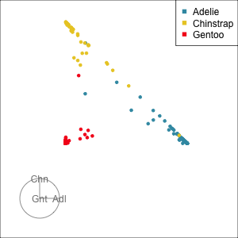

```{r, include = FALSE}
source("../setup.R")
library(ggpubr)
library(kableExtra)

#my.dir <- "C:/Users/jjew0003/Documents/Monash Teaching/ETC3250-5250/2025"

knitr::knit_hooks$set(crop = knitr::hook_pdfcrop)
#https://www.pmassicotte.com/posts/2022-08-15-removing-whitespace-around-figures-quarto/
```

## Overview

We will cover:

::: {.incremental}

* Classification trees, algorithm, stopping rules
* Difference between algorithm and parametric methods, especially trees vs Logistic regression
* Forests: ensembles of bagged trees
* Diagnostics: vote matrix, variable importance
* Boosted trees

:::

## Trees {.transition-slide .center}

[[Nice explanation of trees, forests, boosted trees](https://bcullen.rbind.io/post/2020-06-02-tidymodels-decision-tree-learning-in-r/)]{.f50}

## What is a Decision Tree

LDA divided the predictor space up into $K$ regions, one for each response

::: {.fragment}

Decision trees use a tree structure to divide up the feature space into regions with similar response behaviour

:::

::: {.fragment}

And predict the same response value (or probability) for observation in the same part of the tree

:::

<br>


::: {.fragment}

Consider trying to predict whether a customer would default on their credit card loan from their account balance and income

:::

::: {.fragment}

```{r}
#| echo: false
df <- tibble(ID = c("obs1", "obs2", "obs3", "obs4", "obs5"),
  Default = c("No", "No", "Yes", "No", "Yes"),
  Income = c(71, 65, 55, 76, 68), 
             Balance = c(26, 30, 36, 45, 53)
             )
df
```

:::

## What is a Decision Tree

```{r}
#| echo: false
df
```

Each **node** of a decision tree takes one variable and splits it at one point 

::: {.fragment}

<center>
{width=80%}
</center>


:::

## What is a Decision Tree

```{r}
#| echo: false
df
```

<center>
{width=80%}
</center>

## What is a Decision Tree

```{r}
#| echo: false
df
```

<center>
{width=70%}
</center>

## What is a Decision Tree

<center>
{width=100%}
</center>

## What is a Decision Tree

<center>
{width=50%}
</center>

::: {.fragment}

When a new observation arrives e.g. with `Income = 67` and `Balance = 20` we pass this observation through the tree.

:::

::: {.fragment}

`Income = 67` so Income > 64 is **TRUE**

:::

::: {.fragment}

`Balance = 20` so Balance < 50 is also **TRUE**

:::

::: {.fragment}

Then use the leaf node it appears in to predict its response and predict **NOT DEFAULT**
:::


## What is a Decision Tree

Decision trees use a tree structure to divide up the feature space into regions with similar response behaviour

::: {.fragment}

```{r}
#| echo: false
#| out-width: 60%
plot1 <- ggplot(df, aes(x = Balance, y = Income, shape = Default)) +
  geom_point()
plot1
```

:::

## What is a Decision Tree

Decision trees use a tree structure to divide up the feature space into regions with similar response behaviour

```{r}
#| echo: false
#| out-width: 100%
plot1 <- plot1 + 
  geom_hline(yintercept = 64, linetype = "dashed", colour = "grey", size = 1.5) +
  geom_text(x=45, y=60, label="DEFAULT")
plot1
```

## What is a Decision Tree

Decision trees use a tree structure to divide up the feature space into regions with similar response behaviour

```{r}
#| echo: false
#| out-width: 100%
plot1 + 
  geom_segment(x = 50, y = 64, xend = 50, yend = 78, linetype = "dashed", colour = "grey", size = 1.5) +
  geom_text(x=35, y=75, label="NOT DEFAULT") +
  geom_text(x=50, y=72, label="DEFAULT")
```


## What is a Decision Tree

Mathematically we can write a decision tree machine learning model as

$$
g(x; \beta, R) = \sum_{m=1}^M \beta_m\mathbb{I}(x\in R_m)
$$
where $\mathbb{I}(x\in R_m) =  1$ if $x\in R_m$ and $\mathbb{I}(x\not\in R_m) =  0$  otherwise. 

::: {.fragment}

For (binary) classification $P(Y = 1; x) = \frac{1}{1+e^{-g(x; \beta, R)}}$ (the logistic function)

:::

::: {.fragment}

For regression $\mathbb{E}[Y; x] = g(x; \beta, R)$ 

:::

<br>

::: {.fragment}

It is interesting to contrast this with (generalsied) linear models which sets$P(Y = 1; x) = \frac{1}{1+e^{-x^\top\beta}}$ for classification and $\mathbb{E}[Y; x] = x^\top\beta$ for regression. 

:::

::: {.fragment}

The non-linear (non-parametric) tree function $g(x; \beta, R)$ takes the place of the linear predictor $x^\top\beta$ 

:::

## What is a Decision Tree

<center>
{width=60%}
</center>

::: {.fragment}

In $R_1$, the probability of defaulting is $P(Y = 1| x) = \frac{1}{1+e^{-10}} = 0.9999$

:::

::: {.fragment}

In $R_2$, the probability of defaulting is $P(Y = 1| x) = \frac{1}{1+e^{9.5}} = 0.0000748$

:::

::: {.fragment}

In $R_3$, the probability of defaulting is $P(Y = 1| x) = \frac{1}{1+e^{9}} = 0.99988$

:::


## Fitting a Decision Tree

Fitting a decision tree to data requires

::: {.incremental}

+ Determining the regions $R_1, R_2, \ldots$ i.e. which variables to split and where
+ Estimating the parameters for each region i.e. $\beta_1, \beta_2, \ldots$

:::

::: {.fragment}

Estimating the $\beta_1, \beta_2, \ldots$ for fixed values of the $R_1, R_2, \ldots$ is quite straightforward. We can use Maximum likelihood restricted for the training observations within each leaf node $R_m$.

:::

::: {.fragment}

 Determining the regions $R_1, R_2, \ldots$ is more challenging. We will consider several different algorithms to do this

:::

::: {.fragment}

The idea, is to find the variable to split and the point to split by that makes the observations on the same branches after that split as similar as possible

:::


## CART Algorithm: growing a tree

CART: Classification And Regression Trees

:::: {.columns}
::: {.column style="font-size: 90%" .incremental}

1. All observations in a single set
2. [Sort]{.monash-blue2} values on first variable
3. Compute the chosen [split criteria]{.monash-blue2} for all possible splits into two sets
4. Choose the best split on this variable. Save this info.
5. Repeat 2-4 for all other variables
6. Choose the [best variable]{.monash-blue2} to split on, based on the best split. Your data is now in two sets. 
7. Repeat 1-6 on each subset.
8. [Stop]{.monash-blue2} when stopping rule that decides that the best  classification model is achieved. 

:::
::: {.column style="font-size: 90%" .fragment}

**Pros and cons**:

::: {.incremental}

- Trees are a very [flexible]{.monash-green2} way to fit a classifier.
- They can 
    - utilise [different types]{.monash-green2} of predictor variables
    - ignore [missing values]{.monash-green2}
    - handle different units or scales on variables
    - capture intricate patterns
- However, they operate on a per variable basis, and [do not effectively]{.monash-orange2} model separation when a [combination of variables]{.monash-orange2} is needed.
- Can be too flexible and need to be [regularised to avoid overfitting]{.monash-orange2}

:::

:::
::::

## Common split criteria

We want to split in ways the encourage observation with similar responses into the same split i.e. the child nodes have minimal variability in $y$

:::: {.columns .fragment}
::: {.column}


#### Classification

::: {.incremental}

- The [Gini index]{.monash-blue2} measures is defined as:
	$$G = \sum_{k =1}^K \widehat{p}_{mk}(1 - \widehat{p}_{mk})$$
	where $\widehat{p}_{mk}$ is the proportion of observation in subset $m$ of the data that belong to class $k$ 


:::
	
:::

::: {.column .incremental}

- Gini is maximised at $\widehat{p}_{mk} = 0.5$ i.e. a 50:50 split, and minimised when $\widehat{p}_{mk} = 0$ or $1$
- (Note $p (1-p)$ is the variance of a Bernoulli distribution with success probability $p$)
- [Entropy]{.monash-blue2} is defined as
	$$D = - \sum_{k =1}^K \widehat{p}_{mk} log(\widehat{p}_{mk})$$ 

:::
::::

## Common split criteria

We want to split in ways the encourage observation with similar responses into the same split i.e. the child nodes have minimal variability in $y$

:::: {.columns .fragment}
::: {.column .fragment}

#### Regression

Define 

$$\mbox{Var}_m = \frac{1}{n_m}\sum_{i=1}^{n_m} (y_{mi} - \bar{y}_m)^2$$
where $\bar{y}_m$ is the average response in subset $m$

:::
::: {.column .fragment}

Split the data where combining Variance for left bucket (Var_L) and right bucket (Var_R), makes the [biggest reduction from the overall Variance]{.monash-blue2}.

:::


::::

## Illustration [(1/2)]{.f70}

:::: {.columns}
::: {.column}
```{r}
#| echo: false
set.seed(65)
df <- tibble(x = sort(sample(10:90, 7)), 
             cl = factor(c("A", "A", "B", "A", 
                           "A", "B", "B")))
df |> kable() |> 
  kable_styling(bootstrap_options = 
                  c("striped", full_width = F))
```

**Note**: x is [sorted]{.monash-blue2} from lowest to highest!

:::

::: {.column}

::: {.fragment}

All possible splits shown by vertical lines

```{r fig.width=5, fig.height=3, out.width="100%"}
#| echo: false
possible_splits <- df$x[-7] + 
  diff(df$x, lag = 1, differences = 1)/2
ggplot(df, aes(x=x, y=cl, colour=cl)) + 
  geom_point() +
  geom_vline(xintercept = possible_splits, 
             colour = "#6F7C4D",
             linetype = 2) +
  annotate("text", x = possible_splits, y=2.25, 
           label = 1:6, 
           colour = "#6F7C4D", 
           hjust=0.05) +
  scale_colour_discrete_divergingx(
    palette = "Zissou 1") +
  ylab("") +
  theme(legend.position="none", aspect.ratio = 0.6)
```

What do you think is the best [split]{.monash-olive2}? [2, 3, 4 or 5]{.monash-olive2}??
:::

::: {.fragment}
You can see here that scale doesn't matter

:::

:::

::::

## Illustration [(2/2)]{.f70}

:::: {.columns}
::: {.column style="font-size: 70%"}

#### Calculate the impurity for split 5 

The [left]{.monash-orange2} bucket is

```{r}
#| echo: false
df |>
  slice(1:5) |> kable() |> 
  kable_styling(bootstrap_options = c("striped", full_width = F))
```

::: {.fragment}

and the [right]{.monash-orange2} bucket is

```{r}
#| echo: false
df |>
  slice(6:7) |> kable() |> 
  kable_styling(bootstrap_options = c("striped", full_width = F))
```

:::

:::
::: {.column style="font-size: 70%" .fragment}

Using Gini $G = \sum_{k =1}^K \widehat{p}_{mk}(1 - \widehat{p}_{mk})$

::: {.fragment}

[Left]{.monash-orange2} bucket: 

$$\widehat{p}_{LA} = 4/5, \widehat{p}_{LB} = 1/5, ~~ p_L = 5/7$$

$$G_L=0.8(1-0.8)+0.2(1-0.2) = 0.32$$

:::

::: {.fragment}

[Right]{.monash-orange2} bucket: 

$$\widehat{p}_{RA} = 0/2, \widehat{p}_{RB} = 2/2, ~~ p_R = 2/7$$

$$G_R=0(1-0)+1(1-1) = 0$$

:::

::: {.fragment}

Combine with weighted sum to get [impurity for the split]{.monash-orange2}:

$$p_LG_L + p_RG_R=0.23$$

:::

::: {.fragment}

<br><br>
[**Your turn**: Compute the impurity for split 2.]{.monash-blue2}

:::

:::
::::

## Categorical Predictors

:::: {.columns}
::: {.column}

**Splits on categorical variables**

```{r fig.width=5, fig.height=3, out.width="100%"}
#| echo: false
df_c <- tibble(x=c("emu", "emu", "roo", "roo", "koala", "koala"),
               cl=c("WA", "Vic", "WA", "Vic", "WA", "Vic"),
               count=c(5,3,7,1,2,6))
ggplot(df_c, aes(x=x, y=count, fill=cl)) + 
  geom_col() +
  xlab("") + ylab("") +
  scale_fill_discrete_divergingx() +
  theme(axis.text.y = element_blank())
```


:::
::: {.column .fragment}

We can construct a split of one category vs the other e.g. {`koala`} vs {`roo`, `emu`}

<br>

::: {.fragment}

Possible best split would be [if koala then assign to Vic else assign to WA]{.monash-blue2}, because Vic has more koalas but and WA has more emus and roos.

:::

:::
::::

## 

:::: {.columns}
::: {.column}

**Dealing with missing values on predictors**

```{r}
#| echo: false
set.seed(87)
df_m <- tibble(x1 = sample(10:20, 8), 
               x2 = sample(-10:0, 8),
               x3 = sample(21:37, 8),
               x4 = sample(-35:(-23), 8),
               y=c("A", "A", "B", "A", "A", "B", "B", "B")) 
df_m$x1[2] <- NA
df_m$x2[3] <- NA
df_m$x3[5] <- NA
df_m$x4[6] <- NA
df_m |> kable() |> 
  kable_styling(bootstrap_options = c("striped", full_width = F))
```

::: {.fragment}

50% of cases have missing values. 

:::


:::
::: {.column .fragment}

Default method to deal with missing data is either 

::: {.incremental}

+ Remove any variable (column) with a high proportion of missing data
+ Remove any observation (row) with a missing value i.e. obs2, obs3, obs5 and obs7 (i.e. half the data)
+ Or *impute* missing observations using their columns mean i.e. obs2 $\mapsto$ $(\bar{x}_1, -10, 26, -26, A)$

:::


:::
::::

## 

:::: {.columns}
::: {.column}

**Dealing with missing values on predictors**

```{r}
#| echo: false
set.seed(87)
df_m <- tibble(x1 = sample(10:20, 8), 
               x2 = sample(-10:0, 8),
               x3 = sample(21:37, 8),
               x4 = sample(-35:(-23), 8),
               y=c("A", "A", "B", "A", "A", "B", "B", "B")) 
df_m$x1[2] <- NA
df_m$x2[3] <- NA
df_m$x3[5] <- NA
df_m$x4[6] <- NA
df_m |> kable() |> 
  kable_styling(bootstrap_options = c("striped", full_width = F))
```


50% of cases have missing values. 


:::
::: {.column .fragment}

Trees only work with a [single variable]{.monash-blue2} at a time, so can easily just [ignore]{.monash-blue2}  a few missing values when calculating the plit criteria. 


::: {.fragment}
When [predicting]{.monash-orange2} an observation with missing values, imputation is required
:::

:::
::::

## Example: penguins [1/6]{.f70}

:::: {.columns}
::: {.column}

```{r}
#| echo: false
#| fig-width: 5
#| fig-height: 6
#| out-width: 80%
p_sub <- p_tidy |>
  filter(species != "Gentoo") |>
  mutate(species = factor(species)) |>
  select(species, bl, bm)

p_sub |>
  ggplot(aes(x=bl, y=bm, colour=species)) +
  geom_point() +
  scale_color_discrete_divergingx(
    palette = "Zissou 1") +
  theme(legend.position="bottom")
```
:::

::: {.column style="font-size: 80%" .fragment}

See [https://parsnip.tidymodels.org/reference/decision_tree.html](https://parsnip.tidymodels.org/reference/decision_tree.html)

```{r}
set.seed(1156)
p_split <- initial_split(p_sub, 2/3, strata=species)
p_tr <- training(p_split)
p_ts <- testing(p_split)

tree_spec <- decision_tree() |>
  set_mode("classification") |>
  set_engine("rpart")

p_fit_tree <- tree_spec |>
  fit(species~., data=p_tr)

```

::: {.fragment}


```{r}
#| output-location: fragment

p_fit_tree
```

:::

:::

::::

## Example: penguins [2/6]{.f70}

<center>
{width=100%}
</center>

## Example: penguins [3/6]{.f70}

```{r}
#| echo: false
#| fig-width: 5
#| fig-height: 6
#| out-width: 80%
p_tr |>
  ggplot(aes(x=bl, y=bm, colour=species)) +
  geom_point() +
  scale_color_discrete_divergingx(
    palette = "Zissou 1") +
  theme(legend.position="bottom") +
  geom_vline(xintercept = 43, linetype="dashed", col = "grey")
```

## Stopping rules

::: {.incremental}

- [Minimum split]{.monash-orange2}: number of observations in a node, in order for a split to be made
- [Tree depth]{.monash-orange2}: The maximum number of splits between the a terminal node and root node
- [Complexity parameter]{.monash-orange2}: minimum difference between impurity values required to continue splitting

<!---
- [Minimum bucket]{.monash-orange2}: Minimum number of observations allowed in a terminal node
--->

:::

## Example: penguins [4/6]{.f70}

:::: {.columns}
::: {.column}

Defaults for `rpart` are:

<br>

<!---

```
rpart.control(minsplit = 20, 
  minbucket = round(minsplit/3), 
  cp = 0.01, 
  maxcompete = 4, 
  maxsurrogate = 5, 
  usesurrogate = 2, 
  xval = 10,
  surrogatestyle = 0, maxdepth = 30, 
  ...)
```

--->

```
rpart.control(minsplit = 20, 
  cp = 0.01, 
  maxdepth = 30, 
  ...)
```

:::
::: {.column}

::: {.fragment}

```{r}
tree_spec <- decision_tree() |>
  set_mode("classification") |>
  set_engine("rpart",
             control = rpart.control(minsplit = 10), 
             model=TRUE)

p_fit_tree <- tree_spec |>
  fit(species~., data=p_tr)
```

:::

::: {.fragment}

```{r}
#| output-location: fragment

p_fit_tree
```

:::


:::
::::

## Example: penguins [5/6]{.f70}

:::: {.columns}
::: {.column}

```{r}
#| output-location: fragment

p_fit_tree |>
  extract_fit_engine() |>
  rpart.plot(type=3, extra=1)

```

:::
::: {.column .fragment}

```{r}
#| echo: false
#| fig-width: 5
#| fig-height: 6
#| out-width: 80%
p_tr |>
  ggplot(aes(x=bl, y=bm, colour=species)) +
  geom_point(shape=1) +
  scale_color_discrete_divergingx(palette = "Zissou 1") +
  annotate("segment", x=43, xend=43, 
           y=3388, yend=3825, linetype=2) +
  annotate("segment", x=41, xend=41, 
           y=2700, yend=3388, linetype=2) +
  annotate("segment", x=41, xend=43, 
           y=3388, yend=3388, linetype=2) +
  annotate("segment", x=46, xend=46, 
           y=3825, yend=4800, linetype=2) +
  annotate("segment", x=43, xend=46, 
           y=3825, yend=3825, linetype=2) +  
  theme(legend.position="bottom")
```

:::
::::

## Example: penguins [6/6]{.f70}

:::: {.columns}
::: {.column}

Model fit summary

```{r}
#| echo: false
p_ts_pred <- p_ts |>
  mutate(pspecies = predict(p_fit_tree$fit, 
                            p_ts, 
                            type="class"))
accuracy(p_ts_pred, species, pspecies)
p_ts_pred |>
  count(species, pspecies) |>
  group_by(species) |>
  mutate(Accuracy = n[species==pspecies]/sum(n)) |>
  pivot_wider(names_from = "pspecies", 
              values_from = n) |>
  select(species, Adelie, Chinstrap, Accuracy)
bal_accuracy(p_ts_pred, species, pspecies)
```

:::

::: {.column .fragment}

Model-in-the-data-space

```{r}
#| echo: false
#| fig-width: 5
#| fig-height: 6
#| out-width: 80%
p_all <- p_sub |>
  mutate(set = ifelse(c(1:nrow(p_sub)) %in% p_split$in_id, "train", "test")) |>
  mutate(set = factor(set, levels=c("train", "test")))
p_all |>
  ggplot(aes(x=bl, y=bm, colour=species, 
             shape=set)) +
  geom_point() +
  scale_color_discrete_divergingx(palette = "Zissou 1") +
  scale_shape_manual(values=c(1, 19)) +
  annotate("segment", x=43, xend=43, 
           y=3388, yend=3825, linetype=2) +
  annotate("segment", x=41, xend=41, 
           y=2700, yend=3388, linetype=2) +
  annotate("segment", x=41, xend=43, 
           y=3388, yend=3388, linetype=2) +
  annotate("segment", x=46, xend=46, 
           y=3825, yend=4800, linetype=2) +
  annotate("segment", x=43, xend=46, 
           y=3825, yend=3825, linetype=2) +  theme(legend.position="bottom",
        legend.title = element_blank())
```
:::
::::

## Comparison with logistic regression

::: {.columns}

::: {.column}

<center>Tree model</center>

```{r}
#| echo: false
#| fig-width: 5
#| fig-height: 5
#| out-width: 70%
p_explore <- explore(p_fit_tree$fit, p_all) |>
  mutate(set = factor(c(rep(NA, 10000), p_all$set)))

ggplot() +
  geom_point(data=
               p_explore[p_explore$.TYPE == 
                           "simulated",], 
             aes(x=bl, y=bm, colour=species), 
             shape=16, alpha=0.1) +
  geom_point(data=
               p_explore[p_explore$.TYPE == 
                           "actual",], 
             aes(x=bl, y=bm, colour=species, 
                 shape=set), 
             inherit.aes = FALSE) +
  scale_color_discrete_divergingx(palette = "Zissou 1") +
  scale_shape_manual(values=c(1, 19)) +
  theme(legend.position="none")
```

<center>
[Data-driven, only split on single variables]{.smallest}
</center>

:::
::: {.column .fragment}

<!---
<center> LDA model </center>
--->

<center> Logistic regression model </center>

```{r}
#| echo: false
#| fig-width: 5
#| fig-height: 5
#| out-width: 70%
#lda_spec <- discrim_linear() |>
#  set_mode("classification") |>
#  set_engine("MASS")
#p_lda_fit <- lda_spec |> 
#  fit(species ~ ., data = p_tr)
log_spec <- logistic_reg() |> 
  set_engine("glm") |> 
  set_mode("classification")
p_log_fit <- log_spec |> 
  fit(species ~ ., data = p_tr)

#p_explore <- explore(p_lda_fit$fit, p_all) |>
p_explore <- explore(p_log_fit$fit, p_all) |>
  mutate(set = factor(c(rep(NA, 10000), p_all$set)))

ggplot() +
  geom_point(data=
               p_explore[p_explore$.TYPE == 
                           "simulated",], 
             aes(x=bl, y=bm, colour=species), 
             shape=16, alpha=0.1) +
  geom_point(data=
               p_explore[p_explore$.TYPE == 
                           "actual",], 
             aes(x=bl, y=bm, colour=species, 
                 shape=set), 
             inherit.aes = FALSE) +
  scale_color_discrete_divergingx(palette = "Zissou 1") +
  scale_shape_manual(values=c(1, 19)) +
  theme(legend.position="none")
```

<!---
<center>
[Assume normal, equal VC, oblique splits]{.smallest}
</center>
--->

<center>
[oblique splits (combination fo variables)]{.smallest}
</center>


:::
::::

## Learning tree hyperparameters

For given stopping rules, the CART algorithm learns the splits and the reponse parameter in each terminal node.

::: {.fragment}

However, it doesn't tell us what stopping rule to use, i.e. which values of `minsplit`, `cp`, and `maxdepth` to use

:::

::: {.fragment}

These are our tree hyper parameters that we learn by cross-validation 

:::

::: {.fragment}

Cross-validation splits the **training data** into disjoint subset, and iteratively uses one as a *mini* test set the evaluate the model fitted on the remaining sets

:::


## Cross-validation in the `tidymodels`

:::: {.columns}
::: {.column}

```{r}
tune_spec <- 
  decision_tree(
    cost_complexity = tune(),
    tree_depth = tune(),
    min_n = tune()
  ) |> 
  set_engine("rpart") |> 
  set_mode("classification")

```

::: {.fragment}

```{r}
tree_grid <- grid_regular(cost_complexity(),
                          tree_depth(),
                          min_n(),
                          levels = 5)
```                          
:::

::: {.fragment}

```{r}
unique(tree_grid$cost_complexity)
unique(tree_grid$tree_depth)
unique(tree_grid$min_n)
```

:::

<br>

::: {.fragment}

```{r}
set.seed(234)
p_folds <- vfold_cv(p_tr, v = 5, strata = species)

```

:::

:::
::: {.column .fragment}


```{r}
set.seed(345)

tree_wf <- workflow() |>
  add_model(tune_spec) |>
  add_formula(species~.)

```  

::: {.fragment}

```{r}
#| cache: true
tree_res <- 
  tree_wf |> 
  tune_grid(
    resamples = p_folds,
    grid = tree_grid,
    metrics = NULL #NULL to compute a standard set of metrics.
    )

```

:::

::: {.fragment}

```{r}
tree_res |>
  collect_metrics() |>
  slice_head(n = 6)
```

:::


:::


::::


## Cross-validation in the `tidymodels`

<br>

::: {.fragment}

```{r}
tree_res |>
  show_best(metric = "roc_auc")
```

:::

::: {.fragment}

```{r}
tree_res |>
  select_best(metric = "roc_auc")
```

:::

::: {.fragment}

For more information see - https://www.tidymodels.org/start/tuning/

:::


## Argument names

:::: {.columns}
::: {.column}
**rpart**

::: {.incremental}

- [Minimum split]{.monash-orange2} = `minsplit`
- [Tree depth]{.monash-orange2} = `maxdepth`
- [Complexity parameter]{.monash-orange2} = `cp`

:::

::: {.fragment}

```{r}
#| eval: false

tree_spec <- decision_tree() |>
  set_mode("classification") |>
  set_engine("rpart",
             control = rpart.control(minsplit = 10), 
             model=TRUE)

```

:::

:::
::: {.column .fragment}

**tidymodels**

::: {.incremental}

- [Minimum split]{.monash-orange2} = `min_n`
- [Tree depth]{.monash-orange2} = `tree_depth`
- [Complexity parameter]{.monash-orange2} = `cost_complexity`

:::

::: {.fragment}

```{r}

tree_spec <- 
  decision_tree(
    min_n = 10
  ) |> 
  set_engine("rpart") |> 
  set_mode("classification")

```

:::

:::

::::

## Decision tree limitations

Decision trees provide us with an extremely powerful machine learning model 

::: {.fragment}

It can capture complex non-linear dynamics, using a tree to divide up the predictor space and group similar training observations togther. 

:::

::: {.fragment}

A major limitation of decision trees is that they are too flexible - it is very easy for them to perfectly classify the training data

:::

::: {.fragment}

This means they can very easily overfit the data - learn about the noise in the observed data rather than the signal in the process that generated the data

:::

::: {.fragment}

Learning the stopping criteria via cross-validation prevents this overfitting, but often leads to conservative models that don't fully exploit the DTs power

:::


## Random forests {.transition-slide .center}


## From Trees to Forests

A forest is an [ensemble]{.monash-blue2} classifier, built from fitting and combining [multiple trees]{.monash-blue2}.

::: {.fragment}

Remember we wrote our machine learning decision tree model as
$$
g(x; \beta, R) = \sum_{m=1}^M \beta_m\mathbb{I}(x\in R_m)
$$

:::

::: {.fragment}

A tree ensemble uses
$$
g(x; \beta, R) = \sum_{t=1}^T \alpha_t g_t(x; \beta_t, R_t)
$$
where $g_t(x; \beta_t, R_t)$ are individual decision trees and $\alpha_t$ is a weight for each tree

:::


## Overview 

A random forest is an [ensemble]{.monash-blue2} classifier, built from fitting [multiple trees]{.monash-blue2} to [different subsets]{.monash-blue2} of the training data.

::: {.fragment}

If we fit $T$ trees then $\alpha_t = \frac{1}{T}$ and each $g_t(x; \beta_t, R_t)$ is a decision tree estimated on a different subset of the data 

:::

::: {.fragment}

These subsets are generated by 

::: {.incremental}

+ boostrapping observations (sampling with replacement)
+ sampling columns without replacement

:::

:::


::: {.fragment}

```{r}
#| echo: false
#| fig-width: 15
#| fig-height: 7
#| out-width: 60%
#| crop: true
d <- as.data.frame(matrix(1, nrow=32, ncol=7))

set.seed(529)
d1 <- d 
d1[sample(1:32, 11), ] <- 0
d1[, sample(1:7, 3)] <- 0

p1 <- d1 |> 
  mutate(id = 1:32) |>
  pivot_longer(V1:V7, names_to = "V", 
               values_to = "value") |>
  mutate(value = factor(value, 
                        labels=c("out", "in"))) |>
  ggplot(aes(x=V, y=id, fill=value)) +
    geom_tile(colour="white") +
    scale_fill_discrete_divergingx(palette="Cividis",
                                   rev=1) +
    ggtitle("Sample 1") +
    theme(axis.title = element_blank(),
          axis.text.y = element_blank(),
          legend.title = element_blank()) 

d1 <- d 
d1[sample(1:32, 11), ] <- 0
d1[, sample(1:7, 3)] <- 0

p2 <- d1 |> 
  mutate(id = 1:32) |>
  pivot_longer(V1:V7, names_to = "V", 
               values_to = "value") |>
  mutate(value = factor(value, 
                        labels=c("out", "in"))) |>
  ggplot(aes(x=V, y=id, fill=value)) +
    geom_tile(colour="white") +
    scale_fill_discrete_divergingx(palette="Cividis",
                                   rev=1) +
    ggtitle("Sample 2") +
    theme(axis.title = element_blank(),
          axis.text.y = element_blank(),
          legend.title = element_blank()) 
  
d1 <- d 
d1[sample(1:32, 11), ] <- 0
d1[, sample(1:7, 3)] <- 0

p3 <- d1 |> 
  mutate(id = 1:32) |>
  pivot_longer(V1:V7, names_to = "V", 
               values_to = "value") |>
  mutate(value = factor(value, 
                        labels=c("out", "in"))) |>
  ggplot(aes(x=V, y=id, fill=value)) +
    geom_tile(colour="white") +
    scale_fill_discrete_divergingx(palette="Cividis",
                                   rev=1) +
    ggtitle("Sample 3") +
    theme(axis.title = element_blank(),
          axis.text.y = element_blank(),
          legend.title = element_blank()) 

p1 + p2 + p3 + plot_layout(ncol=3, guides = "collect")
```

:::


## Bagging and variable sampling

:::: {.columns}
::: {.column .incremental}

- Take $T$ different [bootstrapped]{.monash-blue2} training sets:
$D_1, D_2, \dots, D_T$, each using a [sample of variables]{.monash-blue2}.
- Build a separate prediction model using each $D_{(\cdot)}$:
$$\widehat{g}_1(x), \widehat{g}_2(x), \dots, \widehat{g}_T(x)$$
- Predict the **out-of-bag** cases for each tree

<!---
- Predict the **out-of-bag** cases for each tree, compute [proportion]{.monash-blue2} of trees a case was predicted to be each class. 
- [Predicted value]{.monash-blue2} for each observation is the class with the highest proportion.
--->

::: {.fragment}

Random forests directly try to address the bias variance tradeoff

:::

:::

::: {.column }


::: {.incremental}

- Each individual tree has the same bias
- Aggregating trees leave the bias unchanged
- Each individual tree has [high variance]{.monash-orange2} i.e. can easily overfit its training data. 
- Aggregating the results from $T$ trees [reduces the variance]{.monash-orange2} as different trees were trained on different data, so the ensembles can not overfit any one dataset. 

:::

::: {.fragment}

Should still use cross-validation to learn stopping rules that are used in each tree of the forest

:::

:::
::::

## Comparison with a single tree and LDA

::: {.columns}

::: {.column width=33%}

<center>Tree model</center>

```{r}
#| echo: false
#| fig-width: 4
#| fig-height: 4
#| out-width: 100%
p_explore <- explore(p_fit_tree$fit, p_all) |>
  mutate(set = factor(c(rep(NA, 10000), p_all$set)))

ggplot() +
  geom_point(data=
               p_explore[p_explore$.TYPE == 
                           "simulated",], 
             aes(x=bl, y=bm, colour=species), 
             shape=16, alpha=0.1) +
  geom_point(data=
               p_explore[p_explore$.TYPE == 
                           "actual",], 
             aes(x=bl, y=bm, colour=species, 
                 shape=set), 
             inherit.aes = FALSE) +
  scale_color_discrete_divergingx(palette = "Zissou 1") +
  scale_shape_manual(values=c(1, 19)) +
  theme(legend.position="none")
```

<center>
[Data-driven, only split on single variables]{.smallest}
</center>

:::

::: {.column width=33%}

<center> Random forest </center>

```{r }
#| echo: false
#| fig-width: 4
#| fig-height: 4
#| out-width: 100%
set.seed(632)
rf_spec <- rand_forest(mtry=2, trees=1000) |>
  set_mode("classification") |>
  set_engine("randomForest")
p_fit_rf <- rf_spec |> 
  fit(species ~ ., data = p_tr)

# explore() throws an error
p_explore <- tibble(bl = runif(10000, 32, 58),
                    bm = runif(10000, 2700, 4800)) 
p_explore$species <- predict(p_fit_rf$fit, 
                             p_explore,
                           type="response")
p_explore <- p_explore |>
  select(species, bl, bm)

ggplot() +
  geom_point(data=p_explore, 
             aes(x=bl, y=bm, colour=species), 
             shape=16, alpha=0.1) +
  geom_point(data=p_all, 
             aes(x=bl, y=bm, colour=species, 
                 shape=set), 
             inherit.aes = FALSE) +
  scale_color_discrete_divergingx(palette = "Zissou 1") +
  scale_shape_manual(values=c(1, 19)) +
  theme(legend.position="none")
```

<center>
[Data-driven, multiple trees gives non-linear fit]{.smallest}
</center>
:::

::: {.column width=33%}

<center> Logistic regression model </center>

```{r}
#| echo: false
#| fig-width: 4
#| fig-height: 4
#| out-width: 100%
#lda_spec <- discrim_linear() |>
#  set_mode("classification") |>
#  set_engine("MASS")
#p_lda_fit <- lda_spec |> 
#  fit(species ~ ., data = p_tr)
log_spec <- logistic_reg() |> 
  set_engine("glm") |> 
  set_mode("classification")
p_log_fit <- log_spec |> 
  fit(species ~ ., data = p_tr)

p_explore <- explore(p_log_fit$fit, p_all) |>
  mutate(set = factor(c(rep(NA, 10000), p_all$set)))

ggplot() +
  geom_point(data=
               p_explore[p_explore$.TYPE == 
                           "simulated",], 
             aes(x=bl, y=bm, colour=species), 
             shape=16, alpha=0.1) +
  geom_point(data=
               p_explore[p_explore$.TYPE == 
                           "actual",], 
             aes(x=bl, y=bm, colour=species, 
                 shape=set), 
             inherit.aes = FALSE) +
  scale_color_discrete_divergingx(palette = "Zissou 1") +
  scale_shape_manual(values=c(1, 19)) +
  theme(legend.position="none")
```

<center>
[Assume normal, equal VC, oblique splits]{.smallest}
</center>
:::
::::

## Random forest fit and predicted values

See - [https://parsnip.tidymodels.org/reference/rand_forest.html](https://parsnip.tidymodels.org/reference/rand_forest.html)

:::: {.columns}
::: {.column}

```{r}
#| eval: false
rf_spec <- rand_forest(mtry=2, trees=1000) |>
  set_mode("classification") |>
  set_engine("randomForest")
p_fit_rf <- rf_spec |> 
  fit(species ~ ., data = p_tr)
```

`mtry` is the number of predictors used in each tree

::: {.fragment}

```{r}
p_fit_rf
```

:::

:::

::: {.column .fragment}
Predicted values

```{r}
#| echo: false
p_ts_pred <- p_ts |>
  mutate(pspecies = predict(p_fit_rf$fit, 
                            p_ts, 
                            type="response"))
accuracy(p_ts_pred, species, pspecies)
p_ts_pred |>
  count(species, pspecies) |>
  group_by(species) |>
  mutate(Accuracy = n[species==pspecies]/sum(n)) |>
  pivot_wider(names_from = "pspecies", 
              values_from = n, 
              values_fill = 0) |>
  select(species, Adelie, Chinstrap, Accuracy)
bal_accuracy(p_ts_pred, species, pspecies)
```

::: {.fragment}
[Warning:]{.monash-orange2} Don't use the `predict()` on the [training set]{.monash-orange2}, you'll always get 0 error. The object `p_fit_rf$fit$predict` has the fitted values.
:::

:::
::::

<!---

## Diagnostics

::: {.incremental}

- [Error]{.monash-blue2} is computed automatically on the [out-of-bag]{.monash-blue2} cases.
- [Vote matrix]{.monash-blue2}, $n\times K$: Proportion of times a case is predicted to the class $k$. Also consider these to be [predictive probabilities]{.monash-orange2}.
- [Variable importance]{.monash-blue2}: uses [permutation]{.monash-orange2}!
- [Proximities]{.monash-blue2}, $n\times n$: Closeness of cases measured by how often they are in the same terminal node.

:::

--->

## Vote Matrix


<!---
https://stats.stackexchange.com/questions/412559/fitted-rf-difference-between-the-probabilities-in-votes-and-predict-type-pro
--->

:::: {.columns}
::: {.column}
```{r}
p_fit_rf$fit$votes
```
:::
::: {.column .incremental}

- For each tree, predict the class (probability) for each [out-of-bag]{.monash-orange2} observation
- [Average across trees where this observation was oob]{.monash-orange2} ranges between 0-1
- Can be used to [identify troublesome]{.monash-orange2} cases.
- Used with plots of the actual data can help determine if it is the record itself that is the problem, or if method is biased.
- Understand the difference in accuracy of prediction for different classes.
- in-sample out-of-sample accuracy

:::

::::

<!---

## Curious

:::: {.columns}
::: {.column}
Where are the Adelie penguins in the training set that are misclassified?

```{r}
#| echo: false
p_fit_rf
```

::: {.fragment style="font-size: 70%"}
[Join data]{.monash-orange2} containing true, predicted and predictive probabilities, to [diagnose]{.monash-orange2}.
:::

:::

::: {.column}
::: {.fragment}

```{r}
#| echo: false
# Need to run again bc LDA overwrote
p_explore <- tibble(bl = runif(10000, 32, 58),
                    bm = runif(10000, 2700, 4800)) 
p_explore$species <- predict(p_fit_rf$fit, 
                             p_explore,
                           type="response")
p_explore <- p_explore |>
  select(species, bl, bm)

```

```{r}
#| echo: false
p_tr_pred <- p_tr |>
  mutate(pspecies = p_fit_rf$fit$predicted) |>
  bind_cols(p_fit_rf$fit$votes)

p_tr_pred |>
  filter(species != pspecies)
```

```{r}
#| echo: false
p_tr_wrong <- p_tr_pred |>
  filter(species != pspecies)
ggplot() +
  geom_point(data=p_explore, 
             aes(x=bl, y=bm, colour=species), 
             shape=16, alpha=0.1) +
  geom_point(data=p_all, 
             aes(x=bl, y=bm, colour=species, 
                 shape=set), 
             inherit.aes = FALSE) +
  scale_color_discrete_divergingx(palette = "Zissou 1") +
  scale_shape_manual(values=c(1, 19)) +
  theme(legend.position="none") +
  geom_point(data=p_tr_wrong, 
             aes(x=bl, y=bm, colour=species), 
             shape=5, size=4,
             inherit.aes = FALSE)
```
:::
:::
::::

--->

## Variable importance [(1/2)]{.f70}

Each split only depends on one variable

::: {.fragment}

[Gini importance]{.monash-orange2} adds up the difference in impurity value of the descendant nodes with the parent node for any split involving that variable. Quick to compute.

:::


::: {.fragment}

Alternatively,

1. For every tree predict the oob cases and count the number of votes [cast for the correct class]{.monash-orange2}. 

:::

::: {.fragment}
2. [Randomly permute]{.monash-orange2} the values on a variable in the oob cases and predict the class for these cases. 
:::

::: {.fragment}
3. Difference the votes for the correct class in the variable-permuted oob cases and the real oob cases. Average this number over all trees in the forest. If the [value is large, then the variable is very important]{.monash-orange2}. 
:::


::: {.fragment style="font-size: 80%"}
Read a fun explanation by [Harriet Mason](https://numbat.space/posts/permutation_variable_importance/)
:::

## Variable importance [(2/2)]{.f70}

:::: {.columns}
::: {.column}

```{r}
p_fit_rf$fit$importance
```

```{r}
#| echo: false
#| fig-width: 5
#| fig-height: 5
#| out-width: 70%
ggplot(p_tr, aes(x=bl, y=bm, colour=species)) +
  geom_point()  +
  scale_color_discrete_divergingx(palette = "Zissou 1") +
  ggtitle("Training data") +
  theme(legend.position="none")
```

:::
::: {.column style="font-size: 70%" .frame .fragment}


```{r}
#| fig-width: 5
#| fig-height: 5
#| out-width: 70%
p_tr_perm <- p_tr |>
  mutate(bl = sample(bl))
ggplot(p_tr_perm, aes(x=bl, y=bm, colour=species)) +
  geom_point()  +
  scale_color_discrete_divergingx(palette = "Zissou 1") +
  ggtitle("Permuted bl") +
  theme(legend.position="none")
```

:::


::::

<!---

## Proximities

- Measure how [each pair]{.monash-blue2} of observations land in the forest
- Run both in- and out-of-bag cases down the tree, and increase proximity value of cases $i, j$ by 1 each time they are in the same terminal node. 
- Normalize by dividing by $B$.

This creates a [**similarity matrix**]{.monash-blue2} between all pairs of observations. 

- Use this for cluster analysis of the data for further diagnosing unusual observations, and model inadequacies.

--->

## Utilising diagnostics [(1/3)]{.f70}

:::: {.columns}
::: {.column}
[Probabilities]{.monash-orange2} yields more information than the confusion matrix, about the [confidence]{.monash-orange2} that the model has in the prediction for each observation, in the training set.

::: {.fragment}

Let's re-fit the random forest model to the three species of the penguins.

:::

::: {.fragment}

And examine the votes matrix

:::
:::
::: {.column .fragment}

```{r}
#| echo: false
set.seed(923)
p_split2 <- initial_split(p_tidy, 2/3, strata=species)
p_tr2 <- training(p_split2)
p_ts2 <- testing(p_split2)

rf_spec <- rand_forest(mtry=2, trees=1000) |>
  set_mode("classification") |>
  set_engine("randomForest")
p_fit_rf2 <- rf_spec |> 
  fit(species ~ ., data = p_tr2)
```

<!---

```{r}
#| echo: false
#| eval: false
# Votes
animate_xy(p_fit_rf2$fit$votes, col=p_tr2$species)

# Save an animated gif
render_gif(p_fit_rf2$fit$votes,
           grand_tour(),
           display_xy(v_rel=0.02, 
             col=p_tr2$species, 
             axes="bottomleft"), 
           gif_file="../gifs/penguins_rf_votes.gif",
           frames=500,
           width=300,
           height=300,
           loop=FALSE
)

```


<center>
{width=300}
</center>

--->

```{r}
#| echo: false
# Votes reduce dim
proj <- t(geozoo::f_helmert(3)[-1,])
p_rf_v_p <- as.matrix(p_fit_rf2$fit$votes) %*% proj
colnames(p_rf_v_p) <- c("x1", "x2")
p_rf_v_p <- p_rf_v_p |>
  as.data.frame() |>
  mutate(species = p_tr2$species)

# Add simplex
simp <- simplex(p=2)
sp <- data.frame(cbind(simp$points), simp$points[c(2,3,1),])
colnames(sp) <- c("x1", "x2", "x3", "x4")
sp$species = sort(unique(p_tr2$species))
p_ternary <- ggplot() +
  geom_segment(data=sp, aes(x=x1, y=x2, xend=x3, yend=x4)) +
  geom_text(data=sp, aes(x=x1, y=x2, label=species),
            nudge_x=c(-0.06, 0.07, 0),
            nudge_y=c(0.05, 0.05, -0.05)) +
  geom_point(data=p_rf_v_p, aes(x=x1, y=x2, 
                                colour=species), 
             size=2, alpha=0.5) +
  scale_color_discrete_divergingx(palette="Zissou 1") +
  theme_map() +
  theme(aspect.ratio=1, legend.position="none")
```

```{r}
#| fig-width: 4
#| fig-height: 4
#| out-width: 60%
p_ternary
```
:::
::::

## Utilising diagnostics [(2/3)]{.f70}

DEMO: Use interactivity to investigate the uncertainty in the predictions.

```{r}
#| echo: true
#| eval: false
library(detourr)
library(crosstalk)
library(plotly)
library(viridis)
p_tr2_std <- p_tr2 |>
  mutate_if(is.numeric, function(x) (x-mean(x))/sd(x))
p_tr2_v <- bind_cols(p_tr2_std, p_rf_v_p[,1:2]) 
p_tr2_v_shared <- SharedData$new(p_tr2_v)

detour_plot <- detour(p_tr2_v_shared, tour_aes(
  projection = bl:bm,
  colour = species)) |>
    tour_path(grand_tour(2), 
                    max_bases=50, fps = 60) |>
       show_scatter(alpha = 0.9, axes = FALSE,
                    width = "100%", 
                    height = "450px",
                    palette = hcl.colors(3,
                      palette="Zissou 1"))

vot_mat <- plot_ly(p_tr2_v_shared, 
                    x = ~x1,
                    y = ~x2,
                    color = ~species,
                    colors = hcl.colors(3,
                        palette="Zissou 1"),
                    height = 450) |>
  highlight(on = "plotly_selected", 
              off = "plotly_doubleclick") |>
    add_trace(type = "scatter", 
              mode = "markers")
  
bscols(
     detour_plot, vot_mat,
     widths = c(5, 6)
 )                 
```

<!---
Should test of this makes sense with in-sampel predictions!

--->


## Utilising diagnostics [(3/3)]{.f70}

:::: {.columns}
::: {.column}

Variable importance can help with [variable selection]{.monash-orange2}. 

<br>

```{r}
p_fit_rf2$fit$importance
```

::: {.fragment}

Top two variables are `bl` and `fl`. 
<br>
<br>
:::

::: {.fragment}

Especially useful when you have many more variables.
:::

:::

::: {.column .fragment}

```{r}
#| echo: false
ggplot(p_tr2, aes(x=bl, y=fl, colour=species)) +
  geom_point() + 
  scale_colour_discrete_divergingx(palette = "Zissou 1")
```
:::
::::

## Boosting {.transition-slide .center}

## Boosted trees [(1/4)]{.f70}

Random forests build an ensemble of [independent trees]{.monash-blue2}, while [boosted trees]{.monash-orange2} build an ensemble from [shallow trees in a sequence]{.monash-orange2} with each tree learning and improving on the mistakes of previous ones.

::: {.fragment}

<center>

</center>

[Source: [Boehmke (2020) Hands on Machine Learning with R](https://bradleyboehmke.github.io/HOML/)]{.smallest}

:::


## From Trees to Forests to Boosting

Boosting is also an [ensemble]{.monash-blue2} classifier that also uses a forest of trees. Boosting however [iteratively build trees]{.monash-blue2} to correct for errors of previous trees.

::: {.fragment}

Remember we wrote our machine learning decision tree model as
$$
g(x; \beta, R) = \sum_{m=1}^M \beta_m\mathbb{I}(x\in R_m)
$$

:::

::: {.fragment}

A tree ensemble uses
$$
g(x; \beta, R) = \sum_{t=1}^T \alpha_t g_t(x; \beta_t, R_t)
$$
where $g_t(x; \beta_t, R_t)$ are individual decision trees and $\alpha_t$ is a weight for each tree

:::

## From Trees to Forests to Boosting

Boosting is also an [ensemble]{.monash-blue2} classifier that also uses a forest of trees. Boosting however [iteratively build trees]{.monash-blue2} to correct for errors of previous trees.

::: {.fragment}

Random forests took weight $\alpha_t = \frac{1}{T}$ and built each  tree $g_t(x; \beta_t, R_t)$ using a random subset of observations and variables in the data. Each tree was independent of the previous trees


:::

::: {.fragment}

Boosting learns weight $\alpha_t\in(0, 1)$ and tree $g_t(x; \beta_t, R_t)$ to improve upon the performance of the previous $t-1$ trees.


:::

::: {.fragment}

Doesn't change previous trees and adds one tree to the ensemble at a time.

:::
## Boosted trees [(2/4)]{.f70}

Boosting iteratively fits multiple trees, to correct errors made by previous trees. 

::: {.incremental}

1. Fit a tree with fixed $m$ splits ($m+1$ terminal nodes) to the whole data set ($m$ is often taken small to make sure each tree can't overfit).
2. For $t=2, \ldots, T$, repeat:<br>
    a. Compute errors of ensemble to date - $g(x; \beta, R) = \sum_{k=1}^{t-1} \alpha_k g_k(x; \beta_k, R_k)$  <br>
    b. Fit tree $g_t(x; \beta_t, R_t)$ and $\alpha_t$ to best correct for these errors  <br>
3. Aggregate predictions from all trees - $g(x; \beta, R) = \sum_{t=1}^{T} \alpha_t g_t(x; \beta_t, R_t)$.

:::

::: {.fragment}

[This [StatQuest video by Josh Starmer](https://www.youtube.com/embed/jxuNLH5dXCs), is the best explanation!]{.smallest}

[And this is a fun explanation of boosting [by Harriet Mason](https://numbat.space/posts/boosting/).]{.smallest}

:::


## Boosted trees [(3/4)]{.f70}

There are two main strategies to fit a new tree to improve errors of past trees

<br>

::: {.fragment}

[Reweight]{.monash-orange2} observations, upweighting those that were predicted poorly before and downweighting those that were predicted well - known as **AdaBoost**

:::

::: {.fragment}

Introduces a weight $w_i \in (0, 1)$ for each observation and use these weight when computing splitting criteria e.g. Gini would use weighted proportions

:::

<br>

::: {.fragment}

Calculate [residuals or pseudo-residuals]{.monash-orange2} of the ensemble so far for each observation's reponse, and train subsequent trees on this- known as **Gradient Boosting**

:::


## Boosted trees [(4/4)]{.f70}

```{r}
set.seed(1110)
bt_spec <- boost_tree() |>
  set_mode("classification") |>
  set_engine("xgboost")
p_fit_bt <- bt_spec |> 
  fit(species ~ ., data = p_tr2)
```

::: {.fragment}

```{r}
#| echo: false
p_ts2_pred <- p_ts2 |>
  mutate(pspecies = predict(p_fit_bt, 
                            p_ts2)$.pred_class)
accuracy(p_ts2_pred, species, pspecies)
p_ts2_pred |>
  count(species, pspecies) |>
  group_by(species) |>
  mutate(Accuracy = n[species==pspecies]/sum(n)) |>
  pivot_wider(names_from = "pspecies", 
              values_from = n, values_fill = 0) |>
  select(species, Adelie, Chinstrap, Gentoo, Accuracy)
```

:::

## Limitations of trees

::: {.incremental}

- Most implementations only splits on a single variable, not combinations.
- There are versions that build trees on combinations, eg [PPTreeViz](https://cran.r-project.org/web/packages/PPtreeViz/index.html) and [PPforest](https://natydasilva.github.io/PPforest/), but you lose interpretability, and fitting is more difficult.
- Sees only splits, but not gaps. (See support vector machines, in a few weeks.)
- Need tuning and cross-validation.

:::

## Next: Neural networks and deep learning {.transition-slide .center}


