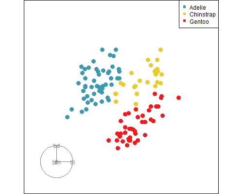
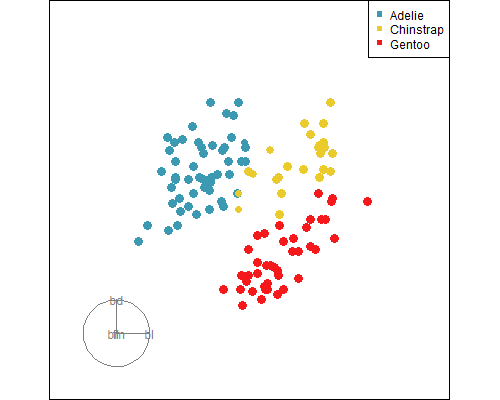

<!--
devtools::install_github("koncina/unilur")
devtools::install_github("hadley/emo")

Had to run this in the week 1 folder in the terminal in R
cd C:\Users\jjew0003\Documents\Monash Teaching\ETC3250-5250\2025\week5
quarto install extension ginolhac/unilur

or 
cd C:\Users\jjew0003\Documents\Monash_Yr1\ETC3250\S12025\S12025\week5
quarto install extension ginolhac/unilur
-->

```{r echo=FALSE}
# Set up chunk for all slides
knitr::opts_chunk$set(
  fig.width = 4,
  fig.height = 4,
  fig.align = "center",
  out.width = "60%",
  code.line.numbers = FALSE,
  fig.retina = 3,
  echo = TRUE,
  message = FALSE,
  warning = FALSE,
  cache = FALSE,
  dev.args = list(pointsize = 11)
)
```

```{r}
#| echo: true
#| code-fold: true
#| code-summary: "Load the libraries and avoid conflicts"
# Load libraries used everywhere
library(tidyverse)
library(tidymodels)
library(patchwork)
library(mulgar)
library(palmerpenguins)
library(GGally)
library(tourr)
library(MASS)
library(discrim)
library(classifly)
library(detourr)
library(crosstalk)
library(plotly)
library(viridis)
library(colorspace)
library(conflicted)
conflicts_prefer(dplyr::filter)
conflicts_prefer(dplyr::select)
conflicts_prefer(dplyr::slice)
conflicts_prefer(palmerpenguins::penguins)
conflicts_prefer(viridis::viridis_pal)

options(digits=2)
p_tidy <- penguins |>
  select(species, bill_length_mm:body_mass_g) |>
  rename(bl=bill_length_mm,
         bd=bill_depth_mm,
         fl=flipper_length_mm,
         bm=body_mass_g) |>
  filter(!is.na(bl)) |>
  arrange(species) |>
  na.omit()
p_tidy_std <- p_tidy |>
    mutate_if(is.numeric, function(x) (x-mean(x))/sd(x))
```

```{r}
#| echo: false
# Set plot theme
theme_set(theme_bw(base_size = 14) +
   theme(
     aspect.ratio = 1,
     plot.background = element_rect(fill = 'transparent', colour = NA),
     plot.title.position = "plot",
     plot.title = element_text(size = 24),
     panel.background = element_rect(fill = 'transparent', colour = NA),
     legend.background = element_rect(fill = 'transparent', colour = NA),
     legend.key = element_rect(fill = 'transparent', colour = NA)
   )
)
```

## `r emo::ji("target")` Objectives

The goal for this week is learn to fit, diagnose, assess assumptions, and predict from logistic regression models, and linear discriminant analysis models. 

## `r emo::ji("wrench")` Preparation 

- Make sure you have all the necessary libraries installed. There are a few new ones this week!

## Exercises: 

#### 4. In the lecture slides from week 1 on bias vs variance, these four images were shown. 

{width=200}
{width=200}

{width=200}
{width=200}

Mark the images with the labels "true model", "fitted model", "bias". Then explain in your own words why the different model shown in each has (potentially) large bias or small bias, and small variance or large variance.

::: unilur-solution

The linear model will be very similar regardless of the training sample, so it has small variance. But because it misses the curved nature of the true model, it has large bias, missing critical parts of the two classes that are different.

The non-parametric model which captures the curves thus has small bias, but the fitted model might vary a lot from one training sample to another which would result in it being considered to have large variance.

{width=200}
{width=200}
:::


#### 6. This question relates to feature engineering, creating better variables on which to build your model.

a. The following `spam` data has a heavily skewed distribution for the size of the email message. How would you transform this variable to better see differences between spam and ham emails?

```{r}
library(ggplot2)
library(ggbeeswarm)
spam <- read_csv("http://ggobi.org/book/data/spam.csv")
ggplot(spam, aes(x=spam, y=size.kb, colour=spam)) +
  geom_quasirandom() +
  scale_color_brewer("", palette = "Dark2") + 
  coord_flip() +
  theme(legend.position="none")
```

::: unilur-solution
```{r}
ggplot(spam, aes(x=spam, y=size.kb, colour=spam)) +
  geom_quasirandom() +
  scale_color_brewer("", palette = "Dark2") + 
  coord_flip() +
  theme(legend.position="none") +
  scale_y_log10()
```
:::

b. For the following data, how would you construct a new single variable which would capture the difference between the two classes using a linear model?

```{r}
olive <- read_csv("http://ggobi.org/book/data/olive.csv") |>
  dplyr::filter(region != 1) |>
  dplyr::select(region, arachidic, linoleic) |>
  mutate(region = factor(region))
ggplot(olive, aes(x=linoleic, 
                  y=arachidic, 
                  colour=region)) +
  geom_point() +
  scale_color_brewer("", palette = "Dark2") + 
   theme(legend.position="none", 
        aspect.ratio=1)
```

::: unilur-solution
```{r}
olive <- olive |>
  mutate(linoarch = 0.377 * linoleic + 
           0.926 * arachidic)
ggplot(olive, aes(x=region, 
                  y=linoarch, 
                  colour=region)) +
  geom_quasirandom() +
  scale_color_brewer("", palette = "Dark2") + 
  coord_flip() +
  theme(legend.position="none") 
```
:::


Open your project for this unit called `iml.Rproj`. For all the work we will use the penguins data. Start with splitting it into a training and test set, as follows. 

```{r}
set.seed(1148)
p_split <- initial_split(p_tidy_std, 2/3, strata = species)
p_tr <- training(p_split)
p_ts <- testing(p_split)
```

#### 1. Logistic

This problem uses logistic regression on the penguins data.

a. Fit a logistic regression model to the training set. You can use this code:

```{r}
log_fit <- multinom_reg() |> 
  fit(species ~ ., 
      data = p_tr)
```

::: unilur-solution
```{r}
log_fit
```
:::

b. Compute the confusion matrices for training and test sets, and thus the error for the test set. You can use this code to make the predictions.

```{r}
p_tr_pred <- log_fit |> 
  augment(new_data = p_tr) |>
  rename(pspecies = .pred_class)
p_ts_pred <- log_fit |> 
  augment(new_data = p_ts) |>
  rename(pspecies = .pred_class)
```

::: unilur-solution
```{r}
p_tr_pred |> count(species, pspecies) |>
  group_by(species) |>
  mutate(cl_acc = n[pspecies==species]/sum(n)) |>
  pivot_wider(names_from = pspecies, 
              values_from = n, values_fill=0) |>
  select(species, Adelie, Chinstrap, Gentoo, cl_acc)

p_ts_pred |> count(species, pspecies) |>
  group_by(species) |>
  mutate(cl_acc = n[pspecies==species]/sum(n)) |>
  pivot_wider(names_from = pspecies, 
              values_from = n, values_fill=0) |>
  select(species, Adelie, Chinstrap, Gentoo, cl_acc)

accuracy(p_ts_pred, species, pspecies)$.estimate


```
:::

c. Check the logistic regression model fit. First plot the data-in-the-model-space. Separate the observations by their true class label and produce box-plots of the model probabilities assigned to being in the correct class. Do this for both the training and testing observations. You can use this code to make the predictions.

*MAKE THESE TERNARY PLOTS NEXT YEAR*

```{r}
p_tr_pred_prob <- log_fit |> 
  augment(new_data = p_tr, type.predict="prob") |> 
  mutate(.pred_correct = as.numeric(species == "Adelie")*.pred_Adelie + as.numeric(species == "Chinstrap")*.pred_Chinstrap + as.numeric(species == "Gentoo")*.pred_Gentoo) |> 
  mutate(.pred_predicted = as.numeric(.pred_class == "Adelie")*.pred_Adelie + as.numeric(.pred_class == "Chinstrap")*.pred_Chinstrap + as.numeric(.pred_class == "Gentoo")*.pred_Gentoo)

p_ts_pred_prob <- log_fit |> 
  augment(new_data = p_ts, type.predict="prob") |> 
  mutate(.pred_correct = as.numeric(species == "Adelie")*.pred_Adelie + as.numeric(species == "Chinstrap")*.pred_Chinstrap + as.numeric(species == "Gentoo")*.pred_Gentoo) |> 
  mutate(.pred_predicted = as.numeric(.pred_class == "Adelie")*.pred_Adelie + as.numeric(.pred_class == "Chinstrap")*.pred_Chinstrap + as.numeric(.pred_class == "Gentoo")*.pred_Gentoo)
```

Then examine the model-in-the-data-space. Use a tour, coloruring the observations according to which class is believed to be most likely and making the size of the point proportional to the probability of being in their predicted class.

::: unilur-solution
```{r}

ggplot(p_tr_pred_prob, aes(x = species, y = .pred_correct)) +
 geom_boxplot()

ggplot(p_ts_pred_prob, aes(x = species, y = .pred_correct)) +
 geom_boxplot()

```

Seems like a pretty good model eh

```{r}
#| eval: false
set.seed(645)
render_gif(p_ts[,2:5],
           grand_tour(),
           display_xy(col=p_ts_pred$pspecies,
                      cex=1.5*p_ts_pred_prob$.pred_predicted + 1,
             half_range=3.8, 
             axes="bottomleft"),
           gif_file = "penguins_log_fit.gif",
           apf = 1/60,
           frames = 1500,
           width = 500, 
           height = 400)
```

{width=500}

You could then compare this to a tour where you colour according to the correct labels
:::

<!---
d. 

::: unilur-solution
```{r}

pca_p_tr <- prcomp(p_tr[,2:5], retx = TRUE, scale = TRUE, center = TRUE)


pc_p_tr <- tibble(PC1 = pca_p_tr$x[,1],
       PC2 = pca_p_tr$x[,2],
       species = p_tr$species)


ggplot(pc_p_tr, aes(x = PC1, y = PC2, col = species)) +
  geom_point()
```
:::

--->

#### 2. LDA

This problem uses linear discriminant analysis on the penguins data. 

a. Is the assumption of equal variance-covariance reasonable to make for this data? 

::: unilur-solution
You need to look at the data in a tour, using:

```{r}
#| eval: false
animate_xy(p_tidy_std[,2:5], col=p_tidy$species)
```

Use the standardised data, because the measurements are in different sizes, and this is not relevant for this data. 
:::

b. Fit the LDA model to the training data, using this code

```{r}
lda_spec <- discrim_linear() |>
  set_mode("classification") |>
  set_engine("MASS", prior = c(1/3, 1/3, 1/3))
lda_fit <- lda_spec |> 
  fit(species ~ ., data = p_tr)
```

::: unilur-solution

```{r}
#| echo: false
lda_fit
```
:::

c. Compute the confusion matrices for training and test sets, and thus the error for the test set. 

::: unilur-solution
```{r}
#| echo: false
p_tr_pred <- p_tr |>
  mutate(pspecies = predict(lda_fit$fit, p_tr)$class)
p_ts_pred <- p_ts |>
  mutate(pspecies = predict(lda_fit$fit, p_ts)$class)

p_tr_pred |> count(species, pspecies) |>
  group_by(species) |>
  mutate(cl_acc = n[pspecies==species]/sum(n)) |>
  pivot_wider(names_from = pspecies, 
              values_from = n, values_fill=0) |>
  select(species, Adelie, Chinstrap, Gentoo, cl_acc)

p_ts_pred |> count(species, pspecies) |>
  group_by(species) |>
  mutate(cl_acc = n[pspecies==species]/sum(n)) |>
  pivot_wider(names_from = pspecies, 
              values_from = n, values_fill=0) |>
  select(species, Adelie, Chinstrap, Gentoo, cl_acc)

accuracy(p_ts_pred, species, pspecies)$.estimate
```
:::

d. Use boxplots and a tour to examine your fitted LDA model and see how it differs from your Logistic regression model. You can use this code to make the predictions.

```{r}
p_tr_pred_prob <- lda_fit |> 
  augment(new_data = p_tr, type.predict="prob") |> 
  mutate(.pred_correct = as.numeric(species == "Adelie")*.pred_Adelie + as.numeric(species == "Chinstrap")*.pred_Chinstrap + as.numeric(species == "Gentoo")*.pred_Gentoo) |>
  mutate(.pred_predicted = as.numeric(.pred_class == "Adelie")*.pred_Adelie + as.numeric(.pred_class == "Chinstrap")*.pred_Chinstrap + as.numeric(.pred_class == "Gentoo")*.pred_Gentoo)

p_ts_pred_prob <- lda_fit |> 
  augment(new_data = p_ts, type.predict="prob") |> 
  mutate(.pred_correct = as.numeric(species == "Adelie")*.pred_Adelie + as.numeric(species == "Chinstrap")*.pred_Chinstrap + as.numeric(species == "Gentoo")*.pred_Gentoo) |>
  mutate(.pred_predicted = as.numeric(.pred_class == "Adelie")*.pred_Adelie + as.numeric(.pred_class == "Chinstrap")*.pred_Chinstrap + as.numeric(.pred_class == "Gentoo")*.pred_Gentoo)
```


::: unilur-solution
```{r}

ggplot(p_tr_pred_prob, aes(x = species, y = .pred_correct)) +
 geom_boxplot()

ggplot(p_ts_pred_prob, aes(x = species, y = .pred_correct)) +
 geom_boxplot()

```


```{r}
#| eval: false
set.seed(645)
render_gif(p_ts_pred[,2:5],
           grand_tour(),
           display_xy(col=p_ts_pred$pspecies,
                      cex=1.5*p_ts_pred_prob$.pred_predicted + 1,
             half_range=3.8, 
             axes="bottomleft"),
           gif_file = "penguins_lda_fit.gif",
           apf = 1/60,
           frames = 1500,
           width = 500, 
           height = 400)
```

See how between the Chinstrap and Adelie penguins the dots get smaller indicating that on this boundary there was some uncertainty about the predictions.

{width=500}
{width=500}

 
:::

e. What happens if you change the prior probabilities? And why does this happen? Change the prior probabilities to be 1.999/3, 0.001/3, 1/3 for Adelie, Chinstrap, Gentoo, respectively. Re-do the boxplots. 

::: unilur-solution
```{r}
#| echo: false
#| fig-width: 8
#| fig-height: 4
lda_spec2 <- discrim_linear() |>
  set_mode("classification") |>
  set_engine("MASS", prior = c(1.999/3, 0.001/3, 1/3))
lda_fit2 <- lda_spec2 |> 
  fit(species ~ ., data = p_tr)


p_tr_pred_prob <- lda_fit2 |> 
  augment(new_data = p_tr, type.predict="prob") |> 
  mutate(.pred_correct = as.numeric(species == "Adelie")*.pred_Adelie + as.numeric(species == "Chinstrap")*.pred_Chinstrap + as.numeric(species == "Gentoo")*.pred_Gentoo)

p_ts_pred_prob <- lda_fit2 |> 
  augment(new_data = p_ts, type.predict="prob") |> 
  mutate(.pred_correct = as.numeric(species == "Adelie")*.pred_Adelie + as.numeric(species == "Chinstrap")*.pred_Chinstrap + as.numeric(species == "Gentoo")*.pred_Gentoo)

ggplot(p_tr_pred_prob, aes(x = species, y = .pred_correct)) +
 geom_boxplot()

ggplot(p_ts_pred_prob, aes(x = species, y = .pred_correct)) +
 geom_boxplot()
```


If the prior probabilities are unequal, it gives more importance to some classes. Here the importance of the Adelie penguins has been increased to the detriment of the Chinstrap. So the probabilities moves away from the Adelie, which means more often a new penguin would be classified as an Adelie. 
:::

  
#### 3. Interactively explore misclassifications 

Here you are going to use interactive graphics to explore the misclassifications from the linear discriminant analysis. We'll need to use detourr to accomplish this. The code below makes a scatterplot of the confusion matrix, where points corresponding to a class have been spread apart by jittering. This plot is linked to a tour plot. Try:

1. Selecting penguins that have been misclassified, from the display of the confusion matrix. Observe where they are in the data space. Are they in an area where it is hard to distinguish the groups?
2. Selecting neighbouring points in the tour, and examine where they are in the confusion matrix. 

```{r}
#| echo: true
#| eval: false
p_cl <- p_tidy_std |>
  mutate(pspecies = predict(lda_fit$fit, p_tidy_std)$class) |>
  dplyr::select(bl:bm, species, pspecies) |>
  mutate(sp_jit = jitter(as.numeric(species)),
         psp_jit = jitter(as.numeric(pspecies)))
p_cl_shared <- SharedData$new(p_cl)

detour_plot <- detour(p_cl_shared, tour_aes(
  projection = bl:bm,
  colour = species)) |>
    tour_path(grand_tour(2), 
                    max_bases=50, fps = 60) |>
       show_scatter(alpha = 0.9, axes = FALSE,
                    width = "100%", height = "450px")

conf_mat <- plot_ly(p_cl_shared, 
                    x = ~psp_jit,
                    y = ~sp_jit,
                    color = ~species,
                    colors = viridis_pal(option = "D")(3),
                    height = 450) |>
  highlight(on = "plotly_selected", 
              off = "plotly_doubleclick") %>%
    add_trace(type = "scatter", 
              mode = "markers")
  
bscols(
     detour_plot, conf_mat,
     widths = c(5, 6)
 )            
```

#### 4. Exploring the math

a. Slide 27 of the lecture notes has the steps to go from Bayes rule to the discriminant functions. Explain what was done at each step to get to the next one. 

b. Slide 25 of the lecture notes has the steps that uses Bayes rule to go from an assumed probability density function on the predictors $x$, to a model for class probability $P(y|x)$. Explain what was done at each step to get to the next one.

## `r emo::ji("wave")` Finishing up

Make sure you say thanks and good-bye to your tutor. This is a time to also report what you enjoyed and what you found difficult.