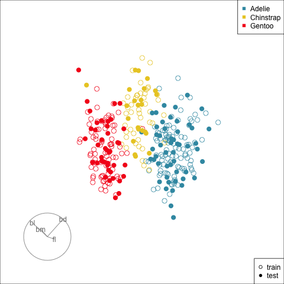

```{r, include = FALSE}
source("../setup.R")
library(ggpubr)
library(kableExtra)

#my.dir <- "C:/Users/jjew0003/Documents/Monash Teaching/ETC3250-5250/2025"

knitr::knit_hooks$set(crop = knitr::hook_pdfcrop)
#https://www.pmassicotte.com/posts/2022-08-15-removing-whitespace-around-figures-quarto/
```

```{r echo = FALSE, include = FALSE, eval = TRUE}
### JACK: I had to do this becuase of monash machine file structure
### Anyone else knitting should set eval = FALSE
Sys.setenv(WORKON_HOME = "C:/Users/jjew0003/Documents/.virtualenvs")
library(reticulate)
#library(keras)
library(keras3)
reticulate::use_virtualenv("C:/Users/jjew0003/Documents/.virtualenvs/r-tensorflow")

```

## Overview

We will cover:

::: {.incremental}

* Structure of a neural network
* Fitting neural networks
* Diagnosing the fit

:::

## Structure of a neural network {.transition-slide .center}

<!---

## Nested logistic regressions

**NOT RELEVANT YET - MOVE LATER**

:::: {.columns}
::: {.column}

Remember the logistic function:

\begin{align}
f(x) &= \frac{1}{1+e^{-(\beta_0+\sum_{j=1}^p\beta_jx_j)}} = \frac{1}{1+e^{-x^\top\beta}}
\end{align}

which is equivalent to

::: {.fragment}

\begin{align}
f(x) &= \frac{e^{\beta_0+\sum_{j=1}^p\beta_jx_j}}{1+e^{\beta_0+\sum_{j=1}^p\beta_jx_j}} = \frac{e^{x^\top\beta}}{1+e^{x^\top\beta}} 
  &= 
\end{align}

:::

::: {.fragment}

Also,

$$\log_e\frac{f(x)}{1 - f(x)} = \beta_0+\sum_{j=1}^p\beta_jx_j$$

:::
:::

::: {.column}
::: {.fragment}

<br><br>
[Above the threshold $\alpha$ predicted to be 1.]{.smaller} 

```{r}
#| echo: false
#| out-width: 70%
#| fig-width: 4
#| fig-height: 4
library(tidyverse)
x <- seq(-2, 2, 0.1)
y <- exp(1+3*x)/(1+exp(1+3*x))
df2 <- tibble(x, y)
ggplot(df2, aes(x=x, y=y)) + 
  geom_line() +
  geom_hline(yintercept=0.5, colour="orange") +
  annotate("text", x=0.84, y=0.55, label="Activation threshold ??", colour="orange") +
  geom_hline(yintercept=c(0,1), linetype=2)
```

:::

:::
::::

--->

## Linear regression as a network

:::: {.columns}
::: {.column}

Consider a linear regression model regressing a continuous response $y\in \mathbb{R}$, on predictors $x\in\mathbb{R}^p$

::: {.fragment}

$$\widehat{y} = \mathbb{E}[y\mid x] = \beta_0 + \sum_{j=1}^p\beta_jx_j$$

:::

::: {.fragment}

We can draw this as a network model: 

::: {.incremental}

+ $p$ [inputs]{.monash-orange2} (predictors), 
+ multiplied by [weights]{.monash-orange2} (coefficients), 
+ summed, add a [constant]{.monash-orange2}, 
+ predicts [output]{.monash-orange2} (response). 

:::

:::
:::
::: {.column .fragment}

{width=80%}

:::
::::

## Difference between linear and logistic regression

:::: {.columns}
::: {.column}

Logistic regression, predicting the probability of a binary outcome , 
$$
P(Y = 1) = \frac{1}{1+e^{-(\beta_0+\sum_{j=1}^p\beta_jx_j)}}
$$

::: {.fragment}

Can also be written as a network model

::: {.incremental}

+ $p$ [inputs]{.monash-orange2} (predictors), 
+ multiplied by [weights]{.monash-orange2} (coefficients), 
+ summed, add a [constant]{.monash-orange2}, 
+ Applied a [function]{.monash-orange2} to this in order to model a probability
+ predicts [output]{.monash-orange2} (response). 

:::

:::

:::
::: {.column .fragment}

{width=80%}

:::
::::


## Neural Network Notation

:::: {.columns}
::: {.column}

Both linear and logistic regression are **simple** one layered neural networks

::: {.incremental}

+ [Inputs Layer]{.monash-orange2} where the predictors are fed in, 
+ [Output Layer]{.monash-orange2} where the predicted value from the model is fed out 
+ The connection between any node $j$ in the input layer and node $k$ in the output layer is [weighted]{.monash-orange2} by a parameter $b_{jk}$, 
+ [Nodes]{.monash-orange2} which take the weighted sum of their [inputs]{.monash-orange2} $\sum_{j=1}^pb_{jk}x_j$ add a [bias]{.monash-orange2} $b_{0k}$ and return a [function]{.monash-orange2} applied to this


:::

:::
::: {.column}

{width=80%}

:::
::::

## Neural Network Notation

:::: {.columns}
::: {.column}

Both linear and logistic regression are **simple** neural networks

::: {.incremental}

+ These NNs only have one node and its an output node, so it uses an [output function]{.monash-orange2} $\sigma(\cdot)$.
  + In Linear regression $\sigma(a) = a$
  + In Logistic regression $\sigma(a) = \frac{1}{1+e^{-a}}$

:::

:::
::: {.column}

{width=80%}

:::
::::

## Hidden layers 

:::: {.columns}
::: {.column}

So neural networks are just simple linear models? **Absolutely not**

::: {.incremental}

+ Introduce a [Hidden Layer]{.monash-orange2} between the inputs (predictors) and outputs (the machine learning model prediction), 
+ Each [node]{.monash-orange2} in the hidden layer takes the weighted sum of the [inputs]{.monash-orange2} $\sum_{j=1}^pb_{jk}x_j$ add a [bias]{.monash-orange2} $b_{0k}$ and return a [function]{.monash-orange2} applied to this
+ For hidden layers this function is called an [activation function]{.monash-orange2} $\phi(\cdot)$.
  + This must be a [non-linear]{.monash-orange2} function (as every other part of the NN is linear)


:::

:::
::: {.column}


:::
::::


## Single hidden layer NN

:::: {.columns}
::: {.column}

Consider $s$ hidden nodes in a single hidden layer

::: {.incremental}

+ Every input node is connected to every hidden node - with weight $b_{jk}$ $j = 1,\ldots p$, $k = 1,\ldots, s$
+ Every hidden node is connected to every output node with weight $a_{jk}$ $j = 1,\ldots s$ $k = 1$
+ The output of each hidden node is $h_k = \phi(b_{0k} + \sum_{j=1}^pb_{jk}x_j)$
+ The machine learning model prediction is $\sigma(a_{01} + \sum_{j=1}^sa_{j1}h_j)$

<!---
- these are learned combinations of our original variables that become the inputs for the output layer
--->

:::

:::
::: {.column}


:::
::::

## Single hidden layer NN

:::: {.columns}
::: {.column}

Consider $s$ hidden nodes in a single hidden layer

::: {.fragment}

$$
\begin{align}
g(&y; x) = \\
&\sigma(a_{01} + \sum_{k=1}^sa_{k1}\phi(b_{0k} + \sum_{j=1}^pb_{jk}x_j))
\end{align}
$$

:::


::: {.fragment}

This is referred to as a [fully connected]{.monash-orange2} [feed forward]{.monash-blue2} neural network with 1 hidden layer (sometimes referred to as having 2 layers)

:::
:::
::: {.column}


:::
::::

## Feature Engineering

The hidden layers are learning [features]{.monash-oragnse2}, i.e. combinations of the predictor variables,  that best predict the response

:::: {.columns}
::: {.column .fragment}
Logistic regression 

$$
P(Y= 1\mid x) = \frac{1}{1+e^{-x^\top\beta}}
$$

::: {.incremental}

+ $x \in \mathbb{R}^p$ are predictor variables
+ $\beta\in\mathbb{R}^p$ regression coefficients

:::

:::
::: {.column .fragment}
Single Hidden Layer NN

$$
P(Y= 1\mid x) = \frac{1}{1+e^{-h^\top a}}
$$

::: {.incremental}

+ $h \in \mathbb{R}^s$ are hidden layer outputs $h_k = \phi(b_{0k} + \sum_{j=1}^pb_{jk}x_j)$
+ with parameters $b$
+ $a\in\mathbb{R}^p$ coefficients that connect the encoing of the predictors with the response
+ Can view $h$ as your transformed features that were learned to best predict $y$ from $x$

:::


:::
::::

## Activation functions

:::: {.columns}
::: {.column .incremental}

+ The output function $\sigma(\cdot)$ is given by the problem 
+ The activation function is part of the model's architecture
+ The activation function **MUST** be non-linear - a NN with linear activation functions would just be an overparametrised linear model
+ Popular examples are
  + $\tanh(x) = \frac{e^x - e^{-x}}{e^x + e^{-x}}$
  + $ReLU(x) = \max(0, x)$
  

:::
::: {.column .fragment}

```{r echo=FALSE}
#| crop: true

ReLU <- function(s){
  return(pmax(s, 0))
}

s_eval <- seq(-3, 3, length.out = 1000)

af_plot <- data.frame(s =  s_eval,
                      ReLU = ReLU(s_eval),
                      tanh = tanh(s_eval)
                      )

colors <- c("tanh" = "red", "ReLU" = "blue")

ggplot(af_plot, aes(x=s, y=ReLU, color="ReLU")) +
  geom_line(linewidth=2) +
  geom_line(aes(x=s, y=tanh, color="tanh"), linewidth=2) +
      labs(
  title = "Activation functions",
  y = "theta(s)", x = "s",
         color = "Legend") +
    scale_color_manual(values = colors)


```


:::

::::


## What does this look like? [(1/2)]{.smallest}

:::: {.columns}
::: {.column style="font-size: 70%"}
The architecture allows for combining multiple linear models to generate non-linear classifications. 

```{r}
#| echo: false
#| out-width: 70%
#| fig-width: 4
#| fig-height: 5
w <- read_csv(here::here("../data/wiggly.csv"))
ggplot(w, aes(x=x, y=y, colour=class, shape=class)) + 
  geom_point() +
  scale_color_brewer("", palette="Dark2") +
  scale_shape("") +
  theme(legend.position = "bottom") 
```

:::
::: {.column style="font-size: 70%" .fragment}

The best fit uses $s=4$, four nodes in the hidden layer. Can you sketch four lines that would split this data well?

```{r}
#| echo: false
#| out-width: 70%
#| fig-width: 4
#| fig-height: 5
load(here::here("../data/nnet_many.rda"))
load(here::here("../data/nnet_best.rda"))

ggplot(subset(best$output,  node == 1), aes(x, y)) +
  geom_raster(aes(fill = pred)) +
  geom_point(aes(shape = class), data = w) +
  scale_fill_gradient2("", low="#1B9E77", 
                       high="#D95F02", 
                       mid = "white", 
                       midpoint = 0.5,
                       guide = "colourbar",
                       limits = c(0,1)) +
  scale_shape("") +
  theme(legend.position = "bottom",
        legend.text = element_text(size=6)) 
```
:::
::::

[[Wickham et al (2015) Removing the Blindfold](http://onlinelibrary.wiley.com/doi/10.1002/sam.11271/abstract)]{.smallest}

## What does this look like? [(2/2)]{.smallest}

:::: {.columns}
::: {.column}

The models at each of the nodes of the hidden layer. Plotting $h_j$.

```{r}
#| echo: false
#| out-width: 90%
#| fig-width: 5
#| fig-height: 4
ggplot(data=best$hidden, aes(x, y)) +
  geom_tile(aes(fill=pred)) + 
  geom_point(data=w, aes(shape=class)) +
  facet_wrap(~node, ncol=2) + 
  scale_fill_gradient2("", low="#AF8DC3",
                                    mid="#F7F7F7",
                                    high="#7FBF7B",
                                    midpoint=0.5,
                                    limits=c(0,1)) +
  scale_shape("") +
  xlab("x1") + ylab("x2") +
  theme(axis.text = element_blank(), 
        axis.title = element_blank(),
        legend.text = element_text(size=6),
        )
```
:::

::: {.column}
::: {.fragment}

```{r}
#| echo: false
#| out-width: 70%
#| fig-width: 4
#| fig-height: 4
#| crop: true
ggplot(data=best$hidden, aes(x, y)) + 
  geom_contour(aes(z=pred, group=node), 
               colour="grey50", 
               size=2, 
               breaks = 0.5) +
  geom_point(data=w, aes(colour=class, 
                 shape=class)) + 
  scale_color_brewer("", palette="Dark2") +
  scale_shape("") +
  xlab("x1") + ylab("x2") +
  theme(legend.position = "bottom",
        legend.text = element_text(size=6)) 


```
:::

::: {.fragment}

The parameters $a$ of the connection between the hidden layer and the output layer learn how to combine these 4 '*models*' into one prediction

:::

:::
::::

## Model fitting 

The Neural Network architecture defines the [number of hidden layers]{.monash-orange2}, the [number of nodes]{.monash-orange2} in each layer and the [activation functions]{.monash-orange2}. These are the NN hyperparameters.  

<br>

::: {.fragment}

For fixed architecture (#Hidden Layers = 1, #Nodes = $s$), fitting the model requires learning the best values for parameters $b_0 \in\mathbb{R}^s$, $B\in\mathbb{R}^{p, s}$ (with elements $b_{jk}$), $a_0\in\mathbb{R}$, and $a\in\mathbb{R}^s$

:::

<br>

::: {.fragment}

These are all just numbers! We learn them exactly how we learned the regression parameters in linear models, using [Maximum Likelihood]{.monash-oragne2}

:::


## Model fitting 

**Linear Models**

::: {.incremental}

+ Linear Regression: 
  + $E[Y\mid x] = \beta_0 + \sum_{j=1}^px_j\beta_j$ 
  + $\beta$'s learned via least squares 
+ Logistic Regression: 
  + $P(Y = 1\mid x) = \frac{1}{1+e^{-\beta_0 - \sum_{j=1}^px_j\beta_j}}$ 
  + $\beta$'s learned via MLE

:::

## Model fitting 

**Single Layer Neural Network**

::: {.incremental}

+ Regression: 
  + $E[Y\mid x] = a_{01} + \sum_{k=1}^sa_{k1}\phi(b_{0k} + \sum_{j=1}^pb_{jk}x_j)$ 
  + Learn $a$'s and $b$'s to minimise the squared error
+ Binary Classification: 
  + $P(Y = 1\mid x) = \frac{1}{1+e^{-a_{01} - \sum_{k=1}^sa_{k1}\phi(b_{0k} + \sum_{j=1}^pb_{jk}x_j)}}$ 
  + Learn $a$'s and $b$'s that make the observed data the most likely

:::

## Model fitting 

There is one key difference in how linear models and neural networks are fit.

<br>

::: {.fragment}

In linear models the exact MLE is found. If you fit the model twice you get exactly the same fit.

:::

<br>

::: {.fragment}

In Neural Network models the MLE is not found exactly. If you fit the model twice you will get a different fit.

:::

::: {.fragment}

This is a result of NN's having many more parameters and as a resault being much more complicated prediction functions

::: {.incremental}

+ The linear models have $p+1$ parameters. 
+ The Single Hidden Layer NN has $(p+1)\times s + (s+1)$

:::

:::

## But can be painful to find the best!

The same models with $s=2, 3, 4$ fit several times.


```{r}
#| echo: false
#| out-width: 100%
#| fig-width: 12
#| fig-height: 4
qual <- unique(many[, c("value", "accuracy", "nodes", "id")])
ggplot(qual, aes(x=accuracy, y=value)) +
  geom_point(alpha=0.7, size=3) +
  xlab("Accuracy") +
  ylab("Value of fitting criterion") +
  facet_wrap(~nodes)

```

::: {.fragment}

Fitted using the R package `nnet`. It's very unstable, and this is still a problem with current procedures.

:::


## Fitting with keras {.transition-slide .center}

## Steps [(1/2)]{.smaller}

:::: {.columns}
::: {.column}

1. Define [architecture]{.monash-blue2}

::: {.incremental}

- How many hidden layers do you need? 
- How many nodes in the hidden layer?

:::

<!---
    - flatten: if you are classifying images, you need to flatten the image into a single row of data, eg 24x24 pixel image would be converted to a row of 576 values. Each pixel is a variable.
--->
    
<!---    
    - Dropout rate: proportion of nodes removed randomly at each update, for regularisation, to reduce number of parameters to be estimated 
--->

::: {.fragment}
2. Specify [activation function]{.monash-blue2}: relu (rectified linear unit) or tanh, and [output function]{.monash-blue2} linear, sigmoid, softmax
:::


:::
::: {.column}


::: {.fragment}
3. Choose [loss]{.monash-blue2} function: 

::: {.incremental}

- MSE: squared difference between observation and prediction (also the log-likleihood under the Gaussian distribution)
- cross-entropy: fancy name for the log-likelihood of binary regression
    
:::
:::

:::
::::

## Steps [(2/2)]{.smaller}

:::: {.columns}
::: {.column}
4. [Training]{.monash-blue2} process:

::: {.incremental}

- epochs: number of times the algorithm sees the entire data set
- batch_size: subset used at each iteration
- validation_split: proportion for hold-out set for computing error rate (a mini testing set)
    
:::
    
<!---   
    - batch_normalization: each batch is standardised during the fitting, can be helpful even if full data is standardised
--->


:::
::: {.column}
::: {.fragment}
5. Evaluation:

::: {.incremental}

- usual metrics: [accuracy]{.monash-blue2}, ROC, AUC (area under ROC curve), confusion table 
- [visualise]{.monash-blue2} the predictive probabilities
- examine misclassifications
- examine specific nodes, to understand what part it plays
- examine model boundary relative to the observed data
    
:::

:::
:::
::::

## Example: penguins [(1/5)]{.smaller}

```{r echo=FALSE}
#| message: false
#| eval: false
animate_xy(p_std[,2:5], col=factor(p_tidy$species))
render_gif(p_std[,2:5], 
           grand_tour(), 
           display_xy(half_range=4.2, axes="off",
                      col=p_std$species),
           gif_file="gifs/penguins_lbl.gif",
           frames=500,
           width = 400,
           height = 400,
           loop=FALSE)
```

:::: {.columns}
::: {.column}

<center>

</center>

::: {.incremental}

- 4D data
- Simple cluster structure to classes
- How many nodes in the hidden layer?

:::

:::
::: {.column}

::: {.fragment}

Choose 2 nodes, because reducing to 2D, makes for easy classification.

:::

::: {.fragment}


:::

::: {.fragment}

Counting the lines shows we have 19 parameters 

:::

:::
::::

## The output layer and output function

<br>

While you can choose the number of hidden layers, nodes in each hidden layer and activation function (your NN architecture).

<br>

::: {.fragment}
The output layer and output function are defined by the problem

:::

<br>

:::{.fragment}

The NN is applying a (possibly unbounded) non-linear function to unbounded data, so without an output function the NN would produce a value in $\mathbb{R}$

:::


## The output layer and output function

:::: {.columns}
::: {.column}

::: {.incremental}

+ Continuous regression, we want to predict a number in $\mathbb{R}$, so we can use the identify output function $\sigma(x) = x$
+ If we wanted to predict several continuous things e.g. (size of the tip, size of the bill and how long they will be at the table) then we need an output node for each of these!
+ What if your response variable was positive? Either exponential $\sigma(x) = \exp(x)$ or softplus function $\sigma(x) = \log(1 + \exp(x))$

:::

:::
::: {.column .fragment}


:::
::::

## The output layer and output function

:::: {.columns}
::: {.column}

::: {.incremental}

+ Binary classification we need to predict one number between 0 and 1 so we have one output node and use the logistic output function $\sigma(x) = \frac{1}{1+\exp(-x)}$
+ Multiclass classification we need to predict $K$ numbers between 0 and 1 and sum to 1. We have $K$ output nodes and use the softmax output function $\sigma(x)_j = \frac{\exp(x_j)}{\sum_{k=1}^K\exp(x_k)}$

:::

:::
::: {.column .fragment}


:::
::::


## Example: penguins [(2/5)]{.smaller}

:::: {.columns}
::: {.column}

```{r eval=TRUE}
#| echo: true
library(keras3)
tensorflow::set_random_seed(211)
```

::: {.fragment}

```{r eval=TRUE}
#| echo: true
# Define model
p_nn_model <- keras_model_sequential()
p_nn_model |> 
  layer_dense(units = 2, activation = 'relu', 
              input_shape = 4) |> 
  layer_dense(units = 3, activation = 'softmax')
```

:::

::: {.fragment}

```{r eval=TRUE}
#| echo: true

p_nn_model |> summary()
```

:::

::: {.fragment}

```{r eval=TRUE}
loss_fn <- loss_sparse_categorical_crossentropy()
```

:::

::: {.fragment}

```{r eval=TRUE}
p_nn_model |> compile(
  optimizer = "adam",
  loss      = loss_fn,
  metrics   = c('accuracy')
)
```

:::
:::
::: {.column .fragment}

Split the data into training and test, and check it.

```{r echo=FALSE}
set.seed(821)
p_split <- p_std |> 
  initial_split(prop = 2/3, 
                strata=species)
p_train <- training(p_split)
p_test <- testing(p_split)

# Check training and test split
p_split_check <- bind_rows(
  bind_cols(p_train, type = "train"), 
  bind_cols(p_test, type = "test")) |>
  mutate(type = factor(type))
```

```{r echo=FALSE, eval=FALSE}
render_gif(p_split_check[,2:5],
           guided_tour(lda_pp(p_split_check$species)),
           display_xy( 
             col=p_split_check$species, 
             pch=p_split_check$type, 
             shapeset=c(16,1),
             cex=1.5,
             axes="bottomleft"), 
           gif_file="gifs/p_split_guided.gif",
           frames=500,
           loop=FALSE
)
```

<center>

</center>

::: {.fragment}

`tidymodels` style does not allow easy extraction of model coefficients -  [https://parsnip.tidymodels.org/reference/mlp.html](https://parsnip.tidymodels.org/reference/mlp.html)

:::

:::


::::

## Example: penguins [(3/5)]{.smaller}

:::: {.columns}
::: {.column}
Fit the model

```{r echo=TRUE}
# Data needs to be matrix, and response needs to be numeric
p_train_x <- p_train |>
  select(bl:bm) |>
  as.matrix()
p_train_y <- p_train |> pull(species) |> as.numeric() 
p_train_y <- p_train_y-1 # Needs to be 0, 1, 2
p_test_x <- p_test |>
  select(bl:bm) |>
  as.matrix()
p_test_y <- p_test |> pull(species) |> as.numeric() 
p_test_y <- p_test_y-1 # Needs to be 0, 1, 2
```

::: {.fragment}

If you had categorical predictors you would need to turn these into dummies/one-hot-encode

:::

::: {.fragment}

```{r echo=TRUE}
p_train_x[1:3,]
p_train_y[c(1:3, 100:103, 150:153)]
```

:::


:::

::: {.column .fragment}

Notice the data has also been standardsied. This makes learning the model parameters easier and allows us to interpret their magnitudes

::: {.fragment}

```{r echo=TRUE, eval=TRUE, cache=TRUE}
#| message: false
# Fit model
p_nn_fit <- p_nn_model |> 
  keras3::fit(
    x = p_train_x, 
    y = p_train_y,
    epochs = 500,
    #epochs = 150,
    batch_size = 32, # default
    verbose = 1
    #verbose = 0
  )


```

```{r echo=FALSE, eval=FALSE, cache=FALSE}
#p_nn_model |>  keras3::save_model("../data/penguins_nn2")
#p_nn_model |>  keras3::save_model_weights("../data/penguins_nn.weights.h5")
p_nn_model |>  keras3::save_model("../data/penguins_nn.h5")
```


:::

::: {.fragment}

Note if you run this twice, the second run starts from where the first finished

:::

:::

::::

## Diagnoing Convergence

:::: {.columns}
::: {.column}

While linear model parameter fitting is *exact* (you can turst R)

::: {.fragment}

NN model fitting is **NOT**

:::

::: {.fragment}

The onus is on **YOU**, the data scientist/machine learner, to check your parameter fitting has *converged*

:::

::: {.fragment}

We use the [in-sample]{.monash-orange2} error to do this (as this is what training was tryitng to make small)

:::

:::
::: {.column .fragment}

`keras` plots the in-sample loss with the number of `epochs` for you

::: {.fragment}

Check that this has become flat, and doesn't appear to still be going down

:::

::: {.fragment}

Then your training has *converged*

:::

<br>

::: {.fragment}

Other things to check 

::: {.incremental}

+ If I get a different seed do I get a much better loss
+ If I try a model with more nodes, do I get a smaller *in-sample* loss

:::

:::

:::

::::

## Diagnoing Convergence

<center>
{width=750}
</center>

## Diagnoing Convergence

<center>
{width=750}
</center>


## Example: penguins [(4/5)]{.smaller}

:::: {.columns}
::: {.column}

Evaluate the fit

```{r echo=TRUE}
p_nn_model |> 
  evaluate(p_test_x, p_test_y, verbose = 0)
```

::: {.fragment}

Confusion matrices for training and test

```{r echo=FALSE}
# Predict training and test set
p_train_pred <- p_nn_model |> 
  predict(p_train_x, verbose = 0)
p_train_pred_cat <- levels(p_train$species)[
  apply(p_train_pred, 1,
        which.max)]
p_train_pred_cat <- factor(
  p_train_pred_cat,
  levels=levels(p_train$species))
table(p_train$species, p_train_pred_cat)

p_test_pred <- p_nn_model |> 
  predict(p_test_x, verbose = 0)
p_test_pred_cat <- levels(p_test$species)[
  apply(p_test_pred, 1, 
        which.max)]
p_test_pred_cat <- factor(
  p_test_pred_cat,
  levels=levels(p_test$species))
table(p_test$species, p_test_pred_cat)
```

:::

::: {.fragment}

Really good practice to look at both training and testing error here

:::

::: {.fragment}

[Note: Specifically have chosen settings so fit is not perfect - This NN's training had not converged!]{.smallest}

:::

:::
::: {.column}

::: {.fragment}
Estimated parameters

```{r}
# Extract hidden layer model weights
p_nn_wgts <- keras3::get_weights(p_nn_model, trainable=TRUE)
p_nn_wgts 
```

:::

::: {.fragment}

[Which variables are contributing most to each hidden layer node?]{.smaller}

:::

::: {.fragment}

[Can you write out the model?]{.smaller}

:::

:::
::::

## Example: penguins [(5/5)]{.smaller}

:::: {.columns}
::: {.column}

The values outputed by the hidden layer nodes are the *learned* engineered features. 

```{r echo=FALSE}
# Hidden layer
p_train_m <- p_train |>
  mutate(nn1 = as.matrix(p_train[,2:5]) %*%
           as.matrix(p_nn_wgts[[1]][,1], ncol=1),
         nn2 = as.matrix(p_train[,2:5]) %*%
           matrix(p_nn_wgts[[1]][,2], ncol=1))

# Now add the test points on.
p_test_m <- p_test |>
  mutate(nn1 = as.matrix(p_test[,2:5]) %*%
           as.matrix(p_nn_wgts[[1]][,1], ncol=1),
         nn2 = as.matrix(p_test[,2:5]) %*%
           matrix(p_nn_wgts[[1]][,2], ncol=1))
p_train_m <- p_train_m |>
  mutate(set = "train")
p_test_m <- p_test_m |>
  mutate(set = "test")
p_all_m <- bind_rows(p_train_m, p_test_m)
ggplot(p_all_m, aes(x=nn1, y=nn2, 
                     colour=species, shape=set)) + 
  geom_point() +
  scale_colour_discrete_divergingx(palette="Zissou 1") +
  scale_shape_manual(values=c(16, 1)) +
  theme_minimal() +
  theme(aspect.ratio=1)
```

<!---

```{r echo=FALSE}
# Orthonormalise the weights to make 2D projection
p_nn_wgts_on <- tourr::orthonormalise(p_nn_wgts[[1]])

# Hidden layer
p_train_m <- p_train |>
  mutate(nn1 = as.matrix(p_train[,2:5]) %*%
           as.matrix(p_nn_wgts_on[,1], ncol=1),
         nn2 = as.matrix(p_train[,2:5]) %*%
           matrix(p_nn_wgts_on[,2], ncol=1))

# Now add the test points on.
p_test_m <- p_test |>
  mutate(nn1 = as.matrix(p_test[,2:5]) %*%
           as.matrix(p_nn_wgts_on[,1], ncol=1),
         nn2 = as.matrix(p_test[,2:5]) %*%
           matrix(p_nn_wgts_on[,2], ncol=1))
p_train_m <- p_train_m |>
  mutate(set = "train")
p_test_m <- p_test_m |>
  mutate(set = "test")
p_all_m <- bind_rows(p_train_m, p_test_m)
ggplot(p_all_m, aes(x=nn1, y=nn2, 
                     colour=species, shape=set)) + 
  geom_point() +
  scale_colour_discrete_divergingx(palette="Zissou 1") +
  scale_shape_manual(values=c(16, 1)) +
  theme_minimal() +
  theme(aspect.ratio=1)
```

--->

::: {.fragment  style="font-size: 70%"}
This is the dimension reduction induced by the model.
:::

::: {.fragment  style="font-size: 50%"}
[Realistically, with a complex neural network, it is too much work to check these nodes.]{.monash-blue2}
:::

:::
::: {.column}

::: {.fragment}
Examine the predictive probabilities

```{r echo=FALSE}
# Set up the data to make the ternary diagram
# Join data sets
colnames(p_train_pred) <- c("Adelie", "Chinstrap", "Gentoo")
colnames(p_test_pred) <- c("Adelie", "Chinstrap", "Gentoo")
p_train_pred <- as_tibble(p_train_pred)
p_train_m <- p_train_m |>
  mutate(pspecies = p_train_pred_cat) |>
  bind_cols(p_train_pred) |>
  mutate(set = "train")
p_test_pred <- as_tibble(p_test_pred)
p_test_m <- p_test_m |>
  mutate(pspecies = p_test_pred_cat) |>
  bind_cols(p_test_pred) |>
  mutate(set = "test")
p_all_m <- bind_rows(p_train_m, p_test_m)

# Add simplex to make ternary
library(geozoo)
proj <- t(geozoo::f_helmert(3)[-1,])
p_nn_v_p <- as.matrix(p_all_m[,c("Adelie", "Chinstrap", "Gentoo")]) %*% proj
colnames(p_nn_v_p) <- c("x1", "x2")
p_nn_v_p <- p_nn_v_p |>
  as.data.frame() |>
  mutate(species = p_all_m$species,
         set = p_all_m$set)

simp <- geozoo::simplex(p=2)
sp <- data.frame(cbind(simp$points), simp$points[c(2,3,1),])
colnames(sp) <- c("x1", "x2", "x3", "x4")
sp$species = sort(unique(p_std$species))
ggplot() +
  geom_segment(data=sp, aes(x=x1, y=x2, xend=x3, yend=x4)) +
  geom_text(data=sp, aes(x=x1, y=x2, label=species),
            nudge_x=c(-0.1, 0.15, 0),
            nudge_y=c(0.05, 0.05, -0.05)) +
  geom_point(data=p_nn_v_p, aes(x=x1, y=x2, 
                                colour=species,
                                shape=set), 
             size=2, alpha=0.5) +
  scale_color_discrete_divergingx(palette="Zissou 1") +
  scale_shape_manual(values=c(19, 1)) +
  theme_map() +
  theme(aspect.ratio=1, legend.position = "right")
```
:::

::: {.fragment  style="font-size: 50%"}
[The problem with this model is that Gentoo are too confused with Adelie. This is a structural problem because from the visualisation of the 4D data we know that there is a big gap between the Gentoo and both other species.]{.monash-blue2}
:::

:::
::::

## Deciding on a Architecture

:::: {.columns}
::: {.column}

Ideally, you would learn the model hyperparameters (#Hidden layer, #Nodes and activations) via cross-validation (as we did with trees)

::: {.fragment}

This was feasible for trees as they were fast and easy to fit

:::

::: {.fragment}

NN's are slow and complicated to fit

:::

::: {.fragment}

I would advise hand tuning them by cross-validation i.e. do cross-validation but rather than trying a huge grid like we did with DTs, gradually make the model more complex.

:::

:::
::: {.column .incremental}

+ Stick to ReLU activations
+ Start with a small number of nodes and train till convergence 
  + keep track of in- and out-of-sample errors
+ Increase the number of nodes
  + make sure the in-sample errors go down (if not you either need more training iterations or a new starting point)  
  + Hopefully the out-of-sample error goes down too (if not you are overfitting)
+ Consider adding another hidden layer and repeat  

:::
::::

## Deciding on a Architecture

:::: {.columns}
::: {.column}

Ideally, you would learn the model hyperparameters (#Hidden layer, #Nodes and activations) via cross-validation (as we did with trees)


This was feasible for trees as they were fast and easy to fit


NN's are slow and complicated to fit


I would advise hand tuning them by cross-validation i.e. do cross-validation but rather than trying a huge grid like we did with DTs, gradually make the model more complex.


:::
::: {.column .fragment}


Ideally the number of hidden nodes is greater than the numebr of predictors, the idea is to [embed]{.monash-orange2} the predictors in a high dimensional space where they will be easier to classify.

<br>

::: {.fragment}

But with many hidden nodes it is very easy to overfit!

:::

:::
::::

## Want to learn more?

::: {.incremental}

- Take ETC3555/ETC5555 Statistical Machine Learning 
  - We cover foundationation so Neural Network
  - Algorithms for learning their parameters 
  - Ways to prevent overfitting
  - Extensions to image classification and text analysis

- Work your way through the example of fitting the [fashion MNIST data](https://tensorflow.rstudio.com/tutorials/keras/classification) using tensorflow.

- [Hands-on machine learning](https://bradleyboehmke.github.io/HOML/deep-learning.html) has a lovely step-by-step guide to constructing and fitting. 

- This is a very nice slide set: [A gentle introduction to deep learning in R using Keras](https://lnalborczyk.github.io/slides/vendredi_quanti_2021/vendredi_quantis#1)

- And the tutorials at [TensorFlow for R](https://tensorflow.rstudio.com/install/) have lots of examples.


:::


## Image Data

:::: {.columns}
::: {.column}

Neural Networks have been shown to have excellent performance in image classification e.g.

::: {.incremental}

+ Does this image contain a cat or a dog?
+ Which number between 0 and 9 is this?

:::

::: {.fragment}

However, image data doesn't quite look like the normal predictor $x\in\mathbb{R}^p$ that we are now used to see 

:::
:::
::: {.column .fragment}

Well actually they do...

::: {.fragment}

```{r echo=TRUE}

mnist<-dataset_mnist()
tri<-train_images<-mnist$train$x
train_labels<-mnist$train$y
tri[1,,]

```

:::


:::
::::

## Image Data

:::: {.columns}
::: {.column}


```{r echo=TRUE}
#| out-width: 60%
#| crop: true
plot(as.raster(tri[1,,],max=255))


```

::: {.incremental}

+ Images are divided into pixels

:::
:::
::: {.column .incremental}

+ Greyscale images are $K_1 \times K_2$ dimensional matrices
+ Each $x_{jk}$ is the pixel density at pixels $j,k$ with 0 being white and 255 being black 
+ This matrix is then 'flattened' into a $p = K_1\times K_2$ dimensional vector
+ On a computer, any colour can be represented as a mixture of [Red]{.red}, [Green]{.green} and [Blue]{.blue} (RGB)
+ Therefore each pixel now has 3 numbers, one for red, one for green and one for blue
+ The image is now a $K_1 \times K_2\times 3$ dimensional array


:::
::::


## Next: Explainable artificial intelligence (XAI) {.transition-slide .center}


