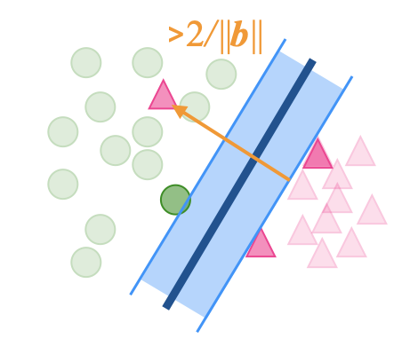

```{r, include = FALSE}
source("../setup.R")
```

## Overview

We will cover:

::: {.incremental}

* Separating hyperplanes
* Non-linear kernels
* Really simple models using nearest neighbours
* Regularisation methods

:::

## Why use support vector machines?

```{r}
#| echo: false
#| eval: false
set.seed(427)
n1 <- 102
n2a <- 25
n2b <- 37
n2c <- 32
vc1 <- matrix(c(4, -1, -1, 4), ncol=2, byrow=TRUE)
vc2 <- matrix(c(0.25, -0.2, -0.2, 0.5), ncol=2, byrow=TRUE)
d1 <- rmvnorm(n1, c(5, 5), vc1)
d2a <- rmvnorm(n2a, c(-1.2, 0), vc2)
d2b <- rmvnorm(n2b, c(-1, -1), vc2)
d2c <- rmvnorm(n2c, c(-0.5, -3), vc2)
pebbles <- tibble(x1 = c(d1[,1], d2a[,1], 
                         d2b[,1], d2c[,1]),
                  x2 = c(d1[,2], d2a[,2], 
                         d2b[,2], d2c[,2]),
                  cl = factor(c(rep("A", n1),
                              rep("B", n2a+n2b+n2c))))
pebbles <- pebbles |>
  mutate_if(is.numeric, function(x) (x-mean(x))/sd(x))
ggplot(pebbles, aes(x=x1, y=x2, 
                    colour=cl)) +
  geom_point() +
  scale_color_discrete_divergingx(palette = "Zissou 1")
write_csv(pebbles, file="data/pebbles.csv")
```

:::: {.columns}
::: {.column width=33%}

```{r}
#| echo: false
#| fig-width: 4
#| fig-height: 4
#| out-width: 100%
pebbles <- read_csv(here::here("../data/pebbles.csv")) |>
  mutate(cl = factor(cl))
ggplot(pebbles, aes(x=x1, y=x2, 
                    colour=cl)) +
  geom_point() +
  scale_color_discrete_divergingx(palette = "Zissou 1") +
  theme(legend.position = "none")
```

::: {.fragment}

Where would you put the boundary to classify these two groups?

:::

:::

::: {.column width=33% .fragment}

Here's where LDA puts the boundary.

::: {.fragment}

```{r}
#| echo: false
#| fig-width: 4
#| fig-height: 4
#| out-width: 100%
lda_spec <- discrim_linear() |>
  set_mode("classification") |>
  set_engine("MASS", prior = c(0.5, 0.5))
lda_fit <- lda_spec |> 
  fit(cl ~ ., data = pebbles)

pebbles_grid <- tibble(
  x1 = runif(10000, -1.5, 2.5),
  x2 = runif(10000, -1.75, 2.25))
pebbles_grid <- pebbles_grid |>
  mutate(cl_lda = factor(predict(lda_fit$fit,
                             pebbles_grid)$class))
ggplot(pebbles_grid, aes(x=x1, y=x2, 
                    colour=cl_lda)) +
  geom_point(alpha=0.05, size=2) +
  geom_point(data=pebbles, aes(colour=cl), 
             shape=16, size=2) +
  scale_color_discrete_divergingx(palette = "Zissou 1") +
  theme(legend.position = "none")

```

:::

::: {.fragment}

 [What's wrong with it?]{.monash-blue2}

:::
:::

::: {.column width=33%}
::: {.fragment}
```{r}
#| message: false
#| results: hide
#| echo: false
#| fig-width: 4
#| fig-height: 4
#| out-width: 100%
svm_spec <- svm_linear() |>
  set_mode("classification") |>
  set_engine("kernlab")
svm_fit <- svm_spec |> 
  fit(cl ~ ., data = pebbles)

pebbles_grid <- pebbles_grid |>
  mutate(cl_svm = factor(predict(svm_fit$fit,
                             pebbles_grid)))
ggplot(pebbles_grid, aes(x=x1, y=x2, 
                    colour=cl_svm)) +
  geom_point(alpha=0.05, size=2) +
  geom_point(data=pebbles, aes(colour=cl),
             shape=16, size=2) +
  scale_color_discrete_divergingx(palette = "Zissou 1") +
  theme(legend.position = "none")

```

Why is this the better fit?

:::
:::

::::

## Separating hyperplanes [(1/4)]{.smaller}

:::: {.columns}
::: {.column}

LDA is an example of a classifier that generates a separating hyperplane

::: {.fragment}

```{r}
lda_fit$fit$scaling
```

:::

::: {.fragment}

As the data was standadrised, a new observation is class blue class if $-1.9\times\text{x1} - 1.6\times\text{x2} > 0$

:::

::: {.fragment}

Which is the same as $\text{x2} > -\frac{1.9}{1.6}\times\text{x1}$

:::


:::
::: {.column .fragment}
```{r}
#| echo: false
#| out-width: 100%
pebbles |>
  ggplot(aes(x=x1, y=x2, colour=cl)) +
  geom_point() +
  scale_color_discrete_divergingx(palette = "Zissou 1") +
  geom_abline(intercept = 0, slope = -1.9/1.6, color="darkgrey", 
                 linetype="dashed", size=1)
```
:::

::::

## Separating hyperplanes [(2/4)]{.smaller}

<!---
:::: {.columns}
::: {.column style="font-size: 90%;"}
LDA is an example of a classifier that generates a separating hyperplane

```{r}
lda_fit$fit$scaling
```

is defines a line orthogonal to the 1D separating hyperplane, with slope `r lda_fit$fit$scaling[2]/lda_fit$fit$scaling[1]`.

[Equation for the separating hyperplane is]{.monash-blue2} $x_2 = mx_1+b$, where $m=$ `r -lda_fit$fit$scaling[1]/lda_fit$fit$scaling[2]`, and $b$ can be solved by substituting in the point $((\bar{x}_{A1}+\bar{x}_{B1})/2, (\bar{x}_{A2}+\bar{x}_{B2})/2)$. (Separating hyperplane has to pass through the average of the two means, if prior probabilities of each class are equal.)


:::

::: {.column style="font-size: 70%;"}
::: {.fragment}
--->

```{r}
#| echo: false
#| eval: false
p_sub <- p_std |>
  filter(species != "Chinstrap") |>
  mutate(species = factor(species)) |>
  select(species, bl:bm)

lda_fit2 <- lda_spec |> 
  fit(species ~ ., data = p_sub)

p_explore <- classifly::explore(lda_fit2$fit, p_sub)
p_lda_bnd <- p_explore |>
  as_tibble() |>
  #filter(.TYPE == "simulated") |>
  filter(!.BOUNDARY)

animate_xy(p_lda_bnd[,1:4], 
           col=p_lda_bnd$species, 
           pch=p_lda_bnd$.TYPE, shapeset = c(19, 4))

b1 <- cbind(lda_fit2$fit$scaling, c(1,0,0,0)) 
colnames(b1) <- c("proj1", "proj2")
b1 <- tourr::orthonormalise(b1)
animate_xy(p_lda_bnd[,1:4], 
           radial_tour(b1, mvar = 1),
           col=p_lda_bnd$species, 
           pch=p_lda_bnd$.TYPE, shapeset = c(19, 4),
           axes="bottomleft",
           fps = 50)
b2 <- cbind(lda_fit2$fit$scaling, c(0,1,0,0)) 
colnames(b2) <- c("proj1", "proj2")
b2 <- tourr::orthonormalise(b2)
animate_xy(p_lda_bnd[,1:4], 
           radial_tour(b2, mvar = 2),
           col=p_lda_bnd$species, 
           pch=p_lda_bnd$.TYPE, shapeset = c(19, 4),
           axes="bottomleft",
           fps = 50)
b3 <- cbind(lda_fit2$fit$scaling, c(0,0,1,0)) 
colnames(b3) <- c("proj1", "proj2")
b3 <- tourr::orthonormalise(b3)
animate_xy(p_lda_bnd[,1:4], 
           radial_tour(b3, mvar = 3),
           col=p_lda_bnd$species, 
           pch=p_lda_bnd$.TYPE, shapeset = c(19, 4),
           axes="bottomleft",
           fps = 50)
b4 <- cbind(lda_fit2$fit$scaling, c(0,0,0,1)) 
colnames(b4) <- c("proj1", "proj2")
b4 <- tourr::orthonormalise(b4)
animate_xy(p_lda_bnd[,1:4], 
           radial_tour(b4, mvar = 4),
           col=p_lda_bnd$species, 
           pch=p_lda_bnd$.TYPE, shapeset = c(19, 4),
           axes="bottomleft",
           fps = 50)

render_gif(p_lda_bnd[,1:4], 
           grand_tour(),
           display_xy(col=p_lda_bnd$species, 
           pch=p_lda_bnd$.TYPE, 
           shapeset = c(19, 4)), 
           gif_file = "gifs/p_svm.gif",
           frames=500,
           width=400,
           height=400)

```

Separating hyperplane produced by LDA on [4D penguins data, for Gentoo vs Adelie]{.monash-blue2}. (It is 3D.)

<center>

</center>

<!---
:::
:::

::::
--->

## Separating hyperplanes [(2/4)]{.smaller}


```{r}
#| echo: false
#| eval: false


f1 <- save_history(p_lda_bnd[,1:4], grand_tour(d = 2)) 
render(p_lda_bnd[,1:4], 
       planned_tour(f1), 
       display_xy(col=p_lda_bnd$species, 
           pch=p_lda_bnd$.TYPE, 
           shapeset = c(19, 4), 
                  axes="bottomleft", cex = 2.5), 
       apf = 1/60,
       frames = 1500,
       width = 20, 
       height = 20, 
       dev = "pdf", 
       file = "p_svm_tour.pdf")
```

Separating hyperplane produced by LDA on [4D penguins data, for Gentoo vs Adelie]{.monash-blue2}. (It is 3D.)

<center>
{width=700}
</center>

<!---
:::
:::

::::
--->

## Separating hyperplanes [(3/4)]{.smaller}

:::: {.columns}
::: {.column}
The equation of $p$-dimensional hyperplane is given by

$$\beta_0 + \beta_1 X_1 + \dots + \beta_p X_p = 0$$

::: {.fragment}

Given a hyperplane we can define $g(x) = \beta_0 + \beta_1 X_1 + \dots + \beta_p X_p$ and define as classifier as predicting to sign of $g(x)$.  

:::


::: {.fragment style="font-size: 80%;"}
[LDA]{.monash-blue2} estimates $\beta_j$ based on the [sample statistics]{.monash-blue2}, means for each class and pooled covariance. 
:::

::: {.fragment style="font-size: 80%;"}
[SVM]{.monash-orange2} estimates $\beta_j$ based on [support vectors]{.monash-orange2} ([$\circ$]{.monash-red2}, [$\circ$]{.monash-blue2}), observations on the border between the two groups. Thus, the boundary will divide in the gap.
:::

:::

::: {.column}
::: {.fragment}

```{r}
#| echo: false
#| fig-width: 4
#| fig-height: 4
#| out-width: 100%
#| results: hide
svm_spec2 <- svm_linear(cost=1.5) |>
  set_mode("classification") |>
  set_engine("kernlab")
svm_fit2 <- svm_spec2 |> 
  fit(cl ~ ., data = pebbles)
svm_fit2$fit@SVindex
svm_fit2$fit@alpha

pebbles_sv <- pebbles |>
  mutate(id = row_number()) |>
  mutate(sv = ifelse(id %in%
                       svm_fit2$fit@SVindex, 
                     "yes", "no")) 
ggplot(pebbles_sv, aes(x=x1, y=x2, 
             colour=cl)) +
  geom_point() +
  scale_color_discrete_divergingx(palette = "Zissou 1") +
  geom_point(data=filter(pebbles_sv, 
                         sv == "yes"), shape=1, size=3) +
  theme(legend.position = "none")
```


:::
:::

::::

## Separating hyperplanes [(4/4)]{.smaller}

:::: {.columns}
::: {.column style="font-size: 70%;"}

LDA

$$
x ~S^{-1}(\bar{x}_A - \bar{x}_B) - \frac{\bar{x}_A + \bar{x}_B}{2} S^{-1}(\bar{x}_A - \bar{x}_B) = 0
$$

::: {.fragment}

resulting in:

$$\widehat{\beta}_0 = - \frac{\bar{x}_A + \bar{x}_B}{2} S^{-1}(\bar{x}_A - \bar{x}_B)$$

:::

::: {.fragment}

$$\left( \begin{array}{c} \widehat{\beta}_1 \\
                          \widehat{\beta}_2 \\
                          \vdots \\
                          \widehat{\beta}_p \end{array}\right) = S^{-1}(\bar{x}_A - \bar{x}_B)$$
                          
:::

:::
::: {.column style="font-size: 70%;" .fragment}

SVM 

Set $y_A=1, y_B=-1$, and $x_j$ standarised, $s=$ number of support vectors.

<!--
$$\widehat{\beta}_0 = -\sum_{k=1}^s (\alpha_ky_k)$$
-->

::: {.fragment}

$$\left( \begin{array}{c} \widehat{\beta}_1 \\
                          \widehat{\beta}_2 \\
                          \vdots \\
                          \widehat{\beta}_p \end{array}\right) = \sum_{k=1}^s (\alpha_ky_k)x_{kj}$$

:::

::: 

::::

## Linear support vector machine classifier [(1/4)]{.smaller}


Assume the data is linearly seperable


::: {.fragment}

Many possible separating hyperplanes, [which is best?]{.monash-blue2}

:::

::: {.fragment}

<center>
{width=800}
</center>

:::

## Linear support vector machine classifier [(2/4)]{.smaller}

The best separating hyperplane has the biggest margin

::: {.fragment}

Can we write this mathematically?

:::

::: {.fragment}

<center>
{width=800}
</center>

:::

## Linear support vector machine classifier [(3/4)]{.smaller}

<center>
{width=450}
</center>

::: {.fragment}

As a result we can find the maximum margin separating hyper plane by

:::

::: {.fragment}

[Minimise]{.monash-orange2} wrt $\beta_j, j=0, ..., p$

$$\frac{1}{2}\sqrt{\sum_{j=1}^p \beta_j^2}$$

:::

::: {.fragment}

subject to $y_i(\sum_{j=1}^px_{ij}\beta_j + \beta_0) \geq 1$.
:::

## Linear support vector machine classifier [(4/4)]{.smaller}

Classify the test observation $x$ based on the [sign]{.monash-orange2} of 
$$g(x) = \beta_0 + \beta_1 x_{1} + \dots + \beta_p x_{p}$$

::: {.incremental}

- If $g(x) > 0$, class $1$, and if $g(x) < 0$, class $-1$, i.e. $\hat{y} = \mbox{sign}(g(x)).$
- $g(x) \mbox{ far from zero } \Rightarrow$ $x$ lies far from the hyperplane + **more confident** about our classification - i.e. we can turn this into a probability

:::

## Tidymodels Implementation [(1/2)]{.smaller}

:::: {.columns}
::: {.column}


```{r}
#| echo: false
#| fig-width: 4
#| fig-height: 4
#| out-width: 100%
pebbles <- read_csv(here::here("../data/pebbles.csv")) |>
  mutate(cl = factor(cl))
ggplot(pebbles, aes(x=x1, y=x2, 
                    colour=cl)) +
  geom_point() +
  scale_color_discrete_divergingx(palette = "Zissou 1") +
  theme(legend.position = "none")
```

:::
::: {.column .fragment}

[https://parsnip.tidymodels.org/reference/svm_linear.html](https://parsnip.tidymodels.org/reference/svm_linear.html)

::: {.fragment}

```{r}
#| echo: true
svm_spec <- svm_linear() |>
  set_mode("classification") |>
  set_engine("kernlab")
```

:::

::: {.fragment}

```{r}
#| echo: true
svm_fit <- svm_spec |> 
  fit(cl ~ ., data = pebbles)
```

:::

::: {.fragment}

```{r}
#| echo: true
pebbles_grid <- pebbles_grid |>
  mutate(cl_svm = factor(predict(svm_fit$fit,
                             pebbles_grid)))
```

:::

::: {.fragment}

[https://emilhvitfeldt.github.io/ISLR-tidymodels-labs/09-support-vector-machines.html](https://emilhvitfeldt.github.io/ISLR-tidymodels-labs/09-support-vector-machines.html)

:::

:::
::::

## Tidymodels Implementation [(2/2)]{.smaller}

:::: {.columns}
::: {.column}

```{r}
#| message: false
#| results: hide
#| echo: false
#| fig-width: 4
#| fig-height: 4
#| out-width: 100%

ggplot(pebbles_grid, aes(x=x1, y=x2, 
                    colour=cl_svm)) +
  geom_point(alpha=0.05, size=2) +
  geom_point(data=pebbles, aes(colour=cl),
             shape=16, size=2) +
  scale_color_discrete_divergingx(palette = "Zissou 1") +
  theme(legend.position = "none")

```

:::
:::{.column}

```{r}
#| message: false
#| results: hide
#| echo: true
#| fig-width: 4
#| fig-height: 4
#| out-width: 100%

library(kernlab)
svm_fit |>
  extract_fit_engine() |>
  plot(data=pebbles)
```


:::
::::


## Non-seprable data

:::: {.columns}

::: {.column}

However real data is not separable...

::: {.fragment}

```{r}
#| message: false
#| results: hide
#| echo: false
#| fig-width: 4
#| fig-height: 4
#| out-width: 100%

set.seed(1)
sim_data <- tibble(
  x1 = rnorm(40),
  x2 = rnorm(40),
  y  = factor(rep(c(-1, 1), 20))
) %>%
  mutate(x1 = ifelse(y == 1, x1 + 1.5, x1),
         x2 = ifelse(y == 1, x2 + 1.5, x2))

ggplot(sim_data, aes(x1, x2, color = y)) +
  geom_point()

```

:::


:::
::: {.column .fragment}

... unless we are allowed to move observations

::: {.fragment}

```{r}
#| message: false
#| results: hide
#| echo: false
#| fig-width: 4
#| fig-height: 4
#| out-width: 100%

set.seed(1)
sim_data <- tibble(
  x1 = rnorm(40),
  x2 = rnorm(40),
  y  = factor(rep(c(-1, 1), 20))
) %>%
  mutate(x1 = ifelse(y == 1, x1 + 1.5, x1),
         x2 = ifelse(y == 1, x2 + 1.5, x2))

ggplot(sim_data, aes(x1, x2, color = y)) +
  geom_point() + 
  geom_segment(aes(x = 0.9, y = 2.3, xend = 0, yend = 1.25), arrow = arrow(length = unit(0.5, "cm"))) +
  geom_segment(aes(x = 1.1, y = 1.3, xend = 0.5, yend = 0.75), arrow = arrow(length = unit(0.5, "cm"))) +
  geom_segment(aes(x = -0.75, y = 0.3, xend = 0.5, yend = 1.5), arrow = arrow(length = unit(0.5, "cm"))) +
  geom_segment(aes(x = -0.5, y = 1.5, xend = -0.25, yend = 1.75), arrow = arrow(length = unit(0.5, "cm"))) +
  geom_segment(aes(x = 0.7, y = 0.8, xend = 1, yend = 1.1), arrow = arrow(length = unit(0.5, "cm"))) +
  geom_abline( intercept = 1.4, slope = -0.6, color = "grey", linetype = "dashed")

```

:::

:::
::::

## Soft threshold, when no separation





## Non-seprable SVM

Introduce an amount $\xi_i$ by which we can move any observation

::: {.fragment}

As a result we can find the maximum margin minimum movement separating hyper plane by

:::

::: {.fragment}

[Minimise]{.monash-orange2} wrt $\beta_j, j=0, ..., p$ and $\xi_i, i = 1,\ldots, n$

$$\frac{1}{2}\sqrt{\sum_{j=1}^p \beta_j^2} + C\sum_{i=1}^n \xi_i$$

:::

::: {.fragment}

subject to $y_i(\sum_{j=1}^px_{ij}\beta_j + \beta_0) \geq 1-\xi_i$ and $\xi_i \geq 0$.
:::

::: {.fragment}

where $C$ is a [regularisation parameter]{.monash-orange2} that controls the trade-off between maximizing the margin and minimizing the misclassifications $\sum_{i=1}^{n} \xi_i$.

:::

## The cost parameter

:::: {.columns}
::: {.column}

::: {.fragment}

```{r}
#| echo: true
svm_spec1 <- svm_linear(cost = 0.01) |>
  set_mode("classification") |>
  set_engine("kernlab")
```
```{r}
#| echo: false
svm_fit1 <- svm_spec1 |> 
  fit(y ~ ., data = sim_data)

svm_fit1 |>
  extract_fit_engine() |>
  plot(data=sim_data)
```

:::

:::
::: {.column .fragment}

```{r}
#| echo: true
svm_spec2 <- svm_linear(cost = 100) |>
  set_mode("classification") |>
  set_engine("kernlab")
```
```{r}
#| echo: false
svm_fit2 <- svm_spec2 |> 
  fit(y ~ ., data = sim_data)

svm_fit2 |>
  extract_fit_engine() |>
  plot(data=sim_data)
```


:::
::::

::: {.fragment}

You can use cross-validation to set the cost

:::


## Using kernels for non-linear classification

:::: {.columns}
::: {.column}

Note: In Linear SVM,

$$
\hat{\beta} = \sum_{k=1}^s (\alpha_ky_k)x_{kj}
$$


::: {.fragment}

and therefore for a new observation $x$


$$
\begin{aligned}
g(x) &= \hat{\beta}_0 +  \hat{\beta}^Tx.\\
&=\hat{\beta}_0 +  \sum_{k \in \mathcal{S}} \alpha_ky_k \langle x_k, x \rangle.
\end{aligned}
$$

:::

::: {.fragment}

where the inner product is defined as 

$$
\begin{align*}
\langle x_1, x_2\rangle &= x_{11}x_{21} + x_{12}x_{22} + \dots + x_{1p}x_{2p} \\ &= \sum_{j=1}^{p} x_{1j}x_{2j}
\end{align*}
$$

:::

:::

::: {.column}

::: {.fragment}

The data might not be linear separable in the original space, but they are in a higher dimensional space

:::

::: {.fragment}


[Source: Grace Zhang @zxr.nju]{.smallest}

:::

::: {.fragment}

The kernel trick allows us to efficiently fit a linear hyper plane in a high dimensional space

:::

:::
::::


## Using kernels for non-linear classification

:::: {.columns}
::: {.column style="font-size: 80%;"}


[Source: Grace Zhang @zxr.nju]{.smallest}

:::

::: {.column style="font-size: 80%;"}

::: {.fragment}
A kernel function is an inner product of vectors mapped to a (higher dimensional) feature space.

$$
\mathcal{K}(x_1, x_2)  = \langle \psi(x_1), \psi(x_2) \rangle
$$
:::

::: {.fragment}

We can [generalise SVM to a non-linear classifier]{.monash-blue2} by replacing the inner product with the kernel function as follows:

$$
\begin{aligned}
g(x) &= \beta_0 +  \sum_{k \in \mathcal{S}} \alpha_ky_k \langle \psi(x_k), \psi(x) \rangle\\
&=\beta_0 +  \sum_{k \in \mathcal{S}} \alpha_i \mathcal{K}( x_k, x ).
\end{aligned}
$$

:::

::: {.fragment}

Common kernels: radial basis function (RBF)
$$
\mathcal{K}( x_k, x ) = \exp\left(-\frac{(x_k - x)^2}{2\sigma^2}\right)
$$

:::
:::
::::


## Non-linear SVM in practice

:::: {.columns}
::: {.column}

```{r}
#| echo: false
set.seed(1)
sim_data2 <- tibble(
  x1 = rnorm(200) + rep(c(2, -2, 0), c(100, 50, 50)),
  x2 = rnorm(200) + rep(c(2, -2, 0), c(100, 50, 50)),
  y  = factor(rep(c(1, 2), c(150, 50)))
)

sim_data2 %>%
  ggplot(aes(x1, x2, color = y)) +
  geom_point()
```

::: {.fragment}

[https://parsnip.tidymodels.org/reference/svm_rbf.htm](https://parsnip.tidymodels.org/reference/svm_rbf.html)

:::

:::
::: {.column .fragment}

<br>

```{r}
#| echo: true
svm_rbf_spec <- svm_rbf(cost = 1, rbf_sigma = NULL) |> # defaults
  set_mode("classification") |>
  set_engine("kernlab")
```

::: {.fragment}

```{r}
#| echo: true
svm_rbf_fit <- svm_rbf_spec |> 
  fit(y ~ ., data = sim_data2)

```

:::

::: {.fragment}

As well as grid searching over the `cost` parameter, you can also grid search over the `rbf_sigma`

:::

:::
::::

## Non-linear SVM in practice

```{r}
#| echo: false
svm_rbf_fit |>
  extract_fit_engine() |>
  plot(data=sim_data2)
```


## Learned Feature Engineering

:::: {.columns}

::: {.column}

::: {.incremental}

+ Remember how we described the hidden layer outputs in a single hidden layer as learned feature encodings
  + The outputs of the hidden-layer is a non-linear function applied to a weighted sum of the features
  + The final layer was just logistic regression on the outputs of the hidden layer


:::

:::
::: {.column}

::: {.incremental}

+ Kernel SVM uses the same idea
  + We fit a linear separating hyperplane in a high dimensional space defined by the $\psi(x)$
  + Using the kernel trick to evaluate $\mathcal{K}(x_1, x_2)  = \langle \psi(x_1), \psi(x_2) \rangle$ allows us to do this efficently
  + And using cross-validation to learn the kernel hyperparameter is learning which high-dimensional space (i.e. which $\psi(\cdot)$) best separates the data


:::

:::

::::


## Really simple models {.transition-slide .center}

## $k$-nearest neighbours

:::: {.columns}

::: {.column}

<br>

$k$-nearest neighbours (kNN) is possibly the simplest [non-linear]{.monash-blue2} [non-parametric]{.monash-orange2} supervised learning model

::: {.fragment}

**Idea**: For any new observation $x$ with unknown response (class or value), predict its response based on the average responses $\{y_i\}_{i=1}^n$ of training set observations whose features $\{x_i\}_{i=1}^n$ are closest to $x$

:::

:::
::: {.column .fragment}

More like a recipe for prediction than a model 

<br>

::: {.fragment}

All you need to specify is 

:::

::: {.incremental}

+ A distance $d(x, x_k)$
+ A number of neighbours $K$

:::
:::
::::

## Recipe for prediction

::: {.incremental}

+ Specify a distance metric $d(\cdot, \cdot)$ (usually defaults to $d(x_1, x_2) = \sqrt{\sum_{j=1}^p(x_{1j} - x_{2j})^2}$) and a number of neighbours $K$
+ When predicting new observation $x$
  + for $i = 1, \ldots, n$ evaluate $d(x, x_i)$
  + select the $K$ observations with the smallest $d(x, x_i)$
  + Predict the response as the average of the $y_i$ of the K nearest neighbours
    + In regression predict $\frac{1}{K}\sum_{k=1}^Ky_{n_k}$
    + In Classification predict $P(y = C) = \frac{1}{K}\sum_{k=1}^K\mathbb{I}(y_{n_k} = C)$

:::


## $k$-nearest neighbours

Predict $y$ using the $k-$ nearest neighbours from observation of interest.

:::: {.columns}
::: {.column}

```{r}
#| echo: false
#| fig-width: 4
#| fig-height: 4
#| out-width: 100%
#| crop: true
p_tiny <- p_std[c(1:10, 152:161, 275:284),]
obs1 <- 28  
p_tiny_dst <- dist(p_tiny[,2:3])
# sort(as.matrix(p_tiny_dst)[obs1,])
kn3 <- c(22, 23, 25)
kn3_lines <- tibble(x=rep(p_tiny$bl[obs1], 3), 
                    xend=p_tiny$bl[kn3], 
                    y=rep(p_tiny$bd[obs1], 3), 
                    yend=p_tiny$bd[kn3], 
                    species=p_tiny$species[kn3])
p1 <- ggplot(p_tiny, aes(x=bl, y=bd, colour=species)) +
  geom_point() +
  scale_colour_discrete_divergingx(palette = "Zissou 1") +
  geom_point(data=p_tiny[obs1,], shape=1, size=4) +
  geom_segment(data=kn3_lines, aes(x=x, xend=xend,
                                   y=y, yend=yend)) +
  ggtitle("K=3") + xlim(c(-2,2)) + ylim(c(-2,2))
obs2 <- 12  
# sort(as.matrix(p_tiny_dst)[obs2,])
kn5 <- c(14,  18,  20,  15,  21) 
kn5_lines <- tibble(x=rep(p_tiny$bl[obs2], 5), 
                    xend=p_tiny$bl[kn5], 
                    y=rep(p_tiny$bd[obs2], 5), 
                    yend=p_tiny$bd[kn5], 
                    species=p_tiny$species[kn5])

p1
```

:::
::: {.column .fragment}

```{r}
#| echo: false
#| fig-width: 4
#| fig-height: 4
#| out-width: 100%
#| crop: true

p2 <- ggplot(p_tiny, aes(x=bl, y=bd, colour=species)) +
  geom_point() +
  scale_colour_discrete_divergingx(palette = "Zissou 1") +
  geom_point(data=p_tiny[obs2,], shape=1, size=4) +
  geom_segment(data=kn5_lines, aes(x=x, xend=xend,
                                   y=y, yend=yend)) +
  ggtitle("K=5") + xlim(c(-2,2)) + ylim(c(-2,2))
p2

```
:::
::::

## Details

::: {.incremental}

+ Use cross-validation to learn the $K$ that best predicts out of sample data
+ No good at looking at in-sample predictions as each observation is its own neighbour
+ Can also use cross-validation to learn the distance metric e.g. using $d(x_1, x_2) = \sum_{j=1}^p|x_{1j} - x_{2j}|$
+ Important to standardise the features so that each has an equal weight on the distance $d(\cdot, \cdot)$
+ Rather than just returning the average of the response of the neighbours, it is often preferable to use a weighted average
  + Set $w_{n_k}(x) \propto 1/d(x, x_{n_k})$
  + In regression predict $\frac{1}{K}\sum_{k=1}^Kw_{n_k}(x)y_{n_k}$
  + In classification predict $P(y = C) = \frac{1}{K}\sum_{k=1}^Kw_{n_k}(x)\mathbb{I}(y_{n_k} = C)$


:::

## Implementation

[https://parsnip.tidymodels.org/reference/nearest_neighbor.html](https://parsnip.tidymodels.org/reference/nearest_neighbor.html)

:::: {.columns}
::: {.column}

```{r}
#| echo: true
knn_spec <- nearest_neighbor(neighbors = 5, weight_func = "inv", dist_power = 2) |>
  set_mode("classification") |>
  set_engine("kknn")
```

::: {.fragment}

```{r}
#| echo: true
knn_fit <- knn_spec |> 
  fit(y ~ ., data = sim_data2)

```

:::

::: {.fragment}

```{r}
#| echo: true

sim_data2_grid <- tibble(
  x1 = runif(10000, -5, 5),
  x2 = runif(10000, -5, 5))


sim_data2_grid <- sim_data2_grid |>
  mutate(cl_knn = factor(predict(knn_fit$fit,
                             sim_data2_grid)))
```
:::
:::
::: {.column .fragment}

```{r}
#| message: false
#| results: hide
#| echo: false
#| fig-width: 4
#| fig-height: 4
#| out-width: 100%

ggplot(sim_data2_grid, aes(x=x1, y=x2, 
                    colour=cl_knn)) +
  geom_point(alpha=0.05, size=2) +
  geom_point(data=sim_data2, aes(colour=y),
             shape=16, size=2) +
  scale_color_discrete_divergingx(palette = "Zissou 1") +
  theme(legend.position = "none") + 
  ggtitle("kNN")

```

:::

::::

## Implementation

:::: {.columns}

::: {.column}

```{r}
#| message: false
#| results: hide
#| echo: false
#| fig-width: 4
#| fig-height: 4
#| out-width: 100%

ggplot(sim_data2_grid, aes(x=x1, y=x2, 
                    colour=cl_knn)) +
  geom_point(alpha=0.05, size=2) +
  geom_point(data=sim_data2, aes(colour=y),
             shape=16, size=2) +
  scale_color_discrete_divergingx(palette = "Zissou 1") +
  theme(legend.position = "none") + 
  ggtitle("kNN")

```

:::
::: {.column .fragment}

```{r}
#| message: false
#| results: hide
#| echo: false
#| fig-width: 4
#| fig-height: 4
#| out-width: 100%
sim_data2_grid <- sim_data2_grid |>
  mutate(cl_svm = factor(predict(svm_rbf_fit$fit,
                             sim_data2_grid)))


ggplot(sim_data2_grid, aes(x=x1, y=x2, 
                    colour=cl_svm)) +
  geom_point(alpha=0.05, size=2) +
  geom_point(data=sim_data2, aes(colour=y),
             shape=16, size=2) +
  scale_color_discrete_divergingx(palette = "Zissou 1") +
  theme(legend.position = "none") + 
  ggtitle("SVM-RBF")

```
:::

::::

## Pros and Cons

:::: {.columns}
::: {.column }

**Pros**

::: {.incremental}

- Very simple, 
- Very few hyper parameters to tune
- Good at picking up local structure in your data

:::
:::
::: {.column .fragment}

**Cons**

::: {.incremental}

- Standardising the data gives all features the same weight,
- There is no automatic way to give important features  increased weight or learn feature importances
- Fails in high dimensions because data is too sparse - in these cases the model needs some structure (assumptions)

:::

:::
::::


## Regularisation {.transition-slide .center}

## What is the problem in high-high-D? [(1/3)]{.smaller}

20 observations and 2 classes: A, B. [One variable with separation, 99 noise variables]{.monash-blue2}

::: {.fragment}

```{r}
#| echo: false
#| out-width: 100%
#| fig-width: 8
#| fig-height: 3
set.seed(839)
tr <- matrix(rnorm(20*100),ncol=100)
colnames(tr) <- paste0("x", 1:100)
tr[1:10,1] <- tr[1:10,1]+5
tr <- apply(tr, 2, function(x) (x-mean(x))/sd(x))
tr <- as_tibble(tr) %>% mutate(cl=factor(c(rep("A",10), rep("B",10))))
p1 <- ggplot(data=tr, aes(x=x1, y=x2, colour=cl, shape=cl)) + 
  geom_point(size=3) + 
  scale_color_brewer(palette="Dark2") +
  theme_bw() + 
  theme(legend.position="none", aspect.ratio=1) +
  ggtitle("Gap in x1")
p2 <- ggplot(data=tr, aes(x=x2, y=x3, colour=cl, shape=cl)) + 
  geom_point(size=3) + 
  scale_color_brewer(palette="Dark2") +
  theme_bw() + 
  theme(legend.position="none", aspect.ratio=1) +
  ggtitle("Noise")
grid.arrange(p1, p2, ncol=2)

# Generate test data
ts <- matrix(rnorm(10*100),ncol=100)
colnames(ts) <- paste0("x", 1:100)
ts[1:5,1] <- ts[1:5,1]+5
ts <- apply(ts, 2, function(x) (x-mean(x))/sd(x))
ts <- as_tibble(ts) %>% mutate(cl=c(rep("A",5), rep("B",5)))
```

:::

::: {.fragment}

[What will be the optimal Logistic Regression coefficients?]{.monash-blue2}

:::

## What is the problem in high-high-D? [(2/3)]{.smaller}

:::: {.columns}
::: {.column}
Fit logistic regression with the [first two variables]{.monash-blue2}.
<br>

::: {.fragment}

```{r}
#| echo: false
#library(MASS)
#tr_lda <- lda(cl~., data=tr[,c(1:2,101)], prior=c(0.5,0.5))
#tr_lda
logistic_mod <- logistic_reg(penalty = 0) |> #specify the model type
  set_engine("glm") |> #specify how to learn the parameters
  set_mode("classification") |> 
  translate()

tr_log_reg <- ## apply the data
  logistic_mod |> 
  fit(cl~., 
      data = tr[,c(1:2,101)])# fit the model

tr_log_reg
```

:::

::: {.fragment}
<br>
Coefficient for `x1` MUCH higher than `x2`. [As expected!]{.monash-blue2}

:::
:::
::: {.column .fragment}
Predict the training and test sets


```{r}
#| echo: false
#tr_p <- predict(tr_lda, tr)
#table(tr_p$class, tr$cl)

#ts_p <- predict(tr_lda, ts)
#table(ts_p$class, ts$cl)

tr_p <- predict(tr_log_reg, tr)
table(tr_p$.pred_class, tr$cl)

ts_p <- predict(tr_log_reg, ts)
table(ts_p$.pred_class, ts$cl)
```

```{r}
#| echo: false
#| eval: true
#| out-width: "80%"
#| fig-width: 4 
#| fig-height: 2

tr_p <- predict(tr_log_reg, tr, type = "prob")

ts_p <- predict(tr_log_reg, ts, type = "prob")

#ggplot(data=data.frame(
#  LD1=tr_p$x, cl=tr$cl), 
#  aes(x=LD1, y=cl)) +
#         geom_point(size=5, alpha=0.5) +
#         ylab("Class") + xlim(c(-10,10)) +
#  geom_point(data=data.frame(LD1=ts_p$x, cl=ts$cl), 
#             shape=2, size=5, colour="red")

ggplot(data=data.frame(
  prob=tr_p$.pred_A, cl=tr$cl), 
  aes(x=cl, y=prob)) +
  geom_boxplot(size=5, alpha=0.5) +
         xlab("Class") +
  geom_boxplot(data=data.frame(prob=ts_p$.pred_A, cl=ts$cl), colour="red")
```

::: {.fragment}

[Perfect!]{.monash-blue2}

:::
:::
::::

## What is the problem in high-high-D? [(3/3)]{.smaller}


<!---
:::: {.columns}
::: {.column style="font-size: 80%;"}

What happens to test set (and predicted training values) as [number of noise variables increases]{.monash-blue2}?

::: {.fragment}

```{r, animation.hook='gifski', out.width="100%", fig.width=9, fig.height=4.5, echo=FALSE}
for (i in 2:16) {
  #tr_lda <- lda(cl~., data=tr[,c(1:i,101)], prior=c(0.5,0.5))
  #tr_p <- predict(tr_lda, tr)
  #ts_p <- predict(tr_lda, ts)
  #t1 <- table(tr$cl, tr_p$class)
  #t2 <- table(ts$cl, ts_p$class)
  logistic_mod <- logistic_reg(penalty = 0) |> 
  set_engine("glm") |> 
  set_mode("classification") |> 
  translate()

  tr_log_reg <- 
    logistic_mod |> 
    fit(cl~., 
      data = tr[,c(1:i,101)])
  
  tr_p <- predict(tr_log_reg, tr)
  ts_p <- predict(tr_log_reg, ts)
  t1 <- table(tr_p$.pred_class, tr$cl)
  t2 <- table(ts_p$.pred_class, ts$cl)
  tr_err <- (t1[1,2]+t1[2,1])/sum(t1)
  ts_err <- (t2[1,2]+t2[2,1])/sum(t2)

  tr_p <- predict(tr_log_reg, tr, type = "prob")
  ts_p <- predict(tr_log_reg, ts, type = "prob")
  print(
    #ggplot(data=data.frame(LD1=tr_p$x, cl=tr$cl), aes(x=LD1, y=cl)) +
    #     geom_point(size=5, alpha=0.5) +
    #     ylab("Class") + xlim(c(-20,20)) +
    #  geom_point(data=data.frame(LD1=ts_p$x, cl=ts$cl), 
    #         shape=2, size=5, colour="red") +
    ggplot(data=data.frame(
  prob=tr_p$.pred_A, cl=tr$cl), 
  aes(x=cl, y=prob)) +
  geom_boxplot(size=5, alpha=0.5) +
         xlab("Class") +
  geom_boxplot(data=data.frame(prob=ts_p$.pred_A, cl=ts$cl), colour="red") +
      ggtitle(paste0("p = ", i, " train = ", tr_err, " test = ", ts_err))
  )
}
```
:::
:::
::: {.column style="font-size: 80%;"}
::: {.fragment}

-->

What happens to the [estimated coefficients]{.monash-blue2} as dimensions of noise increase?

[Remember, the noise variables should have coefficient = ZERO.]{.monash-blue2}

```{r, animation.hook='gifski', out.width="100%", fig.width=10, fig.height=4, echo=FALSE}
for (i in 2:20) {
  #tr_lda <- lda(cl~., data=tr[,c(1:i,101)], prior=c(0.5,0.5))
  logistic_mod <- logistic_reg(penalty = 0) |> 
  set_engine("glm") |> 
  set_mode("classification") |> 
  translate()

  tr_log_reg <- 
    logistic_mod |> 
    fit(cl~., 
      data = tr[,c(1:i,101)])
  
  coef <- tibble(var=c("Int", colnames(tr)[1:20]), coef=c(1, 1,rep(0,19)))
  coef$var <- factor(coef$var, levels=c("Int", paste0("x",1:20)))
  #coef$coef[1:i] <- abs(tr_lda$scaling)/sqrt(sum(tr_lda$scaling^2))
  coef$coef[1:i] <- abs(tidy(tr_log_reg)$estimate)/sqrt(sum(tidy(tr_log_reg)$estimate^2))
  print(
    ggplot(data=coef, aes(x=var, y=coef)) +
    geom_col() + ylim(c(0,1)) + xlab("Variable") + 
    ylab("Coefficient") +
    ggtitle(paste0("p = ", i)) +
      theme(aspect.ratio=0.3)
  )
}
```

<!---
:::
:::

::::
--->

## How do you check? [(1/2)]{.smaller}

:::: {.columns}
::: {.column style="font-size: 70%;"}

```{r}
w <- matrix(runif(48*40), ncol=40) |>
  as.data.frame() |>
  mutate(cl = factor(rep(c("A", "B", "C", "D"), rep(12, 4))))

```

<center>
$n=48, p=40$
Class labels are randomly generated
</center>

::: {.fragment}

```{r}

logistic_mod <- multinom_reg(penalty = 0) |> 
  set_engine("nnet") |> 
  set_mode("classification") |> 
  translate()

  
w_log_reg <- 
  logistic_mod |> 
  fit(cl~., 
      data = w)
```

<!---
#w_lda <- lda(cl~., data=w)
#w_pred <- predict(w_lda, w, dimen=2)$x
#w_p <- w |>
#  mutate(LD1 = w_pred[,1],
#         LD2 = w_pred[,2])
--->

```{r}
#| echo: false
#| fig-width: 5
#| fig-height: 4
#| out-width: 80%
#ggplot(w_p, aes(x=LD1, y=LD2, colour=cl)) + 
#  geom_point() +
#  scale_colour_discrete_divergingx(palette = "Zissou 1",
#                                   nmax=4, rev=TRUE) 

w_log_reg_prob <- w_log_reg |> 
  augment(new_data = w, type.predict="prob") |> 
  mutate(.pred_correct = as.numeric(cl == "A")*.pred_A + as.numeric(cl == "B")*.pred_B + as.numeric(cl == "C")*.pred_C + as.numeric(cl == "D")*.pred_D) |> 
  mutate(.pred_predicted = as.numeric(.pred_class == "A")*.pred_A + as.numeric(.pred_class == "B")*.pred_B + as.numeric(.pred_class == "C")*.pred_C)

ggplot(w_log_reg_prob, aes(x = cl, y = .pred_correct)) +
 geom_boxplot()
```

:::


```{r}
#| eval: false
#| echo: false
animate_xy(w[,1:40], guided_tour(lda_pp(w$cl)), 
           col=w$cl,
           sphere=TRUE, 
           axes="off",
           half_range=4)
```
:::

::: {.column style="font-size: 70%;"}

::: {.fragment}

Permutation is your friend, for high-dimensional data analysis. [Permute the class labels.]{.monash-blue2} and [refit the model]{.monash-orange2}

```{r}
#| echo: true
set.seed(951)
ws <- w |>
  mutate(cl = sample(cl))
```

```{r}
#| echo: false
#| fig-width: 5
#| fig-height: 4
#| out-width: 80%
#ws_lda <- lda(cl~., data=ws)
#ws_pred <- predict(ws_lda, ws, dimen=2)$x
#ws_p <- ws |>
#  mutate(LD1 = ws_pred[,1],
#         LD2 = ws_pred[,2])
#ggplot(ws_p, aes(x=LD1, y=LD2, colour=cl)) + 
#  geom_point() +
#  scale_colour_discrete_divergingx(palette = "Zissou 1",
#                                   nmax=4, rev=TRUE)
logistic_mod <- multinom_reg(penalty = 0) |> 
  set_engine("nnet") |> 
  set_mode("classification") |> 
  translate()

  
w_log_reg <- 
  logistic_mod |> 
  fit(cl~., 
      data = ws)

w_log_reg_prob <- w_log_reg |> 
  augment(new_data = ws, type.predict="prob") |> 
  mutate(.pred_correct = as.numeric(cl == "A")*.pred_A + as.numeric(cl == "B")*.pred_B + as.numeric(cl == "C")*.pred_C + as.numeric(cl == "D")*.pred_D) |> 
  mutate(.pred_predicted = as.numeric(.pred_class == "A")*.pred_A + as.numeric(.pred_class == "B")*.pred_B + as.numeric(.pred_class == "C")*.pred_C)

ggplot(w_log_reg_prob, aes(x = cl, y = .pred_correct)) +
 geom_boxplot()
```

:::

:::
::::


## How do you check? [(2/2)]{.smaller}

::: {.incremental}

- Permuting response, repeating the analysis, then make model summaries and diagnostic plots
- Comparing with test set is critical. 
- If results (error/accuracy, low-d visual summary) on test set are very different than training, it could be due to high-dimensionality/overfitting.

:::

## How can you correct?

:::: {.columns}
::: {.column .incremental}

- [Subset selection]{.monash-blue2}: reduce the number of variables before attempting to model
- [Bagging]{.monash-blue2}: fit seperate models to different subsets of the data and then average these models
- [Penalisation]{.monash-blue2}: change the optimisation criteria to include another term which makes it worse when there are more coefficients

:::
::: {.column style="font-size: 80%;"}
<!---
[**Penalised LDA**]{.monash-blue2}

Recall: LDA involves the eigen-decomposition of $\color{orange}{\Sigma^{-1}\Sigma_B}$. (Inverting $\Sigma$ is a problem with too many variables.)

The eigen-decomposition is an analytical solution to an optimisation: 

\begin{align*}
& \small{\underset{{\beta_k}}{\text{maximize}}~~ \beta_k^T\hat{\Sigma}_B \beta_k} \\
& \small{\mbox{ subject to  }  \beta_k^T\hat{\Sigma} \beta_k \leq 1, ~~\beta_k^T\hat{\Sigma}\beta_j = 0 \mbox{  } \forall i<k}
\end{align*}

[Fix]{.monash-blue2} this by:

\begin{align*}
& \underset{{\beta_k}}{\text{maximize}} \left(\beta_k^T\hat{\Sigma}_B \beta_k + \color{orange}{\lambda_k \sum_{j=1}^p |\hat{\sigma}_j\beta_{kj}|}\right)\\
& \mbox{ subject to  }  \beta_k^T\tilde{\Sigma} \beta_k \leq 1
\end{align*}
--->

:::
::::


## Regularisation

:::: {.columns style="font-size: 80%;"}
::: {.column}

Recall that in Logistic regression we set

$$
\hat{\beta}_0, \hat{\beta}_1 := \arg\max_{\beta_0\in\mathbb{R}, \beta_1 \in\mathbb{R}^p} \log  l_n(\beta_0, \beta_1)
$$

::: {.fragment}

where

$$
\mathcal{l}_n(\beta_0, \beta_1) : = \prod_{i=1}^nP(Y_i = y_i | x, \beta_0, \beta_1)
$$

:::

::: {.fragment}

Estimates the parameters of the model to make the data as likely as possible

:::

::: {.fragment}

Any change to a $\beta_j$ that makes the data even a little more likely is preferable

:::

:::
::: {.column .fragment}

Penalised logistic regressions sets

$$
\hat{\beta}_0, \hat{\beta}_1 := \arg\max_{\beta_0\in\mathbb{R}, \beta_1 \in\mathbb{R}^p} \log  l_n(\beta_0, \beta_1) - \frac{\lambda}{2}\sum_{j=1}\beta_j^2
$$

::: {.fragment}

If increasing a $\beta_j$ only make the data a little more likely then this is no longer preferable

:::

::: {.fragment}

Set $\lambda$ by cross-validation 

:::

::: {.fragment}

[https://parsnip.tidymodels.org/reference/logistic_reg.html](https://parsnip.tidymodels.org/reference/logistic_reg.html)

```{r, echo=TRUE}

  logistic_mod <- logistic_reg(penalty = 0.1) |> 
  set_engine("glmnet") |> 
  set_mode("classification")
    
```

:::

:::
::::

## Regularisation


What happens to the [estimated coefficients]{.monash-blue2} as dimensions of noise increase?

[Remember, the noise variables should have coefficient = ZERO.]{.monash-blue2}

```{r, animation.hook='gifski', out.width="100%", fig.width=10, fig.height=4, echo=FALSE}
for (i in 2:20) {
  #tr_lda <- lda(cl~., data=tr[,c(1:i,101)], prior=c(0.5,0.5))
  logistic_mod <- logistic_reg(penalty = 0.1) |> 
  set_engine("glmnet") |> 
  set_mode("classification") |> 
  translate()

  tr_log_reg <- 
    logistic_mod |> 
    fit(cl~., 
      data = tr[,c(1:i,101)])
  
  coef <- tibble(var=c("Int", colnames(tr)[1:20]), coef=c(1, 1,rep(0,19)))
  coef$var <- factor(coef$var, levels=c("Int", paste0("x",1:20)))
  #coef$coef[1:i] <- abs(tr_lda$scaling)/sqrt(sum(tr_lda$scaling^2))
  coef$coef[1:i] <- abs(tidy(tr_log_reg)$estimate)/sqrt(sum(tidy(tr_log_reg)$estimate^2))
  print(
    ggplot(data=coef, aes(x=var, y=coef)) +
    geom_col() + ylim(c(0,1)) + xlab("Variable") + 
    ylab("Coefficient") +
    ggtitle(paste0("p = ", i)) +
      theme(aspect.ratio=0.3)
  )
}
```


## Next: K-means and hierarchical clustering {.transition-slide .center}


